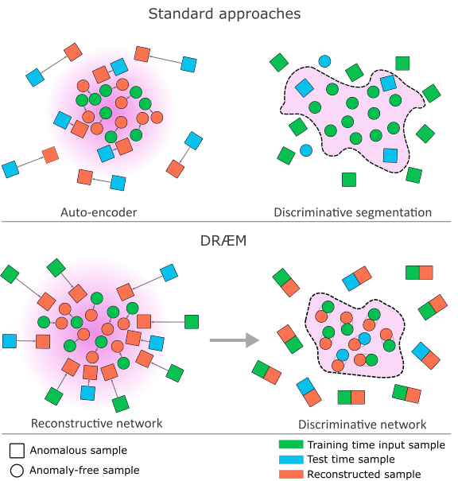
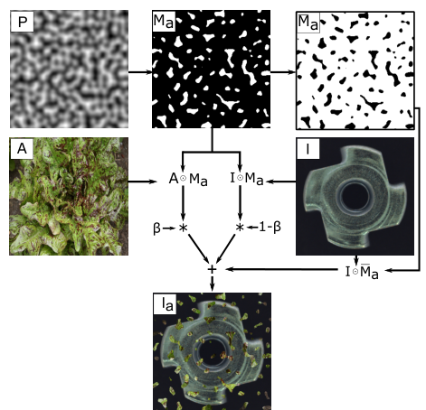

## Abstract

Surface inspection usually has to be learned from defect-free images only, because real defects are rare and expensive to annotate. The dominant recipe reconstructs the input with a model that has only seen normal data and thresholds a hand-picked difference measure, so nothing is optimised for detection itself. DRAEM turns the problem into supervised segmentation without collecting any defects: it fabricates out-of-distribution blobs on normal images, trains a reconstructive sub-network to restore the clean image, and trains a discriminative sub-network on the concatenation of the input and its restoration to output the defect mask. Because the second network sees a pair rather than an appearance, it learns a distance between "what is there" and "what should be there" instead of memorising what the fake defects look like. On MVTec AD the method reaches 98.0 image-level AUROC and 68.4 pixel-level AP, and on DAGM it comes close to fully supervised detectors.

**Keywords:** surface anomaly detection, simulated anomalies, reconstruction, discriminative segmentation, Perlin noise, MVTec AD, DAGM

## 1 Introduction

In surface anomaly detection the abnormal region covers a small share of the pixels, so anomalous images sit very close to the training distribution. That makes the task harder than whole-image outlier detection.

The authors identify two failure modes in earlier work. Autoencoders and GANs trained on normal images are supposed to fail on defects, but they generalise too well: a subtle defect is reconstructed almost faithfully and the residual is tiny. Methods that compare pretrained features, or fit a compact cluster or a Gaussian to them, share a structural limitation: <mark>they model normality only and are never trained against positives, so nothing in the pipeline is optimised for separating defects from normal texture.</mark> The obvious alternative, a segmentation network trained on synthetic defects, fails in the opposite direction: it learns the look of the fake defects and its boundary does not transfer to real ones.

The hypothesis is that both problems disappear when the discriminator sees the image together with a normality-restored version of it. It must then learn a local, appearance-conditioned notion of deviation, which a crude simulator can teach.

*Source: Zavrtanik et al., arXiv:2108.07610, Fig. 2, CC BY-NC-SA 4.0.*

## 2 Background

Two ingredients are inherited. The first is the reconstruction-residual pipeline: an encoder-decoder maps an input to a normal-looking image, and a similarity function such as SSIM, which compares local patches rather than independent pixels, turns the pair into an anomaly map. The second is the U-Net, the standard encoder-decoder with skip connections for per-pixel prediction. DRAEM keeps the first stage and replaces the fixed similarity function with a trained U-Net.

## 3 Method

> **Key idea.** Do not ask a network what a defect looks like. Ask it whether an image and its "repaired" version disagree. The answer depends on the disagreement, not on the texture of the defect, so fake defects are good enough as training data.

*Source: Zavrtanik et al., arXiv:2108.07610, Fig. 3, CC BY-NC-SA 4.0.*

### 3.1 Reconstructive sub-network

An encoder-decoder receives the corrupted image $I_a$ and must output the original clean image $I$. This is closer to inpainting than to autoencoding: the foreign region must be found implicitly and replaced with plausible normal content. The loss combines a patch-wise SSIM term with a pixel-wise $\ell_2$ term,

$$
L_{\text{SSIM}}(I, I_r) = \frac{1}{N_p}\sum_{i=1}^{H}\sum_{j=1}^{W}\Big(1 - \text{SSIM}(I, I_r)_{(i,j)}\Big), \tag{1}
$$

$$
L_{\text{rec}}(I, I_r) = \lambda\, L_{\text{SSIM}}(I, I_r) + \ell_2(I, I_r), \tag{2}
$$

where $I_r$ is the reconstruction, $H \times W$ is the image size, $N_p$ the number of pixels, $\text{SSIM}(\cdot)_{(i,j)}$ the structural similarity of the patches centred at $(i,j)$, and $\lambda$ a balancing weight.

### 3.2 Discriminative sub-network

A U-Net-like network takes the channel-wise concatenation $I_c$ of $I_r$ and the input image and outputs a score map $M_o$ of the same resolution. It is trained with a focal loss $L_{\text{seg}}$ against the known synthetic mask, which keeps the many easy background pixels from dominating. The two parts are optimised together:

$$
L(I, I_r, M_a, M) = L_{\text{rec}}(I, I_r) + L_{\text{seg}}(M_a, M), \tag{3}
$$

with $M_a$ the ground-truth synthetic mask and $M$ the predicted one. The consequence is that <mark>the similarity measure between an image and its reconstruction is learned end to end rather than hand-crafted</mark>, and the reconstructor also receives gradient from the segmentation objective.

### 3.3 Simulated anomalies

The simulator is deliberately unrealistic. Perlin noise is thresholded at a random level to obtain an irregular binary mask $M_a$. A texture image $A$ is drawn from a dataset unrelated to the inspected object, passed through three randomly chosen photometric operations (from posterize, sharpness, solarize, equalize, brightness, colour, auto-contrast), and blended into the normal image inside the mask:

$$
I_a = \overline{M}_a \odot I + (1-\beta)\,(M_a \odot I) + \beta\,(M_a \odot A), \tag{4}
$$

where $\overline{M}_a$ is the complement of the mask, $\odot$ is element-wise multiplication and the opacity $\beta$ is sampled uniformly from $[0.1, 1.0]$. Small $\beta$ produces faint, nearly in-distribution corruptions, which is what tightens the boundary around normal data. Every sample comes with a pixel-perfect label for free.

*Source: Zavrtanik et al., arXiv:2108.07610, Fig. 4, CC BY-NC-SA 4.0.*

### 3.4 Image-level score

The score map is smoothed with a mean filter $f_{s_f \times s_f}$ and its maximum is taken:

$$
\eta = \max\big(M_o * f_{s_f \times s_f}\big). \tag{5}
$$

A dedicated classification head did not do better in the authors' preliminary study.

## 4 Experiments

**Setup.** MVTec AD (15 categories), 700 epochs, learning rate $10^{-4}$ decayed by 0.1 after epochs 400 and 600, rotations of up to 45 degrees in either direction as augmentation of the normal images, and the Describable Textures Dataset (DTD) as the texture source. Detection is scored by image-level AUROC. Localisation is scored by pixel AUROC and by pixel-wise average precision (AP); the authors argue that AUROC flatters every method when defect pixels are a tiny minority.

Average results on MVTec AD (Tables 1 and 2 of the paper; localisation is AUROC / AP, and "–" means the paper does not report that number):

| Method | Detection AUROC | Localisation AUROC / AP |
|---|---|---|
| GANomaly | 78.2 | – |
| Uninformed Students (US) | 87.7 | 93.9 / 45.5 |
| RIAD | 91.7 | 94.2 / 48.2 |
| Rippel et al. (Gaussian on pretrained features) | 94.4 | – |
| PaDiM | 95.5 | 97.4 / 55.0 |
| **DRAEM** | **98.0** | 97.3 / **68.4** |

<mark>The detection gain over PaDiM is 2.5 points, but the striking number is localisation AP, 68.4 against 55.0</mark>, while pixel AUROC is essentially tied (97.3 vs 97.4). DRAEM has the best detection AUROC in 9 of 15 classes and the best AP in 11 of 15. It is weaker on transistor and cable: a missing part leaves a region that looks like ordinary background, so there is little to repair.

**Ablations (Table 3).** Removing the reconstructor and training the U-Net alone on synthetic defects gives 93.9 detection AUROC and 62.5 AP, a direct measurement of the overfitting the paper warns about. Using the reconstructor alone with an SSIM residual gives 83.9, and 90.7 with a stronger hand-crafted similarity (MSGMS). <mark>Neither half works on its own; the jump to 98.0 comes from the combination.</mark> The simulator turns out to matter surprisingly little: ImageNet textures instead of DTD give 97.9, rectangular masks instead of Perlin give 96.9, and even flat random colours give 96.2. Dropping both texture augmentation and opacity randomisation costs mainly localisation (64.3 AP); opacity randomisation alone recovers it (68.4 AP). Around 10 source textures already suffice.

**Against supervised methods.** On DAGM, a texture benchmark with faint defects, DRAEM obtains 99.0 AUROC and 98.5 classification accuracy, against 95.0 / 95.7 for PaDiM and 100 / 100 for the best fully supervised network; the weakly supervised CADN reaches 89.1 accuracy. <mark>Because DAGM's training labels are coarse ellipses, the supervised models reproduce coarse ellipses, and DRAEM's masks are qualitatively tighter</mark> although no localisation metric can be computed on this dataset.

## 5 Discussion

**Strengths.** The ablation supports the argument component by component. The method removes the most arbitrary step of reconstruction-based detection, the choice of a residual function, and outputs a genuine full-resolution mask, which explains the AP advantage. Robustness to the simulator means no domain-specific defect modelling is needed.

**Weaknesses.** The approach assumes that a defect is something *added* to a normal surface. Absent components, misplacements and other structural or logical faults do not look like a locally out-of-distribution patch, and the transistor result shows the cost. Training is heavy (700 epochs, one model per category), and both sub-networks run at full image resolution at test time.

**Not shown.** There are no runtime, memory or parameter figures, no seeds or variance, and no sensitivity study for $\lambda$ or the mean-filter size $s_f$. The text quotes a 13.4-point AP gain in the experiments section and 13.5 in the conclusion; the tables give 13.4.

## 6 Takeaways

- A discriminator trained on synthetic positives overfits to them; a discriminator trained on *(input, repaired input)* pairs learns a deviation measure and does not.
- <mark>Realism of the synthetic anomalies is nearly irrelevant; what matters is that some of them are faint</mark>, which is what the random opacity $\beta$ provides.
- Pixel AUROC hides localisation quality under heavy class imbalance. Report AP (or a region-based metric) alongside it.
- The method is a detector of *added* local structure. Missing parts and logical errors need a different mechanism, which is where the later entries in this series pick up.

## References

1. V. Zavrtanik, M. Kristan, D. Skočaj. *DRÆM – A discriminatively trained reconstruction embedding for surface anomaly detection.* ICCV 2021. arXiv:2108.07610.
2. T. Defard, A. Setkov, A. Loesch, R. Audigier. *PaDiM: a Patch Distribution Modeling Framework for Anomaly Detection and Localization.* ICPR Workshops 2020. arXiv:2011.08785.
3. P. Bergmann, M. Fauser, D. Sattlegger, C. Steger. *Uninformed Students: Student-Teacher Anomaly Detection with Discriminative Latent Embeddings.* CVPR 2020.
4. V. Zavrtanik, M. Kristan, D. Skočaj. *Reconstruction by inpainting for visual anomaly detection (RIAD).* Pattern Recognition, 2020.
5. P. Bergmann, M. Fauser, D. Sattlegger, C. Steger. *MVTec AD – A Comprehensive Real-World Dataset for Unsupervised Anomaly Detection.* CVPR 2019.
