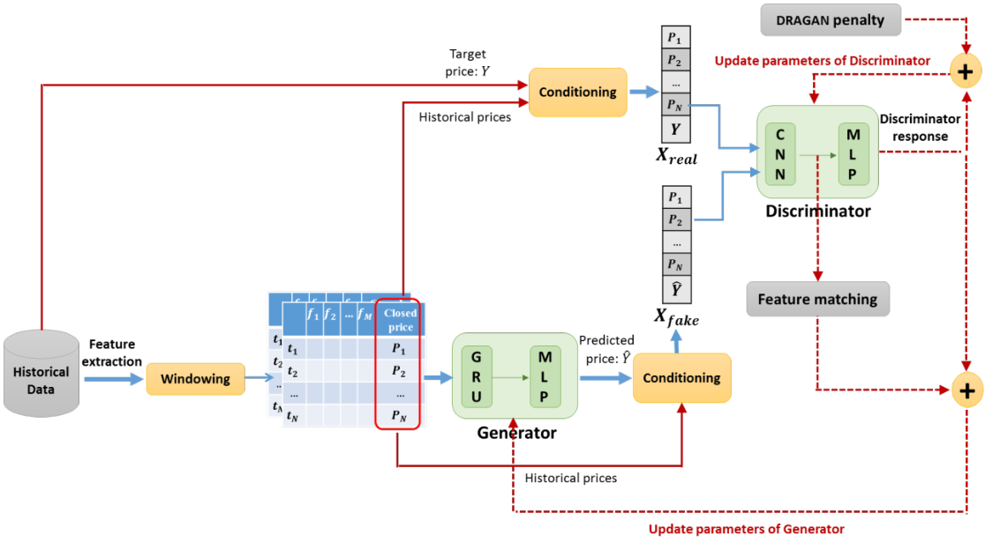
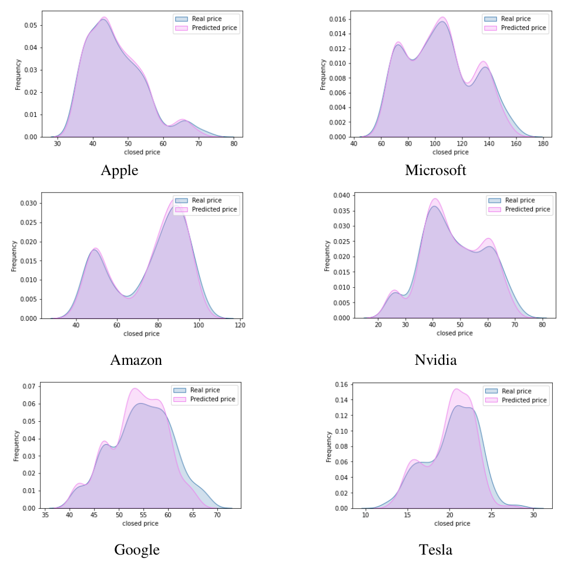
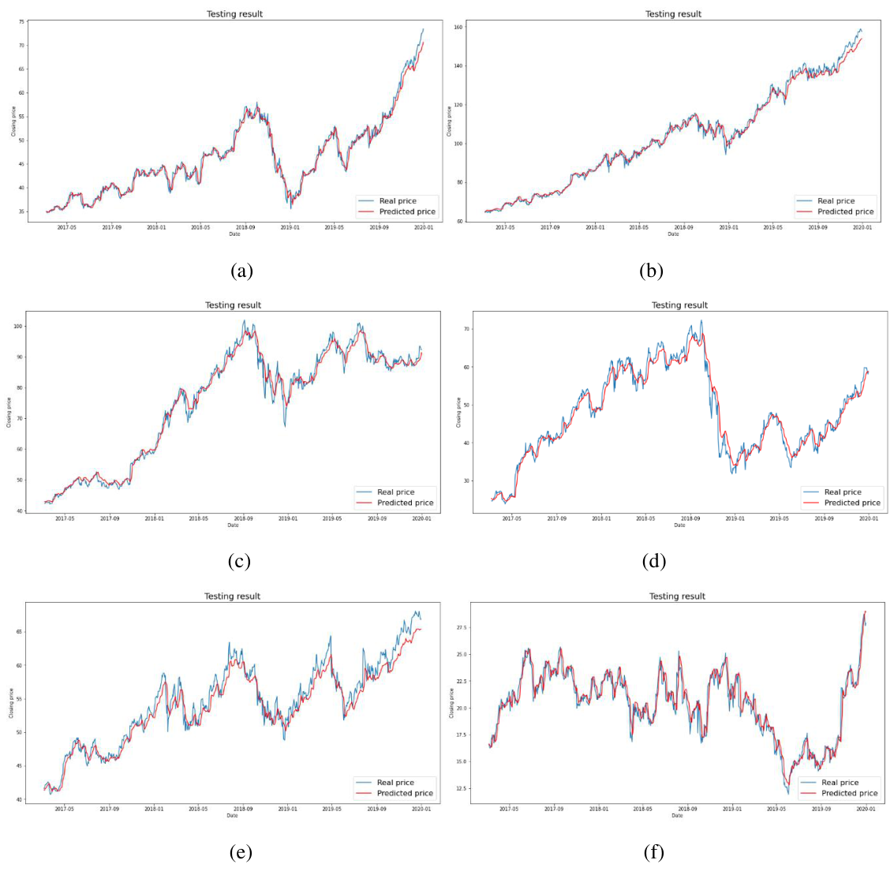

## Abstract

Shahabi Nejad and Ebadzadeh adapt adversarial training to one-step stock price forecasting. A GRU generator reads a short window of prices and technical indicators and outputs the next close. A convolutional critic scores the window of closes with either the true or the predicted next value appended. The critic is trained with a Wasserstein-style objective regularised by the DRAGAN gradient penalty, which acts near real data points, and the generator's loss adds a feature-matching term computed on an intermediate critic layer. On daily data for six large US technology stocks the model has the lowest test RMSE against WGAN-GP, a basic GAN and a bidirectional LSTM, with all GAN variants sharing the same networks. The margin is large on some stocks and negligible on others, and no naive or statistical baseline is included.

**Keywords:** stock price forecasting, generative adversarial networks, DRAGAN, gradient penalty, feature matching, conditional GAN, GRU

## 1 Introduction

GANs had been applied to stock forecasting only a handful of times when this paper was written, usually as a basic GAN or WGAN-GP with a recurrent generator and a CNN or MLP discriminator. The authors identify two groups of obstacles. The first is structural: a GAN applied naively to a time series has no mechanism for temporal dependence or for the relation between the price and its covariates. The second is generic to GANs: unstable training and mode collapse.

Their response is a combination of known parts. Windowing and conditioning address the first group; the DRAGAN penalty and feature matching address the second. <mark>The authors state that this is the first use of DRAGAN and feature matching for stock price forecasting.</mark>

## 2 Background

A basic GAN plays $\min_G \max_D \; \mathbb{E}_{x\sim P_r}[\log D(x)] + \mathbb{E}_{z}[\log(1 - D(G(z)))]$. WGAN replaces the implied Jensen–Shannon divergence with the Wasserstein-1 distance, which requires a 1-Lipschitz critic. WGAN-GP enforces that softly by penalising $(\lVert\nabla_{\hat X} D(\hat X)\rVert_2 - 1)^2$ at points $\hat X = \epsilon X_{\text{real}} + (1-\epsilon) X_{\text{fake}}$, $\epsilon \sim U[0,1]$, interpolated between real and generated samples.

DRAGAN (Kodali et al.) starts from a regret-minimisation view in which mode collapse corresponds to a bad local equilibrium where the discriminator has sharp gradients around some real samples. Its penalty is therefore applied in a noise ball around real data only. The authors prefer it because WGAN-GP's interpolation points are uninformative while the generator is still poor.

Feature matching (Salimans et al.) asks the generator to match the mean activation of an intermediate discriminator layer on real and generated batches, a smoother target than the discriminator's final output.

## 3 Method

> **Key idea.** Treat forecasting as conditional generation where the critic judges the predicted price in the context of the recent price path, and stabilise the game by penalising critic gradients only near real windows and by giving the generator a statistics-matching target.

*Source: Shahabi Nejad and Ebadzadeh, arXiv:2301.05693, Fig. 1, CC BY-NC-SA 4.0.*

### 3.1 Windowing and conditioning

A window of $N$ consecutive days, each with $M$ features, is the generator input, so the mapping is many-to-one (or many-to-many when several days are predicted). Let $P_1,\dots,P_N$ be the closes in the window, $Y$ the true next close and $\hat Y = G(\text{window})$. The critic inputs are

$$
X_{\text{real}} = [P_1,\dots,P_N,\,Y], \qquad X_{\text{fake}} = [P_1,\dots,P_N,\,\hat Y]. \tag{1}
$$

The critic therefore never sees a price in isolation. Note that the generator as described receives no noise vector: given a window it returns a single number.

### 3.2 Critic loss

$$
L_D = \mathbb{E}\big[D_\theta(X_{\text{fake}})\big] - \mathbb{E}\big[D_\theta(X_{\text{real}})\big] + \lambda_1\, \mathbb{E}_{X_{\text{real}},\,\delta \sim \mathcal{N}(0,\,cI)}\Big[\big(\lVert \nabla_X D_\theta(X_{\text{real}} + \delta)\rVert_2 - k\big)^2\Big]. \tag{2}
$$

The first two terms are the Wasserstein critic objective. In the third, $\delta$ is Gaussian noise with scale set by $c$, $k$ is the target gradient norm, and $\lambda_1$ is the penalty weight.

### 3.3 Generator loss

$$
L_G = -\,\mathbb{E}\big[D_\theta(X_{\text{fake}})\big] + \lambda_2\, \big\lVert \mathbb{E}\, f(X_{\text{real}}) - \mathbb{E}\, f(X_{\text{fake}}) \big\rVert_2^2, \tag{3}
$$

where $f(\cdot)$ is the output of a chosen intermediate critic layer and $\lambda_2$ weights feature matching. There is no explicit regression term such as MSE between $\hat Y$ and $Y$; supervision reaches the generator only through the critic. The reported settings are $\lambda_1 \approx 10$, $\lambda_2 \approx 1$, $k = 1$, $c \approx 10$, optimiser Adam.

### 3.4 Networks

Generator: two GRU layers with 256 and 128 units followed by two dense layers; the authors found GRU both faster and more accurate than LSTM in this role. Critic: three convolutional layers with 32, 64 and 128 units and two dense layers, returning a scalar score. After training only the generator is kept.

## 4 Experiments

**Setup.** Daily Yahoo Finance data, 2010 to 2020, for Apple, Microsoft, Amazon, Nvidia, Google and Tesla. Fourteen inputs: open, high, low, close, adjusted close, volume, plus 7- and 21-day moving averages, MACD, an exponential moving average, log momentum and Bollinger bands, all scaled to $[-1, 1]$. Chronological 70/30 split. The main task uses $N = 3$ days to predict the next close; the metric is RMSE, $\sqrt{\tfrac{1}{n}\sum_i (Y_i - \hat Y_i)^2}$. Baselines are a bidirectional LSTM with 128 units and, using identical windowing, conditioning and networks, a basic GAN and WGAN-GP. <mark>Because the GAN variants share architecture and inputs, differences among them isolate the loss function.</mark>

**Test RMSE, 3-to-1 prediction:**

| Stock | Proposed | WGAN-GP | Basic GAN | LSTM |
|---|---|---|---|---|
| Apple | **1.047** | 1.257 | 1.691 | 1.741 |
| Microsoft | **2.143** | 2.835 | 3.306 | 3.738 |
| Amazon | **2.068** | 2.161 | 2.121 | 2.232 |
| Nvidia | **2.124** | 2.347 | 2.591 | 2.698 |
| Google | **1.489** | 1.491 | 1.667 | 1.537 |
| Tesla | **0.826** | 0.968 | 0.955 | 1.233 |

<mark>The proposed loss wins on all six stocks, but the margin ranges from about 17–24% over WGAN-GP on Apple and Microsoft to 0.002 on Google.</mark> Training RMSE tells a less uniform story: the LSTM has the lowest training error on Google (0.518) and Tesla (0.427), and the basic GAN on Microsoft and Amazon, so the adversarial variants are not simply fitting harder.

**Apple, window of 10 days, test RMSE by horizon:**

| Method | 10→1 | 10→2 | 10→3 | 10→5 |
|---|---|---|---|---|
| **Proposed** | **1.133** | **1.561** | **1.625** | **1.715** |
| WGAN-GP | 1.438 | 1.727 | 1.904 | 2.081 |
| Basic GAN | 1.821 | 1.934 | 1.996 | 2.271 |
| LSTM | 1.311 | 1.716 | 1.880 | 2.234 |

With the longer window the LSTM moves into second place at every horizon except five days, which the authors interpret as the LSTM handling longer dependencies better than the two baseline GANs.

*Source: Shahabi Nejad and Ebadzadeh, arXiv:2301.05693, Fig. 3, CC BY-NC-SA 4.0.*

*Source: Shahabi Nejad and Ebadzadeh, arXiv:2301.05693, Fig. 4, CC BY-NC-SA 4.0.*

The authors also tabulate earlier GAN forecasters but caution that features, code and time frames differ. That summary table lists their Apple result as 1.044, whereas the main table gives 1.047.

## 5 Discussion

**Strengths.** The comparison among GAN losses is controlled, which is uncommon in this niche: same generator, same critic, same conditioning. The two regularisers are cheap, well motivated and easy to reproduce from the equations.

**Weaknesses.** <mark>There is no random-walk baseline.</mark> For daily closes, predicting tomorrow's price as today's is the reference that any level-forecasting model must beat, and RMSE in price units on trending stocks is dominated by that persistence. The test-set plots in Figure 3 look like a smoothed and slightly delayed copy of the real series, which is what near-persistence forecasts look like; without the naive number it is impossible to say how much skill remains. No directional accuracy, return-based metric or trading evaluation is given.

The density comparison in Figure 2 is of price *levels* pooled over the test period. Any forecast that tracks the level closely will reproduce that histogram, so it says little about whether the model has learned a distribution. This links to a more basic point: with no latent noise input, the generator is a deterministic regressor and the critic functions as a learned loss. Calling the result a generative model of prices is a stretch; the GAN vocabulary of mode collapse applies only loosely.

Other gaps: a single split and apparently a single run, with no variance across seeds even though GAN training is noisy and the Google margin is in the third decimal; hyperparameters are given as approximate optimal values without a described validation set, leaving open whether they were tuned on test data; no ablation separates the DRAGAN penalty from feature matching; all six stocks are large US technology names in a decade-long uptrend.

## 6 Takeaways

- Swapping WGAN-GP's interpolation penalty for DRAGAN's near-data penalty and adding feature matching is a low-cost change that lowered test RMSE on every stock tried here.
- The benefit is inconsistent, from roughly a fifth on Apple and Microsoft to nothing measurable on Google, with no uncertainty estimates.
- An adversarial loss without a noise input yields a point forecaster. If the aim is a predictive distribution, the generator needs a stochastic input and the evaluation needs distributional scores (CRPS, quantile coverage, tail metrics) on returns.
- For work on diffusion or other stochastic generative models of financial series, the paper is mainly useful as a checklist of what to avoid: evaluate on returns or increments, include the random walk, and test distributional claims on conditional distributions, not on pooled price levels. The conditioning trick of showing the critic the recent path is the transferable idea, and it mirrors how conditional diffusion models consume history.

## References

1. F. Shahabi Nejad, M. M. Ebadzadeh. *Stock market forecasting using DRAGAN and feature matching*. arXiv:2301.05693, 2023.
2. N. Kodali, J. Abernethy, J. Hays, Z. Kira. *On convergence and stability of GANs*. arXiv:1705.07215, 2017.
3. T. Salimans et al. *Improved techniques for training GANs*. NeurIPS 2016.
4. I. Gulrajani et al. *Improved training of Wasserstein GANs*. NeurIPS 2017.
5. M. Mirza, S. Osindero. *Conditional generative adversarial nets*. arXiv:1411.1784, 2014.
