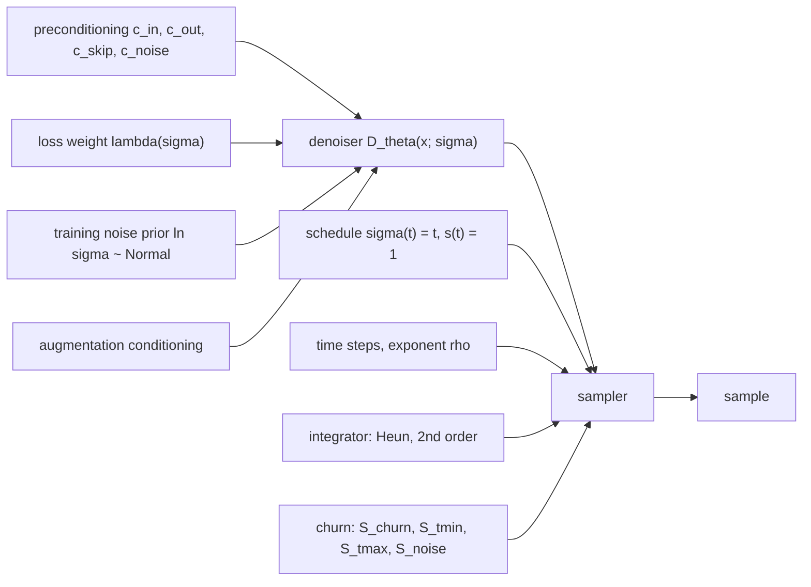

## Abstract

By 2022 the diffusion literature had several families — VP, VE, DDPM/iDDPM, DDIM — that each arrived as a bundle: one SDE, one sampler, one network parameterisation, one loss. Karras et al. argue the bundling is an artefact of how each was derived rather than a necessity. They rewrite all of them in one notation centred on a denoiser $D(x;\sigma)$ and the noise level $\sigma$, turning the differences into entries of a table of independent choices, then improve each entry on its own: a Heun solver, a polynomial spacing of noise levels, the schedule $\sigma(t)=t$ with no signal scaling, an explicit "churn" step, a first-principles preconditioning, and a log-normal prior over training noise levels. The result is class-conditional CIFAR-10 FID 1.79 at 35 network evaluations and ImageNet-64 FID 1.36. Just as interesting, dropping the new sampler into three networks the authors did not train cuts the evaluations needed for near-best quality by 3.2× to 300×.

**Keywords:** diffusion models, denoising score matching, probability-flow ODE, Heun solver, noise-level discretisation, network preconditioning, stochastic sampling

## 1 Introduction

The paper opens with a complaint I find fair. Diffusion papers are heavy on theory, and each derivation fixes the noise schedule, the network parameterisation and the training weights in one go, so a reader comes away believing that touching any one component would break the convergence argument for the whole. That belief blocks engineering progress, because nobody runs the clean ablation.

The authors take the opposite stance: look at the objects that actually exist at training and sampling time — a network, a list of noise levels, a numerical integrator — and ask which may vary freely. <mark>Their claim is that the components are mutually independent: any reasonable choice for one still yields a functioning model, so each can be optimised separately.</mark>

Where prior work fell short is specific. [Score-SDE](/blog/score-sde/) discretises its SDE on a uniform grid in $t$, chosen for convenience rather than from an error analysis; [DDIM](/blog/ddim/) is deterministic but inherits DDPM's $\bar\alpha_t$ grid; [Improved DDPM](/blog/improved-ddpm/) tunes the variance schedule while keeping $\epsilon$-prediction and $1/\sigma^2$ weighting. None asks what the integration problem looks like when the network is simply a black box.

## 2 Background

Let $p(x;\sigma)$ be the data density blurred by isotropic Gaussian noise of standard deviation $\sigma$, and $\sigma_{\text{data}}$ the standard deviation of the data. For $\sigma_{\max}\gg\sigma_{\text{data}}$, $p(x;\sigma_{\max})$ is indistinguishable from pure noise; sampling means starting there and walking down a ladder $\sigma_0=\sigma_{\max}>\dots>\sigma_N=0$ while keeping $x_i\sim p(x_i;\sigma_i)$. The probability-flow ODE does this deterministically, with a freely chosen schedule $\sigma(t)$:

$$
\mathrm{d}x = -\dot\sigma(t)\,\sigma(t)\,\nabla_x \log p\big(x;\sigma(t)\big)\,\mathrm{d}t. \tag{1}
$$

The score comes from the $L_2$-optimal denoiser $D(x;\sigma)$, which recovers a clean image $y$ from $y+n$, $n\sim\mathcal N(0,\sigma^2I)$:

$$
\nabla_x \log p(x;\sigma) = \frac{D(x;\sigma) - x}{\sigma^2}. \tag{2}
$$

Both identities are standard and are covered in the [NCSN](/blog/ncsn/) and [DDPM](/blog/ddpm/) notes. Some formulations also rescale the state, $x=s(t)\hat x$; Appendix B.2 carries $s(t)$ through a generalised ODE and reaches a punchline worth stating plainly: <mark>every realisation of the probability-flow ODE is a reparameterisation of one canonical ODE — changing $\sigma(t)$ reparameterises $t$, changing $s(t)$ reparameterises $x$.</mark> VP, VE and iDDPM+DDIM then become three columns of one table listing solver, time steps, $\sigma(t)$, $s(t)$, four preconditioning functions, the training noise distribution and the loss weight ([Table 1 in the paper](https://arxiv.org/pdf/2206.00364#page=3)).

## 3 Method

> **Key idea.** Treat the trained denoiser as a black box and the sampler as a numerical-analysis problem; treat the network as a regression problem whose inputs and targets should have unit variance at every noise level. Neither problem needs to know how the other was solved.



### 3.1 The sampler as a numerical problem

Three changes, each tested on pre-trained VP, VE and ADM (ImageNet-64) networks that the authors did not retrain.

*Solver.* Euler has local truncation error $O(h^2)$ per step; Heun's method — one Euler step plus a trapezoidal correction using the derivative at the arrival point — costs one extra denoiser call and reaches $O(h^3)$, with the final step to $\sigma=0$ reverting to Euler to avoid dividing by zero. Appendix D.2 places Heun in a two-stage family indexed by where the second evaluation is taken, finds $\alpha=1$ near-optimal, and reports without explanation that $\alpha=1.1$ was slightly better despite overshooting. Heun's second evaluation lands exactly on $t_{i+1}$, which is what lets it drive networks trained on a discrete set of noise levels.

*Time steps.* The noise levels are a polynomial warp,

$$
\sigma_{i<N} = \Big(\sigma_{\max}^{1/\rho} + \tfrac{i}{N-1}\big(\sigma_{\min}^{1/\rho} - \sigma_{\max}^{1/\rho}\big)\Big)^{\rho}, \qquad \sigma_N = 0, \tag{3}
$$

with $\sigma_{\min}=0.002$, $\sigma_{\max}=80$. Larger $\rho$ shortens the steps near the data at the cost of longer ones at high noise; $\rho=1$ is uniform, $\rho\to\infty$ approaches the original VE grid. Appendix D.1 measures the local error directly — one large step against 200 small ones — and reports two numbers the main text compresses into one: with Euler the error is roughly balanced at $\rho\approx2$ but stays near RMSE $0.03$, whereas **with Heun it is almost flat at RMSE $0.0030$–$0.0045$ for $\rho=3$**. The error is nearly independent of $x_{i-1}$, so no per-sample schedule is needed. FID nevertheless improves past $\rho=3$: the sweep is catastrophic at $\rho\le2$, falls sharply between 3 and 5, and is flat from 5 to 10, so $\rho=7$ is a plateau choice, not a sharp optimum. Errors near the data cost more perceptually than errors far from it.

*Schedule.* $\sigma(t)=t$ and $s(t)=1$, the pair implicit in DDIM, collapse Eq. (1) to

$$
\frac{\mathrm{d}x}{\mathrm{d}t} = \frac{x - D(x;t)}{t}. \tag{4}
$$

A single Euler step from any $(x,t)$ to $t=0$ returns exactly $D(x;t)$, so <mark>the tangent of the trajectory always points at the current denoiser output</mark>; since that output changes slowly with noise level, the trajectories are close to straight, which is precisely what a fixed-step solver wants. A 1-D sketch contrasting the bent VP and VE paths with the near-linear ones is [Fig. 3 in the paper](https://arxiv.org/pdf/2206.00364#page=6).

### 3.2 Intuition: exactly Gaussian data

The curvature claim can be checked by hand; the calculation below is mine, not the paper's. Take $p_{\text{data}}=\mathcal N(0,\sigma_{\text{data}}^2)$ in one dimension, so $p(x;\sigma)=\mathcal N(0,\sigma^2+\sigma_{\text{data}}^2)$ and the optimal denoiser is the linear shrinkage $D(x;\sigma)=\frac{\sigma_{\text{data}}^2}{\sigma^2+\sigma_{\text{data}}^2}x$. Substituting into Eq. (4),

$$
\frac{\mathrm{d}x}{\mathrm{d}t} = \frac{x}{t}\left(1-\frac{\sigma_{\text{data}}^2}{t^2+\sigma_{\text{data}}^2}\right) = \frac{t\,x}{t^2+\sigma_{\text{data}}^2}
\quad\Longrightarrow\quad
x(t) = x(t_0)\,\frac{\sqrt{t^2+\sigma_{\text{data}}^2}}{\sqrt{t_0^2+\sigma_{\text{data}}^2}}. \tag{5}
$$

The trajectory is *exactly* linear in $u=\sqrt{t^2+\sigma_{\text{data}}^2}$. Since $u\approx t$ for $t\gg\sigma_{\text{data}}$ and $u\approx\sigma_{\text{data}}$ for $t\ll\sigma_{\text{data}}$, the path is a straight ray at high noise, flat at low noise, and all curvature in $t$ sits in a band around $t\approx\sigma_{\text{data}}$: <mark>with $\sigma(t)=t$ the hard part of the integration is the single octave near the data scale</mark>. VE's $\sqrt t$ and VP's exponential schedule reparameterise $t$ and smear that curvature across the whole trajectory, which is why they need far more steps.

The same example previews §3.4: for Gaussian data the ideal denoiser *is* $c_{\text{skip}}(\sigma)\,x$, so a network initialised to output zero is already optimal. EDM's parameterisation hands the Gaussian part of the problem to closed form and asks the network only for the deviation from it.

### 3.3 Stochastic sampling

From the heat equation plus Fokker–Planck, Appendix B.5 derives a family of SDEs sharing the marginals $p(x;\sigma(t))$: the probability-flow ODE plus a Langevin term,

$$
\mathrm{d}x_{\pm} = \underbrace{-\dot\sigma\sigma\,\nabla_x\log p\,\mathrm{d}t}_{\text{probability-flow ODE}}
\;\underbrace{\pm\;\beta(t)\sigma^2\,\nabla_x\log p\,\mathrm{d}t \;+\; \sqrt{2\beta(t)}\,\sigma\,\mathrm{d}\omega_t}_{\text{Langevin: remove noise, add noise}}. \tag{6}
$$

The two Langevin pieces cancel in expectation, so $\beta(t)$ is nothing but the *rate at which existing noise is replaced by fresh noise*. That explains why stochasticity helps — the Langevin part drags the sample back toward the correct marginal, repairing earlier integration error — and why the $\beta(t)=\dot\sigma/\sigma$ baked into Song et al.'s SDEs has no privileged status: it is the choice that makes the score term vanish from the *forward* SDE, a notational convenience rather than a property of the sampler.

The sampler therefore alternates explicit sub-steps instead of taking one Euler–Maruyama update: raise the noise level from $t_i$ to $\hat t_i=t_i+\gamma_i t_i$ by injecting fresh noise, then take one Heun step down to $t_{i+1}$, evaluating the denoiser at the state *after* injection — immaterial as $\Delta t\to0$, significant at low step counts. Four knobs control the churn: $\gamma_i=S_{\text{churn}}/N$ inside a window $[S_{t\min},S_{t\max}]$ and zero outside, clamped at $\sqrt2-1$, exactly where the injected variance $\hat t_i^2-t_i^2=t_i^2\big((1+\gamma_i)^2-1\big)$ equals the noise already present; plus $S_{\text{noise}}$, slightly above 1 to inflate the injected standard deviation. The justification is a hypothesis, not a result: a learned $D_\theta$ probably induces a slightly non-conservative vector field and removes a little too much noise — the regression to the mean any $L_2$-trained denoiser exhibits. The evidence is indirect: analytic denoisers show no such degradation.

### 3.4 Preconditioning, derived

The denoiser wraps a raw network $F_\theta$, and rewriting the weighted denoising loss in terms of $F_\theta$ is pure algebra:

$$
D_\theta(x;\sigma) = c_{\text{skip}}(\sigma)\,x + c_{\text{out}}(\sigma)\,F_\theta\big(c_{\text{in}}(\sigma)\,x;\ c_{\text{noise}}(\sigma)\big), \tag{7}
$$

$$
\mathbb{E}_{\sigma,y,n}\Big[\underbrace{\lambda(\sigma)c_{\text{out}}(\sigma)^2}_{\text{effective weight }w(\sigma)}\;\big\lVert F_\theta\big(c_{\text{in}}(y+n);c_{\text{noise}}\big)-\underbrace{\tfrac{1}{c_{\text{out}}}\big(y-c_{\text{skip}}(y+n)\big)}_{\text{effective target}}\big\rVert_2^2\Big]. \tag{8}
$$

Four requirements then pin down four functions, in this order.

1. *Unit-variance input.* $\operatorname{Var}[c_{\text{in}}(y+n)]=1$ with $y\perp n$ gives $c_{\text{in}}^2(\sigma_{\text{data}}^2+\sigma^2)=1$.
2. *Unit-variance target.* The target is $\big[(1-c_{\text{skip}})y-c_{\text{skip}}n\big]/c_{\text{out}}$, so $c_{\text{out}}^2=(1-c_{\text{skip}})^2\sigma_{\text{data}}^2+c_{\text{skip}}^2\sigma^2$ — one equation, two unknowns.
3. *Minimal error amplification.* The remaining freedom minimises $c_{\text{out}}$, since the network's error reaches the output multiplied by it. The problem is convex in $c_{\text{skip}}$, and zeroing the derivative gives $(\sigma^2+\sigma_{\text{data}}^2)c_{\text{skip}}=\sigma_{\text{data}}^2$, closing the system:

$$
c_{\text{in}} = \frac{1}{\sqrt{\sigma^2+\sigma_{\text{data}}^2}},\quad
c_{\text{skip}} = \frac{\sigma_{\text{data}}^2}{\sigma^2+\sigma_{\text{data}}^2},\quad
c_{\text{out}} = \frac{\sigma\,\sigma_{\text{data}}}{\sqrt{\sigma^2+\sigma_{\text{data}}^2}}. \tag{9}
$$

4. *Flat effective weight.* $w(\sigma)=\lambda(\sigma)c_{\text{out}}(\sigma)^2\overset{!}{=}1$ gives $\lambda(\sigma)=1/c_{\text{out}}(\sigma)^2=(\sigma^2+\sigma_{\text{data}}^2)/(\sigma\sigma_{\text{data}})^2$.

Steps 1–4 are exact given two assumptions: $y$ has per-coordinate variance $\sigma_{\text{data}}^2$, and $y\perp n$. Only $c_{\text{noise}}(\sigma)=\tfrac14\ln\sigma$ is empirical, and the paper says so. Appendix B.6 verifies a pleasant consequence: with a zero-initialised output layer the loss equals exactly $1$ at every $\sigma$ at initialisation, so the per-$\sigma$ loss curve reads as "fraction of the Gaussian baseline still unexplained". At the limits, $\sigma\to0$ gives $c_{\text{skip}}\to1$, $c_{\text{out}}\to\sigma$ and the network effectively predicts noise; $\sigma\to\infty$ gives $c_{\text{skip}}\to0$, $c_{\text{out}}\to\sigma_{\text{data}}$ and it predicts the clean signal. Pure $\epsilon$-prediction keeps $c_{\text{out}}=\pm\sigma$ throughout, so at large $\sigma$ the network must cancel a huge noise vector almost exactly, every error multiplied by $\sigma$.

The last training axis is $p_{\text{train}}(\sigma)$. The per-$\sigma$ loss after training falls only in a band of intermediate noise — at tiny $\sigma$ the noise is imperceptible, at huge $\sigma$ the answer is the dataset mean regardless of input — so $\ln\sigma\sim\mathcal N(P_{\text{mean}},P_{\text{std}}^2)$ with $P_{\text{mean}}=-1.2$, $P_{\text{std}}=1.2$, <mark>concentrating gradient steps on the only region where the loss can actually fall</mark>. Geometric augmentation is applied before the noise, its 8 parameters fed in as a 9-dimensional conditioning vector and zeroed at inference so augmentations cannot leak into samples.

### 3.5 Algorithm

```text
TRAIN  (denoiser D_theta built from raw net F_theta)
  repeat:
    y            <- minibatch of images in [-1, 1]
    y, a         <- augment(y)                     # 8 random geometric params -> 9-dim vector a
    ln_sigma     <- Normal(P_mean = -1.2, P_std = 1.2)      # one sigma per example
    sigma        <- exp(ln_sigma)
    n            <- Normal(0, sigma^2 I)
    c_in         <- 1 / sqrt(sigma^2 + sd^2)               # sd = sigma_data = 0.5
    c_skip       <- sd^2 / (sigma^2 + sd^2)
    c_out        <- sigma * sd / sqrt(sigma^2 + sd^2)
    target       <- (y - c_skip * (y + n)) / c_out         # unit variance by construction
    loss         <- mean( ( F_theta(c_in * (y + n), 0.25 * ln_sigma, a, class) - target )^2 )
    Adam step; update EMA copy of theta                    # effective weight is 1, so no lambda here

SAMPLE  (Heun + churn; sigma(t) = t, so t and sigma are the same variable)
  sigma[i] = ( smax^(1/rho) + i/(N-1) * ( smin^(1/rho) - smax^(1/rho) ) )^rho  for i < N ;  sigma[N] = 0
  x <- Normal(0, sigma[0]^2 I)
  for i = 0 .. N-1:
    g    <- min(S_churn / N, sqrt(2) - 1)  if  S_tmin <= sigma[i] <= S_tmax  else  0
    s_hat<- sigma[i] * (1 + g)
    x    <- x + sqrt(s_hat^2 - sigma[i]^2) * Normal(0, S_noise^2 I)      # churn up
    d    <- (x - D_theta(x, s_hat)) / s_hat
    x_e  <- x + (sigma[i+1] - s_hat) * d                                  # Euler step
    if sigma[i+1] != 0:
      d2 <- (x_e - D_theta(x_e, sigma[i+1])) / sigma[i+1]
      x  <- x + (sigma[i+1] - s_hat) * (d + d2) / 2                       # trapezoidal correction
    else:
      x  <- x_e
  return x
```

Setting `S_churn = 0` recovers the deterministic sampler exactly. Either way NFE is $2N-1$, because only the final step is first-order.

## 4 Implementation notes

All values as reported in Appendix F.

| Item | CIFAR-10 $32^2$ (ours) | FFHQ / AFHQv2 $64^2$ (ours) | ImageNet $64^2$ (ours) |
|---|---|---|---|
| GPUs | 8 V100 | 8 V100 | 32 Ampere |
| Duration | 200 Mimg (~400k iters) | 200 Mimg | 2500 Mimg (~600k iters) |
| Minibatch | 512 | 256 | 4096 |
| Learning rate | $10^{-3}$ | $2\times10^{-4}$ | $10^{-4}$ |
| LR ramp-up | 10 Mimg | 10 Mimg | 10 Mimg |
| EMA half-life | 0.5 Mimg | 0.5 Mimg | 50 Mimg |
| Dropout | 13% | 5% (FFHQ) / 25% (AFHQv2) | 10% |
| Gradient clipping | off | off | off |
| Mixed precision | off | off | FP16 except embeddings and attention |
| Channels per resolution | 2-2-2 ($\times128$) | 1-2-2-2 ($\times128$) | 1-2-3-4 ($\times192$), ADM unchanged |
| Parameters | ~56M | ~62M | ~296M |
| Augmentation prob. | 12% (x-flip always on) | 15% | none |
| Dataset x-flips | off | off | off |
| Wall clock | ~2 days | ~4 days | ~2 weeks |

Stochastic-sampler parameters were found by grid search per model (Table 5): CIFAR-10 VP $\{30,0.01,1,1.007\}$, VE $\{80,0.05,1,1.007\}$, pre-trained ImageNet $\{80,0.05,50,1.003\}$, their own ImageNet model $\{40,0.05,50,1.003\}$, in the order $\{S_{\text{churn}},S_{t\min},S_{t\max},S_{\text{noise}}\}$.

Easy to get wrong when reproducing:

- **The sampler runs in float64, the network in float32.** With $\sigma$ spanning $0.002$ to $80$, round-off is not negligible.
- **$\sigma_{\text{data}}=0.5$ presumes images in $[-1,1]$** — a fixed constant, not measured per dataset.
- **Discrete-noise-level networks need three patches.** For ADM: round every $\sigma_i$ to the nearest supported $u_j$; set $\sigma_{\min}=0.0064$; skip $u_{j<8}$ (they exceed $\sigma_{\max}=80$) by starting the DDIM resampling at $j_0=8$. The last of these, not the solver, explains most of the gap between the original DDIM curve and the authors' reimplementation.
- **EMA is a half-life in images, not a per-step decay**, so it does not transfer across batch sizes.
- **Augmentation conditioning must be zeroed at inference**; x-flip runs at 100% probability while dataset-level x-flips are off.
- **FID protocol.** 50k samples against all real images, no flips, the StyleGAN3 Inception-v3 port, computed three times with the **minimum** reported and run-to-run variation around ±2%. Not stated: how many training seeds stand behind each Table 2 entry.

## 5 Experiments

**Setup.** Sampler improvements are validated on three externally trained networks; training improvements are measured with the deterministic sampler only, at NFE 35 for $32^2$ and 79 for $64^2$, so sampler tuning cannot confound the comparison. That separation is the paper's methodological highlight.

**Table 3 of the paper — deterministic sampling.** "NFE" is the lowest budget whose FID is within 3% of that row's best.

| Sampling method | CIFAR-10 VP: FID / NFE | CIFAR-10 VE: FID / NFE | ImageNet-64: FID / NFE |
|---|---|---|---|
| Original sampler | 2.85 / 256 | 5.45 / 8192 | 2.85 / 250 |
| Our reimplementation (Alg. 1) | 2.79 / 512 | 4.78 / 8192 | 2.73 / 384 |
| + Heun & our $\{t_i\}$ | 2.88 / 255 | 4.23 / 191 | **2.64 / 79** |
| + our $\sigma(t)$, $s(t)$ | 2.93 / **35** | **3.73 / 27** | – |
| Black-box RK45 | 2.94 / 115 | 3.69 / 93 | 2.66 / 131 |

**Table 4 of the paper — stochastic sampling.**

| Sampling method | CIFAR-10 VP | CIFAR-10 VE | ImageNet-64 |
|---|---|---|---|
| Deterministic baseline | 2.93 / 35 | 3.73 / 27 | 2.64 / 79 |
| Churn, no $S_{t\min,t\max}$, no $S_{\text{noise}}$ | 2.69 / 95 | 2.97 / 383 | 1.86 / 383 |
| Churn, no $S_{t\min,t\max}$ | 2.54 / 127 | 2.51 / 511 | 1.63 / 767 |
| Churn, no $S_{\text{noise}}$ | 2.52 / 95 | 2.84 / 191 | 1.84 / 255 |
| **Churn, optimal settings** | **2.27** / 383 | **2.23** / 767 | **1.55** / 511 |
| Previous work's stochastic samplers | 2.55 / 768 | 2.46 / 1024 | 2.01 / 384 |

**Table 2 of the paper — training ablation (FID; VP and VE columns).**

| Training configuration | C10 cond. VP / VE | C10 uncond. VP / VE | FFHQ-64 VP / VE | AFHQv2-64 VP / VE |
|---|---|---|---|---|
| A Baseline (Song et al.) | 2.48 / 3.11 | 3.01 / 3.77 | 3.39 / 25.95 | 2.58 / 18.52 |
| B + adjusted hyperparameters | 2.18 / 2.48 | 2.51 / 2.94 | 3.13 / 22.53 | 2.43 / 23.12 |
| C + redistributed capacity | 2.08 / 2.52 | 2.31 / 2.83 | 2.78 / 41.62 | 2.54 / 15.04 |
| D + EDM preconditioning | 2.09 / 2.64 | 2.29 / 3.10 | 2.94 / 3.39 | 2.79 / 3.81 |
| E + EDM loss weight & noise prior | 1.88 / 1.86 | 2.05 / 1.99 | 2.60 / 2.81 | 2.29 / 2.28 |
| **F + non-leaky augmentation** | **1.79 / 1.79** | **1.97 / 1.98** | **2.39 / 2.53** | **1.96 / 2.16** |

**Claim-by-claim reading.**

- *Sampling choices are independent of training.* Supported in a specific sense: the improvements transfer to three networks trained under three different theories, but the gain is almost entirely in **NFE, not FID**. For VP the best FID drifts from 2.79 to 2.93 while NFE falls from 512 to 35 — the same quality an order of magnitude cheaper, not better images. VE is the exception (FID 4.78 → 3.73 *and* NFE down 300×), because its geometric grid and $\sqrt t$ schedule were badly matched to the problem.
- *Heun and $\rho=7$.* Heun beats Euler per unit compute in all three models, and adaptive RK45 lands at similar FID with 2–4× the NFE, so the win is second order, not higher order. The $\rho$ sweep supports 7 only weakly: the curve is flat over $5\le\rho\le10$ while the appendix's own error analysis points at 3, so the choice is perceptual rather than numerical.
- *Preconditioning improves robustness rather than FID.* The weakest-supported claim, and the framing is post hoc. In config D preconditioning alone makes VP **worse** on three of four datasets (FFHQ 2.78 → 2.94, AFHQv2 2.54 → 2.79) while rescuing VE at $64^2$ (FFHQ 41.62 → 3.39, AFHQv2 15.04 → 3.81). "Robustness" interprets that asymmetry; no robustness quantity is measured.
- *Loss weighting and noise prior are the main training win.* Supported and large — in the CIFAR-10 VE columns it is the biggest single step in Table 2 (conditional 2.64 → 1.86, unconditional 3.10 → 1.99). But config E changes $\lambda(\sigma)$ **and** $p_{\text{train}}(\sigma)$ together, so their contributions are not separated.
- *"VP vs VE" was never the important distinction.* Nearly supported. By config F the two agree exactly on CIFAR-10 (1.79 / 1.79 conditional, 1.97 / 1.98 unconditional), but a gap survives at $64^2$: FFHQ 2.39 vs 2.53, AFHQv2 1.96 vs 2.16. Since configs E–F leave only the architecture differing (DDPM++ vs NCSN++), that residual is an architecture effect rather than a VP/VE one — which strengthens the thesis while showing the columns do not quite coincide.
- *Stochasticity compensates for model error.* Half supported. On CIFAR-10 the reversal is clean: churn helps the original training and hurts EDM training at any level. On ImageNet-64 it does not reverse — the retrained model still improves from FID 2.22 at $S_{\text{churn}}=0$ to <mark>1.36 near $S_{\text{churn}}=40$, and the pre-trained ADM network from 2.64 to 1.55 (Table 4)</mark>. The authors' own wording, that more diverse datasets keep benefiting, is the defensible version.
- *New state of the art.* CIFAR-10 1.79 / 1.97 against previous records of 1.85 and 2.10; ImageNet-64 1.36 against 1.48. These are published numbers from different architectures and budgets, and each FID is the minimum of three evaluations of a best-of-training checkpoint, so small margins should not be over-read.

## 6 Limitations

**Stated by the authors**

- Many constants ($\rho$, $P_{\text{mean}}$, $P_{\text{std}}$, the churn parameters) may need re-tuning at higher resolution; everything here is $\le64^2$.
- The stochastic sampler needs a four-parameter grid search per model, and the authors warn that evaluating models through a tuned stochastic sampler risks biasing architecture and training decisions.
- The non-conservative-field explanation for detail loss and colour drift is a suspicion, and the two failure modes respond to different heuristics, suggesting more than one cause.
- The interaction between stochastic sampling and the training objective is open, as is whether adaptive solvers can beat a tuned fixed schedule.
- The project consumed about 250 MWh.

**My reading**

- Configs B and C each bundle several changes — GPU count, batch size, learning rate, gradient clipping, EMA half-life, dropout, capacity redistribution — so two of the five configuration steps are not clean ablations. Config F confounds two more: augmentation on, dataset x-flips off.
- The unit-variance derivation treats each coordinate as a scalar of variance $\sigma_{\text{data}}^2$ and ignores the correlation structure of images. That is why it ports so easily to other modalities, and why it says nothing about *which* $\sigma$ carries the structure of a given dataset.
- $c_{\text{noise}}=\tfrac14\ln\sigma$ is the one preconditioning function with no argument behind it, and the one that interacts with the network's noise embedding.
- FID is the only metric. No likelihood, no precision/recall, no text conditioning, no latent space, nothing above $64^2$.
- Orthogonality is demonstrated over three networks from two labs, and asserted for "any choices within reason" — a qualifier doing real work.

## 7 Extensions

**What was built on this**

- [Consistency models](/blog/consistency-models/) adopt EDM's $\sigma$ grid, preconditioning form and $\sigma(t)=t$ wholesale, then learn to jump along the same ODE trajectory in one step.
- [Rectified Flow](/blog/rectified-flow/) and [Flow Matching](/blog/flow-matching/) attack the curvature problem from the other end: rather than pick a schedule that makes trajectories nearly straight, they train so that they are straight by construction. §3.2 above is the diffusion-side statement of the same idea.
- [SD3](/blog/sd3-rectified-flow-transformers/) samples training timesteps from a logit-normal distribution — the flow-matching analogue of EDM's log-normal $p_{\text{train}}(\sigma)$ — and compares schedules in exactly this factorised style.
- DPM-Solver and progressive distillation push the NFE axis further. The Heun-plus-$\rho$-grid sampler became a default in open-source diffusion codebases, and the same group later reworked the network's internal normalisation on the same "get the magnitudes right" principle.

**Open problems**

- What stochasticity is actually fixing: the need for it vanishes on CIFAR-10 but not on ImageNet-64, and the underlying model error is never measured.
- Whether the non-conservativity of $D_\theta$ can be measured directly, and whether penalising it in training would remove the need for $S_{\text{noise}}$ and $S_{t\min}$.
- How the constants scale with resolution and modality; flagged but untested.
- Whether an error-balanced grid ($\rho=3$) plus an explicit perceptual weighting beats the ad-hoc $\rho=7$.

**Research directions**

*These are ideas, not results — none has been run.*

1. **Per-$\sigma$ loss profiling as schedule design for return series.** *Hypothesis:* $P_{\text{mean}}=-1.2$, $P_{\text{std}}=1.2$ encodes where image structure lives; for daily log-returns the learnable band sits elsewhere, and fitting $p_{\text{train}}$ to the measured loss curve beats transplanting image constants. *Data:* daily log-returns of index constituents, standardised so $\sigma_{\text{data}}=0.5$ holds by construction. *Baseline:* the same network with EDM's constants, and with a uniform $\ln\sigma$ prior. *Metric:* the per-$\sigma$ final loss itself, plus 1% and 5% VaR/ES backtest error and the ACF of squared returns, with [Quant GANs](/blog/quant-gans/) and [Tail-GAN](/blog/tail-gan/) as references. *Likely failure mode:* the loss curve is flat because a standardised return series has little multi-scale structure, and the fitted prior degenerates to uniform.
2. **Churn sensitivity as an unsupervised model-error diagnostic.** *Hypothesis:* the sign of $\mathrm{d}\,\text{FID}/\mathrm{d}S_{\text{churn}}$ at $S_{\text{churn}}=0$ measures residual model and integration error, so it can rank checkpoints without a reference distribution. *Data:* the paper's own two settings, where Figs. 5b and 5c already supply the two signs, then synthetic SDE data (Heston, rough volatility) with known marginals. *Baseline and metric:* exact KL or Wasserstein against the known law, and its rank correlation with churn sensitivity. *Likely failure mode:* the sensitivity tracks dataset diversity rather than model error, as the ImageNet-versus-CIFAR contrast hints.
3. **Preconditioning under heavy tails.** *Hypothesis:* the §3.4 derivation uses only second moments, so with $\sigma_{\text{data}}$ dominated by rare large moves $c_{\text{skip}}$ over-trusts the observation in the bulk; quantile-matching conditions should improve tail fidelity at fixed compute. *Data:* Student-$t$ and GARCH series with known law, then real returns. *Baseline:* standard EDM preconditioning, same network and sampler. *Metric:* quantile error in the 0.1%–1% tails, kurtosis error, exact divergence on the synthetic cases. *Likely failure mode:* a quantile-matched $c_{\text{out}}$ destroys the flat-effective-weight property and training destabilises in exactly the way flat weighting was meant to prevent.

## 8 Takeaways

- The framing is the contribution: a diffusion model is a denoiser plus a numerical integrator, and the two can be designed independently. Everything downstream — samplers, distillation, flow matching — assumes this factorisation now.
- $\sigma(t)=t$, $s(t)=1$, Heun, and $\rho=7$ spacing are a strong default sampler for any pre-trained score network, worth 3× to 300× in NFE. <mark>The gain is in compute, not usually in FID</mark>: on VP the best FID actually got marginally worse while the step count fell 15×.
- The preconditioning follows from four requirements and two moment assumptions, with only $c_{\text{noise}}$ left empirical. Because it uses nothing but $\sigma_{\text{data}}$, it is the most portable piece of the paper.
- Loss weighting and the noise-level prior together produced the largest training gain, but they were changed together and never separated.
- Stochastic sampling is a per-model tuning burden with an unexplained mechanism. It became unnecessary on CIFAR-10 once training improved, yet still bought 2.22 → 1.36 on ImageNet-64.
- For financial time series the $\sigma_{\text{data}}$-based preconditioning ports directly, since the argument never mentions images. The log-normal noise prior and $\rho=7$ do not: which noise band carries the learnable structure of a return series is an empirical question, and the paper hands over the exact diagnostic — the per-$\sigma$ loss curve, calibrated so that the initial value is 1 — needed to answer it.

## References

1. T. Karras, M. Aittala, T. Aila, S. Laine. *Elucidating the Design Space of Diffusion-Based Generative Models.* NeurIPS 2022. arXiv:2206.00364.
2. Y. Song, J. Sohl-Dickstein, D. P. Kingma, A. Kumar, S. Ermon, B. Poole. *Score-Based Generative Modeling through Stochastic Differential Equations.* ICLR 2021. arXiv:2011.13456.
3. J. Song, C. Meng, S. Ermon. *Denoising Diffusion Implicit Models.* ICLR 2021. arXiv:2010.02502.
4. A. Nichol, P. Dhariwal. *Improved Denoising Diffusion Probabilistic Models.* ICML 2021. arXiv:2102.09672.
5. P. Dhariwal, A. Nichol. *Diffusion Models Beat GANs on Image Synthesis.* NeurIPS 2021. arXiv:2105.05233.
6. A. Jolicoeur-Martineau, K. Li, R. Piché-Taillefer, T. Kachman, I. Mitliagkas. *Gotta Go Fast When Generating Data with Score-Based Models.* arXiv:2105.14080.
7. T. Karras, M. Aittala, J. Hellsten, S. Laine, J. Lehtinen, T. Aila. *Training Generative Adversarial Networks with Limited Data.* NeurIPS 2020.
