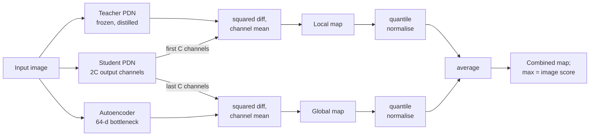

## Abstract

Industrial anomaly detectors had become accurate by becoming expensive: large backbones, ensembles and high input resolutions. EfficientAD answers with a student–teacher detector whose feature extractor has only four convolutional layers and runs in under a millisecond. Because a small student with the same architecture as its teacher imitates it too well, including on defects, the authors shape the training loss instead of the architecture: only the worst-predicted feature elements are backpropagated, and the student is penalised for producing teacher-like outputs on ImageNet images. A compact autoencoder, read through extra output channels of the same student, covers logical anomalies such as a wrong arrangement of parts, and a quantile-based calibration puts both maps on one scale. Averaged over MVTec AD, VisA and MVTec LOCO, the small variant reaches 95.4 image-level AU-ROC at 2.2 ms latency, ahead of every compared method on both axes.

**Keywords:** anomaly detection, student–teacher, patch description network, hard feature loss, logical anomalies, anomaly map normalisation, latency, throughput

## 1 Introduction

A production line has a cycle-time budget, and in some applications (a foreign object entering a harvester, a hand approaching a blade) a late detection is a failed detection. Recent leaderboard progress came from ensembling, heavy backbones and inputs of up to 768×768 pixels, none of which respects such a budget.

Three problems are addressed. First, feature extraction dominates runtime. Second, student–teacher detection depends on the student *failing* on unseen structures; earlier work enforced this with ensembles, feature pyramids or an asymmetric (invertible) teacher, each of which costs compute or constrains the architecture. Third, <mark>patch-level methods are blind to logical anomalies, where every local patch is normal but the global arrangement is not</mark>, and the usual remedy, an autoencoder, produces blurry reconstructions that fire false positives on normal images.

## 2 Background

In student–teacher (S–T) anomaly detection, a frozen pretrained network (the teacher) maps an image to a dense feature map. A student network is trained to regress those features on normal images only. At test time the per-location squared distance between the two outputs is the anomaly map. PatchCore, the main accuracy reference, instead scores test patches by nearest-neighbour distance to a subsampled memory bank of WideResNet features. MVTec LOCO contains both *structural* anomalies (scratches, stains, contamination) and *logical* ones (missing, surplus or misplaced objects).

## 3 Method

> **Key idea.** Make the network tiny, then recover accuracy through the training signal: control *what the student is allowed to learn* so that it matches the teacher on normal data and nowhere else. Asymmetry moves from the architecture into the loss, where it costs nothing at inference.

The paper's own overview is [Fig. 5 in the paper](https://arxiv.org/pdf/2303.14535#page=5): a small metal washer lights up only the local map, a surplus cable only the global one.

### 3.1 Patch description network

The patch description network (PDN) has four convolutional layers with average pooling after the first two, and outputs 384-dimensional descriptors; [Fig. 2 in the paper](https://arxiv.org/pdf/2303.14535#page=3) draws the layer stack. Each output vector depends on exactly one 33×33 input patch. It is trained once, on ImageNet images, to regress the WideResNet-101 features that PatchCore uses. Early downsampling makes it fast: a 256×256 image takes under 800 µs on an RTX A6000, whereas the original S–T networks, with only 1.6 to 2.7 million parameters each, run slower than a 31-million-parameter U-Net because they never downsample. Parameter count is a poor proxy for speed. [Fig. 3 in the paper](https://arxiv.org/pdf/2303.14535#page=4) shows gradient maps in which a single DenseNet or WideResNet feature responds to pixels across the whole image, whereas <mark>a PDN feature cannot be disturbed by a defect elsewhere in the image, which protects localisation.</mark>

### 3.2 Hard feature loss and pretraining penalty

Teacher $T$ and student $S$ share the PDN architecture. For a training image $I$ with outputs in $\mathbb{R}^{C\times W\times H}$, define the element-wise error

$$
D_{c,w,h} = \big(T(I)_{c,w,h} - S(I)_{c,w,h}\big)^2. \tag{1}
$$

In plain S–T training, more data can *hurt*, because the student starts to imitate the teacher on anomalies too. The remedy is borrowed from online hard example mining. With a mining factor $p_{\text{hard}}\in[0,1]$ and $d_{\text{hard}}$ the $p_{\text{hard}}$-quantile of all elements of $D$,

$$
L_{\text{hard}} = \operatorname{mean}\{\,D_{c,w,h} : D_{c,w,h} \ge d_{\text{hard}}\,\}. \tag{2}
$$

With the default $p_{\text{hard}} = 0.999$, only one element in a thousand carries gradient, and $p_{\text{hard}}=0$ recovers the ordinary loss. The student stops refining regions it already predicts well, typically the background. The second term uses a random ImageNet image $P$ per step:

$$
L_{\text{ST}} = L_{\text{hard}} + \frac{1}{CWH}\sum_{c}\lVert S(P)_c\rVert_F^2, \tag{3}
$$

which pushes the student's output toward zero on out-of-distribution content instead of toward the teacher's output. At inference the local anomaly map is $D$ averaged over channels.

### 3.3 Logical anomalies through a shared student

A plain convolutional autoencoder $A$ with a 64-dimensional bottleneck is trained to predict the teacher's feature map of the whole image,

$$
L_{\text{AE}} = \frac{1}{CWH}\sum_c \lVert T(I)_c - A(I)_c\rVert_F^2. \tag{4}
$$

Squeezing the full image through the bottleneck, it fails on images that violate global constraints, but it also fails, mildly and systematically, on fine normal detail. Rather than compare $A$ with $T$, the student receives $C$ additional output channels $S'$ that are trained to predict the autoencoder:

$$
L_{\text{STAE}} = \frac{1}{CWH}\sum_c \lVert A(I)_c - S'(I)_c\rVert_F^2. \tag{5}
$$

<mark>The student learns the autoencoder's habitual blur on normal images but, being patch-bound, cannot reproduce its errors on a globally wrong image</mark>, so $\lvert A - S'\rvert^2$ is a clean global map. The total loss is $L_{\text{AE}}+L_{\text{ST}}+L_{\text{STAE}}$, and the branch shares all hidden student layers, so it adds little compute.

### 3.4 Quantile-based map normalisation

Averaging the two maps raw would let the noisier one bury the other. On held-out normal images, the $a$- and $b$-quantiles $q_a, q_b$ of all pixel scores are computed per map, and each map is rescaled linearly so that $q_a \mapsto 0$ and $q_b \mapsto 0.1$ (defaults $a = 0.9$, $b = 0.995$). Only ranks between two quantiles are used, so the shape of the score distribution does not matter. The image score is the maximum of the averaged map.

## 4 Experiments

**Setup.** All 32 scenarios of MVTec AD (15), VisA (12) and MVTec LOCO (5). Detection is image-level AU-ROC; localisation is AU-PRO up to 30 % false-positive rate (AU-sPRO on LOCO); averages are means of the three collection means. Latency uses batch size 1 and throughput batch size 16 on an RTX A6000. EfficientAD-M doubles the hidden kernels and adds two 1×1 convolutions. The authors disable baseline practices that leak test information: test-set-based choice of training duration (SimpleNet, FastFlow) and PatchCore's centre crop. With such early stopping, EfficientAD itself would reach 99.8 on MVTec AD.

Main results (Table 1 of the paper; EfficientAD is the mean of five runs):

| Method | Detection AU-ROC | Segmentation AU-PRO | Latency [ms] | Throughput [img/s] |
|---|---|---|---|---|
| GCAD | 85.4 | 88.0 | 11 | 121 |
| SimpleNet | 87.9 | 74.4 | 12 | 194 |
| S–T | 88.4 | 89.7 | 75 | 16 |
| FastFlow | 90.0 | 86.5 | 17 | 120 |
| DSR | 90.8 | 78.6 | 17 | 104 |
| PatchCore | 91.1 | 80.9 | 32 | 76 |
| PatchCore (ensemble) | 92.1 | 80.7 | 148 | 13 |
| AST | 92.4 | 77.2 | 53 | 41 |
| EfficientAD-S | 95.4 | 92.5 | 2.2 | 614 |
| **EfficientAD-M** | **96.0** | **93.3** | 4.5 | 269 |

<mark>EfficientAD-S is 3 AU-ROC points above the next-best method, AST, while being 24 times faster in latency.</mark> Table 2 shows where the margin comes from. MVTec AD is saturated: the PatchCore ensemble has 99.3 and EfficientAD-M 99.1. The gap opens on MVTec LOCO, 90.7 against 83.4 for AST, on both halves: 86.8 on logical anomalies (GCAD 83.9) and 94.7 on structural ones (DSR 90.2). On VisA it is 98.1 against 97.7 for the PatchCore ensemble.

**Ablation (Tables 4 and 5).** Starting from the PDN-based model with a Gaussian (zero-mean, unit-variance) map normalisation as the baseline (93.2), quantile normalisation adds 0.8, the hard feature loss 1.0 and the ImageNet penalty 0.4, all at an unchanged 2.2 ms. Removing each one in isolation from EfficientAD-S costs 0.7, 0.7 and 0.4. The sweep over $p_{\text{hard}}$ goes from 94.9 at 0 to 96.0 at 0.999 and stays within 0.3 of that up to 0.99999; the quantile locations $a$ and $b$ move the result by at most 0.2.

## 5 Discussion

**Strengths.** Every contribution is free at inference, and the evaluation is careful: three benchmarks, five seeds with standard deviations, measured latency and throughput, and test-set leakage removed from baselines. Table 2 supports the remark that developing on MVTec AD alone now means fitting a handful of misclassified images.

**Weaknesses.** The individual gains are small (0.4 to 1.0 points) and the ablations are reported only as three-collection averages in the main text, so one cannot see which benchmark each trick helps. The penalty needs ImageNet images in every training run, and unlike memory-bank methods the model must be trained per scenario (about twenty minutes in the authors' setup). The authors state that fine-grained logical anomalies, such as a screw that is two millimetres too long, remain out of reach.

**Not shown in the main body.** How much of the accuracy is due to the distillation target (appendix Table 9 studies backbones; not covered in this note). Baselines were re-run under the stricter protocol, so their numbers cannot be cross-checked against the original papers.

## 6 Takeaways

- A four-layer network distilled from a deep backbone suffices as a feature extractor here, and its bounded receptive field helps localisation.
- In student–teacher detection the danger is a student that generalises too well. Backpropagating only the hardest 0.1 % of feature elements and penalising outputs on unrelated images controls this at no inference cost.
- A flawed detector can be made useful by training a second model to predict its *normal* errors and scoring only the disagreement; here that turns a blurry autoencoder into a logical-anomaly detector.
- Calibrate heterogeneous score maps by quantiles of normal validation scores before combining them, and measure latency directly; parameter counts and FLOPs mislead.

## References

1. K. Batzner, L. Heckler, R. König. *EfficientAD: Accurate Visual Anomaly Detection at Millisecond-Level Latencies.* WACV 2024. arXiv:2303.14535.
2. P. Bergmann, M. Fauser, D. Sattlegger, C. Steger. *Uninformed Students: Student-Teacher Anomaly Detection with Discriminative Latent Embeddings.* CVPR 2020.
3. K. Roth et al. *Towards Total Recall in Industrial Anomaly Detection (PatchCore).* CVPR 2022. arXiv:2106.08265.
4. M. Rudolph et al. *Asymmetric Student-Teacher Networks for Industrial Anomaly Detection (AST).* WACV 2023.
5. P. Bergmann et al. *Beyond Dents and Scratches: Logical Constraints in Unsupervised Anomaly Detection and Localization (MVTec LOCO, GCAD).* IJCV 2022.
