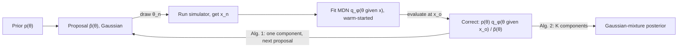

## Abstract

Simulator-based models can be run forward but not scored: their likelihood exists only implicitly, inside a program. Approximate Bayesian Computation conditions on simulated data falling within $\epsilon$ of the observation. That is exact only as $\epsilon\to 0$, which is exactly where acceptance collapses. This paper recasts inference as supervised learning. It draws parameters from a proposal, simulates, and fits a mixture density network for $\theta$ given $x$. A short proposition shows how to remove the proposal's influence, and a Gaussian proposal makes that removal analytic. Iterating, with each posterior estimate becoming the next proposal and a variational Bayesian network guarding small rounds against overfitting, its sequential variant matches or beats rejection, MCMC and SMC ABC on three benchmarks, after a one-dimensional toy check, with far fewer simulations.

**Keywords:** likelihood-free inference, approximate Bayesian computation, mixture density network, proposal correction, sequential simulation design, stochastic variational inference, M/G/1 queue, Lotka–Volterra

## 1 Introduction

Many scientific models are programs: draw randomness, run a process (a reaction network, a queue, an epidemic), report summary statistics. Given an observation $x_o$ we want the posterior over the program's parameters $\theta$. The likelihood integrates over every internal random choice and is almost never available.

ABC was the standard answer. Rejection ABC keeps prior draws whose simulation lands within $\epsilon$ of $x_o$; MCMC-ABC random-walks from the last accepted point; SMC-ABC anneals through shrinking tolerances with importance weights. The paper names three shared failures:

1. **The output is a bag of samples.** Means and error bars are easy, but density evaluation and combining analyses are not.
2. **The target is wrong.** It samples $p(\theta \mid \lVert x - x_o\rVert < \epsilon)$, which is typically broader and more uncertain than the posterior.
3. **Accuracy and cost conflict.** Shrinking $\epsilon$ drives acceptance towards zero, until no acceptable dataset appears in any feasible budget.

Parametric predecessors existed. Regression adjustment shifted ABC samples using a crude regressor so that a larger $\epsilon$ could be tolerated. Synthetic likelihood fitted a Gaussian, a Gaussian mixture, or Gaussian-process-interpolated Gaussians to $p(x\mid\theta)$, but still needs a further approximate-inference step on top to reach the posterior. Bayesian-optimisation ABC (Gutmann and Corander) put a Gaussian process on the discrepancy $\lVert x-x_o\rVert$ and steered simulations to where it is small, saving simulations but keeping the $\epsilon$-approximation. <mark>What was missing was a flexible model of the posterior itself, with no tolerance, that chooses where to simulate from its own current estimate.</mark>

## 2 Background

**The ABC approximation.** ABC replaces the point event $x=x_o$ by a ball:

$$
\begin{aligned}
p_\epsilon(\theta \mid x_o) \;\propto\; p(\theta)\,\Pr\big(\lVert x - x_o\rVert < \epsilon \;\big|\; \theta\big).
\end{aligned}
\tag{1}
$$

The probability on the right is what ABC estimates by simulation; it becomes proportional to $p(x_o\mid\theta)$ only as the ball shrinks, and in that same limit it vanishes. The paper calls $p(\theta\mid x=x_o)$ the *exact* posterior. Summary statistics count as part of the simulator, so information they discard is outside the method's scope.

**Mixture density networks.** An MDN (Bishop, 1994) is a feedforward network mapping $x$ to the weights, means and covariances of a $K$-component Gaussian mixture over $\theta$, trained by maximising $\sum_n \log q_\phi(\theta_n\mid x_n)$. With enough components and units it approximates any conditional density.

**Costing ABC.** ABC is charged per *effective* sample: total simulations divided by effective sample size, $N/(1+2\sum_l r_l)$ for MCMC-ABC (autocorrelations summed to the first zero, minimum over dimensions) and $1/\sum_n w_n^2$ for SMC-ABC.

Where other surrogates in this series model a scalar objective, this one models a conditional distribution. [Deep calibration](/blog/deep-calibration-rough-vol/) and [Deep Learning Volatility](/blog/deep-learning-volatility/) learn the *forward* map of a slow stochastic-volatility simulator; this paper learns the *inverse*, from data to a distribution over parameters.

## 3 Method

> **Key idea.** Simulate $(\theta_n, x_n)$ pairs and fit a conditional density of $\theta$ given $x$. Trained on prior draws, the fit *is* the posterior. Trained on draws from a proposal $\tilde p$, it is the posterior under prior $\tilde p$, and multiplying by $p/\tilde p$ undoes that. Make $\tilde p$ the current posterior estimate and repeat.



### 3.1 What maximum likelihood on simulations converges to

Draw $N$ independent pairs $\theta_n\sim\tilde p(\theta)$, $x_n\sim p(x\mid\theta_n)$ and maximise the average conditional log-density. By the strong law of large numbers:

$$
\begin{aligned}
\frac{1}{N}\sum_{n=1}^{N}\log q_\phi(\theta_n\mid x_n)
&\;\xrightarrow{\text{a.s.}}\; \mathbb{E}_{\tilde p(\theta)p(x\mid\theta)}\big[\log q_\phi(\theta\mid x)\big] \\
&\;=\; -\,D_{\mathrm{KL}}\big(\tilde p(\theta)\,p(x\mid\theta)\;\big\Vert\;\tilde p(x)\,q_\phi(\theta\mid x)\big) + \text{const},
\end{aligned}
\tag{2}
$$

with $\tilde p(x)=\int\tilde p(\theta)p(x\mid\theta)\,d\theta$. The left side is the training loss, the middle its infinite-data limit, and the right side shows that training matches the simulated joint with a factorisation whose conditional is the network. The KL vanishes only if the joints agree almost everywhere, which forces

$$
\begin{aligned}
q_\phi(\theta\mid x) \;=\; \frac{\tilde p(\theta)\,p(x\mid\theta)}{\tilde p(x)}
\;\propto\; \frac{\tilde p(\theta)}{p(\theta)}\;p(\theta\mid x).
\end{aligned}
\tag{3}
$$

The first form is the posterior under prior $\tilde p$. The second rewrites it with Bayes' rule, so that $\tilde p/p$ acts as an importance weight. <mark>This is Proposition 1, and it is exact only with infinite simulations and a family $q_\phi$ that contains the right-hand side.</mark> At the observation of interest it gives the estimator

$$
\begin{aligned}
\hat p(\theta\mid x = x_o) \;\propto\; \frac{p(\theta)}{\tilde p(\theta)}\; q_\phi(\theta\mid x_o),
\end{aligned}
\tag{4}
$$

which uses the simulator only to make training pairs: evaluate the network at $x_o$, then reweight.

### 3.2 Making the correction analytic

Choose the pieces so that (4) normalises in closed form:

$$
\begin{aligned}
q_\phi(\theta\mid x) &= \sum_{k=1}^{K}\alpha_k(x)\,\mathcal N\big(\theta\mid m_k(x),\,S_k(x)\big),
\qquad S_k^{-1} = U_k^{\top}U_k, \\
\tilde p(\theta) &= \mathcal N(\theta\mid m_0, S_0).
\end{aligned}
\tag{5}
$$

The weights $\alpha_k$ come from a softmax and the means $m_k$ are linear outputs. $U_k$ is an upper-triangular factor of the *precision*, with an exponentiated diagonal, so positive definiteness holds by construction and the log-determinant is a sum of outputs. With a uniform prior treated as flat everywhere, mixture divided by Gaussian is again a mixture:

$$
\begin{aligned}
S_k' &= \big(S_k^{-1} - S_0^{-1}\big)^{-1}, \qquad
m_k' = S_k'\big(S_k^{-1}m_k - S_0^{-1}m_0\big), \qquad
\alpha_k' \propto \alpha_k \exp\!\big(-\tfrac12 c_k\big), \\
c_k &= \log\det S_k - \log\det S_0 - \log\det S_k' + m_k^{\top}S_k^{-1}m_k - m_0^{\top}S_0^{-1}m_0 - m_k'^{\top}S_k'^{-1}m_k'.
\end{aligned}
\tag{6}
$$

Division subtracts precisions and precision-weighted means per component, and $c_k$ re-weights components by the normalising mass each one loses. Two approximations hide here. First, a uniform prior with finite support is handled as if flat everywhere, so truncation is ignored. Second, <mark>$S_k'$ is a valid covariance only if every component is narrower than the proposal in every direction</mark>. The authors say violations are rare, because $q_\phi$ is trained on draws from $\tilde p$, and that a violation signals mis-set hyperparameters.

### 3.3 Learning the proposal with a Bayesian network

Training on the prior learns $p(\theta\mid x)$ for every $x$, which is wasteful when only $x_o$ matters. Algorithm 1 is a fixed-point iteration. Start with $\tilde p=p$, simulate $N$ pairs, fit a *single-component* network, set $\tilde p$ to the corrected estimate, and repeat. With $K=1$ the proposal stays Gaussian, and warm-starting each round from the previous weights keeps $N$ small. In the experiments, 4–6 rounds of 200–500 simulations were typically enough. Algorithm 2 then fits $K$ components under the final proposal, starting from the single component's output layer copied $K$ times with small perturbations.

Small rounds invite overfitting. An over-narrow posterior then becomes an over-narrow proposal and starves the next round. Instead of early stopping, which would spend simulations on validation, the MDN is made Bayesian with stochastic variational inference. Each weight gets a Gaussian with mean $\phi_m$ and log-variance $\phi_s$, the prior is $\mathcal N(0,\lambda^{-1}I)$, and training maximises

$$
\begin{aligned}
\mathcal L(\phi_m,\phi_s) \;=\; \frac{1}{N}\sum_{n}\mathbb E_{u\sim\mathcal N(0,I)}\Big[\log q_{\phi_m + e^{\phi_s/2}\odot u}(\theta_n\mid x_n)\Big]
\;-\;\frac{1}{N}\,D_{\mathrm{KL}}\big(\mathcal N(\phi_m,\operatorname{diag}e^{\phi_s})\,\big\Vert\,\mathcal N(0,\lambda^{-1}I)\big).
\end{aligned}
\tag{7}
$$

The first term rewards fits that survive weight noise. The second pulls the weights towards the prior, with strength $1/N$, so it matters most when data are scarce. Gradients use the local reparameterisation trick: each pre-activation is Gaussian with mean $w_m^\top z+b_m$ and variance $(e^{w_s})^\top(z\odot z)+e^{b_s}$, so activations rather than weights are sampled. Noise is off at prediction time. The claimed benefits are robustness at small $N$, no validation split and no tuning of training time.

### 3.4 Intuition: one Gaussian, by hand

Let $\theta\sim\mathcal N(0,\tau^2)$, $x\sim\mathcal N(\theta,\sigma^2)$, proposal $\mathcal N(m_0,s_0^2)$. The ideal network output at $x_o$ is the posterior under the proposal, with precision $1/s_0^2+1/\sigma^2$ and precision-times-mean $m_0/s_0^2+x_o/\sigma^2$. Correction (4) multiplies by the prior and divides by the proposal:

$$
\begin{aligned}
\text{precision:}\quad & \Big(\tfrac{1}{s_0^2} + \tfrac{1}{\sigma^2}\Big) - \tfrac{1}{s_0^2} + \tfrac{1}{\tau^2} \;=\; \tfrac{1}{\sigma^2} + \tfrac{1}{\tau^2}, \\
\text{precision} \times \text{mean:}\quad & \Big(\tfrac{m_0}{s_0^2} + \tfrac{x_o}{\sigma^2}\Big) - \tfrac{m_0}{s_0^2} + 0 \;=\; \tfrac{x_o}{\sigma^2}.
\end{aligned}
\tag{8}
$$

The proposal cancels, leaving the exact posterior. The same arithmetic exposes the failure of §3.2. A poorly trained network reporting precision below $1/s_0^2-1/\tau^2$ (below $1/s_0^2$ under the flat prior of §3.2) yields a negative variance. An overfit one reports too much precision, and the corrected posterior is silently overconfident.

Compare ABC on this model with a flat prior. Normalised over $\theta$, the acceptance probability is the density of $x_o+U+\sigma Z$ with $U$ uniform on $[-\epsilon,\epsilon]$. Its variance is therefore $\sigma^2+\epsilon^2/3$, inflated by a user-chosen amount, while acceptance near the mode is about $2\epsilon/(\sqrt{2\pi}\sigma)$ and shrinks roughly like $\epsilon^{D}$ in $D$ data dimensions. <mark>ABC trades bias for simulations along a curve that runs out before the bias reaches zero; the regression approach is not on that curve.</mark>

### 3.5 Algorithm

```text
INPUT  prior p(θ) (uniform or Gaussian), simulator sim(θ), observation x_o,
       round size N, final components K, SVI prior precision λ

# Algorithm 1: learn a Gaussian proposal
prop ← p(θ);  net ← one-component MDN-SVI
repeat
    draw θ_1..θ_N ~ prop;  x_n ← sim(θ_n)
    continue training net on this round's pairs, maximising (7)
    (m, S) ← net(x_o) with weight noise off
    prop   ← p(θ)/prop(θ) × N(θ | m, S)        # eq. (6), K = 1; must stay PD
until prop stops changing

# Algorithm 2: final posterior
net_K ← net with output layer copied K times plus small noise
draw θ_1..θ_N ~ prop;  x_n ← sim(θ_n);  train net_K on these pairs
return mixture {α'_k, m'_k, S'_k} from eq. (6) at net_K(x_o)
```

Weights carry across rounds, but each round trains only on its own simulations and divides only by its own proposal.

## 4 Implementation notes

| item | as reported |
|---|---|
| Density estimator | MDN, full covariances via upper-triangular precision Cholesky factor, exponentiated diagonal |
| Hidden units | tanh; 1×20 (Gaussian mixture), 1×50 (linear regression); 2×50 for MDN with prior, 1×50 for MDN-SVI (Lotka–Volterra, M/G/1) |
| Components $K$ | 2, 1, 1, 8 for the four problems; 1 while learning the proposal |
| Optimiser | Adam, default parameters |
| SVI prior | $\mathcal N(0,\lambda^{-1}I)$, $\lambda=0.01$; local reparameterisation |
| Proposal rounds | typically 4–6 × 200–500 simulations |
| Framework | Theano; code linked from the paper |
| Minibatch size, epochs per round, stopping rule for "proposal converged", noise samples per step | not stated |

Easy to get wrong when reproducing:

- **Pilot runs.** Lotka–Volterra statistics are standardised using a 1,000-simulation pilot, and M/G/1 percentiles are whitened using 100K pilot simulations. Whether these count towards the plotted budgets is not stated, and the M/G/1 pilot alone exceeds what MDN with proposal is credited with (about $10^4$ by eye).
- **Parameter spaces.** Lotka–Volterra is inferred in $\log\theta$ with a uniform prior on $[-5,2]$. M/G/1 puts uniform priors on $\theta_1$ and on $\theta_2-\theta_1$ (both $[0,10]$), and on $\theta_3$ over $[0,1/3]$. The flat-everywhere correction can place mass outside these supports.
- **Baseline handling.** MCMC-ABC's step size was hand-tuned, and the chain started from a rejection-ABC sample, so it needed no burn-in. SMC-ABC's $\epsilon$ decay was also hand-tuned. ABC samples are refitted before scoring: a Gaussian for regression and Lotka–Volterra, an 8-component EM mixture for M/G/1.

## 5 Experiments

**Setup.** There are three variants. *MDN with prior* is Algorithm 2 with an ordinary MDN and $\tilde p=p$. *Proposal prior* is the Gaussian left by Algorithm 1. *MDN with proposal* is Algorithm 2 with MDN-SVI under that Gaussian. The baselines are rejection, MCMC and SMC ABC, each run down a decreasing $\epsilon$ sequence until it fails. The paper has no numeric results tables, so the tables below retype the setups and every number the text states.

| problem | $\dim\theta$ | $x$ | prior | posterior | metric |
|---|---|---|---|---|---|
| Mixture of two Gaussians | 1 | 1 value | $U(-10,10)$ | known: equal mixture, s.d. 1 and 0.1, at $x_o=0$ | visual |
| Bayesian linear regression | 6 | 10 values | $\mathcal N(0,I)$, noise s.d. 0.1 | known: Gaussian | KL(true ‖ approx.) |
| Lotka–Volterra jump process | 4 (log rates) | 9 statistics | $U(-5,2)$ per $\log\theta_i$ | unknown, narrow | −log density of true $\theta$ |
| M/G/1 queue, 50 jobs | 3 | 5 inter-departure percentiles | see §4 | unknown, broad | −log density of true $\theta$ |

The true parameters were $(0.01,0.5,1,0.01)$ for Lotka–Volterra and $(1,5,0.2)$ for M/G/1.

| budget stated in the text | value |
|---|---|
| Gaussian mixture: MDN with prior | 10K simulations |
| Gaussian mixture: proposal prior | 4 rounds × 200 |
| Gaussian mixture: MDN with proposal | 1,000 beyond those 800 |
| Linear regression: proposal vs prior training | "more than ten times cheaper", and more accurate |

The three variants are the only ablation:

| variant | proposal | estimator | components |
|---|---|---|---|
| MDN with prior | prior | MDN | per problem |
| Proposal prior | learned | MDN-SVI | 1 |
| MDN with proposal | learned | MDN-SVI | per problem |

**What the figures show** (qualitative, by eye). [Fig. 1](https://arxiv.org/pdf/1605.06376#page=5): both mixture MDNs reproduce the spike and shoulder of the true posterior, while the proposal Gaussian misses the spike. The prior-trained network learns the conditional for all $x$; the proposal-trained one is right only near $x_o$. [Fig. 2](https://arxiv.org/pdf/1605.06376#page=6): MDN with proposal and SMC-ABC at its smallest tolerances share the lowest KL; SMC dips marginally below the MDN at one $\epsilon$, but there it spends more than ten times as many simulations per effective sample as the MDN spends in total. The proposal Gaussian sits *above* the prior-trained MDN even though the true posterior is Gaussian, so the final round does real work. [Fig. 3](https://arxiv.org/pdf/1605.06376#page=7): both proposal-based variants beat every ABC run. SMC-ABC at its smallest $\epsilon$ roughly matches, or slightly beats, the prior-trained MDN. The text adds that runs with more than one component switched the extras off. [Fig. 4](https://arxiv.org/pdf/1605.06376#page=8): the proposal Gaussian is worse than much of the ABC range on this non-Gaussian posterior, and one rejection-ABC setting dips below both mixture MDNs.

**Claim by claim.**

- *It targets the exact posterior.* Strong where checkable (Figs. 1–2). Elsewhere it is scored by density at one true $\theta$, which an overconfident posterior near the truth also passes.
- *It beats ABC.* Clearly true of MDN with proposal on Lotka–Volterra (Fig. 3). On linear regression SMC-ABC ties it at a far higher cost (Fig. 2), and on M/G/1 one rejection-ABC setting edges below it (Fig. 4). The other variants do not beat ABC uniformly. No repeated runs or across-run error bars are reported; the bars in the right panels are posterior standard deviations.
- *It uses fewer simulations than ABC spends per effective sample.* Supported by the middle panels of Figs. 2–4, if pilot simulations are excluded.
- *A learned proposal beats prior training.* The text quantifies it only for linear regression; the toy problem gives budgets (1,800 vs 10K) but no accuracy number. True of the final MDN in Figs. 2–4; the proposal Gaussian alone beats the prior-trained MDN only on Lotka–Volterra.
- *MDN-SVI makes Algorithm 1 robust.* <mark>No experiment compares MDN and MDN-SVI; this rests on the authors' experience.</mark>
- *Proposal-trained networks need less capacity.* They were simply given one hidden layer instead of two. That is consistent with the claim but does not test it.
- *Fast.* The claim is measured in simulations; wall-clock time is not reported.

## 6 Limitations

**Stated by the authors.** Results depend on the proposal, unlike synthetic likelihood. The correction can produce non-positive-definite components. The prior must be uniform or Gaussian and the proposal a single Gaussian. Summary statistics are taken as given.

**My reading.**

- <mark>The correction is exact only at the optimum of an infinite-data fit.</mark> Warm-started weights carry information from earlier proposals that is never divided out, and the resulting bias is not measured.
- Earlier rounds' simulations are discarded apart from the warm start: 800 of 1,800 in the toy problem.
- Gaussian families on both sides cannot express bounded or heavy-tailed posteriors well, and the proposal can never have heavier tails than a Gaussian.
- Evaluation is thin by later standards: one $x_o$ per problem, one run, no calibration check across simulated observations, and $\dim\theta\le 6$.
- Network size changes along with the proposal and SVI, so no single design choice is isolated.

## 7 Extensions

**What was built on this.** Later work calls this method SNPE-A. SNPE-B (Lueckmann et al., 2017) moved the proposal correction into importance-weighted training. APT/SNPE-C (Greenberg, Nonnenmacher and Macke, 2019) reparameterised the loss so that any estimator and any proposal can be used and earlier rounds reused. The first author's Masked Autoregressive Flow (2017) and sequential neural likelihood (2019) swapped the MDN for a normalizing flow and also learned $p(x\mid\theta)$ *(all from general knowledge, unverified)*. Among the paper's own references, Gutmann and Corander's Bayesian-optimisation ABC links to the rest of this series: it picks simulations by an acquisition rule on a Gaussian-process discrepancy, while this paper picks them by sampling its current posterior.

**Open problems.** The fixed-point iteration has no convergence analysis or defined stopping rule. Correcting for proposals that cannot be divided analytically, without importance weights blowing up, is unsolved. So are detecting an overconfident fit and learning summary statistics jointly with the posterior.

**Research directions.** *These are ideas, not results — none has been run.*

1. **Burst-law posteriors for exchange capacity, validated where the answer is exact.** The owner's [exchange-queueing](/projects/exchange-queueing/) project puts an exact grid posterior on the rate and dispersion of a gamma-mixed Cox model for one-minute BTC/USDT blocks. It sizes servers by a 95% chance constraint on a simulated $G/G/c$ queue, and it reaches nominal coverage only with a heavy-tailed log-normal burst law. Its stated next step is a Hawkes or batch-arrival likelihood with a posterior on the burst-size distribution, a model that is easy to simulate and awkward to score from summaries. This paper's own M/G/1 benchmark is a queue seen only through percentiles. Hypothesis: a sequential MDN posterior from multi-scale dispersion statistics reproduces the page's grid posteriors for the gamma-Cox and nested variants, and then extends to a burst-size model with no grid. Checking against an exact answer first follows the owner's [model-uncertainty-priors](/research/model-uncertainty-priors/) project. Data: the page's one-minute blocks. Baseline: its grid posteriors; rejection ABC. Metric: total variation from the grid posterior, then the page's own coverage of the 95% interval for $P(W_q>100\,\text{ms})$ and servers relative to the oracle. Likely failure: the summaries do not carry the burst-size tail, so the posterior is sharp about the wrong thing.
2. **Rough-volatility parameters from returns.** Hypothesis: at a fixed simulation budget, an MDN posterior over rough-Bergomi parameters given realised-variance statistics puts more density on the true Hurst parameter than SMC-ABC. Data: simulated paths, many $x_o$. Baseline: SMC-ABC; prior-trained MDN. Metric: mean −log density at truth; coverage of 90% intervals. Likely failure: the posterior piles against the prior bound near zero, and the flat-prior correction leaks mass past it.
3. **Measuring the warm-start bias.** Hypothesis: on the paper's linear-regression problem, the KL after Algorithm 1 is higher than for a cold-started fit on the same final-round data. Baseline: cold start; pooled rounds divided by a mixture proposal. Metric: KL against total simulations. Likely failure: at small $N$ the SVI prior dominates and masks the effect.

## 8 Takeaways

- Likelihood-free inference becomes conditional density estimation on simulated pairs, evaluated at the observation.
- Training under a proposal gives the posterior under that proposal. Dividing it out is analytic for a Gaussian mixture over a Gaussian, provided the network is narrower than the proposal.
- <mark>Using the current estimate as the next proposal focuses simulations: 1,800 do the work of 10K on the toy problem.</mark>
- The Bayesian network is offered as what makes small rounds safe, but no experiment isolates it.
- For finance and operations models that can be simulated but not scored, the template is a learned posterior with an explicit proposal correction, validated first on a case with a known posterior.

## References

- G. Papamakarios and I. Murray. Fast ε-free Inference of Simulation Models with Bayesian Conditional Density Estimation. arXiv:1605.06376, 2016.
- C. M. Bishop. Mixture density networks. Technical Report NCRG/94/004, Aston University, 1994.
- M. A. Beaumont, J.-M. Cornuet, J.-M. Marin and C. P. Robert. Adaptive Approximate Bayesian Computation. *Biometrika* 96(4), 2009.
- M. U. Gutmann and J. Corander. Bayesian optimization for likelihood-free inference of simulator-based statistical models. arXiv:1501.03291, 2015.
- D. P. Kingma, T. Salimans and M. Welling. Variational dropout and the local reparameterization trick. *Advances in Neural Information Processing Systems* 28, 2015.
