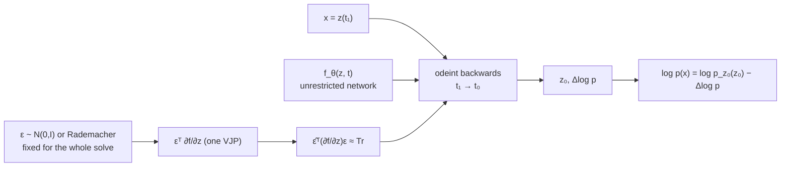

## Abstract

Every discrete flow pays for its tractable determinant with an architectural restriction: partition the dimensions, mask the weights, or accept a rank-one update. FFJORD removes the restriction by removing the determinant. In continuous time the change of variables becomes the *instantaneous* form $\partial_t\log p(z(t))=-\operatorname{Tr}(\partial f/\partial z)$, so the log-determinant of a matrix is replaced by the trace of one — $O(D^2)$ instead of $O(D^3)$, and with no structural constraint on $f$. Then Hutchinson's estimator, $\operatorname{Tr}(A)=\mathbb{E}_\epsilon[\epsilon^{\mathsf T}A\epsilon]$, turns the trace into a single vector-Jacobian product, which reverse-mode automatic differentiation computes for the cost of one forward pass, bringing the log-density estimate to $O(D)$ and leaving the dynamics network *completely unrestricted*. Sampling and density evaluation are the same ODE solve in opposite directions; gradients come from the adjoint method at constant memory. On the five tabular benchmarks FFJORD is the best reversible model by a wide margin; on MNIST a single flow matches multi-layer Glow, and a multiscale version reaches 0.99 bits/dim with, the paper says, under 2% of Glow's parameters.

**Keywords:** continuous normalizing flow, instantaneous change of variables, Hutchinson trace estimator, adjoint sensitivity, free-form Jacobian, number of function evaluations

## 1 Introduction

The taxonomy in the paper's §2 is the clearest statement of what the field had been trading away, and the accompanying table says it in one grid:

| Method | Train on data | One-pass sampling | Exact log-likelihood | Free-form Jacobian |
|---|---|---|---|---|
| VAE | ✓ | ✓ | ✗ | ✓ |
| GAN | ✓ | ✓ | ✗ | ✓ |
| Autoregressive (likelihood-based) | ✓ | ✗ | ✓ | ✗ |
| Normalizing flows (planar/radial) | ✗ | ✓ | ✓ | ✗ |
| Reverse-NF, [MAF](/blog/maf/), TAN | ✓ | ✗ | ✓ | ✗ |
| [NICE](/blog/nice/), [Real NVP](/blog/realnvp/), [Glow](/blog/glow/), planar CNF | ✓ | ✓ | ✓ | ✗ |
| **FFJORD** | ✓ | ✓ | ✓ | ✓ |

The last column is the contribution. Every previous row with three ticks bought them with a restriction on $f$: partitioning (coupling), an ordering (autoregressive), or a rank-one form (planar). The paper's own summary of the cost of that restriction is worth keeping: *each layer of the original normalizing flows model of Rezende & Mohamed is a one-layer neural network with only a single hidden unit*. You can stack a thousand of those and still not have a deep network.

For anyone thinking about applying a flow to data with no natural structure — a panel of factor returns, a set of engineered features — the appeal is direct. A coupling flow forces you to choose a partition; an autoregressive flow forces you to choose an ordering; FFJORD forces you to choose neither. What it asks for instead is an ODE solver, and the bill it sends is in function evaluations rather than in architecture.

## 2 Background

### 2.1 Continuous normalizing flows

Instead of $x=f(z)$, sample $z_0\sim p_{z_0}$ and solve the initial value problem

$$
z(t_0)=z_0,\qquad \frac{\partial z(t)}{\partial t}=f\bigl(z(t),t;\theta\bigr)
$$

to get $z(t_1)$, the observable data. The density evolves by the *instantaneous change of variables* of [Neural ODE](/blog/neural-ode/):

$$
\frac{\partial\log p(z(t))}{\partial t}=-\operatorname{Tr}\left(\frac{\partial f}{\partial z(t)}\right),
\qquad
\log p(z(t_1))=\log p(z(t_0))-\int_{t_0}^{t_1}\operatorname{Tr}\left(\frac{\partial f}{\partial z(t)}\right)dt. \tag{1}
$$

The determinant became a trace because the map is now infinitesimally close to the identity at every instant, and $\log\det(I+\varepsilon A)=\varepsilon\operatorname{Tr}(A)+O(\varepsilon^2)$. That single substitution is the whole reason continuous flows exist.

To evaluate a datapoint, integrate the augmented system *backwards*:

$$
\begin{bmatrix}z_0\\ \log p(x)-\log p_{z_0}(z_0)\end{bmatrix}
=\int_{t_1}^{t_0}
\begin{bmatrix}f(z(t),t;\theta)\\ -\operatorname{Tr}\bigl(\partial f/\partial z(t)\bigr)\end{bmatrix}dt,
\qquad
\begin{bmatrix}z(t_1)\\ \log p(x)-\log p(z(t_1))\end{bmatrix}
=\begin{bmatrix}x\\ 0\end{bmatrix}. \tag{2}
$$

Existence and uniqueness need $f$ and its first derivatives Lipschitz, *which can be satisfied in practice using neural networks with smooth Lipschitz activations*.

### 2.2 Adjoint gradients

For a loss on the ODE solution, Pontryagin's result gives the gradient as another initial value problem,

$$
\frac{d\mathcal{L}}{d\theta}=-\int_{t_1}^{t_0}\left(\frac{\partial\mathcal{L}}{\partial z(t)}\right)^{\!\mathsf T}\frac{\partial f(z(t),t;\theta)}{\partial\theta}\,dt, \tag{3}
$$

with $-\partial\mathcal{L}/\partial z(t)$ the adjoint state. Two solver calls — one forward, one backward — and no stored activations, which is what makes the memory constant in depth.

## 3 Method

> **Key idea.** You do not need the trace; you need an unbiased estimate of it. $\epsilon^{\mathsf T}(\partial f/\partial z)\epsilon$ has the right expectation for any zero-mean, identity-covariance $\epsilon$, and reverse-mode autodiff computes $\epsilon^{\mathsf T}\partial f/\partial z$ for roughly the cost of evaluating $f$ once. So the whole log-density costs one extra backward pass, regardless of $D$ and regardless of what $f$ looks like.

### 3.1 The estimator

Computing $\operatorname{Tr}(\partial f/\partial z)$ exactly costs $O(D^2)$ — each diagonal entry is a separate derivative, so it is about $D$ evaluations of $f$. Two facts remove it:

1. **Vector-Jacobian products are cheap.** $v^{\mathsf T}\partial f/\partial z$ costs approximately one evaluation of $f$ under reverse-mode automatic differentiation.
2. **Hutchinson's estimator.** For any $D\times D$ matrix $A$ and any $p(\epsilon)$ with $\mathbb{E}[\epsilon]=0$ and $\operatorname{Cov}(\epsilon)=I$,
   $$
   \operatorname{Tr}(A)=\mathbb{E}_{p(\epsilon)}\bigl[\epsilon^{\mathsf T}A\epsilon\bigr]. \tag{4}
   $$

Putting them together and — crucially — moving the expectation *outside* the integral:

$$
\log p(z(t_1))=\log p(z(t_0))-\mathbb{E}_{p(\epsilon)}\int_{t_0}^{t_1}\epsilon^{\mathsf T}\frac{\partial f}{\partial z(t)}\epsilon\,dt. \tag{5}
$$

This is the detail that makes the algorithm work rather than merely typecheck. A single $\epsilon$ is sampled *once per solve* and held fixed for the whole trajectory, so the dynamics the solver sees are deterministic — an adaptive solver given stochastic dynamics would chase noise and refine forever. Because the expectation is linear and sits outside the integral, fixing $\epsilon$ within a solve introduces no bias. Typical choices are standard Gaussian or Rademacher.

**The cost ladder**, with $H$ the largest hidden width, $L$ the number of stacked transformations and $\hat L$ the number of solver evaluations:

| Model class | Cost of one log-density |
|---|---|
| Discrete flow with a general Jacobian | $O\bigl((DH+D^3)L\bigr)$ |
| CNF with the exact trace | $O\bigl((DH+D^2)\hat L\bigr)$ |
| **FFJORD** | $O\bigl((DH+D)\hat L\bigr)$ |

Note what is *not* eliminated: $\hat L$. The $D^3$ has been traded for a quantity that is data-dependent, unknown before training, and — as §5.4 shows — grows.

### 3.2 The bottleneck trick

If the dynamics network has a hidden layer of width $H<D$, write $f=g\circ h$ and use the cyclic property:

$$
\operatorname{Tr}\left(\underbrace{\frac{\partial g}{\partial h}\frac{\partial h}{\partial z}}_{D\times D}\right)
=\operatorname{Tr}\left(\underbrace{\frac{\partial h}{\partial z}\frac{\partial g}{\partial h}}_{H\times H}\right)
=\mathbb{E}_{p(\epsilon)}\left[\epsilon^{\mathsf T}\frac{\partial h}{\partial z}\frac{\partial g}{\partial h}\epsilon\right]. \tag{6}
$$

Since the variance of Hutchinson's estimator grows like $\lVert A\rVert_F^2$, shrinking the matrix should shrink the variance. The paper hedges appropriately — *we suspect that having fewer dimensions should help*, and *may also help reduce the variance* — and the ablation in §5.5 gives a genuinely odd answer.

### 3.3 Algorithm

```text
LOG-DENSITY OF x  (Algorithm 1)
  eps = sample_unit_variance(x.shape)        # ONCE, outside the integral: keeps dynamics deterministic
  def f_aug([z, logp], t):
      ft   = f_theta(z, t)                   # free-form: any network at all
      g    = eps^T * d f_theta / d z         # one vector-Jacobian product, reverse-mode AD
      trhat = dot(g, eps)                    # unbiased estimate of Tr(df/dz)
      return [ft, -trhat]
  z, dlogp = odeint(f_aug, [x, 0], t0, t1)   # RK 4(5), Shampine tableau, adaptive
  return log p_z0(z) - dlogp

SAMPLE
  z ~ p_z0;  x = odeint(f_theta, z, t0, t1)  # same solver, opposite direction

GRADIENTS
  adjoint method (3): one more solve backwards; memory constant in "depth"
```



## 4 Implementation notes

- **Solver.** Runge–Kutta 4(5) with Shampine's tableau, adaptive, with *tolerance set low enough so numerical error is negligible* (Appendix C). GPU implementations of both the solvers and the adjoint method were written for this paper.
- **Estimator at train versus test.** Hutchinson during training, **exact trace when reporting test results** — except the MNIST and CIFAR-10 density models, where the exact trace was not computationally feasible. There, the authors report that *the variance of the log-likelihood over the validation set induced by the trace estimator is less than $10^{-4}$*. Worth noting that this means the training objective and the reported metric are different functionals almost everywhere in the paper; unbiasedness makes that legitimate in expectation but it is not the same optimisation problem.
- **Time conditioning.** *We experimented with several ways to incorporate $t$ as an input to $f$, such as hyper-networks, but found that simply concatenating $t$ on to $z(t)$ at the input to every layer worked well* — the simplest thing, reported as such.
- **Batch sizes.** The method is *slower than competing methods*, but the adjoint's constant memory allows batches up to **10,000** on tabular data and **900** on images. No wall-clock figures are given anywhere. Marked: not stated.
- **The VAE flow is not free-form.** Making the encoder emit all the flow parameters *led to differential equations which were too difficult to integrate numerically*. Instead each layer inside FFJORD takes the form
  $$
  \mathrm{layer}(h;x,W,b)=\sigma\Bigl(\bigl(W+\hat U(x)\hat V(x)^{\mathsf T}\bigr)h+b+\hat b(x)\Bigr), \tag{7}
  $$
  a global weight matrix plus a **rank-$k$ data-dependent update** and a data-dependent bias. So in the variational-inference experiments, the paper's headline property is deliberately given up in order to keep the ODE integrable. This is stated plainly and is one of the most informative sentences in the paper.
- Encoder/decoder architectures and training setup for the VAE experiments *exactly mirror* those of Berg et al. (Sylvester flows), which makes that table a like-for-like comparison.

## 5 Experiments

### 5.1 Two-dimensional toys

FFJORD warps an isotropic Gaussian into multimodal and even discontinuous densities. The ODE solver uses roughly 70–100 evaluations, so the comparison is against **Glow with 100 discrete layers** — a matched-depth comparison rather than a matched-parameter one. The finding ([Fig. 2](https://arxiv.org/pdf/1810.01367#page=5)) is specific and mechanistic: *Glow learns to stretch the single mode base distribution into multiple modes but has trouble modeling the areas of low probability between disconnected regions*, whereas FFJORD handles disconnected modes and approximates discontinuous densities.

This is the most interesting qualitative claim in the paper and it deserves unpacking. A discrete flow is a composition of finitely many diffeomorphisms, hence a diffeomorphism, hence it maps a connected support to a connected support — it *cannot* produce genuinely disconnected modes, only regions joined by thin filaments of density. A continuous flow is also a diffeomorphism at any finite time, so strictly the same argument applies; what changes is that the velocity field can make the connecting filaments arbitrarily thin at bounded cost, whereas a fixed stack of coupling layers has a finite budget for stretching. The paper does not make this argument, but the figure is showing its consequence.

### 5.2 Density estimation

Negative log-likelihood, lower is better; nats for tabular, bits/dim for images. $\star$ = multi-scale convolutional architecture; $\dagger$ = single flow with a convolutional encoder–decoder.

| | POWER | GAS | HEPMASS | MINIBOONE | BSDS300 | MNIST | CIFAR-10 |
|---|---|---|---|---|---|---|---|
| Real NVP | $-0.17$ | $-8.33$ | $18.71$ | $13.55$ | $-153.28$ | $1.06^\star$ | $3.49^\star$ |
| Glow | $-0.17$ | $-8.15$ | $18.92$ | $11.35$ | $-155.07$ | $1.05^\star$ | $\mathbf{3.35^\star}$ |
| **FFJORD** | $-0.46$ | $-8.59$ | $\mathbf{14.92}$ | $10.43$ | $-157.40$ | $\mathbf{0.99^\star}\ (1.05^\dagger)$ | $3.40^\star$ |
| MADE | $3.08$ | $-3.56$ | $20.98$ | $15.59$ | $-148.85$ | $2.04$ | $5.67$ |
| MAF | $-0.24$ | $-10.08$ | $17.70$ | $11.75$ | $-155.69$ | $1.89$ | $4.31$ |
| TAN | $-0.48$ | $-11.19$ | $15.12$ | $11.01$ | $-157.03$ | – | – |
| MAF-DDSF | $\mathbf{-0.62}$ | $\mathbf{-11.96}$ | $15.09$ | $\mathbf{8.86}$ | $\mathbf{-157.73}$ | – | – |

The paper's reading, and it is accurate: FFJORD *performs the best out of reversible models by a wide margin but is outperformed by recent autoregressive models*; it beats MAF on all but one dataset (GAS, where MAF's $-10.08$ wins) and beats TAN on MINIBOONE. The caveats it attaches to the autoregressive winners are the right ones — they need $O(D)$ sequential computations to sample, and MAF-DDSF *cannot be sampled from analytically* at all.

On images, two distinct claims:

- **A single flow suffices on MNIST.** One neural network, one ODE, $1.05^\dagger$ bits/dim — matching Real NVP's $1.06$ and Glow's $1.05$, both of which need many composed flows in a multiscale architecture. This is the cleanest demonstration that the architectural restriction, not the depth, was doing the constraining.
- **Multiscale still helps.** $0.99$ on MNIST, $3.40$ on CIFAR-10 against Glow's $3.35$ — *comparable*, not better, and the paper says comparable.

Two honest caveats the authors supply themselves: *FFJORD is able to achieve this performance while using less than 2% as many parameters as Glow*, and *Glow uses a learned base distribution whereas FFJORD and Real NVP use a fixed Gaussian*. The first is a striking claim and the main text gives no parameter count for either model, so the reader cannot check it from the table. The second is a point *against* FFJORD's own numbers being flattered, volunteered rather than buried.

### 5.3 Variational inference

Negative ELBO, lower is better; nats except Frey Faces in bits/dim; mean and standard deviation over three runs.

| | MNIST | Omniglot | Frey Faces | Caltech Silhouettes |
|---|---|---|---|---|
| No flow | $86.55\pm.06$ | $104.28\pm.39$ | $4.53\pm.02$ | $110.80\pm.46$ |
| Planar | $86.06\pm.31$ | $102.65\pm.42$ | $4.40\pm.06$ | $109.66\pm.42$ |
| [IAF](/blog/iaf/) | $84.20\pm.17$ | $102.41\pm.04$ | $4.47\pm.05$ | $111.58\pm.38$ |
| Sylvester | $83.32\pm.06$ | $99.00\pm.04$ | $4.45\pm.04$ | $104.62\pm.29$ |
| **FFJORD** | $\mathbf{82.82\pm.01}$ | $\mathbf{98.33\pm.09}$ | $\mathbf{4.39\pm.01}$ | $\mathbf{104.03\pm.43}$ |

Best on all four, with a matched experimental setup. The margin over Sylvester is $0.50$, $0.67$, $0.06$ and $0.59$ nats; on Caltech the error bars nearly overlap. Note also that IAF *loses to the no-flow baseline on Caltech Silhouettes* ($111.58$ vs $110.80$), which is a reminder that flexible posteriors are not free.

And remember (§4) that the FFJORD used here is the rank-$k$-amortised version of (7), not a free-form one.

### 5.4 Number of function evaluations

The replacement bottleneck. Two results:

- **NFE is independent of data dimension.** VAEs with latent dimensions 16, 32, 48, 64: NFE rises through training in all of them and *converges to the same value, independent of $D$*. The supporting argument is a thought experiment rather than an experiment: if the data is an isotropic Gaussian and so is the base, the optimal dynamics are identically zero and the solver needs no evaluations at any $D$. So *the number of evaluations is not dependent on the dimensionality of the data but the complexity of its distribution* — more precisely, on how hard it is to transport one into the other. The tested dimensions are all small and all latent, so this is suggestive rather than established.
- **NFE rises during training and can become prohibitive**, which is §6 rather than §5 but belongs here. Weight decay and spectral normalisation reduce it and *their use tends to hurt performance slightly*.

### 5.5 Ablations

**Bottleneck trick.** Faster convergence on MNIST when $\epsilon$ is Gaussian; **no speedup when $\epsilon$ is Rademacher** ([Fig. 4](https://arxiv.org/pdf/1810.01367#page=7)). The paper reports this as *interesting* and offers no explanation. It is a real puzzle: Rademacher has lower variance than Gaussian for Hutchinson's estimator in general (its fourth moment is smaller), so the plausible reading is that the Rademacher estimator's variance was already below whatever threshold the optimisation cared about, leaving nothing for the trick to improve. Nothing in the paper decides it.

**Single-scale versus multiscale.** At comparable parameter counts on MNIST, the single-scale encoder–decoder uses *approximately one half as many function evaluations* as the multiscale model but does not reach its loss ([Fig. 6](https://arxiv.org/pdf/1810.01367#page=7)). Plotting loss against total NFE rather than against epochs is the right axis and is rarer than it should be.

## 6 Limitations

**Stated by the authors**, in a §6 titled "Scope and Limitations" that is unusually forthcoming:

- *The number of function evaluations required to integrate the dynamics is not fixed ahead of time and is a function of the data, model architecture, and model parameters. We find that this tends to grow as the models trains and can become prohibitively large*, even though memory stays constant under the adjoint method.
- Reliance on general-purpose solvers *restricts us to non-stiff differential equations that can be efficiently solved*. Stiff solvers exist but evaluate $f$ far more often. *We find that using a small amount of weight decay sufficiently constrains the ODE to be non-stiff.*
- The conclusion asks for exactly the follow-up work the field then did: *ways to reduce the number of function evaluations used by the ODE-solver without hurting predictive performance*.

**My reading.**

- **The free-form claim is weakened in the experiment that most needed it.** The VAE flows use the rank-$k$ amortisation of (7) because the unrestricted version would not integrate. So on the table where FFJORD wins every column, the Jacobian is not free-form.
- **Train and test use different estimators** almost everywhere, and on the two datasets where they do not, the reported estimator variance ($<10^{-4}$) is given for the validation log-likelihood without saying over how many $\epsilon$ draws.
- **No wall-clock or FLOP numbers.** "Slower than competing methods" is the only statement of cost, and given that NFE is the paper's own identified bottleneck, this is the number most missing.
- **The "<2% of Glow's parameters" claim cannot be checked from the main text**, which gives neither model's parameter count.
- **The $t_0$-to-$t_1$ interval and its interaction with the dynamics is never discussed.** A CNF on a fixed time interval has a velocity scale set by that interval; nothing here explores whether the NFE growth is really a growth in the Lipschitz constant of $f$, which is what the weight-decay fix suggests.
- **Adjoint gradients are not exact.** The backward solve reconstructs $z(t)$ rather than storing it, so the computed gradient is the exact gradient of a slightly different trajectory. The paper inherits this from Neural ODE and does not discuss the error, nor how tolerance interacts with it.
- **Nothing about tails or about extrapolation.** As with every flow here, the reported metric is mean log-likelihood on standardised data.

## 7 Extensions

**What was built on this.** The NFE problem the paper names became a small literature: regularised neural ODEs (RNODE, which adds kinetic-energy and Jacobian-Frobenius penalties derived from optimal transport to keep the dynamics straight), STEER, and the "how to train your neural ODE" line all exist to bound $\hat L$. The deeper resolution came from abandoning the ODE solve at training time entirely: [Flow Matching](/blog/flow-matching/), [Rectified Flow](/blog/rectified-flow/) and [Stochastic Interpolants](/blog/stochastic-interpolants/) regress a network onto a prescribed conditional velocity field, giving a continuous-time flow trained *simulation-free* — no solver, no trace estimator, no adjoint, in the training loop. Seen from there, FFJORD is the last and best of the maximum-likelihood CNFs and the paper that made their cost structure legible enough to route around. The Hutchinson-in-the-integrand trick survives wherever an exact likelihood of a continuous flow is needed, including likelihood evaluation for [Score-SDE](/blog/score-sde/)'s probability-flow ODE. The [survey](/blog/normalizing-flows-survey/) gives continuous flows their own chapter largely on the strength of this paper.

**Open problems.** What actually drives NFE growth, and can it be predicted or bounded from properties of the data? Is the trace estimator's variance ever the binding constraint, or is it always the solver? Does the dimension-independence of NFE hold at $D$ in the thousands, where it was never tested? And the one the Rademacher ablation raises: when does estimator variance matter at all?

**Research directions.** *These are ideas, not results — none has been run.*

1. **Decompose NFE growth.** Hypothesis: the growth in solver evaluations during training tracks the spectral norm of $\partial f/\partial z$ along the trajectory far more closely than it tracks any property of the data, so a per-step Jacobian-norm penalty bounds NFE at a smaller likelihood cost than weight decay does. Data: the five tabular benchmarks plus MNIST. Baseline: unregularised FFJORD, weight decay, spectral normalisation. Metric: NFE and test log-likelihood jointly, plotted as a frontier rather than compared pointwise; and the measured Lipschitz estimate over training. Likely failure mode: the penalty itself needs a Jacobian estimate per step, so the cost saved in solver evaluations is spent computing the penalty, and the frontier does not move.
2. **A free-form flow on a factor panel, where no partition exists.** Hypothesis: on tabular data with no natural ordering or spatial structure, FFJORD's advantage over coupling flows is larger than on images, and the gap grows with the dependence structure's departure from anything a fixed mask could exploit. Data: monthly factor-return panels plus synthetic panels with controlled block/non-block correlation structure. Baseline: [Glow](/blog/glow/) and [RQ-NSF (C)](/blog/neural-spline-flows/) with random and best-of-$k$ partitions. Metric: held-out log-likelihood versus a measure of how badly the correlation structure matches the best available partition. Likely failure mode: at a few hundred observations the ODE model is the most overparameterised of the three and loses on variance regardless of structure — which would be a useful statement of when free-form is affordable.
3. **Measure whether trace-estimator variance ever binds.** Hypothesis: across Gaussian and Rademacher $\epsilon$, with and without the bottleneck trick, and at several numbers of $\epsilon$ samples per solve, the training curve is insensitive to estimator variance once the solver tolerance is tight, and the Figure 4 effect is an optimisation artefact rather than a variance effect. Data: MNIST with the paper's encoder–decoder dynamics. Baseline: the four configurations of Figure 4 plus a multi-sample estimator. Metric: bits/dim versus epoch and versus NFE, with the measured per-step variance of the trace estimate logged alongside. Likely failure mode: variance and NFE are coupled — a noisier integrand makes the adaptive solver work harder — so the two explanations cannot be separated without a fixed-step solver, which changes the experiment.

## 8 Takeaways

- Going to continuous time turns a log-determinant into a trace. That alone drops the cost from $O(D^3)$ to $O(D^2)$ and, more importantly, removes the reason for every architectural restriction in discrete flows.
- Hutchinson's estimator plus reverse-mode autodiff turns the trace into one vector-Jacobian product, $O(D)$, and the network defining the dynamics can then be anything.
- Sample $\epsilon$ once per solve, not once per step. The expectation is outside the integral, so this is unbiased, and it is what keeps the dynamics deterministic for an adaptive solver.
- The architectural restriction really was the binding constraint: a *single* free-form flow matches a multi-layer Glow on MNIST.
- The cost did not disappear, it moved. The number of function evaluations is data-dependent, unknown in advance, and grows during training — and the remedies that control it cost likelihood.
- The paper is honest where it matters: the VAE experiments give up free-form dynamics to stay integrable, Glow's learned base is flagged as an advantage over FFJORD's fixed Gaussian, and the limitations section names the bottleneck that the next three years of work went after.
- For unstructured tabular data, the argument for a continuous flow is that it asks you to choose neither a partition nor an ordering. The argument against is that it asks you to pay for a solver whose cost you cannot predict.

## References

1. Grathwohl, W., Chen, R. T. Q., Bettencourt, J., Sutskever, I., Duvenaud, D. *FFJORD: Free-form Continuous Dynamics for Scalable Reversible Generative Models.* arXiv:1810.01367 (ICLR 2019).
2. Chen, R. T. Q., Rubanova, Y., Bettencourt, J., Duvenaud, D. *Neural Ordinary Differential Equations.* NeurIPS 2018.
3. Hutchinson, M. F. *A Stochastic Estimator of the Trace of the Influence Matrix for Laplacian Smoothing Splines.* Communications in Statistics — Simulation and Computation, 1989.
4. Dinh, L., Sohl-Dickstein, J., Bengio, S. *Density Estimation using Real NVP.* ICLR 2017.
5. Kingma, D. P., Dhariwal, P. *Glow: Generative Flow with Invertible 1x1 Convolutions.* NeurIPS 2018.
6. Papamakarios, G., Pavlakou, T., Murray, I. *Masked Autoregressive Flow for Density Estimation.* NeurIPS 2017.
7. van den Berg, R., Hasenclever, L., Tomczak, J. M., Welling, M. *Sylvester Normalizing Flows for Variational Inference.* UAI 2018.
8. Huang, C.-W., Krueger, D., Lacoste, A., Courville, A. *Neural Autoregressive Flows.* ICML 2018.
