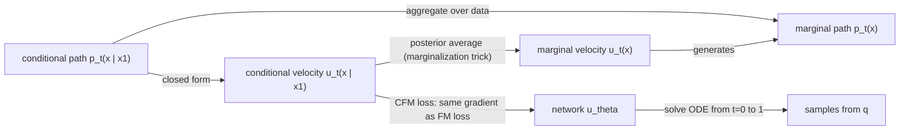

## Abstract

This is not a research paper with a result to defend; it is a long, self-contained tutorial written by many of the people who developed Flow Matching (FM), shipped together with a PyTorch library. It states one recipe — pick a probability path from a source to the data distribution, then regress a network onto the object that generates that path — and then shows that the recipe survives four changes of setting: Euclidean flows, Riemannian manifolds, discrete state spaces, and arbitrary continuous-time Markov processes. A closing chapter places diffusion models inside the same family. The mathematics is more careful than in the original papers (regularity assumptions are stated, the central theorems are proved), while a four-page "quick tour" gives a complete working implementation before any theory. This note reviews the manuscript as a study text: chapter map, the load-bearing results, a reading order, and what the code covers.

**Keywords:** flow matching, conditional flow matching, probability path, marginalization trick, affine schedulers, discrete flow matching, generator matching, probability-flow ODE

## 1 Introduction

The FM literature is hard to enter: the same idea was introduced three times (flow matching, stochastic interpolants, rectified flow), and the extensions to manifolds and discrete data live in separate papers with separate notation. The guide's stated purpose is twofold: a comprehensive reference on design choices and extensions, and a fast on-ramp for newcomers.

Its organizing claim is that <mark>the recipe is always two steps — (1) choose a probability path $p_t$ with $p_0=p$ (source) and $p_1=q$ (data); (2) train a network by regression so that the process it defines has exactly those marginals</mark>. What changes between chapters is only the state space and the kind of process: a velocity field for flows, a rate matrix for Markov chains, a generator in general.

The chapter map, with page counts as a proxy for weight:

| § | Topic | Pages | Role |
|---|---|---|---|
| 1–2 | Introduction, quick tour with standalone code | 3–7 | Cheat-sheet; enough to implement vanilla FM |
| 3 | Flow models: push-forward, ODE flows, continuity equation, likelihood | 8–15 | Prerequisites, done rigorously |
| 4 | Flow Matching in $\mathbb{R}^d$: paths, marginalization trick, losses, OT, schedulers, couplings, guidance | 16–34 | **The core** |
| 5 | Riemannian FM: geodesic and premetric conditional flows | 35–39 | Extension |
| 6–7 | Continuous-time Markov chains; Discrete FM, factorized and mixture paths | 40–51 | Extension (text, tokens) |
| 8–9 | General Markov processes and generators; Generator Matching; combining models | 52–70 | Unifying theory |
| 10 | Relation to diffusion and other denoising models | 71–76 | Bridge to the rest of this series |
| A | Extra proofs | 81–83 | Reference |

## 2 Background

Chapter 3 fixes the vocabulary the rest of the guide depends on. A *flow* $\psi_t$ is a time-indexed diffeomorphism defined by a velocity field through an ODE,

$$
\frac{d}{dt}\psi_t(x) = u_t(\psi_t(x)), \qquad \psi_0(x)=x, \tag{1}
$$

and $u_t$ is said to *generate* a path $p_t$ if $X_t=\psi_t(X_0)\sim p_t$ whenever $X_0\sim p_0$. The practical test for "generates" is the Mass Conservation theorem: under local Lipschitz and integrability conditions, $u_t$ generates $p_t$ exactly when the pair satisfies the continuity equation

$$
\frac{d}{dt}p_t(x) + \mathrm{div}\big(p_t(x)\,u_t(x)\big) = 0. \tag{2}
$$

The chapter also derives the instantaneous change of variables and an unbiased log-likelihood estimator that replaces the divergence by a Hutchinson trace, computable with one vector–Jacobian product per ODE step. Flows come first because they are the simplest continuous-time Markov process, cheaper to simulate than SDEs, and give unbiased likelihoods rather than bounds.

## 3 Method

> **Key idea.** The velocity field that transports noise to the whole data distribution is intractable, but it is the conditional expectation of per-example velocities that are trivial to write down. A regression loss whose gradient is linear in its target lets you train against the per-example velocities and still recover the marginal field.

### 3.1 The quick tour (§2)

With a Gaussian source and the linear ("conditional OT") path $p_{t|1}(x\mid x_1)=\mathcal{N}(x\mid t x_1,(1-t)^2 I)$, one samples $X_t=(1-t)X_0+tX_1$ and the conditional velocity is $(x_1-x)/(1-t)$. Substituting gives the simplest loss in the guide:

$$
\mathcal{L}^{\text{OT,Gauss}}_{\text{CFM}}(\theta)=\mathbb{E}_{t,X_0,X_1}\big\|u^\theta_t(X_t)-(X_1-X_0)\big\|^2,\qquad t\sim U[0,1],\ X_0\sim\mathcal{N}(0,I),\ X_1\sim q. \tag{3}
$$

### 3.2 Marginalization trick and the CFM loss (§4.2–4.5)

The marginal velocity is the posterior-weighted average of conditional ones, for any conditioning variable $Z$ (the choice $Z=X_1$ is the usual one):

$$
u_t(x)=\mathbb{E}\big[\,u_t(X_t\mid Z)\ \big|\ X_t=x\,\big]. \tag{4}
$$

Theorem 3 proves that this $u_t$ generates the marginal path, by checking (2); the assumptions are explicit — $C^1$ conditional paths and velocities, bounded support of $p_Z$, and $p_t>0$. The loss is then stated for any Bregman divergence $D$, not only squared error:

$$
\mathcal{L}_{\text{CFM}}(\theta)=\mathbb{E}_{t,Z,X_t\sim p_{t|Z}(\cdot\mid Z)}\,D\big(u_t(X_t\mid Z),\,u^\theta_t(X_t)\big),\qquad \nabla_\theta\mathcal{L}_{\text{FM}}=\nabla_\theta\mathcal{L}_{\text{CFM}}. \tag{5}
$$

<mark>The gradient identity is a special case of a general fact (Proposition 1): minimizing a Bregman divergence against a random target learns its conditional expectation.</mark> The same proposition is reused for the manifold, discrete and generator versions.

### 3.3 Conditional flows, OT, and affine schedulers (§4.6–4.8)

Paths are most easily specified through conditional *flows* $\psi_t(x_0\mid x_1)$. The linear flow is singled out because it minimizes an upper bound on kinetic energy among conditional flows; it is the true OT solution only when the target is a single point (Theorem 5), a caveat that is easy to miss elsewhere. The general family is

$$
\psi_t(x_0\mid x_1)=\alpha_t x_1+\sigma_t x_0,\qquad \alpha_0=\sigma_1=0,\ \ \alpha_1=\sigma_0=1, \tag{6}
$$

with $(\alpha_t,\sigma_t)$ called a scheduler. Three practical consequences follow:

- **Parameterizations are interchangeable.** Velocity, $x_1$-prediction (denoiser), $x_0$-prediction (noise) and, for Gaussian paths, the score are related by $f^B_t(x)=a_t x+b_t f^A_t(x)$; Table 1 of the guide lists the coefficients, and singular endpoints are flagged.
- **Schedulers can be changed after training** via a scale–time transformation driven by the signal-to-noise ratio $\alpha_t/\sigma_t$, and <mark>in exact arithmetic all schedulers give the same endpoint map $\psi_1$</mark> — so scheduler choice is about training conditioning and solver error, not about what is learned.
- For Gaussian paths the marginal velocity is a gradient field, hence kinetically optimal *for that fixed path*.

### 3.4 Couplings and guidance (§4.9–4.10)

The source need not be independent noise. Paired-data couplings $\pi_{0,1}=\pi_{0|1}(x_0\mid x_1)q(x_1)$ bridge a corrupted and a clean sample; minibatch-OT ("multisample") couplings lower transport cost and straighten trajectories as the batch size $k$ grows. Classifier and classifier-free guidance are obtained through the velocity–score conversion, giving $\tilde u_t(x\mid y)=(1-w)\,u_t(x\mid\varnothing)+w\,u_t(x\mid y)$. The authors state plainly that the distribution CFG actually samples from is not known.

### 3.5 Beyond $\mathbb{R}^d$ (§5–9)

- **Riemannian FM** replaces straight lines by geodesics, $\psi_t(x_0\mid x_1)=\exp_{x_0}\!\big(\kappa(t)\log_{x_0}(x_1)\big)$, which stays simulation-free when exp/log maps are closed-form; premetrics are offered when they are not.
- **Discrete FM** swaps velocities for CTMC rate matrices and the continuity equation for the Kolmogorov equation. With factorized *mixture* paths each token is its target value with probability $\kappa_t$ and its source value otherwise, and the network only has to output per-coordinate posteriors.
- **Generator Matching** parameterizes the generator of a general Markov process. Theorem 18 says that on $\mathbb{R}^d$ every such generator is a sum of a flow, a diffusion and a jump part; Proposition 3 shows that models sharing a path can be mixed (Markov superposition), augmented with divergence-free terms, or turned into predictor–corrector samplers.

### 3.6 Where diffusion sits (§10)

Time runs the other way (FM: noise at $t=0$; diffusion: noise at $r\to\infty$). A forward SDE with affine drift yields a Gaussian conditional path $\mathcal{N}(\alpha_t z,\sigma_t^2 I)$, i.e. a particular affine scheduler. <mark>Denoising score matching is then FM with $x_0$-prediction reparameterized as a score; the probability-flow ODE is FM sampling; and the reverse SDE family arises by adding Langevin dynamics with an arbitrary noise level $\beta_t$, which leaves the marginals unchanged.</mark> Time reversal is therefore not needed: only matching marginals is, which is a weaker requirement than Anderson's full reversal.

## 4 What the code covers

The manuscript interleaves eleven listings that use the `flow_matching` PyTorch package.

| Listing | What it shows | Library objects |
|---|---|---|
| Code 1 | Complete FM on two-moons: MLP, loss (3), midpoint sampler — no library | — |
| Code 2 | Sampling $X_1$ by ODE solve | `ODESolver`, `ModelWrapper` |
| Code 3 | Log-likelihood by solving the augmented ODE backwards | `ODESolver.compute_likelihood` |
| Code 4 | Generic CFM training loop | `ProbPath`, `PathSample` |
| Code 5 | Affine paths and schedulers | `AffineProbPath`, `CondOTPath`, `CondOTScheduler`, `PolynomialConvexScheduler`, `LinearVPScheduler`, `CosineScheduler` |
| Code 6 | Training an $x_1$-prediction model | `AffineProbPath` |
| Code 7 | Post-training scheduler change (VP → CondOT) | `ScheduleTransformedModel`, `VPScheduler` |
| Code 8 | Geodesic flows on a sphere | `GeodesicProbPath`, `Sphere` |
| Code 9–10 | Discrete mixture paths, training and sampling | `MixtureDiscreteProbPath`, `MixturePathGeneralizedKL`, `MixtureDiscreteEulerSolver` |
| Code 11 | Standalone discrete FM, no library | — |

The design mirrors the theory: a *path* object returns $(X_t, \dot X_t)$ given $(t,x_0,x_1)$, a *scheduler* supplies $\alpha_t,\sigma_t$, a *solver* consumes a wrapped model. Swapping the path is a one-line change. What the listings do **not** cover: Generator Matching (§8–9 has no code — no jump or superposition models), multisample OT couplings, and guidance; the abstract mentions image and text examples in the repository, which I did not inspect for this note.

## 5 Discussion

**Strengths.** Proofs come with their assumptions, so you can see where a construction could fail (positivity of $p_t$, integrability of conditional velocities, singular conversions at the endpoints). The Bregman-divergence viewpoint explains in one stroke why training on conditionals works in every setting. The diffusion chapter is precise about what differs: same paths and losses up to parameterization, a free noise level at sampling time, no need for time reversal. The quick tour is sufficient to get a working model.

**Weaknesses.** There are no experiments, so no design choice is justified empirically: schedulers are shown to be equivalent at the endpoint, but not which one trains best or needs fewer solver steps. Solver choice, time sampling, loss weighting and architecture are barely discussed. Chapters 8–9 are a sharp jump in abstraction (Feller processes, generators, test functions) without code to anchor them. As a v1 manuscript it has visible typos (the Figure 2 caption labels both source and target as $q$), and few-step or distillation methods are outside its scope.

**Suggested reading order.** (i) §2 and run Code 1. (ii) §3.4–3.5 for "generates" and the continuity equation; skim the rest of §3. (iii) §4.2–4.5 carefully — this is the theory. (iv) §4.8 for schedulers and parameterization conversions, then §10 straight away if you come from diffusion. (v) §4.9–4.10 when you need conditioning. (vi) §5, §6–7, §8–9 only when the application calls for manifolds, tokens, or jumps.

## 6 Takeaways

- FM is a two-step recipe — design a path, regress onto its generator — with one proof pattern (marginalization trick + Bregman gradient identity) reused in four settings.
- The linear path is "conditional OT", not OT: it minimizes a bound on kinetic energy, and only minibatch-OT couplings move the marginal flow toward true OT.
- Velocity, denoiser, noise and score predictions are affinely related for affine/Gaussian paths, and schedulers can be swapped after training; treat these as numerical choices rather than modelling ones.
- Diffusion is FM with a Gaussian path from an affine-drift SDE plus an optional Langevin term at sampling time; the ODE–SDE choice is a sampling knob $\beta_t$ with an empirically optimal value, not a different model.
- For financial time series, the pieces that transfer most directly are data couplings (conditioning on an observed past or a partial path as the source side of a bridge) and cheap unbiased likelihoods from ODE flows. <mark>The generator-matching view — flow plus diffusion plus jump in one model — maps naturally onto jump-diffusion intuitions about prices, but the guide offers neither code nor experiments for it, so that remains an idea to test rather than a result.</mark>

## References

1. Lipman, Y., Havasi, M., Holderrieth, P., Shaul, N., Le, M., Karrer, B., Chen, R. T. Q., Lopez-Paz, D., Ben-Hamu, H., Gat, I. *Flow Matching Guide and Code.* arXiv preprint, 2024. [arXiv:2412.06264](https://arxiv.org/abs/2412.06264)
2. Lipman, Y., Chen, R. T. Q., Ben-Hamu, H., Nickel, M., Le, M. *Flow Matching for Generative Modeling.* ICLR 2023. [arXiv:2210.02747](https://arxiv.org/abs/2210.02747)
3. Liu, X., Gong, C., Liu, Q. *Flow Straight and Fast: Learning to Generate and Transfer Data with Rectified Flow.* ICLR 2023. [arXiv:2209.03003](https://arxiv.org/abs/2209.03003)
4. Albergo, M. S., Boffi, N. M., Vanden-Eijnden, E. *Stochastic Interpolants: A Unifying Framework for Flows and Diffusions.* 2023. [arXiv:2303.08797](https://arxiv.org/abs/2303.08797)
5. Holderrieth, P., Havasi, M., Yim, J., Shaul, N., Gat, I., Jaakkola, T., Karrer, B., Chen, R. T. Q., Lipman, Y. *Generator Matching: Generative Modeling with Arbitrary Markov Processes.* 2024.
