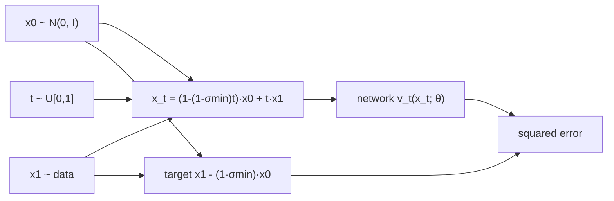

## Abstract

Continuous normalizing flows (CNFs) can represent any smooth probability path, but before this paper nobody trained them at image scale, because maximum likelihood puts an ODE solve inside every gradient step. Flow Matching (FM) replaces that with a regression: fix a probability path from noise to data, then fit a network to the vector field that generates it. The target field is an intractable integral, yet a per-sample "conditional" version of the loss has identical gradients, so a training step needs only a noise draw, a data point and a time. Diffusion paths reappear as one choice of Gaussian conditional path; a second choice, with mean and standard deviation both linear in time, gives straight constant-speed conditional trajectories. On CIFAR-10 and ImageNet at 32, 64 and 128 pixels, the straight-path variant gives the best likelihood, FID and solver cost among the four objectives compared on a single U-Net.

**Keywords:** flow matching, continuous normalizing flows, conditional flow matching, optimal-transport displacement path, simulation-free training, probability flow ODE

## 1 Introduction

Diffusion models owe their success to a training recipe that scales: denoising score matching is a regression with no simulation in the loop. The price is that the probability path from data to noise is whatever a simple diffusion process happens to produce. That path is curved, it never quite reaches pure noise in finite time, and traversing it quickly needs specialised samplers.

CNFs are the more general object — a time-dependent vector field moving samples along an ODE, able to reproduce any diffusion's marginals — but they lacked a loss that scales. Maximum likelihood backpropagates through a sequential ODE solver. The paper names the two simulation-free alternatives that existed and why each fails: one (Rozen et al., 2021) contains integrals that cannot be estimated in high dimension, the other (Ben-Hamu et al., 2022) gives biased gradients in the minibatch regime. Regularising the ODE — augmentation, kinetic penalties, stochastic integration intervals — leaves the training algorithm untouched.

The aim is to give CNFs the loss diffusion has, and in doing so to <mark>drop the diffusion process altogether and reason directly about probability paths</mark>. The payoff is that path design becomes a free variable, spent immediately on a path diffusion cannot produce.

## 2 Background

A vector field $v_t:\mathbb{R}^d\to\mathbb{R}^d$, $t\in[0,1]$, defines a flow $\phi_t$ through

$$
\frac{d}{dt}\phi_t(x)=v_t(\phi_t(x)),\qquad \phi_0(x)=x. \tag{1}
$$

Pushing a prior $p_0=\mathcal{N}(0,I)$ through $\phi_t$ gives a density path $p_t=[\phi_t]_\ast p_0$. The test for whether $v_t$ *generates* $p_t$ is the continuity equation, $\partial_t p_t+\operatorname{div}(p_tv_t)=0$; every proof in the paper reduces to checking it. A CNF is this construction with $v_t(x;\theta)$ a neural network ([Neural ODE](/blog/neural-ode/)).

Note the time convention: $t=0$ is noise and $t=1$ is data, the reverse of [DDPM](/blog/ddpm/) and [Score-SDE](/blog/score-sde/). I keep the paper's convention throughout. Two concurrent papers reach closely related objectives: [Rectified Flow](/blog/rectified-flow/) and [Stochastic Interpolants](/blog/stochastic-interpolants/); the paper acknowledges both and I return to the division of credit in §7.

## 3 Method

> **Key idea.** The field that transports noise to the whole data distribution is a posterior-weighted average of the much simpler fields that transport noise to a single data point. Regressing on the simple per-sample field, with the data point drawn at random, gives exactly the same gradient as regressing on the intractable average.

### 3.1 The objective you want, and why you cannot have it

Given a target path $p_t$ and a field $u_t$ generating it, the ideal objective is

$$
\mathcal{L}_{\mathrm{FM}}(\theta)=\mathbb{E}_{t\sim\mathcal{U}[0,1],\,x\sim p_t}\,\lVert v_t(x;\theta)-u_t(x)\rVert^2. \tag{2}
$$

At zero loss the model generates $p_t$ exactly. But neither $p_t$ nor $u_t$ is known in closed form for a path that ends at the data distribution, so (2) cannot be evaluated, let alone differentiated.

### 3.2 Building the marginal from conditionals

For each data point $x_1\sim q$, choose a conditional path $p_t(x\mid x_1)$ with $p_0(x\mid x_1)=\mathcal{N}(0,I)$ and $p_1(x\mid x_1)=\mathcal{N}(x_1,\sigma^2I)$ for small $\sigma$. Averaging over data gives the marginal path

$$
p_t(x)=\int p_t(x\mid x_1)\,q(x_1)\,dx_1,\qquad p_1\approx q. \tag{3}
$$

The approximation in $p_1\approx q$ is the first of only two approximations in the whole construction: the model targets $q$ smoothed by a Gaussian of width $\sigma_{\min}$, not $q$ itself. If $u_t(\cdot\mid x_1)$ generates the conditional path, define the marginal field as the posterior-weighted average

$$
u_t(x)=\int u_t(x\mid x_1)\,\frac{p_t(x\mid x_1)\,q(x_1)}{p_t(x)}\,dx_1 . \tag{4}
$$

Theorem 1 states that <mark>this average generates the marginal path</mark>, and the proof is three lines of the continuity equation. Differentiate (3) under the integral; use the fact that each $u_t(\cdot\mid x_1)$ satisfies the conditional continuity equation to replace $\partial_t p_t(x\mid x_1)$ with $-\operatorname{div}\bigl(u_t(x\mid x_1)p_t(x\mid x_1)\bigr)$; pull the divergence outside the integral; recognise the result as $-\operatorname{div}(u_tp_t)$ by the definition (4). Every step is exact given the regularity needed for the Leibniz rule. The weighting in (4) is a Bayes posterior over which data point a particle at $x$ came from, which is why the marginal field can bend even when every conditional field is straight — see §3.6.

### 3.3 Conditional Flow Matching

The usable loss draws the conditioning variable instead of integrating it out:

$$
\mathcal{L}_{\mathrm{CFM}}(\theta)=\mathbb{E}_{t,\;x_1\sim q,\;x\sim p_t(\cdot\mid x_1)}\,\lVert v_t(x;\theta)-u_t(x\mid x_1)\rVert^2. \tag{5}
$$

Theorem 2: assuming $p_t(x)>0$ everywhere, <mark>$\mathcal{L}_{\mathrm{CFM}}$ and $\mathcal{L}_{\mathrm{FM}}$ differ by a constant in $\theta$, so their gradients coincide</mark>. The proof expands both squares into three terms. The $\lVert u_t\rVert^2$ terms carry no $\theta$ and become the constant. The $\lVert v_t\rVert^2$ terms agree because integrating $\lVert v_t(x)\rVert^2$ against $p_t(x)$ is the same as integrating it against $p_t(x\mid x_1)q(x_1)$ and swapping the order. The cross terms agree because substituting (4) into $\mathbb{E}_{p_t}\langle v_t,u_t\rangle$ cancels the $p_t(x)$ in the denominator against the $p_t(x)dx$ of the expectation, leaving exactly $\mathbb{E}_{q,p_t(\cdot\mid x_1)}\langle v_t,u_t(\cdot\mid x_1)\rangle$. The exchanges of integration order need $q$ and $p_t(\cdot\mid x_1)$ to decay fast enough and $u_t,v_t,\nabla_\theta v_t$ bounded. This is the same trick that turns score matching into denoising score matching, applied to velocities instead of scores; the paper also notes that Theorem 1 follows from Peluchetti's diffusion mixture representation.

### 3.4 Gaussian conditional paths

Take $p_t(x\mid x_1)=\mathcal{N}\bigl(x\mid\mu_t(x_1),\sigma_t(x_1)^2I\bigr)$ with $\mu_0=0,\sigma_0=1$ and $\mu_1=x_1,\sigma_1=\sigma_{\min}$. Infinitely many fields generate this path — add any divergence-free component — and most of the extras are rotations that leave a rotation-invariant Gaussian alone while costing compute. The authors pick the field belonging to the canonical affine map $\psi_t(x_0)=\sigma_t(x_1)x_0+\mu_t(x_1)$, which pushes $\mathcal{N}(0,I)$ onto $p_t(\cdot\mid x_1)$ by construction. This is a *choice*, not a derivation: it is the second and last place where the construction is not forced.

Theorem 3 inverts $\psi_t$ and differentiates. From $\psi_t^{-1}(y)=(y-\mu_t)/\sigma_t$ and $\psi_t'(x)=\sigma_t'x+\mu_t'$, substituting into $\frac{d}{dt}\psi_t(x)=u_t(\psi_t(x)\mid x_1)$ gives

$$
u_t(x\mid x_1)=\frac{\sigma_t'(x_1)}{\sigma_t(x_1)}\bigl(x-\mu_t(x_1)\bigr)+\mu_t'(x_1), \tag{6}
$$

with primes denoting time derivatives. The first term contracts or expands about the moving mean at rate $\sigma_t'/\sigma_t$; the second translates with the mean. Reparameterising the CFM loss through $x_0$ then makes it fully simulation-free: $\mathcal{L}_{\mathrm{CFM}}=\mathbb{E}_{t,x_1,x_0}\lVert v_t(\psi_t(x_0))-\frac{d}{dt}\psi_t(x_0)\rVert^2$.

### 3.5 Diffusion paths are a special case

Plugging the time-reversed diffusion moments into (6) recovers the conditional probability-flow field of score-based models. For the variance-exploding path, $\mu_t=x_1$ and $\sigma_t=\sigma_{1-t}$, so $u_t(x\mid x_1)=-\frac{\sigma_{1-t}'}{\sigma_{1-t}}(x-x_1)$. For variance-preserving, $\mu_t=\alpha_{1-t}x_1$ and $\sigma_t=\sqrt{1-\alpha_{1-t}^2}$ with $\alpha_t=e^{-T(t)/2}$, $T(t)=\int_0^t\beta(s)ds$, giving

$$
u_t(x\mid x_1)=-\frac{T'(1-t)}{2}\,\frac{e^{-T(1-t)}x-e^{-\frac12T(1-t)}x_1}{1-e^{-T(1-t)}}. \tag{7}
$$

Appendix D checks that this is the probability-flow field the usual way — write the Fokker-Planck equation for $dy=f_tdt+g_tdw$, use $\Delta p=\operatorname{div}(p\nabla\log p)$ to fold the Laplacian into the drift, obtaining $w_t=f_t-\frac{g_t^2}{2}\nabla\log p_t$, then time-reverse with the lemma that $-u_{1-t}$ generates $p_{1-t}$. So on a diffusion path the only thing FM changes is the regression target: a velocity instead of a score. Note that (7) has $1-e^{-T(1-t)}\to0$ as $t\to1$, so the diffusion conditional field is singular at the data end.

### 3.6 The optimal-transport path

Let both moments be linear in time, $\mu_t=t\,x_1$ and $\sigma_t=1-(1-\sigma_{\min})t$. Then (6) gives $u_t(x\mid x_1)=\frac{x_1-(1-\sigma_{\min})x}{1-(1-\sigma_{\min})t}$, which — unlike (7) — <mark>is finite for every $t\in[0,1]$</mark>. The flow is $\psi_t(x_0)=\bigl(1-(1-\sigma_{\min})t\bigr)x_0+t\,x_1$ and the loss collapses to

$$
\mathcal{L}_{\mathrm{CFM}}(\theta)=\mathbb{E}_{t,\,x_1\sim q,\,x_0\sim\mathcal{N}(0,I)}\,\bigl\lVert v_t(\psi_t(x_0))-\bigl(x_1-(1-\sigma_{\min})x_0\bigr)\bigr\rVert^2. \tag{8}
$$

The regression target no longer depends on $t$ at all. By McCann's Example 1.7, $\psi_t$ is the optimal-transport displacement map between $\mathcal{N}(0,I)$ and $\mathcal{N}(x_1,\sigma_{\min}^2I)$, so conditional particles move in straight lines at constant speed. The paper also observes that $u_t(x\mid x_1)=g(t)h(x\mid x_1)$ factorises, which is the formal statement of "constant direction in time". They are careful to add that <mark>optimality of each conditional flow does not make the marginal field an optimal transport map</mark>. [Fig. 2 in the paper](https://arxiv.org/pdf/2210.02747#page=6) contrasts the diffusion conditional score, whose shape changes with $t$, against the OT field, whose direction does not; [Fig. 3](https://arxiv.org/pdf/2210.02747#page=6) shows diffusion trajectories overshooting and backtracking while OT ones run straight.

### 3.7 Intuition: two one-dimensional cases

**Why the path reaches the ends.** Let $d=1$ and let the data be a single point $a$. The marginal path equals the conditional path, and with $\sigma_{\min}\to0$ the OT interpolant is $x_t=(1-t)x_0+ta$ with velocity $a-x_0$: a straight line traversed at unit speed that lands exactly on $a$ at $t=1$ and starts exactly at $\mathcal{N}(0,1)$ at $t=0$. Now take the VP path with the paper's schedule, $\beta$ linear from $\beta_{\min}=0.1$ to $\beta_{\max}=20$, so $T(1)=0.1+\tfrac12(19.9)=10.05$ and $\alpha_1=e^{-5.025}\approx0.0066$. At the "noise" end the VP conditional mean is not $0$ but $0.0066\,a$, and its standard deviation is $0.99998$ rather than $1$. That residual is the truncation bias diffusion paths carry and linear paths do not; it is also why the paper samples $t$ in $[0,1-10^{-5}]$ for the diffusion baselines.

**Why "optimal" does not survive marginalisation.** Keep $d=1$ and let $q=\tfrac12\delta_{+a}+\tfrac12\delta_{-a}$. Each conditional field is a constant, $\pm a-x_0$, but the marginal field (4) is their posterior-weighted average: near $x=0$ the posterior is near-even, so the velocity sits between the two and then swings to one side as the posterior sharpens. Straight conditionals, bent marginal — the gap the paper flags and does not measure.

### 3.8 Algorithm

```text
TRAIN (OT path)
  repeat until converged:
    x1 ~ q                               # data minibatch
    x0 ~ N(0, I)                         # same shape
    t  ~ Uniform[0, 1]                   # one t per sample
    xt     = (1 - (1 - s_min) * t) * x0 + t * x1
    target = x1 - (1 - s_min) * x0       # independent of t
    loss   = mean( || v(xt, t; theta) - target ||^2 )
    theta  = adam_step(theta, grad(loss))

SAMPLE
  x0 ~ N(0, I)
  x1 = ODESolve(dx/dt = v(x, t; theta), x0, t: 0 -> 1)   # dopri5, atol=rtol=1e-5

LOG-LIKELIHOOD of a given x1  (Appendix C)
  # integrate the flow backwards, augmented with the divergence
  state = [x1, 0]
  for s in 0 -> 1:                        # so t = 1 - s runs 1 -> 0
    dx = -v(x, 1 - s; theta)
    df = + z^T (Dv)(x, 1 - s) z           # Hutchinson, E[z z^T] = I
  x0, f = state
  log p1(x1) = log p0(x0) - f
  bpd = -log p1(x1) / (d * log 2) + 7     # for the [-1,1] -> [0,256] rescaling
```

The Hutchinson trace estimator makes the divergence cheap and is unbiased for $\log p_1$ only because the ODE is solved (to small tolerance) *before* the expectation over $z$ is taken.



## 4 Implementation notes

The architecture is the U-Net of [ADM](/blog/diffusion-beats-gans/) "with minimal changes" — the changes are not enumerated. For the 2D checkerboard toy the network is a 5-layer MLP of width 512. Reported settings:

| | CIFAR-10 | IN-32 | IN-64 | IN-128 |
|---|---|---|---|---|
| Channels | 256 | 256 | 192 | 256 |
| Depth | 2 | 3 | 3 | 3 |
| Channel multipliers | 1,2,2,2 | 1,2,2,2 | 1,2,3,4 | 1,1,2,3,4 |
| Heads / head channels | 4 / 64 | 4 / 64 | 4 / 64 | 4 / 64 |
| Attention resolutions | 16 | 16,8 | 32,16,8 | 32,16,8 |
| Dropout | 0.0 | 0.0 | 0.0 | 0.0 |
| Effective batch | 256 | 1024 | 2048 | 1536 |
| GPUs | 2 | 4 | 16 | 32 |
| Epochs / iterations | 1000 / 391k | 200 / 250k | 250 / 157k | 571 / 500k |
| Learning rate | 5e-4 | 1e-4 | 1e-4 | 1e-4 |
| Schedule | poly decay | poly decay | constant | poly decay |
| Warmup steps | 45k | 20k | – | 20k |

Details that are easy to get wrong when reproducing:

- **Precision and optimiser.** Full 32-bit for CIFAR-10 and IN-32, 16-bit mixed for IN-64/128/256. Adam with $\beta_1=0.9$, $\beta_2=0.999$, weight decay $0$, $\epsilon=10^{-8}$; the polynomial schedule warms up linearly from $10^{-8}$ to the peak, then decays linearly back.
- **The diffusion baselines are three different losses, not one.** Score Matching regresses $s_t(x)$ onto $(x-\mu_t)/\sigma_t^2$ with weight $\lambda(t)=\sigma_t^2$; ScoreFlow uses $\lambda(t)=\beta(1-t)$, the weight that makes it an NLL bound; DDPM regresses $\epsilon_t(\sigma_tx_0+\mu_t)$ onto $x_0$. All share the VP path with $\beta$ linear from $0.1$ to $20$ and $t\in[0,1-10^{-5}]$. Score-matching samples come from the ODE $u_t(x)=-\frac{T'(1-t)}{2}[s_t(x)-x]$, DDPM's from the same ODE after $s_t=\epsilon_t/\sigma_t$.
- **Likelihoods depend on the dequantisation budget.** NLL uses uniform dequantisation with an importance-weighted estimate $\log\frac1K\sum_kp_1(x+u_k)$, $u_k\sim\mathcal{U}(0,1)$, solved with `dopri5` at `atol=rtol=1e-5`. Table 4 shows CIFAR-10 FM-OT moving from 3.11 at $K{=}1$ to 2.99 at $K{=}50$ — a 0.12 bpd swing, larger than most gaps in the headline table. Any comparison must fix $K$.
- **$\sigma_{\min}$ is never given a numerical value** anywhere in the paper. FID tooling also differs by dataset — the TensorFlow-GAN library for CIFAR-10 and IN-32/64, ADM's own script for IN-128.

## 5 Experiments

**Setup.** Unconditional CIFAR-10 and ImageNet at 32, 64 and 128 pixels. Baselines are DDPM, Score Matching and ScoreFlow losses on the same U-Net. NFE is the average number of function evaluations `dopri5` needs at tolerance $10^{-5}$, over 50k samples.

Main results (Table 1, left; NLL in bits per dimension):

| Model | CIFAR-10 NLL | FID | NFE | IN-32 NLL | FID | NFE | IN-64 NLL | FID | NFE |
|---|---|---|---|---|---|---|---|---|---|
| DDPM | 3.12 | 7.48 | 274 | 3.54 | 6.99 | 262 | 3.32 | 17.36 | 264 |
| Score Matching | 3.16 | 19.94 | 242 | 3.56 | 5.68 | 178 | 3.40 | 19.74 | 441 |
| ScoreFlow | 3.09 | 20.78 | 428 | 3.55 | 14.14 | 195 | 3.36 | 24.95 | 601 |
| FM w/ Diffusion | 3.10 | 8.06 | 183 | 3.54 | 6.37 | 193 | 3.33 | 16.88 | 187 |
| **FM w/ OT** | **2.99** | **6.35** | **142** | **3.53** | **5.02** | **122** | **3.31** | **14.45** | **138** |

The dequantisation ablation (Table 4), which is what the NLL column of Table 1 is read off at maximum $K$:

| Model | CIFAR $K{=}1$ | $K{=}20$ | $K{=}50$ | IN-32 $K{=}1$ | $K{=}5$ | $K{=}15$ | IN-64 $K{=}1$ | $K{=}5$ | $K{=}10$ |
|---|---|---|---|---|---|---|---|---|---|
| DDPM | 3.24 | 3.14 | 3.12 | 3.62 | 3.57 | 3.54 | 3.36 | 3.33 | 3.32 |
| Score Matching | 3.28 | 3.18 | 3.16 | 3.65 | 3.59 | 3.57 | 3.43 | 3.41 | 3.40 |
| ScoreFlow | 3.21 | 3.11 | 3.09 | 3.63 | 3.57 | 3.55 | 3.39 | 3.37 | 3.36 |
| FM w/ Diffusion | 3.23 | 3.13 | 3.10 | 3.64 | 3.58 | 3.56 | 3.37 | 3.34 | 3.33 |
| **FM w/ OT** | **3.11** | **3.01** | **2.99** | **3.62** | **3.56** | **3.53** | **3.35** | **3.33** | **3.31** |

Super-resolution, 64→256 on the ImageNet validation set (Table 2):

| Model | FID | IS | PSNR | SSIM |
|---|---|---|---|---|
| Reference | 1.9 | 240.8 | – | – |
| Regression | 15.2 | 121.1 | 27.9 | 0.801 |
| SR3 | 5.2 | 180.1 | 26.4 | 0.762 |
| **FM w/ OT** | **3.4** | **200.8** | 24.7 | 0.747 |

**Claim by claim.**

1. *FM-OT is best on likelihood, sample quality and solver cost.* Table 1 left, nine columns out of nine. Strong within the ablation, because loss and path are varied separately on a fixed architecture: FM-Diffusion versus SM isolates velocity-vs-score regression, FM-OT versus FM-Diffusion isolates straight-vs-curved path. Weak as a general statement: single runs, no seeds, no error bars, and the IN-32 NLL margin is 0.01 bpd — smaller than the $K$-dependence in Table 4.
2. *FM on diffusion paths is "more robust and stable" than score matching.* FM-Diffusion beats SM on seven of the nine numbers (SM is better on ImageNet-32 FID and NFE), and the 2D trajectory plots ([Fig. 4](https://arxiv.org/pdf/2210.02747#page=7), [Fig. 9](https://arxiv.org/pdf/2210.02747#page=19)) look cleaner. But robustness and stability are never measured — no gradient-variance curves, no failed-run counts, no learning-rate sweeps. The adjective outruns the evidence.
3. *Faster training.* [Fig. 5](https://arxiv.org/pdf/2210.02747#page=8) shows FID on IN-64 falling fastest for FM-OT against all three baselines on the same setup, which is controlled. The headline "33% less image throughput" compares FM's 500k iterations at batch 1536 against ADM's 4.36M at batch 256 — a different paper, a 25% smaller model, a different schedule. A cross-paper anecdote, not an ablation.
4. *Faster sampling.* [Fig. 7](https://arxiv.org/pdf/2210.02747#page=9) measures per-pixel MSE of low-NFE fixed-step solutions against a 1000-NFE reference on IN-32 over 256 seeds; <mark>the OT model needs roughly 60% of the evaluations of the diffusion-path models for the same error</mark>, and keeps a usable FID at very low NFE across Euler, midpoint and RK4. Supported, though the 60% is read off a log-scale plot. [Fig. 6](https://arxiv.org/pdf/2210.02747#page=8) adds the qualitative version, and [Fig. 10](https://arxiv.org/pdf/2210.02747#page=21) a point the text almost buries: sampling cost drifts upward during training for score matching but stays flat for FM.
5. *Better generalisation* (abstract). Nothing isolates it; test-set NLL is the closest proxy and is not decomposed. Unsupported as phrased.
6. *State of the art on unconditional ImageNet-128.* FM-OT reaches NLL 2.90 and FID 20.9 against unconditional GANs whose best entry, PGMGAN, is 21.7 (IC-GAN excluded for self-supervised conditioning). <mark>The comparison set contains no diffusion model at all</mark>, so read it as "competitive with unconditional GANs".
7. *Conditional generation.* FM-OT beats SR3 on FID and IS and loses on PSNR and SSIM — the expected perceptual-versus-distortion trade-off, which the authors acknowledge by citing SR3's own argument that FID and IS are the better indicators.

## 6 Limitations

**Stated by the authors.**

- CIFAR-10 FIDs are higher than previously published diffusion results; they attribute this to a U-Net not tuned for CIFAR-10.
- Conditional optimality does not imply the marginal field is an optimal transport solution; they only "expect the marginal vector field to remain relatively simple".
- Diffusion paths never reach a true noise distribution in finite time, so $p_0$ is approximated in practice — a defect of the baselines that the OT path removes.
- The conclusion lists non-isotropic Gaussians and general kernels as open.
- The social-responsibility section notes generative misuse and the energy cost of large training runs.

**My reading.**

- **Internal inconsistency in the numbers.** The ImageNet-32 NLLs in Table 1 do not match Table 4 at maximum $K$ for two rows: Score Matching (3.56 vs 3.57) and FM w/ Diffusion (3.54 vs 3.56). Small, but the IN-32 column cannot be read at the precision the bolding implies.
- **Inconsistent statement about the training budget.** §6.1 says all models use "the same architecture, hyperparameter values and number of training iterations, where baselines are allowed more iterations for better convergence" — two clauses that contradict each other. Appendix E covers only FM-OT, FM-Diffusion and SM-Diffusion; DDPM and ScoreFlow are not in that sentence.
- **$\sigma_{\min}$ is an unreported hyperparameter of the headline method**, and it sets how much the model smooths the data. No sensitivity study.
- **No stochastic sampler**, so the ODE-versus-SDE question that [Stochastic Interpolants](/blog/stochastic-interpolants/) answers cannot even be asked here; and no conditioning beyond super-resolution — no guidance, no text, no class labels, no data-to-data coupling.
- **The speed-up is relative, not few-step.** 122–142 adaptive-solver evaluations beats 262–274 and is still two orders of magnitude from [Consistency Models](/blog/consistency-models/).

## 7 Extensions

**What was built on this.** The three concurrent constructions converged: [Rectified Flow](/blog/rectified-flow/) reaches the linear interpolant from a straightening argument, [Stochastic Interpolants](/blog/stochastic-interpolants/) from a bridge-plus-latent argument that adds an SDE family on top, and this paper from conditional probability paths with the large-scale evidence attached. The linear path then became the default: [SiT](/blog/sit/) ablates interpolant against sampler on a transformer backbone, [SD3](/blog/sd3-rectified-flow-transformers/) scales rectified-flow training to text-to-image, [FM Guide](/blog/flow-matching-guide/) is the authors' own textbook treatment, and [MeanFlow](/blog/mean-flows/) pushes the same velocity parameterisation to one step. Minibatch optimal-transport couplings, which replace the independent $(x_0,x_1)$ draw with an OT assignment inside the batch, are the natural fix for the marginal-curvature gap.

**Open problems.** How curved is the *marginal* field, and does the curvature grow with dimension or with the multimodality of $q$? Nothing measures it. What paths are good when neither end is Gaussian — the construction assumes $p_0=\mathcal{N}(0,I)$ throughout, and the conditional Gaussian form is what makes (6) closed-form. Is velocity regression better than score regression because of the target's conditioning, its scale, or its time-invariance, given that FM-Diffusion versus SM confounds all three? And how should $\sigma_{\min}$ trade smoothing against likelihood?

**Research directions.** *These are ideas, not results — none has been run.*

1. **Measure the straightness the method only claims.** Hypothesis: the marginal OT field is measurably straighter than the marginal diffusion field, but the gap shrinks as $q$ becomes more multimodal. Data: CIFAR-10 plus synthetic Gaussian mixtures with a controlled number of modes. Baseline: FM-Diffusion on the same network. Metric: normalised path length $\int_0^1\lVert\dot\phi_t\rVert dt\,/\,\lVert\phi_1-\phi_0\rVert$ per trajectory against mode count. Likely failure mode: solver error at tight tolerances swamps the curvature signal on real images, so the mixtures carry the result and the CIFAR number is decorative.
2. **A heavy-tailed base for financial scenario generation.** Hypothesis: nothing in Theorems 1–3 needs $p_0$ Gaussian — only that $p_t(x\mid x_1)$ be sampleable with a closed-form $u_t$ — so a Student-$t$ or fitted elliptical reference should improve tail coverage of daily equity-index returns at fixed compute. Data: standardised multivariate daily returns for a fixed index basket with a held-out crisis window. Baseline: FM-OT with a Gaussian base, plus a GARCH-$t$ simulator. Metric: tail-region log-likelihood and coverage error of 1% and 5% VaR and expected shortfall. Likely failure mode: the affine $\psi_t$ is genuinely Gaussian-specific, so a non-Gaussian base needs a new closed-form conditional field; if the substitute is approximate, the CFM-equals-FM identity breaks and the experiment measures the approximation rather than the tails.
3. **Path design as a conditioning knob.** Hypothesis: for conditional tasks the best mean schedule is front-loaded rather than linear, because the conditioning signal makes early steps cheap. Data: the paper's 64→256 super-resolution setup. Baseline: FM-OT with $\mu_t=tx_1$. Metric: FID and PSNR at matched NFE across $\mu_t=t^\kappa x_1$, with $\sigma_t$ adjusted to keep the endpoints. Likely failure mode: $\kappa\neq1$ reintroduces a time-varying target direction, so the easier schedule is paid for by a harder regression and the whole family lands within noise of $\kappa=1$.

## 8 Takeaways

- A CNF trains by regression alone: sample $(t,x_0,x_1)$, form $x_t$, fit the network to the conditional velocity. No ODE is solved during training, and the equivalence to the intractable objective is two short proofs, both just the continuity equation and Fubini.
- Diffusion is one Gaussian path among many. Swapping the score target for a velocity target on that same path already lowers solver cost on two of the three datasets.
- Linear mean and standard deviation give straight conditional trajectories, a target direction that does not depend on $t$, and the best numbers in the paper on all three axes — but the paper's own framing is an ablation on one architecture, not a state-of-the-art claim.
- Straight conditionals are not a globally optimal coupling; the posterior average in (4) bends the marginal field, and nothing here measures how much.
- The reproducibility gaps are small but real: $\sigma_{\min}$ is never stated, the ImageNet-32 NLLs disagree between two tables, and likelihood numbers shift by more than most reported gaps when the dequantisation budget $K$ changes.
- For financial time series the appeal is structural rather than demonstrated. A deterministic sampler with tractable likelihoods suits scenario generation and density evaluation, and the objective needs only that the base be sampleable. The paper tests none of this, and heavy tails, conditioning on market state, and any notion of path realism would have to be designed in.

## References

1. Lipman, Y., Chen, R. T. Q., Ben-Hamu, H., Nickel, M., Le, M. *Flow Matching for Generative Modeling.* arXiv:2210.02747 (ICLR 2023).
2. Song, Y. et al. *Score-Based Generative Modeling through Stochastic Differential Equations.* arXiv:2011.13456.
3. Liu, X., Gong, C., Liu, Q. *Flow Straight and Fast: Learning to Generate and Transfer Data with Rectified Flow.* arXiv:2209.03003.
4. Albergo, M. S., Vanden-Eijnden, E. *Building Normalizing Flows with Stochastic Interpolants.* arXiv:2209.15571.
5. Dhariwal, P., Nichol, A. *Diffusion Models Beat GANs on Image Synthesis.* arXiv:2105.05233.
6. Saharia, C. et al. *Image Super-Resolution via Iterative Refinement (SR3).* IEEE TPAMI, 2022.
