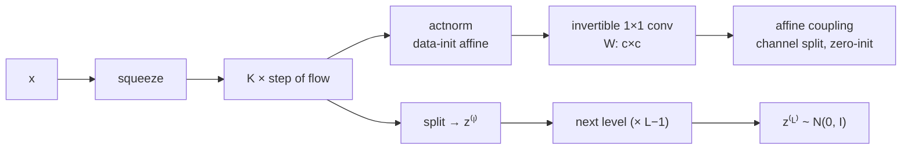

## Abstract

Glow is [Real NVP](/blog/realnvp/) with the permutation made learnable and the normalisation made batch-independent. A step of flow is three operations: *actnorm*, a per-channel scale and bias initialised so that the first minibatch comes out with zero mean and unit variance and thereafter trained as ordinary parameters; an *invertible $1\times1$ convolution*, a $c\times c$ matrix applied at every spatial position, whose log-determinant is $h\cdot w\cdot\log\lvert\det W\rvert$ and which generalises the fixed channel reversal Real NVP used; and an *affine coupling layer*, split along channels only, with the last convolution of its network zero-initialised so the layer starts as the identity. Stacked $K$ deep across $L$ multi-scale levels, this gives 3.35 bits/dim on CIFAR-10 against Real NVP's 3.49, and 2.38 on LSUN bedrooms against 2.72. The qualitative half of the paper trains the same architecture on 5-bit $256\times256$ CelebA-HQ and shows realistic faces, smooth latent interpolation, and post-hoc attribute editing by latent-space difference vectors — sampled at temperature 0.7, which is a different distribution from the one whose likelihood is reported.

**Keywords:** invertible $1\times1$ convolution, actnorm, data-dependent initialisation, LU parameterisation, temperature sampling, multi-scale flow

## 1 Introduction

The paper's framing of why flows deserve attention is the clearest short statement of the case, and it is four bullets:

- **Exact latent inference and exact log-likelihood.** A VAE infers latents only approximately; a GAN has no encoder at all. A reversible model does both exactly, so you can optimise the likelihood rather than a bound on it.
- **Efficient inference *and* efficient synthesis.** Autoregressive models are also reversible but their synthesis is sequential in $D$; a flow parallelises in both directions.
- **A usable latent space.** The hidden layers of an autoregressive model have unknown marginals, so manipulating them is not meaningful. GAN latents cannot be inferred and the generator may not have full support over the data.
- **Constant-memory gradients.** Reversibility means activations need not be stored, as in RevNet — memory constant rather than linear in depth.

Against that, the authors' honest assessment of the field: *flow-based generative models have so far gained little attention in the research community compared to GANs and VAEs.* Glow is the paper that changed that, and it did so mostly with a figure of faces rather than with a bits-per-dimension table.

The reason I care about the specific contribution here is not the faces. It is that the invertible $1\times1$ convolution is a *learned linear mixing step between coupling layers*, which is exactly what is missing when you take a coupling flow off an image and put it on a table of factor returns. Real NVP's checkerboard and channel masks encode a spatial prior; a factor panel has no spatial structure, and the question of which coordinates should condition which becomes a free parameter. Glow answers it by learning a rotation.

## 2 Background

With $z\sim p_\theta(z)$ and $x=g_\theta(z)$, $f=g^{-1}$, and $f=f_1\circ\cdots\circ f_K$,

$$
\log p_\theta(x)=\log p_\theta(z)+\sum_{i=1}^{K}\log\bigl\lvert\det(dh_i/dh_{i-1})\bigr\rvert, \tag{1}
$$

with $h_0\equiv x$, $h_K\equiv z$. For triangular Jacobians the log-determinant collapses to

$$
\log\bigl\lvert\det(dh_i/dh_{i-1})\bigr\rvert=\operatorname{sum}\bigl(\log\lvert\operatorname{diag}(dh_i/dh_{i-1})\rvert\bigr). \tag{2}
$$

The paper is careful about the dequantisation bookkeeping that makes bits/dim meaningful. For discrete $x$ the objective is $\tfrac1N\sum_i-\log p_\theta(x^{(i)})$; for continuous data,

$$
\mathcal{L}(\mathcal{D})\simeq\frac1N\sum_{i=1}^{N}-\log p_\theta\bigl(\tilde x^{(i)}\bigr)+c,
\qquad \tilde x=x+u,\; u\sim\mathcal{U}(0,a),\; c=-M\log a, \tag{3}
$$

where $a$ is the discretisation level and $M$ the dimensionality. Both forms *measure the expected compression cost in nats or bits*, which is the only interpretation under which these numbers are comparable across papers.

## 3 Method

> **Key idea.** Between coupling layers you need something that mixes coordinates, because a coupling layer leaves half of them alone. Real NVP used a fixed reversal of the channel order. A $1\times1$ convolution with equal input and output channels is a general invertible linear map on channels — a strict generalisation of any permutation — and its log-determinant costs one $c\times c$ determinant, shared across all $h\cdot w$ positions.

### 3.1 The three components

| | Function | Reverse | Log-determinant |
|---|---|---|---|
| **Actnorm** | $y_{i,j}=s\odot x_{i,j}+b$ | $x_{i,j}=(y_{i,j}-b)/s$ | $h\cdot w\cdot\operatorname{sum}(\log\lvert s\rvert)$ |
| **Invertible $1\times1$ conv** | $y_{i,j}=Wx_{i,j}$ | $x_{i,j}=W^{-1}y_{i,j}$ | $h\cdot w\cdot\log\lvert\det W\rvert$ |
| **Affine coupling** | $x_a,x_b=\operatorname{split}(x)$; $(\log s,t)=\mathrm{NN}(x_b)$; $y_a=s\odot x_a+t$; $y_b=x_b$ | $(\log s,t)=\mathrm{NN}(y_b)$; $x_a=(y_a-t)/s$; $x_b=y_b$ | $\operatorname{sum}(\log\lvert s\rvert)$ |

Here $(i,j)$ are spatial indices and $x,y$ are $[h\times w\times c]$ tensors. Note the asymmetry in the first two rows: actnorm and the $1\times1$ convolution act *per spatial position* and their log-determinants are multiplied by $h\cdot w$, because the same parameters are applied at every position. A single badly scaled channel therefore contributes $h\cdot w$ times over.

### 3.2 Actnorm: why not batch norm

Real NVP put batch normalisation inside the flow. The variance of the noise batch norm injects is inversely proportional to the per-device minibatch size, so it degrades when that size is small — and *for large images, due to memory constraints, we learn with minibatch size 1 per PU*. Batch norm at a batch size of one is not a normalisation, it is a lobotomy.

Actnorm replaces it with a per-channel affine whose scale and bias are *initialised* so that the post-actnorm activations of an initial minibatch have zero mean and unit variance per channel, and are then treated as ordinary trainable parameters independent of the data. This is Salimans & Kingma's data-dependent initialisation applied inside a flow. It keeps the benefit — well-conditioned activations at the start of training, which is what deep flows need — and removes the two defects: no batch-size dependence, and no minibatch dependence in the density itself. The likelihood of a test point under Glow does not depend on which other points it is evaluated alongside, which is not true of Real NVP as trained.

### 3.3 The invertible $1\times1$ convolution

For a $c\times c$ matrix $W$ applied at each of $h\cdot w$ positions,

$$
\log\left\lvert\det\frac{d\,\mathrm{conv2D}(h;W)}{dh}\right\rvert=h\cdot w\cdot\log\lvert\det W\rvert. \tag{4}
$$

The determinant costs $O(c^3)$, which the paper notes is *often comparable to the cost of computing $\mathrm{conv2D}$*, which is $O(h\cdot w\cdot c^2)$ — so for $c\lesssim h\cdot w$ the determinant is not the bottleneck. $W$ is initialised as a random rotation matrix, which has $\log\lvert\det W\rvert=0$; after one SGD step it drifts away from the orthogonal group and the flow starts changing volume through this layer too.

**LU parameterisation.** To drop the cost to $O(c)$, write

$$
W=PL\bigl(U+\operatorname{diag}(s)\bigr),
\qquad \log\lvert\det W\rvert=\operatorname{sum}\bigl(\log\lvert s\rvert\bigr), \tag{5}
$$

with $P$ a fixed permutation, $L$ lower triangular with unit diagonal, $U$ strictly upper triangular, $s$ a vector. Initialisation samples a random rotation $W$, computes the corresponding $P$ (held fixed) and the initial $L,U,s$ (optimised). The honest footnote: *the difference in computational cost will become significant for large $c$, although for the networks in our experiments we did not measure a large difference in wallclock computation time.* Which parameterisation produced Table 2 is not stated, and the reference implementation in Appendix B uses the direct determinant.

Note what fixing $P$ costs. $W$ ranges over matrices with a *particular* LU pattern; the permutation is chosen once at initialisation from a random rotation and never learned. So the "learned permutation" is learned only up to a fixed one — a subtlety the paper does not draw out.

### 3.4 Coupling layer changes

Two small differences from Real NVP, both stated in one paragraph each and both load-bearing:

- **Zero initialisation.** The last convolution of each $\mathrm{NN}()$ is initialised to zeros, so $\log s=0$, $t=0$, and every affine coupling layer starts as the identity. *We found that this helps training very deep networks.* With $K=48$ and $L=4$ that is 192 coupling layers; without identity initialisation, the composition at step zero is a random deep map and the log-determinant is a random walk.
- **Channel splits only.** Real NVP alternated checkerboard (spatial) and channel-wise masks. Glow uses only channel splits, *simplifying the overall architecture*. This is a real architectural difference and it is not ablated.

An additive coupling layer is recovered as the special case $s=1$, log-determinant zero — which the paper uses for all the high-resolution qualitative models (Table 5), because the temperature trick in §3.6 has a clean form only there.

### 3.5 What the permutation is for

Stated plainly: *each step of flow above should be preceded by some kind of permutation of the variables that ensures that after sufficient steps of flow, each dimension can affect every other dimension.* Real NVP's is a reversal of channel order. A fixed random permutation is the obvious alternative. The $1\times1$ convolution generalises both. That is the whole contribution, and §5 tests exactly those three choices.

### 3.6 Temperature

The paper defines sampling at temperature $T$ as sampling from

$$
p_{\theta,T}(x)\propto\bigl(p_\theta(x)\bigr)^{T^2}, \tag{6}
$$

which for additive coupling layers is achieved simply by multiplying the standard deviation of $p_\theta(z)$ by $T$. (The printed exponent is inverted: scaling a Gaussian's standard deviation by $T$ corresponds to raising its density to the power $1/T^2$, so the printed $T^2$ would flatten rather than sharpen the distribution for $T<1$. The standard-deviation recipe is the operative definition.) All the qualitative figures use $T<1$: 0.7 for the CelebA-HQ samples, 0.875 for LSUN bedrooms, 0.75 for the class-conditional grids. **This is not the model whose bits/dim is reported.** The likelihood numbers describe $p_\theta$; the pictures describe $p_{\theta,T}$, a sharpened distribution with lower entropy. Both are legitimate; conflating them is not, and the paper's abstract — *a generative model optimized towards the plain log-likelihood objective is capable of efficient realistic-looking synthesis* — comes close.

### 3.7 Algorithm

```text
STEP OF FLOW (forward, x -> z)
  y = actnorm(x)                     # per-channel s, b; logdet += h*w*sum(log|s|)
  y = conv1x1(y, W)                  # logdet += h*w*log|det W|
  ya, yb = split_channels(y)
  log_s, t = NN(yb)                  # 3 conv layers: 3x3(512) -> 1x1(512) -> 3x3(zero-init)
  ya = exp(log_s) * ya + t           # logdet += sum(log_s)
  y  = concat(ya, yb)

FULL MODEL
  for level in 1..L-1:
      x = squeeze(x)                 # h,w,c -> h/2,w/2,4c
      repeat K times: x = step_of_flow(x)
      z_l, x = split(x)              # half the channels go to the prior
  x = squeeze(x); repeat K times: x = step_of_flow(x); z_L = x
  loss = -( sum_l log N(z_l; 0, I) + logdet ) / (M log 2) + dequantisation constant

SAMPLE at temperature T
  z_l ~ N(0, T^2 I) for every level        # exact for additive coupling
  run every step of flow in reverse (actnorm, W^-1, coupling inverse)
```



## 4 Implementation notes

- **Coupling network.** Three convolutional layers. The two hidden layers have ReLU and 512 channels. First and last convolutions are $3\times3$; the middle one is $1\times1$, *since both its input and output have a large number of channels, in contrast with the first and last convolution* — a pure FLOP-saving choice.
- **Optimiser.** Adam, $\alpha=0.001$, default $\beta_1,\beta_2$. No schedule and no training length are reported anywhere.
- **Quantitative configurations** (Appendix C, Table 4), all affine coupling:

  | Dataset | Batch | Levels $L$ | Depth per level $K$ |
  |---|---|---|---|
  | CIFAR-10 | 512 | 3 | 32 |
  | ImageNet $32\times32$ | 512 | 3 | 48 |
  | ImageNet $64\times64$ | 128 | 4 | 48 |
  | LSUN $64\times64$ | 128 | 4 | 48 |

- **Qualitative configurations** (Table 5), all *additive* coupling and all 5-bit: LSUN $64$ (batch 128, $L{=}4$, $K{=}48$), LSUN $96$ (320, 5, 64), LSUN $128$ (160, 5, 64), CelebA-HQ $256$ (40, 6, 32).
- **Preprocessing follows Real NVP exactly** for direct comparison. LSUN is downsampled to $96\times96$ with random $64\times64$ crops; the $96$ and $128$ versions are centre-cropped then downsampled.
- **CelebA-HQ split.** 30,000 images with no official validation set, split by the authors into 27,000 train and 3,000 validation.
- **5-bit training.** The high-resolution models are trained on 5-bit images *to improve visual quality at the cost of slight decrease in color fidelity*. Bits/dim on 5-bit data is not comparable to 8-bit; Table 3 reports the 5-bit numbers separately and correctly labels them.
- **Memory.** Minibatch size 1 per device at $256^2$, with gradient checkpointing. The paper notes that the reversibility of the model would allow constant memory in depth (RevNet) and that they did not do it.
- **Class-conditional models** (Appendix D) add a class-dependent prior at the top level *and* an auxiliary classification loss predicting the label from the second-to-last encoder layer, weight $\lambda=0.01$. So the conditional models are not pure likelihood models.
- **Sampling speed.** A $256\times256$ image at batch size 1 takes about 130 ms on a 1080 Ti and about 550 ms on a K80.

## 5 Experiments

### 5.1 The ablation that isolates the contribution

Three permutation choices — reversal (Real NVP's), a fixed random shuffle, and the invertible $1\times1$ convolution — crossed with additive and affine coupling, on CIFAR-10, with $K=32$, $L=3$, everything else held constant, mean and standard deviation over three seeds ([Fig. 3](https://arxiv.org/pdf/1807.03039#page=6)). Findings:

- The $1\times1$ convolution reaches a lower NLL and converges faster, for both coupling types.
- Affine coupling converges faster than additive.
- The $1\times1$ convolution model has **0.2% more parameters** and costs **≈7% more wallclock time**.

This is the paper's best experiment: a controlled, three-seed ablation with error bands, an explicit parameter-count control, and a cost measurement. Its weakness is that the numbers exist only as a plot — **no table of final NLLs for the six cells is given**, so the size of the gain has to be read off a log-free $y$-axis, and I will not quote a number from it.

### 5.2 Comparison with Real NVP

Best results in bits/dim (Table 2):

| Model | CIFAR-10 | IN $32^2$ | IN $64^2$ | LSUN bedroom | LSUN tower | LSUN church |
|---|---|---|---|---|---|---|
| Real NVP | 3.49 | 4.28 | 3.98 | 2.72 | 2.81 | 3.08 |
| **Glow** | **3.35** | **4.09** | **3.81** | **2.38** | **2.46** | **2.67** |

Glow wins every column, by 0.14–0.41 bits/dim. But read the claim carefully. The paper says *besides the permutation operation, the RealNVP architecture has other differences such as the spatial coupling layers*, and that the purpose of this table is *to verify that our proposed architecture is overall competitive*. It does not claim the gap is due to the $1\times1$ convolution, and it could not: actnorm replaces batch norm, checkerboard masks are gone, zero-initialisation is added, and the depth and level counts ($K$ up to 48, $L$ up to 4) are Glow's own, not Real NVP's. **Four changes, one number.** The LSUN gains are the largest and are also where the architectures differ most in depth.

Five-bit results on the test set (Table 3): CIFAR-10 1.67, ImageNet $32^2$ 1.99, ImageNet $64^2$ 1.76, CelebA-HQ $256^2$ 1.03. These are not comparable to the 8-bit column above; three fewer bits of input quantisation removes roughly three bits per dimension of description length, and the numbers behave accordingly.

### 5.3 Qualitative results

- **Samples** ([Fig. 4](https://arxiv.org/pdf/1807.03039#page=7), $T=0.7$; [Fig. 7](https://arxiv.org/pdf/1807.03039#page=9), LSUN at $T=0.875$). No FID, no Inception Score, no human study, nothing quantitative. The claim that the images are *extremely high quality for a non-autoregressive likelihood based model* is a claim about a figure.
- **Interpolation** ([Fig. 5](https://arxiv.org/pdf/1807.03039#page=8)). Encode two real images, interpolate linearly in $z$, decode. This is a genuine capability a GAN cannot offer without a separate inversion procedure, because the encoder *is* $f$ and it is exact.
- **Attribute manipulation** ([Fig. 6](https://arxiv.org/pdf/1807.03039#page=8)). Average the latents of images with an attribute and of those without; move along $z_{\text{pos}}-z_{\text{neg}}$. The labels are used only *after* training, which the paper rightly presents as cheap supervision. Still supervision, and the direction is a single global vector — no claim of disentanglement is made or supported.
- **Temperature sweep** ([Fig. 8](https://arxiv.org/pdf/1807.03039#page=9), $T\in\{0,0.25,0.6,0.7,0.8,0.9,1.0\}$). The honest and interesting sentence: *the highest temperatures have noisy images, possibly due to overestimating the entropy of the data distribution*. That is the mass-covering behaviour of maximum likelihood showing up as visible noise, and $T=0.7$ is the manual correction for it.
- **Depth** ([Fig. 9](https://arxiv.org/pdf/1807.03039#page=9)). $L=4$ versus $L=6$, one figure, no metric.

### 5.4 What is not compared

MAF is excluded on the explicit and defensible grounds that *synthesis from MAF is non-parallelizable and therefore inefficient*. But MAF is a density-estimation method and the table is a density-estimation table, so excluding it from a bits/dim comparison on the grounds of sampling speed is a category error; [MAF](/blog/maf/) reports CIFAR-10 numbers that belong in that column. Autoregressive models are excluded for the same reason — which means the strongest likelihood baselines of the day, PixelRNN and PixelCNN++, do not appear at all. Real NVP's own table included PixelRNN and lost to it honestly.

## 6 Limitations

**Stated by the authors.** Almost none. There is no limitations section. The nearest thing is the admission that high temperatures produce noise, and that constant-memory training via reversibility was not implemented.

**My reading.**

- **The headline table confounds four changes.** §5.2 above. The one clean ablation (§5.1) is on CIFAR-10 at $K=32,L=3$ only, and its numbers are not tabulated.
- **Likelihood and pictures describe different distributions.** Everything visually impressive is sampled at $T\le0.875$ from 5-bit models; every number in Table 2 is 8-bit at $T=1$. No figure shows an 8-bit $T=1$ CelebA-HQ sample.
- **No sample-quality metric anywhere.** In mid-2018 FID was available and in use. Its absence means the comparison against GANs — the implicit comparison the faces figure is making — is never made.
- **$\det W$ is unconstrained and can approach zero.** The objective contains $h\cdot w\cdot\log\lvert\det W\rvert$, which diverges to $-\infty$ as $W$ becomes singular, so the loss pushes away from singularity; but nothing bounds the condition number, and $W^{-1}$ is needed for sampling. The paper does not report conditioning, failure rates, or any regularisation of $W$. With the LU parameterisation the same issue appears as $s$ approaching zero.
- **The fixed permutation $P$ in the LU form** means the "learned invertible linear map" is learned within a coset chosen at random once. Unremarked.
- **Which parameterisation was used for the reported results is not stated**, nor are training lengths, schedules, parameter counts, or total compute for any model.
- **5-bit is a thumb on the scale for the visuals.** Reducing quantisation depth removes exactly the high-frequency detail that likelihood models spend capacity on and that makes their samples look noisy. It is an honest, labelled choice, and it is also the reason the faces look better than the bits/dim would suggest.
- **Channel-only splitting is claimed as a simplification and never tested against Real NVP's alternating scheme.**

## 7 Extensions

**What was built on this.** The Glow block — actnorm, $1\times1$ convolution, coupling — became the default flow block. [Neural Spline Flows](/blog/neural-spline-flows/) keeps it and replaces only the coupling transformer with a monotone rational-quadratic spline; the coupling-based industrial anomaly detectors that followed use it nearly verbatim. The invertible $1\times1$ convolution generalises to invertible $d\times d$ convolutions (emerging convolutions, periodic convolutions) and to the Householder and exponential parameterisations of $W$ that guarantee invertibility by construction. The LU trick reappears wherever a learned linear layer needs a cheap log-determinant. The [Papamakarios et al. survey](/blog/normalizing-flows-survey/) sets the $1\times1$ convolution in the general "linear flow" slot alongside PLU and QR parameterisations.

**Open problems the paper leaves.** How much of the Table 2 gain is the $1\times1$ convolution, how much is actnorm, how much is depth? What is the conditioning of $W$ over training and does it ever bite? Why does temperature $<1$ help so much, and is there a principled alternative to hand-tuning it — the observation that the model *overestimates the entropy of the data distribution* is a diagnosis nothing follows up. And what replaces the $1\times1$ convolution when $c$ is large enough for $O(c^3)$ to matter, which is the regime of high-dimensional tabular data.

**Research directions.** *These are ideas, not results — none has been run.*

1. **Decompose the Table 2 gain.** Hypothesis: on CIFAR-10 at matched depth, the ordering of contributions is actnorm + zero-init (training stability at depth) > invertible $1\times1$ convolution > channel-only splitting, and the last is negative — i.e. dropping checkerboard masks costs bits/dim and is paid for by extra depth. Data: CIFAR-10, three seeds per cell. Baseline: Real NVP's exact configuration, then one Glow change at a time. Metric: test bits/dim, with depth and parameter count held fixed. Likely failure mode: actnorm and zero-init are what make $K=48$ trainable at all, so "fixed depth" forces the shallow regime where none of the changes matters much and the decomposition says nothing about the reported configuration.
2. **A learned rotation as the mixing step for factor panels.** Hypothesis: on tabular financial data — a panel of factor returns, where no ordering is natural — a coupling flow with a learned $W$ between couplings beats fixed random permutations by a margin that grows with the effective rank of the correlation matrix, because $W$ can approximate the whitening transform the data wants and a permutation cannot. Data: standardised monthly factor returns with a held-out period, plus synthetic panels with controlled effective rank. Baseline: fixed random permutation, fixed reversal, and a Gaussian copula with an empirical correlation matrix. Metric: held-out log-likelihood as a function of effective rank; and whether the learned $W$ converges towards the empirical whitening matrix. Likely failure mode: with $c$ in the tens and a few hundred observations, $W$ has more free parameters than the data supports, so it overfits and the permutation baseline wins — which would put a number on when a learned linear flow is affordable.
3. **Measure the conditioning of $W$ during training.** Hypothesis: the condition number of the $1\times1$ convolution weights grows over training in the deeper levels and is the hidden constraint on how deep a Glow can go before sampling degrades, and the LU parameterisation with a floor on $\lvert s\rvert$ removes it at no likelihood cost. Data: CIFAR-10 and LSUN $64$ at $L\in\{3,4,5\}$. Baseline: unconstrained direct $W$. Metric: condition number per layer over training; reconstruction error $\lVert g(f(x))-x\rVert$ in single precision; test bits/dim. Likely failure mode: the log-determinant term already regularises enough that condition numbers stay tame and the reconstruction error stays at machine precision — a clean negative result that is nonetheless worth a paragraph somewhere.

## 8 Takeaways

- The contribution is one layer: a learned $c\times c$ matrix applied at every spatial position, generalising the fixed permutations earlier flows used to mix coordinates between coupling layers. Cost: 0.2% more parameters, ~7% more wallclock, one $O(c^3)$ determinant per layer, or $O(c)$ with the LU form.
- Actnorm is the quietly important change. It gives the conditioning benefit of batch norm with no batch-size dependence and, crucially for a density model, no minibatch dependence in the density itself.
- Zero-initialising the last convolution of every coupling network makes each layer start as the identity, which is what makes 100-plus-layer flows trainable.
- The clean ablation is Figure 3 — three permutation choices, two coupling types, three seeds, matched parameter count. The headline table is not an ablation and the paper does not pretend it is; readers do.
- Every impressive picture is a 5-bit model sampled below temperature 1. Every bits/dim number in Table 2 is an 8-bit model at temperature 1. Keep them apart.
- Latent interpolation and attribute-vector editing come free from having an exact encoder. That is the practical dividend of invertibility, and it is why a flow is a different tool from a GAN even when the GAN's samples are better.
- For non-image data the transferable lesson is the mixing step: a coupling flow needs *some* coordinate mixing between layers, and when the data has no spatial prior to supply a mask, learning a linear map is the principled way to choose one.

## References

1. Kingma, D. P., Dhariwal, P. *Glow: Generative Flow with Invertible 1x1 Convolutions.* arXiv:1807.03039 (NeurIPS 2018).
2. Dinh, L., Sohl-Dickstein, J., Bengio, S. *Density Estimation using Real NVP.* arXiv:1605.08803.
3. Dinh, L., Krueger, D., Bengio, Y. *NICE: Non-linear Independent Components Estimation.* arXiv:1410.8516.
4. Salimans, T., Kingma, D. P. *Weight Normalization.* arXiv:1602.07868.
5. Gomez, A. N., Ren, M., Urtasun, R., Grosse, R. B. *The Reversible Residual Network.* NeurIPS 2017.
6. Karras, T., Aila, T., Laine, S., Lehtinen, J. *Progressive Growing of GANs.* arXiv:1710.10196.
7. Papamakarios, G., Pavlakou, T., Murray, I. *Masked Autoregressive Flow for Density Estimation.* NeurIPS 2017.
