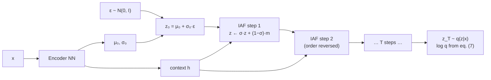

## Abstract

A variational posterior has to be cheap to sample from *and* cheap to evaluate the density of, for its own samples, at every gradient step. That requirement is what pins most VAEs to a diagonal Gaussian $q(z\mid x)=\mathcal{N}(\mu(x),\sigma^2(x))$, and the gap between that and the true posterior is the gap between the ELBO and the marginal likelihood. IAF closes it with a flow whose step is the *inverse* of autoregressive sampling: given a Gaussian autoregressive model, recovering the noise $\epsilon=(y-\mu(y))/\sigma(y)$ from a known $y$ is fully parallel across coordinates, and its Jacobian is lower-triangular with $\sigma_i$ on the diagonal, so $\log\det=-\sum_i\log\sigma_i$. Chain $T$ such steps, each a MADE (or a convolutional autoregressive autoencoder) taking the previous iterate and a context $h$ from the encoder, in an LSTM-style gated form $z_t=\sigma_t\odot z_{t-1}+(1-\sigma_t)\odot m_t$ with the gate biased open at initialisation. On dynamically binarised MNIST a deep IAF posterior reaches $-79.10$ nats, the best published at the time; on CIFAR-10 a ResNet VAE with IAF reaches 3.11 bits/dim, better than every other latent-variable model then published and close to PixelCNN's 3.03, while sampling three orders of magnitude faster.

**Keywords:** inverse autoregressive flow, variational inference, approximate posterior, ELBO tightening, ResNet VAE, bidirectional inference

## 1 Introduction

The object being improved is the gap in

$$
\mathcal{L}(x;\theta)=\log p(x)-D_{\mathrm{KL}}\bigl(q(z\mid x)\,\|\,p(z\mid x)\bigr). \tag{1}
$$

Maximising $\mathcal{L}$ simultaneously pushes $\log p(x)$ up and the KL down, so a more flexible $q$ helps twice: the objective becomes a better proxy for the true one, *and* the inference model becomes a better thing to use after training. The paper states the second motive explicitly — *minimization of $D_{\mathrm{KL}}(q\|p)$ can be a goal in itself, if we're interested in using $q(z\mid x)$ for inference after optimization*.

The constraint is stated just as clearly. To optimise the bound you must, for every datapoint in every minibatch at every iteration, (1) compute and differentiate $q(z\mid x)$ and (2) sample from it — and if $z$ is high-dimensional and you want GPUs to help, both must parallelise across the dimensions of $z$. *This requirement restricts the class of approximate posteriors $q(z\mid x)$ that are practical to use. In practice this often leads to the use of diagonal posteriors.*

So the design problem is: a family that is flexible, and for which sampling *and* own-density-evaluation are both one parallel pass. That is a narrower requirement than density estimation needs, and it is why IAF and [MAF](/blog/maf/) are different papers with the same algebra.

> **My comment.** This own-samples-only requirement is the line that mattered in my factor-selection project. The marginal likelihood there is an integral against the prior density, and the well-conditioned importance route needs that density at points the prior did not generate, so an IAF prior would be cheap where I did not need it and D passes per layer where I did.

[Figure 1](https://arxiv.org/pdf/1606.04934#page=1) makes the case in one picture: a VAE fit to four datapoints, with factorised Gaussian posteriors and with IAF posteriors. The Gaussian clusters are axis-aligned blobs that cannot tile the spherical prior; the IAF clusters bend around each other and fill it.

## 2 Background

### 2.1 Normalizing flows for variational inference

Start from $z_0\sim q(z_0\mid x)$ and apply $z_t=f_t(z_{t-1},x)$, giving

$$
\log q(z_T\mid x)=\log q(z_0\mid x)-\sum_{t=1}^{T}\log\left\lvert\det\frac{dz_t}{dz_{t-1}}\right\rvert. \tag{2}
$$

Rezende & Mohamed introduced this for stochastic variational inference with the *planar* flow

$$
f_t(z_{t-1})=z_{t-1}+u\,h\bigl(w^{\mathsf T}z_{t-1}+b\bigr), \tag{3}
$$

a rank-one perturbation — *an MLP with a bottleneck hidden layer with a single unit*. The paper's objection is structural rather than empirical: *since information goes through the single bottleneck, a long chain of transformations is required to capture high-dimensional dependencies*. One planar step can only warp along one direction, so the number of steps needed scales with $D$, and it is not obvious how to make such a flow respect the topology of, say, a stack of feature maps.

### 2.2 The two observations

Take a Gaussian autoregressive autoencoder (MADE, PixelCNN) mapping $y$ to $[\mu(y),\sigma(y)]$ with $\partial[\mu_i,\sigma_i]/\partial y_j=0$ for $j\ge i$. Sampling is

$$
y_0=\mu_0+\sigma_0\epsilon_0,\qquad y_i=\mu_i(y_{1:i-1})+\sigma_i(y_{1:i-1})\,\epsilon_i,
$$

which costs $D$ sequential steps — *such models are not interesting for direct use* as posteriors. But invert it, which is legal whenever $\sigma_i>0$:

**Observation 1.** The inverse is *parallel*, because each $\epsilon_i$ depends only on quantities computed from the already-known $y$:

$$
\epsilon=\bigl(y-\mu(y)\bigr)/\sigma(y), \tag{4}
$$

elementwise. One forward pass through the masked network gives all of $\mu,\sigma$; one division gives all of $\epsilon$.

**Observation 2.** Its Jacobian is lower triangular with $\partial\epsilon_i/\partial y_i=1/\sigma_i$, hence

$$
\log\det\frac{d\epsilon}{dy}=-\sum_{i=1}^{D}\log\sigma_i(y). \tag{5}
$$

*The combination of model flexibility, parallelizability across dimensions, and simple log-determinant* is the whole argument.

## 3 Method

> **Key idea.** Autoregressive sampling is sequential and autoregressive inversion is parallel. A variational posterior only ever needs to sample and to score *its own* samples — so build the flow out of the parallel direction and never touch the sequential one.

### 3.1 The flow

An encoder produces $\mu_0,\sigma_0$ and an extra output $h$, a *context* fed to every subsequent step. Initialise $z_0=\mu_0+\sigma_0\odot\epsilon$ with $\epsilon\sim\mathcal{N}(0,I)$, then

$$
z_t=\mu_t+\sigma_t\odot z_{t-1}, \tag{6}
$$

where $\mu_t,\sigma_t$ come from an autoregressive network with inputs $z_{t-1}$ and $h$, structured to be autoregressive in $z_{t-1}$. Then $dz_t/dz_{t-1}$ is triangular with $\sigma_t$ on the diagonal, determinant $\prod_i\sigma_{t,i}$ — and, the paper notes parenthetically and importantly, *the Jacobian w.r.t. $h$ does not have constraints*, so the context can enter arbitrarily. The final density is

$$
\log q(z_T\mid x)=-\sum_{i=1}^{D}\left(\tfrac12\epsilon_i^2+\tfrac12\log(2\pi)+\sum_{t=0}^{T}\log\sigma_{t,i}\right). \tag{7}
$$

Every term is available from the same pass that produced the sample. No extra work is done to score it.

### 3.2 The gated form, and why the gate is biased open

Equation (6) with an unconstrained $\sigma_t$ is numerically fragile — a chain of multiplications by free positive numbers. The implementation instead has the network emit two unconstrained vectors and applies an LSTM-style update:

$$
[m_t,s_t]\leftarrow\mathrm{AutoregressiveNN}[t](z_t,h;\theta),\qquad
\sigma_t=\operatorname{sigmoid}(s_t),\qquad
z_t=\sigma_t\odot z_{t-1}+(1-\sigma_t)\odot m_t. \tag{8}
$$

This is a convex combination of "keep the previous iterate" and "replace it with $m_t$", so $\sigma_t\in(0,1)$ by construction and (7) still applies verbatim. The initialisation detail is one of those small things that decides whether a deep flow trains: *we found it beneficial to parameterize or initialize the parameters of each $\mathrm{AutoregressiveNN}[t]$ such that its outputs $s_t$ are, before optimization, sufficiently positive, such as close to $+1$ or $+2$*, which makes $\sigma_t$ near one and each step nearly the identity — the forget-gate bias of Jozefowicz et al. Deep flows want to start as the identity; Glow reaches the same conclusion by zero-initialising the last convolution of each coupling network.

### 3.3 What one step can already do

*Perhaps the simplest special version of IAF is one with a simple step, and a linear autoregressive model. This transforms a Gaussian variable with diagonal covariance, to one with linear dependencies, i.e. a Gaussian distribution with full covariance.* Worth holding onto: a single linear IAF step upgrades a mean-field Gaussian posterior to a full-covariance Gaussian, which is already the most common thing people want and cannot have cheaply. Everything past that is non-Gaussianity.

### 3.4 Ordering

*We found that results improved when reversing the ordering of the variables after each step in the IAF chain. This is a volume-preserving transformation, so the simple form of eq. (7) remains unchanged.* Reversal is a permutation: determinant $\pm1$, log-determinant zero, nothing to account for. Same device as MAF's; the same unanswered question about whether random orders would be better.

### 3.5 Architecture

Non-convolutional models use MADE; the CIFAR-10 experiments, *which benefit more from scaling to high dimensional latent space*, use convolutional autoregressive autoencoders of the PixelCNN family. That substitution is the reason the method is claimed to be *well suited to high-dimensional tensor variables, such as spatio-temporally organized variables* — the flow inherits the inductive bias of whatever autoregressive network it is built from, which planar flows cannot do.

The CIFAR-10 generative model is itself new: a **ResNet VAE** with many layers of stochastic variables and bidirectional inference, where *the posterior of each layer is parameterized by its own IAF* ([Fig. 3](https://arxiv.org/pdf/1606.04934#page=7)). Bottom-up and top-down ResNet blocks meet at each level, with the layer prior $p(z_i\mid z_{>i})$ and the layer posterior $q(z_i\mid z_{>i},x)$ read off the top-down path.

### 3.6 Algorithm

```text
SAMPLE FROM q(z|x) AND SCORE IT          # Algorithm 1 of the paper
  mu, sigma, h = EncoderNN(x)
  eps ~ N(0, I)
  z   = sigma * eps + mu
  l   = -sum( log sigma + 0.5*eps^2 + 0.5*log(2*pi) )
  for t in 1..T:
      m, s  = AutoregressiveNN[t](z, h)   # autoregressive in z; h unconstrained
      sigma = sigmoid(s)                  # init s near +1 or +2 -> near-identity step
      z     = sigma * z + (1 - sigma) * m
      l     = l - sum(log sigma)
      z     = reverse_order(z)            # volume preserving
  return z, l                             # one pass gives both

# note what is NOT here: evaluating q(z|x) at an externally supplied z.
# that needs the sequential direction, D passes.
```



## 4 Prior work

- **Planar and radial flows.** Effective on *relatively low-dimensional latent space (at most a few hundred dimensions)*, with no clear route to scaling or to exploiting latent topology.
- **NICE.** *Updates only half of the latent variables per step.* The paper's assessment: large blocks give a cheap inverse and *the disadvantage of typically requiring longer chains*, and Rezende & Mohamed had found coupling-style transformations *generally less powerful than other types of normalizing flow* in low dimensions. Real NVP is noted as concurrent work extending NICE to high dimensions, with the honest close: **an empirical comparison would be an interesting subject of future research.** It is not done here. [MAF](/blog/maf/) does it a year later, and finds Real NVP a special case of both.
- **Hamiltonian variational inference.** Guided by the exact posterior and invariant to it for small steps, so arbitrarily accurate in principle — but *very demanding computationally* and needing an auxiliary bound that can impede progress if loose.
- **Auxiliary latent variables.** Noted to be often equivalent to multi-layer stochastic models, which is what the ResNet VAE is; the paper combines both.

## 5 Experiments

### 5.1 MNIST

Convolutional VAE with ResNet blocks, a *single* layer of 32 Gaussian stochastic units, each IAF transformation implemented as a 2-layer MADE and stacked to the depths in the table, with ordering reversed between every other transformation. Dynamically binarised MNIST. Averages over five optimisation runs, standard deviations in brackets; the right column is an importance-sampled marginal likelihood estimate with 128 samples.

| Model | VLB | $\log p(x)\approx$ |
|---|---|---|
| Convolutional VAE + HVI | $-83.49$ | $-81.94$ |
| DLGM 2hl + IWAE | | $-82.90$ |
| LVAE | | $-81.74$ |
| DRAW + VGP | $-79.88$ | |
| Diagonal covariance | $-84.08\ (\pm0.10)$ | $-81.08\ (\pm0.08)$ |
| IAF (depth 2, width 320) | $-82.02\ (\pm0.08)$ | $-79.77\ (\pm0.06)$ |
| IAF (depth 2, width 1920) | $-81.17\ (\pm0.08)$ | $-79.30\ (\pm0.08)$ |
| IAF (depth 4, width 1920) | $-80.93\ (\pm0.09)$ | $-79.17\ (\pm0.08)$ |
| **IAF (depth 8, width 1920)** | $\mathbf{-80.80\ (\pm0.07)}$ | $\mathbf{-79.10\ (\pm0.07)}$ |

Three readings, of which the paper makes two.

1. *As the approximate posterior becomes more expressive, generative modelling performance becomes better.* True and monotone across all four IAF rows on both columns.
2. *An expressive approximate posterior also tightens variational lower bounds as expected, making the gap between variational lower bounds and marginal likelihoods smaller.* The gap goes from $3.00$ nats (diagonal) to $1.70$ nats (depth 8). Stated and correct.
3. **Most of the VLB improvement is bound-tightening, not a better generative model** — and this the paper leaves for the reader. The VLB improves by $3.28$ nats from diagonal to depth 8; the marginal likelihood improves by $1.98$. So roughly 40% of the headline gain is the bound catching up to a model that was already there. That is not a criticism of the method — tightening the bound *is* what IAF is for, and the remaining 2 nats of genuine model improvement is the payoff of training against a less biased objective — but reading the VLB column alone overstates it by half.

> **My comment.** This split, how much of a gain is the model and how much is the measuring instrument, is the one I now look for first. In the factor-selection project the BO-tuned flow prior mainly lowered the measured model uncertainty without improving the out-of-sample decision, which is a similar warning that a better number can be about the instrument.

The claim of *best published log-likelihood on dynamically binarized MNIST: $-79.10$* stands against this table. On Hugo Larochelle's *statically* binarised MNIST the same model gets $-79.88$, *slightly worse than the best reported result, $-79.2$, using the PixelCNN* — reported rather than omitted.

Diminishing returns are visible: width $320\to1920$ at depth 2 buys $0.47$ nats of $\log p$; depth $2\to8$ at width 1920 buys only $0.20$ nats ($0.37$ of VLB) across two doublings.

### 5.2 CIFAR-10

| Method | bits/dim $\le$ |
|---|---|
| *Tractable likelihood models* | |
| Uniform distribution | 8.00 |
| Multivariate Gaussian | 4.70 |
| [NICE](/blog/nice/) | 4.48 |
| Deep GMMs | 4.00 |
| [Real NVP](/blog/realnvp/) | 3.49 |
| Gated PixelCNN | 3.03 |
| PixelRNN | **3.00** |
| *Variationally trained latent-variable models* | |
| Deep Diffusion | 5.40 |
| Convolutional DRAW | 3.58 |
| **ResNet VAE with IAF (ours)** | **3.11** |

Three things to keep straight about this column, two of which the caption says.

- **The numbers are not the same kind of number.** NICE, Real NVP, PixelRNN and Gated PixelCNN are exact likelihoods. Convolutional DRAW is *an upper bound* (a negative ELBO in bits/dim). The ResNet VAE figure *was estimated using importance sampling*, which is a stochastic estimate whose bias direction depends on the number of samples and which is not reported here. A single column headed "bits/dim $\le$" holding all three is convenient and slightly misleading.
- **The comparison isolates nothing.** The CIFAR-10 result comes from a new architecture (ResNet VAE, many stochastic layers, bidirectional inference) *and* IAF posteriors. The MNIST table has the diagonal-covariance ablation; the CIFAR-10 table does not, so how much of $3.58\to3.11$ is IAF and how much is the ResNet VAE cannot be read off the main text.
- **Synthesis speed is the real headline.** About $0.05$ s/image for the ResNet VAE against $52.0$ s/image for PixelCNN on a Titan X — a factor of roughly 1000 for 0.08–0.11 bits/dim. The paper immediately qualifies it: they sampled from PixelCNN *naïvely by sequentially generating a pixel at a time, using the full generative model at each iteration*, and note that caching would speed it up substantially, though *the speedup will be limited on parallel hardware*. Flagging your own baseline as unoptimised is the right thing to do and it is rare.

## 6 Limitations

**Stated by the authors.** That the Real NVP comparison is left to future work. That the PixelCNN sampling baseline is naive. That results might improve with more flow steps, *which we leave to future work*.

**My reading.**

- **IAF cannot evaluate the density of an externally supplied point in one pass.** This is not a bug — the design requirement was own-samples only — but it is the sharp boundary of the method's use, and it is the entire reason MAF exists. If what you want is $p(x)$ at a datapoint you were handed, IAF costs $D$ sequential passes per layer and is the wrong tool.
- **No ablation on CIFAR-10**, so the flagship number confounds two contributions.
- **The MNIST experiment uses a 32-dimensional latent** with a single stochastic layer. That is a small space in which to demonstrate a method whose selling point is scaling to high-dimensional latents; the high-dimensional demonstration is the unablated one.
- **Depth and width are explored only on MNIST**, only on a grid of four points, and only upward — there is no point at which more depth stops helping, so the curve's shape past 8 is unknown.
- **The importance-sampling estimator's sample count is given for MNIST (128) and not for CIFAR-10.**
- **Nothing measures what the flow actually learned.** There is no analysis of the resulting posterior's shape, no decomposition of the KL, no check on whether the gain comes from correlation (which one linear step would give) or from genuine non-Gaussianity. Given that §3.3 identifies full-covariance Gaussian as the one-linear-step special case, the obvious control — a full-covariance Gaussian posterior — is absent from Table 1.
- **The context $h$ is unexamined.** It is an extra encoder output fed to every step, with an unconstrained Jacobian, and it may be doing a large share of the work. No ablation.

## 7 Extensions

**What was built on this.** [MAF](/blog/maf/) is the direct sequel and the direct inversion: same MADE layers, conditioning moved from $u_{1:i-1}$ to $x_{1:i-1}$, and a proof that maximum-likelihood MAF training *is* variational training of an implicit IAF. The MAF/IAF duality is what makes probability density distillation work — train the tractable-density model, distil into the tractable-sampling model — which is the Parallel WaveNet recipe that turned WaveNet into a product. The gated near-identity initialisation reappears in Glow as zero-initialised coupling networks. The ResNet VAE with bidirectional inference and per-layer flows is an ancestor of the hierarchical VAEs (NVAE, very deep VAEs) that eventually closed much of the gap to autoregressive likelihoods. The [survey](/blog/normalizing-flows-survey/) places IAF and MAF as the two directions of a single autoregressive flow.

**Open problems.** How deep is deep enough, and what does the flow buy past full covariance? Does a per-layer flow in a hierarchical model beat one big flow on a flat latent at matched parameters? And the comparison the paper explicitly defers: coupling layers versus inverse autoregressive layers as posteriors, which MAF answers for density estimation and nobody answers cleanly for variational inference.

**Research directions.** *These are ideas, not results — none has been run.*

1. **Separate correlation from non-Gaussianity.** Hypothesis: on MNIST at latent dimension 32, a full-covariance Gaussian posterior recovers most of the diagonal-to-IAF gap, and the residual — the part that needs genuine non-Gaussianity — grows with latent dimension. Data: binarised MNIST at latent dimensions 8, 32, 128. Baselines: diagonal Gaussian, one *linear* IAF step (= full covariance, per §3.3), and IAF at depths 2, 4, 8. Metric: VLB and importance-sampled $\log p$ at matched parameter count, decomposed into the two gaps. Likely failure mode: a full-covariance Gaussian at dimension 128 has 8,256 posterior parameters per datapoint to amortise, so the "baseline" is itself hard to fit and loses for optimisation reasons rather than expressiveness ones.
2. **An IAF posterior over latent volatility states.** Hypothesis: in a variational state-space model of daily returns with a latent log-volatility path, an IAF posterior over the whole path captures the temporal correlation that a mean-field-over-time posterior cannot, and the improvement shows up specifically as better-calibrated one-step-ahead predictive intervals rather than as a better ELBO. Data: simulated paths from a stochastic-volatility model with known states, then a daily index series. Baselines: mean-field Gaussian over time, structured Gaussian with a tridiagonal precision, and a [particle filter](/blog/bootstrap-filter/) as the (expensive) reference posterior. Metric: KL to the particle-filter posterior on simulated data where it is available; interval coverage out of sample. Likely failure mode: the ELBO improves and the calibration does not, because the variational posterior is mode-seeking in exactly the direction that shrinks intervals — which would be the useful negative finding.
3. **Ablate the context $h$.** Hypothesis: a nontrivial share of IAF's gain on MNIST comes from $h$ giving every flow step direct access to encoder features, not from the autoregressive structure, and removing $h$ costs more than halving the depth. Data: binarised MNIST, the paper's configuration. Baselines: IAF with $h$, IAF without $h$, IAF with $h$ but a non-autoregressive (diagonal) step. Metric: VLB and $\log p$, five seeds. Likely failure mode: without $h$ the flow still sees $z_{t-1}$, which already encodes $x$, so the ablation is not clean and measures redundancy rather than contribution.

## 8 Takeaways

- The asymmetry is the whole idea: sampling from a Gaussian autoregressive model is $D$ sequential steps, but recovering the noise from a known sample is one parallel pass with a triangular Jacobian. A variational posterior only needs the second direction.
- One linear IAF step turns a mean-field Gaussian into a full-covariance Gaussian. Everything beyond that is buying non-Gaussianity, and the paper never separates the two.
- The gated update $z_t=\sigma_t\odot z_{t-1}+(1-\sigma_t)\odot m_t$ with the gate biased open makes each step start as the identity. Deep flows need this; different papers find it independently.
- A flexible posterior improves the ELBO more than it improves the model. On MNIST, about 60% of the 3.28-nat VLB gain is a genuinely better generative model and about 40% is the bound closing.
- The CIFAR-10 result is a package — ResNet VAE plus IAF — and the paper does not take it apart. Its most defensible contribution there is the speed: comparable likelihood to PixelCNN at roughly a thousandth of the sampling cost, with the baseline honestly flagged as unoptimised.
- IAF and MAF are the same construction read in opposite directions, and which one you want is decided entirely by whether you need the density of your own samples or the density of someone else's data. For model comparison and likelihood evaluation, that means MAF; for amortised inference inside a larger model, IAF.

## References

1. Kingma, D. P., Salimans, T., Jozefowicz, R., Chen, X., Sutskever, I., Welling, M. *Improved Variational Inference with Inverse Autoregressive Flow.* arXiv:1606.04934 (NeurIPS 2016).
2. Rezende, D. J., Mohamed, S. *Variational Inference with Normalizing Flows.* ICML 2015.
3. Germain, M., Gregor, K., Murray, I., Larochelle, H. *MADE: Masked Autoencoder for Distribution Estimation.* ICML 2015.
4. Papamakarios, G., Pavlakou, T., Murray, I. *Masked Autoregressive Flow for Density Estimation.* NeurIPS 2017.
5. Burda, Y., Grosse, R., Salakhutdinov, R. *Importance Weighted Autoencoders.* ICLR 2016.
6. Salimans, T., Kingma, D. P., Welling, M. *Markov Chain Monte Carlo and Variational Inference: Bridging the Gap.* ICML 2015.
7. van den Oord, A., Kalchbrenner, N., Kavukcuoglu, K. *Pixel Recurrent Neural Networks.* ICML 2016.
8. van den Oord, A. et al. *Conditional Image Generation with PixelCNN Decoders.* NeurIPS 2016.
