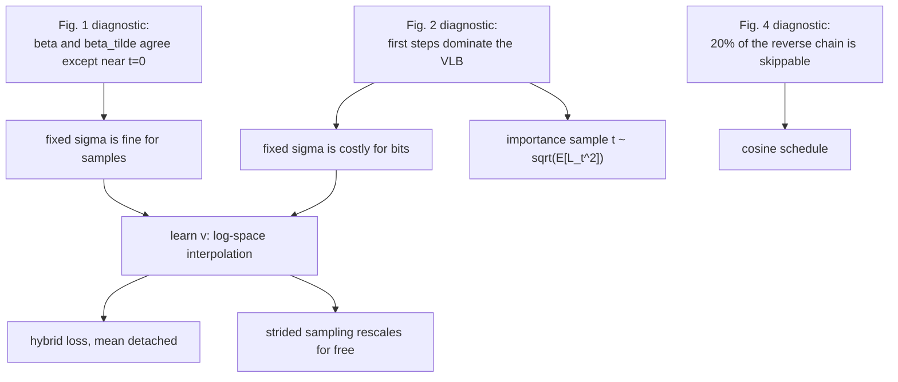

## Abstract

[DDPM](/blog/ddpm/) produced strong samples and weak log-likelihoods, leaving open whether diffusion models actually cover the data distribution or merely render it plausibly. This paper closes most of that gap with three changes that touch training only. The reverse variance is learned as a log-space interpolation between the two analytic extremes $\beta_t$ and $\tilde\beta_t$; the linear noise schedule is replaced by a cosine schedule that destroys information more gradually at $64\times64$ and below; and the variational bound enters training either as a small mean-detached auxiliary term or, when likelihood is the goal, directly with importance-sampled timesteps that tame its gradient noise. The learned variance also rescales automatically onto any subsequence of timesteps, so a model trained with $T=4000$ samples well in about 100 steps with no fine-tuning. The authors additionally measure mode coverage against a GAN with precision and recall, and fit FID and NLL against training compute.

**Keywords:** diffusion models, variational lower bound, learned reverse variance, cosine noise schedule, importance sampling, strided sampling, scaling

## 1 Introduction

[DDPM](/blog/ddpm/) showed that a diffusion model trained with a reweighted denoising loss rivals GANs on FID. The price of the reweighting was likelihood: 3.70 bits/dim on CIFAR-10 and 3.77 on ImageNet $64\times64$, well behind autoregressive models and VAEs. Likelihood matters here less as a leaderboard position than as a diagnostic — optimising it forces a model to put mass on every mode, so a bad score raises the suspicion that the sampler is quietly dropping parts of the distribution, a suspicion FID cannot settle because FID rewards a model that renders a subset of the data beautifully.

Two further gaps were open. DDPM had been demonstrated on CIFAR-10 and LSUN, not on a high-diversity dataset such as ImageNet. And sampling needed hundreds to thousands of sequential network evaluations; concurrent work on audio had shown few-step sampling, but with a strong conditioning signal that images do not have.

The paper's framing is deliberately incremental: <mark>keep the DDPM recipe, locate the specific parts of it responsible for the bad likelihood, and repair only those</mark>. That is what makes it worth reading closely — each change is preceded by a diagnostic plot saying why the old choice was wrong, and the diagnostics transfer to domains where the specific fixes do not.

## 2 Background

The forward process, the closed-form marginal $x_t=\sqrt{\bar\alpha_t}\,x_0+\sqrt{1-\bar\alpha_t}\,\epsilon$ with $\alpha_t=1-\beta_t$ and $\bar\alpha_t=\prod_{s\le t}\alpha_s$, the Gaussian posterior $q(x_{t-1}\mid x_t,x_0)$, the noise-prediction parameterisation and the derivation of $L_\text{simple}$ are all covered in the [DDPM](/blog/ddpm/) note; the score-matching view is in [NCSN](/blog/ncsn/) and [Score-SDE](/blog/score-sde/). Three facts from there are load-bearing here.

First, the variational bound decomposes into independently computable terms,

$$
L_\text{vlb}=L_0+L_1+\dots+L_{T-1}+L_T,\qquad
L_{t-1}=D_\text{KL}\big(q(x_{t-1}\mid x_t,x_0)\,\big\|\,p_\theta(x_{t-1}\mid x_t)\big),
\tag{1}
$$

with $L_T$ parameter-free and $L_0$ evaluated as the probability that the final Gaussian lands in the correct one of 256 bins per colour channel.

Second, the posterior variance is

$$
\tilde\beta_t=\frac{1-\bar\alpha_{t-1}}{1-\bar\alpha_t}\,\beta_t ,
\tag{2}
$$

and DDPM fixed $\Sigma_\theta=\sigma_t^2 I$ to either $\beta_t$ or $\tilde\beta_t$ — the values the correct reverse variance would take if $q(x_0)$ were isotropic Gaussian noise or a delta function, so they bracket the truth for any data in between.

Third, $L_\text{simple}=\mathbb E_{t,x_0,\epsilon}\|\epsilon-\epsilon_\theta(x_t,t)\|^2$ supplies no gradient at all for $\Sigma_\theta$. Anything the variance learns must come from somewhere else.

## 3 Method

> **Key idea.** Sample quality is governed by the reverse *mean*; log-likelihood is governed by the reverse *variance* and by the handful of least-noisy steps, which is exactly what $L_\text{simple}$ throws away. Learn the variance inside its known bounds, reshape the schedule so steps are not wasted on pure noise, and give the variational bound a small, well-conditioned role in training.

### 3.1 Intuition: why the variance choice is invisible to samples but not to likelihood

Start from Eq. (2) and rewrite the ratio of the two bounds:

$$
\frac{\tilde\beta_t}{\beta_t}=\frac{1-\bar\alpha_{t-1}}{1-\bar\alpha_t}
=1-\frac{\bar\alpha_{t-1}\beta_t}{1-\bar\alpha_t}.
\tag{3}
$$

The correction's numerator is one step's worth of destroyed signal, its denominator all the noise accumulated so far. For roughly constant $\beta$ and small $t$, $1-\bar\alpha_t\approx t\beta$ and $\bar\alpha_{t-1}\approx 1$, so the ratio is about $1-1/t$: exactly $0$ at $t=1$, one half at $t=2$, $0.9$ at $t=10$, $0.99$ at $t=100$; for large $t$, $\bar\alpha_{t-1}\to 0$ and it goes to one. <mark>The two bounds disagree only over the first few dozen steps, and since [Fig. 1](https://arxiv.org/pdf/2102.09672#page=3) is drawn against $t/T$, that window shrinks as $T$ grows</mark>. In the limit of infinitely many steps the mean dominates and $\sigma_t$ stops mattering for samples.

Likelihood is a different matter, because the bound weights those same early steps most heavily. [Fig. 2](https://arxiv.org/pdf/2102.09672#page=3) plots $L_t$ against $t$ on a log scale and it falls by seven orders of magnitude across the chain. A short calculation of my own shows the two facts are one. If the true reverse variance is $\sigma^2_\star$ and the model uses $\sigma^2$, the Gaussian KL costs $\tfrac12(r-1-\log r)$ nats per dimension with $r=\sigma^2_\star/\sigma^2$. Taking $r$ from Eq. (3): at $t=2$, $r=\tfrac12$ gives $0.097$ nats $\approx 0.14$ bits; at $t=10$, $0.0039$ bits; at $t=100$, about $4\times10^{-5}$ bits; and at $t=1$, where $\tilde\beta_1=0$ exactly, the penalty diverges. <mark>The mis-specification cost falls roughly two orders of magnitude per decade in $t$, so essentially all of the avoidable likelihood loss sits in the first few steps</mark>. Fixing $\sigma_t$ is free for samples and expensive for bits.

### 3.2 Learned variance and the hybrid objective

Because the admissible interval is narrow and shrinks with $T$, predicting $\Sigma_\theta$ directly is badly conditioned. The network instead emits an extra vector $v$, one component per dimension, and the variance is an interpolation in log space:

$$
\Sigma_\theta(x_t,t)=\exp\!\big(v\log\beta_t+(1-v)\log\tilde\beta_t\big).
\tag{4}
$$

$v=1$ recovers $\beta_t$, $v=0$ recovers $\tilde\beta_t$, intermediate values are geometric means. The parameterisation is *relative*: the network never outputs an absolute scale, only where to sit between two numbers the schedule already provides. No constraint is placed on $v$, and the authors report it never left $[0,1]$ in practice, which they read as evidence that the bracket is expressive enough.

Training then uses

$$
L_\text{hybrid}=L_\text{simple}+\lambda\,L_\text{vlb},\qquad \lambda=0.001,
\tag{5}
$$

with a stop-gradient on $\mu_\theta$ inside the $L_\text{vlb}$ term. Both parts matter: $\lambda$ keeps the bound from overwhelming the simple loss in magnitude, while the stop-gradient makes the division of labour structural rather than numerical, so $L_\text{vlb}$ can only shape $\Sigma_\theta$ and $L_\text{simple}$ keeps sole control of the mean. Neither choice is ablated.

### 3.3 Cosine noise schedule

The second diagnostic concerns wasted steps. Under DDPM's linear $\beta_t$ at $64\times64$ and $32\times32$ the tail of the forward process is already almost pure noise, so the matching reverse steps have little to do: a linear-schedule model loses very little FID when a prefix of up to 20% of the reverse process is skipped ([Fig. 4](https://arxiv.org/pdf/2102.09672#page=4)). The replacement is specified through $\bar\alpha_t$ rather than $\beta_t$:

$$
\bar\alpha_t=\frac{f(t)}{f(0)},\qquad
f(t)=\cos^2\!\Big(\frac{t/T+s}{1+s}\cdot\frac{\pi}{2}\Big),
\qquad \beta_t=1-\frac{\bar\alpha_t}{\bar\alpha_{t-1}}\ \ \text{clipped at }0.999 .
\tag{6}
$$

$\bar\alpha_t$ falls almost linearly through the middle of the chain and flattens at both ends, so noise is added slowly where the signal is still informative and the process does not end in a long stretch of nothing. The clip prevents a singularity as $\bar\alpha_t\to 0$ near $t=T$.

The offset $s$ exists only to keep $\beta$ from being too small at the start, since tiny noise makes $\epsilon$ hard to predict accurately; the authors picked it so the first noise standard deviation sits just under the pixel bin width $1/127.5\approx 0.0078$, giving $s=0.008$. That calibration is worth checking, because it pins the constant to 8-bit pixels *and* to a particular $T$. Expanding Eq. (6) for small arguments gives $\beta_1\approx u_1^2-u_0^2$ with $u_t=\tfrac{\pi}{2}(t/T+s)/(1+s)$; at $T=1000$ that is $\sqrt{\beta_1}\approx0.0064$, just below the bin width as advertised, while at the $T=4000$ used for most experiments the same $s$ gives $\approx0.0031$, well below it (my arithmetic; the paper states only the design rule). The authors are candid that $\cos^2$ itself was arbitrary.

### 3.4 Reducing the gradient noise in $L_\text{vlb}$

Optimising $L_\text{vlb}$ directly ought to give the best likelihood, yet on ImageNet $64\times64$ it trained *worse* than $L_\text{hybrid}$. Measuring the gradient noise scale confirmed the cause: <mark>the raw variational bound has a gradient noise scale orders of magnitude larger than the hybrid loss</mark> ([Fig. 7](https://arxiv.org/pdf/2102.09672#page=5)). Given Fig. 2, the reason is not mysterious — sampling $t$ uniformly spends most minibatch entries on terms that contribute nothing, while the rare small-$t$ draws dominate.

The fix is importance sampling:

$$
L_\text{vlb}=\mathbb E_{t\sim p_t}\!\Big[\frac{L_t}{p_t}\Big],\qquad
p_t\propto\sqrt{\mathbb E[L_t^2]},\qquad \textstyle\sum_t p_t=1 .
\tag{7}
$$

The estimator is unbiased for any $p_t$ with full support; the stated choice is the variance-minimising one. The second moment of the single-draw estimator is $\sum_t \mathbb E[L_t^2]/p_t$, and minimising it subject to $\sum_t p_t=1$ (Lagrange, or Cauchy–Schwarz) gives $p_t\propto\sqrt{\mathbb E[L_t^2]}$ with optimum $\big(\sum_t\sqrt{\mathbb E[L_t^2]}\big)^2$. The paper states the rule without this step; it is why the square root appears rather than $\mathbb E[L_t^2]$ itself.

$\mathbb E[L_t^2]$ is unknown and drifts, so it is estimated from a running history of the last 10 values of each term, with uniform sampling until every $t$ has 10 samples — 40,000 warm-up evaluations at $T=4000$. With this, direct $L_\text{vlb}$ training becomes the best option for likelihood. It did not help $L_\text{hybrid}$, whose gradient is already well-conditioned.

### 3.5 Strided sampling comes free with the learned variance

For any increasing subsequence $S=(S_1,\dots,S_K)$ of training timesteps, the marginals $\bar\alpha_{S_t}$ are already defined, and the induced schedule is

$$
\beta_{S_t}=1-\frac{\bar\alpha_{S_t}}{\bar\alpha_{S_{t-1}}},\qquad
\tilde\beta_{S_t}=\frac{1-\bar\alpha_{S_{t-1}}}{1-\bar\alpha_{S_t}}\,\beta_{S_t}.
\tag{8}
$$

A model with a *fixed* variance has no way to know it is now taking bigger steps: $\beta_t$ from the training grid is the wrong number on the coarse grid. But Eq. (4) stores a position between two bounds and Eq. (8) recomputes the bounds. <mark>The learned variance therefore rescales itself onto the shorter chain with no fine-tuning</mark> — one parameterisation choice, introduced to fix likelihood, delivering an order-of-magnitude speed-up. $K$ steps are $K$ evenly spaced reals in $[1,T]$, rounded.

### 3.6 Algorithm

```text
# precompute on the training grid: beta[t], alpha[t]=1-beta[t], abar[t], beta_tilde[t] (Eq. 2)
# net(x, t) -> (eps_hat, v), i.e. 2x the usual output channels

TRAIN  (hybrid; lambda = 0.001)
  loop:
    x0  <- minibatch, scaled to [-1, 1]
    t   <- Uniform{1..T}                     # for L_vlb training: t ~ p_t, see below
    eps <- N(0, I)
    xt  <- sqrt(abar[t]) * x0 + sqrt(1 - abar[t]) * eps
    eps_hat, v <- net(xt, t)
    L_simple <- mean( (eps - eps_hat)^2 )
    Sigma <- exp( v * log(beta[t]) + (1 - v) * log(beta_tilde[t]) )
    mu    <- ( xt - beta[t] / sqrt(1 - abar[t]) * stopgrad(eps_hat) ) / sqrt(alpha[t])
    L_vlb <- KL( q(x_{t-1} | xt, x0) || N(mu, Sigma) )      # t = 1: discretized decoder NLL
    loss  <- L_simple + 0.001 * L_vlb        # for L_vlb training: loss <- L_vlb / p_t
    Adam step; update EMA weights

IMPORTANCE SAMPLER (only when training L_vlb directly)
  keep hist[t] = last 10 observed values of L_t
  if any t has < 10 entries: t ~ Uniform
  else: p[t] <- sqrt(mean(hist[t]^2)); p <- p / sum(p); t ~ p

SAMPLE with K steps (use EMA weights)
  S <- round(K evenly spaced reals in [1, T])              # increasing
  recompute beta_S, beta_tilde_S from abar[S] via Eq. (8)
  x <- N(0, I)
  for k = K down to 1:
    eps_hat, v <- net(x, S[k])
    Sigma <- exp( v * log(beta_S[k]) + (1 - v) * log(beta_tilde_S[k]) )
    mu    <- ( x - beta_S[k] / sqrt(1 - abar[S[k]]) * eps_hat ) / sqrt(1 - beta_S[k])
    x     <- mu + sqrt(Sigma) * N(0, I)      # no noise on the final step
  return x
```



## 4 Implementation notes

From Section 3 and Appendix A of the paper.

| Item | ImageNet $64\times64$ | CIFAR-10 |
|---|---|---|
| Backbone | U-Net as in DDPM, modified | same family, smaller |
| Downsampling stages | 4, three residual blocks each | three residual blocks per stage |
| Channel widths | $[C,2C,3C,4C]$, $C=128$ | $[C,2C,2C,2C]$, $C=128$ |
| Attention | multi-head, 4 heads, at $16\times16$ **and** $8\times8$ | same |
| $t$ conditioning | $\text{GroupNorm}(h)(w+1)+b$ instead of DDPM's $\text{GroupNorm}(h+v)$ | same |
| Class conditioning | class embedding added to the timestep embedding | — |
| Parameters / forward FLOPs | 120M / ≈39 GFLOPs at $C=128$ | not stated |
| $T$ | 4000 (1000 in the first ablation row) | 4000 |
| Linear baseline schedule | $\beta_1=10^{-4}/4\to\beta_{4000}=0.02/4$ (rescaled to preserve $\bar\alpha_t$ at $T=4000$) | same |
| Cosine schedule | Eq. (6), $s=0.008$, $\beta$ clipped at 0.999 | same |
| Optimiser | Adam, lr $10^{-4}$, batch 128 | same |
| Dropout | not stated for the ablations; 0.1 and 0.3 tried for the class-conditional runs (App. G) | 0.1 linear, 0.3 cosine (swept over 0.1/0.2/0.3) |
| EMA | 0.9999 (0.99995 equally good in App. G's sweep) | 0.9999 |
| Large class-conditional runs | batch 2048 | — |
| Scaling runs | $C\in\{64,96,128,192\}$ → 30M/68M/120M/270M params, lr scaled by $1/\sqrt{C/128}$ | — |
| Compute / wall-clock | not stated beyond "several minutes per sample" at 4000 steps | not stated |

Details that are easy to get wrong:

- **The linear baseline must be rescaled.** Reusing DDPM's $10^{-4}\to0.02$ at $T=4000$ changes $\bar\alpha_t$ entirely; both endpoints are divided by 4 so the comparison is about the schedule's *shape*, not its total noise.
- **The FID protocol differs by experiment.** 50K samples everywhere except unconditional ImageNet $64\times64$, which uses 10K and is biased upward by roughly 2 points, so Table 1 and Table 4 are not on the same scale. Reference statistics use the full training set (50K images for LSUN).
- **Strided *likelihood* evaluation is not strided sampling.** Uniform striding is harmless for FID but badly damages NLL, so Appendix E additionally evaluates every $t$ from 1 to $T/K$.
- **DDIM needs a different stride.** Their uniform striding hurt DDIM, so the DDIM curves use the constant stride from [DDIM](/blog/ddim/) (final timestep $T-T/K+1$); a quadratic stride hurt when combined with the cosine schedule.
- **$\tilde\beta_1=0$.** Eq. (2) makes the lower bound exactly zero at $t=1$, so $\log\tilde\beta_1=-\infty$ in Eq. (4). How this is clamped is not stated.
- **Early stopping is part of the recipe, and dropout is a confound.** CIFAR-10 and class-conditional ImageNet $64\times64$ both overfit, FID rising with further training; Appendix G's advice is to early-stop and spend spare compute on model size. Cosine models peak sooner and degrade faster at equal dropout, hence 0.3 for the cosine CIFAR-10 runs against 0.1 for linear.

## 5 Experiments

Setup: fixed architecture and hyperparameters, ablating one factor at a time on ImageNet $64\times64$ (200K iterations, plus two 1.5M-iteration runs) and CIFAR-10 (500K iterations). NLL in bits/dim.

**Table 1 — ImageNet $64\times64$.**

| Iters | $T$ | Schedule | Objective | NLL ↓ | FID ↓ |
|---|---|---|---|---|---|
| 200K | 1K | linear | $L_\text{simple}$ | 3.99 | 32.5 |
| 200K | 4K | linear | $L_\text{simple}$ | 3.77 | 31.3 |
| 200K | 4K | linear | $L_\text{hybrid}$ | 3.66 | 32.2 |
| 200K | 4K | cosine | $L_\text{simple}$ | 3.68 | 27.0 |
| 200K | 4K | cosine | $L_\text{hybrid}$ | 3.62 | 28.0 |
| 200K | 4K | cosine | $L_\text{vlb}$ | 3.57 | 56.7 |
| 1.5M | 4K | cosine | $L_\text{hybrid}$ | 3.57 | **19.2** |
| **1.5M** | **4K** | **cosine** | **$L_\text{vlb}$** | **3.53** | 40.1 |

**Table 2 — CIFAR-10, 500K iterations.**

| $T$ | Schedule | Objective | NLL ↓ | FID ↓ |
|---|---|---|---|---|
| 1K | linear | $L_\text{simple}$ | 3.73 | 3.29 |
| 4K | linear | $L_\text{simple}$ | 3.37 | **2.90** |
| 4K | linear | $L_\text{hybrid}$ | 3.26 | 3.07 |
| 4K | cosine | $L_\text{simple}$ | 3.26 | 3.05 |
| 4K | cosine | $L_\text{hybrid}$ | 3.17 | 3.19 |
| **4K** | **cosine** | **$L_\text{vlb}$** | **2.94** | 11.47 |

**Claim-by-claim reading.**

- *Learned variances improve likelihood.* The paired rows at fixed schedule: $3.77\to3.66$ on ImageNet and $3.37\to3.26$ on CIFAR-10 when $L_\text{simple}$ becomes $L_\text{hybrid}$, FID essentially unchanged (32.2 vs 31.3; 3.07 vs 2.90). Single runs, no seed variance.
- *The cosine schedule helps.* The strongest single factor for FID on ImageNet ($31.3\to27.0$) and a solid NLL gain on both datasets. But the largest NLL jump in either table comes from raising $T$ from 1K to 4K ($3.99\to3.77$, $3.73\to3.37$), which is not a named contribution — and the schedule is explicitly *not* an improvement at $256\times256$, where Appendix C reverts to linear.
- *Importance sampling makes direct $L_\text{vlb}$ viable.* Supported by the learning curves and noise-scale plot ([Figs. 6 and 7](https://arxiv.org/pdf/2102.09672#page=5)) and by the 3.53 best NLL. The tables never separate $L_\text{vlb}$ with importance sampling from without, so those rows measure the combination.
- *The likelihood–FID tension is managed, not resolved.* <mark>Optimising the bound directly buys bits at a severe cost in FID (56.7 against 28.0 on ImageNet; 11.47 against 3.19 on CIFAR-10), while the hybrid loss captures most of the likelihood gain and keeps FID near baseline</mark>. Appendix D says why: $\theta_\text{vlb}$ is better at the two ends of the chain and worse through the middle, i.e. it spends capacity on imperceptible detail. An ensemble using $\theta_\text{vlb}$ for $t\in[0,100)\cup[T-100,T)$ reaches FID 19.9 and NLL 3.52, better than either model on NLL. The paper does not pursue it.
- *Competitive with other likelihood-based models (Table 3).* 3.53 on ImageNet $64\times64$ against 3.77 for DDPM, 2.94 on CIFAR-10 against 3.70. The paper's own claim is narrow and accurate: competitive with the best *convolutional* models on ImageNet $64\times64$ (SPN, Very Deep VAE and PixelSNAIL all at 3.52), behind fully transformer-based ones (Sparse Transformer 3.44, Routing Transformer 3.43). On CIFAR-10 the 2.94 sits behind NVAE 2.91, Very Deep VAE 2.87, PixelSNAIL 2.85 and Sparse Transformer 2.80, so the framing should not be generalised across datasets.
- *Sampling in ~100 steps.* [Fig. 8](https://arxiv.org/pdf/2102.09672#page=6): fixed-variance $L_\text{simple}$ models degrade sharply as steps are cut, while the learned-variance $L_\text{hybrid}$ model holds near-optimal FID down to about 100 steps when fully trained. A mild internal tension — abstract and introduction say "as few as 50", Section 4 says 100. Against [DDIM](/blog/ddim/): DDIM wins below 50 steps and loses at 50 and above, an ordering that also holds on LSUN bedroom $256\times256$, so Appendix B does cover the high-resolution case.
- *Better mode coverage than a GAN (Table 4, class-conditional ImageNet $64\times64$, 250 steps, 50K samples).*

| Model | FID ↓ | Precision ↑ | Recall ↑ |
|---|---|---|---|
| BigGAN-deep (100M, 125K iters, no truncation) | 4.06 | **0.86** | 0.59 |
| Improved Diffusion, small (100M, 1.7M iters) | 6.92 | 0.77 | **0.72** |
| **Improved Diffusion, large (270M, 250K iters)** | **2.92** | 0.82 | 0.71 |

  The large model wins on FID and recall simultaneously, the cleanest version of the paper's coverage argument. The caveat: the GAN is a single run trained by the authors at a matched parameter count but a very different iteration count, sampled without truncation to maximise its recall.

- *Smooth scaling with compute.* Four widths trained with $L_\text{hybrid}$; FID against theoretical FLOPs is close to linear on log-log axes, fitted as $\text{FID}\approx4.00+(2.5\times10^{-25}C)^{-0.22}$, while NLL fits $3.40+(3.0\times10^{-15}C)^{-0.17}$ much less cleanly ([Fig. 10](https://arxiv.org/pdf/2102.09672#page=8)). Both additive constants were chosen by hand — the FID one from in-distribution data, the NLL one by rounding down the prior state of the art — so the fits describe a trend, not an extrapolable law. The authors label the section preliminary.

## 6 Limitations

**Stated by the authors**

- $\cos^2$ was an arbitrary choice of a function with the desired shape; other shapes are expected to work.
- The cosine schedule is a fix for $64\times64$ and $32\times32$ only — the linear schedule worked well at high resolution, and Appendix C uses linear for ImageNet $256\times256$.
- Importance sampling did not help the hybrid objective.
- The scaling results are preliminary, and NLL does not fit a power law cleanly, possibly because of a high irreducible loss or overfitting; those models were trained with $L_\text{hybrid}$ and so never attained their best possible likelihood.
- Overfitting is real on CIFAR-10 *and* on class-conditional ImageNet $64\times64$; the recommendation is to early-stop and grow the model rather than train longer.

**My reading**

- Every number is a single run, yet the tables are read as if 0.05 bits/dim and 1 FID point were meaningful. No seeds, no error bars.
- The best-NLL and best-FID models are *different models*; Appendix D's ensemble comes closest and is left as a remark.
- $\lambda=0.001$ and the stop-gradient are the load-bearing choices in Eq. (5) and neither is swept. Whether the learned variance needs the stop-gradient, or only the small $\lambda$, is unknown.
- The dropout confound in Table 2 is not neutral: cosine rows use 0.3, linear rows 0.1, so part of the cosine schedule's measured CIFAR-10 advantage is a regularisation difference that Appendix F discusses but the table does not flag.
- The gradient-noise explanation stops at "the terms have different magnitudes", yet the gap in Fig. 7 spans several orders of magnitude; no second mechanism is investigated.
- The speed claim is counted in network evaluations. $K=100$ is still 100 sequential forward passes, and honest NLL evaluation adds $T/K$ more.

## 7 Extensions

**What was built on this**

- [ADM / classifier guidance](/blog/diffusion-beats-gans/) adopts Eq. (4) and the hybrid loss wholesale and adds an architecture search and a conditioning mechanism; this is where both changes became the default recipe, and [classifier-free guidance](/blog/classifier-free-guidance/), [LDM](/blog/latent-diffusion/) and [DiT](/blog/dit/) all build on that line.
- [DDIM](/blog/ddim/) is the concurrent alternative to §3.5 — a deterministic non-Markovian sampler rather than a variance that rescales itself — and Fig. 8 shows the two are complementary across the step-count range; [consistency models](/blog/consistency-models/) later attack the step count directly.
- [Score-SDE](/blog/score-sde/) subsumes the schedule into a continuous-time SDE, turning "which schedule" into a question about the diffusion coefficient; [EDM](/blog/edm/) is the systematic successor, tuning schedule, loss weighting, timestep distribution and preconditioning jointly rather than one diagnostic at a time.
- On the time-series side, [TimeGrad](/blog/timegrad/), [CSDI](/blog/csdi/), [TSDiff](/blog/tsdiff/) and [Diffusion-TS](/blog/diffusion-ts/) inherit this training recipe, though most keep fixed variances.

**Open problems**

- What the *right* schedule is for a given data distribution. The paper supplies a diagnostic ("how much of the reverse chain can be skipped for free?") but no procedure turning the answer into a schedule.
- Why the bound's gradient is so much noisier than the hybrid loss's beyond the magnitude spread of its terms, and how the importance sampler behaves during its uniform warm-up.
- Whether the likelihood–FID trade-off is intrinsic or an optimisation artefact. Appendix D suggests the latter, which invites a $t$-dependent objective rather than a scalar $\lambda$.
- Whether the precision/recall gap survives a GAN trained to convergence with a tuned truncation level.

**Research directions**

*These are ideas, not results — none has been run.*

1. **A skip-fraction diagnostic for return schedules.** *Hypothesis:* Fig. 4's "skip a prefix and watch the metric" test is dataset-agnostic, and for daily equity returns — whose information sits at fine rather than coarse scales — it will show the *opposite* waste from images, i.e. the low-noise end is under-resourced. *Data:* multi-asset daily log-returns, rolling windows. *Baselines:* linear and cosine at matched $T$, plus a schedule reshaped from the diagnostic. *Metrics:* the skip-versus-degradation curve itself, ACF of squared returns, 1%/5% VaR error. *Likely failure mode:* FID has no accepted analogue for returns, so the curve is only as trustworthy as the distance used to draw it.
2. **Learned variance as an uncertainty channel for scenario generation.** *Hypothesis:* Eq. (4) gives a per-dimension, per-timestep variance a fixed-$\sigma$ model lacks, and for heavy-tailed data that freedom should matter more than it does for pixels, especially when the chain is strided to tens of steps. *Data:* synthetic Student-$t$ and GARCH paths with known laws, then real returns. *Baselines:* $\sigma_t^2\in\{\beta_t,\tilde\beta_t\}$ at full and strided $T$. *Metrics:* exact KL or Wasserstein on the synthetic cases; kurtosis, tail index and ES backtests on real data. *Likely failure mode:* $v$ collapses to a constant because $\lambda=0.001$ gives it too little signal, reproducing the fixed-variance model at extra cost.
3. **A $t$-dependent objective instead of a scalar $\lambda$.** *Hypothesis:* since $\theta_\text{vlb}$ and $\theta_\text{hybrid}$ win on different segments of the chain (Appendix D), a weight $\lambda(t)$ fitted to that ratio should dominate both in one model. *Data:* CIFAR-10, where replication is cheap. *Baselines:* the $L_\text{hybrid}$ and $L_\text{vlb}$ rows of Table 2. *Metric:* NLL and FID jointly, the point being to move off the Pareto front those rows define. *Likely failure mode:* $\lambda(t)$ is fitted on one model's loss profile and does not transfer to the model it trains.

## 8 Takeaways

- The decomposition is the durable result: <mark>the reverse mean governs sample quality; the reverse variance and the first few low-noise steps govern likelihood</mark>. Eq. (3) and the KL arithmetic in §3.1 show these are two consequences of the same ratio, and the split is worth diagnosing separately in any new domain.
- Parameterise hard-to-predict quantities *relatively*. Learning where to sit between $\beta_t$ and $\tilde\beta_t$ is well-conditioned where learning $\Sigma_\theta$ outright was not — and it is unexpectedly what makes strided sampling work, since the bounds recompute themselves on the new grid.
- A noise schedule should spend steps where information is actually being destroyed. The transferable part is the skip-fraction diagnostic, not the $\cos^2$: the offset $s=0.008$ is calibrated to 8-bit pixel bins and, per §3.3, to a particular $T$.
- When a Monte-Carlo objective trains badly, measure the gradient noise before changing the objective; $p_t\propto\sqrt{\mathbb E[L_t^2]}$ is the variance-minimising choice, not a heuristic.
- The likelihood–FID tension is not removed — the paper's own best-NLL and best-FID models differ, and Appendix D hints the tension is about *where along the chain* capacity goes.
- For financial time series, coverage and calibrated likelihood arguably matter more than perceptual quality, since a scenario generator that silently drops a regime is useless for risk; the hybrid loss and the precision/recall lens carry over, the cosine schedule does not.

## References

1. A. Nichol, P. Dhariwal. *Improved Denoising Diffusion Probabilistic Models.* ICML 2021. arXiv:2102.09672.
2. J. Ho, A. Jain, P. Abbeel. *Denoising Diffusion Probabilistic Models.* NeurIPS 2020. arXiv:2006.11239.
3. J. Song, C. Meng, S. Ermon. *Denoising Diffusion Implicit Models.* ICLR 2021. arXiv:2010.02502.
4. T. Kynkäänniemi, T. Karras, S. Laine, J. Lehtinen, T. Aila. *Improved Precision and Recall Metric for Assessing Generative Models.* NeurIPS 2019.
5. S. McCandlish, J. Kaplan, D. Amodei et al. *An Empirical Model of Large-Batch Training.* 2018. (source of the gradient noise scale used in Fig. 7)
6. A. Brock, J. Donahue, K. Simonyan. *Large Scale GAN Training for High Fidelity Natural Image Synthesis.* ICLR 2019. arXiv:1809.11096.
