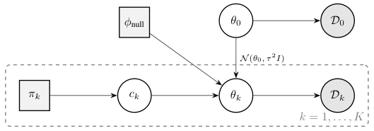
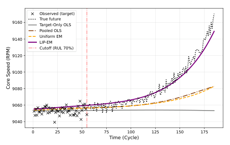

## Why I read it

My own work replaces a hand-built prior in Bayesian factor selection with a learned one, and one question keeps coming back: once data arrive, how much should a prior from outside the data still matter? This paper asks the same question in domain adaptation, with the prior coming from text. I read it for three things: where exactly the prior enters, how it is made to fade, and whether the experiments show it fading.

## The problem, in one paragraph

A new machine or patient gives only a few observations. An archive of older ones exists, some relevant and some not. Deciding which sources resemble the target needs a good estimate of the target, and that estimate needs the right sources. The authors call this the cold-start paradox; pooling everything gives negative transfer. The point that convinced me is simple: <mark>any data-driven relevance score is estimated from the target sample, so it is no better than the target sample is</mark>. The way out has to be information that is not in the data, here an expert's short description of the target.

## The idea, as I understand it

*Source: Chen, Zhou, Al Kontar, arXiv:2605.14301, Fig. 1, CC BY 4.0.*

I would summarise the method as three moves.

1. **The prior sits on relevance, not on the parameter.** Each source $k$ carries a binary indicator: relevant sources scatter tightly around the target parameter, $\theta_k\sim\mathcal N(\theta_0,\tau^2 I)$, and irrelevant ones come from a broad null. The text enters only through the prior probability $\pi_k$ that source $k$ is relevant. This is the design decision I like most: the LLM never has to say anything numerical about the physics.
2. **The LLM makes choices, and a choice model turns them into probabilities.** The LLM is shown random subsets of sources plus a "none fits" option and picks one. A conditional logit with an outside option is fitted to many such picks, and $\pi_k=\sigma(\alpha_k)$ from the fitted worths. A small penalty pulling every worth towards a default $p_0$ is what makes $\sigma(\alpha_k)$ a probability at all, because the choice likelihood alone does not change if a constant is added to every worth.
3. **EM weighs the prior against tempered evidence.** Each source's weight in the next estimate is
$$
w_k=\sigma\Big(\beta_k\,\log\frac{p(D_k\mid c_k=1,\theta)}{p(D_k\mid c_k=0)}+\log\frac{\pi_k}{1-\pi_k}\Big),
$$
the evidence (a likelihood ratio, scaled by $\beta_k$) plus the language prior (as log-odds). In its cheapest form the M-step is then a relevance-weighted average of the per-source estimates.

The tempering $\beta_k$ was the part I had to work through. With the toy's sizes (4 target points, 200 per source, one dimension, unit noise), a truly relevant source evaluated at the noisy target estimate looks about 25 nats worse than it should, while a prior of 0.9 is worth only about 2.2 nats. Without tempering, the target's own sampling noise throws relevant sources away and EM settles on the target-only estimate. Scaling the evidence by roughly $1/\sqrt{dN_k/N_0}$ brings that 25 down to about 3.5, the same order as the prior; as $N_0$ grows, the data take over. <mark>So "the prior guides when target signals are weak and the data refine it as samples accumulate" is not a slogan: it is the tempering schedule.</mark> (The arithmetic is mine, with the toy's sizes.)

The theory splits the same way. With a correct prior, the first EM step's bias shrinks, and once the iterate is near the target the error is within about twice that of an oracle that knows the relevant set. With any prior, the estimator is consistent as target data grow.

## What the results show

The clearest test is turbofan degradation (C-MAPSS): ten fast-degrading engines in turn as the target, 99 sources, and one paragraph describing abrasive desert dust. RMSE, mean over the ten targets; lower is better.

| share of the target's life observed | LIP, Claude prior | LIP, Gemini prior | EM, flat prior | pool everything | target only |
|---|---|---|---|---|---|
| 10% | **14.3** | 15.0 | 21.4 | 33.9 | 43.7 |
| 30% | 15.9 | **15.2** | 35.2 | 38.1 | 58.7 |
| 90% | 11.5 | 9.0 | **7.3** | 82.9 | 10.1 |

How I read it:

- **The cold start is a clear win.** With 10% of the life observed, both language priors cut the error by about 30% against the same EM with a flat prior; with 30%, by about 55%. Pooling is the worst column and gets worse as more of the target is observed: negative transfer you can watch.
- **Late in the data stream, a confident prior has a cost.** With 90% observed, the Claude prior's 11.5 is worse than the flat-prior EM's 7.3 and even than target-only 10.1. Consistency is an asymptotic statement; this row is its finite-sample price, and the paper does not discuss it.
- **A wrong prior recovers, slowly.** On MuJoCo Hopper the Gemini prior misjudges which gravities are close to the target's. With 128 target transitions it reaches 1,627 reward against 2,670 for the Claude prior; by 1,024 it has caught up. At 512 it is still 731 reward behind the flat-prior EM, which is the price of a bad prior before it washes out.

*Source: Chen, Zhou, Al Kontar, arXiv:2605.14301, Fig. 5, CC BY 4.0.*

## Where I am not convinced

- **The targets fit the description.** All ten C-MAPSS targets are fast-degrading engines described by the same paragraph. I would like to see a vague or wrong description on real data.
- **"Language" carries less than the name suggests on Hopper.** The winning prior came from an LLM agent that estimated gravity from the trajectories before choosing. Whether a text-only judgement does as well is not tested.
- **The oracle comparison is never shown.** The theory compares against an oracle that knows the relevant set; even the Gaussian toy, where that oracle is computable, does not report it.
- **No sensitivity analysis.** $\tau$, $p_0$, the penalty, the query budget and LLM run-to-run variation are all fixed.
- **Relevance is all-or-nothing.** Ten ordered gravities invite graded relevance, but one global $\tau$ forces each source to be pooled fully or dropped.

## What I take from it

- **Put outside knowledge where it is cheap to be wrong.** A prior on which data to trust is easier to check and to overrule than a prior on the parameter itself. My flow prior sits on the coefficients; this paper made me think about priors on model components instead.
- **The fade has to be engineered.** In my experiment that tuned a learned prior by Bayesian optimisation, the tuned prior barely changed out-of-sample pricing error while collapsing the posterior entropy: a prior that did not step aside. Tempering the evidence by its own noise is a principled knob I want to try there.
- **Densities again.** The E-step is a likelihood ratio, so the method needs explicit likelihoods; on Hopper the authors fitted a Gaussian dynamics model to get one. That matches what my [learned-prior page](/research/model-uncertainty-priors/) found: the density, not the sampler, is what makes the Bayesian machinery work.

## What I would try next

*Ideas, not results.*

1. **Prior accuracy against cold-start error, controlled.** In the Gaussian toy with 20 sources, simulate an "LLM" that answers correctly with probability $a$, and plot the error relative to the oracle against $N_0$ for each $a$. I expect a smooth early gain and a crossing point where the flat prior overtakes an over-confident one: the 90% row above, made measurable.
2. **Graded relevance.** Let the elicited worth set a per-source $\tau_k$ for the Hopper gravities. The risk is that $\tau_k$ then has to be learned from the same tiny target.

## References

- Q. Chen, J. Zhou, R. Al Kontar. *Language-Induced Priors for Domain Adaptation.* arXiv:2605.14301, 2026. Code: github.com/Chen-Qiyuan/LIP-EM.
- D. McFadden. *Conditional logit analysis of qualitative choice behavior.* In *Frontiers in Econometrics*, 1974.
- N. Ueda, R. Nakano. *Deterministic annealing EM algorithm.* Neural Networks 11(2), 1998.
- A. Capstick, R. Krishnan, P. Barnaghi. *AutoElicit: Using Large Language Models for Expert Prior Elicitation in Predictive Modelling.* ICML 2025.
- R. Kontar, G. Raskutti, S. Zhou. *Minimizing negative transfer of knowledge in multivariate Gaussian processes: a scalable and regularized approach.* IEEE TPAMI 43(10), 2021.
