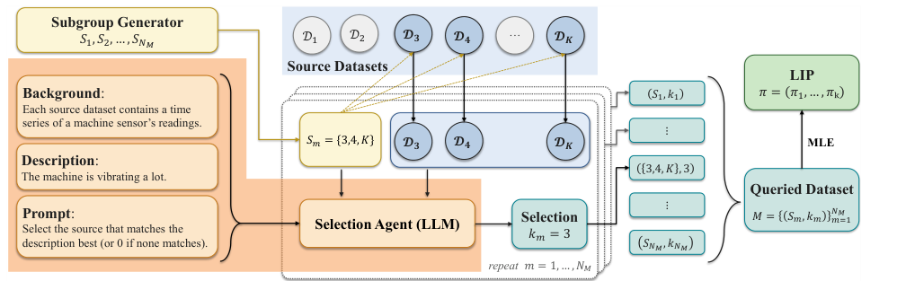

## Abstract

Multi-source domain adaptation has a chicken-and-egg problem when the target is new: deciding which sources resemble the target needs a decent estimate of the target, and getting that estimate needs the right sources. The paper breaks the loop with information that is not in any dataset — a short expert description of the target — and turns it into a prior on a binary "this source is relevant" indicator. An LLM answers multiple-choice questions over random subsets of sources, a conditional logit with an outside option is fitted to those answers, and the fitted worths become prior probabilities. An EM then weighs these prior log-odds against tempered likelihood ratios and, in its cheapest form, averages per-source MLEs. The theory gives a near-oracle cold-start error under a correct prior and consistency under any prior; experiments cover a toy Gaussian, turbofan degradation (C-MAPSS) and offline RL on MuJoCo Hopper.

**Keywords:** multi-source domain adaptation, negative transfer, LLM prior elicitation, conditional logit, empirical Bayes, EM, deterministic annealing, cold start

## 1 Introduction

A new machine or patient produces a few observations, and there is a large archive from older ones. Pooling everything fails whenever part of the archive comes from a different regime — the paper's example is a degradation model fitted on machines in dry conditions applied to one in a humid plant. That is negative transfer, and it can make the pooled model worse than the target-only one.

Earlier multi-source methods decide relevance from the data: they reweight sources by feature proximity, align moments, train adversarially, optimise convex combinations, or discover latent domain clusters with EM. The paper's diagnosis, which convinces me: <mark>every data-driven relevance score is itself estimated from the target sample, so it is no better than the target sample is</mark>.

Domain generalisation with metadata and vision–language adaptation do use side information, but need it for *every* domain. In practice only the current system gets described; historical datasets come without notes. Hence the design constraint: text for the target only, and an estimator that works whenever a likelihood exists.

Unlike AutoElicit, which asks an LLM for numerical prior parameters, the LLM here only makes discrete choices, and probabilities are recovered statistically from many of them.

## 2 Background

**Conditional logit with an outside option.** If an agent picks one item from a menu $S$ or "none", and item $j$ has worth $\alpha_j$, the McFadden/Luce model gives each option probability proportional to $e^{\alpha_j}$, with the "none" option given its own worth $\alpha_0$. Only differences of worths are identified.

**EM for a two-component mixture.** With latent binary labels $c_k$, EM alternates computing posterior label probabilities (E-step) and maximising the label-weighted log-likelihood (M-step). The E-step posterior of a binary label is a sigmoid of prior log-odds plus log-likelihood ratio. Deterministic-annealing EM (Ueda and Nakano) multiplies the likelihood term by a temperature that increases over iterations, so the early iterations stay close to the prior.

## 3 Method

> **Key idea.** Put a prior on *which* sources to trust, not on the target parameter itself. The prior comes from an LLM's choices; the likelihood then has the final word on each source as data accumulates.

### 3.1 Generative model

There are $K$ source domains and one target (index $0$), each with parameter $\theta_k \in \mathbb{R}^d$ and an i.i.d. dataset $D_k$ of size $N_k$. A source is relevant ($c_k=1$) with prior probability $\pi_k$; relevant sources scatter tightly around the target parameter and irrelevant ones come from a broad null law:

$$
\begin{aligned}
c_k &\sim \mathrm{Bernoulli}(\pi_k),\\
\theta_k \mid c_k=1 &\sim \mathcal{N}(\theta_0,\tau^2 I),\qquad
\theta_k \mid c_k=0 \sim \phi_{\text{null}} .
\end{aligned}
\tag{1}
$$

$\tau$ sets how close "relevant" must be, $\phi_{\text{null}}$ is a user-chosen background a source must beat, and the target text enters only through $\pi$.


*Source: Chen, Zhou, Al Kontar, arXiv:2605.14301, Fig. 1, CC BY 4.0.*

### 3.2 Building the prior from LLM choices

For each query $m$ a random subgroup $S_m$ of sources is shown to the LLM with background $h$ (task, technical report, target paragraph) and the source data; it returns one index $k_m\in S_m$, or $0$ for "none fits". Each source gets a worth $\alpha_k$ and the null gets $\alpha_0$:

$$
p(k_m \mid S_m) \;=\; \frac{e^{\alpha_{k_m}}}{e^{\alpha_0}+\sum_{j\in S_m} e^{\alpha_j}},
\qquad
\pi_k=\sigma(\alpha_k).
\tag{2}
$$

The numerator is the worth of whatever was chosen (the null included); the denominator always contains the null, so a source is picked only if it beats both its competitors and the threshold. The worths are fitted by penalised maximum likelihood:

$$
\min_{\alpha_0,\dots,\alpha_K}\;
-\sum_{m=1}^{N_M}\log p(k_m\mid S_m)
\;+\;\epsilon\sum_{k=1}^{K}\Big(\alpha_k-\log\tfrac{p_0}{1-p_0}\Big)^2 .
\tag{3}
$$

The first term is the choice log-likelihood; the second pulls every source towards a default prior $p_0$. Appendix B explains why the penalty is essential: <mark>the choice likelihood is invariant to adding a constant to all worths, so without an anchor $\sigma(\alpha_k)$ is not a probability at all</mark>; the penalty fixes that gauge, stops a source that wins every subgroup from running to $+\infty$, and absorbs hallucinated answers. With at least one null and one source choice the objective is strongly convex, so the optimum is unique.


*Source: Chen, Zhou, Al Kontar, arXiv:2605.14301, Fig. 2, CC BY 4.0.*

### 3.3 E-step: prior log-odds plus evidence

Write $O$ for all datasets. Dropping terms that do not depend on $\theta$, the EM objective is a weighted log-likelihood (exact):

$$
Q(\theta\mid\theta^{(t)}) = \log L(\theta;D_0)+\sum_{k=1}^{K} w_k^{(t)}\log p(D_k\mid c_k=1,\theta),
\qquad
w_k^{(t)} = \sigma\!\Big(\beta_k^{(t)}\,\log\frac{p(D_k\mid c_k=1,\theta^{(t)})}{p(D_k\mid c_k=0)}+\log\frac{\pi_k}{1-\pi_k}\Big).
\tag{4}
$$

$Q$ is the target likelihood plus each source's likelihood scaled by its current relevance $w_k$. Inside the sigmoid, the log-likelihood ratio says whether the current target estimate explains source $k$ better than the null does; the second term is the language prior. With $\beta=1$ this is the exact posterior; $\beta_k^{(t)}<1$ is the tempering of §3.6, a deliberate departure.

The relevant marginal likelihood integrates $\theta_k$ out against $\mathcal{N}(\theta^{(t)},\tau^2I)$. With a second-order expansion of $\log L(\cdot;D_k)$ at $\theta^{(t)}$ (gradient $g_k$, negative Hessian $H_k\succeq0$) the integral is Gaussian (approximate; exact for a Gaussian likelihood or at $\tau=0$):

$$
\log p(D_k\mid c_k=1,\theta^{(t)}) \approx \log L(\theta^{(t)};D_k)
+\tfrac{\tau^2}{2}\,g_k^{\top}(I+\tau^2H_k)^{-1}g_k
-\tfrac12\log\det(I+\tau^2H_k).
\tag{5}
$$

The first term is the plug-in fit; the second credits a source whose own optimum is a small $\tau$-sized step away; the third is an Occam penalty that grows with the source's information. Both corrections vanish at $\tau=0$.

### 3.4 M-step: a precision-weighted blend

Re-expanding each source around its own MLE $\hat\theta_k$ instead of the iterate kills the gradient and freezes the Hessian, so the objective becomes quadratic and has a closed-form maximiser (an approximation, exact for Gaussian likelihoods):

$$
\theta^{(t+1)}=\Big(I+\sum_k\Lambda_k^{(t)}\Big)^{-1}\Big(\hat\theta_0+\sum_k\Lambda_k^{(t)}\hat\theta_k\Big),
\qquad
\Lambda_k^{(t)}=w_k^{(t)}\,H_0^{-1}(I+\tau^2H_k)^{-1}H_k .
\tag{6}
$$

$\Lambda_k$ is source $k$'s precision relative to the target's, discounted by relevance. Since $(I+\tau^2H_k)^{-1}H_k\to I/\tau^2$ as $H_k$ grows, <mark>a source can never be worth more than precision $1/\tau^2$, however large it is</mark> — the model's built-in limit on borrowing. For small $\tau$ and Fisher approximations $H_k\approx N_k\mathcal{I}$, $H_0\approx N_0\mathcal{I}$, (6) collapses to

$$
\theta^{(t+1)}=\frac{N_0\hat\theta_0+\sum_k w_k^{(t)}N_k\hat\theta_k}{N_0+\sum_k w_k^{(t)}N_k},
\tag{7}
$$

a sample-size-and-relevance weighted mean of MLEs, $O(d)$ per iteration. Neural-network weights do not average meaningfully, so there the M-step is gradient ascent on the weighted log-likelihood.

### 3.5 Theory, briefly

For Gaussian means with $\tau=0$ and equal source sizes $N$, the oracle that knows the relevant set $R$ attains $d\sigma^2/(N_0+N|R|)$. Theorem 4.1 shows that, *if the iterate enters a basin around $\theta_0$*, the EM fixed point has error at most twice that oracle plus two terms decaying exponentially in $N$. The prior's role is the basin entry: at $t=0$ tempering gives $w_k=\pi_k$, and the first update's bias is

$$
\theta^{(1)}-\theta_0=\frac{\sum_{k\notin R}\pi_k(\theta_k-\theta_0)}{N_0/N+\sum_k\pi_k}+\text{zero-mean noise},
\tag{8}
$$

so <mark>a correct prior shrinks the bias of the very first step, and that is the whole mechanism by which language helps</mark>. Separately, Theorems 4.2–4.3 give a safety net that holds for any prior: the iterate is consistent as $N_0\to\infty$, and each weight tends to 1 or 0 according to whether the relevant model or the null explains source $k$ better as $N_k\to\infty$.

### 3.6 Intuition: why tempering is not optional

Take the toy's sizes, $N_0=4$ and $N_k=200$, with $d=1$ and an assumed $\sigma=1$ (not stated). The target MLE has standard deviation $0.5$. Let source $k$ be truly relevant and the current iterate be the target MLE, one standard deviation off. At $\tau=0$ the relevant log-likelihood of source $k$ sits $N_k\delta^2/2=200\cdot0.25/2=25$ nats below its maximum. A prior of $\pi_k=0.9$ contributes only $\log 9\approx2.2$ nats. So with $\beta=1$ the evidence swamps the prior; against a reasonably fitting null, <mark>an untempered E-step throws away a relevant source because of the target's own sampling noise</mark>; once all weights are near zero, (7) returns the target-only MLE and EM stays there — the degenerate optimum Appendix C.2 warns about.

The fix scales the evidence by its own noise. Linearising the log-likelihood error caused by $\hat\theta_0-\theta_0$ gives variance $\varepsilon_k^2=\operatorname{Tr}(H_0^{-1}H_k)\approx dN_k/N_0$, here $50$, so $\varepsilon_k\approx7.07$. Tempering with $\beta_k\to1/\varepsilon_k\approx0.14$ turns the 25-nat penalty into about 3.5 nats, the same order as the prior. Evidence and prior now compete on equal terms; as $N_0$ grows the data take over.

Equation (8) gives the payoff in a two-source case — one relevant, one irrelevant at distance $\Delta$, with $N_0/N=0.02$. A uniform $\pi=0.5$ gives first-step bias $0.5\Delta/1.02\approx0.49\Delta$; a correct prior $(0.9,0.1)$ gives $0.1\Delta/1.02\approx0.10\Delta$. (Illustrative arithmetic of mine, not a reported result.)

### 3.7 Algorithm

```text
Inputs: target D0, sources D1..DK, target text h, null phi_null,
        tau, tempering rate nu, penalty eps, default p0, query budget NM

# Prior
for m in 1..NM:
    S_m  <- random subset of sources (size 3-5 in C-MAPSS)
    k_m  <- LLM(h, {D_k : k in S_m}, "pick best match or 0")
alpha <- argmin  -sum_m log softmax_{S_m ∪ {0}}(alpha)[k_m]
                 + eps * sum_k (alpha_k - logit(p0))^2
pi_k  <- sigmoid(alpha_k)

# Precompute
theta_hat_k, H_k <- MLE and negative Hessian for k = 0..K
eps_k  <- sqrt(trace(H_0^{-1} H_k))        # ≈ sqrt(d N_k / N0)
theta  <- 0 ;  t <- 0                      # theta_pool for NNs (Alg. 3)

# EM
repeat:
    beta_k <- (1 - exp(-nu t)) / eps_k     # beta = 0 at t = 0, so w = pi
    for k: llr_k <- log p(D_k | relevant, theta) - log p(D_k | null)
           w_k   <- sigmoid(beta_k * llr_k + logit(pi_k))
    theta <- closed form (6) or (7);  or w-weighted SGD steps for NNs
    t <- t + 1
until max_k |w_k - w_k_prev| <= 1e-3 for 5 iterations
return theta, w
```

## 4 Implementation notes

| item | C-MAPSS | MuJoCo Hopper |
|---|---|---|
| model | natural cubic spline GLM, 5 knots on $[0,300]$ | Gaussian dynamics MLP, width 512, 4 residual blocks |
| EM variant | closed form, exact $\tau^2$-corrected E-step (Alg. 1) | gradient M-step (Alg. 3), 100 steps/iter, AdamW, lr $10^{-5}$ |
| $\tau$, $\nu$ | $10^{-3}$, 0.05 | not stated, 0.1 |
| null | empirical-Bayes mixture of other sources, self-excluded | pooled model $\theta_{\text{pool}}$, fixed |
| queries $N_M$, $\lvert S_m\rvert$ | 200, $\{3,4,5\}$ | 50, not stated |
| $p_0$, $\epsilon$ | 0.01, 0.1 | 0.01, 1.0 |
| iteration cap | 1000 | 100 |
| downstream | — | weighted IQL, 200,000 steps |

Shared: Gemini 3 Flash (temperature 0, JSON output) or Claude Opus 4.7 as a Claude Code local agent; L-BFGS for the logit; seed 42. Compute: one RTX 5090 workstation; Gaussian and C-MAPSS run in seconds on CPU, hopper pool training about 14 hours, each EM 1–3 minutes, IQL about 5 hours.

Things that are easy to get wrong:

- **Tempering in the hopper run uses $d_{\text{eff}}$** = trainable parameter count, so $\varepsilon_k=\sqrt{d_{\text{eff}}N_k/N_0}$ is very large and $\beta$ very small, while the log-likelihood ratio is summed over about $10^6$ transitions. The paper does not report the resulting $w_k$, so how much of the hopper gain comes from the prior and how much from the data cannot be read off.
- **Algorithm 1 initialises at $\theta^{(0)}=0$** and relies on $\beta^{(0)}=0$ to make the first E-step prior-only; with any $\beta^{(0)}>0$ the zero initialisation would be read as evidence.
- **The C-MAPSS prior is shared** across the ten target engines: one set of 200 answers, with queries containing the current target dropped.
- **The local agent is not a single LLM call.** For hopper, Claude ran six gravity-estimation scripts on the anonymised buffers before judging; Gemini saw only a few sampled trajectories of the 1 GB of sources.
- Subgroup size and composition for hopper, the Gaussian-experiment hyperparameters, and the exact null scale in the toy are not stated. The code is said to be public (github.com/Chen-Qiyuan/LIP-EM); I did not check it.

## 5 Experiments

**Setup.** Five estimators: Target Only, Pooled, Uniform EM (same EM with a flat $p_0$ prior), LIP-G (Gemini prior), LIP-C (Claude prior). (i) Gaussians in 1-D and 2-D, three sources of 200 points, one relevant, 4 target points, with a description that names the answer outright. (ii) C-MAPSS FD001, sensor 9 (HPC core speed); ten fast-degrading engines in turn as target, 99 sources, a paragraph on abrasive dust ingested in a desert; RMSE reported at RUL cutoffs (90% RUL means 10% of the trajectory seen). (iii) Hopper: ten SAC replay buffers at gravities 1–10 m/s², target at 8.87 m/s² ("Venus-like"), $N_0$ target transitions, reward over 200 episodes.


*Source: Chen, Zhou, Al Kontar, arXiv:2605.14301, Fig. 3, CC BY 4.0.*

**Table 1 — C-MAPSS core-speed RMSE, mean (s.e.) over 10 target engines; lower is better, best in bold.**

| RUL | LIP-C | LIP-G | Uniform EM | Pooled | Target Only |
|---|---|---|---|---|---|
| 90% | **14.3** (2.0) | 15.0 (3.3) | 21.4 (3.0) | 33.9 (2.6) | 43.7 (2.7) |
| 70% | 15.9 (2.0) | **15.2** (3.6) | 35.2 (3.1) | 38.1 (3.0) | 58.7 (10.8) |
| 50% | **17.7** (3.5) | 17.9 (6.1) | 24.9 (4.4) | 44.7 (3.5) | 36.6 (5.1) |
| 30% | 20.1 (3.2) | 16.5 (3.3) | **15.2** (2.2) | 56.5 (4.4) | 27.0 (5.8) |
| 10% | 11.5 (1.6) | 9.0 (1.3) | **7.3** (0.8) | 82.9 (6.5) | 10.1 (2.7) |

**Table 2 — Hopper mean episodic reward (s.e.); higher is better, best in bold. LIP-G is the misspecified prior.**

| $N_0$ | LIP-C | LIP-G | Uniform EM | Pooled | Target Only |
|---|---|---|---|---|---|
| 128 | **2670** (57) | 1627 (69) | 1283 (34) | 1610 (48) | 19 (0) |
| 256 | **2539** (61) | 1647 (70) | 1578 (51) | 1298 (32) | 24 (4) |
| 512 | **2586** (55) | 1760 (76) | 2491 (57) | 1364 (38) | 223 (3) |
| 1024 | 2599 (57) | **2636** (56) | 2604 (55) | 1336 (33) | 179 (9) |
| 2048 | 2607 (56) | 2607 (56) | **2666** (56) | 1496 (42) | 164 (13) |

There is no separate ablation table: LIP-G on hopper is the paper's misspecified-prior ablation and Uniform EM the no-language one.


*Source: Chen, Zhou, Al Kontar, arXiv:2605.14301, Fig. 5, CC BY 4.0.*

**Claim by claim.**

1. *"LIP helps in the cold start."* Well supported. Against Uniform EM, both LIP variants cut RMSE by 30–33% at 90% RUL (14.3 and 15.0 vs 21.4) and by 55–57% at 70% (15.9 and 15.2 vs 35.2) — gaps of 4–5 combined standard errors at 70%, only 1.4–2 at 90%. On hopper at $N_0=128$, LIP-C's 2670 is about double Uniform EM's 1283.
2. *"Pooling causes negative transfer."* Clearly supported: Pooled is the worst C-MAPSS column from 50% RUL on, and its RMSE *rises* as more target data arrive (33.9 to 82.9). Uniform EM below Pooled at $N_0=128$ on hopper, though, shows that a flat-prior EM can do worse than naive pooling.
3. *"Consistent under any prior; EM self-corrects."* Partly supported. On hopper the false prior LIP-G converges to the others by $N_0=1024$, though at $N_0=512$ it is still 731 reward behind Uniform EM — the price of a wrong prior. On C-MAPSS the picture is less flattering: <mark>late in life, a correct-looking prior still costs accuracy</mark> — at 10% RUL LIP-C's 11.5 is worse than Uniform EM's 7.3 and even Target Only's 10.1. Consistency is asymptotic; this finite-sample cost goes undiscussed.
4. *"The estimator nearly matches the oracle."* Not tested empirically. No experiment reports the oracle (known relevant set) or the MSE ratio, even in the Gaussian toy where it is computable.
5. *"Prior quality is crucial."* Supported by the LIP-C vs LIP-G gap on hopper (2670 vs 1627 at 128) and by the reasoning audit in Appendix F.4.2, which documents systematic rather than random LLM errors (anchoring on Earth gravity, trusting one noisy row, arithmetic slips).

Appendix F mentions nine RUL cutoffs and $N_0$ up to 4096; the tables show five rows each.

## 6 Limitations

**Stated by the authors**

- Theorem 4.1 assumes the iterate enters the basin of $\theta_0$; relaxing this is open.
- The quality of the prior drives cold-start performance; a false prior slows recovery.
- The framework needs an explicit likelihood; non-parametric and likelihood-free models are future work.
- Elicitation is one exemplary scheme; better ones are left open.

**My reading**

- **The targets were chosen to fit the description.** All ten C-MAPSS targets are fast-degrading engines and the single shared paragraph describes fast degradation. No experiment shows what happens when a description is vague, or wrong for that target, on real data.
- **"Language" carries less than the name suggests.** The LLM also sees the source data, and on hopper the winning prior came from an agent estimating gravity from trajectories and matching it to a known constant. Whether a text-only judgement would do as well is not tested.
- **The finite-sample bound gets looser as the prior gets more confident.** $C_1$ grows like $e^{2B}$ with $B$ the largest absolute prior log-odds. And if one plugs the tempering asymptote $\beta\approx\sqrt{N_0/(dN)}$ into the exponent $c_2\beta N\Delta^*$, the decay is in $\sqrt{NN_0/d}$, not $N$; the theorem sidesteps this by treating $\beta$ as a free scalar.
- **The empirical-Bayes null (Eq. 25 in the paper) is sub-normalised** once any $w_j>0$, because its mixture weights $(1-w_j)/(K-1)$ no longer sum to one. That lowers the null likelihood and tilts every E-step towards "relevant" — the direction the paper itself calls unsafe.
- No sensitivity study for $\tau$, $p_0$, $\epsilon$, $\nu$, query budget or subgroup size, and no LLM run-to-run variation.
- Relevance is all-or-nothing per source, with one global $\tau$; a nearby-but-different gravity must be pooled fully or dropped.

## 7 Extensions

**What was built on this.** The paper is from May 2026 and I know of no follow-up (from general knowledge, unverified). Its closest cited relatives: AutoElicit (Capstick et al., 2025) elicits numerical priors directly; Sekulovski et al. (2026) use LLM binary judgements for graphical-model priors; D3G (Yao et al., 2024) and Zhu et al. (2026) need metadata for all domains; Kontar et al. (2021) tackle negative transfer in multivariate Gaussian processes.

**Open problems.** Basin entry without a good prior; graded relevance; a principled null; likelihood-free versions; and whether $\sigma(\alpha_k)$ is a calibrated probability or merely a ranking.

**Research directions.** *These are ideas, not results — none has been run.*

1. **Prior quality versus cold-start error, controlled.**
   *Hypothesis:* the cold-start gain is a smooth function of how often the elicited choices are right, and an overconfident prior (large $B$) has a measurable late-stage cost, as the 10%-RUL row suggests. *Data:* the paper's Gaussian toy, extended to $K=20$ sources, with a simulated "LLM" that answers correctly with accuracy $a\in[0.2,1]$, plus C-MAPSS with the real elicitation. *Baseline:* Uniform EM; the oracle with the known relevant set. *Metric:* MSE ratio to oracle against $N_0$; the crossing point where Uniform EM overtakes LIP. *Failure mode:* the penalty $\epsilon$ hides the effect by shrinking every prior to $p_0$.

2. **Per-source similarity instead of a binary switch.**
   *Hypothesis:* letting the elicited worth set a per-source $\tau_k$ (closer sources tied more tightly) beats the binary model on hopper, where gravities are ordered. *Data:* hopper buffers at the ten gravities. *Baseline:* LIP-aided EM with global $\tau$. *Metric:* reward at $N_0\le512$. *Failure mode:* the extra freedom brings back the circularity — $\tau_k$ estimated from a tiny target.

3. **Volatility-state identification as a cold-start problem (owner's work).**
   The [TailFlow](/research/tailflow/) page uses a conditional diffusion model as scenario generator and as the input model of a CVaR-constrained portfolio choice, on a synthetic two-regime Student-t market with known VaR/ES. It reports that no fitted input model picks the truly best portfolio in more than 45% of decisions, and names the dominant error: identifying the current volatility state from recent returns, which more training data does not shrink. That is this paper's setting — a short recent window as target, historical blocks as sources.
   *Hypothesis:* a relevance prior over historical blocks, refined by EM, reduces the state-identification error and with it the infeasible-choice rate at the tight CVaR limit. *Data:* the page's synthetic market, where the hidden regime is available to the simulator, so a "description" of the current state can be simulated with controlled accuracy. *Baseline:* filtered historical simulation and the fitted models on the page; the Hamilton filter, which the page states gives the best possible forecast in that market, as the ceiling. *Metric:* 1-day 99% ES error against truth, P(select the true best), P(infeasible). *Likely failure mode:* the closed-form update (7) is a mean estimator and the tails are Student-t, so the likelihood-based variants are needed; and a simulated description that is too accurate simply leaks the regime label. (The [exchange-queueing](/projects/exchange-queueing/) page is a weaker match: it already puts a discount-filtered posterior on block arrival parameters and concludes that the arrival-model family, not the inference, is the limitation.)

## 8 Takeaways

- The useful move is where the prior sits: on *which data to trust*, not on the target parameter.
- Eliciting choices and fitting a conditional logit beats asking for numbers; the gauge-fixing penalty is what makes the worths probabilities.
- <mark>Tempering by $\sqrt{dN_k/N_0}$ is what makes the prior matter at all</mark>: without it, target noise alone throws away relevant sources.
- Results are strong in the cold start on hand-picked targets; late in the data stream an over-confident prior costs accuracy, so the "self-correcting" claim is asymptotic.
- The E-step is a likelihood ratio, so the method needs densities — on hopper the authors had to fit a Gaussian dynamics model to a model-free pipeline to get one. The same requirement is the theme of the owner's [model-uncertainty page](/research/model-uncertainty-priors/), which reports that a learned flow prior used through its density reproduces the exact factor-selection posterior while density-free routes do not.

## References

- Q. Chen, J. Zhou, R. Al Kontar. *Language-Induced Priors for Domain Adaptation.* arXiv:2605.14301, 2026.
- A. Capstick, R. Krishnan, P. Barnaghi. *AutoElicit: Using Large Language Models for Expert Prior Elicitation in Predictive Modelling.* ICML 2025.
- D. McFadden. *Conditional logit analysis of qualitative choice behavior.* In *Frontiers in Econometrics*, 1974.
- N. Ueda, R. Nakano. *Deterministic annealing EM algorithm.* Neural Networks 11(2), 1998.
- R. Kontar, G. Raskutti, S. Zhou. *Minimizing negative transfer of knowledge in multivariate Gaussian processes: a scalable and regularized approach.* IEEE TPAMI 43(10), 2021.
