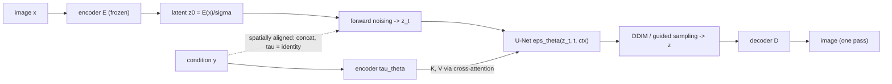

## Abstract

Pixel-space diffusion pays for every denoising step in the full dimensionality of the image, in training and again at every sampling step. Rombach et al. split the problem in two: a separately trained autoencoder removes detail a viewer cannot see and returns a 2D latent a few times smaller per side, and a standard noise-prediction U-Net is trained on those latents. Because the U-Net keeps its convolutional inductive bias on a grid-shaped latent, the compression can stay mild — which avoids the quality ceiling of earlier two-stage models, whose flattened autoregressive priors forced aggressive downsampling. Cross-attention layers let the same backbone accept text, layouts or class labels. The resulting latent diffusion models reach FID 3.60 on class-conditional ImageNet 256×256 with classifier-free guidance and set a new best FID on Places inpainting, at roughly a quarter of ADM's training compute and several times its sampling throughput.

**Keywords:** latent diffusion, perceptual compression, two-stage generative model, cross-attention conditioning, text-to-image, compute efficiency

## 1 Introduction

The motivation is cost, stated in numbers. The authors quote 150–1000 V100-days to train the strongest pixel-space diffusion models of the time ([ADM](/blog/diffusion-beats-gans/)) and about five days on a single A100 to draw 50k samples from one, at 25–1000 sequential network evaluations each. That restricts the model class to a few labs and makes every evaluation slow.

The diagnosis comes from the rate–distortion behaviour of an already trained pixel model ([Fig. 2 in the paper](https://arxiv.org/pdf/2112.10752#page=2)). Learning splits into a *perceptual compression* stage that removes high-frequency detail while learning little semantic variation, and a *semantic compression* stage where composition and content are learned. <mark>A likelihood-based model in pixel space spends much of its capacity, and all of its per-step compute, on the perceptual part.</mark> The reweighted [DDPM](/blog/ddpm/) objective down-weights those loss terms, but gradients and forward passes still run on every pixel, so the cost does not go away.

Earlier two-stage methods (VQ-VAE, VQGAN, DALL-E) already moved generation into a learned latent. Their weakness was the prior, not the idea: an autoregressive transformer over a *flattened* latent scales badly in sequence length, which forced heavy spatial compression, which capped reconstruction quality. Table 8 quantifies the ceiling — DALL-E's $f=8$ autoencoder reconstructs at PSNR 22.8 and R-FID 32.01, VQGAN at $f=16$ at 19.9 / 4.98, the authors' $f=4$ model at 27.4 / 0.58. <mark>No prior can undo a first stage that has already thrown the information away</mark>, so the contribution is as much about *how little* to compress as about where to diffuse.

## 2 Background

The diffusion machinery is unchanged from [DDPM](/blog/ddpm/): a fixed Markov noising chain of length $T$, a time-conditional U-Net $\epsilon_\theta$ trained to regress the noise, and the simplified objective

$$
L_{DM} = \mathbb{E}_{x,\;\epsilon\sim\mathcal{N}(0,I),\;t}\Big[\lVert \epsilon - \epsilon_\theta(x_t, t)\rVert_2^2\Big],
\tag{1}
$$

with $t$ uniform on $\{1,\dots,T\}$. Appendix B re-derives it in signal-to-noise form, $\mathrm{SNR}(t)=\alpha_t^2/\sigma_t^2$, showing that the ELBO term at step $t$ carries weight $\tfrac12\big(\mathrm{SNR}(t-1)-\mathrm{SNR}(t)\big)$ before the reweighting flattens it — the same algebra as DDPM's, written so the SNR of the latent space can later be discussed directly. The backbone is the [ADM](/blog/diffusion-beats-gans/) "ablated U-Net"; sampling uses [DDIM](/blog/ddim/); the guided results use [classifier-free guidance](/blog/classifier-free-guidance/). The first stage is VQGAN's autoencoder with its perceptual and patch-adversarial losses.

## 3 Method

> **Key idea.** Let an autoencoder do perceptual compression once, then let diffusion do semantic modelling in its latent. Because a convolutional U-Net handles a 2D latent gracefully — unlike a transformer over a flattened one — the compression can stay mild ($f=4$–$8$), so almost nothing visible is lost while every diffusion step gets 16–48× cheaper.



### 3.1 Perceptual compression

An encoder $\mathcal{E}$ maps $x \in \mathbb{R}^{H\times W\times 3}$ to $z=\mathcal{E}(x)\in\mathbb{R}^{h\times w\times c}$; a decoder reconstructs $\tilde x = \mathcal{D}(z)$. The downsampling factor is $f = H/h = W/w = 2^m$. The training objective (Appendix G) is a min–max problem,

$$
L_{\mathrm{AE}} = \min_{\mathcal{E},\mathcal{D}} \max_{\psi}\;
\Big[\,L_{\mathrm{rec}}\big(x,\mathcal{D}(\mathcal{E}(x))\big)
- L_{\mathrm{adv}}\big(\mathcal{D}(\mathcal{E}(x))\big)
+ \log D_\psi(x)
+ L_{\mathrm{reg}}(x;\mathcal{E},\mathcal{D})\,\Big],
\tag{2}
$$

where $L_{\mathrm{rec}}$ combines a pixel loss with a learned perceptual loss, $D_\psi$ is a patch discriminator that keeps reconstructions on the image manifold where an L1/L2 loss would blur, and $L_{\mathrm{reg}}$ stops the latent from drifting to arbitrary scale. Two regularizers are tried: a KL penalty toward $\mathcal{N}(0,I)$ weighted by about $10^{-6}$ (*KL-reg.*), or a vector-quantization layer with a large codebook (*VQ-reg.*), the quantizer absorbed into the decoder so the diffusion model sees the continuous pre-quantization latent. <mark>Both regularizers are deliberately too weak to shape the latent distribution; their only job is to bound its scale.</mark> The autoencoder is trained once on OpenImages and reused across every downstream model.

Scale gets explicit treatment. For a KL latent the component-wise variance $\hat\sigma^2$ is estimated from the *first batch* and the encoder output divided by $\hat\sigma$, giving unit standard deviation. Since the forward process adds noise of variance $\sigma_t^2$ to a signal of variance $\mathrm{Var}(z)$, the schedule's effective SNR is $\mathrm{Var}(z)/\sigma_t^2$: <mark>rescaling the latent is not bookkeeping, it silently re-chooses the noise schedule.</mark> VQ latents already have variance near 1 and are left alone.

### 3.2 Diffusion in the latent

Equation (1) with $x$ replaced by the encoded image:

$$
L_{LDM} = \mathbb{E}_{\mathcal{E}(x),\;\epsilon\sim\mathcal{N}(0,I),\;t}\Big[\lVert \epsilon - \epsilon_\theta(z_t, t)\rVert_2^2\Big].
\tag{3}
$$

Nothing in the derivation changes — it is the same objective on a different random variable. The forward process is fixed, so $z_t$ follows from one encoder pass during training and the first stage costs nothing per step; the latent is still a grid, so the U-Net's convolutional bias still applies, which is exactly what earlier work gave up by imposing a 1D ordering on $z$. The approximation is the two-stage factorization itself: the model fits $p(z)$ and pushes it through $\mathcal{D}$, so the induced $p(x)$ is only as good as $\mathcal{D}\circ\mathcal{E}\approx\mathrm{id}$. Unlike LSGM, which learns encoder and score prior jointly and must weigh reconstruction against prior quality, here the two stages never trade against each other — at the cost of fixing the reconstruction floor before the prior exists.

### 3.3 Cross-attention conditioning

A domain-specific encoder $\tau_\theta$ turns the condition $y$ into a token sequence $\tau_\theta(y)\in\mathbb{R}^{M\times d_\tau}$. At U-Net layer $i$, with flattened intermediate features $\varphi_i(z_t)\in\mathbb{R}^{N\times d_\epsilon^i}$,

$$
\mathrm{Attention}(Q,K,V)=\mathrm{softmax}\!\Big(\frac{QK^\top}{\sqrt d}\Big)V,\quad
Q=W_Q^{(i)}\varphi_i(z_t),\; K=W_K^{(i)}\tau_\theta(y),\; V=W_V^{(i)}\tau_\theta(y).
\tag{4}
$$

Queries come from the image latent, keys and values from the condition, so the cost is $O(NM)$ rather than $O(N^2)$ in the condition length. The conditional objective

$$
L_{LDM} = \mathbb{E}_{\mathcal{E}(x),\,y,\,\epsilon,\,t}\Big[\lVert \epsilon - \epsilon_\theta\big(z_t, t, \tau_\theta(y)\big)\rVert_2^2\Big]
\tag{5}
$$

trains $\tau_\theta$ and $\epsilon_\theta$ jointly. Mechanically (Table 16) each self-attention layer of the ablated U-Net becomes a shallow transformer block alternating self-attention, a position-wise MLP and cross-attention, wrapped in $1\times1$ convolutions; drop the last two and it is the original architecture again. $\tau_\theta$ is *not* conditioned on $t$, justified on inference speed alone.

Two special cases are easy to miss. Spatially aligned conditions — semantic maps, low-resolution images, masked images — are concatenated to the U-Net input instead, with $\tau_\theta$ the identity. And the class-conditional ImageNet model still goes through cross-attention, with $\tau_\theta$ a single learnable embedding table mapping a class to one 512-dimensional token, so $M=1$. <mark>The same interface covers a one-token class label and a 77-token text prompt, which is the paper's real architectural claim.</mark>

### 3.4 Intuition: why the optimum in $f$ is interior

Take a Gaussian limiting case. Let $x\sim\mathcal{N}(0,\Sigma)$ in $\mathbb{R}^d$ with eigenvalues $\lambda_1\ge\dots\ge\lambda_d$, let $\mathcal{E}$ project onto the top $k$ eigenvectors and $\mathcal{D}$ be its transpose. The reconstruction error is exactly the discarded tail, $\rho(k)=\sum_{i>k}\lambda_i$, and no prior over the latent can reduce it. A diffusion model in that latent has linear scores, so at convergence it matches $p(z)$ perfectly and the total error is $\rho(k)$ — a *floor* independent of training time. A pixel model has floor zero but must resolve all $d$ score components, and at a fixed budget its accuracy per coordinate improves as the number of coordinates falls.

That is the whole trade-off: raising $f$ shortens the path to the floor and raises the floor. The measured curves ([Fig. 6 in the paper](https://arxiv.org/pdf/2112.10752#page=6)) show exactly this — LDM-1 and LDM-2 improve slowly, LDM-32 flattens early.

The Gaussian picture also names the real trick. Natural-image L2 spectra have no sharp cliff, so an L2 autoencoder would make $\rho(k)$ fall slowly and push the optimum toward small $f$. The perceptual-plus-adversarial loss changes the metric $\rho$ is measured in: it lets texture be *resynthesized* rather than reproduced. <mark>The first stage's loss, not the compression factor, is what makes $f=4$ nearly free.</mark>

That also warns against reading $f$ as "compression". Channels grow as the grid shrinks, so the latent dimensions in Table 13 are $12{,}288$ for LDM-4, $4{,}096$ for LDM-8 and $2{,}048$ for LDM-16: a factor of two between the last two, but R-FID 1.14 against 5.15. The useful axis is reconstruction fidelity; $f$ is a proxy for it.

### 3.5 Algorithm

```
# Stage 1: perceptual autoencoder, trained once, then frozen
for x in OpenImages:
    z     = E(x)                          # h x w x c
    xhat  = D(z)                          # VQ variant quantizes inside D
    loss  = L_rec(x, xhat) + L_perceptual(x, xhat)
          - L_adv(xhat) + L_reg(z)        # L_reg: KL (weight ~1e-6) or VQ
    update(E, D);  update(patch_discriminator)

sigma = componentwise_std(E(first_batch))  # KL latents only; VQ latents ~ unit
encode(x) = E(x) / sigma

# Stage 2: latent diffusion, T = 1000, linear beta schedule
for (x, y) in data:
    z0 = encode(x);  t ~ U{1..T};  eps ~ N(0, I)
    zt = sqrt(abar[t]) * z0 + sqrt(1 - abar[t]) * eps
    if aligned(y):  inp, ctx = concat(zt, resize(y)), None    # tau = identity
    else:           inp, ctx = zt, tau(y)                     # cross-attention
    loss = || eps - eps_theta(inp, t, ctx) ||^2
    update(eps_theta, tau)

# Sampling: DDIM, optionally guided; one decoder pass at the end
z = randn(h, w, c)                        # larger grid => convolutional sampling
for t in ddim_schedule(200 or 250 steps):
    e_c = eps_theta(z, t, tau(y))
    e   = e_c if s == 1 else e_u + s * (e_c - e_u)   # e_u = eps_theta(z, t, tau(null))
    z   = ddim_step(z, e, t, eta)
x = D(sigma * z)
```

The guidance scale $s$ needs a warning. The paper reports $s=1.5$ and $s=1.25$ for ImageNet and $s=1.5$, $s=10.0$ for text, but never prints a formula for it. The line above follows the released code, whose DDIM sampler (`ldm/models/diffusion/ddim.py`) computes `e_t_uncond + unconditional_guidance_scale * (e_t - e_t_uncond)`, that is $\tilde\epsilon=\epsilon_u+s(\epsilon_c-\epsilon_u)$, i.e. $s=1+w$ in the notation of [classifier-free guidance](/blog/classifier-free-guidance/), so LDM's $s=1.5$ is Ho and Salimans' $w=0.5$.

## 4 Implementation notes

Everything in this section is from Sections 4, D and E of the paper.

**First stages actually used** (Table 8, reconstruction on ImageNet-val):

| $f$ | reg. | latent shape at $256^2$ | R-FID ↓ | PSNR ↑ | used by |
|---|---|---|---|---|---|
| 4 | VQ, $\lvert Z\rvert=8192$ | $64\times64\times3$ | 0.58 | 27.43 | LDM-4, super-resolution, inpainting, layout |
| 4 | KL | $64\times64\times3$ | 0.27 | 27.53 | Fig. 15 rescaling study |
| 8 | VQ, $\lvert Z\rvert=16384$ | $32\times32\times4$ | 1.14 | 23.07 | LDM-8, semantic synthesis |
| 8 | KL | $32\times32\times4$ | 0.90 | 24.19 | text-to-image (1.45B) |
| 16 | VQ, $\lvert Z\rvert=16384$ | $16\times16\times8$ | 5.15 | 20.83 | LDM-16 |
| 32 | VQ, $\lvert Z\rvert=16384$ | $8\times8\times16$ | 31.83 | 17.45 | — see note below |

**Diffusion models** (Tables 12, 13, 15; all on one A100 unless stated):

| Model | $f$ | params | channels / mult. | batch | steps | LR | conditioning |
|---|---|---|---|---|---|---|---|
| $f$-sweep, ImageNet | 1 → 32 | 391–396M | 192–256 | 7, 9, 40, 64, 112, 112 | 2M each | 4.5e-5 – 8e-5 | cross-attn (class) |
| ImageNet headline (LDM-4) | 4 | 400M | 192, (1,2,3,5) | **1200** | **178K** | 1.0e-4 | cross-attn, dim 512 |
| Text-to-image | 8 | 1.45B | 320, (1,2,4,4) | 680 | 390K | 1.0e-4 | transformer, 32 layers, dim 1280, 77 tokens |
| Layout-to-image | 4 | 306M | 128 | 24 | 4.4M | 4.8e-5 | transformer, 16 layers, dim 512, 92 tokens |
| Super-resolution | 4 | 169M | 160 | 64 | 860K | 6.4e-5 | concat |
| Inpainting (Places) | 4 | 215M (big: 387M) | 128, (1,4,8) | 128 | 360K | 1.0e-6 (see below) | concat, **eight V100** |
| CelebA-HQ / FFHQ / Bedrooms | 4 | 274M | 224, (1,2,3,4) | 48 / 42 / 48 | 410K / 635K / 1.9M | ~9e-5 | unconditional |

All diffusion models use $T=1000$ with a linear $\beta$ schedule, depth 2 per level, attention or cross-attention at resolutions 32/16/8, and a transformer depth of 1 in the U-Net blocks (2 for layout, 3 for text).

Easy to get wrong when reproducing:

- **Rescale the latent, or the schedule is wrong.** $\hat\sigma$ comes from the first batch only. Skipping it on a KL latent gives a very high SNR and, in the authors' own Fig. 15, visibly worse convolutional samples.
- **Take the VQ latent *before* quantization.** The quantizer belongs to the decoder; diffusing on quantized codes is a different model.
- **The headline ImageNet model is not the $f$-sweep model.** The v2 changelog says it was retrained with a larger batch: 1200 for 178K steps, against 40 for 2M steps in the sweep. The two runs are not comparable.
- **Two kinds of guidance appear.** LDM-4-G uses classifier-free guidance; LDM-8-G in Table 10 uses a *classifier* trained per noise level in latent space at scale 10, which the authors note is cheap there. Not the same method.
- **Convolutional sampling at $>256^2$** works for concatenated spatial conditions only, and is sensitive to the latent scale.
- Not stated: optimizer settings, EMA decay, warm-up, gradient clipping, dropout (except 0.1 for layout), the loss weights in Eq. (2), the codebook dimensionality, and $\eta$ for most DDIM runs.

Three appendix entries look like printing errors, and a reproduction would inherit them: the inpainting learning rate is printed as `1.0e-6`, two orders of magnitude below every other entry in the same table; Table 13 prints the LDM-32 latent shape as `88 × 8 × 32`, presumably $8\times8\times32$, which matches no entry of the autoencoder zoo (its $f=32$ VQ model has 16 channels), so **which first stage LDM-32 used cannot be recovered from the paper**; and Table 15 claims a single A100 for the 1.45B text model at batch size 680, which is not credible.

## 5 Experiments

**Setup.** Class-conditional ImageNet; unconditional CelebA-HQ / FFHQ / LSUN; text-to-image trained on LAION-400M and evaluated on MS-COCO; layout-to-image on COCO and OpenImages; 4× super-resolution on ImageNet; inpainting on Places. FID, IS, precision and recall from 50k samples; efficiency plots use 5k.

**Class-conditional ImageNet 256×256** (Tables 3 and 10, with compute and throughput from Table 18):

| Method | FID ↓ | IS ↑ | Prec. ↑ | Rec. ↑ | Params | Train (V100-days) | Throughput (samples/s) |
|---|---|---|---|---|---|---|---|
| BigGAN-deep | 6.95 | 203.6 | 0.87 | 0.28 | 340M | 128–256 | – |
| ADM (250 steps) | 10.94 | 100.98 | 0.69 | 0.63 | 554M | 916 | 0.12 |
| ADM-G (250 steps) | 4.59 | 186.7 | 0.82 | 0.52 | 608M | 962 | 0.07 |
| LDM-4 (250 DDIM) | 10.56 | 103.49 | 0.71 | 0.62 | 400M | 271 | 0.7 |
| LDM-4-G, $s=1.25$ | 3.95 | 178.22 | 0.81 | 0.55 | 400M | 271 | 0.4 |
| **LDM-4-G, $s=1.5$** | **3.60** | **247.67** | 0.87 | 0.48 | 400M | 271 | 0.4 |
| LDM-8-G (classifier guidance, scale 10) | 8.11 | 190.43 | 0.83 | 0.36 | 506M | 91 | 1.93 |

**Compression trade-off** (Figs. 6–7). LDM-$f$ for $f\in\{1,2,4,8,16,32\}$, equal parameters and equal step counts on one A100: LDM-1 and LDM-2 train slowly, LDM-32 stagnates, and <mark>the FID gap between pixel diffusion and LDM-8 after 2M steps is 38</mark>. LDM-4 and LDM-8 give the best FID-versus-throughput curves under DDIM.

**Unconditional** (Table 1). LDM-4 reaches FID 5.11 on CelebA-HQ (the best in that table, ahead of LSGM's 7.22), 4.98 on FFHQ, 2.95 on LSUN-Bedrooms against ADM's 1.90; LDM-8 gets 4.02 on LSUN-Churches. Against GANs the FID comparison is mixed — ProjectedGAN leads on FFHQ (3.08) and both LSUN sets — but LDMs have higher precision *and* recall than every GAN entry that reports them.

**Text-to-image** (Table 2). The 1.45B KL-regularized LDM-8 scores FID 23.31 on MS-COCO unguided and 12.63 with guidance at $s=1.5$, next to GLIDE (12.24, 6B parameters) and Make-A-Scene (11.84, 4B). <mark>Guidance, not the latent, accounts for almost the whole jump</mark> — worth remembering when the headline is read as evidence about latent diffusion.

**Image-to-image.** For 4× super-resolution LDM-4 beats SR3 on FID (2.8 against 5.2 on validation-split features) while SR3 keeps the better IS, PSNR and SSIM, and a plain regression model has the best PSNR/SSIM of all — metrics the authors argue favour blur. Table 11 adds the control the main text lacks: a compute-matched pixel diffusion model reaches 5.1 against LDM's 2.6. On Places inpainting, latent models train at least 2.7× faster with at least 1.6× better FID than the pixel baseline (Table 6), and the large fine-tuned model reaches FID 9.39 on 40–50% masks against LaMa's 12.31 recomputed on the same test set, with LaMa slightly ahead on LPIPS.

**Claim-by-claim reading.**

- *Latent diffusion matches pixel diffusion at much lower cost.* Strong on the compute axis: 271 against 962 V100-days at better FID (3.60 vs 4.59), and 55 against 232 on Bedrooms at half the parameters. Weak on the "equal quality" axis, because unguided LDM-4 and ADM are tied (10.56 vs 10.94) and the guided comparison changes two variables at once — latent space *and* guidance type.
- *Mild compression is best.* Fig. 6 gives the shape of the curve, but the experiment is equal-*steps*, not equal-compute: batch sizes run from 7 (LDM-1) to 112 (LDM-32), so at 2M steps LDM-8 has seen roughly nine times as many images. Fig. 17 repeats it against V100-days with qualitatively similar conclusions — that is the control that matters, and the headline "gap of 38" comes from the uncontrolled version.
- *Cross-attention is a general conditioning interface.* Breadth, not depth: four modalities, one architecture. Nothing ablates it against concatenation or ADM-style adaptive normalization on the same task, so "general" is shown and "better" is not.
- *The approach avoids LSGM's reconstruction-versus-prior balancing.* Supported only by the CelebA-HQ endpoint (5.11 vs 7.22); the mechanism is never isolated.
- *VQ latents sometimes sample better than KL latents despite worse reconstruction.* Stated in Section 4 and left there: no table, no explanation. The most interesting loose end in the paper.
- *Convolutional sampling generalizes to megapixels.* Qualitative figures only (Figs. 9, 12, 15, 24–25); no FID at $512^2$ or above.
- *Human preference favours LDM.* Table 4: 70.6% vs 29.4% against the pixel super-resolution baseline, 68.1% vs 31.9% against LaMa, forced choice with a 3-second exposure. No sample sizes, no confidence intervals.

## 6 Limitations

**Stated by the authors**

- Sequential sampling remains slower than a GAN, even in the latent.
- The autoencoder is a hard ceiling where pixel-accurate output is required; the authors suspect their own super-resolution results already sit against it.
- High-resolution convolutional sampling is sensitive to the latent's signal-to-noise ratio and needs rescaling.
- How much a two-stage model mixing adversarial and likelihood training misrepresents the data is left open, alongside the usual memorization and bias concerns.

**My reading**

- The $f$-sweep is equal-step, not equal-sample or equal-wall-clock; the strongest quoted number from it inherits that confound.
- The pipeline is no longer purely likelihood-based. The first stage is adversarial, so the mode-covering argument made against GANs in the introduction applies only to the second stage. Recall drops from 0.62 to 0.48 exactly when guidance is turned on: that is the honest price of the headline FID.
- Nothing measures the gap between $\mathcal{D}(\mathcal{E}(x))$ and $x$ *in the metric the downstream task cares about*. R-FID is distributional; inpainting and super-resolution need per-image accuracy.
- The latent is a black box here: no analysis of its statistics beyond variance, and no explanation for the VQ-versus-KL result.
- Throughput comparisons are not always step-matched (on LSUN-Bedrooms, LDM at 200 DDIM steps against ADM at 1000), so part of the speed-up belongs to [DDIM](/blog/ddim/), not to the latent.
- Several appendix entries are internally inconsistent (Churches at 410K/100 steps in Table 18 vs 500K/200 steps in Tables 12 and 1; CelebA-HQ FID 5.11 in Table 1 vs 5.15 in Fig. 28; Bedrooms listed at 60 generator but 55 overall V100-days).

## 7 Extensions

**What was built on this**

- Stable Diffusion (CompVis with Stability AI and Runway) is a latent diffusion model of this design, trained on 512×512 images from a LAION-5B subset with a frozen CLIP ViT-L/14 text encoder, which is why frozen autoencoder, U-Net and cross-attention on text tokens are what most later work assumes.
- [DiT](/blog/dit/) keeps the latent and replaces the U-Net with a transformer, showing the backbone was separable from the idea; [SD3](/blog/sd3-rectified-flow-transformers/) keeps the latent and replaces the diffusion process with a rectified flow.
- [Consistency models](/blog/consistency-models/) attack the sequential-sampling limitation the authors state.
- ControlNet (Zhang, Rao and Agrawala, ICCV 2023) adds spatial conditioning to a frozen text-to-image diffusion model through a trainable copy of its encoder, a plug-in generalization of the concatenation path of Section 3.3.

**Open problems**

- Why VQ-regularized latents sometimes sample better than KL ones with worse reconstruction.
- What property of a first stage predicts downstream sample quality. R-FID clearly does not, or the $f=4$ KL model (R-FID 0.27) would dominate everywhere.
- How to choose the noise schedule *given* a latent, rather than rescaling the latent to fit a schedule chosen for pixels.
- Whether the two-stage factorization costs coverage — raised in the paper's societal-impact section, never answered.

**Research directions**

*These are ideas, not results — none has been run.*

1. **A first stage whose discarded detail is chosen by a risk functional.** *Hypothesis:* on multi-asset return panels an L2 or perceptual reconstruction loss discards exactly the high-frequency component where volatility clustering and tail events live, so the latent model produces smooth, thin-tailed scenarios; penalizing errors in realized volatility, tail quantiles and cross-sectional correlation instead should move the floor to where it matters. *Data:* daily log-returns for a fixed index universe, (assets × window) panels as the 2D grid. *Baseline:* the same backbone in raw return space, with [Quant GANs](/blog/quant-gans/) and [Tail-GAN](/blog/tail-gan/) as references. *Metric:* VaR/ES backtest errors at 1% and 5%, Hill tail-index error, ACF of squared returns — and the reconstruction floor in those same metrics. *Likely failure mode:* the risk-weighted loss makes the encoder keep everything, $f$ collapses toward 1 and the compute argument disappears.
2. **Equal-compute replication of the $f$-sweep.** *Hypothesis:* under equal V100-days rather than equal steps the optimum shifts toward smaller $f$, because part of the high-$f$ advantage in Fig. 6 is a batch-size advantage. *Data:* ImageNet 256², the paper's settings. *Baseline:* Fig. 6 as published. *Metric:* FID at matched V100-days and at matched images-seen; the crossing point in $f$. *Likely failure mode:* Fig. 17 already suggests the conclusion is robust, so the result is only tighter error bars.
3. **Conditioning-length scaling of cross-attention.** *Hypothesis:* the $O(NM)$ cost makes long, dense conditions cheap relative to concatenation, but quality saturates at small $M$ because $\tau_\theta$ sees no time step. *Data:* limit-order-book snapshots conditioning the next return path, context length swept. *Baseline:* concatenation of a summary vector; [CSDI](/blog/csdi/)-style conditioning. *Metric:* CRPS and interval coverage as $M$ grows, at fixed compute. *Likely failure mode:* the model attends to one token and the curve is flat in $M$; attention entropy is the cheap pre-test.

## 8 Takeaways

- Separate *what is worth modelling* from *how to model it*: a frozen perceptual autoencoder plus a latent diffusion prior matches pixel diffusion at roughly a quarter of the training compute and several times the sampling throughput.
- The optimum in $f$ is interior for a reason the Gaussian case makes exact: raising $f$ lowers the number of coordinates to learn but raises an irreducible reconstruction floor. What lowers that floor is the first stage's perceptual-adversarial loss, not the factor itself.
- <mark>The latent's scale is part of the noise schedule.</mark> Normalizing it is a modelling decision, not preprocessing.
- Cross-attention with a modality-specific encoder covers a one-token class label and a 77-token prompt with the same code; concatenation is enough for spatially aligned conditions.
- Read the ImageNet headline carefully: unguided, LDM-4 and ADM are tied; the 3.60 comes with guidance and a recall drop from 0.62 to 0.48. The compute comparison, not the FID, is the solid result.
- For financial time series the transfer is real but the justification is not. Encoding long or wide panels before diffusing is attractive on compute grounds, but "perceptually irrelevant detail" has no analogue in returns — what an image autoencoder discards as texture is where volatility clustering and tails live, so the reconstruction loss would have to be rebuilt around the statistics one needs preserved.

## References

1. R. Rombach, A. Blattmann, D. Lorenz, P. Esser, B. Ommer. *High-Resolution Image Synthesis with Latent Diffusion Models.* CVPR 2022. arXiv:2112.10752.
2. P. Dhariwal, A. Nichol. *Diffusion Models Beat GANs on Image Synthesis.* arXiv:2105.05233.
3. P. Esser, R. Rombach, B. Ommer. *Taming Transformers for High-Resolution Image Synthesis* (VQGAN). arXiv:2012.09841.
4. J. Ho, T. Salimans. *Classifier-Free Diffusion Guidance.* arXiv:2207.12598.
5. A. Vahdat, K. Kreis, J. Kautz. *Score-based Generative Modeling in Latent Space* (LSGM). arXiv:2106.05931.
