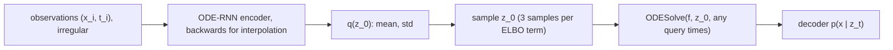

## Abstract

RNNs assume evenly spaced inputs, so irregular series are usually binned and imputed first, which discards timing information that may itself be a signal. This paper introduces the ODE-RNN, a recurrent cell whose hidden state is carried between observations by a neural ODE and is updated by an ordinary gated cell whenever an observation arrives. Used alone it is an autoregressive model; used as the recognition network of the Latent ODE from the original Neural ODE paper, it gives an encoder–decoder in which both halves are defined in continuous time. An inhomogeneous Poisson process tied to the latent trajectory optionally models *when* observations happen. On simulated physics, ICU records and a human-activity dataset, the ODE variants interpolate better than their RNN counterparts, most clearly when observations are sparse; classification gains are small, autoregressive models extrapolate poorly, and the Poisson term does not pay for itself.

**Keywords:** ODE-RNN, Latent ODE, irregularly-sampled time series, variational autoencoder, Poisson process, PhysioNet, MuJoCo

## 1 Introduction

Irregular sampling is the norm in medical and business data. The usual fix — cut the timeline into equal bins, then average or impute — destroys exactly the information about measurement timing that reveals the latent state: a test is ordered *because* the patient looks unwell. On PhysioNet, the standard hourly discretisation collapses 48 hours of measurements into 48 slots and trains on roughly one-twentieth of the recorded values.

Earlier continuous-time RNNs take a minimal step away from that: between observations the hidden state decays exponentially toward zero. This fixes the *form* of the dynamics and singles out the zero state as an attractor for no reason other than convenience, and Mozer et al. (2017) reported that such decay did not improve prediction over standard RNNs. Meanwhile [Neural ODE](/blog/neural-ode/) put learned dynamics in the decoder of a latent-variable model but encoded the observations with a plain RNN that ignores the gaps — so half of that model was still discrete-time. This paper fixes both problems with one component.

## 2 Background

Two RNN workarounds serve as reference points. One appends the gap $\Delta t = t_i - t_{i-1}$ to the input, $h_i = \mathrm{RNNCell}(h_{i-1}, \Delta t, x_i)$, which leaves the state between observations undefined and, per Mozer et al., invites overfitting. The other decays the state before each update,

$$
h_i = \mathrm{RNNCell}\big(h_{i-1}\, e^{-\tau \Delta t},\; x_i\big) ,
\tag{1}
$$

with a learned rate $\tau$; GRU-D combines that decay with imputation toward the empirical feature mean.

The generative half is inherited unchanged from [Neural ODE](/blog/neural-ode/): a hidden state $h(t)$ solves $dh/dt = f_\theta(h(t))$ from $h(t_0) = h_0$, is evaluated at any requested times by a numerical solver, and can be trained with adjoint gradients at constant memory. As there, the dynamics are time-invariant; the authors note that adding time dependence would be straightforward.

## 3 Method

> **Key idea.** Exponential decay is the solution of the linear ODE $dh/dt = -\tau h$. Replace that hand-picked ODE with a learned one, keep the discrete RNN update at observation times, and the model handles arbitrary gaps without assuming what happens inside them.

### 3.1 ODE-RNN

For each observation $(x_i, t_i)$,

$$
h'_i = \mathrm{ODESolve}\big(f_\theta,\, h_{i-1},\, (t_{i-1}, t_i)\big), \qquad h_i = \mathrm{RNNCell}(h'_i, x_i) ,
\tag{2}
$$

where $f_\theta$ is a feed-forward network and the cell is a GRU in every experiment. Neither $t$ nor $\Delta t$ is an explicit input: <mark>time enters only through how long the ODE is integrated, so the model cannot memorise a gap as a token, it can only respond to it dynamically.</mark> An output network on $h_i$ gives the one-step conditionals $p_\theta(x_i \mid x_{i-1},\dots,x_0)$, making the ODE-RNN a drop-in autoregressive model. The four state trajectories being compared — constant, decaying, pure ODE, ODE with jumps — are drawn in [Fig. 1 in the paper](https://arxiv.org/pdf/1907.03907#page=1).

| Model | State $h(t)$ between $t_{i-1}$ and $t_i$ |
|---|---|
| Standard RNN | $h_{t_{i-1}}$ (constant) |
| RNN-Decay, GRU-D | $h_{t_{i-1}} e^{-\tau \Delta t}$ |
| ODE-RNN | $\mathrm{ODESolve}(f_\theta, h_{i-1}, (t_{i-1}, t))$ |

### 3.2 Intuition: what the generalisation actually buys

The table is a nesting. Set $f_\theta(h) = -\tau h$ and (2) reproduces row two exactly, since the solution of that linear ODE over $\Delta t$ is $h_{i-1}e^{-\tau\Delta t}$; set $f_\theta \equiv 0$ and it reproduces row one, a plain GRU. So the ODE-RNN cannot do worse than either baseline in the sense of representable functions, and the interesting question is purely empirical: does the extra freedom help, or does it just add solver cost and optimisation difficulty?

The same nesting predicts *when* it helps. If sampling is regular, $\Delta t$ is a constant, the ODE solve becomes one fixed map applied identically at every step, and the ODE-RNN degenerates into a GRU with one extra deterministic layer — no advantage. The gains therefore have to come from irregular, sparse sampling, which is exactly where the experiments report them.

### 3.3 Latent ODE with an ODE-RNN encoder

The generative model is unchanged from Chen et al.: $z_0 \sim \mathcal N(0, I)$, the latent path $z_0,\dots,z_N = \mathrm{ODESolve}(f_\theta, z_0, (t_0,\dots,t_N))$, and conditionally independent emissions $x_i \sim p(x_i \mid z_i)$. What changes is the approximate posterior:

$$
q\big(z_0 \mid \{x_i, t_i\}_{i=0}^{N}\big) = \mathcal{N}(\mu_{z_0}, \sigma_{z_0}), \qquad \mu_{z_0}, \sigma_{z_0} = g\big(\text{ODE-RNN}_\phi(\{x_i, t_i\})\big)
\tag{3}
$$

with $g$ a small feed-forward net on the encoder's final hidden state. Training maximises

$$
\mathrm{ELBO}(\theta,\phi) = \mathbb{E}_{z_0 \sim q_\phi}\big[\log p_\theta(x_0,\dots,x_N)\big] - \mathrm{KL}\big(q_\phi(z_0 \mid \cdot)\,\|\,p(z_0)\big) .
\tag{4}
$$

<mark>The direction the encoder runs is task-dependent, and this is easy to get wrong.</mark> For interpolation the prior sits at the first observation: the ODE-RNN is run *backwards* from $t_N$ to $t_0$, gives $q(z_0 \mid x_0..x_N)$, and the decoder solves forward over $[t_0, t_N]$. For extrapolation the prior is moved to the midpoint: the encoder runs *forwards* over $[t_0, t_{N/2}]$, gives $q(z_{t_{N/2}} \mid x_0..x_{N/2})$, and the decoder solves forward over the second half. Nothing in the generative model changes — an ODE can be integrated in either direction — but the encoder's time ordering and the location of $t_0$ both flip.



The authors argue the separation is the main benefit: dynamics, observation model and recognition network can each be inspected alone, <mark>the posterior over $z_0$ is an explicit uncertainty estimate that autoregressive models lack</mark>, and unusual queries — predicting backwards, conditioning on a subset — are ordinary rather than special-cased.

### 3.4 Poisson process on observation times

The measurement rate is made a function of the latent path, with log-likelihood

$$
\log p(t_1,\dots,t_N \mid t_{\text{start}}, t_{\text{end}}) = \sum_{i=1}^{N} \log \lambda(t_i) - \int_{t_{\text{start}}}^{t_{\text{end}}} \lambda(t)\, dt .
\tag{5}
$$

The implementation augments the generative ODE with separate latent dimensions $z_\lambda$ and with the running integral, whose derivative is $\lambda$ itself:

$$
\frac{d}{dt}\begin{bmatrix} z \\ z_\lambda \\ \int_0^t \lambda(\tau)d\tau \end{bmatrix}
= \begin{bmatrix} f(z) \\ f_{z_\lambda}(z_\lambda) \\ \lambda \end{bmatrix}, \qquad \lambda = g_\lambda(z_\lambda),
\tag{6}
$$

so the trajectory, the intensity and its integral come from a single solver call and the model is trained on the joint likelihood of values *and* times. On PhysioNet that means 20 dimensions for $z$, 20 for $z_\lambda$ and 37 for the integral (one per feature) — 77 in total, nearly four times the plain model's state.

A limiting case explains the negative result reported later. If $z_\lambda$ is constant so that $\lambda(t) = \lambda_0$, then (5) is $N\log\lambda_0 - \lambda_0 T$, maximised at $\lambda_0 = N/T$: the term reduces to a constant and teaches the model nothing. The Poisson head can only earn its extra 57 solver dimensions where the arrival rate genuinely tracks the latent state.

### 3.5 Algorithm

```
# ODE-RNN encoder (h_0 = 0); run over observations in the task's time order
for i in 1..N:
    h'_i = ODESolve(f_phi, h_{i-1}, (t_{i-1}, t_i))
    h_i  = GRU(h'_i, x_i)          # masked: skip update if no feature observed at t_i

# Latent ODE training step
mu, sigma = g(h_N)
for s in 1..3:                      # 3 posterior samples per ELBO estimate
    z0_s   = mu + sigma * eps_s
    z_{0..N} = ODESolve(f_theta, z0_s, (t_0..t_N))    # union of batch timestamps
    recon += gaussian_logpdf(x, OutputNN(z), fixed_var)
loss = -(recon/3) + kl_coef * KL(N(mu,sigma) || N(0,I))   # kl_coef annealed
```

### 3.6 Batching and cost

Series in a minibatch carry different timestamps, so the combined ODE is solved on the *union* of all times, with a mask marking which features exist at each point; a series with no observation at a union time simply does not update its state there. The generative half needs no masking. An adaptive solver is nearly indifferent to the number of output points — cost is set by the length of $[t_0, t_N]$ and the complexity of the dynamics — so asymptotic complexity matches an RNN. The catch is that <mark>compute does not fall when the data are sparse, because the ODE is integrated through the empty stretches too, which is the one respect in which decay-RNNs are cheaper.</mark> Measured: ODE-RNN about 60% slower than a GRU, Latent ODE roughly twice the ODE-RNN.

## 4 Implementation notes

| Setting | As reported |
|---|---|
| Solver | `torchdiffeq` dopri5 (fifth order, adaptive), rtol 1e-3, atol 1e-4 |
| Adjoint | *not* used by default — described as available "to reduce the memory use, at a cost of a longer computation time" |
| ODE activation | Tanh; ReLU explicitly not recommended, since large gradients make the tolerance hard to meet |
| Optimiser | Adamax, LR 0.01, LR decay 0.999, KL annealing coefficient 0.99 |
| ELBO estimate | 3 samples from $\mathcal N(\mu_{z_0}, \sigma_{z_0})$ |
| Reconstruction loss | Gaussian with *fixed* variance: 0.001 (MuJoCo), 0.01 (others) |
| Preprocessing | timeline rescaled to $[0,1]$ everywhere; features rescaled to $[0,1]$ on PhysioNet only |
| Toy | 1,000 sinusoids on $[0,5]$, amplitude 1, frequency $\sim U[0.5, 1]$, start $\sim \mathcal N(1, 0.1)$; 10 latent / 20 recognition dims, $f$ one layer of 100 units, batch 50 |
| MuJoCo | 15 latent / 30 recognition dims, $f$ 3 layers × 500 units, batch 50; 15-dim hidden state in autoregressive models |
| PhysioNet (interp/extrap) | 20 latent / 40 recognition dims, $f$ 3 layers × 50 units, batch 50; 20-dim autoregressive hidden state |
| PhysioNet (classification) | 10-dim autoregressive hidden state; 20/40 for encoder–decoder, $f$ 3 layers × 30 units; 2-layer classifier, 300 units, ReLU |
| Human Activity | 15 latent / 100 recognition dims, generative $f$ 2 layers × 500, recognition $f$ 4 layers × 500, batch 100; linear classifier per time point |
| Hardware | one Nvidia P100, two Intel Xeon Silver 4110 CPUs; PyTorch 1.0 |
| Epochs / early stopping | not stated |

Three things matter for reproduction and are not obvious from the main text. Hyperparameters were tuned for the RNN baselines first and then reused unchanged for the ODE models — defensible as a fairness measure, but it means the reported ODE numbers are not tuned numbers. PhysioNet classification is *not* trained on cross-entropy alone: reconstruction and cross-entropy are optimised jointly with a multiplier of 100 on the CE term, computed on the 4,000 labelled patients out of 8,000, precisely because CE alone overfits. And the fixed observation variance means the "likelihood" is a scaled MSE, so nothing in the training objective scores predictive uncertainty.

## 5 Experiments

**Setup.** 80/20 train/test split everywhere. Autoregressive baselines: RNN-$\Delta t$, RNN-Decay, RNN-Impute, GRU-D. Encoder–decoder baselines: RNN-VAE and the Latent ODE with an RNN encoder (i.e. the [Neural ODE](/blog/neural-ode/) model). For extrapolation, autoregressive models re-feed their own predictions and are trained with scheduled sampling at probability 0.5; encoder–decoder models encode one half of the timeline and reconstruct the other.

**MuJoCo Hopper.** 10,000 simulated sequences, 14-dimensional; 100 regularly spaced points for interpolation and 200 for extrapolation (100 to condition on, 100 to predict). A percentage of points is kept to mimic sparse sampling. Test MSE ($\times 10^{-2}$):

| Model | Interp 10% | 20% | 30% | 50% | Extrap 10% | 20% | 30% | 50% |
|---|---|---|---|---|---|---|---|---|
| RNN $\Delta t$ | 2.454 | 1.714 | 1.250 | 0.785 | 7.259 | 6.792 | 6.594 | 30.571 |
| RNN GRU-D | 1.968 | 1.421 | 1.134 | 0.748 | 38.130 | 20.041 | 13.049 | 5.833 |
| ODE-RNN | 1.647 | 1.209 | 0.986 | 0.665 | 13.508 | 31.950 | 15.465 | 26.463 |
| RNN-VAE | 6.514 | 6.408 | 6.305 | 6.100 | 2.378 | 2.135 | 2.021 | 1.782 |
| Latent ODE (RNN enc.) | 2.477 | 0.578 | 2.768 | 0.447 | 1.663 | 1.653 | 1.485 | 1.377 |
| **Latent ODE (ODE enc.)** | **0.360** | **0.295** | **0.300** | **0.285** | **1.441** | **1.400** | **1.175** | **1.258** |

**PhysioNet 2012.** 8,000 ICU stays (challenge train and test sets combined), first 48 hours, 37 features after dropping four time-invariant ones, timestamps rounded to the minute — 2,880 possible slots instead of the usual 48 hourly bins, which reduces the number of measurements only two-fold, where hourly binning keeps one-twentieth of them. MSE $\times 10^{-3}$, mean ± std over seeds, significance assessed by a one-sided $t$-test:

| Model | Interp | Extrap | Mortality AUC |
|---|---|---|---|
| RNN $\Delta t$ | 3.520 ± 0.276 | – | 0.787 ± 0.014 |
| RNN-Impute | 3.243 ± 0.275 | – | 0.764 ± 0.016 |
| RNN-Decay | 3.215 ± 0.276 | – | 0.807 ± 0.003 |
| RNN GRU-D | 3.384 ± 0.274 | – | 0.818 ± 0.008 |
| RNN-VAE | 5.930 ± 0.249 | 3.055 ± 0.145 | 0.515 ± 0.040 |
| Latent ODE (RNN enc.) | 3.907 ± 0.252 | 3.162 ± 0.052 | 0.781 ± 0.018 |
| ODE-RNN | 2.361 ± 0.086 | – | **0.833 ± 0.009** |
| **Latent ODE (ODE enc.)** | **2.118 ± 0.271** | 2.231 ± 0.029 | 0.829 ± 0.004 |
| Latent ODE + Poisson | 2.789 ± 0.771 | **2.208 ± 0.050** | 0.826 ± 0.007 |

**Toy sinusoids (supplementary).** The same comparison on easy data, MSE (bold: lowest in each column):

| Model | Interp 10% | 20% | 30% | 50% | Extrap 10% | 20% | 30% | 50% |
|---|---|---|---|---|---|---|---|---|
| RNN $\Delta t$ | 0.06081 | 0.04680 | 0.05822 | 0.04116 | 0.06172 | 0.06115 | 0.06891 | 0.05617 |
| RNN-exp | 1.65891 | 0.05344 | 0.04974 | 0.03275 | 0.06172 | 0.06115 | 0.06891 | 0.05617 |
| RNN GRU-D | 2.35628 | 0.05997 | 0.04832 | 0.04116 | 0.06095 | 0.07212 | 0.06541 | 0.05049 |
| ODE-RNN | **0.05150** | 0.03211 | **0.02643** | **0.01666** | 0.06592 | 0.04774 | 0.10940 | 0.08000 |
| RNN-VAE | 0.07352 | 0.07346 | 0.07323 | 0.07304 | 0.20107 | **0.03710** | 0.07281 | 0.02871 |
| Latent ODE (RNN enc.) | 0.06860 | 0.06764 | 0.02754 | 0.05721 | **0.04920** | 0.04807 | **0.01788** | 0.02703 |
| Latent ODE (ODE enc.) | 0.07133 | **0.03144** | 0.05354 | 0.01717 | 0.05313 | 0.04427 | 0.03572 | **0.01388** |

**Human Activity.** 6,554 sequences of 211 union time points (overlapping 50-point windows from 25 original recordings of five people, four tags, 12 features, 11 activity classes merged into 7), per-time-point accuracy: Latent ODE (ODE enc.) 0.846 ± 0.013, Latent ODE (RNN enc.) 0.835 ± 0.010, ODE-RNN 0.829 ± 0.016, GRU-D 0.806 ± 0.007, RNN-VAE 0.343 ± 0.040.

**Claim by claim.**

- *ODE-RNN beats RNN baselines at interpolation.* <mark>The strongest claim in the paper: it wins every MuJoCo interpolation column, every toy column, and PhysioNet by 2.361 ± 0.086 against a 3.215–3.520 band — a gap far larger than the reported spread.</mark>
- *The advantage grows as data thin out.* Supported in ratio terms on MuJoCo (ODE-RNN / GRU-D is 0.84 at 10% observed and 0.89 at 50%) but the effect is modest, and the MuJoCo table carries no standard deviations at all.
- *An ODE encoder beats an RNN encoder.* 0.360 vs 2.477 at 10% on MuJoCo, 2.118 ± 0.271 vs 3.907 ± 0.252 on PhysioNet. The direct comparison is the right one — it is the same model with one component swapped. But the RNN-encoder row reads 2.477, 0.578, 2.768, 0.447 across densities, which is optimisation instability, not a trend, so "more stable to train" may be as much of the story as "more accurate".
- *Latent-variable models beat autoregressive ones at extrapolation.* True in every column, and partly true by construction: the autoregressive models were trained for one-step-ahead prediction and extrapolate by re-feeding predictions, so this compares training objectives as much as architectures. Note also that plain RNNs extrapolate *better* than ODE-RNNs here.
- *ODE models win at classification.* Only half-supported. On PhysioNet, ODE-RNN 0.833 ± 0.009 against GRU-D 0.818 ± 0.008 — <mark>a 1.5-point AUC gap that the authors themselves describe as "similar", with their own explanation that between-observation dynamics barely matter for one label per sequence.</mark> Human Activity, where labels are per time point, is the honest win: 0.846 against 0.806.
- *Poisson likelihood on observation times.* <mark>Not supported by any of the paper's own numbers.</mark> Interpolation is worse (2.789 ± 0.771 against 2.118 ± 0.271, with nearly three times the standard deviation), extrapolation is unchanged within noise, AUC is unchanged, and the supplementary posterior visualisation shows the true posterior becomes *wider* with the Poisson term. It fits the observed rates (Fig. 3) and pays for nothing else.
- *Claim with weak evidence.* The advantage does not survive on easy data: on the toy set at 10% observed, the full Latent ODE scores 0.07133 against 0.06081 for a plain RNN-$\Delta t$. Sparsity alone is not the trigger — the dynamics also have to be worth learning.
- *Interpretability.* Qualitative only: the norm of $f_\theta(z)$ spikes when the hopper hits the ground, posterior entropy falls monotonically as points are added, and a UMAP of $z_0$ organises by initial height, vertical velocity and hip position. Suggestive figures, no metric.

## 6 Limitations

**Stated by the authors.** Compute does not shrink with sparsity, unlike decay-RNNs, and the ODE-RNN is ~60% slower than a GRU with the Latent ODE about twice that again. The Poisson term did not improve classification. Autoregressive models are hard to interpret because dynamics and conditioning are entangled in one update. The related-work section notes the model assumes observations do not alter the system state — appropriate for taking a temperature, wrong for an intervention.

**My reading.** The MuJoCo table has no standard deviations, which is where the erratic rows live, so the headline interpolation comparison rests on the one table without error bars. MuJoCo trajectories are deterministic given the initial state, which the paper states outright matches the model's assumption — a benchmark chosen to fit. PhysioNet AUCs come from joint training with a reconstruction term weighted 100:1, so they are not a clean test of representation quality. Uncertainty is displayed (entropy curves, sample fans) but never scored by calibration or held-out likelihood, and with a fixed observation variance it could not be. Nothing is compared against the Gaussian-process or interpolation-network methods listed in related work. Finally, the generative path is a deterministic function of $z_0$: all stochasticity sits in the initial state and the emission noise, so the model has no mechanism for shocks entering the system over time, and no experiment probes data where that matters.

## 7 Extensions

**What was built on this.** [Neural JSDE](/blog/neural-jump-sde/), concurrent work posted a few weeks earlier rather than a descendant, is the closest relative: it keeps the flow-between-events structure but makes the jumps themselves part of a stochastic model rather than a GRU update, which is the natural next step from the Poisson head here. [Stochastic Adjoint](/blog/scalable-sde-gradients/) supplies the latent SDE that replaces the deterministic path, and [SDE-GAN](/blog/neural-sde-gan/) trains such continuous-time generators without a likelihood. For the same irregular-data problem from the diffusion side, [CSDI](/blog/csdi/) conditions a score model on the observed entries and imputes the rest, and [TSDiff](/blog/tsdiff/) and [TimeGrad](/blog/timegrad/) handle forecasting; those trade the continuous-time state for a learned distribution over whole windows. GRU-ODE-Bayes (De Brouwer et al., NeurIPS 2019) is concurrent work on the same problem, and Neural CDEs (Kidger et al., NeurIPS 2020), driven by the data path itself rather than only by its initial condition, remove the "one initial state determines everything" restriction.

**Open problems.** How to make an ODE encoder cheap on sparse data, where it currently integrates through emptiness. How to score the uncertainty the latent-variable framing advertises. How to model observations that *change* the state instead of only revealing it. And how to let noise enter a latent path continuously without giving up the tractable encoder.

**Research directions.** *These are ideas, not results — none has been run.*

1. **Make the Poisson head earn its keep.** Hypothesis: the Poisson term hurt here because PhysioNet's arrival rate is only weakly informative once values are conditioned on; on data where timing is the primary signal it should help. Data: an event log where inter-arrival structure dominates — limit-order submissions, or clinical events with strongly state-dependent ordering. Baseline: the same Latent ODE without the Poisson term, and a Hawkes-process model on the times alone. Metric: joint held-out log-likelihood of values and times, reported separately for the two components. Failure mode: the intensity fits the marginal rate and nothing more, reproducing the flat-$\lambda$ limiting case of §3.4; diagnose by testing whether $\lambda$ has any mutual information with $z$ beyond a constant.
2. **Irregular market data with a calibrated uncertainty test.** Hypothesis: an ODE-RNN encoder over trade-and-quote events, decoded to a *distribution* over future returns, beats a binned baseline at interval coverage rather than at MSE. Data: per-event intraday series with timestamps kept. Baseline: the same architecture with $\Delta t$ appended to a GRU, plus a 5-minute-binned HAR model. Metric: continuous ranked probability score and empirical coverage of 50%/90% intervals — not the fixed-variance MSE used in this paper. Failure mode: the deterministic latent path forces all randomness into the emission noise, so intervals come out roughly constant in width and coverage fails precisely during volatility clusters; that is the diagnosis that sends you to latent SDEs.

## 8 Takeaways

- An ODE-RNN is a GRU whose state flows under a learned ODE between inputs; standard RNNs ($f \equiv 0$) and exponential-decay RNNs ($f = -\tau h$) are exact special cases, which also explains why gains require irregular sampling.
- Putting that cell in the *encoder* makes the Latent ODE continuous-time end to end, and this swap, not the decoder, produces the interpolation gains — clearest at 10–20% observed points.
- Encoder direction and the placement of $t_0$ change with the task: backwards to the first observation for interpolation, forwards to the midpoint for extrapolation.
- Latent-variable models beat autoregressive ones for sparse data and extrapolation; for whole-sequence classification the choice hardly matters, and the honest classification win is per-time-point labelling.
- A Poisson intensity tied to the latent state is elegant and, here, free of measured benefit — a useful reminder that a term added inside the same solver call still costs dimensions and variance.
- For financial series, irregular timestamps and informative arrival rates fit this framework naturally; the deterministic latent path does not, since market states are continuously shocked. That gap points to latent SDEs for the dynamics and to diffusion-based imputers such as [CSDI](/blog/csdi/) for the observation model, with the ODE-RNN still a reasonable encoder for uneven inputs.

## References

1. Y. Rubanova, R. T. Q. Chen, D. Duvenaud. *Latent ODEs for Irregularly-Sampled Time Series.* NeurIPS 2019. arXiv:1907.03907.
2. R. T. Q. Chen, Y. Rubanova, J. Bettencourt, D. Duvenaud. *Neural Ordinary Differential Equations.* NeurIPS 2018. arXiv:1806.07366.
3. Z. Che, S. Purushotham, K. Cho, D. Sontag, Y. Liu. *Recurrent Neural Networks for Multivariate Time Series with Missing Values* (GRU-D). Scientific Reports, 2018.
4. H. Mei, J. Eisner. *The Neural Hawkes Process: A Neurally Self-Modulating Multivariate Point Process.* NeurIPS 2017.
5. I. Silva, G. Moody, D. J. Scott, L. A. Celi, R. G. Mark. *Predicting In-Hospital Mortality of ICU Patients: The PhysioNet/Computing in Cardiology Challenge 2012.*
6. Y. Tashiro et al. *CSDI: Conditional Score-based Diffusion Models for Probabilistic Time Series Imputation.* NeurIPS 2021. arXiv:2107.03502.
