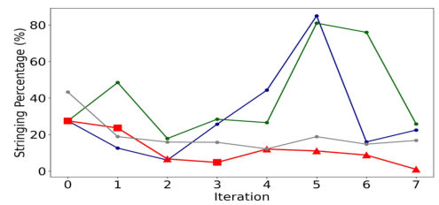

## Abstract

Bayesian optimisation (BO) with a Gaussian-process (GP) surrogate is sample-efficient once it has data, but it starts blind. An LLM prompted with the problem description can name sensible first designs, yet it has no calibrated uncertainty and, in the authors' runs, stops improving as observations accumulate. LLINBO keeps the GP as the decision-maker and treats each LLM proposal as advice, weighed by one of three rules: a random switch drifting toward the GP (*Transient*), an acceptance test on the UCB gap (*Justify*), or a GP conditioned on the LLM's point beating the current best posterior mean (*Constrained*). Each has a GP-UCB-order regret bound containing nothing about the LLM — a guarantee that bad advice cannot break convergence, not that good advice helps. The help is shown empirically on synthetic functions, hyperparameter tuning and a 3D-printing study.

**Keywords:** Bayesian optimisation, GP-UCB, LLM-assisted optimisation, cumulative regret, constrained Gaussian process, rejection sampling, warm-starting, hybrid surrogates

## 1 Introduction

The setting: maximise an expensive black-box $f$ over a box $\mathcal X$ with $T$ noisy evaluations. GP-based BO is the default because its posterior contracts at a known rate for smooth $f$, which GP-UCB's regret theory rests on. Its weakness is the cold start — the first designs are spent learning what a domain expert already knows.

**LLM-assisted BO** fills that gap from the other side. LLAMBO (Liu et al., 2024) prompts the LLM with the problem context and the design–response history to generate initial points, propose candidates and even act as the surrogate. The paper's diagnosis is specific. First, there is no explicit surrogate and no calibrated uncertainty, so the exploration–exploitation trade-off is neither visible nor controllable. Second, usefulness is front-loaded: <mark>the LLM's advantage over a statistical surrogate decays systematically as data arrive</mark>, and LLINBO is built around modelling that decay rather than ignoring it. Third, LLAMBO needs many prompts per iteration.

**External-information BO** already existed in two forms. Federated BO lets clients share designs or random-feature summaries; human–AI collaborative BO (πBO, COBOL, CoExBO) injects a prior over the optimum's location, a belief function or preference pairs. Neither matches the LLM case: collaborative BO asks for richer input than one point per round, and neither clients nor humans show the LLM's strong-early, weak-later profile. What the authors take from federated BO is mechanism — the Thompson-sampling scheme of Dai et al. (2020), where a client sometimes picks its design from another client's shared random-feature model instead of its own, becomes *Transient*, and the constraint-sharing GP of Chen et al. (2025) becomes *Constrained*.

The contribution is therefore narrow and well defined: given one LLM-proposed point per round, how should a GP-based optimiser use it so that the worst case is still GP-UCB?


*Source: Chang, Azvar, Okwudire & Al Kontar, arXiv:2505.14756, Fig. 1, CC BY 4.0.*

## 2 Background

Observations are $y_i=f(x_i)+\epsilon_i$. With kernel $k$, Gram matrix $K$, noise variance $\lambda^2$ and $k_{t-1}(x)$ the vector of covariances between $x$ and the $t-1$ observed inputs, the GP posterior and the UCB acquisition are

$$
\begin{aligned}
\mu_{t-1}(x) &= k_{t-1}(x)^\top (K+\lambda^2 I)^{-1}\mathbf y,\\
\sigma^2_{t-1}(x) &= k(x,x)-k_{t-1}(x)^\top (K+\lambda^2 I)^{-1}k_{t-1}(x),\\
\alpha_{\text{UCB}}(x,F_{t-1}) &= \mu_{t-1}(x)+\beta_t\,\sigma_{t-1}(x).
\end{aligned}
\tag{1}
$$

The variance shrinks near observed inputs; $\beta_t$ sets how many standard deviations of optimism UCB adds; $F_{t-1}$ denotes the whole posterior.

Performance is cumulative regret $R_T=\sum_t r_t$, $r_t=f(x^\star)-f(x_t)$, under two standard assumptions: $f$ lies in the RKHS of $k$ with norm at most $B$, $k\le 1$, and noise is conditionally $R$-sub-Gaussian (Assumption 1); and $\beta_t=B+R\sqrt{2(\gamma_{t-1}+1+\log(1/\delta))}$ with $\gamma_t$ the maximum information gain (Assumption 2). GP-UCB analysis then supplies two facts reused throughout: with high probability $|\mu_{t-1}(x)-f(x)|\le\beta_t\sigma_{t-1}(x)$ for all $x$, and $\sum_t\sigma_{t-1}(x_t)=O(\sqrt{T\gamma_T})$ over queried points. Together: $R_T=O(\beta_T\sqrt{T\gamma_T})$, the yardstick for all three LLINBO bounds. GP surrogates and acquisition functions in general are covered in the [BayesOpt tutorial note](/blog/bo-tutorial-frazier/).

## 3 Method

> **Key idea.** The GP is the referee, the LLM a player whose advice can be overruled. Each rule spends LLM advice only where the GP's own regret argument can absorb it — through a vanishing probability, a vanishing acceptance margin, or a constraint that the GP can discard when its posterior disagrees — so the regret bound never needs to know whether the LLM is any good.

### 3.1 The loop

Each round: fit the GP, compute the UCB maximiser $x_{\text{GP},t}$, ask the LLM for $x_{\text{LLM},t}$, score it with the GP, then keep, modify or discard it. Without the LLM this is plain BO; without the GP, LLM-assisted BO. Only the decision step differs between variants.

### 3.2 Transient: a coin whose bias moves to the GP

$$
z_t\sim\text{Bernoulli}(p_t),\qquad x_t=z_t\,x_{\text{GP},t}+(1-z_t)\,x_{\text{LLM},t},\qquad 1-p_t\in O(1/t).
\tag{2}
$$

The condition makes the expected number of LLM rounds grow only logarithmically.

The derivation (Appendix B.1) has three steps. (i) *Exact decomposition:* conditioning on the history, expected regret splits into $p_t$ times the GP round's regret plus $(1-p_t)$ times the LLM round's regret. (ii) *Bounds on each part:* the GP round obeys the GP-UCB per-step bound $2\beta_t\sigma_{t-1}(x_{\text{GP},t})$; the LLM round is bounded by its worst case, using $|f|\le B$ — nothing about LLM quality enters. (iii) *From expectation to high probability:* the centred regret is a super-martingale with bounded increments, so Azuma–Hoeffding converts the expected bound into one holding with probability $1-\delta$. Summing gives

$$
R_T\;\le\;\underbrace{B\,O(\sqrt T)}_{\text{martingale deviation}}\;+\;\underbrace{\beta_T\,O(\sqrt{T\gamma_T})}_{\text{GP-UCB part}},
\tag{3}
$$

where the LLM's worst case contributes only $B\cdot O(\log T)$ and is absorbed. My reading: the proof applies the "sum of $\sigma$ at queried points" lemma also on rounds where $x_{\text{GP},t}$ was *not* queried; the excess is at most $\beta_T$ times the number of LLM rounds, so the rate likely survives, but the argument is missing.

### 3.3 Justify: accept only near-optimal advice

$$
\text{reject } x_{\text{LLM},t}\ \text{ if }\ \alpha_{\text{UCB}}(x_{\text{LLM},t},F_{t-1})\;\le\;\max_x\alpha_{\text{UCB}}(x,F_{t-1})-\psi_t,\qquad \psi_t\in O(1/\sqrt t).
\tag{4}
$$

Either way, the queried point is $\psi_t$-suboptimal for UCB — that single observation is the whole proof. Chaining the confidence bound twice and the near-optimality once:

$$
\begin{aligned}
r_t=f(x^\star)-f(x_t)
&\le \big[\mu_{t-1}(x^\star)+\beta_t\sigma_{t-1}(x^\star)\big]-f(x_t)\\
&\le \alpha_{\text{UCB}}(x_{\text{GP},t})-\big[\mu_{t-1}(x_t)-\beta_t\sigma_{t-1}(x_t)\big]\\
&\le \big[\alpha_{\text{UCB}}(x_t)+\psi_t\big]-\mu_{t-1}(x_t)+\beta_t\sigma_{t-1}(x_t)
\;=\;\psi_t+2\beta_t\sigma_{t-1}(x_t).
\end{aligned}
\tag{5}
$$

Lines one and two use the confidence band (upper at $x^\star$, lower at $x_t$) and that $x_{\text{GP},t}$ maximises UCB; line three uses the acceptance rule. Each step is exact given the band. Summing, <mark>Justify costs exactly the accumulated margin $\sum_t\psi_t$ over GP-UCB, no more</mark>. The margin is a trust budget: generous early, shrinking toward "accept only the GP's choice".

### 3.4 Constrained: condition the GP on the advice being good

The LLM point is not queried as such; the client instead assumes it beats the current best posterior mean $\kappa_{t-1}=\max_x\mu_{t-1}(x)$ and updates its belief:

$$
F^+_{t-1}\;=\;\mathrm{GP}(D_{t-1})\;\big|\;\{f(x_{\text{LLM},t})>\kappa_{t-1}\}.
\tag{6}
$$

It has no closed form, so it is approximated by rejection sampling: draw $S_t$ values $\tilde f_s$ of $f(x_{\text{LLM},t})$ from the current posterior, keep those above $\kappa_{t-1}$ (index set $I_t$), and for each survivor refit the GP on $D_{t-1}$ plus the imagined pair $(x_{\text{LLM},t},\tilde f_s)$. The survivors give a mixture of GPs; its mean and spread form a Monte-Carlo UCB via the law of total variance:

$$
\begin{aligned}
\alpha_{\text{CGP-UCB}}(x)&=\bar\mu^+_{t-1}(x)+\tilde\beta_t\sqrt{\sigma^+_{t-1}(x)^2+s^2_{t-1}(x)},\\
\bar\mu^+_{t-1}(x)&=\tfrac{1}{|I_t|}\textstyle\sum_{s\in I_t}\mu^+_{t-1,s}(x),\qquad
s^2_{t-1}(x)=\tfrac{1}{|I_t|-1}\textstyle\sum_{s\in I_t}\big(\mu^+_{t-1,s}(x)-\bar\mu^+_{t-1}(x)\big)^2 .
\end{aligned}
\tag{7}
$$

$\sigma^+$ needs no index because GP variance depends only on input locations; $s^2$ is the spread from not knowing the LLM point's value. (The main text prints $\bar\mu^+$ as a sum; the appendix treats it as a mean.) If nothing survives, the round is plain GP-UCB.

Theory (Theorems 3–4). Because the GP now contains one imagined observation, its confidence band must be widened:

$$
\big|\mu^+_{t-1,s}(x)-f(x)\big|\le\tilde\beta_t\,\sigma^+_{t-1}(x),\qquad
\tilde\beta_t=2B+2R\sqrt{2\big(\gamma_t+1+\ln\tfrac{4T}{\delta}\big)}+\sqrt{2\ln\tfrac{4S_tT}{\delta}} .
\tag{8}
$$

The proof splits the error into the usual data part and the imagined value's part, bounded by how far a Gaussian draw can stray from its mean (Chernoff over all $S_tT$ draws, hence $\ln S_t$). With $s^2\lesssim\sigma^{+2}\ln(S_tT)$, the GP-UCB template gives $R_T=O\big(\sqrt{T\gamma_T(\gamma_T+\ln T)}\big)$. <mark>None of the three bounds contains a term for the quality of the LLM's suggestions</mark> — the authors present this, citing Xu et al. (2024), as a no-harm property.

| variant | trust knob | condition in theorem | regret bound |
|---|---|---|---|
| Transient | $p_t$ | $1-p_t\in O(1/t)$ | $B\,O(\sqrt T)+\beta_T O(\sqrt{T\gamma_T})$ |
| Justify | $\psi_t$ | $\psi_t\in O(1/\sqrt t)$ | $O(\sqrt T)+\beta_T O(\sqrt{T\gamma_T})$ |
| Constrained | $S_t$ | "$S_t\in O(1/t)$" as printed | $O\big(\sqrt{T\gamma_T(\gamma_T+\ln T)}\big)$ |


*Source: Chang, Azvar, Okwudire & Al Kontar, arXiv:2505.14756, Fig. 2 (panels a–d; sub-captions removed), CC BY 4.0.*

### 3.5 Intuition: how strict is each filter?

Constrained is said to drop advice that "strongly contradicts" the posterior. A one-point Gaussian calculation (mine, not the paper's) shows how strong that must be. At $x_{\text{LLM},t}$ the posterior is $\mathcal N(\mu,\sigma^2)$; write $a=(\kappa-\mu)/\sigma$ for how many standard deviations the LLM point's mean sits below the current best. Each draw survives with probability $q=1-\Phi(a)$; the update is skipped only if all $S$ fail, probability $\Phi(a)^S$; and if any survive, the imagined values average $\mathbb E[f\mid f>\kappa]=\mu+\sigma\,\varphi(a)/q$, which is *above* $\kappa$ whatever $a$ was.

| $a$ (s.d. below $\kappa$) | survival $q$ | mean of survivors, $\mu+\ldots$ | P(no update), $S=10^4$ | $S=100$ | $S=4$ |
|---|---|---|---|---|---|
| 0 | 0.5 | $+0.80\sigma$ | ≈0 | ≈0 | 0.06 |
| 2 | 0.023 | $+2.37\sigma$ | ≈0 | 0.10 | 0.91 |
| 3 | 0.0013 | $+3.28\sigma$ | $1.4\times10^{-6}$ | 0.87 | 0.995 |
| 4 | $3\times10^{-5}$ | $+4.23\sigma$ | 0.73 | 0.997 | ≈1 |

Two consequences. First, <mark>the rejection cut-off is set by the sample size $S_t$</mark>: advice is discarded only beyond roughly $\Phi^{-1}(1-1/S_t)$ standard deviations — about 3.7 at $S=10^4$, 2.3 at $S=100$, 0.7 at $S=4$. Under the paper's $S_t=10^4/t^2$ the test tightens over time, matching the "trust the LLM less later" philosophy, although the paper motivates the decay by calibration (main text) and compute (Appendix D), never by this threshold. Second, the update is all-or-nothing: once one draw survives, the GP is pulled toward believing the LLM point beats $\kappa$, even if that event had probability $10^{-4}$; the number of survivors changes only Monte-Carlo noise.

The same arithmetic for the experimental Transient schedule $p_t=\min(t^2/T,1)$ (my calculation): the LLM can be chosen only while $t<\sqrt T$, i.e. in rounds 1–4 when $T=20$ (expected 2.5 LLM rounds) and rounds 1–7 when $T=60$ (expected 4.7). Transient, as run, is "a few LLM rounds after an LLM warm start, then plain GP-UCB". For Justify, the experimental margin $\psi_t=\sigma_0(x_{\text{LLM},1})/t$ starts at the posterior standard deviation (given the warm-start data) at the first LLM point and shrinks harmonically.

### 3.6 Algorithm

```text
input: budget T, LLM agent A, kernel k, schedules p_t | psi_t | S_t
D <- warm start (LLM-proposed for LLINBO, random for plain BO)
for t = 1..T:
    fit GP on D -> (mu, sigma); x_gp <- argmax_x mu + beta_t * sigma
    x_llm <- A(problem context, D)                       # one point per round
    if TRANSIENT:
        x <- x_gp with prob p_t, else x_llm
    if JUSTIFY:
        x <- x_llm if UCB(x_llm) > UCB(x_gp) - psi_t else x_gp
    if CONSTRAINED:
        kappa <- max_x mu(x)
        draws <- S_t samples of f(x_llm) ~ N(mu(x_llm), sigma(x_llm)^2)
        keep  <- [v for v in draws if v > kappa]
        if keep is empty: x <- x_gp
        else:
            for v in keep: fit GP_s on D + {(x_llm, v)} -> mu_s ; sigma_plus shared
            mbar(x) <- mean_s mu_s(x);  s2(x) <- sample variance_s mu_s(x)
            x <- argmax_x mbar(x) + beta_tilde_t * sqrt(sigma_plus(x)^2 + s2(x))
    y <- f(x) + noise;  D <- D + {(x, y)}
return best observed x in D
```

## 4 Implementation notes

| item | as reported |
|---|---|
| LLM | GPT-3.5-turbo, temperature 1.0 (default) |
| surrogate | BoTorch `SingleTaskGP`, learned constant mean, Matérn-5/2 with ARD |
| acquisition | UCB, $\beta_t=2\log\big(tD\pi^2/(0.1\cdot 6)\big)$ as printed (Srinivas-style, δ = 0.1) |
| warm start | $D$ points; LLM-prompted for LLM-based methods, random for BO |
| schedules | $p_t=\min(t^2/T,1)$; $\psi_t=\sigma_0(x_{\text{LLM},1})/t$; $S_t=10^4/t^2$ |
| budget | $T=10D$ (synthetic), $T=5D$ (tuning) |
| replications | 10 |
| domain | rescaled to $[0,1]^D$; responses negated for maximisation |
| LLAMBO baseline | 10 prompts → 10 candidates per round, Data Card permuted, target-score $\alpha=0.1$, EI acquisition |
| LLAMBO-light | one prompt per round returning the next point; also the LLM inside all three LLINBO variants |
| 3D printing | Transient with $p_t=1-1/t$; five slicer parameters; several hours per print |
| compute / API cost | not stated |

Things that are easy to get wrong when reproducing:

- **Experimental $\beta_t$ is not the theoretical one.** Assumption 2 is replaced by a Srinivas-style heuristic; the experimental $\tilde\beta_t$ for Constrained is not stated.
- **Schedules differ between sections.** For $1-p_t$: $O(1/t)$ in Theorem 1, $O(1/t^2)$ in Appendix D, zero after $t=\sqrt T$ in the experiments, $1/t$ in the printing study. For $\psi_t$: $O(1/\sqrt t)$ in Theorem 2, $O(1/t)$ in Appendix D, whose $\psi_0$ is a posterior *variance* while the experiments use $\sigma_0$. All satisfy the theorems; they are still different algorithms.
- **"$S_t\in O(1/t)$" for a sample count** reads like a typo; $S_t$ enters the bound only inside a logarithm, and I could not trace the $1/t$ factor in the last step of the Theorem 4 proof.
- **$|I_t|=1$.** The sample variance in (7) divides by $|I_t|-1$; at $t=60$ only about 3 draws are taken, so a single survivor is routine. Handling not stated.
- **Not stated:** optimiser for the inner maximisations, GP refitting per imagined dataset, noise level, LLM parsing failures. The printing warm-start prompt asks for 2 points although Section 3 specifies $D$.

## 5 Experiments

**Setup.** Synthetic black-box optimisation (BBO) on six standard test functions, each prompt carrying a "Description Card" that summarises the landscape in words (Branin: smooth, multimodal, three global maxima); metric $G_t$, true maximum minus best observed value. Hyperparameter tuning (HPT) of RF, SVR and XGBoost on 1,000 points from the piston and robot-arm simulators; metric best-so-far 10-fold-CV MSE. Baselines: BO, LLAMBO, LLAMBO-light.

**There is no results table** — only curves: Figs. 3, 4 and 6 with 95% bands, Fig. 5(c) a single run. I retype the design below and read the curves qualitatively; statements about individual panels are my reading of the plots.

| task | instances | $D$ | $T$ | metric |
|---|---|---|---|---|
| BBO | Branin, Levy, Bukin, Rastrigin | 2 | 20 | $G_t$ |
| BBO | Hartmann | 4 | 40 | $G_t$ |
| BBO | Ackley | 6 | 60 | $G_t$ |
| HPT | {piston, robot} × RF | 4 | 20 | best CV-MSE |
| HPT | {piston, robot} × SVR | 3 | 15 | best CV-MSE |
| HPT | {piston, robot} × XGB | 4 | 20 | best CV-MSE |
| πBO comparison (App. C) | Branin, Levy | 2 | 20 | $G_t$ |
| 3D printing | stringing on PETG, 5 slicer settings | 5 | iterations 0–7 (8 prints) | stringing % per print |


*Source: Chang, Azvar, Okwudire & Al Kontar, arXiv:2505.14756, Fig. 3, CC BY 4.0.*

**Ablations.** None in table form. The closest substitutes are the three variants themselves (same LLM, different trust rule) and Appendix C, where πBO gets an LLM-elicited prior: the LLM rates 100 random points for their chance of being the optimum, smoothed by kernel density estimation, with a "dynamic" variant re-querying each round. In Fig. 6 dynamic πBO ends worst on Branin and static πBO stays high for most of the Levy run. Schedules, warm start and choice of LLM are never ablated.


*Source: Chang, Azvar, Okwudire & Al Kontar, arXiv:2505.14756, Fig. 5(c), CC BY 4.0.*

**Claim by claim.**

| claim | evidence | strength |
|---|---|---|
| LLM-only BO is unreliable as a standalone optimiser | Fig. 3: LLAMBO stalls at a high regret on all six functions (on Bukin within overlapping bands); LLAMBO-light stalls on Hartmann, Ackley and Bukin but is competitive early on Branin, Levy and Rastrigin; Fig. 5(c): both spike mid-run | **strong** for LLAMBO, **mixed** for LLAMBO-light |
| LLM-based methods get an early lead | Figs. 3–4: lower $G_t$ in the first rounds on Branin, Levy, Rastrigin and several HPT panels | **moderate** — confounded: LLM methods get an LLM warm start, BO a random one, and no "BO + LLM warm start" baseline is run; on Hartmann BO falls as fast as any LLINBO variant |
| hybrid methods "consistently outperform" all baselines on every function | Fig. 3 | **partial** — Transient and Justify lead early on Branin, Levy and Rastrigin, but on Rastrigin LLAMBO-light sits at their level for most of the run; Constrained trails the other two hybrids early on Levy, Rastrigin and Ackley, and on Ackley is no faster than BO; on Hartmann and Ackley final values overlap BO; Bukin's bands overlap throughout |
| "significantly lower MSE compared to all benchmarks" in HPT | Fig. 4 | **weak as stated** — on robot/RF, LLAMBO ends lowest and Constrained ends at BO's level; on piston/XGB, LLAMBO matches Transient and Constrained sits near BO; with 10 runs, bands overlap in most panels |
| the advantage shrinks as data accumulate | Figs. 3–4 | **consistent** with the curves, and with the schedules (§3.5) — after round $\sqrt T$ Transient *is* BO |
| the bounds are free of LLM assumptions (no harm) | Theorems 1–4 | **holds as stated**, subject to the gaps noted in §3.2 and §4; says nothing about benefit |
| near-zero stringing in 3D printing; hybrid beats BO | Fig. 5(c): Transient's last print is lowest; BO flattens above it | **anecdotal** — one run per method, eight prints, per-print (not best-so-far) values |

<mark>The empirical case is strongest for the negative claim — the full LLM-only pipeline stalls — and weakest for the claim that the hybrids dominate</mark>; the results support "no worse than BO, often better early", which is what the theory promises. Unremarked in the paper: Constrained, which only tilts the GP toward the LLM's point, is the slowest variant early on Levy, Rastrigin and Ackley.

## 6 Limitations

**Stated by the authors**

- The schedules should reflect how well the LLM understands the problem; tying them to a measure of that is left open.
- The 3D-printing study is a proof of concept, Transient only, because each print takes hours.
- Only one point per round is elicited; richer elicitation is left open, and a direct comparison with human-collaborative BO is called hard (Appendix C adapts πBO only).

**My reading**

- <mark>The guarantees are no-harm, not benefit</mark>: every bound treats LLM rounds as worst case, so the theory cannot distinguish a perfect LLM from a random one; the benefit rests on Figs. 3–5 alone.
- Warm start and in-loop advice are confounded (§5); since Transient stops consulting the LLM after a few rounds, much of its early lead may be the LLM's initial design.
- One LLM at temperature 1.0, 10 replications, at most six dimensions, and textbook functions whose descriptions ("three global maxima") may let a model recall rather than reason; memorisation is not tested.
- "No additional hyperparameter tuning" overstates Constrained: $S_t$ is its trust knob (§3.5).
- Theory and experiments use different $\beta_t$ and schedules.

## 7 Extensions

**What was built on this.** Nothing in this collection yet, and I know of no follow-up I can verify. Its ancestry, cited in the PDF, is the useful reading list: federated Thompson-sampling BO (Dai et al., 2020), consensus-based collaborative BO (Yue et al., 2025; see the [Consensus BO note](/blog/consensus-bayesian-optimization/)), constrained-GP multi-agent BO (Chen et al., 2025), πBO and LLAMBO.

**Open problems.**

- A *benefit* bound that improves when proposals are informative, e.g. via how often they land in a high-value region.
- Trust schedules learned from the LLM's in-run track record, inside the theorems' summability conditions.
- Acquisitions beyond UCB, batch and constrained BO, higher dimensions.
- Separating warm-start value from in-loop value.

**Research directions.** *These are ideas, not results — none has been run.*

1. **A heuristic proposer screened by a simulation surrogate, for exchange capacity sizing.**
   - *Hypothesis.* The owner's [exchange-queueing reanalysis](/projects/exchange-queueing/) sizes capacity with a chance constraint evaluated by simulation: 48 parameter draws from each block's predictive prior drive an FCFS $G/G/c$ simulator over a 16-step ladder of server counts, and the page lists the coarse ladder and the coarse 95th percentile from 48 draws as limitations. The same page reports Erlang-C asking for one server where the real arrival stream needs about 48 to meet the 100 ms SLA. That is LLINBO's setting with a formula in the LLM's seat. A Justify-style rule, with a GP surrogate of the simulated violation probability $P(W_q>100\,\text{ms}\mid c)$ deciding whether to accept the formula's proposal, should reach the same chance-constrained $c$ with fewer simulator runs than the full ladder, and lose nothing when the formula is wrong.
   - *Data.* The 120 one-minute blocks of 2024-10-01 and the posterior draws already used on that page.
   - *Baseline.* The page's own procedure (full ladder), and a bisection over $c$ that uses monotonicity of the violation probability in $c$.
   - *Metric.* Simulator calls needed to recover the ladder's $c_{\text{Bayes}}$; agreement with it; fraction of blocks on which the chosen $c$ held the SLA on the real trace.
   - *Likely failure mode.* This is a threshold-crossing problem, not maximisation, so UCB must give way to a level-set criterion, and over 16 ordered values bisection may already be near-optimal. If the formula is off by a factor of 48, Justify rejects it every round and the advice adds nothing — itself a clean result. The same proposer/referee split fits the robustness sweep the [model-uncertainty-priors page](/research/model-uncertainty-priors/) lists as not yet run (fixed $g=100$, $a=3$, $h_{\max}=100$, six coupling layers), where the exact posterior can score each setting.
2. **A continuous trust knob for Constrained.**
   - *Hypothesis.* By the law of total probability, mixing the GP conditioned on $f(x_{\text{LLM}})>\kappa$ and the one conditioned on $f(x_{\text{LLM}})\le\kappa$ with weights $w$ and $1-w$ gives back the unconstrained GP when $w$ equals the survival probability $q$ (estimated by the surviving fraction $\hat q$; exact only up to how the imagined point's noise is treated); the paper's rule is $w=1$. Interpolating $w=\hat q^{\rho}$, $\rho\in[0,1]$, should cut harm from bad advice yet keep most of the early lift.
   - *Data.* The paper's six synthetic functions, plus an adversarial proposer that returns the posterior-mean minimiser.
   - *Baseline.* Constrained as published ($\rho=0$), BO ($\rho=1$), Justify.
   - *Metric.* Final $G_T$ and area under the $G_t$ curve, under honest and adversarial proposers.
   - *Likely failure mode.* It reintroduces a hyperparameter, which Constrained was designed to avoid, and $\hat q$ from a few draws is noisy.
3. **Adaptive schedules from the run's own evidence.**
   - *Hypothesis.* Setting $1-p_t$ (or $\psi_t$) from the posterior probability that past LLM proposals beat $\kappa$, capped by a summable envelope such as $c/t$, keeps Theorem 1 or 2, wins when the LLM knows the domain, and loses nothing otherwise.
   - *Data.* The paper's HPT tasks, with correct and deliberately misleading Description Cards.
   - *Baseline.* The fixed schedules of §4.
   - *Metric.* Final MSE, area under the curve, number of LLM rounds used.
   - *Likely failure mode.* With 15–60 rounds there are only a few LLM proposals to learn from, so the trust estimate stays at its prior.

## 8 Takeaways

- The GP is in charge; the LLM's point is advice, taken via a random switch, a UCB-gap test or a constrained GP.
- All three keep a GP-UCB-type rate with no LLM term: a robustness guarantee, with the benefit purely empirical.
- Constrained's strictness is set by its Monte-Carlo sample size, and accepted advice lifts the GP above the current best however improbable that was.
- As run, Transient is an LLM warm start plus a few LLM rounds, then BO; its early lead is not separated from the warm start.
- The convincing result is negative: LLAMBO stalls on most synthetic functions. The HPT curves do not show hybrids dominating everywhere.
- The pattern — cheap, possibly miscalibrated proposer, honest surrogate as referee — reaches beyond LLMs, e.g. to closed-form formulas screened by simulation.

## References

- Chang, C.-Y., Azvar, M., Okwudire, C., & Al Kontar, R. (2025). *LLINBO: Trustworthy LLM-in-the-Loop Bayesian Optimization.* arXiv:2505.14756.
- Liu, T., Astorga, N., Seedat, N., & van der Schaar, M. (2024). Large language models to enhance Bayesian optimization. *ICLR 2024.*
- Srinivas, N., Krause, A., Kakade, S. M., & Seeger, M. (2009). Gaussian process optimization in the bandit setting: No regret and experimental design. arXiv:0912.3995.
- Chen, Q., Jiang, L., Qin, H., & Al Kontar, R. (2025). Multi-agent collaborative Bayesian optimization via constrained Gaussian processes. *Technometrics* 67(1).
- Hvarfner, C., Stoll, D., Souza, A., Lindauer, M., Hutter, F., & Nardi, L. (2022). πBO: Augmenting acquisition functions with user beliefs for Bayesian optimization. *ICLR 2022.*
