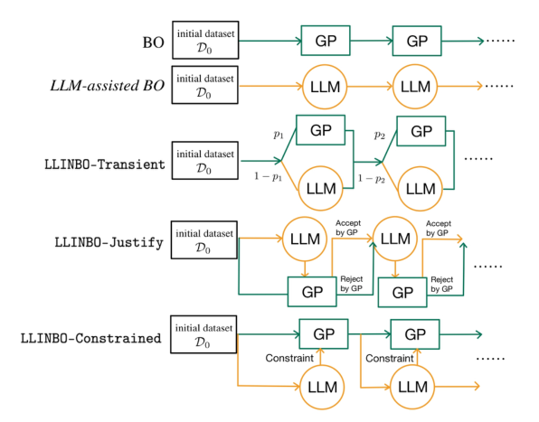
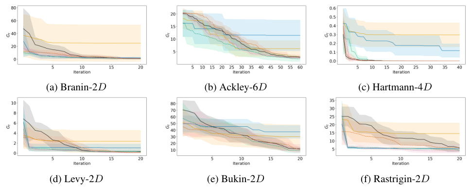

## Why I read it

Bayesian optimisation (BO) starts blind: the first evaluations are spent learning what a domain expert already knows. The [language-induced priors](/blog/language-induced-priors/) paper attacks the same cold start with a prior; this one attacks it with advice. I also had a personal reason. In my [exchange-queue study](/projects/exchange-queueing/), a textbook formula (Erlang-C) confidently asked for one server where the real arrival stream needed about 48. I wanted to see how a principled optimiser should treat a confident advisor that can be badly wrong.

## The idea, as I understand it

The setting is ordinary BO: maximise an expensive function with a fixed budget of noisy evaluations, using a Gaussian-process (GP) surrogate and the GP-UCB rule. Each round, an LLM prompted with a short description of the problem also proposes a point. The paper's whole question is how to use that one point so that the worst case is still GP-UCB.

*Source: Chang, Azvar, Okwudire & Al Kontar, arXiv:2505.14756, Fig. 1, CC BY 4.0.*

There are three answers, and I find it useful to read them as three levels of trust:

- **Transient: trust by schedule.** Flip a coin each round and use the LLM's point with a probability that decays to zero. After roughly $\sqrt T$ rounds it is plain BO.
- **Justify: trust by test.** Accept the LLM's point only if its upper confidence bound is within a gap of the GP's best; otherwise run the GP's own choice.
- **Constrained: trust by belief update.** Condition the GP on the LLM's point beating the current best posterior mean, by keeping only posterior samples that satisfy it, and then choose by UCB.

The theory gives each variant a GP-UCB-type regret bound in which the LLM does not appear. <mark>That is a guarantee that bad advice cannot break convergence, not a guarantee that good advice helps.</mark> I think this is the honest way to state it, and the paper's own framing (LLMs for early exploration, statistical models for exploitation) is consistent with it.

## What the results show

There is no results table, only curves, so the reading below is mine.

*Source: Chang, Azvar, Okwudire & Al Kontar, arXiv:2505.14756, Fig. 3, CC BY 4.0.*

- **The negative result is the strongest.** LLM-only BO (LLAMBO) stalls at a high regret on most synthetic functions. An LLM is a good starting guess and a poor optimiser.
- **The hybrids lead early, then converge to BO.** Transient and Justify are ahead in the first rounds on Branin, Levy and Rastrigin. On Hartmann and Ackley their final values overlap BO's. Constrained is the slowest hybrid early on Levy, Rastrigin and Ackley, which the paper does not remark on.
- **"Significantly lower error" in hyperparameter tuning is weak.** With 10 runs, the bands overlap in most panels.
- **The 3D-printing study is a proof of concept.** It has one run per method and eight prints. Transient's last print has the least stringing, which is encouraging but anecdotal.
- **Warm start and advice are confounded.** The LLM methods start from an LLM-chosen design, plain BO from random ones, and there is no "BO with an LLM warm start" baseline. Because Transient stops consulting the LLM after a few rounds, part of its early lead may be the starting design alone.

## Where I am not convinced

- **Benefit is never quantified.** Every bound treats the LLM's rounds as worst case, so the theory cannot tell a perfect advisor from a random one; the benefit rests on the curves alone.
- **Recall versus reasoning.** The test functions are textbook ones with descriptions like "three global maxima", which a model may recall rather than reason about. Memorisation is not tested.
- **The scale is small.** There is one LLM at temperature 1.0, 10 replications and at most six dimensions.
- **Constrained has a trust knob after all.** Its strictness is set by how many posterior samples are drawn.

## What I take from it

- **"The statistical model decides, outside knowledge advises" is the structure I want in my own work.** The same arc runs through the language-prior paper (a prior that is tempered away) and consensus BO (collaboration that fades to independence): borrow when data are scarce, then hand control back to the data.
- **A confident wrong advisor is easy to screen when the referee is honest.** In my queue study, a Justify-style test with a simulation surrogate of the service-level violation would reject Erlang-C's one-server proposal immediately, and accept a good heuristic when there is one. That is a safe way to use outside knowledge, and it costs nothing when the advice is wrong.
- **Trust should be earned within the run.** A fixed schedule ignores whether the advice has been any good. This is the part I would most like to work on.

## What I would try next

*Ideas, not results.*

1. **Trust from the run's own evidence.** Set the LLM's weight from the posterior probability that its past proposals beat the incumbent, capped by a summable envelope so the regret bound still holds. Test it on the hyperparameter tasks with a correct and a deliberately misleading description.
2. **Separate the warm start from the advice.** Add the missing baseline, BO started from the LLM's first design, to see how much of the early lead the in-loop advice really adds.

## References

- C.-Y. Chang, M. Azvar, C. Okwudire, R. Al Kontar. *LLINBO: Trustworthy LLM-in-the-Loop Bayesian Optimization.* arXiv:2505.14756, 2025. Code: github.com/UMDataScienceLab/LLM-in-the-Loop-BO.
- T. Liu, N. Astorga, N. Seedat, M. van der Schaar. *Large Language Models to Enhance Bayesian Optimization* (LLAMBO). ICLR 2024.
- N. Srinivas, A. Krause, S. Kakade, M. Seeger. *Gaussian process optimization in the bandit setting: no regret and experimental design* (GP-UCB). ICML 2010.
- Z. Dai, B. K. H. Low, P. Jaillet. *Federated Bayesian optimization via Thompson sampling.* NeurIPS 2020.
- Q. Chen, L. Jiang, H. Qin, R. Al Kontar. *Multi-agent collaborative Bayesian optimization via constrained Gaussian processes.* Technometrics 67(1), 2025 (the source of the Constrained rule).
