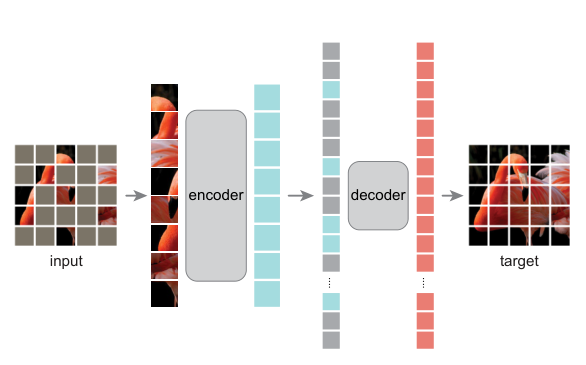
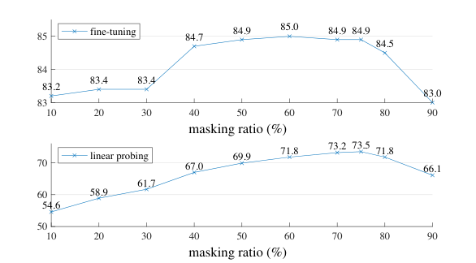
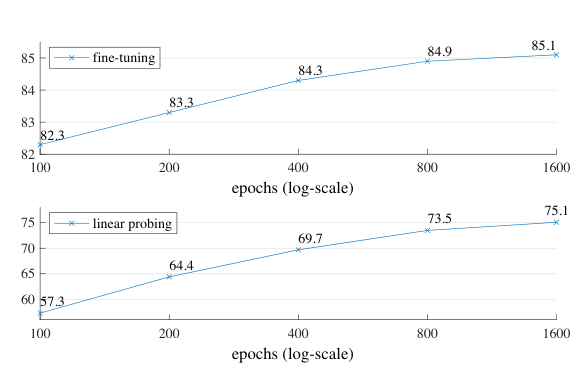

## Abstract

MAE brings BERT-style masked prediction to images with two decisions that reinforce each other. The encoder is a plain ViT that only ever receives the unmasked patches, and a much smaller Transformer decoder, used during pre-training only, fills in the rest from the encoder output plus learned placeholder tokens. The second decision is to mask far more than language models do, around 75% of the patches, because images are redundant enough that a lighter corruption can be undone by local interpolation. Together these make pre-training roughly three times faster while improving accuracy. A ViT-Huge pre-trained this way on ImageNet-1K alone reaches 87.8% top-1 after fine-tuning, and the learned weights transfer to detection and segmentation better than supervised ones, with the margin widening as the backbone gets larger.

**Keywords:** self-supervised learning, masked image modeling, asymmetric encoder-decoder, Vision Transformer, denoising autoencoder, scalability

## 1 Introduction

Large vision models overfit a million labeled images, and the labeled sets that do satisfy them are mostly private. NLP escaped the same problem by deleting part of the input and predicting it. The authors ask why that recipe had not worked equally well in vision, and give three answers.

First, architecture: mask tokens and positional embeddings have no natural place in a convolutional network, but ViT removed that obstacle. Second, information density: a sentence with a few words removed requires real understanding to repair, whereas a missing image patch can often be guessed from its neighbours. Third, the role of the decoder: predicting a word is a semantic act, predicting pixels is not, so <mark>how the decoder is built decides how abstract the encoder's representation ends up being</mark>. BERT can get away with an MLP head; an image model cannot.

Earlier masked-image work (iGPT, the masked-patch experiment in the ViT paper, BEiT) used ratios of 20–50% and, for BEiT, a separately trained tokenizer. MAE argues that neither is needed.

## 2 Background

A denoising autoencoder corrupts an input and learns to restore the clean signal; masking is one such corruption. MAE belongs to this family with two departures: the encoder never sees the corrupted positions, and the loss covers only those positions.

The competing line was contrastive learning (MoCo v3, DINO, BYOL, SimCLR), which pulls augmented views of one image together and therefore depends on hand-designed augmentation and on encoding two or more full views per step.

Representations are judged by *linear probing* (frozen encoder, linear classifier) and by *end-to-end fine-tuning*. One side result of the paper is that the two disagree.

## 3 Method

> **Key idea.** Put the expensive network where the information is and the cheap network where the placeholders are. The encoder processes only the ~25% of patches that are visible; mask tokens appear only at the input of a lightweight decoder that is thrown away after pre-training.

*Source: He et al., arXiv:2111.06377, Fig. 1, CC BY 4.0.*

### 3.1 Masking

The image is split into $N$ non-overlapping patches $x_1,\dots,x_N$ as in ViT. A random subset $\mathcal{V}$ is kept, drawn uniformly without replacement, and the complement $\mathcal{M}$ is dropped. With masking ratio $r$,

$$
|\mathcal{M}| = rN, \qquad |\mathcal{V}| = (1-r)N, \qquad r = 0.75 \text{ by default.} \tag{1}
$$

Uniform sampling avoids a centre bias, and the high ratio removes the redundancy that would let the model extrapolate from adjacent patches. The implementation is a shuffle of the token list followed by truncation; no sparse operators are involved.

### 3.2 Asymmetric encoder and decoder

The encoder $f_\theta$ is a standard ViT applied to the visible tokens (linear patch embedding plus positional embedding):

$$
z_i = f_\theta\big(\{x_j\}_{j\in\mathcal{V}}\big)_i, \quad i \in \mathcal{V}. \tag{2}
$$

The decoder $g_\phi$ receives the full-length sequence, where each masked position holds one shared learned vector $m$, and every position gets a positional embedding so that the placeholders know where they are:

$$
\hat{x} = g_\phi\big(\{z_i\}_{i\in\mathcal{V}} \cup \{m\}_{i\in\mathcal{M}}\big). \tag{3}
$$

The default decoder has 8 blocks of width 512, which costs about 9% of the per-token FLOPs of ViT-L (24 blocks, width 1024).

### 3.3 Reconstruction target

The last decoder layer is a linear map to the pixel values of a patch, trained with mean squared error on masked patches only:

$$
\mathcal{L} = \frac{1}{|\mathcal{M}|}\sum_{i\in\mathcal{M}} \big\lVert \hat{x}_i - \tilde{x}_i \big\rVert_2^2, \qquad \tilde{x}_i = \frac{x_i - \mu_i}{\sigma_i}, \tag{4}
$$

where $\mu_i,\sigma_i$ are the mean and standard deviation of the pixels in patch $i$. Per-patch normalization is a variant the paper finds better than raw pixels. Restricting the loss to masked positions is empirical: including visible pixels costs roughly 0.5% accuracy.

## 4 Experiments

**Setup.** Pre-training on the ImageNet-1K training set without labels; evaluation by fine-tuning or linear probing, top-1 on a single 224×224 crop. Ablations use ViT-L/16 at 800 epochs. The baseline that matters: ViT-L trained from scratch with a carefully regularized recipe reaches 82.5%, while the default MAE reaches 84.9% after only 50 fine-tuning epochs.

*Source: He et al., arXiv:2111.06377, Fig. 5, CC BY 4.0.*

**Ablations.** <mark>The best masking ratios are far above BERT's 15%</mark>: fine-tuning is flat between 40% and 80%, while linear probing climbs from 54.6% at a 10% ratio to 73.5% at 75%. <mark>Feeding mask tokens to the encoder lowers linear probing from 73.5% to 59.6% and costs 3.3× the FLOPs</mark>; the authors attribute the drop to a train/deploy mismatch, since real images contain no mask tokens. Wall-clock speedup from removing them is 2.8× for ViT-L and up to 4.1× for ViT-H with a one-block decoder. Decoder depth hardly affects fine-tuning (84.8% with a single block) but matters for linear probing (65.5% to 73.5%): a deeper decoder absorbs the pixel-level specialization. Random masking beats block-wise and grid-wise masking. <mark>With no augmentation at all the model still reaches 84.0%</mark>, whereas the paper cites 13% and 28% drops for BYOL and SimCLR under crop-only augmentation; random masking itself supplies the variety.

*Source: He et al., arXiv:2111.06377, Fig. 7, CC BY 4.0.*

**Main result** (paper's Table 3; fine-tuning top-1 %, MAE at 1600 epochs with normalized pixels):

| Method | Pre-train data | ViT-B | ViT-L | ViT-H | ViT-H (448) |
|---|---|---|---|---|---|
| Scratch (authors' impl.) | – | 82.3 | 82.6 | 83.1 | – |
| DINO | IN1K | 82.8 | – | – | – |
| MoCo v3 | IN1K | 83.2 | 84.1 | – | – |
| BEiT | IN1K + DALLE | 83.2 | 85.2 | – | – |
| **MAE** | **IN1K** | **83.6** | **85.9** | **86.9** | **87.8** |

The gap to other methods is small for ViT-B and grows with model size. On 128 TPU-v3 cores, 1600 MAE epochs of ViT-L take 31 hours versus 36 hours for 300 epochs of MoCo v3.

**Transfer.** With a ViT Mask R-CNN on COCO, MAE gives 50.3 / 53.3 box AP for ViT-B / ViT-L against 47.9 / 49.3 for supervised pre-training. On ADE20K with UperNet the ViT-L mIoU is 53.6 versus 49.9. <mark>The advantage over supervised pre-training is larger for the bigger backbone in both tasks.</mark> Swapping normalized pixels for dVAE tokens changes results by at most 0.2 points anywhere, so the tokenizer buys nothing.

**Partial fine-tuning.** MoCo v3 has the better linear probe (77.6% vs 73.5%), yet tuning just the last block lifts MAE to 81.0%, and MAE leads from one tuned block onward. <mark>MAE features are less linearly separable but stronger once any non-linear head is allowed.</mark>

## 5 Discussion

**Strengths.** The method is very simple: no tokenizer, no momentum encoder, no augmentation pipeline, an MSE loss. The ablations isolate each choice, and efficiency is reported in hours, not only FLOPs. The partial fine-tuning analysis corrects the habit of ranking methods by linear probes.

**Weaknesses.** The design relies on ViT's ability to drop tokens; convolutional or hierarchical backbones are not shown. Each epoch is cheap, but the headline numbers use 1600 of them. Linear-probe quality trails contrastive methods, which matters when the encoder must stay frozen. Why heavy masking yields semantic features remains, as the authors say themselves, a hypothesis.

**Not shown.** Pre-training data beyond ImageNet-1K, sensitivity to patch size, and any quantitative evaluation of the reconstructions, which serve only as qualitative illustration.

## 6 Takeaways

- Match the corruption level to the redundancy of the signal. For images that means masking most of the input, not 15%.
- Keep placeholder tokens out of the encoder: it removes a train/test mismatch and most of the compute at once.
- A throwaway decoder of moderate depth lets the encoder stay abstract even though the target is raw pixels.
- Linear probing and fine-tuning can rank methods in opposite orders; evaluate with the protocol you will actually deploy.
- For financial time series the transferable point is the redundancy argument: a masked-reconstruction pretext is only useful if the masked part cannot be interpolated from its neighbours, so the ratio and mask shape must be tuned to the signal. The denoising view is also close to diffusion training, where the corruption is Gaussian noise instead of deletion. The paper tests neither; this is a design hint, not a result.

## References

1. He, K., Chen, X., Xie, S., Li, Y., Dollár, P., Girshick, R. *Masked Autoencoders Are Scalable Vision Learners.* arXiv:2111.06377.
2. Dosovitskiy, A. et al. *An Image is Worth 16x16 Words: Transformers for Image Recognition at Scale.* ICLR 2021.
3. Devlin, J. et al. *BERT: Pre-training of Deep Bidirectional Transformers for Language Understanding.* NAACL 2019.
4. Bao, H., Dong, L., Wei, F. *BEiT: BERT Pre-Training of Image Transformers.* arXiv:2106.08254.
5. Chen, X., Xie, S., He, K. *An Empirical Study of Training Self-Supervised Vision Transformers* (MoCo v3). ICCV 2021.
