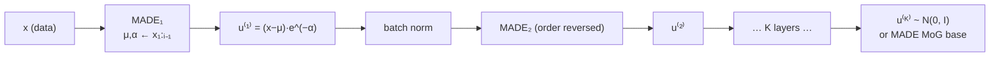

## Abstract

The observation is almost embarrassingly simple. An autoregressive model with Gaussian conditionals generates data by $x_i=u_i\exp\alpha_i+\mu_i$ with $u_i\sim\mathcal{N}(0,1)$; that is a differentiable, invertible map $x=f(u)$ with a triangular Jacobian, which is to say a normalizing flow. So the model can be improved the way flows are improved: stack it. Model the internal random numbers $u^{(1)}$ of the first autoregressive model with a second, its random numbers $u^{(2)}$ with a third, and so on, with a standard Gaussian at the top. Implementing each layer with MADE — a feedforward network whose weight matrices are multiplied by binary masks enforcing the autoregressive property — means each layer computes all $\mu_i,\alpha_i$ in one forward pass, so evaluating $p(x)$ for a given $x$ costs $K$ passes rather than $K\cdot D$. The paper then shows that [IAF](/blog/iaf/) is the same construction with the conditioning attached to $u_{1:i-1}$ instead of $x_{1:i-1}$, that [Real NVP](/blog/realnvp/)'s coupling layer is a special case of both, and that training MAF by maximum likelihood is *exactly* stochastic variational inference with an implicit IAF. On five general-purpose density estimation benchmarks and two conditional image tasks, MAF beats Real NVP everywhere and is the best of all models tested in five of nine cases.

**Keywords:** masked autoregressive flow, MADE, autoregressive density estimation, normalizing flow, UCI density benchmarks, conditional density estimation

## 1 Introduction

The framing is the one I find most useful in this whole literature, because it says out loud what the models are *for*:

> Neural density estimators differ from other approaches to generative modelling — such as variational autoencoders and generative adversarial networks — in that they readily provide exact density evaluations. As such, they are more suitable in applications where the focus is on explicitly evaluating densities, rather than generating synthetic data.

And then a list of what those applications are: learning priors from large unlabelled datasets for use in standard Bayesian inference; learning likelihoods or posteriors from simulated data for likelihood-free inference; learning proposals for importance sampling or [sequential Monte Carlo](/blog/bootstrap-filter/); serving as inference networks for amortised variational inference. Not one of them is "make pictures".

That list is why this paper, rather than Glow, is the one I would hand to someone coming from statistics. It is also why MAF sits at the junction of the two topics I have been reading around: it is a flow whose stated purpose is density evaluation, and one of its named uses is building proposals for particle methods, where a good proposal is precisely a tractable density close to an intractable target.

The tension the paper resolves is that the two tractable-and-flexible families — autoregressive models and normalizing flows — were thought of as alternatives, and they are not. An autoregressive model *is* a flow. Once you see that, "make the autoregressive model more flexible" and "make the flow deeper" become the same operation.

## 2 Prior work

**Autoregressive density estimation.** $p(x)=\prod_i p(x_i\mid x_{1:i-1})$, each conditional a parametric density whose parameters are a function of a hidden state. RNADE uses mixtures of Gaussians or Laplacians with a linear hidden-state update; LSTM variants use richer ones.

The known defect is order sensitivity, and the paper's illustration of it is the best single figure in the paper. Take $p(x_1,x_2)=\mathcal{N}(x_2\mid0,4)\,\mathcal{N}\bigl(x_1\mid\tfrac14x_2^2,1\bigr)$ — a parabola-shaped ridge. Under the order $(x_2,x_1)$ a model with Gaussian conditionals represents it *perfectly*, because that is literally how the density is written. Under the order $(x_1,x_2)$ it cannot, because $p(x_2\mid x_1)$ is bimodal. Same model, same capacity, factorially many orders, and *in practice it is hard to know which of the factorially many orders is the most suitable*. [Fig. 1](https://arxiv.org/pdf/1705.07057#page=3) shows the failure and shows a 5-layer MAF fixing it *under the bad order*, which is the point: stacking buys back what a bad order costs.

The second defect is speed. A recurrent autoregressive model needs $D$ sequential steps to evaluate $p(x)$. MADE removes this by starting from a fully connected $D$-in, $D$-out autoencoder and masking out connections so that output $i$ depends only on inputs $1,\dots,i-1$; then all conditionals are computed in one GPU-friendly pass.

**Normalizing flows.** $x=f(u)$, $u\sim\pi_u$, with

$$
p(x)=\pi_u\bigl(f^{-1}(x)\bigr)\left\lvert\det\frac{\partial f^{-1}}{\partial x}\right\rvert, \tag{1}
$$

requiring $f$ easy to invert and cheap in determinant, both of which are preserved under composition. The paper's survey of the alternatives is short and pointed: Gaussianization; flows built from non-singular weight matrices, where the determinant is cubic in $D$; planar and radial flows and IAF, which *were developed primarily for variational inference and are not well-suited for density estimation, as they can only efficiently calculate the density of their own samples and not of externally provided datapoints*; and [NICE](/blog/nice/) and Real NVP, which are suitable for both.

That sentence about IAF is the crux of the whole paper and §3.2 turns it into a theorem.

## 3 Method

> **Key idea.** The vector of random numbers an autoregressive model draws from `randn()` when it generates a sample is a latent variable, and the generation procedure is an invertible map from it to the data. So fit a second autoregressive model to those random numbers, and a third to *its* random numbers. Each layer only has to make the residual look a bit more Gaussian.

### 3.1 An autoregressive model is a flow

Take Gaussian conditionals,

$$
p(x_i\mid x_{1:i-1})=\mathcal{N}\bigl(x_i\mid\mu_i,(\exp\alpha_i)^2\bigr),\quad
\mu_i=f_{\mu_i}(x_{1:i-1}),\;\alpha_i=f_{\alpha_i}(x_{1:i-1}), \tag{2}
$$

with $f_{\mu_i},f_{\alpha_i}$ unconstrained scalar functions. Generation is the recursion

$$
x_i=u_i\exp\alpha_i+\mu_i,\qquad u_i\sim\mathcal{N}(0,1), \tag{3}
$$

and inversion — recovering the random numbers that would have produced a given $x$ — is

$$
u_i=(x_i-\mu_i)\exp(-\alpha_i). \tag{4}
$$

The Jacobian of $f^{-1}$ is triangular by the autoregressive structure, so

$$
\left\lvert\det\frac{\partial f^{-1}}{\partial x}\right\rvert=\exp\Bigl(-\sum_i\alpha_i\Bigr). \tag{5}
$$

Substituting (4) and (5) into (1) gives the density. Crucially, **(4) is parallel and (3) is sequential**: to compute $u$ from a known $x$ you already have all of $x_{1:i-1}$, so one masked forward pass suffices; to sample you must produce $x_i$ before you can compute $\mu_{i+1}$. This asymmetry is the entire MAF/IAF trade-off.

**The diagnostic.** Because $u=f^{-1}(x)$ is computable, you can transform the training data into its random numbers and *look at them*. If they are not independent standard normals, the model is a bad fit. [Fig. 1b](https://arxiv.org/pdf/1705.07057#page=3) does exactly this for the parabola under the bad order and the scatter is visibly non-Gaussian. This is a free goodness-of-fit check that no GAN and no VAE can offer, and it generalises: any flow lets you inspect its own residual.

### 3.2 Stacking

Given autoregressive models $M_1,\dots,M_K$, model the random numbers $u^{(1)}$ of $M_1$ with $M_2$, $u^{(2)}$ with $M_3$, and $u^{(K)}$ with a standard Gaussian. Each $M_k$ is a MADE with Gaussian conditionals. The flexibility gain is real and cheap to see: [Fig. 1c](https://arxiv.org/pdf/1705.07057#page=3) shows a 5-layer MAF learning *multimodal* conditionals although every layer has unimodal conditionals — the composition of unimodal-conditional maps is not unimodal-conditional. The paper notes the ancestry of this move in deep belief nets and deep mixtures of factor analysers.

The ordering is handled by reversal: the default dataset order for the first (data-facing) layer, reversed for each successive layer. This is the same choice IAF made. Random orders per layer are noted as possible and not tried.

### 3.3 Relationship with IAF

IAF's layer is

$$
x_i=u_i\exp\alpha_i+\mu_i,\qquad
\mu_i=f_{\mu_i}(u_{1:i-1}),\;\alpha_i=f_{\alpha_i}(u_{1:i-1}). \tag{6}
$$

Compare with (3). *The difference is architectural*: MAF conditions on previous **data** variables, IAF on previous **random numbers**. Everything else follows.

| | evaluate $p(x)$ for given $x$ | sample, and evaluate the sample's density |
|---|---|---|
| **MAF** | 1 pass | $D$ passes |
| **IAF** | $D$ passes | 1 pass |
| **Real NVP** | 1 pass | 1 pass |

So IAF is a recognition model for variational inference, where you only ever need the density of your own samples; MAF is a density estimator. Real NVP is fast both ways and less flexible than either.

**The equivalence (Appendix A).** Let $\pi_x$ be the data density, $\pi_u$ the base density, $f$ MAF's transformation. MAF defines $p_x(x)=\pi_u(f^{-1}(x))\lvert\det\partial f^{-1}/\partial x\rvert$. Read $f^{-1}$ the other way and it is an *implicit IAF with base density $\pi_x$*, defining $p_u(u)=\pi_x(f(u))\lvert\det\partial f/\partial u\rvert$. Then

$$
D_{\mathrm{KL}}\bigl(\pi_x\,\|\,p_x\bigr)=D_{\mathrm{KL}}\bigl(p_u\,\|\,\pi_u\bigr). \tag{7}
$$

The proof is a change of variables: write the left KL as $\mathbb{E}_{\pi_x}[\log\pi_x-\log\pi_u(f^{-1}(x))-\log\lvert\det\partial f^{-1}/\partial x\rvert]$, substitute $x\mapsto u$, and recognise $\log p_u(u)-\log\pi_u(u)$ inside the expectation. Three lines.

The interpretation is worth spelling out because it is genuinely surprising. Maximum-likelihood training of MAF *is* stochastic variational inference with an implicit IAF, where $\pi_u$ plays the role of the (usually intractable) posterior, $\pi_x$ plays the role of the IAF's base, and $f^{-1}$ implements the reparameterisation trick. Two procedures that look nothing alike — fit a density to data; fit a variational posterior to an intractable target — are the same optimisation viewed from opposite ends of the same bijection.

### 3.4 Relationship with Real NVP

Real NVP's coupling layer is

$$
x_{1:d}=u_{1:d},\qquad x_{d+1:D}=u_{d+1:D}\odot\exp\alpha+\mu,\quad \mu=f_\mu(u_{1:d}),\;\alpha=f_\alpha(u_{1:d}). \tag{8}
$$

Recover it from MAF's (3) by setting $\mu_i=\alpha_i=0$ for $i\le d$ and making $\mu_i,\alpha_i$ functions of only $x_{1:d}$ for $i>d$; recover it from IAF's (6) the same way with $u_{1:d}$. So **the coupling layer is a special case of both MAF and IAF**, and the two are different (incomparable) generalisations of it: MAF and IAF scale and shift *every* element as a function of *all* previous elements, rather than half the elements as a function of the other half. NICE is the further special case $\alpha=0$.

This is the cleanest statement of the coupling-versus-autoregressive relationship anywhere in the literature, and it makes the trade-off legible: coupling buys one-pass sampling *and* one-pass density by throwing away conditioning structure.

### 3.5 Conditional MAF

$p(x\mid y)=\prod_i p(x_i\mid x_{1:i-1},y)$, so conditioning just means appending $y$ to the inputs of every MADE and modelling only the conditionals for $x$. Any order works as long as $y$ precedes $x$, and *no connections need to be dropped from the $y$ inputs* — $y$ is always available to every output. Real NVP is made conditional the same way, as a special case.

### 3.6 Algorithm

```text
EVALUATE log p(x)            # one masked pass per layer; fully parallel
  u, logdet = x, 0
  for k in 1..K:
      mu, alpha = MADE_k(u)          # one forward pass, all i at once
      u        = (u - mu) * exp(-alpha)
      logdet  -= sum(alpha)
      u        = batchnorm_k(u)      # invertible; logdet += its own term
      u        = reverse_order(u)
  return log pi_u(u) + logdet

SAMPLE                        # D sequential steps per layer
  u ~ pi_u
  for k in K..1:
      u = unreverse(u); u = batchnorm_k^{-1}(u)
      x = zeros(D)
      for i in 1..D:                 # sequential: x_i needed before mu_{i+1}
          mu_i, alpha_i = MADE_k(x)[i]
          x[i] = u[i] * exp(alpha_i) + mu_i
      u = x
  return u
```



## 4 Implementation notes

- **Models compared.** MADE (Gaussian conditionals) and MADE MoG ($C=10$ mixture components per conditional); Real NVP with 5 or 10 coupling layers; MAF with 5 or 10 autoregressive layers, plus MAF MoG (5) — a 5-layer MAF whose base density is a MADE MoG, trained jointly.
- **The Real NVP here is not the Real NVP of the original paper.** The authors are explicit: *this is a general-purpose implementation of Real NVP which is different and thus not comparable to its original version, which was designed specifically for image data.* Two feedforward networks, $f_\alpha$ with tanh hidden units and $f_\mu$ with ReLU (*we found this combination to perform best*), both with linear outputs, alternating odd/even copying. The point of the comparison is coupling layers *versus* autoregressive layers as general-purpose building blocks, and the design is chosen so that comparison is fair. This is the right call and it also means the numbers here cannot be read against Glow's Table 2.
- **MADE masks.** Degrees $1..D$ for inputs (degree = index in the order), $0..D-1$ for outputs; a unit may receive input only from units of lower or equal degree. Every hidden layer must contain every degree, which is *necessary and sufficient* for output $i$ to connect to all inputs of degree below $i$ and hence introduce no spurious conditional independences. Degrees are assigned sequentially with enough hidden units to cover all of them — except CIFAR-10, which is high-dimensional enough that they used fewer hidden units than inputs and assigned degrees uniformly at random. **On CIFAR-10, therefore, the MADE layers may introduce conditional independences that the construction elsewhere rules out.**
- **Batch normalisation as a flow layer** (Appendix B), inserted between every two autoregressive (or coupling) layers and between the last one and the base density:

  $$
  x=(u-\beta)\odot\exp(-\gamma)\odot(v+\epsilon)^{1/2}+m,
  \qquad
  u=(x-m)\odot(v+\epsilon)^{-1/2}\odot\exp\gamma+\beta,
  $$

  with log absolute determinant $\sum_i\bigl(\gamma_i-\tfrac12\log(v_i+\epsilon)\bigr)$. $\gamma$ is *exponentiated* — unlike typical batch-norm implementations — to guarantee positivity and simplify the log-determinant. During training $m,v$ are the current minibatch mean and variance; **at validation and test time they are the sample mean and variance of the entire training set**, not a running average as in Real NVP. $\epsilon=10^{-5}$. The authors report that batch norm *reduces training time, increases stability during training and improves performance*.
- **Optimisation.** Adam; minibatch 100; step size $10^{-3}$ for MADE and MADE MoG, $10^{-4}$ for Real NVP and MAF; $\ell_2$ coefficient $10^{-6}$; early stopping after 30 epochs without validation improvement. Hidden layer count and width chosen by validation performance, with the *same* options given to all models.
- **Parameter accounting** (Appendix C). Each extra MADE MoG component costs $DH$ parameters; each extra MAF layer costs $\tfrac32DH+\tfrac12(L-1)H^2$. With one or two hidden layers and $D$ comparable to $H$ these are about equal, so *increasing flexibility by stacking has a parameter cost that is similar to adding more components to the conditionals*. Real NVP has roughly 1.3 to 2 times more parameters than a comparable MAF, which makes the conclusion that *MAF makes better use of its available capacity* a capacity-controlled one — the strongest form of the comparison.
- **Preprocessing.** UCI: subtract the sample mean, divide by the sample standard deviation, drop discrete attributes and any attribute with Pearson correlation above 0.98 — *meant to avoid trivial high densities*, which is exactly the degeneracy that makes likelihood comparison on raw tabular data meaningless. BSDS300: random $8\times8$ monochrome patches, uniform dequantisation noise, rescale to $[0,1]$, subtract the mean pixel value, discard the bottom-right pixel. MNIST/CIFAR-10: dequantise, rescale, then $x\mapsto\operatorname{logit}\bigl(\lambda+(1-2\lambda)x\bigr)$ with $\lambda=10^{-6}$ for MNIST and $\lambda=0.05$ for CIFAR-10; CIFAR-10 augmented with horizontal flips. **Log-likelihoods for MNIST and CIFAR-10 are reported in logit space.**
- **Code** in Theano at `github.com/gpapamak/maf`.

## 5 Experiments

### 5.1 Unconditional density estimation

Average test log-likelihood in nats, error bars are two standard deviations, bold marks the best (multiple if a paired $t$-test finds no significant difference).

| | POWER | GAS | HEPMASS | MINIBOONE | BSDS300 |
|---|---|---|---|---|---|
| Gaussian | $-7.74\pm0.02$ | $-3.58\pm0.75$ | $-27.93\pm0.02$ | $-37.24\pm1.07$ | $96.67\pm0.25$ |
| MADE | $-3.08\pm0.03$ | $3.56\pm0.04$ | $-20.98\pm0.02$ | $-15.59\pm0.50$ | $148.85\pm0.28$ |
| MADE MoG | **$0.40\pm0.01$** | $8.47\pm0.02$ | **$-15.15\pm0.02$** | $-12.27\pm0.47$ | $153.71\pm0.28$ |
| Real NVP (5) | $-0.02\pm0.01$ | $4.78\pm1.80$ | $-19.62\pm0.02$ | $-13.55\pm0.49$ | $152.97\pm0.28$ |
| Real NVP (10) | $0.17\pm0.01$ | $8.33\pm0.14$ | $-18.71\pm0.02$ | $-13.84\pm0.52$ | $153.28\pm1.78$ |
| MAF (5) | $0.14\pm0.01$ | $9.07\pm0.02$ | $-17.70\pm0.02$ | **$-11.75\pm0.44$** | $155.69\pm0.28$ |
| MAF (10) | $0.24\pm0.01$ | **$10.08\pm0.02$** | $-17.73\pm0.02$ | $-12.24\pm0.45$ | $154.93\pm0.28$ |
| MAF MoG (5) | $0.30\pm0.01$ | $9.59\pm0.02$ | $-17.39\pm0.02$ | **$-11.68\pm0.44$** | **$156.36\pm0.28$** |

Read carefully, this table says four things.

1. **MAF beats Real NVP on every dataset.** Not by a lot on POWER, by two full nats on GAS, and with Real NVP (5)'s $\pm1.80$ on GAS and Real NVP (10)'s $\pm1.78$ on BSDS300 indicating that coupling flows are also *less stable* across runs here.
2. **MADE MoG wins on POWER and HEPMASS**, and by a wide margin on HEPMASS ($-15.15$ against MAF MoG's $-17.39$). Stacking and richer conditionals are alternatives, not a hierarchy, and the paper says so: *the best approach is dataset specific; in our experiments MAF outperformed MADE MoG in 5 out of 9 cases, which is strong evidence of its competitiveness.* "Competitiveness", not superiority. That restraint is unusual and correct.
3. **Depth is not monotone.** MAF (10) beats MAF (5) on POWER and GAS and loses on HEPMASS, MINIBOONE and BSDS300. No explanation is offered; I would guess an optimisation effect at fixed early-stopping patience rather than a capacity one, but nothing in the paper decides it.
4. **MAF MoG (5) is the best single-model BSDS300 result at 156.36 nats**, against Deep RNADE at 155.2 — but an *ensemble* of 32 Deep RNADEs reaches 157.0, which the paper reports rather than omits. The UCI datasets are introduced here for density estimation, so there is no prior work to compare against, which also means these five columns became the benchmark by fiat and every later flow paper reports them.

### 5.2 Conditional density estimation

MNIST and CIFAR-10, class label as a one-hot $y$; at test time $p(x)=\sum_y p(x\mid y)p(y)$ with uniform $p(y)$. Log-likelihoods in logit space.

| | MNIST uncond. | MNIST cond. | CIFAR-10 uncond. | CIFAR-10 cond. |
|---|---|---|---|---|
| Gaussian | $-1366.9\pm1.4$ | $-1344.7\pm1.8$ | $2367\pm29$ | $2030\pm41$ |
| MADE | $-1380.8\pm4.8$ | $-1361.9\pm1.9$ | $147\pm20$ | $187\pm20$ |
| MADE MoG | **$-1038.5\pm1.8$** | **$-1030.3\pm1.7$** | $-397\pm21$ | $-119\pm20$ |
| Real NVP (5) | $-1323.2\pm6.6$ | $-1326.3\pm5.8$ | $2576\pm27$ | $2642\pm26$ |
| Real NVP (10) | $-1370.7\pm10.1$ | $-1371.3\pm43.9$ | $2568\pm26$ | $2475\pm25$ |
| MAF (5) | $-1300.5\pm1.7$ | $-1302.9\pm1.7$ | $2936\pm27$ | $2983\pm26$ |
| MAF (10) | $-1313.1\pm2.0$ | $-1316.8\pm1.8$ | **$3049\pm26$** | **$3058\pm26$** |
| MAF MoG (5) | $-1100.3\pm1.6$ | $-1092.3\pm1.7$ | $2911\pm26$ | $2936\pm26$ |

Observations the paper makes: MADE MoG wins MNIST, MAF wins CIFAR-10, MAF beats Real NVP in all four columns, and **both MADE and MADE MoG are far worse than the Gaussian baseline on CIFAR-10** ($147$ and $-397$ against $2367$). That last is a striking failure and the paper does not explain it; my reading is that it is the random degree assignment forced by CIFAR-10's dimensionality (§4), which makes the MADE layers structurally weaker exactly where the Gaussian baseline's full covariance is strong.

Observations the paper does not make: **conditioning on the label makes several models worse.** MAF (5) goes from $-1300.5$ to $-1302.9$ on MNIST, MAF (10) from $-1313.1$ to $-1316.8$, Real NVP (5) from $-1323.2$ to $-1326.3$, Real NVP (10) from $2568$ to $2475$ on CIFAR-10. Conditioning adds information and should not hurt a well-fit model; that it does indicates optimisation or capacity-allocation effects, and it goes unremarked.

There is also an erratum worth flagging as a credit to the authors: a footnote states that in earlier versions the starred results were *reported incorrectly, due to an error in the calculation of the test log likelihood of conditional MAF*, corrected in the current version, with the person who found it thanked in the acknowledgements. Papers that fix their own tables in public are rarer than they should be.

## 6 Limitations

**Stated by the authors.**

- Sampling costs $D$ sequential passes per layer, so MAF is unsuitable when generation speed matters. Real NVP *maintains the advantage over MAF (and autoregressive models in general) that samples from the model can be generated efficiently in parallel.*
- **Whether MAF with a Gaussian base density is a universal density approximator is an open question.** MADE MoG is (with enough units and components); MAF MoG inherits it trivially; plain MAF is unknown. This is an unusually honest thing to put in a discussion section.
- *Accurate densities do not necessarily imply good performance in other tasks, such as in data generation* — with the Theis et al. citation. The closing paragraph tells the reader to choose a method by whether the application needs accurate densities, latent-space inference, or high-quality samples, and says MAF is a contribution towards the first.

**My reading.**

- **Order is handled by reversal alone.** Random orders per layer are mentioned and not tried, and the number of layers needed to wash out a bad order is not measured. Given that Figure 1 makes order-sensitivity the motivating problem, this is the missing ablation.
- **Depth is non-monotone and unexplained** (§5.1, point 3).
- **Batch normalisation uses full-training-set statistics at test time**, which is cleaner than a running average but means the evaluated model differs from the model at any training step; the size of that difference is not reported.
- **No sample-quality evaluation of any kind**, which is consistent with the paper's stated scope but means the trade-off it advises the reader to make cannot be made from this paper alone.
- **The CIFAR-10 MADE degree assignment is a confound** that the paper flags in the setup and does not connect to the anomalous CIFAR-10 results.
- **Nothing about tails.** All five UCI datasets are standardised and decorrelated, and the metric is mean log-likelihood, which is dominated by the bulk. For any application where the tail is the object — risk, rare events, outlier detection — these numbers say very little.

## 7 Extensions

**What was built on this.** The five UCI datasets plus BSDS300 became *the* general-purpose density-estimation benchmark, and [Neural Spline Flows](/blog/neural-spline-flows/) is essentially this paper's experimental design with the affine transformer replaced by a monotone rational-quadratic spline — reporting on exactly these columns. Masked Autoregressive Flows are the density-estimator of choice in simulation-based inference, where the conditional version of §3.5 learns $p(x\mid\theta)$ or $p(\theta\mid x)$ from simulator output; the first author's later work is largely that programme. The MAF/IAF duality was later exploited for probability density distillation — train a MAF, distil into an IAF, get fast sampling and fast training in different models — which is the Parallel WaveNet recipe. [FFJORD](/blog/ffjord/) attacks the same problem from the continuous side, removing the ordering entirely. The [survey](/blog/normalizing-flows-survey/) by the same first author is the systematic version of §3.2–3.4.

**Open problems.** Universality of MAF with a Gaussian base, as stated. What the right number of layers is and why more sometimes hurts. Whether random per-layer orders beat reversal. And the question the introduction raises and the experiments never test: does a MAF actually make a good SMC or importance-sampling proposal, and by what measure?

**Research directions.** *These are ideas, not results — none has been run.*

1. **Order sensitivity versus depth, measured.** Hypothesis: the number of MAF layers needed to recover the log-likelihood of the best variable order grows with a measurable property of the target — the total conditional non-Gaussianity under the given order — and saturates by five layers on the UCI benchmarks but not on data with strong nonlinear dependence. Data: the parabola of [Fig. 1](https://arxiv.org/pdf/1705.07057#page=3) generalised to a family with a tunable curvature parameter, plus the UCI five under random orders. Baseline: MAF (5) and MAF (10) under the best and worst orders. Metric: test log-likelihood gap between best and worst order as a function of depth and curvature. Likely failure mode: on standardised real data the order barely matters at any depth, so the synthetic arm carries the entire result — which would itself be the useful finding, since it would say the motivating figure is unrepresentative.
2. **A conditional MAF as an SMC proposal for a stochastic-volatility state-space model.** Hypothesis: a conditional MAF trained on simulated $(x_{t-1},y_t,x_t)$ triples from the model gives a proposal $q(x_t\mid x_{t-1},y_t)$ that reduces the variance of the incremental importance weights relative to the bootstrap proposal $p(x_t\mid x_{t-1})$, and the gain is largest exactly where the observation is most informative — which is where the [bootstrap filter](/blog/bootstrap-filter/) degenerates fastest. Data: simulated paths from a discretised SV model with known parameters, then daily index returns. Baseline: bootstrap proposal and a locally optimal Gaussian approximation. Metric: effective sample size per time step and variance of the log-likelihood estimate at fixed particle count. Likely failure mode: the learned proposal has lighter tails than the true optimal proposal, so the weights have *higher* variance in the rare states that matter — the classic importance-sampling tail failure, which would be worth quantifying rather than avoiding.
3. **Test whether the mean-log-likelihood ranking survives a tail-weighted metric.** Hypothesis: the MAF-versus-MADE-MoG ordering on the UCI benchmarks flips under a tail-region metric, because mixtures of Gaussians place mass explicitly while a stack of affine autoregressive maps must stretch a Gaussian to reach the tail. Data: the five UCI datasets plus BSDS300. Baseline: the paper's own models, retrained. Metric: log-likelihood restricted to held-out points in the lowest decile of model density, and coverage of the 1% contour. Likely failure mode: the "tail" of a standardised UCI dataset is mostly preprocessing artefacts and the metric measures the preprocessing rather than the model.

## 8 Takeaways

- An autoregressive model with Gaussian conditionals is already a normalizing flow, mapping the random numbers it draws internally into data. Nothing has to be added to see this; it just has to be noticed.
- Once noticed, "improve the autoregressive model" becomes "stack it": each layer models the previous layer's random numbers, and a stack of unimodal-conditional layers represents multimodal conditionals.
- MAF and IAF differ by one substitution — condition on $x_{1:i-1}$ or on $u_{1:i-1}$ — and that substitution decides which direction is one pass and which is $D$. Real NVP is the special case of both that is one pass in both directions, and pays for it in flexibility.
- Training MAF by maximum likelihood is exactly stochastic variational inference with an implicit IAF. The proof is a change of variables and it takes three lines.
- The experiments are capacity-controlled, error-barred, significance-tested, and honest about the cases the method loses — MADE MoG wins two of five UCI datasets and MNIST outright. That is a better evidence standard than most of this literature.
- Batch normalisation is a legitimate flow layer as long as you account for its log-determinant and are explicit about which statistics you use at test time.
- For the uses this paper names — Bayesian priors from unlabelled data, likelihood-free inference, importance-sampling and SMC proposals — MAF is the right shape of tool, because all of them need $p(x)$ at an externally supplied $x$, in one pass, and none of them needs fast sampling.

## References

1. Papamakarios, G., Pavlakou, T., Murray, I. *Masked Autoregressive Flow for Density Estimation.* arXiv:1705.07057 (NeurIPS 2017).
2. Germain, M., Gregor, K., Murray, I., Larochelle, H. *MADE: Masked Autoencoder for Distribution Estimation.* ICML 2015.
3. Kingma, D. P., Salimans, T., Jozefowicz, R., Chen, X., Sutskever, I., Welling, M. *Improving Variational Inference with Inverse Autoregressive Flow.* NeurIPS 2016.
4. Dinh, L., Sohl-Dickstein, J., Bengio, S. *Density Estimation using Real NVP.* arXiv:1605.08803.
5. Uria, B., Murray, I., Larochelle, H. *RNADE: The Real-Valued Neural Autoregressive Density-Estimator.* NIPS 2013.
6. Uria, B., Murray, I., Larochelle, H. *A Deep and Tractable Density Estimator.* ICML 2014.
7. Rezende, D. J., Mohamed, S. *Variational Inference with Normalizing Flows.* ICML 2015.
8. Theis, L., van den Oord, A., Bethge, M. *A Note on the Evaluation of Generative Models.* ICLR 2016.
