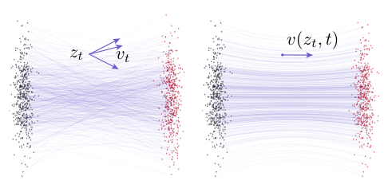
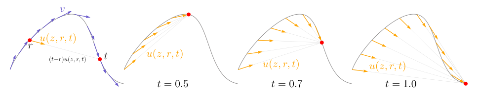
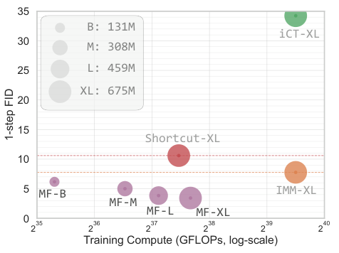

## Abstract

Flow matching learns a velocity field and then pays for it at inference, because the field has to be integrated numerically over many steps. MeanFlow changes what the network represents: the average velocity over a time interval $[r,t]$, which is displacement divided by elapsed time. Differentiating that definition gives an identity linking the average velocity, the instantaneous velocity and a total time derivative, and the identity can be turned into a regression target that needs no integral and no teacher. Training is plain flow matching plus one Jacobian-vector product. With a DiT-style XL backbone trained from scratch, the model reaches FID 3.43 on ImageNet 256×256 with a single function evaluation, and 2.20 with two. Classifier-free guidance is folded into the target field, so guided sampling still costs one evaluation.

**Keywords:** flow matching, average velocity, MeanFlow identity, Jacobian-vector product, one-step generation, consistency models, classifier-free guidance

## 1 Introduction

Diffusion and flow models are iterative samplers, and much recent work has tried to collapse the iteration into one or a few network calls. Distillation does this with a pretrained many-step teacher. Consistency models do it without a teacher, by demanding that network outputs agree for inputs on the same trajectory.

The authors' objection to the consistency line is about where the constraint lives. It is stated as a property the *network* should have, while the ground-truth object the network is supposed to approximate is left unspecified. They link this to the practical fragility of such training, in particular the reliance on a hand-designed discretization curriculum that gradually tightens the time grid. Two-time methods such as Shortcut models and Inductive Moment Matching add further self-consistency losses across intervals, which is again a constraint on the learner.

<mark>MeanFlow's proposal is to name the target field first — the average velocity induced by the flow — and derive the training signal from its definition, with no additional consistency heuristic.</mark>

## 2 Background

Flow matching builds a path $z_t = a_t x + b_t\epsilon$ between data $x$ and prior noise $\epsilon$; the default here is $a_t=1-t$, $b_t=t$, so the conditional velocity is $v_t=\epsilon-x$. Many $(x,\epsilon)$ pairs pass through the same $z_t$, and what the network can learn is the marginal velocity

$$
v(z_t,t) = \mathbb E_{p_t(v_t\mid z_t)}[v_t], \tag{1}
$$

which is fitted in practice by regressing onto the conditional velocity. Sampling solves $\frac{d}{dt}z_t = v(z_t,t)$ from $z_1=\epsilon$ down to $z_0$.

The point that motivates the whole paper is that straight conditional paths do not give straight marginal trajectories. Averaging over pairs bends them, and this curvature belongs to the true field, not to approximation error. A single Euler step across a curved trajectory is therefore wrong even with a perfect network.

*Source: Geng et al., arXiv:2505.13447, Fig. 2, CC BY 4.0.*

## 3 Method

> **Key idea.** Learn the average velocity over $[r,t]$ instead of the instantaneous one. Its definition, differentiated in $t$, gives an exact identity whose right-hand side is computable from the ordinary flow-matching target plus one JVP of the network itself.

### 3.1 Average velocity

For two times $r<t$ on a trajectory, define

$$
u(z_t,r,t) = \frac{1}{t-r}\int_r^t v(z_\tau,\tau)\,d\tau. \tag{2}
$$

This is a field determined entirely by $v$; no network appears in it. It reduces to $v$ as $r\to t$, and additivity of the integral means one step over $[r,t]$ automatically agrees with two steps over $[r,s]$ and $[s,t]$. Consistency is thus a consequence of the definition, not an imposed constraint. If $u$ were known, sampling would be a single subtraction, $z_r = z_t-(t-r)\,u(z_t,r,t)$.

*Source: Geng et al., arXiv:2505.13447, Fig. 3, CC BY 4.0.*

### 3.2 The MeanFlow identity

Equation (2) cannot be used as a target directly, since it would require integrating during training. Multiply through by $(t-r)$ and differentiate with respect to $t$ with $r$ held fixed; the product rule on the left and the fundamental theorem of calculus on the right give

$$
u(z_t,r,t) = v(z_t,t) - (t-r)\,\frac{d}{dt}u(z_t,r,t). \tag{3}
$$

The derivative is a total derivative along the trajectory. Using $dz_t/dt=v$, $dr/dt=0$ and $dt/dt=1$,

$$
\frac{d}{dt}u(z_t,r,t) = v(z_t,t)\,\partial_z u + \partial_t u, \tag{4}
$$

which is exactly the Jacobian-vector product of $u$ with the tangent $(v,0,1)$. Autodiff libraries return this together with the function value in one call.

### 3.3 Training objective

A network $u_\theta(z_t,r,t)$ is regressed onto the right-hand side of (3), with its own derivatives standing in for those of $u$, the conditional velocity $v_t$ standing in for the marginal one, and a stop-gradient on the target:

$$
\mathcal L(\theta) = \mathbb E\,\big\|u_\theta(z_t,r,t) - \operatorname{sg}(u_{\text{tgt}})\big\|_2^2, \qquad u_{\text{tgt}} = v_t - (t-r)\big(v_t\,\partial_z u_\theta + \partial_t u_\theta\big). \tag{5}
$$

The stop-gradient avoids differentiating through the JVP, so there is no second-order optimization; the authors report the JVP overhead as under 20% of training time in their JAX implementation. <mark>When $r=t$ the correction term vanishes and the loss is exactly flow matching</mark>, so the method is best seen as flow matching with a modified target on the pairs where $r\neq t$. One-step sampling is $x = \epsilon - u_\theta(\epsilon,0,1)$.

Consistency models correspond, in this notation, to pinning $r\equiv0$ and conditioning on a single time.

### 3.4 Guidance inside the field

Applying classifier-free guidance at sampling time would double the cost. Instead the guided velocity $v^{\text{cfg}} = \omega\,v(z_t,t\mid c) + (1-\omega)\,v(z_t,t)$ is declared to be the ground-truth field, and its average velocity $u^{\text{cfg}}$ is what the network learns. Because $u^{\text{cfg}}(z_t,t,t)$ with the class dropped equals the unconditional velocity, the training target only changes through

$$
\tilde v_t = \omega\, v_t + (1-\omega)\,u^{\text{cfg}}_\theta(z_t,t,t), \tag{6}
$$

substituted for $v_t$ in (5). <mark>Guidance strength is baked in at training time, and guided sampling remains a single evaluation.</mark> The price is that $\omega$ is no longer a free inference-time knob.

### 3.5 Design choices

The squared error is replaced by an adaptively weighted loss with weight $1/(\|\Delta\|_2^2+c)^p$ (under a stop-gradient); $p=0.5$ resembles the Pseudo-Huber loss used for consistency training. Times $(r,t)$ are drawn from a logit-normal distribution, sorted, and only a fraction of samples have $r\neq t$. The network is conditioned on positional embeddings of $(t,\,t-r)$.

## 4 Experiments

**Setup.** ImageNet 256×256 in the $32\times32\times4$ latent space of a pretrained VAE tokenizer, FID-50K, all models trained from scratch. Ablations use a ViT-B/4 backbone for 80 epochs (400K iterations) and 1-NFE sampling. For reference, the paper quotes 250-NFE FIDs of 68.4 for DiT-B/4 and 58.9 for its own SiT-B/4 reproduction.

Selected ablations (1-NFE FID, default configuration 61.06):

| Factor | Setting | FID |
|---|---|---|
| Share of $r\neq t$ | 0% (pure flow matching) | 328.91 |
| | **25%** | **61.06** |
| | 50% / 100% | 63.14 / 67.32 |
| JVP tangent | **$(v,0,1)$, correct** | **61.06** |
| | $(v,0,0)$ / $(v,1,0)$ / $(v,1,1)$ | 268.06 / 329.22 / 137.96 |
| Time sampler | uniform | 65.90 |
| | **lognorm(−0.4, 1.0)** | **61.06** |
| Loss power $p$ | 0 (squared L2) | 79.75 |
| | 0.5 / **1.0** / 1.5 | 63.98 / **61.06** / 66.57 |
| CFG scale $\omega$ | 1.0 (none) | 61.06 |
| | 2.0 / **3.0** / 5.0 | 20.15 / **15.53** / 20.75 |

The first two blocks are the informative ones. A flow-matching model sampled in one step is unusable, and <mark>deliberately wrong JVP tangents destroy the result, which shows the identity itself, and not some side effect of two-time conditioning, is doing the work</mark>. The best model still spends three quarters of its batch on ordinary flow matching. Conditioning variants all work, including embedding only the interval $t-r$ (63.13).

**System-level comparison**, ImageNet 256×256, all with guidance where applicable:

| Method | Params | NFE | FID ↓ |
|---|---|---|---|
| iCT-XL/2 | 675M | 1 | 34.24 |
| Shortcut-XL/2 | 675M | 1 | 10.60 |
| IMM-XL/2 | 675M | 1×2 | 7.77 |
| MeanFlow-B/2 | 131M | 1 | 6.17 |
| MeanFlow-L/2 | 459M | 1 | 3.84 |
| **MeanFlow-XL/2** | 676M | **1** | **3.43** |
| MeanFlow-XL/2 | 676M | 2 | 2.93 |
| MeanFlow-XL/2+ (longer training) | 676M | 2 | 2.20 |
| DiT-XL/2 | 675M | 250×2 | 2.27 |
| SiT-XL/2 | 675M | 250×2 | 2.06 |
| SiT-XL/2 + REPA | 675M | 250×2 | 1.42 |

The iCT numbers are as reported by the IMM paper. MeanFlow models are trained for 240 epochs. Even the 131M B/2 model beats the earlier 675M one-step baselines, and FID falls monotonically from B to XL.

*Source: Geng et al., arXiv:2505.13447, Fig. 1, CC BY 4.0.*

On unconditional CIFAR-10 with a roughly 55M-parameter U-Net in pixel space, MeanFlow reaches 1-NFE FID 2.92 without a preconditioner, against 2.83 for iCT, 2.97 for sCT, 3.20 for IMM and 3.60 for ECT, all of which use EDM preconditioning. Here it is competitive and not ahead.

## 5 Discussion

**Strengths.** The derivation is short and exact: one definition, one differentiation, one chain rule. It places consistency-type training on a target that exists independently of the network, which clarifies what earlier methods were approximating and explains why a curriculum is not needed. The destructive JVP ablation is a good piece of experimental hygiene, and the scaling behaviour suggests the approach inherits the properties of DiT/SiT backbones. Training from scratch with no teacher is a real practical simplification.

**Weaknesses.** The target in (5) is bootstrapped: it contains the network's own derivatives under a stop-gradient, so the loss value is not a distance to the true $u$ and there is no convergence argument beyond "zero loss implies the identity". The method is sensitive to choices that the theory does not predict; plain squared error gives 79.75 against 61.06, and the 25% ratio of $r\neq t$ is empirical. Guidance is fixed at training time, so changing $\omega$ means retraining. On CIFAR-10 the advantage over consistency models disappears.

**Not shown.** No results beyond ImageNet 256×256 and CIFAR-10, no text conditioning, no analysis of sample diversity (precision/recall) at one step, and a remaining gap to the best many-step systems (1.42 with REPA) that the authors leave to future work.

## 6 Takeaways

- <mark>One-step generation at FID 3.43 on ImageNet 256×256, from scratch, with no distillation or curriculum</mark>, and 2.20 with two evaluations — roughly the quality of 250-step DiT/SiT.
- The conceptual move is to regress a different ground-truth field. Average velocity satisfies $u = v-(t-r)\,\frac{d}{dt}u$, and that identity supplies the training target.
- Implementation cost is small: flow-matching code plus a JVP with tangent $(v,0,1)$ and a stop-gradient. The details that look minor (tangent, loss power, mix of $r=t$ samples) are not.
- Consistency between step sizes falls out of the definition instead of being enforced, and consistency models appear as the special case $r\equiv0$.
- For financial scenario generation the appeal is throughput: Monte Carlo risk or pricing workloads need very large numbers of paths, and a one-evaluation sampler removes the solver loop. Two cautions apply. The model is a deterministic map from noise, so the option of SDE sampling explored in SiT is lost, and nothing in the paper measures how well one-step samples preserve distributional tails, which is what matters most in that setting.

## References

1. Z. Geng, M. Deng, X. Bai, J. Z. Kolter, K. He. *Mean Flows for One-step Generative Modeling.* arXiv:2505.13447, 2025.
2. Y. Lipman, R. T. Q. Chen, H. Ben-Hamu, M. Nickel, M. Le. *Flow Matching for Generative Modeling.* ICLR 2023. arXiv:2210.02747.
3. Y. Song, P. Dhariwal, M. Chen, I. Sutskever. *Consistency Models.* ICML 2023. arXiv:2303.01469.
4. K. Frans, D. Hafner, S. Levine, P. Abbeel. *One Step Diffusion via Shortcut Models.* ICLR 2025. arXiv:2410.12557.
5. N. Ma et al. *SiT: Exploring Flow and Diffusion-based Generative Models with Scalable Interpolant Transformers.* ECCV 2024. arXiv:2401.08740.
