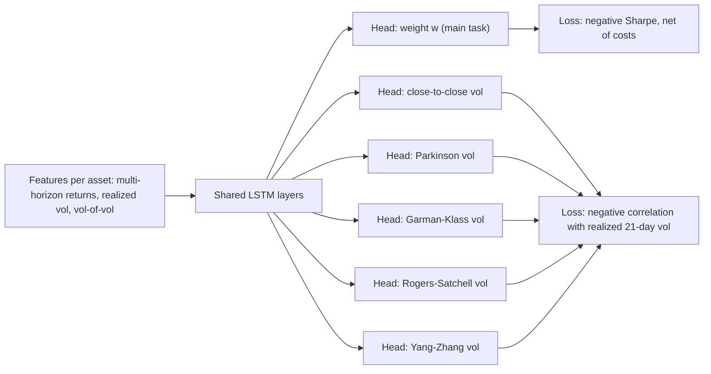

## Abstract

Time-series momentum strategies have two moving parts: a trend signal and a volatility estimate used to size the position. Classical pipelines build the two separately and multiply them. This paper replaces both with a single LSTM that outputs portfolio weights directly and is trained on the negative Sharpe ratio, net of transaction costs. The new ingredient is multi-task learning: five extra output heads must forecast each asset's 21-day forward volatility under five different range-based estimators, so that the shared representation is forced to carry forward-looking risk information. On 78 continuous futures contracts, with yearly retraining and an out-of-sample window from 2000 to 2020, the model reports a net Sharpe ratio of 0.81 against 0.59 for the classical rule. An ablation attributes part of that gain to the auxiliary tasks, although the single-task results are far from monotone.

**Keywords:** time-series momentum, multi-task learning, volatility scaling, Sharpe-ratio loss, LSTM, futures portfolios

## 1 Introduction

Time-series momentum (TSMOM), introduced by Moskowitz et al. (2012), bets that an asset whose own past return was positive keeps rising, and vice versa. It is almost always combined with volatility targeting: exposure is levered up when an asset is quiet and cut when it is turbulent, which limits the crash risk that unscaled momentum is known for. The authors start from an observation by Baltas and Kosowski (2012): the quality of the volatility estimator matters for the final performance, not only the quality of the trend signal.

Deep-learning versions of momentum already exist. Deep Momentum Networks (Lim et al., 2019) learn trend and sizing by optimising the Sharpe ratio, and the Momentum Transformer (Wood et al., 2021) swaps the LSTM for attention. What the authors find missing is any coupling between the return-generating part and the risk part: <mark>in existing work, the momentum signal and the volatility estimate are treated as independent components</mark>, and the only training signal is the Sharpe ratio. Multi-task learning had been used in finance for return forecasting and ranking, but, according to the paper, not for portfolio construction.

## 2 Background

The classical single-asset TSMOM return is

$$
r^{\mathrm{TSMOM},i}_{t,t+1} = \operatorname{sgn}\!\left(r^i_{t-252,t}\right)\,\frac{\sigma_{\mathrm{tgt}}}{\sigma^i_t}\, r^i_{t,t+1} \tag{1}
$$

where $r^i_{t-252,t}$ is asset $i$'s trailing one-year return, $r^i_{t,t+1}$ its next-day return, $\sigma_{\mathrm{tgt}}$ the annualised volatility target, and $\sigma^i_t$ an ex-ante volatility estimate (an exponentially weighted standard deviation with a 60-day span). The portfolio return is the plain average of Eq. (1) over the $S_t$ assets available at time $t$. The sign term is the "signal" and the ratio $\sigma_{\mathrm{tgt}}/\sigma^i_t$ is the "sizing"; the whole paper is about learning their product in one shot.

Multi-task learning with hard parameter sharing means one trunk network feeds several task-specific heads, and the gradients of all tasks update the trunk.

## 3 Method

> **Key idea.** Let the network output the portfolio weight directly (signal times sizing in one number), train it on the Sharpe ratio, and regularise the shared LSTM by also asking it to predict future volatility under several different estimators.

### 3.1 Architecture

Stacked LSTM layers encode the input features and are shared across tasks. On top sit six feed-forward heads: one for the portfolio weight and five for volatility forecasts.

The original schematic is [Fig. 1 in the paper](https://arxiv.org/pdf/2306.13661#page=6).

### 3.2 Main task: weights trained on net Sharpe

The head for the main task emits a weight $w^i_{t-1,t}$ for each asset. The realised portfolio return, including a linear cost on weight changes, is

$$
r^{\rho}_{t,t+1} = \frac{\sigma_{\mathrm{tgt}}}{S_t}\sum_{i=1}^{S_t}\left( w^i_{t-1,t}\, r^i_{t,t+1} - \tau\,\left|w^i_{t-1,t} - w^i_{t-2,t-1}\right| \right) \tag{2}
$$

with $\tau$ the transaction cost, fixed at 3 basis points. The main loss is the negative Sharpe ratio of this return stream,

$$
\mathcal{L}_{\mathrm{main}} = -\frac{\mathbb{E}[r^{\rho}]}{\sigma_{r^{\rho}}} \tag{3}
$$

where the expectation and standard deviation are taken over the training sample. <mark>Because costs sit inside the loss, turnover is penalised during training rather than discovered afterwards in the backtest.</mark> No expected-return forecast is ever produced.

### 3.3 Auxiliary tasks: five views of forward volatility

Each auxiliary head predicts the asset's 21-day forward volatility as measured by one estimator: close-to-close, Parkinson, Garman-Klass, Rogers-Satchell, or Yang-Zhang. The loss is scale-free, the negative Pearson correlation between prediction $y$ and realisation $\hat{y}$ (the paper's notation):

$$
\mathcal{L}_{\mathrm{corr}}(y,\hat{y}) = -\frac{S_{y,\hat{y}}}{S_y\, S_{\hat{y}}} \tag{4}
$$

where $S_{y,\hat y}$ is the sample covariance and $S_y, S_{\hat y}$ the sample standard deviations. Using correlation means the heads only have to get the ordering and co-movement of volatility right, not its level.

### 3.4 Total loss

$$
\mathcal{L}_{\mathrm{total}} = \mu\,\mathcal{L}_{\mathrm{main}} + \lambda \sum_{h\in H}\mathcal{L}_{\mathrm{aux},h}, \qquad \mu=\lambda=0.5 \tag{5}
$$

with $H$ the set of five auxiliary tasks. The weights are static; dynamic task weighting is left as future work.

## 4 Experiments

**Data and features.** Daily prices of 78 continuous futures (commodities, currencies, fixed income, equity indices) from the Stevens Continuous Futures feed, 1990 to 2020, backward-ratio adjusted. Inputs are deliberately plain: log returns over 1, 21, 63, 126 and 252 days, realised volatility over 5, 21, 63, 126 and 252 days, and a 21-day "vol of vol" of each of those. All are z-scored over a sliding 21-day window.

**Protocol.** Expanding-window retraining once per year, 20% of each training window held out for validation, 21 one-year test blocks stitched into a 2000-2020 out-of-sample record. Adam, up to 200 epochs with early stopping (patience 25), grid search over LSTM/MLP depth, width, dropout, learning rate and gradient-norm clipping. Benchmarks are the Moskowitz et al. TSMOM rule and CTA-MOM, the moving-average-crossover signal of Baz et al. (2015), both rebalanced daily. Every portfolio is rescaled to 10% annualised volatility.

Main results (net of 3 bps, January 2000 to December 2020, Table 2 of the paper):

| Strategy | Ann. return (%) | Sharpe | Sortino | Return / MaxDD | Max drawdown (%) | MaxDD period (days) | Recovery (days) | Positive days (%) |
|---|---|---|---|---|---|---|---|---|
| TSMOM | 5.54 | 0.59 | 0.83 | 0.28 | -19.88 | 432 | 385 | 53.44 |
| CTA-MOM | 1.66 | 0.21 | 0.31 | 0.04 | -41.63 | 3066 | N.A. | 51.44 |
| **MTL-TSMOM** | **7.90** | **0.81** | **1.20** | **0.38** | -21.00 | **103** | **42** | 51.62 |

<mark>MTL-TSMOM beats TSMOM by 236 bps and CTA-MOM by 624 bps of annualised return at equal target volatility.</mark> It does not win everywhere: its worst drawdown (-21.00%) is slightly deeper than TSMOM's (-19.88%), and its share of positive days is lower. Its advantage is in how quickly it recovers, 42 trading days against 385.

Ablation over auxiliary tasks (Table 3 of the paper):

| Auxiliary task | Ann. return (%) | Sharpe | Sortino | Max drawdown (%) |
|---|---|---|---|---|
| None | 6.63 | 0.69 | 1.02 | -36.54 |
| Close-to-close | 6.85 | 0.71 | 1.05 | -21.30 |
| Parkinson | 4.61 | 0.50 | 0.74 | -38.20 |
| Garman-Klass | 6.67 | 0.70 | 1.03 | -34.82 |
| Rogers-Satchell | 5.32 | 0.57 | 0.85 | -18.69 |
| Yang-Zhang | 7.03 | 0.73 | 1.08 | -25.66 |
| **All five (MTL-TSMOM)** | **7.90** | **0.81** | **1.20** | -21.00 |

<mark>The network with no auxiliary task already beats both benchmarks on Sharpe (0.69); adding all five heads lifts it to 0.81 and cuts the worst drawdown from -36.54% to -21.00%.</mark> But <mark>two of the five single auxiliary tasks (Parkinson and Rogers-Satchell) make the portfolio worse than having none</mark>, so the benefit comes from the combination, not from any one estimator.

**Equity correlation.** The 252-day rolling correlation with the MSCI US total return index stays between -0.24 and 0.28 for the proposed model, while the benchmarks swing between -0.77 and 0.81 ([Fig. 4 in the paper](https://arxiv.org/pdf/2306.13661#page=18)). In the 2008 crisis and the 2020 crash, the model is reported to outperform the equity index by 57% and 34.4% respectively ([Fig. 5](https://arxiv.org/pdf/2306.13661#page=19)). The cumulative-return and drawdown curves are in [Fig. 3](https://arxiv.org/pdf/2306.13661#page=14).

## 5 Discussion

**Strengths.** The design is coherent with how momentum funds actually work: the loss is the quantity one cares about, costs are inside it, and the auxiliary targets are chosen from domain knowledge rather than at random. The feature set is austere, which makes the ablation more believable, and code is released.

**Weaknesses.**

- The obvious deep baselines are absent. Deep Momentum Networks and the Momentum Transformer are both discussed in the introduction, yet the results tables contain only two rule-based strategies. The "None" row of the ablation is close in spirit to an LSTM trained on Sharpe, but it is not the published DMN configuration. The conclusion also mentions outperforming "multi-task benchmarks", and I could not find such benchmarks in the results.
- No dispersion is reported. Each row is a single training run per year, with no seeds, confidence intervals or tests on Sharpe differences. Given that swapping one volatility estimator for another moves the Sharpe from 0.50 to 0.73, the run-to-run noise could be of similar size to the claimed effect.
- The non-monotone ablation is not explained. If Parkinson volatility alone hurts, why does it help in the mix? The paper acknowledges that task selection is delicate but offers no analysis of gradient conflict or of how well each head actually forecasts.
- Auxiliary-task accuracy is never shown, so one cannot tell whether the heads learned anything or just act as noise regularisers.
- The abstract speaks of costs "up to" 3 bps, but only the single 3 bps setting is reported; there is no cost sensitivity sweep.

## 6 Takeaways

- Trend signal and position size can be learned as one output trained on net Sharpe; the classical sign-times-inverse-vol decomposition is not needed.
- Forward-volatility prediction is a natural auxiliary task for a portfolio network, and using several estimators at once worked better than any single one in this study.
- The evidence is a single 21-year backtest with no error bars and no deep-learning baseline, so the size of the multi-task gain should be read as indicative.
- For generative or stochastic modelling of financial series, the transferable point is modest but real: volatility targets computed from OHLC ranges are cheap, low-noise supervision that can shape a shared representation. Whether the same trick helps a conditional generative model of returns is not something this paper tests.

## References

1. Ong, J., Herremans, D. "Constructing Time-Series Momentum Portfolios with Deep Multi-Task Learning." arXiv:2306.13661, 2023 (accepted to Expert Systems with Applications).
2. Moskowitz, T., Ooi, Y. H., Pedersen, L. H. "Time series momentum." Journal of Financial Economics, 2012.
3. Lim, B., Zohren, S., Roberts, S. "Enhancing time-series momentum strategies using deep neural networks." 2019.
4. Wood, K., Giegerich, S., Roberts, S., Zohren, S. "Trading with the Momentum Transformer: An intelligent and interpretable architecture." 2021.
5. Baltas, A., Kosowski, R. "Improving time-series momentum strategies: The role of trading signals and volatility estimators." SSRN, 2012.
