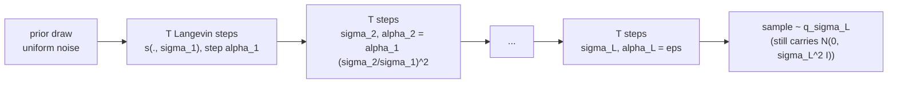

## Abstract

This paper builds a generative model out of the score $\nabla_x\log p_{\text{data}}(x)$ rather than the density: a network fitted by score matching, samples drawn by Langevin dynamics, which needs the score and nothing else. The contribution is less the recipe than the diagnosis of why it fails. On a low-dimensional data manifold the ambient gradient is undefined and the score-matching estimator is inconsistent; away from the data there is neither training signal for the estimator nor — a separate problem — any way for Langevin dynamics to recover the relative mass of well-separated modes. Gaussian perturbation fixes both, but only at a scale large enough to bridge modes, which is far too large to leave the data intact. The resolution is a geometric ladder of noise levels, one noise-conditional score network (NCSN) trained on all of them with a $\sigma^2$-weighted denoising loss, and an annealed Langevin sampler that descends the ladder, each level handing its last iterate to the next. On CIFAR-10 this reaches an Inception score of 8.87 and an FID of 25.32 with no adversarial training, and a three-line change to the sampler turns it into an inpainter.

**Keywords:** score matching, denoising score matching, Langevin dynamics, annealing, noise-conditional score network, manifold hypothesis, mixing time

## 1 Introduction

In 2019 the two dominant families of generative models each carried a structural cost. Likelihood-based models either constrain the architecture so the density stays normalized — autoregressive factorizations, invertible flows — or optimize a surrogate: the ELBO for VAEs, contrastive divergence for energy-based models. GANs drop normalization but pay with unstable adversarial optimization and an objective whose value cannot rank two trained models. Alternatives avoiding both, such as noise-contrastive estimation and minimum probability flow, were then known to work only in low dimension.

Modelling the score sidesteps normalization entirely. If $p(x)=\tilde p(x)/Z$ then $\nabla_x\log p(x)=\nabla_x\log\tilde p(x)$, so the partition function never appears and the network $s_\theta:\mathbb{R}^D\to\mathbb{R}^D$ can be anything that maps an image to an image. <mark>Training then needs no adversary, no MCMC inner loop, and no architectural constraint</mark>, and — the authors argue, though they never demonstrate it — the loss itself can compare models.

The catch, and the real content of the paper, is that "fit the score, then run Langevin" does not work on images. Sections 3.1 and 3.2 of the paper are a two-part diagnosis, and the method is the smallest mechanism that answers both parts at once. Everything that follows in this series — NCSNv2 computing the schedule instead of guessing it, [DDPM](/blog/ddpm/) rewriting the same loss as a variational bound, [Score-SDE](/blog/score-sde/) taking the ladder to a continuum — inherits this diagnosis rather than replacing it.

## 2 Background

**Score matching.** The obvious objective is explicit score matching,
$$
J_{\text{ESM}}(\theta)=\tfrac12\,\mathbb{E}_{p_{\text{data}}}\big\lVert s_\theta(x)-\nabla_x\log p_{\text{data}}(x)\big\rVert_2^2,
\tag{1}
$$
which is useless as written because the target is unknown. Hyvärinen's identity removes it. Expanding the square leaves a cross term $-\mathbb{E}_p[s_\theta\cdot\nabla\log p]=-\int \nabla p\cdot s_\theta\,dx$, and integrating by parts — exact provided $p\,s_\theta\to0$ at infinity — turns it into $+\mathbb{E}_p[\operatorname{tr}(\nabla_x s_\theta)]$. So up to a constant in $\theta$,
$$
J_{\text{ESM}}(\theta)\;=\;\mathbb{E}_{p_{\text{data}}(x)}\Big[\operatorname{tr}\big(\nabla_x s_\theta(x)\big)+\tfrac12\lVert s_\theta(x)\rVert_2^2\Big]+\text{const}.
\tag{2}
$$
The trace of the Jacobian costs $D$ backward passes, which for a $32\times32\times3$ image means 3,072 of them per example. Two scalable surrogates exist. *Sliced* score matching replaces $\operatorname{tr}(\nabla_x s_\theta)$ with $\mathbb{E}_v[v^\top\nabla_x s_\theta\,v]$ for $\mathbb{E}[vv^\top]=I$; it targets the score of the *clean* data and costs roughly four times a plain forward-backward pass. *Denoising* score matching (Vincent, 2011) perturbs $x$ with a known kernel $q_\sigma(\tilde x\mid x)$ and regresses onto the score of the kernel,
$$
\tfrac12\,\mathbb{E}_{p_{\text{data}}(x)}\mathbb{E}_{q_\sigma(\tilde x\mid x)}\big\lVert s_\theta(\tilde x)-\nabla_{\tilde x}\log q_\sigma(\tilde x\mid x)\big\rVert_2^2 .
\tag{3}
$$
The equivalence is exact: the cross term of Eq. (3) is $\iint p(x)q_\sigma(\tilde x\mid x)\,s_\theta(\tilde x)\cdot\nabla_{\tilde x}\log q_\sigma(\tilde x\mid x)$, which equals $\int s_\theta(\tilde x)\cdot\nabla_{\tilde x}q_\sigma(\tilde x)\,d\tilde x$, the cross term of explicit score matching against the *perturbed* density $q_\sigma(\tilde x)=\int q_\sigma(\tilde x\mid x)p_{\text{data}}(x)\,dx$. So the minimizer is $\nabla\log q_\sigma$, not $\nabla\log p_{\text{data}}$, and the two agree only in the limit of small $\sigma$. That bias is the whole tension of the paper.

**Langevin dynamics.** Given a score, a step size $\epsilon>0$ and $\tilde x_0$ from a prior, iterate
$$
\tilde x_t=\tilde x_{t-1}+\frac{\epsilon}{2}\,\nabla_x\log p(\tilde x_{t-1})+\sqrt{\epsilon}\,z_t,\qquad z_t\sim\mathcal N(0,I).
\tag{4}
$$
As $\epsilon\to0$ and $T\to\infty$, $\tilde x_T$ is a sample from $p$. For $\epsilon>0$ and finite $T$ a Metropolis–Hastings correction would be needed; the paper drops it and assumes the discretization error is negligible. Note the convention — drift $\epsilon/2$, noise $\sqrt\epsilon$. NCSNv2 writes the same chain as drift $\alpha$, noise $\sqrt{2\alpha}$, i.e. $\alpha=\epsilon/2$; the two papers' $\epsilon$ symbols are not the same quantity.

## 3 Method

> **Key idea.** Gaussian noise makes the score well defined everywhere and floods the empty regions between modes — but only *large* noise does that, and only *small* noise leaves the data recognizable. There is no single $\sigma$ that does both. So train one network on a whole ladder of $\sigma$'s and let the sampler descend it, each level handing the next a starting point that lies where the next level's score estimate is trustworthy.

### 3.1 Failure one: the score is undefined on a manifold

If $p_{\text{data}}$ concentrates on a $d$-dimensional manifold with $d<D$, then $\nabla_x\log p_{\text{data}}(x)$, a gradient taken in the ambient $\mathbb{R}^D$, does not exist in the directions normal to the manifold. Worse, the consistency of the score-matching estimator (Hyvärinen's Theorem 2) requires the support of $p_{\text{data}}$ to be all of $\mathbb{R}^D$; on a manifold the estimator is not merely hard to compute but inconsistent. The paper's evidence is a training curve: a ResNet trained by sliced score matching on raw CIFAR-10 sees its loss fall and then oscillate irregularly, while the same run on data perturbed by $\mathcal N(0,10^{-4}I)$ converges cleanly ([Fig. 1 in the paper](https://arxiv.org/pdf/1907.05600#page=3)). For pixels in $[0,1]$ that perturbation has standard deviation $0.01$ and is invisible.

That is suggestive rather than conclusive — an unstable loss curve is consistent with an ill-posed target but does not establish one.

### 3.2 Failure two: two different problems in low-density regions

*Estimation.* Objective (1) is an expectation under $p_{\text{data}}$. For any region $R$ with $p_{\text{data}}(R)\approx0$, the finite sample almost surely contains no point of $R$, so the loss places no constraint on $s_\theta$ there. On a 2-D mixture $p_{\text{data}}=\tfrac15\mathcal N((-5,-5),I)+\tfrac45\mathcal N((5,5),I)$ the fitted field is accurate only in the immediate neighbourhood of the two modes ([Fig. 2 in the paper](https://arxiv.org/pdf/1907.05600#page=4)).

*Mixing.* This is a separate failure and it survives a perfect score. Let $p_{\text{data}}=\pi p_1+(1-\pi)p_2$ with disjoint supports. On $\operatorname{supp}p_1$, $\nabla_x\log p_{\text{data}}(x)=\nabla_x(\log\pi+\log p_1(x))=\nabla_x\log p_1(x)$, and symmetrically on $\operatorname{supp}p_2$: <mark>the score is exactly independent of the mixing weight $\pi$</mark>. A sampler that consumes only the score therefore has no access to $\pi$ at all. With supports that merely nearly separate — the realistic case — the information is present but reachable only by crossing a region of vanishing density, which costs a mixing time that grows exponentially. The toy experiment confirms it with the *ground-truth* score: plain Langevin puts roughly equal mass on the two modes instead of $1{:}4$ ([Fig. 3 in the paper](https://arxiv.org/pdf/1907.05600#page=5)).

> **My comment.** This is the passage that worries me about regime-switching markets. TailFlow's synthetic market has two volatility regimes, and the stressed regime's share is exactly the kind of mode weight a score-based sampler can get wrong with a perfect score; conditioning on the volatility forecast should mostly protect it, but I would check the generated share of stressed paths against the chain's known stationary share before reading any ES.

Keeping these two apart matters. Noise at a given scale helps the first by putting probability mass where there was none; it helps the second only if the scale is comparable to the distance between modes. The second requirement is much more demanding, and it is precisely the one NCSNv2 later turns into a formula.

### 3.3 The NCSN objective

Fix a geometric sequence $\sigma_1>\sigma_2>\dots>\sigma_L$ with constant ratio $\sigma_{i}/\sigma_{i+1}$, with $\sigma_1$ large enough to address Section 3.2 and $\sigma_L$ small enough to leave the data visually unchanged. Let $q_\sigma(x)=\int p_{\text{data}}(t)\mathcal N(x\mid t,\sigma^2I)\,dt$. One network $s_\theta(x,\sigma)$ is asked to satisfy $s_\theta(x,\sigma_i)\approx\nabla_x\log q_{\sigma_i}(x)$ for every $i$.

With the Gaussian kernel, $\nabla_{\tilde x}\log q_\sigma(\tilde x\mid x)=-(\tilde x-x)/\sigma^2$, so Eq. (3) becomes, per level,
$$
\ell(\theta;\sigma)=\tfrac12\,\mathbb{E}_{p_{\text{data}}(x)}\,\mathbb{E}_{\tilde x\sim\mathcal N(x,\sigma^2I)}\Big\lVert s_\theta(\tilde x,\sigma)+\frac{\tilde x-x}{\sigma^2}\Big\rVert_2^2 ,
\tag{5}
$$
and the levels are combined as
$$
\mathcal L(\theta;\{\sigma_i\}_{i=1}^{L})=\frac1L\sum_{i=1}^{L}\lambda(\sigma_i)\,\ell(\theta;\sigma_i),\qquad \lambda(\sigma_i)>0 .
\tag{6}
$$
Eq. (6) is a conical combination of $L$ denoising objectives, so at infinite capacity its minimizer hits every level's true score simultaneously for *any* positive $\lambda$. $\lambda$ therefore has no effect on the optimum and every effect on the optimization: $\ell(\theta;\sigma)$ scales like $1/\sigma^2$, so with $\lambda\equiv1$ and $\sigma_1/\sigma_L=100$ the smallest level dominates the gradient by four orders of magnitude. The authors' choice comes from an empirical regularity — a well-trained score network satisfies $\lVert s_\theta(x,\sigma)\rVert_2\propto1/\sigma$ — and setting $\lambda(\sigma)=\sigma^2$ gives
$$
\lambda(\sigma)\,\ell(\theta;\sigma)=\tfrac12\,\mathbb{E}\Big\lVert \sigma s_\theta(\tilde x,\sigma)+\frac{\tilde x-x}{\sigma}\Big\rVert_2^2 ,
\tag{7}
$$
in which $(\tilde x-x)/\sigma\sim\mathcal N(0,I)$ and $\lVert\sigma s_\theta\rVert_2\propto1$, so each summand is of order one regardless of $\sigma$. Substituting $\tilde x=x+\sigma z$ with $z\sim\mathcal N(0,I)$ and defining $\varepsilon_\theta(\tilde x,\sigma)\triangleq-\sigma s_\theta(\tilde x,\sigma)$ turns Eq. (7) into $\tfrac12\mathbb{E}\lVert z-\varepsilon_\theta(x+\sigma z,\sigma)\rVert_2^2$. <mark>With the $\sigma^2$ weighting, the network is literally being trained to predict the standardized noise that was added</mark> — which is the [DDPM](/blog/ddpm/) objective, reached here a year earlier by a different route. Note what does the work: the $1/\sigma$ norm law is an observation, not a theorem, and every downstream choice rests on it.

### 3.4 Intuition: one data point, and two

The $1/\sigma$ law falls out of the simplest possible case. Take $p_{\text{data}}=\delta(x-a)$. Then $q_\sigma=\mathcal N(a,\sigma^2I)$, its score is $-(x-a)/\sigma^2$, and a typical draw has $\lVert x-a\rVert_2\approx\sqrt D\sigma$, so $\mathbb{E}\lVert\nabla\log q_\sigma\rVert_2\approx\sqrt D/\sigma$. The $1/\sigma$ is exact here; on real data it is an empirical extrapolation of this calculation. (NCSNv2 uses exactly this surrogate to justify replacing noise conditioning with a division by $\sigma$.)

Now two points in 1-D, $p_{\text{data}}=\pi\delta(x+a)+(1-\pi)\delta(x-a)$, and $q_\sigma$ the corresponding mixture of Gaussians. Langevin dynamics on $q_\sigma$ is diffusion in the potential $U=-\log q_\sigma$, and its mode-to-mode crossing time scales like $\exp(\Delta U)$ where $\Delta U$ is the barrier at the midpoint. For $\sigma\ll a$ the log-density at $x=0$ sits about $a^2/(2\sigma^2)$ below a mode, so the crossing time behaves like $\exp(a^2/2\sigma^2)$: at $\sigma=a/3$ that is already $e^{4.5}\approx90$ times a within-mode relaxation, at $\sigma=a/10$ it is $e^{50}$. Once $\sigma\gtrsim a$ the barrier is gone and the chain mixes in $O(1)$. This is the argument for annealing in one line: <mark>the top of the ladder needs $\sigma$ on the scale of the *distance between modes*, not on the scale of the data's own noise</mark>. It is also why $\sigma_1=1$ on CIFAR-10 turns out to be badly wrong — the follow-up measures the median pairwise distance between training images at about 18 and recommends $\sigma_1=50$.

### 3.5 Annealed Langevin dynamics and its step size

Start from a fixed prior (uniform noise in the experiments). For $i=1,\dots,L$ run $T$ steps of Eq. (4) with $s_\theta(\cdot,\sigma_i)$ substituted for the score and step size
$$
\alpha_i=\epsilon\cdot\sigma_i^2/\sigma_L^2 ,
\tag{8}
$$
then hand the final iterate to level $i+1$ as its initial point.

The scaling in Eq. (8) is derived, again, from the $1/\sigma$ law. The quantity the authors hold fixed is the ratio of the drift to the injected noise,
$$
\mathbb{E}\Big\lVert\frac{\alpha_i s_\theta(x,\sigma_i)}{2\sqrt{\alpha_i}\,z}\Big\rVert_2^2\;\approx\;\frac{\alpha_i}{4}\,\mathbb{E}\lVert s_\theta(x,\sigma_i)\rVert_2^2\;\propto\;\frac14\,\mathbb{E}\lVert\sigma_i s_\theta(x,\sigma_i)\rVert_2^2\;\propto\;\frac14 ,
\tag{9}
$$
where the middle step uses $\alpha_i\propto\sigma_i^2$ and the last uses $\lVert s_\theta\rVert\propto1/\sigma$. So each level is run at the same effective signal-to-noise ratio, and $\epsilon$ is a single global knob. This is a heuristic with an empirical premise, not a convergence guarantee; NCSNv2 replaces it with a closed-form calculation of how far the chain actually gets in $T$ steps.

Why the hand-off works: at $\sigma_1$ the modes are bridged and the field is well estimated nearly everywhere, so Langevin mixes; a sample of $q_{\sigma_i}$ then lies in a high-density region of the only slightly sharper $q_{\sigma_{i+1}}$, which is exactly where that level's score estimate saw training data. The chain never has to traverse a region the network has not seen. That "slightly" is load-bearing and entirely unquantified here; it becomes NCSNv2's Technique 2.

On the toy mixture annealed Langevin recovers the $1{:}4$ weights plain Langevin missed. A caution for reproducers: Section 4.3 states $L=10$, $\sigma_1=10$, $\sigma_{10}=0.1$ for that figure, while Appendix B.1 states $\sigma_1=20$, $\sigma_{10}=1$ (with $T=100$, $\epsilon=0.1$, 1,280 chains initialized uniformly on $[-8,8]^2$). The two are inconsistent; both satisfy $\sigma_1\gtrsim$ mode separation, which is the point.



### 3.6 Algorithm

```text
TRAIN
  input: data D, ladder {sigma_1 > ... > sigma_L}, network s(x, sigma)
  repeat:
      x  ~ D                                  # minibatch
      i  ~ Uniform{1..L}                      # unbiased estimator of the mean over levels in (6)
      z  ~ N(0, I)
      xt = x + sigma_i * z                    # perturb
      loss = 0.5 * || sigma_i * s(xt, sigma_i) + z ||^2     # = sigma_i^2 * l(theta; sigma_i)
      theta <- Adam step on loss

SAMPLE  (annealed Langevin)
  input: {sigma_i}, eps, T
  x <- Uniform([0,1]^D)                       # prior, NOT Gaussian
  for i = 1..L:
      a = eps * sigma_i^2 / sigma_L^2
      repeat T times:
          z ~ N(0, I)
          x <- x + (a/2) * s(x, sigma_i) + sqrt(a) * z
  return x                                    # no denoising step in this paper

INPAINT  (same loop, one extra line)
  input: image y, mask m (1 = observed)
  x <- Uniform([0,1]^D)
  for i = 1..L:
      a = eps * sigma_i^2 / sigma_L^2
      y_i = y + sigma_i * N(0, I)             # observed pixels, noised to level i
      repeat T times:
          z ~ N(0, I)
          x <- x + (a/2) * s(x, sigma_i) + sqrt(a) * z
          x <- x * (1 - m) + y_i * m          # re-impose the observation
  return x
```

The inpainting variant is worth pausing on: nothing is retrained, and the observation is injected *at the current noise level* rather than as clean pixels, so the conditioning stays consistent with the distribution the network was trained on. That is the ancestor of every replacement-based conditional sampler, including the imputation scheme in [CSDI](/blog/csdi/).

> **My comment.** This is close to how CASE continues an observed history: the prefix is re-clamped at every reverse step. The difference is that NCSN re-imposes the observation noised to the current level, while CASE gives every day its own noise level and holds observed days at zero, so the network is trained on that mixed state instead of being asked to tolerate it.

## 4 Implementation notes

| Item | As reported |
|---|---|
| Data range | pixels rescaled to $[0,1]$; random horizontal flip on CelebA and CIFAR-10 |
| CelebA preprocessing | center crop $140\times140$, resize $32\times32$ |
| Noise ladder | $L=10$, geometric, $\sigma_1=1$, $\sigma_{10}=0.01$ (ratio $\sigma_i/\sigma_{i+1}=100^{1/9}\approx1.67$) |
| Loss weight | $\lambda(\sigma)=\sigma^2$ |
| Backbone | 4-cascade RefineNet (U-Net variant with ResNet blocks), pre-activation residual blocks |
| Normalization | CondInstanceNorm++ before every conv and pooling layer; all BatchNorm removed |
| Pooling / activation | average pooling in place of max pooling in Refine blocks; ELU throughout |
| Dilation | replaces every subsampling layer except the first; doubled at each cascade |
| Width | 128 filters in the first cascade, doubled for later cascades; halved for MNIST |
| Optimizer | Adam, lr $10^{-3}$, batch 128, 200,000 iterations, checkpoint every 5,000 |
| Model selection | lowest FID on 1,000 samples across checkpoints (MNIST: final checkpoint) |
| Sampler | $T=100$, $\epsilon=2\times10^{-5}$, uniform-noise prior; $L\cdot T=1{,}000$ NFEs/sample |
| Sampler robustness | insensitive to $T$; $\epsilon\in[5\times10^{-6},5\times10^{-5}]$ reported to work |
| Metrics | Inception and FID on 50,000 samples, official OpenAI / TTUR code |
| Compute | 2× Titan XP for CelebA and CIFAR-10, 1× for MNIST |
| Wall-clock training and sampling time | not stated |
| EMA of weights | not used (added in NCSNv2) |

**CondInstanceNorm++.** Conditional instance normalization computes per-feature-map spatial statistics $\mu_k,s_k$ and applies $z_k=\gamma[i,k](x_k-\mu_k)/s_k+\beta[i,k]$, $i$ indexing the noise level. That discards $\mu_k$ entirely, and the reported consequence is shifted colours in samples. The fix restores a normalized copy of it,
$$
z_k=\gamma[i,k]\,\frac{x_k-\mu_k}{s_k}+\beta[i,k]+\alpha[i,k]\,\frac{\mu_k-m}{v},
\tag{10}
$$
where $m,v$ are the mean and standard deviation of $\{\mu_k\}_k$ and $\alpha\in\mathbb{R}^{L\times C}$ is learned. Three tables of size $L\times C$ means <mark>conditioning memory grows linearly in $L$</mark> — tolerable at $L=10$, fatal at the $L=232$ that NCSNv2 derives.

**Easy to get wrong when reproducing.**
1. The Langevin convention. Drift $\alpha_i/2$ with noise $\sqrt{\alpha_i}$ here; drift $\alpha_i$ with noise $\sqrt{2\alpha_i}$ in NCSNv2 and most later code. Copying $\epsilon=2\times10^{-5}$ across conventions silently doubles the step.
2. Dropping $\lambda(\sigma)=\sigma^2$. Without it the $\sigma_{10}=0.01$ term is $10^4$ times the $\sigma_1=1$ term and the large levels are never learned — which removes exactly the levels that make the sampler mix.
3. The prior is uniform on $[0,1]^D$, not $\mathcal N(0,\sigma_1^2I)$ — roughly the right scale only because $\sigma_1=1$ matches the data range.
4. The returned sample is a draw from $q_{\sigma_L}$, so it still carries $\mathcal N(0,\sigma_L^2I)$ noise. Invisible at $\sigma_L=0.01$, but not invisible to FID.

## 5 Experiments

**Setup.** MNIST, CelebA ($32\times32$ after cropping) and CIFAR-10, all unconditional, all at $32\times32$ or below.

**Main result — CIFAR-10 (Table 1 of the paper).**

| Model | Inception ↑ | FID ↓ |
|---|---|---|
| *Unconditional* | | |
| PixelCNN | 4.60 | 65.93 |
| PixelIQN | 5.29 | 49.46 |
| EBM | 6.02 | 40.58 |
| WGAN-GP | 7.86 ± .07 | 36.4 |
| MoLM | 7.90 ± .10 | **18.9** |
| SNGAN | 8.22 ± .05 | 21.7 |
| ProgressiveGAN | 8.80 ± .05 | – |
| **NCSN** | **8.87 ± .12** | 25.32 |
| *Class-conditional* | | |
| EBM | 8.30 | 37.9 |
| SNGAN | 8.60 ± .08 | 25.5 |
| BigGAN | 9.22 | 14.73 |

**Ablation (Appendix C.1).** The single-level baseline uses the *same* network conditioned on one level, $\{\sigma_1=0.01\}$, sampled with plain Langevin at $\epsilon=2\times10^{-5}$ and $T=1{,}000$. It produces no recognizable images on any of the three datasets. This is the only controlled ablation in the paper.

**Claim-by-claim.**

- *"State-of-the-art unconditional Inception score, 8.87."* Supported by Table 1; 8.87 beats the conditional EBM (8.30) and conditional SNGAN (8.60), not BigGAN (9.22). But the checkpoint was chosen by FID on 1,000 samples, and the same model's FID of 25.32 sits in SNGAN's neighbourhood, well behind MoLM's 18.9. A best-in-table IS with a middling FID is what residual $\sigma_L$ noise would produce — which NCSNv2 later confirms by adding a denoising step.
- *"Samples comparable to GANs on MNIST, CelebA and CIFAR-10."* Only CIFAR-10 has numbers; the other two are sample grids, on the stated ground that preprocessing differs across papers. Honest, but two thirds of the claim stays qualitative.
- *"The multi-scale ladder and annealing are necessary."* The $\{\sigma=0.01\}$ baseline fails, so *some* large noise is necessary — but this does not separate the two ingredients. There is no run with multi-scale training and non-annealed sampling, and no sweep over $L$.
- *"Langevin cannot recover mode weights."* The strongest result in the paper, because Fig. 3 uses the exact score: the failure is pinned on the sampler with no estimation error to hide behind.
- *"The manifold hypothesis breaks score matching."* Fig. 1's loss stabilizes under $\mathcal N(0,10^{-4}I)$ — consistent with the theory, not a measurement of it.
- *"The objective allows principled model comparison."* Asserted in the introduction and again in the conclusion; <mark>no experiment in the paper ever compares two models by their score-matching loss</mark>.
- *"The model learns meaningful representations"* and *"is not memorizing."* Inpainting (Fig. 6) is diverse and handles arbitrary masks, unlike raster-order autoregressive models; nearest neighbours in pixel $\ell_2$ and Inception-V3 feature space (Figs. 9–10) look distinct. Both are eyeballed, with no metric, and nearest-neighbour checks are a weak test of memorization.

## 6 Limitations

**Stated by the authors.**
- The Metropolis–Hastings correction is dropped; the finite-$\epsilon$, finite-$T$ chain has no guarantee, and the error is *assumed* negligible.
- Denoising score matching estimates $\nabla\log q_\sigma$, which approximates $\nabla\log p_{\text{data}}$ only for small $\sigma$ — an admitted bias the ladder manages rather than removes.
- Architecture design is restricted to images; other modalities are left as future work.

**My reading.**
- The diagnosis is never used for calibration. §3.2 argues that modes separated by low density cannot be weighted correctly, and then $\sigma_1$ is picked with no reference to how far apart the data actually are; one year later the successor shows $\sigma_1=1$ is off by a factor of 50 on CIFAR-10 and $L=10$ by a factor of 23.
- Everything else is heuristic too: $\epsilon$, $T$, and both $\lambda(\sigma)=\sigma^2$ and $\alpha_i\propto\sigma_i^2$, which rest on the empirical claim $\lVert s_\theta\rVert\propto1/\sigma$ rather than a derivation.
- Sampling costs 1,000 sequential network evaluations for a $32\times32$ image, with no way to trade quality for speed.
- Evaluation is thin: one dataset with metrics, nothing above $32\times32$, no likelihoods, one ablation. Model selection uses 1,000-sample FID, which — as NCSNv2 documents — is a noisy criterion applied to a sequence whose FID fluctuates strongly between checkpoints, with no EMA to damp it.
- The two toy-mixture $\sigma$ ladders disagree between the main text and Appendix B.1 (see §3.5).

## 7 Extensions

**What was built on this.** NCSNv2 replaces every hand-set constant here with a rule computed from the data and scales the model to $256\times256$. [DDPM](/blog/ddpm/) reaches Eq. (7)'s noise-prediction loss from a variational bound on a discrete forward chain; its simplified objective is Eq. (6) with a particular $\lambda$. [Score-SDE](/blog/score-sde/) takes $L\to\infty$ and identifies NCSN's ladder as the Variance Exploding SDE and DDPM's as the Variance Preserving one, making annealed Langevin one discretization among several and adding a probability-flow ODE that yields the likelihoods this paper cannot. DDIM and EDM attack the 1,000-NFE cost, EDM by treating the $\sigma$-parameterization, preconditioning and schedule as design axes; Improved DDPM revisits schedule and loss weighting; [Consistency Models](/blog/consistency-models/) push toward one evaluation. [CSDI](/blog/csdi/) and [TimeGrad](/blog/timegrad/) carry the machinery to time series, and DSB replaces the fixed Gaussian ladder with a learned bridge.

**Open problems the paper leaves.**
- How should $\sigma_1$, $L$, $\epsilon$ and $T$ be chosen, and can the annealed chain be corrected or accelerated without re-coupling training to sampling? NCSNv2 answers the first for Gaussian kernels only.
- Is there a bound relating per-level score-estimation error to the distance between the sampler's output and $p_{\text{data}}$? Nothing connects training loss to sample quality — awkward, given the claim that the loss can rank models.
- Must the perturbation be Gaussian? The two failure modes ask only for full support and for bridging modes; the kernel is Gaussian because that makes Eq. (5)'s target closed-form.
- Does $\lVert s_\theta\rVert\propto1/\sigma$ hold off image data, or does it depend on natural images being roughly isotropic at a given scale?

**Research directions.** *These are ideas, not results — none has been run.*

1. **Anisotropic ladders for return panels.** *Hypothesis:* an isotropic $\sigma$ ladder is mismatched to a panel of $D$ daily asset returns, whose leading principal component carries orders of magnitude more variance than the trailing ones — a single $\sigma$ is at once too large for the market factor and too small for idiosyncratic residuals. A kernel $\mathcal N(0,\sigma^2\Sigma)$ with $\Sigma$ a shrinkage covariance should need fewer levels for the same quality. *Data:* daily returns of a fixed large-cap universe, rolling windows, $D$ in the low hundreds. *Baseline:* isotropic ladder with $\sigma_1$ set from pairwise distances on the same data. *Metric:* energy distance and Wasserstein-1 on marginals, plus the sample covariance eigenvalue spectrum against the empirical one. *Likely failure mode:* $\Sigma$ fitted on the training window leaks information and flatters the spectrum comparison, and whitening a heavy-tailed panel amplifies the tails one wants to model.
2. **Tail-weighted level weighting.** *Hypothesis:* §3.2's mode-weight pathology is the generative analogue of a risk model that gets the shape of a crash right and its probability wrong; upweighting the levels whose perturbed density covers the tail region, in place of $\lambda(\sigma)=\sigma^2$, should improve tail calibration at some cost to the bulk. *Data:* a multivariate return panel with a labelled crisis subperiod held out. *Baseline:* the same network with $\lambda(\sigma)=\sigma^2$. *Metric:* out-of-sample VaR/ES coverage at 99% and 99.5%, plus a bulk-fidelity check so the trade-off is visible. *Likely failure mode:* no $\lambda$ helps — if the deficit is in the sampler's mixing rather than the estimator's weighting, reweighting the loss changes nothing, which is exactly the distinction §3.2 draws and which this would actually test.
3. **Measuring the hand-off instead of assuming it.** *Hypothesis:* the claim that samples of $q_{\sigma_{i-1}}$ land in high-density regions of $q_{\sigma_i}$ is measurable on a surrogate where $q_\sigma$ is closed-form (an empirical Gaussian mixture on training images), and the ladder density at which annealing breaks should coincide with the point where that overlap collapses. *Data:* CIFAR-10 with the empirical-mixture surrogate, so exact scores and densities are both available. *Baseline:* the paper's $L=10$ ladder against progressively denser ones. *Metric:* per-level radial overlap against final sample quality. *Likely failure mode:* with finite $N$ the surrogate is far spikier than the true $q_\sigma$, so a clean result on it may say nothing about a trained network.

## 8 Takeaways

- Model the score, not the density: no normalizing constant, no architectural constraint, no adversary, and training fully decoupled from sampling — any score estimator pairs with any score-based sampler, and the loss never simulates a chain.
- Noise here is not regularization but what makes the estimation problem well posed at all, and the real insight is that no single scale can be both large enough to bridge modes and small enough to preserve the data.
- The $\sigma^2$-weighted denoising loss *is* noise prediction, $\tfrac12\mathbb{E}\lVert z-\varepsilon_\theta(x+\sigma z,\sigma)\rVert^2$: a discrete ladder plus a sampler that descends it is the template DDPM reformulates as a reverse Markov chain and Score-SDE as a reverse-time SDE.
- For a mixture with disjoint supports the score is exactly independent of the mixing weights, so *exact gradients do not fix mixing*. Anyone sampling a multimodal target with gradient-based MCMC should know this before trusting the mode proportions.
- The weakest link is that the diagnosis is never used for calibration: the paper argues $\sigma_1$ must match the distance between modes, then sets $\sigma_1=1$ on data whose median pairwise distance is about 18. Read it next to NCSNv2 — one paper finds the mechanism, the next measures it.
- For financial time series both failure modes transfer directly. Return panels sit close to a low-dimensional factor structure, so the manifold argument is not a metaphor, and the regimes that matter most for risk are by construction the low-density regions where a single-scale score has no training signal and a gradient-based sampler cannot recover relative frequency. Motivation for multi-scale noise in this domain, not evidence: the paper tests images only.

## References

1. Y. Song, S. Ermon. *Generative Modeling by Estimating Gradients of the Data Distribution.* NeurIPS 2019. arXiv:1907.05600.
2. A. Hyvärinen. *Estimation of Non-Normalized Statistical Models by Score Matching.* JMLR 6:695–709, 2005.
3. P. Vincent. *A Connection Between Score Matching and Denoising Autoencoders.* Neural Computation 23(7):1661–1674, 2011.
4. Y. Song, S. Garg, J. Shi, S. Ermon. *Sliced Score Matching: A Scalable Approach to Density and Score Estimation.* UAI 2019.
5. J. Sohl-Dickstein, E. Weiss, N. Maheswaranathan, S. Ganguli. *Deep Unsupervised Learning using Nonequilibrium Thermodynamics.* ICML 2015.
6. G. Lin, A. Milan, C. Shen, I. Reid. *RefineNet: Multi-Path Refinement Networks for High-Resolution Semantic Segmentation.* CVPR 2017.
7. M. Welling, Y. W. Teh. *Bayesian Learning via Stochastic Gradient Langevin Dynamics.* ICML 2011.
