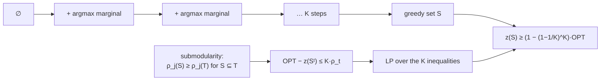

## Abstract

A set function $z$ on subsets of a finite ground set $N$ is *submodular* if $z(S)+z(T)\ge z(S\cup T)+z(S\cap T)$ for all $S,T$, equivalently if the incremental value $\rho_j(S)=z(S\cup\{j\})-z(S)$ is non-increasing in $S$ — diminishing returns. This paper takes the problem $\max\{z(S):\lvert S\rvert\le K\}$, which is NP-hard and contains uncapacitated facility location and a matroid colouring problem as special cases, and analyses what the obvious algorithm gives you. The greedy heuristic adds at each step the element of largest incremental value. **Theorem 4.2**: for non-decreasing $z$ with $z(\emptyset)=0$,

$$
\frac{Z-Z^G}{Z}\le\left(\frac{K-1}{K}\right)^{\!K}
\quad\Longleftrightarrow\quad
Z^G\ \ge\ \left[1-\left(\frac{K-1}{K}\right)^{\!K}\right]Z\ \ge\ \left(1-\tfrac1e\right)Z,
$$

and the bound is attained for every $K$. The proof technique is worth as much as the theorem: submodularity yields a family of $K$ linear inequalities relating the optimum to the greedy increments, and the worst case is found by *solving a linear program* over them. The paper does the same for local-search interchange (ratio $K/(2K-R)$), for an LP relaxation in the matroid case, and for partial enumeration combined with any heuristic. It is the origin of the constant that every subsequent submodular-maximisation result is measured against.

**Keywords:** submodular set function, diminishing returns, greedy heuristic, worst-case approximation bound, matroid, uncapacitated location, LP relaxation

## 1 Introduction

The paper arrives at submodularity from below, not above. Cornuéjols, Fisher and Nemhauser had bounded heuristics for uncapacitated facility location, where

$$
z(S)=\sum_{i\in I}\max_{j\in S}c_{ij},\qquad z(\emptyset)=0, \tag{1}
$$

is the total benefit of opening the facilities in $S$, each customer $i$ served by its best open facility. The question is what property of (1) made those bounds work. The answer is three lines. For $R\subseteq S$ and $k\notin S$,

$$
\max_{j\in S\cup\{k\}}c_{ij}-\max_{j\in S}c_{ij}
=\max\Bigl(0,\;c_{ik}-\max_{j\in S}c_{ij}\Bigr)
\le\max\Bigl(0,\;c_{ik}-\max_{j\in R}c_{ij}\Bigr)
=\max_{j\in R\cup\{k\}}c_{ij}-\max_{j\in R}c_{ij}, \tag{2}
$$

because $\max_{j\in S}c_{ij}\ge\max_{j\in R}c_{ij}$. Summing over $i$:

$$
z(S\cup\{k\})-z(S)\ \le\ z(R\cup\{k\})-z(R),\qquad R\subseteq S\subseteq N,\ k\in N\setminus S. \tag{3}
$$

A new facility is worth less when you already have many. That is the *only* property of (1) the bounds used, so the right object of study is the general problem

$$
\max_{S\subseteq N}\{z(S):\lvert S\rvert\le K,\ z\ \text{submodular}\}. \tag{4}
$$

Two structural remarks are made immediately and both are worth keeping. *When $z$ is non-decreasing the cardinality constraint is necessary in* (4) *to obtain a nontrivial problem* — otherwise take $S=N$. And *when $z$ does not satisfy* monotonicity, *the problem is interesting even without the cardinality constraint*. Also: *although our results apply to arbitrary submodular functions, they are much sharper for non-decreasing submodular functions.*

The matroid framing is where the generality shows. Let $\mathcal{M}=(E,\mathcal{F})$ be a matroid with weights $c_e$, and $v(E')=\max_{F\in\mathcal{F}(E')}\sum_{e\in F}c_e$. Then $v$ is submodular and non-decreasing — but maximising it needs no approximation at all, since *it is well-solved by a simple greedy algorithm*, which is the classical matroid greedy. Now colour the elements, partitioning $E$ into $\{Q_j\}_{j\in N}$, and ask for a maximum-weight independent set using at most $K$ colours:

$$
z(S)=v\Bigl(\bigcup_{j\in S}Q_j\Bigr). \tag{5}
$$

*Thus the matroid optimization problem of finding a maximum weight independent set that contains no more than $K$ colors is a case of* (4). Facility location is (5) for the partition matroid. And the authors say plainly where the paper came from: *the result obtained in this indirect and tedious way provided impetus for our work.*

Why this is the foundational paper for the series: it fixes the constant $1-1/e$ that every later result quotes, it introduces the LP-based proof technique that later analyses reuse, and it establishes the pattern — identify a structural property, prove a worst-case ratio, exhibit a matching instance — that the whole area follows. For subset selection in general, which is where I care about this, it is the reason forward selection is ever defensible rather than merely convenient: *if* your objective is monotone submodular, the greedy set is provably within 37% of the best possible, for every instance, with no assumptions on the data.

## 2 Background: what submodularity is

**Definition.** $z(A)+z(B)\ge z(A\cup B)+z(A\cap B)$ for all $A,B\subseteq E$.

Proposition 2.1 gives seven equivalent characterisations. The two that get used constantly:

$$
\textbf{(ii)}\quad \rho_j(S)\ge\rho_j(T)\quad\forall\,S\subseteq T\subseteq E,\ j\in E\setminus T, \tag{6}
$$

$$
\textbf{(v)}\quad z(T)\le z(S)+\sum_{j\in T\setminus S}\rho_j(S)\quad\forall\,S\subseteq T\subseteq E. \tag{7}
$$

(6) is diminishing returns, and the equivalence with the definition is four lines in each direction — forward, set $A=S\cup\{j\}$, $B=T$; backward, enumerate $A\setminus B=\{j_1,\dots,j_r\}$ and telescope. (7) is the inequality that makes every approximation proof work: the value of a *bigger* set is bounded by the value of a smaller one plus the sum of the individual marginal gains measured at the smaller one. It is submodularity's version of a first-order concavity bound, and the paper says so: *submodularity is in some sense a combinatorial analogue of concavity.*

That analogy is the right intuition but it is not an identity, and it is worth being precise about the asymmetry: for concave functions both minimisation over a convex set is hard and maximisation is easy; for submodular set functions it is *minimisation* that is polynomial-time solvable and *maximisation* that is NP-hard. The concavity analogy governs the shape of the inequalities, not the difficulty.

The paper also collects three classes of combinatorial problems expressible as (4): those from matroids (as above), those from the assignment problem, and those from boolean polynomials.

## 3 Method

> **Key idea.** Diminishing returns means that at every step of the greedy run, the optimum's remaining value is bounded by $K$ times the gain the greedy algorithm is about to take. That single inequality, written down at every step, is a linear system relating the greedy increments to the optimum — and the worst case is the solution of a linear program over it.

### 3.1 The algorithm and the class $C(\theta)$

**Greedy.** $S^0=\emptyset$, $N^0=N$, $t=1$. At iteration $t$, pick $i(t)\in N^{t-1}$ maximising $\rho_i(S^{t-1})$, ties broken arbitrarily, and set $\rho_{t-1}=\rho_{i(t)}(S^{t-1})$. If $\rho_{t-1}\le0$, stop with $K^\ast=t-1<K$. Otherwise set $S^t=S^{t-1}\cup\{i(t)\}$ and continue until $t=K$. So

$$
Z^G=z(\emptyset)+\rho_0+\cdots+\rho_{K^\ast-1}.
$$

The stopping rule matters: greedy halts early if no element has positive marginal value, which for a non-monotone $z$ is the right thing to do.

**The class $C(\theta)$** collects submodular functions with $\rho_j(S)\ge-\theta$ for all $S$ and $j\notin S$. $\theta=0$ is the monotone case; larger $\theta$ bounds how negative a marginal gain can get. This parameterisation lets one theorem cover monotone and non-monotone objectives, and it is almost entirely forgotten downstream — nearly every citation of this paper uses only the $\theta=0$ corollary.

### 3.2 The key inequality

**Proposition 4.1.** For $z\in C(\theta)$ with $\theta\ge0$,

$$
Z\le z(\emptyset)+\sum_{i=0}^{t-1}\rho_i+K\rho_t+t\theta,\qquad t=0,\dots,K^\ast-1, \tag{8}
$$

and if $K^\ast<K$, also $Z\le z(\emptyset)+\sum_{i=0}^{K^\ast-1}\rho_i+K^\ast\theta$.

The proof is (7) plus three facts. Take $T$ an optimal solution and $S=S^t$ the greedy set after $t$ steps. Then $z(T)\le z(S^t)+\sum_{j\in T\setminus S^t}\rho_j(S^t)+\lvert S^t\setminus T\rvert\theta$; each $\rho_j(S^t)\le\rho_t$ because $\rho_t$ is the *maximum* marginal gain available at that point; there are at most $K$ terms in the sum because $\lvert T\rvert\le K$; and $z(S^t)=z(\emptyset)+\sum_{i<t}\rho_i$.

Read (8) at $t=0$: $Z-z(\emptyset)\le K\rho_0$, i.e. **the whole optimum is at most $K$ times the first greedy gain**. That is the entire idea in one line, and everything else is bookkeeping over the remaining steps.

Two immediate consequences:

- **Proposition 4.2.** If $z$ is non-decreasing and greedy stops after $K^\ast<K$ steps, *the greedy solution is optimal.* Running out of positive marginal gains is a certificate, not a failure.
- **Proposition 4.3.** $(Z-Z^G)/(Z-z(\emptyset))\le(K-1)/K$ — from $t=0$ alone. True and weak: for $K=10$ it permits the greedy solution to be 10% of the optimum.

### 3.3 The LP that finds the worst case

The step from Proposition 4.3 to the real bound is the paper's methodological contribution. The inequalities (8), one per $t$, constrain the vector of greedy increments. Ask: over all $(\rho_0,\dots,\rho_{K-1})$ satisfying them, how small can $\sum_i\rho_i$ be? That is a linear program, and Lemma 4.1 solves it in closed form. With $\alpha=(K-1)/K$ and $b=\theta/(Z-z(\emptyset)+K\theta)$, the LP value is

$$
P(b)=\begin{cases}1-(j+1)b, & b\le\alpha^{j+1}/K,\\[2pt] 1+(K-j-1)b-\alpha^{j+1}, & b\ge\alpha^{j+1}/K,\end{cases}
\qquad
\min_{b\ge0}P(b)=1-\frac{j+1}{K}\,\alpha^{j+1},\ \text{at}\ b=\frac{\alpha^{j+1}}{K}. \tag{9}
$$

This is a *factor-revealing* LP: rather than guessing the extremal instance and verifying it, you characterise the worst case as the optimum of a linear program over the constraints that submodularity forces. The method reappears throughout approximation algorithms.

### 3.4 The theorems

**Theorem 4.1** gives a family of $K$ bounds, each tight on its own interval of $b=\theta/(Z-z(\emptyset)+K\theta)$: if $\alpha^{k+1}/K\le b\le\alpha^k/K$ then

$$
\frac{Z-Z^G}{Z-z(\emptyset)+K\theta}\ \le\ \alpha^{k+1}-\frac{\theta(K-k-1)}{Z-z(\emptyset)+K\theta}\ \le\ \alpha^{k+1},\qquad k=0,\dots,K-1, \tag{10}
$$

with part (c) exhibiting *a family of problems* attaining the first inequality with equality, and with $K^\ast=k+1$. Part (a) bounds things by $K^\ast$ and, since the right-hand side increases with $K^\ast$, setting $K^\ast=K$ gives the headline:

**Theorem 4.2.** For $z\in C(\theta)$,

$$
\boxed{\ \frac{Z-Z^G}{Z-z(\emptyset)+K\theta}\ \le\ \left(\frac{K-1}{K}\right)^{\!K}\ } \tag{11}
$$

and with $\theta=0$, $z(\emptyset)=0$, that is $Z^G\ge\bigl[1-(1-1/K)^K\bigr]Z$. The bracket is $0.75$ at $K=2$, $0.7037$ at $K=3$, $0.6513$ at $K=10$, and decreases monotonically to $1-1/e=0.6321$. *This bound can be achieved for each $K$ and has a limiting value of $(e-1)/e$.*

Both halves matter. The bound holds for *every* instance — no distributional assumption, no condition on the data — and it cannot be improved for this algorithm, because matching instances exist at every $K$.

### 3.5 The other three results

**Interchange (local search), §5.** Start from an arbitrary $S$ with $\lvert S\rvert=K$ and repeatedly swap up to $R$ elements of $S$ for $R$ elements of $N\setminus S$ whenever that improves $z$; stop at a local optimum. When $R$ divides $K$,

$$
\frac{Z^{I(R)}}{Z}\ \ge\ \frac{K}{2K-R}. \tag{12}
$$

At $R=1$ — single swaps — this is $K/(2K-1)$, essentially $1/2$: local search with single swaps is strictly worse than greedy. At $R=K$ it is $1$, trivially, since you may replace the entire set.

**LP relaxation, §6.** For the matroid case, (4) can be written as an integer program, and for a class including facility location,

$$
\frac{Z^G}{Z^{\mathrm{LP}}}\ \ge\ 1-\left(\frac{K-1}{K}\right)^{\!K}. \tag{13}
$$

This is stronger than (11) in a way easy to miss: the greedy value is within $1-1/e$ of a *computable upper bound*, not merely of the unknown optimum. Solve the LP, run greedy, and you have a certified gap for the instance in front of you rather than a worst-case promise.

**Partial enumeration, §7.** Given any heuristic with ratio $\ge1-\beta(K)$, enumerate all $\binom{\lvert N\rvert}{R}$ subsets of size $R$, apply the heuristic to each of the $\binom{\lvert N\rvert}{R}$ residual problems with $K$ replaced by $K-R$, and take the best:

$$
\frac{Z^{\text{$R$-enum}+\text{heuristic}}}{Z}\ \ge\ 1-\left(\frac{K-R}{K}\right)\beta(K-R). \tag{14}
$$

A knob trading exponential-in-$R$ time for a better constant.

### 3.6 Algorithm

```text
GREEDY for  max { z(S) : |S| <= K },  z monotone submodular, z(empty) = 0
  S = {}
  for t = 1..K:
      # n - |S| evaluations of z this round; O(nK) in total
      j* = argmax_{j in N \ S}  ( z(S + j) - z(S) )
      gain = z(S + j*) - z(S)
      if gain <= 0: break                      # Prop 4.2: for monotone z this certifies optimality
      S = S + j*
  return S                                     # Thm 4.2: z(S) >= (1 - (1-1/K)^K) * OPT >= 0.632 * OPT

WHY IT WORKS, at t = 0:
  OPT  <=  z(S_0) + sum over j in OPT of rho_j(S_0)      # submodularity, char. (v)
       <=  z(S_0) + K * (largest available marginal)      # |OPT| <= K, greedy takes the largest
  ... written at every t and minimised as an LP gives (1 - 1/K)^K.
```



## 4 Implementation notes

- **The oracle is implicit.** $z$ is assumed evaluable at any set, with no accounting of that cost. The greedy algorithm as written performs $\sum_{t=0}^{K-1}(n-t)=O(nK)$ evaluations, which is the practical bottleneck in every application and is not mentioned. The submodularity that gives the guarantee also permits a large constant-factor reduction in that count — [lazy evaluation](/blog/celf/), published the same year by Minoux and popularised much later.
- **Ties are broken arbitrarily**, and the bound holds regardless, so $Z^G$ is not unique but every greedy solution satisfies (11).
- **Everything is exact worst-case analysis.** There is not a single computational experiment in the paper, and there are no instances beyond the adversarial families constructed to show tightness.
- **The tightness families are constructions, not data.** Part (c) of Theorem 4.1 exhibits problems attaining the bound; §5 does the same for interchange via a class of uncapacitated location instances.
- **$\theta$ must be known** to use the non-monotone bounds (10)–(11), and for a general submodular function it is itself a maximisation over all $(S,j)$.

## 5 Results

There are no experiments. What the paper establishes, and what each claim rests on:

| Result | Statement | Basis | Tight? |
|---|---|---|---|
| Prop. 4.2 | monotone $z$, greedy stops at $K^\ast<K$ $\Rightarrow$ greedy is optimal | (8) with $\theta=0$ | exact, not a bound |
| Prop. 4.3 | $Z^G\ge Z/K$-ish, ratio $\ge1/K$ | (8) at $t=0$ | weak |
| **Thm. 4.2** | $Z^G\ge\bigl[1-(1-1/K)^K\bigr]Z\ge(1-1/e)Z$ | LP over all of (8) | **yes, for each $K$** |
| Thm. 4.1 | family of $K$ bounds parameterised by $\theta$ | Lemma 4.1 LP | yes, on each interval |
| §5 | $R$-interchange $\ge K/(2K-R)$ when $R\mid K$ | direct | yes, by construction |
| §6 | greedy/LP $\ge1-(1-1/K)^K$ for a matroid class | LP duality | — |
| §7 | $R$-enumeration + heuristic $\ge1-\frac{K-R}{K}\beta(K-R)$ | composition | — |

Three observations about the shape of these results.

1. **The constant collapses to its limit almost at once.** $1-(1-1/K)^K$ equals $1$ at $K=1$ (greedy is trivially optimal), $0.75$ at $K=2$, $0.7037$ at $K=3$, $0.6513$ at $K=10$ and $0.6340$ at $K=100$, decreasing monotonically to $1-1/e=0.6321$. It is within 3% of the limit by $K=10$. So $1-1/e$ is the operative constant for any realistic budget, and there is no regime past a handful of elements where a small $K$ buys a meaningfully better guarantee.
2. **Greedy beats local search, provably.** $1-1/e\approx0.632$ against $K/(2K-1)\approx0.5$. One-element local search is both slower per iteration and worse in the worst case. That is a genuinely useful negative result and it is easy to forget.
3. **The LP result (13) is the one with practical teeth** and the least-cited. A worst-case guarantee tells you nothing about the instance you have; an LP bound tells you the actual gap.

**What the paper does not claim.** Nothing about average-case or typical behaviour — in practice greedy usually lands far closer to the optimum than 63%, and there is no evidence here either way. Nothing about non-cardinality constraints; matroid constraints are Part II. Nothing about non-monotone maximisation beyond the $\theta$-parameterised bounds, which degrade quickly. Nothing about minimisation, which is a different problem with a different answer.

## 6 Limitations

**Stated by the authors.** That the results are *much sharper for non-decreasing submodular functions*. That the Proposition 4.3 bound *can be tight only for very large values of $\theta$*. That the cardinality constraint is necessary for a non-trivial monotone problem.

**My reading.**

- **The oracle model is unexamined.** Every result counts nothing; in applications, one evaluation of $z$ may be a simulation or a model fit, and $O(nK)$ of them is the entire cost. The theory and the practice are separated by a factor that the paper does not name.
- **Worst-case only.** There is no attempt to characterise when greedy does better, and the tightness instances are adversarial constructions with no claim to represent anything.
- **Verifying submodularity is left to the user** and is the step that most applications get wrong. The definition is a condition on all $2^{\lvert N\rvert}$ pairs of subsets; checking it requires a proof, and §1's three-line proof for facility location is the model. For statistical objectives — explained variance, mutual information, log-likelihood of a selected subset — submodularity often *fails*, which is exactly the gap [Das and Kempe](/blog/das-kempe/) later fill with an approximate notion.
- **$\theta$ is impractical.** The non-monotone bounds need a quantity that is itself hard to compute, and they weaken fast: at $\theta$ comparable to the optimum they say very little.
- **The presentation is dense even by 1978 standards.** Seven equivalent definitions, a linear-programming lemma with a case analysis, and a proof of Theorem 4.1 split into cases on $K^\ast<K$ and $K^\ast=K$. The result everyone uses is the two-line corollary Theorem 4.2, and the paper flags this itself: *although far less general, the simplified version presents the most useful part of Theorem 4.1.*
- **No connection is drawn to the matroid greedy it mentions.** §1 observes that maximising a matroid rank-like function is *exactly* solved by greedy, and then that a coloured version needs approximation — but nothing here explains what the constraint structure is doing, which is the question the [continuous greedy](/blog/continuous-greedy/) eventually answers.

## 7 Extensions

**What was built on this.** Part II (Fisher, Nemhauser and Wolsey, in the same year) extends the analysis to matroid constraints, where greedy gives $1/2$ and $1-1/e$ was open for thirty years until the [continuous greedy algorithm](/blog/continuous-greedy/). Optimality of the constant was settled twice, outside this paper: Nemhauser and Wolsey (1978) showed that no algorithm making polynomially many value-oracle queries can beat $1-1/e$, and Feige (1998) showed that the same bound is optimal for maximum coverage unless P = NP — so this paper's algorithm is not merely good but best possible. The evaluation cost the paper ignores was attacked by lazy evaluation and, later, by [CELF](/blog/celf/) and by stochastic greedy. [Adaptive submodularity](/blog/adaptive-submodularity/) generalises the whole apparatus to the case where elements are selected in sequence with feedback, recovering $1-1/e$ in that setting. And the applications — sensor placement, outbreak detection, influence maximisation, document summarisation, data subset selection — are all instances of (4) whose practitioners quote this theorem.

**Open problems the paper leaves.** What happens under constraints other than cardinality, which is Part II and then the matroid literature. How to certify submodularity for a given objective. How to exploit instance structure, since a worst-case constant says nothing about a particular problem. And the question implicit in §6: when is the LP bound tight enough to be worth computing?

**Research directions.** *These are ideas, not results — none has been run.*

1. **Use the LP bound as an instance-level certificate for factor subset selection.** Hypothesis: on a real factor panel, the gap between the greedy value and the §6 LP bound is far smaller than the worst-case $1-1/e$ — probably within a few percent — so that a practitioner can certify near-optimality of a greedy-selected factor subset instance by instance rather than relying on a worst-case promise. Data: a monthly factor-return panel with a coverage-style objective (e.g. the fraction of cross-sectional return variance explained by a nearest-factor assignment, which is of the facility-location form (1) and therefore provably submodular). Baseline: exhaustive search at small $K$ where it is feasible, plus the LP relaxation. Metric: greedy/LP ratio and greedy/optimum ratio as functions of $K$ and of panel size. Likely failure mode: the natural finance objective is *not* of the form (1), and forcing it into that form changes the question being asked — in which case the useful output is a catalogue of which finance objectives are genuinely submodular.
2. **Measure the greedy-versus-local-search gap empirically.** Hypothesis: the theory's ordering (greedy $0.632$ beats $R=1$ interchange $\approx0.5$) reverses on typical instances, because local search escapes the specific traps greedy falls into, and a greedy start followed by interchange dominates both at modest extra cost. Data: random instances of uncapacitated location at sizes where the optimum is computable by integer programming, plus the adversarial families of §5. Baseline: greedy, $R\in\{1,2\}$ interchange from random starts, and greedy-then-interchange. Metric: ratio to optimum, distribution over instances, and evaluation counts. Likely failure mode: on random instances every method is within 1% of optimal and the comparison measures nothing, which is itself the point worth making about worst-case constants.
3. **Quantify how far a non-submodular objective can be pushed through this proof.** Hypothesis: the key inequality (8) survives with a multiplicative slack whenever diminishing returns holds *approximately*, and the resulting degraded bound is a usable guarantee for statistical objectives that are near-submodular. Data: synthetic regression problems with controlled feature correlation, where $R^2$ as a function of the selected feature set is submodular only in special cases. Baseline: the exact bound where submodularity holds; exhaustive search at small $K$. Metric: measured violation of (6) against the observed greedy/optimum ratio. Likely failure mode: this is essentially the submodularity ratio of [Das and Kempe](/blog/das-kempe/), so the contribution would be an empirical calibration of a known quantity rather than a new one — still worth having, since the theoretical bound is often vacuous while the empirical ratio is not.

## 8 Takeaways

- Submodularity is diminishing returns, formalised: $z(S)+z(T)\ge z(S\cup T)+z(S\cap T)$, equivalently $\rho_j(S)\ge\rho_j(T)$ for $S\subseteq T$. Facility location has it for a three-line reason, and that reason is all the bounds ever use.
- Greedy — add whatever helps most — gets at least $1-(1-1/K)^K\ge1-1/e\approx0.632$ of the optimum for monotone submodular objectives under a cardinality constraint, on every instance, with no assumptions.
- The proof is one inequality applied repeatedly: at every step, the optimum's remaining value is at most $K$ times the marginal gain greedy is about to take. Minimising over that system is a linear program, and its value *is* the constant.
- The constant is essentially $1-1/e$ for any realistic $K$ — within 3% of the limit by $K=10$ — so there is no small-budget regime with a materially better guarantee.
- The bound is tight for every $K$, and later work (Nemhauser and Wolsey, 1978; Feige, 1998) showed no polynomial algorithm can do better, so this is the end of the story for this problem rather than a first attempt.
- Greedy provably beats single-swap local search ($0.632$ vs $\approx0.5$), which is the opposite of the usual intuition that local search refines a greedy start.
- If greedy runs out of positive marginal gains before using its budget, the solution it has is *optimal*, not merely good.
- The most practically useful and least-quoted result is §6: greedy is within $1-1/e$ of a computable LP upper bound, so you can certify the gap on the instance you actually have instead of relying on a worst case.
- The whole edifice rests on verifying that your objective really is submodular. That check is a proof obligation, not a formality, and for statistical objectives it frequently fails.

## References

1. Nemhauser, G. L., Wolsey, L. A., Fisher, M. L. *An analysis of approximations for maximizing submodular set functions—I.* Mathematical Programming 14:265-294, 1978.
2. Fisher, M. L., Nemhauser, G. L., Wolsey, L. A. *An analysis of approximations for maximizing submodular set functions—II.* Mathematical Programming Study 8:73-87, 1978.
3. Cornuéjols, G., Fisher, M. L., Nemhauser, G. L. *Location of Bank Accounts to Optimize Float.* Management Science 23(8), 1977.
4. Edmonds, J. *Submodular Functions, Matroids, and Certain Polyhedra.* Combinatorial Structures and Their Applications, 1970.
5. Shapley, L. S. *Cores of Convex Games.* International Journal of Game Theory 1, 1971.
6. Calinescu, G., Chekuri, C., Pál, M., Vondrák, J. *Maximizing a Monotone Submodular Function Subject to a Matroid Constraint.* SIAM Journal on Computing 40(6), 2011.
7. Leskovec, J., Krause, A., Guestrin, C., Faloutsos, C., VanBriesen, J., Glance, N. *Cost-effective Outbreak Detection in Networks.* KDD 2007.
8. Nemhauser, G. L., Wolsey, L. A. *Best Algorithms for Approximating the Maximum of a Submodular Set Function.* Mathematics of Operations Research 3(3):177-188, 1978.
9. Feige, U. *A Threshold of ln n for Approximating Set Cover.* Journal of the ACM 45(4):634-652, 1998.
