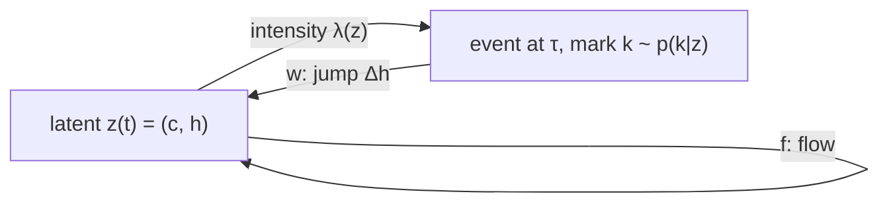

## Abstract

Many systems drift smoothly and are then knocked elsewhere by a discrete event whose likelihood depends on the current state. This paper builds a learnable version of that picture. A latent vector follows a Neural ODE between events, jumps by a learned amount when an event arrives, and determines the arrival intensity and the mark distribution through further small networks. The technical contribution is a modified adjoint method: at each event time the adjoint variables are themselves discontinuous, and the paper gives the update that carries them across the jump — a consequence of the chain rule once parameters and time are folded into an augmented state. The model recovers the intensity of Poisson, Hawkes and self-correcting processes better than a discretised RNN, is roughly level with neural point-process baselines on two real event-type datasets, and handles real-valued marks, illustrated on earthquake locations.

**Keywords:** neural ODE, jump process, marked temporal point process, conditional intensity, adjoint sensitivity, hybrid system

## 1 Introduction

Hybrid systems — piecewise-continuous trajectories interrupted by discrete events — are standard in physics, where the equations of motion are known. In social, medical or economic data neither the flow nor the event mechanism is known, so both must be learned jointly: the paper's running example is a Stack Overflow user whose reputation builds up continuously, sets the chance of earning a badge, and is then redirected by the badge itself.

Neural ODEs fit the flow half of that loop. Time is real-valued, so irregular timestamps need no binning, and gradients come from an adjoint ODE solved backwards with memory constant in depth. The event half is where they break, and there are exactly two places an event could enter. The first is to let past events modify the vector field $f$ — but if $f$ stays finite, the effect of an event can only accumulate continuously, which rules out instantaneous shocks. The paper's own example is a central-bank rate decision hitting the stock market, and it cites Cox–Ross and Merton as the reason financial mathematics has preferred discontinuous price models for fifty years. The second is to let the latent state itself jump, which the original framework forbids: <mark>a Neural ODE assumes a Lipschitz-continuous trajectory, so it can fit a history-independent Poisson intensity but not a history-dependent process such as a Hawkes process.</mark>

The paper takes the second route and pays the price it entails — the trajectory is no longer recoverable by integrating backwards through an event, so the adjoint pass needs both a jump rule and a small cache. Everything else survives.

## 2 Background

A temporal point process produces event times $\{\tau_j\}$, summarised by the counting function $N(t)=\sum_j H(t-\tau_j)$ with $H$ the Heaviside step. Dependence on the past runs through the conditional intensity: given the history $\mathcal H_t$ of events strictly before $t$, the probability of an event in $[t,t+dt)$ is $\lambda(t)\,dt$. Three classical families serve as test beds:

- **Poisson**: $\lambda(t)=\lambda_0$, no memory.
- **Hawkes**: $\lambda(t)=\lambda_0+\alpha\sum_{\tau_j\in\mathcal H_t}\kappa(t-\tau_j)$, self-exciting, with either the exponential kernel $\kappa_1(t)=e^{-\beta t}$ or a power-law $\kappa_2(t)$ that is identically zero for $t<\sigma$ and equals $(\beta/\sigma)(t/\sigma)^{-\beta-1}$ afterwards — the second *delays* the excitation rather than starting it at full strength.
- **Self-correcting**: $\lambda(t)=e^{\mu t-\beta N(t)}$ — intensity grows with time, each event suppresses it.

In a *marked* process each event also carries a vector $k_j$: a one-hot type, or real-valued features such as a location.

For the Neural ODE machinery — the flow $dz/dt=f(z,t;\theta)$, the adjoint $a(t)=\partial\mathcal L/\partial z(t)$ obeying $da/dt=-a\,\partial f/\partial z$, and its companions $a_\theta$, $a_t$ integrated backwards from $t_N$ while $z$ is recomputed alongside — see [Neural ODE](/blog/neural-ode/). The closest relative here is [Latent ODE](/blog/latent-ode/), cited as concurrent work: ODE-RNN also breaks a continuous latent path with discrete updates, but the updates are RNN cells at observation times, not a learned jump inside a point-process likelihood.

## 3 Method

> **Key idea.** Add a $dN(t)$ term to the Neural ODE so the latent state jumps at events, let that same state set the event intensity, and patch the adjoint method with a one-line jump rule at every event time so that training still needs no stored trajectory — only a stack of pre-jump states.



### 3.1 Latent dynamics

The state $z(t)\in\mathbb R^n$ evolves as

$$
dz(t)=f(z(t),t;\theta)\,dt+w(z(t),k(t),t;\theta)\,dN(t), \tag{1}
$$

where $f$ is the flow network, $w$ the jump network, $k(t)$ the mark of the event at $t$. Events arrive with probability $\lambda(z(t))\,dt$ in $[t,t+dt)$ and marks are drawn from $p(k\mid z(t))$; both are neural functions of the state alone. For discrete types the network emits one intensity per type and $\lambda$ is their sum; for real-valued marks it emits the weights, means and variances of a Gaussian mixture. All time-dependent quantities are left-continuous, so $z(\tau_j)$ is the state *just before* the jump and $z(\tau_j^+)=z(\tau_j)+w(\cdot)$ just after. <mark>The loop is closed: the state drives the intensity, and the realised events drive the state.</mark>

### 3.2 The likelihood

For a sequence $\mathcal H=\{(\tau_j,k_j)\}$ on $[t_0,t_N]$, the point-process density factorises into a term per event and a survival term:

$$
\mathcal L=-\sum_j\log\lambda(z(\tau_j))-\sum_j\log p(k_j\mid z(\tau_j))+\int_{t_0}^{t_N}\lambda(z(t))\,dt. \tag{2}
$$

The first sum rewards intensity where events happened, the second is the mark likelihood, the third penalises intensity everywhere else. In practice the integral becomes a weighted sum of $\lambda(z(t_i))$ over solver checkpoints $\{t_i\}$ — the only approximation in the training objective, and the one that makes the adjoint method applicable at all, since it turns $\mathcal L$ into a function of $z$ at a *finite* set of times.

### 3.3 The adjoint across a jump

The derivation is cleanest in the augmented variables the original adjoint proof already uses. Stack state, parameters and time,

$$
z_{\text{aug}}=\begin{bmatrix}z\\\theta\\t\end{bmatrix},\qquad
\frac{dz_{\text{aug}}}{dt}=\begin{bmatrix}f(z,t;\theta)\\0\\1\end{bmatrix},\qquad
a_{\text{aug}}=\begin{bmatrix}a & a_\theta & a_t\end{bmatrix}, \tag{3}
$$

so the parameter and time gradients are extra coordinates of one adjoint row vector. A jump at $\tau_j$ acts on the augmented state as $z_{\text{aug}}(\tau_j^+)=z_{\text{aug}}(\tau_j)+w_{\text{aug}}$ with $w_{\text{aug}}=(w,0,0)^\top$ — parameters and time do not jump. This is an ordinary differentiable map, so the adjoint transforms by its Jacobian, exactly as across a residual layer:

$$
a_{\text{aug}}(\tau_j)=a_{\text{aug}}(\tau_j^+)\,
\frac{\partial z_{\text{aug}}(\tau_j^+)}{\partial z_{\text{aug}}(\tau_j)}
=a_{\text{aug}}(\tau_j^+)
\begin{bmatrix}
I+\partial w/\partial z & \partial w/\partial\theta & \partial w/\partial\tau_j\\
0 & I & 0\\
0 & 0 & 1
\end{bmatrix}. \tag{4}
$$

Multiplying out the three block-columns gives the three update rules:

$$
a(\tau_j)=a(\tau_j^+)+a(\tau_j^+)\frac{\partial w}{\partial z(\tau_j)},\quad
a_\theta(\tau_j)=a_\theta(\tau_j^+)+a(\tau_j^+)\frac{\partial w}{\partial\theta},\quad
a_t(\tau_j)=a_t(\tau_j^+)+a(\tau_j^+)\frac{\partial w}{\partial\tau_j}. \tag{5}
$$

<mark>The adjoint is lifted from its right limit to its left limit by the Jacobian of the jump map</mark>, and the parameter and time adjoints accumulate the jump network's own contribution. All three steps are exact. [Fig. 1 in the paper](https://arxiv.org/pdf/1905.10403#page=5) draws the latent and adjoint trajectories with matching discontinuities.

Two practical consequences follow that the equations do not advertise. First, every update in (5) multiplies $a(\tau_j^+)$, the value *before* the first line overwrites $a$; in the wrong order, the parameter gradient is silently wrong. Second, the Jacobians need the pre-jump state $z(\tau_j)$, which running the ODE backwards cannot produce — the solver does not invert $z\mapsto z+w(z)$. <mark>Those values must be cached on the forward pass, so memory is constant in solver steps but linear in the number of events.</mark> For hundreds of events and a five-dimensional state that is nothing; for dense event streams it is the term that grows.

### 3.4 Intuition: the model contains the classical families exactly

Why should a five-dimensional latent state track a Hawkes intensity? Because the exponential-kernel Hawkes process is a fixed point of this architecture, not an approximation of it. Take the memory coordinate $h$ one-dimensional, the flow to be linear decay $dh/dt=-\beta h$, the jump to be the constant $w=\alpha$, and read the intensity off as $\lambda=\lambda_0+h$. Integrating (1) between events and applying the jump at each $\tau_j$ gives

$$
h(t)=\alpha\sum_{\tau_j<t}e^{-\beta(t-\tau_j)},\qquad
\lambda(t)=\lambda_0+\alpha\sum_{\tau_j<t}e^{-\beta(t-\tau_j)}, \tag{6}
$$

which is the Hawkes intensity verbatim. The self-correcting process is as cheap: put $\log\lambda=h$, let the flow be $dh/dt=\mu$ and the jump be $-\beta$, and (1) reproduces $\lambda(t)=e^{\mu t-\beta N(t)}$. The Poisson process is the case $w\equiv0$.

The same construction shows what a jump-free Neural ODE cannot do. Without the $dN$ term, $z(t)$ is a deterministic function of $z(t_0)$ and $t$, so $\lambda(z(t))$ is a deterministic function of time — an *inhomogeneous* Poisson process, whatever the network's capacity. History-dependence enters only through $dN$.

It also predicts where the model will struggle. A delayed power-law kernel is not the impulse response of any finite-dimensional linear ODE, so it can only be approximated, by a coupling between $h$ and $c$ that produces a lagged peak. The experiments confirm it: the power-law column is where the margin over the RNN nearly vanishes.

### 3.5 Architecture

The state is split as $z=(c,h)$ with $n=n_1+n_2$. The internal state $c(t)\in\mathbb R^{n_1}$ is driven by an MLP whose output is projected orthogonal to $c$, pinning $\|c\|$ to a sphere and stabilising the solve. The event memory $h(t)\in\mathbb R^{n_2}$ decays at a rate given by a second MLP passed through softplus so the rate stays positive. Jumps act only on memory: $\Delta h$ is an MLP of the mark $k$ and of $c$, while $\Delta c=0$ by construction. A further MLP maps $z$ to $\lambda$ and to the parameters of $p(k\mid z)$. All MLPs use CELU activations; the wiring is [Fig. 2 in the paper](https://arxiv.org/pdf/1905.10403#page=6). The split has teeth: because events cannot touch $c$ directly, any lagged response *must* route through $h$ — the mechanism the power-law experiment exhibits.

### 3.6 Algorithm

```text
# --- forward: loss and cache (one sequence H = {(τ_j, k_j)}) ---
z ← z(t0);  t ← t0;  cache ← []
while t < tN:
    dt ← adaptive_step(z, t)
    τ  ← next event time in H after t
    if τ ≤ t + dt:  dt ← τ − t          # land exactly on the event
    z ← ode_step(z, t, dt)              # flow term of Eq. 1
    if t + dt == τ:
        cache.push((τ, z))              # PRE-jump state, needed in Eq. 5
        z ← z + w(z, k_τ, τ; θ)         # jump term of Eq. 1
    t ← t + dt
L ← −Σ_j log λ(z(τ_j)) − Σ_j log p(k_j | z(τ_j)) + Σ_i ω_i λ(z(t_i))

# --- backward: gradients ---
a ← ∂L/∂z(tN);  a_θ ← 0;  a_t ← a · f(z(tN), tN; θ);  t ← tN
while t > t0:
    dt ← adaptive_step_backward(z, a, a_θ, a_t, t)
    τ  ← previous event time in H before t
    if τ ≥ t − dt:  dt ← t − τ
    z, a, a_θ, a_t ← ode_step_backward(z, a, a_θ, a_t, dt)   # Eq. 9 of the paper
    a ← a + ∂L/∂z(t_i)                  # at every checkpoint t_i crossed
    if t − dt == τ:
        z ← cache.pop()                 # restore z(τ), the left limit
        a_θ ← a_θ + a · ∂w/∂θ           # order matters: these use a(τ⁺)
        a_t ← a_t + a · ∂w/∂τ
        a   ← a + a · ∂w/∂z
    t ← t − dt
return L, a (= dL/dz(t0)), a_θ (= dL/dθ), a_t

# --- simulation (not used in the experiments) ---
# identical to the forward pass, except τ is drawn from the model's own
# intensity λ(z(t)) as the solver advances, and k_τ ~ p(k | z(τ));
# if the sampled τ falls inside the proposed step, shrink dt to τ − t.
```

## 4 Implementation notes

As reported; blanks marked.

| | Synthetic intensities | Stack Overflow | MIMIC2 | Real-valued marks (synthetic) | Earthquakes |
|---|---|---|---|---|---|
| latent dim $(n_1,n_2)$ | $(3,2)$ | $(10,10)$ | $(32,32)$ | $(5,5)$ | $(10,10)$ |
| MLP hidden units | 20 | 32 | 64 | 20 | not stated |
| hidden layers | 1 | 1 | 1 | 1 | not stated |
| learning rate | $10^{-3}$ | $10^{-3}$ | $10^{-3}$ | $10^{-4}$ | not stated |
| weight decay | $10^{-5}$ | $10^{-5}$ | $10^{-5}$ | $10^{-5}$ | not stated |
| mark model | — (single type) | 22-way | 75-way | Gaussian mixture | 5-component Gaussian mixture |
| data split | 60/20/20 | 5-fold CV | 5-fold CV | as synthetic | 1970–2006 train, 2007–2018 test |

Common to all runs: Adam with $\beta_1=0.9$, $\beta_2=0.999$; CELU activations; a single workstation with an 8-core i7-7700 CPU at 3.60 GHz and 32 GB of memory. <mark>The entire paper runs on a CPU</mark> — a fair signal of how small these models are and of how little the experiments say about scaling.

Easy to get wrong, or simply absent:

- **Not stated:** the ODE solver and its tolerances, batch size, epochs, early-stopping rule, the quadrature weights $\omega_i$ for the intensity integral, and whether $z(t_0)$ is learned or fixed. The released code is a `torchdiffeq` fork, so solver defaults are recoverable from there but not from the paper.
- **The event cache.** Pre-jump states are pushed forward and popped backward; the wrong stack order fails silently, since the loss is unaffected and only the gradient degrades.
- **Update order inside a jump** (§3.3): $a_\theta$ and $a_t$ must be updated before $a$ is overwritten.
- **Step shrinking.** The solver must land exactly on each event time in both directions; a step that overshoots integrates the flow through a discontinuity.
- **A printed typo.** Algorithm 2 ends its *backward* loop with `t = t + dt` under the condition `t > t0`; with a positive step it never terminates. It should be `t = t − dt`.

## 5 Experiments

**Synthetic intensities.** Four generators: Poisson ($\lambda_0=1$), Hawkes with exponential kernel ($\lambda_0=0.2,\alpha=0.8,\beta=1$), Hawkes with the delayed power-law kernel ($\lambda_0=0.2,\alpha=0.8,\beta=2,\sigma=1$), self-correcting ($\mu=0.5,\beta=0.2$). Each dataset is 500 sequences on $[0,100]$, split 60/20/20. Baselines: the four parametric families fitted by maximum likelihood with PtPack, and an RNN modelling the intensity on 2000 evenly spaced timestamps with a 20-dimensional state and tanh activations, each event time rounded to the nearest grid point. The metric is the time-averaged absolute percentage error of the intensity, integrated on those same 2000 points.

| Model \ Generator | Poisson | Hawkes (E) | Hawkes (PL) | Self-correcting |
|---|---|---|---|---|
| Poisson (MLE) | *0.1* | 188.2 | 95.6 | 29.1 |
| Hawkes (E) (MLE) | 0.3 | *3.5* | 155.4 | 29.1 |
| Hawkes (PL) (MLE) | 0.1 | 128.5 | *9.8* | 29.1 |
| Self-correcting (MLE) | 98.7 | 101.0 | 87.1 | *1.6* |
| RNN | 3.2 | 22.0 | 20.1 | 24.3 |
| **Neural JSDE** | 1.3 | **5.9** | **17.1** | **9.3** |

*Italic = oracle (the fitted family is the generating family). Bold = best non-oracle.*

- *"In all cases, our neural JSDE model is a better fit for the data than the RNN and other point process models (except for the ground truth model)."* Half supported. Against the RNN it holds in all four columns, by a wide margin on exponential Hawkes (5.9 vs 22.0) and a narrow one on power-law Hawkes (17.1 vs 20.1). <mark>Against the other parametric models it fails in the Poisson column: the misspecified Hawkes fits score 0.1 and 0.3 against the model's 1.3.</mark> That is not a fluke — both Hawkes families *nest* the Poisson process at $\alpha=0$, so they are oracles in disguise there, which the row labels hide. The defensible claim: across the three history-dependent generators the model is the best non-oracle in every column, and a genuinely misspecified family can be off by more than 100%.
- *The model captures the delayed power-law kernel.* Supported qualitatively by [Fig. 3D](https://arxiv.org/pdf/1905.10403#page=7) — the jump lands in $h$ immediately, the intensity peaks later when $c$ has responded — and consistent with the 17.1 error, its worst column relative to the oracle. No quantitative measure of the lag is given.
- No variance is reported anywhere in Table 1: one run per cell, no seeds, no intervals.

**Discrete marks.** Stack Overflow (badge histories of 6633 users, 22 badge types, 2 years) and MIMIC2 (clinical visits of 650 ICU patients, 75 visit reasons, 7 years), five-fold cross-validation, predicting each held-out event type as the arg-max of $p(k\mid z(\tau_j))$. Baselines are quoted from Mei and Eisner (2017), not re-run.

| Error rate (%) | Du et al. (2016) | Mei & Eisner (2017) | NJSDE |
|---|---|---|---|
| Stack Overflow | 54.1 | 53.7 | **52.7** |
| MIMIC2 | 18.8 | **16.8** | 19.8 |

The introduction promises "state-of-the-art performance"; the table shows a win of 1.0 points on one dataset and a loss of 3.0 on the other, with five folds available and no standard deviation printed anywhere. <mark>"Level with, on two datasets, without error bars" is what the evidence supports.</mark> The real argument of §4.2 is coverage, not accuracy: neither baseline models a latent trajectory between events, and neither handles real-valued marks.

**Real-valued marks.** On synthetic Hawkes sequences whose mark is the time since the previous event, the model reaches a mean absolute error of 0.353 against 3.654 for a running-mean predictor. Worth a flag: the paper says only that training followed §4.1 and does not restate the generator's parameters. At the §4.1 values the stationary mean intensity is $\lambda_0/(1-\alpha/\beta)=1$, so the mean inter-event gap is about 1 and a baseline error of 3.654 is hard to place. Either different parameters were used or the feature is scaled differently; the paper does not say.

For earthquakes above magnitude 4.0, a model trained on 1970–2006 with a five-component Gaussian mixture over longitude and latitude produces the 2007–2018 intensity contours of [Fig. 5](https://arxiv.org/pdf/1905.10403#page=9). It is the only result on real data with continuous marks, and <mark>no quantitative score of any kind is reported for it</mark> — no held-out log-likelihood, no location error, no baseline.

## 6 Limitations

**Stated by the authors.**

- Computing the jump Jacobians needs the pre-jump latent state, which has to be recorded during forward integration.
- The paper focuses on prediction rather than simulation, though Appendix A.1 gives the simulation algorithm.
- The architecture assumes events do not directly disturb the internal state ($\Delta c=0$) — stated, not defended.

**My reading.**

- **No Brownian term, despite the title.** Between events the latent path is deterministic; all randomness comes from the point process. This is a jump process on a deterministic flow — see [Stochastic Adjoint](/blog/scalable-sde-gradients/) for the diffusion analogue of exactly this gradient problem, and [SDE-GAN](/blog/neural-sde-gan/) for a generative use.
- **Jumps occur only at observed event times,** so the model cannot represent a latent jump that leaves no record — a regime change with no announcement — which is the case financial jump-diffusions are often used for.
- **It models the event stream, not a continuously observed series.** There is no observation model for a price or any other quantity sampled between events.
- **No cost accounting.** An adaptive solve that stops at every event is not free, yet there is no wall-clock or step-count comparison against the RNN, and no measurement of how the cache grows with event density.
- **Simulation quality is never evaluated** — the one test that would separate a generative model from a conditional-intensity regressor.

## 7 Extensions

**What was built on this.** The nearest neighbours in this collection are [Neural ODE](/blog/neural-ode/), the framework being extended, and [Latent ODE](/blog/latent-ode/), cited here as concurrent work that interrupts a continuous latent path with RNN updates rather than learned jumps. The complementary problem — adjoint gradients when the *continuous* part is stochastic instead of the discrete part — is solved in [Stochastic Adjoint](/blog/scalable-sde-gradients/), not a follow-up to this paper but the other half of a full jump-diffusion. Beyond the collection, the jump-adjoint idea was carried into continuous-time spatio-temporal point process models and into attention-based neural point processes that replace the ODE state with a transformer (from general knowledge, unverified — neither is cited in this PDF).

**Open problems.**

- Adding a diffusion term to (1) without losing the memory guarantee: the jump rule should compose with a stochastic adjoint, but the combination is not shown.
- Unobserved jumps: inferring a latent jump whose only evidence is a change in the subsequent flow is a filtering problem this framework does not pose.
- Solver cost at high event density, where forced stops dominate and no adaptive strategy is offered.
- Identifiability of the $(c,h)$ split: nothing beyond the wiring forces $c$ to be "internal" and $h$ "memory", and stability across seeds is untested.

**Research directions.**

*These are ideas, not results — none has been run.*

1. **Self-exciting order flow with a learned lag.** *Hypothesis*: order-book arrivals excite with a non-exponential, delayed profile, so a Neural JSDE with a small $(c,h)$ split beats a fitted exponential-kernel Hawkes at out-of-sample intensity prediction. *Data*: a public limit-order-book message sample for a few liquid names; marks are signed event type and size bucket. *Baseline*: multivariate exponential-kernel Hawkes by MLE, plus the grid-RNN of §4.1. *Metric*: held-out log-likelihood per event, and time-rescaling (Q–Q of the compensator against the unit exponential). *Failure mode*: intraday seasonality is a deterministic non-stationarity that $c$ will absorb, inflating log-likelihood without capturing excitation, so a time-of-day covariate must be conditioned out first.
2. **Jump-diffusion: put the Brownian term back.** *Hypothesis*: a latent state carrying both $\sqrt{2\sigma}\,dB_t$ and $w\,dN_t$, trained with a stochastic adjoint for the diffusion and (5) for the jumps, recovers the jump intensity of a simulated Merton jump-diffusion better than either an intensity-only or a diffusion-only model. *Data*: simulated Merton paths with known intensity and jump-size law, observed as a price path plus flagged jump times. *Baseline*: NJSDE on the jump times alone; a neural SDE on the path alone. *Metric*: absolute percentage error of the recovered intensity as in Table 1, plus Wasserstein distance between fitted and true jump sizes. *Failure mode*: the diffusion soaks up small jumps, leaving $\lambda$ and $\sigma$ jointly unidentifiable unless jump sizes are bounded away from zero.
3. **Scenario generation for event-driven risk.** *Hypothesis*: simulating from the fitted model — the use case the paper never evaluates — gives calibrated multi-day distributions of event counts and mark aggregates, beating a bootstrapped-Hawkes simulator on tail coverage. *Data*: a long marked sequence with a natural aggregate, e.g. exchange-halt events with duration marks. *Baseline*: parametric Hawkes simulation with the same mark model. *Metric*: CRPS on the aggregate plus coverage of the 95th and 99th percentiles. *Failure mode*: once the model's own sampled events feed back into the state, error compounds and the simulated intensity can drift into a self-exciting blow-up never seen under teacher forcing.

## 8 Takeaways

- A Neural ODE plus a learned $dN(t)$ term gives a hybrid system whose latent state both causes and reacts to events; without that term the intensity is a deterministic function of time — an inhomogeneous Poisson process, whatever the network's size.
- Backpropagating through a jump is the chain rule through $z\mapsto z+w(z)$ in augmented coordinates: three lines of code, at the cost of caching one pre-jump state per event.
- The architecture contains the exponential-kernel Hawkes and self-correcting processes exactly, which explains both the strong synthetic results and the weak power-law column, where no finite-dimensional linear flow suffices.
- On real event-type prediction the model is level with RNN/LSTM point processes, not better, on two datasets with no error bars; its genuine advantage is coverage — a latent trajectory between events, and real-valued marks.
- For financial time series the relevance is partial but real: the case for discontinuous latent paths is the classical jump-diffusion one, and order arrivals are self-exciting marked point processes. A price model would still need a diffusion term and jumps not tied to observed events, neither of which this framework provides.

## References

1. Jia, J., Benson, A. R. *Neural Jump Stochastic Differential Equations.* NeurIPS 2019. arXiv:1905.10403.
2. Chen, R. T. Q., Rubanova, Y., Bettencourt, J., Duvenaud, D. *Neural Ordinary Differential Equations.* NeurIPS 2018.
3. Rubanova, Y., Chen, R. T. Q., Duvenaud, D. *Latent ODEs for Irregularly-Sampled Time Series.* NeurIPS 2019.
4. Mei, H., Eisner, J. *The Neural Hawkes Process: A Neurally Self-Modulating Multivariate Point Process.* NeurIPS 2017.
5. Du, N. et al. *Recurrent Marked Temporal Point Processes: Embedding Event History to Vector.* KDD 2016.
6. Corner, S., Sandu, C., Sandu, A. *Adjoint Sensitivity Analysis of Hybrid Multibody Dynamical Systems.* arXiv:1802.07188.
7. Merton, R. C. *Option pricing when underlying stock returns are discontinuous.* Journal of Financial Economics, 1976.
