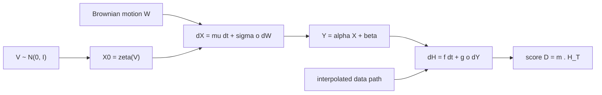

## Abstract

An SDE turns Brownian motion into a distribution over paths, and that distribution has no usable density, so practitioners have long fitted SDEs by matching expectations of hand-picked functionals such as option payoffs. This paper observes that a GAN does the same thing with a learned functional, and builds the corresponding model. The generator is a neural SDE with a hidden state and a linear readout; the discriminator is a neural controlled differential equation (CDE) driven by the generated or observed path; training uses the Wasserstein objective with a gradient penalty. No statistic has to be chosen in advance and no likelihood is needed, and the authors argue that with infinite data any Markov SDE can be recovered. Against a latent ODE and a continuous-time flow process, the SDE-GAN wins all three metrics on a limit-order-book dataset and two of three on air quality and SGD weight trajectories.

**Keywords:** neural SDE, neural CDE, Wasserstein GAN, gradient penalty, path space, signature MMD, generative time series

## 1 Introduction

The classical SDE workflow has two steps. An expert writes down a parametric model, often an ODE with a fixed noise term bolted on. The parameters are then calibrated so that model expectations $\mathbb{E}[F_i(X)]$ agree with targets for a prespecified list $F_1,\dots,F_n$; in finance the $F_i$ are payoffs and the targets are market prices. The model family is narrow, and only the chosen statistics are constrained.

Earlier neural SDE work widened the model family but kept other restrictions. Some approaches only use the terminal value. Several end up with an optimal diffusion of zero. The latent SDE of Li et al. trains through a variational bound, tying stochasticity to posterior uncertainty. Finance-oriented papers that fit whole paths still minimise differences of fixed payoffs, which the authors describe as a non-characteristic MMD: two different path distributions can agree on every chosen payoff.

The paper's claim is that <mark>this is the first SDE fitting method that needs neither prespecified statistics nor density functions</mark>, while remaining a direct generalisation of the classical procedure.

## 2 Background

**SDE as a pushforward.** For Lipschitz $f$, $g$, the strong solution of

$$
dX_t = f(t, X_t)\,dt + g(t, X_t)\circ dW_t, \qquad X_0 \sim \mu, \tag{1}
$$

is a deterministic map from (initial draw, Brownian path) to a solution path. So an SDE pushes Wiener measure forward onto path space, exactly as a GAN generator pushes Gaussian noise onto image space. Sampling is easy; a density is not available, since path space has no Lebesgue measure.

> **My comment.** No density means the model can only be checked through samples, and that is where my factor-selection result makes me cautious: there the density-free GAN route gave sharper answers that were measured overconfidence. For path models the analogue is a generator that matches whatever functionals the critic happens to learn and is wrong in the tail, which is where I would score it.

**Wasserstein GAN.** A generator $G_\theta$ is trained so that no scalar critic $F$ can separate $\mathbb{E}_{\text{model}}[F]$ from $\mathbb{E}_{\text{data}}[F]$; the critic must be Lipschitz. Calibration to fixed payoffs is the same game with the critic frozen.

**Neural CDE.** A CDE $dH_t = f(H_t)\,dt + g(H_t)\,dY_t$ evolves a hidden state in response to a driving path $Y$. It is the continuous-time counterpart of an RNN and is a universal approximator for functions of paths.

## 3 Method

> **Key idea.** Classical calibration matches a fixed set of path statistics. Make the statistic a learned, Lipschitz function of the whole path, computed by a neural CDE, and SDE fitting becomes Wasserstein GAN training in continuous time.

### 3.1 Generator

With initial noise $V \sim \mathcal{N}(0, I_v)$ and a $w$-dimensional Brownian motion $W$,

$$
X_0 = \zeta_\theta(V), \qquad dX_t = \mu_\theta(t, X_t)\,dt + \sigma_\theta(t, X_t)\circ dW_t, \qquad Y_t = \alpha_\theta X_t + \beta_\theta. \tag{2}
$$

$\zeta_\theta$, $\mu_\theta$, $\sigma_\theta$ are ordinary Lipschitz networks, $X_t \in \mathbb{R}^x$ is hidden, and $Y_t \in \mathbb{R}^y$ is the sample. Two pieces are structural. The affine readout exists because if $X$ itself were the output the model would be forced to be Markov; <mark>keeping a hidden state lets the observed path carry non-Markov dependence</mark>. The separate noise $V$ exists because $Y_0$ does not depend on $W$ at all, so without it every sample would start at the same point. Samples are drawn with the midpoint method, which converges to the Stratonovich solution.

### 3.2 Discriminator

The critic, which must accept a path, is a neural CDE driven by $Y$:

$$
H_0 = \xi_\phi(Y_0), \qquad dH_t = f_\phi(t, H_t)\,dt + g_\phi(t, H_t)\circ dY_t, \qquad D = m_\phi \cdot H_T. \tag{3}
$$

$H_t \in \mathbb{R}^h$ is the critic's hidden state and the scalar $D$ is the real-versus-fake score. Because $dY_t = \alpha_\theta\,dX_t$, substituting (2) into (3) gives one joint SDE in $[X, H]$ with drift $[\mu_\theta,\; f_\phi + g_\phi \alpha_\theta \mu_\theta]$ and diffusion $[\sigma_\theta,\; g_\phi \alpha_\theta \sigma_\theta]$, so <mark>generator and critic are evaluated in a single SDE solve</mark>.

Real data arrive as irregular observations $(t_i, z_i)$. If sampling is dense, the series is interpolated to a path $\hat z$ and (3) is driven by $\hat z$; the interpolation scheme hardly matters, and linear is used in three of four experiments. If sampling is sparse, real and generated series are both interpolated at the observation times, making the interpolation part of the critic.

### 3.3 Objective and Lipschitz control

Writing $Y_\theta(V, W)$ for the generator and $D_\phi$ for the critic,

$$
\min_\theta\; \mathbb{E}_{V,W}\big[D_\phi(Y_\theta(V,W))\big], \qquad \max_\phi\; \mathbb{E}_{V,W}\big[D_\phi(Y_\theta(V,W))\big] - \mathbb{E}_{z}\big[D_\phi(\hat z)\big]. \tag{4}
$$

Weight clipping and spectral normalisation did not work. The explanation offered is recurrence: if one step has Lipschitz constant $\lambda$, the whole solve has a constant of order $\lambda^T$, so per-layer control slightly above one compounds badly, whereas a gradient penalty constrains the whole map. Gradient penalty needs a double backward pass, and here the authors report that <mark>a double continuous adjoint gave gradients too inaccurate to train with at moderate step sizes, so they backpropagate through the solver's internals instead</mark>.

### 3.4 What can be learned

The Wasserstein distance has a unique minimiser at the data distribution, a neural CDE can approximate the required critic on compact sets, and universal approximation means any Markov SDE of form (1) is representable by the generator. The non-Markov extension through the hidden state comes without a proof.

## 4 Experiments

**Synthetic check.** A time-dependent Ornstein–Uhlenbeck process, $dz_t = (\mu t - \theta z_t)\,dt + \sigma \circ dW_t$ with $\mu = 0.02$, $\theta = 0.1$, $\sigma = 0.4$, 8192 paths observed at integer times from 0 to 63. Marginals at five times and 50 sample paths match the truth by eye ([Figs. 3 and 4 in the paper](https://arxiv.org/pdf/2102.03657#page=6)); no numeric score is given.

> **My comment.** An OU process with known parameters is the right test, and then it is scored by eye. I would report the error in a few known quantities, the recovered mean-reversion rate or a known quantile of the marginals, the way TailFlow is scored against a synthetic market whose true ES is known.

**Baselines and metrics.** Latent ODE (trained as a VAE) and the latent-variable CTFP (a normalising flow). Three scores: the loss of a neural CDE classifier separating real from fake (higher is better), a train-on-synthetic, test-on-real forecasting loss (lower is better), and an MMD with depth-5 signature features (lower is better). Entries are mean ± standard deviation over three runs.

**Stocks.** One year (2018–2019) of Google/Alphabet limit-order-book data from LOBSTER, averaging 605,054 observations per day, downsampled and cut into roughly one-minute windows for about 14.6 million datapoints. The modelled path is two-dimensional: midpoint and log-spread.

| Metric | Neural SDE | CTFP | Latent ODE |
|---|---|---|---|
| Classification ↑ | **0.357 ± 0.045** | 0.165 ± 0.087 | 0.000239 ± 0.000086 |
| Prediction ↓ | **0.144 ± 0.045** | 0.725 ± 0.233 | 46.2 ± 12.3 |
| MMD ↓ | **1.92 ± 0.09** | 2.70 ± 0.47 | 60.4 ± 35.8 |

The latent ODE collapses here, which the authors read as evidence against drift-only models for noisy data.

**Air quality and SGD weights.** On six-pollutant daily curves from Beijing, generated conditionally on 14 station labels, the neural SDE has the best prediction (0.395 ± 0.056) and MMD, while CTFP has the best classification score (0.764 ± 0.064 against 0.589 ± 0.051) but the worst prediction (0.810 ± 0.083). Univariate weight trajectories of small MNIST convnets over 100 epochs repeat the pattern: CTFP leads classification (0.676 against 0.507), the neural SDE leads prediction by an order of magnitude (0.00843 against 0.0808) and MMD by about a factor of two (5.28 against 12.0).

**Training recipe.** Four things mattered: a final tanh on every vector field to stop the hidden state blowing up, averaging generator and critic weights over training, weight decay, and <mark>Adadelta, which clearly beat SGD and Adam for reasons the authors say they cannot explain</mark>.

## 5 Discussion

The conceptual move is the contribution. Seeing calibration as a GAN with a frozen critic explains why payoff-matched models can be wrong everywhere the payoffs do not look, and the authors stress that the method slots into existing SDE workflows. The architecture is minimal, with each component justified by what breaks without it.

The evidence is thinner than the idea. Evaluation rests on three learned or kernel-based scores over three seeds, two of which use the same neural CDE family as the critic, which may favour a model trained against such a critic. For the stock data there is no check of the properties a finance reader would ask about first: tail behaviour, autocorrelation of absolute returns, spread dynamics. The "any SDE can be learnt" statement concerns the Wasserstein minimiser with infinite data, not GAN training dynamics, which the recipe section shows to be delicate. Abandoning the adjoint means memory grows with the number of solver steps, and no training cost is reported.

## 6 Takeaways

- An SDE solver is a generator: Brownian motion in, path out, no density. Fitting by matched expectations is already a GAN with a fixed critic.
- A neural CDE is the natural learned critic for paths, handles irregular sampling through interpolation, and can be fused with the generator into one solve.
- In recurrent continuous-time critics, enforce the Lipschitz constraint with a gradient penalty, and expect to backpropagate through the solver to get usable second-order gradients.
- For financial time series this is directly relevant: the paper's largest experiment is order-book data, and the framework generalises payoff-based calibration without discarding it. What remains to be shown is whether the generated paths reproduce stylised facts over horizons longer than a minute.

## References

1. Kidger, P., Foster, J., Li, X., Oberhauser, H., Lyons, T. *Neural SDEs as Infinite-Dimensional GANs.* ICML 2021. arXiv:2102.03657.
2. Li, X., Wong, T.-K. L., Chen, R. T. Q., Duvenaud, D. *Scalable Gradients for Stochastic Differential Equations.* AISTATS 2020. arXiv:2001.01328.
3. Kidger, P., Morrill, J., Foster, J., Lyons, T. *Neural Controlled Differential Equations for Irregular Time Series.* arXiv:2005.08926, 2020.
4. Gulrajani, I., Ahmed, F., Arjovsky, M., Dumoulin, V., Courville, A. *Improved Training of Wasserstein GANs.* NeurIPS 2017.
5. Deng, R., Chang, B., Brubaker, M. A., Mori, G., Lehrmann, A. *Modeling Continuous Stochastic Processes with Dynamic Normalizing Flows.* arXiv:2002.10516, 2020.
