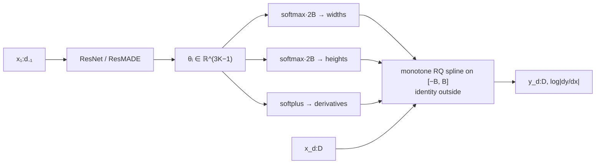

## Abstract

Every flow built from coupling or autoregressive layers has the same two-part structure: a *conditioner* network that reads part of the input and emits parameters, and a *transformer* — an elementwise, invertible scalar function — that those parameters configure. Since [NICE](/blog/nice/) the transformer has been affine, $y=\sigma x+\mu$, and the paper's thesis is that this, not the conditioner, is the binding constraint. It replaces the affine transformer with a monotone rational-quadratic spline: $K$ bins on $[-B,B]$, each a quotient of two quadratics, with the Gregory–Delbourgo construction guaranteeing monotone $C^1$ interpolation through given knots and derivatives, and the identity outside $[-B,B]$ so that inputs are unconstrained. The Jacobian is a closed-form product of quotient derivatives; the inverse is the root of a quadratic; the whole thing is differentiable in its $3K-1$ parameters per coordinate. Dropped into Glow this gives RQ-NSF (C); dropped into MAF/IAF it gives RQ-NSF (AR). On the five tabular benchmarks the coupling version closes most of the gap to autoregressive flows while keeping one-pass sampling, and on images it matches Glow's bits/dim with roughly a seventh of the parameters.

**Keywords:** monotone rational-quadratic spline, coupling transform, autoregressive transform, analytic invertibility, tabular density estimation, parameter efficiency

## 1 Introduction

The framing is the useful one. A coupling or autoregressive layer is

$$
\theta_{d:D}=\mathrm{NN}(x_{1:d-1}),\qquad y_i=g_{\theta_i}(x_i),
$$

and *the choice of $g$ determines the flexibility of these models*. For an affine $g$ the layer is linear in each transformed coordinate given the others, so all curvature must come from stacking; for a sufficiently rich monotone $g$ a single layer can already bend. The question is what monotone families admit a closed-form inverse and a closed-form derivative, because those two are what make a flow a flow.

The honest accounting of what was already available makes the contribution precise. Flow++ uses the CDF of a logistic mixture — flexible, but *requires bisection search to compute an inverse, since a closed form is not available*. The non-linear squared flow adds an inverse-quadratic perturbation, invertible only under parameter restrictions and by solving a cubic. Sum-of-squares polynomial flows are analytic only at low degree. Neural autoregressive flows parameterise a monotone neural network per dimension — *this greatly enhances the flexibility of the transformation, but the resulting model is again not analytically invertible*; Block-NAF likewise. So the field had a menu of flexible-but-not-invertible and invertible-but-not-flexible, and this paper takes the missing cell.

For anyone using a flow to *evaluate* densities on tabular data, this is the paper that matters most in the coupling line. A factor panel has tens of dimensions, no spatial structure, and marginals that are nothing like Gaussian; an affine coupling layer has to spend depth straightening each marginal before it can model dependence, and a spline transformer does the marginal work in one layer. The paper's discussion says as much: copulas and Gaussianization *can simply represent complex marginal distributions that would require many layers of transformations in flow-based models like RealNVP and Glow*.

## 2 Prior work on the transformer

**Piecewise polynomial splines.** Müller et al. restrict to monotone linear and quadratic segments, matched at bin boundaries for continuity, on $[0,1]$.

**Cubic splines**, which these authors themselves proposed in an earlier iteration of this work, are the direct predecessor, and the paper's account of why they abandoned it is the best motivation in the paper. Like Müller et al.'s, the cubic transform was defined only on $[0,1]$, so composing it with unconstrained linear layers required *a sigmoid transformation before each coupling layer, and a logit transformation after*. Two failures followed:

- *The limitations of 32-bit floating point precision mean that in practice the sigmoid saturates for inputs outside the approximate range of $[-13,13]$, which results in numerical difficulties.*
- Inverting a cubic is *prone to numerical instability if not carefully treated*.

Both are fixed by choosing a family defined on $[-B,B]$ with linear tails and an inverse that is a quadratic root. This is an unusually concrete example of numerical analysis driving a model-design decision, and it is why the rational-quadratic choice is not arbitrary.

**Invertible linear transformations.** The mixing step between transformers, taken from [Glow](/blog/glow/): $W=PLU$ with $P$ a fixed permutation, $L$ unit lower triangular and $U$ upper triangular with positive diagonal, guaranteeing invertibility. Determinant in $O(D)$; inverse by two triangular solves at $O(D^2M)$ for batch size $M$, or a one-time $O(D^3)$ explicit inverse that can be cached.

## 3 Method

> **Key idea.** Between two knots, put a ratio of two quadratics. It is monotone, it is $C^1$ if you match derivatives at the knots, its derivative is a closed-form quotient, and inverting it means solving a quadratic — for which you can tell in advance which root is right, because the function is monotone.

### 3.1 The spline

$K$ rational-quadratic segments with $K+1$ knots $\{(x^{(k)},y^{(k)})\}_{k=0}^{K}$ increasing monotonically from $(-B,-B)$ to $(B,B)$; $K-1$ free positive derivatives $\delta^{(k)}$ at the internal knots; and the boundary derivatives **fixed at $\delta^{(0)}=\delta^{(K)}=1$** to match the linear tails. The reason for that last constraint is stated plainly and is worth repeating because it is the kind of thing that silently breaks a reimplementation:

> If the derivatives are not matched in this way, the transformation is still continuous, but its derivative can have jump discontinuities at the boundary points. This in turn makes the log-likelihood training objective discontinuous, which in our experience manifested itself in numerical issues and failed optimization.

The log-likelihood contains $\log\lvert g'\rvert$, so a jump in $g'$ is a jump in the loss. Continuity of the *value* is not enough; a flow needs continuity of the derivative.

With $s^{(k)}=(y^{(k+1)}-y^{(k)})/(x^{(k+1)}-x^{(k)})$ and $\xi=(x-x^{(k)})/(x^{(k+1)}-x^{(k)})$, the Gregory–Delbourgo form is

$$
\frac{\alpha^{(k)}(\xi)}{\beta^{(k)}(\xi)}
= y^{(k)}+\frac{\bigl(y^{(k+1)}-y^{(k)}\bigr)\bigl[s^{(k)}\xi^2+\delta^{(k)}\xi(1-\xi)\bigr]}
{s^{(k)}+\bigl[\delta^{(k+1)}+\delta^{(k)}-2s^{(k)}\bigr]\xi(1-\xi)}. \tag{1}
$$

Its derivative — which is the entire Jacobian contribution, summed over coordinates — is

$$
\frac{d}{dx}\frac{\alpha^{(k)}(\xi)}{\beta^{(k)}(\xi)}
=\frac{\bigl(s^{(k)}\bigr)^2\bigl[\delta^{(k+1)}\xi^2+2s^{(k)}\xi(1-\xi)+\delta^{(k)}(1-\xi)^2\bigr]}
{\bigl[s^{(k)}+\bigl(\delta^{(k+1)}+\delta^{(k)}-2s^{(k)}\bigr)\xi(1-\xi)\bigr]^2}. \tag{2}
$$

Note that the numerator is a positive combination of $\delta$'s and $s$ whenever those are positive, which is why monotonicity survives: the construction cannot produce a non-monotone segment given positive inputs.

Inversion sets (1) equal to a target $y$ and clears denominators, giving a quadratic $a\xi^2+b\xi+c=0$ with

$$
\begin{aligned}
a&=\bigl(y^{(k+1)}-y^{(k)}\bigr)\bigl[s^{(k)}-\delta^{(k)}\bigr]+\bigl(y-y^{(k)}\bigr)\bigl[\delta^{(k+1)}+\delta^{(k)}-2s^{(k)}\bigr],\\
b&=\bigl(y^{(k+1)}-y^{(k)}\bigr)\delta^{(k)}-\bigl(y-y^{(k)}\bigr)\bigl[\delta^{(k+1)}+\delta^{(k)}-2s^{(k)}\bigr],\\
c&=-s^{(k)}\bigl(y-y^{(k)}\bigr),
\end{aligned} \tag{3}
$$

solved as

$$
\xi=\frac{2c}{-b-\sqrt{b^2-4ac}}. \tag{4}
$$

Monotonicity picks the root, and this particular algebraic form of the quadratic formula is the numerically stable one — it avoids cancellation when $b^2\gg4ac$, which is exactly the regime the naive form fails in. That detail is why the method works in fp32 where the cubic version did not.

### 3.2 Parameterisation

For each transformed coordinate $i$, the conditioner emits an unconstrained vector $\theta_i$ of length $3K-1$, partitioned as $(\theta_i^w,\theta_i^h,\theta_i^d)$ with lengths $K$, $K$, $K-1$:

- $\theta_i^w$ and $\theta_i^h$ each go through a **softmax** and are multiplied by $2B$, giving bin widths and heights that are positive and sum to the interval length by construction. Cumulative sums from $-B$ give the knots.
- $\theta_i^d$ goes through a **softplus**, giving the positive internal derivatives.

No constraint is imposed by projection or penalty; every constraint is built into the parameterisation, so gradient descent cannot leave the feasible set. Evaluation needs to locate the bin, which is $O(\log_2K)$ by binary search since the knots are sorted.

### 3.3 The identity half also gets splines

A coupling layer normally leaves $x_{1:d-1}$ untouched. Here it does not: the paper introduces *a set of splines for our coupling layers which act elementwise on $x_{1:d-1}$, and whose parameters are optimized directly by stochastic gradient descent*, so

$$
\theta_{1:d-1}=\text{trainable parameters},\qquad
\theta_{d:D}=\mathrm{NN}(x_{1:d-1}),\qquad
y_i=g_{\theta_i}(x_i)\ \text{for all }i. \tag{5}
$$

This is free flexibility — an unconditional monotone reparameterisation of the pass-through half, costing $(d-1)(3K-1)$ parameters and no conditioner evaluation. It is a small idea and it is not ablated, so its contribution is unknown.

### 3.4 What the resulting models are

- **RQ-NSF (C)** = Glow with the affine coupling transform replaced by a rational-quadratic spline. And Glow, as the paper puts it, *is exactly RealNVP with permutations replaced by invertible linear transformations*.
- **RQ-NSF (AR)** = [MAF](/blog/maf/) or [IAF](/blog/iaf/), depending on which direction is parameterised, with the same replacement plus invertible linear layers.

The resulting object *resembles a traditional feed-forward neural network architecture, alternating between linear transformations and elementwise non-linearities, while retaining an exact, analytic inverse*. That is the cleanest one-sentence description of a modern flow I know.

**On universality**, the paper is careful where it could have overclaimed. A differentiable monotone function is locally linear, so enough bins approximate it arbitrarily well — but the footnote adds: *for a fixed and finite number of bins such universality does not hold*, and the limit argument is *similar in spirit to* NAF's universality proof, not a substitute for one.

### 3.5 Algorithm

```text
RQ SPLINE COUPLING LAYER (forward)
  theta_1:d-1 = trainable                      # unconditional splines on the pass-through half
  theta_d:D   = ResNet(x_1:d-1)                # 3K-1 numbers per coordinate
  for each coordinate i:
      w = softmax(theta_i_w) * 2B              # bin widths, sum to 2B
      h = softmax(theta_i_h) * 2B              # bin heights, sum to 2B
      d = softplus(theta_i_d)                  # K-1 internal derivatives; boundary ones = 1
      knots_x = -B + cumsum(w); knots_y = -B + cumsum(h)
      if |x_i| > B:  y_i = x_i; dlog = 0       # linear (identity) tails
      else:
          k    = binary_search(knots_x, x_i)   # O(log2 K)
          y_i  = eq_1(x_i, k, knots, d)
          dlog = log(eq_2(x_i, k, knots, d))
      logdet += dlog

INVERSE
  same, but solve the quadratic (3)-(4) for xi, then x_i = knots_x[k] + xi * w[k]
```



## 4 Implementation notes

- **Conditioner.** Residual network with pre-activation blocks; ResMADE (Nash & Durkan) for the autoregressive variants.
- **$B=3$, $K=8$, everywhere.** *Preliminary results indicated only minor differences in setting the tail bound $B$ within the range $[1,5]$*, so $B$ was fixed at 3; $K=8$ is fixed *unless otherwise noted*. Neither is swept in the reported tables, which is the paper's main missing ablation given that $K$ is the flexibility knob.
- **Linear layers.** LU decomposition with $P$ fixed at the start of training and $LU$ *initialized to the identity* — the same near-identity initialisation principle as Glow's zero-init and IAF's forget-gate bias.
- **Depth.** A "step" is an invertible linear transformation composed with one coupling or autoregressive transform; **10 steps** for all non-image experiments. Standard normal base density. Adam with cosine learning-rate annealing; dropout in the residual blocks where it helped.
- **Cost.** *Rational-quadratic splines added approximately 30–40% to the wall-clock time for a single training update compared to the same model with affine transformations* — measured with a linear $O(K)$ bin search, not the $O(\log_2K)$ binary search, so the asymptotic claim and the measured number come from different implementations. Offsetting this: *due to the increased flexibility of the spline transforms, we find that we require fewer steps to build flexible flows*.
- **Baselines were strengthened, not inherited.** The MAF row in Table 1 is *re-run in the authors' codebase with ResMADE and invertible linear layers instead of permutations*. That baseline gets 12.35 on GAS against the 10.08 reported in the [MAF paper](/blog/maf/) — more than two nats of improvement from the baseline upgrade alone, which is larger than most of the gaps the table is used to argue about. Reporting the stronger baseline is the right thing to do and it should make the reader cautious about every cross-paper comparison in this literature.
- **Q-NSF** is Müller et al.'s quadratic spline, modified by the authors to live on $[-B,B]$ with linear tails and matched boundary derivatives — i.e. the rational-quadratic ablation, which makes it the most informative row in the table.
- Code at `github.com/bayesiains/nsf`, with a third-party port in TensorFlow Probability.

## 5 Experiments

### 5.1 Tabular density estimation

Test log-likelihood in nats, error bars two standard deviations. Rows above the rule have a one-pass inverse; rows below are autoregressive. $\dagger$ marks models whose error bars are *across repeated runs* rather than across the test set; $\star$ marks numbers taken from the literature.

| Model | POWER | GAS | HEPMASS | MINIBOONE | BSDS300 |
|---|---|---|---|---|---|
| [FFJORD](/blog/ffjord/)$^{\star\dagger}$ | $0.46\pm0.01$ | $8.59\pm0.12$ | $-14.92\pm0.08$ | $-10.43\pm0.04$ | $157.40\pm0.19$ |
| [Glow](/blog/glow/) | $0.42\pm0.01$ | $12.24\pm0.03$ | $-16.99\pm0.02$ | $-10.55\pm0.45$ | $156.95\pm0.28$ |
| Q-NSF (C) | $0.64\pm0.01$ | $12.80\pm0.02$ | $-15.35\pm0.02$ | $\mathbf{-9.35\pm0.44}$ | $\mathbf{157.65\pm0.28}$ |
| **RQ-NSF (C)** | $0.64\pm0.01$ | $13.09\pm0.02$ | $-14.75\pm0.03$ | $-9.67\pm0.47$ | $157.54\pm0.28$ |
| [MAF](/blog/maf/) | $0.45\pm0.01$ | $12.35\pm0.02$ | $-17.03\pm0.02$ | $-10.92\pm0.46$ | $156.95\pm0.28$ |
| Q-NSF (AR) | $0.66\pm0.01$ | $12.91\pm0.02$ | $-14.67\pm0.03$ | $-9.72\pm0.47$ | $157.42\pm0.28$ |
| NAF$^{\star\dagger}$ | $0.62\pm0.01$ | $11.96\pm0.33$ | $-15.09\pm0.40$ | $\mathbf{-8.86\pm0.15}$ | $\mathbf{157.73\pm0.04}$ |
| Block-NAF$^{\star\dagger}$ | $0.61\pm0.01$ | $12.06\pm0.09$ | $-14.71\pm0.38$ | $-8.95\pm0.07$ | $157.36\pm0.03$ |
| SOS$^{\star\dagger}$ | $0.60\pm0.01$ | $11.99\pm0.41$ | $-15.15\pm0.10$ | $-8.90\pm0.11$ | $157.48\pm0.41$ |
| **RQ-NSF (AR)** | $\mathbf{0.66\pm0.01}$ | $\mathbf{13.09\pm0.02}$ | $\mathbf{-14.01\pm0.03}$ | $-9.22\pm0.48$ | $157.31\pm0.28$ |

**The claim.** *Both RQ-NSF (C) and RQ-NSF (AR) achieve state-of-the-art results for a normalizing flow on the Power, Gas, and Hepmass datasets… These results close the gap between autoregressive flows and flows based on coupling layers, and demonstrate that, in some cases, it may not be necessary to sacrifice one-pass sampling for density-estimation performance.* Three datasets, not five, stated as such. The headline finding — RQ-NSF (C) at 13.09 on GAS and $-14.75$ on HEPMASS, against MAF's 12.35 and $-17.03$ — is a coupling flow beating an autoregressive flow, which had not happened before.

**Four things the table says that the text does not.**

1. **The error bars are not comparable.** NAF's $\pm0.15$ on MINIBOONE is across runs; RQ-NSF (AR)'s $\pm0.48$ is across the test set. These measure different variabilities and the footnote says so, but the table invites the eye to compare them. On MINIBOONE, where the gap between the best ($-8.86$) and RQ-NSF (AR) ($-9.22$) is smaller than one test-set standard error, nothing can be concluded either way.
2. **Rational buys very little over quadratic.** Q-NSF versus RQ-NSF is the clean ablation of the paper's title, and it is nearly a tie: identical on POWER, RQ ahead by 0.29 on GAS and 0.60 on HEPMASS in the coupling column, but **Q-NSF (C) beats RQ-NSF (C) on both MINIBOONE and BSDS300**, and Q-NSF (AR) is within 0.11 of RQ-NSF (AR) on BSDS300. The case for rational-quadratic over quadratic is primarily numerical (the inverse is a quadratic root, the tails match cleanly) rather than statistical, and the paper never says this out loud.
3. **RQ-NSF loses MINIBOONE to all three monotone-network flows.** MINIBOONE is the smallest dataset of the five, which is the paper's own explanation (below).
4. **FFJORD wins nothing here but is close on MINIBOONE and BSDS300** at a fraction of the parameter story — the continuous-time branch is competitive on exactly the low-data columns.

**The paper's own generalisation thesis** is the most interesting sentence in the discussion: RQ-NSF excels on *Power, Gas, and Hepmass, the datasets with the highest ratio of data points to dimensionality from the five considered*, and on ImageNet rather than CIFAR-10 because ImageNet has *over an order of magnitude more data points*. *When the dimension is increased without a corresponding increase in dataset size, RQ-NSF still performs competitively with other approaches, but does not outperform them.* Extra transformer flexibility is a capacity increase and pays only when there is data to spend it on. This is directly actionable: for a financial factor panel — tens of dimensions, hundreds to low thousands of monthly observations — this paper predicts its own method will not help.

### 5.2 VAE prior and posterior

Dynamically binarised MNIST and EMNIST; ELBO and an importance-weighted $\log p$ with 1000 samples.

| Posterior/prior | MNIST ELBO | MNIST $\log p(x)$ | EMNIST ELBO | EMNIST $\log p(x)$ |
|---|---|---|---|---|
| Baseline | $-85.61\pm0.51$ | $-81.31\pm0.43$ | $-125.89\pm0.41$ | $-120.88\pm0.38$ |
| Glow | $-82.25\pm0.46$ | $-79.72\pm0.42$ | $-120.04\pm0.40$ | $-117.54\pm0.38$ |
| RQ-NSF (C) | $-82.08\pm0.46$ | $-79.63\pm0.42$ | $-119.74\pm0.40$ | $-117.35\pm0.38$ |
| IAF/MAF | $-82.56\pm0.48$ | $-79.95\pm0.43$ | $-119.85\pm0.40$ | $-117.47\pm0.38$ |
| RQ-NSF (AR) | $-82.14\pm0.47$ | $-79.71\pm0.43$ | $-119.49\pm0.40$ | $-117.28\pm0.38$ |

The paper's reading is the correct one and it is a negative result stated as such: *All models improve significantly over the baseline, but perform very similarly otherwise, with most featuring overlapping error bars… this is likely due to flows with affine transformations being sufficient to model the latent space for these datasets, with little scope for RQ-NSF flows to demonstrate their increased flexibility.* The claim that survives is a structural one, not a numerical one: RQ-NSF (C) *requires no modification for use as either a prior or approximate posterior, due to its one-pass invertibility*, which no autoregressive flow can say.

### 5.3 Images

Bits/dim and parameter count. $\star$ = from the literature.

| Model | CIFAR-10 5-bit | params | CIFAR-10 8-bit | params | ImageNet64 5-bit | params | ImageNet64 8-bit | params |
|---|---|---|---|---|---|---|---|---|
| Baseline (affine) | 1.70 | 5.2M | 3.41 | 11.1M | 1.81 | 14.3M | 3.91 | 14.3M |
| **RQ-NSF (C)** | 1.70 | 5.3M | **3.38** | 11.8M | **1.77** | 15.6M | **3.82** | 15.6M |
| Glow$^\star$ | **1.67** | 44.0M | **3.35** | 44.0M | 1.76 | 110.9M | **3.81** | 110.9M |

*RQ-NSF (C) improves upon the affine baseline in three out of four tasks* — a tie on 5-bit CIFAR-10 — *and the improvement is most significant on the 8-bit version of ImageNet64.* Against Glow, the numbers are essentially matched (3.82 vs 3.81, 1.77 vs 1.76) at **15.6M parameters against 110.9M**, a factor of seven. The parameter-efficiency claim is the strongest image result, with the caveat that the Glow row is a literature number trained under someone else's budget and schedule, so it is a parameter comparison and not a compute-matched one.

## 6 Limitations

**Stated by the authors.** *A potential drawback of the proposed method is a more involved implementation*, mitigated by a long appendix and reference code. Universality does not hold at fixed finite $K$. The data-to-dimension thesis, which is a limitation stated as an explanation. Uniform dequantisation and plain coupling networks are used where variational dequantisation and gated/self-attentive networks (Flow++) would help.

**My reading.**

- **The tails are exactly the base distribution's tails.** Outside $[-B,B]$ every spline is the identity. With $B=3$ and a standard normal base, the model's behaviour beyond three standard deviations in *every* intermediate representation is whatever the linear layers and the Gaussian give you — which is Gaussian. For images this is irrelevant. For financial returns, where the entire question is what happens at four to six standard deviations, it is the most important property of the model and the paper never discusses it. Nothing stops one from using a heavier-tailed base or a non-identity tail, but as specified, a neural spline flow cannot learn a tail exponent.
- **No sweep over $K$ or $B$ in any reported table.** $K$ is the one knob that controls the flexibility the paper is selling.
- **The rational-quadratic-versus-quadratic ablation is in the table and not in the text** (§5.1, point 2), and it is close to a tie.
- **Mixed error-bar semantics** in the headline table, flagged in the caption but not accounted for in the claims.
- **The trainable splines on the pass-through half (§3.3) are never ablated.**
- **Ten flow steps everywhere**, with no depth study, even though "fewer steps needed" is offered as the offset for the 30–40% per-step cost. The two are never measured against each other.
- **The 30–40% overhead is measured with a linear bin search** while the complexity argument uses binary search — an inconsistency that makes the real cost unclear in either direction.

## 7 Extensions

**What was built on this.** Rational-quadratic coupling is now the default transformer for tabular and scientific flows; the `nflows`/`bayesiains` implementation and the TensorFlow Probability port made it the off-the-shelf choice, and it is the workhorse inside simulation-based-inference packages where a flow must be both evaluated and sampled. The same block is used for conditional density estimation in likelihood-free inference, descended from the [MAF](/blog/maf/) line by the same group. In the continuous-time branch, [FFJORD](/blog/ffjord/) solves the flexibility problem differently — no transformer at all, just an ODE — and the two are still the main alternatives for unstructured data. The [survey](/blog/normalizing-flows-survey/), by an author of this paper, gives the conditioner/transformer decomposition that makes this contribution statable in one sentence.

**Open problems.** How many bins are enough, as a function of what? What is the right tail treatment when the data has heavy tails? Does the coupling-versus-autoregressive gap stay closed at higher dimension, or does GAS-scale success not transfer? And the question the discussion raises: is "flexibility pays when data-per-dimension is high" a general law of flows, and can it be stated quantitatively enough to choose an architecture before training?

**Research directions.** *These are ideas, not results — none has been run.*

1. **Give the spline learnable tails.** Hypothesis: replacing the identity tails with a learned two-parameter tail — a linear map composed with a generalised-Pareto-style stretch beyond $\pm B$ — lets the flow represent tail indices that the current construction cannot, and improves tail log-likelihood on heavy-tailed data at no cost in the bulk. Data: simulated Student-$t$ mixtures with known tail index, then standardised daily equity-index returns with a held-out crisis window. Baseline: RQ-NSF (C) as specified with a Gaussian base, and the same with a Student-$t$ base. Metric: recovered versus true tail index on simulated data; expected-shortfall coverage error at 1% out of sample. Likely failure mode: analytic invertibility of the composed tail is easy to lose, and if the tail map needs a numerical inverse the method forfeits its main advantage — in which case the honest result is that a heavier-tailed base is the cheaper fix.
2. **Make the data-per-dimension thesis quantitative.** Hypothesis: the crossover point at which a spline transformer beats an affine one is governed by $N/D$ and lies somewhere in the low hundreds of points per dimension, roughly independent of the data source. Data: subsampled versions of the five UCI datasets at a grid of $N$, plus synthetic data with controlled marginal non-Gaussianity. Baseline: the affine (Glow/MAF) configuration at matched depth. Metric: the sign and size of the spline-minus-affine test log-likelihood gap as a function of $N/D$. Likely failure mode: the crossover depends on marginal shape as much as on $N/D$, so a single threshold does not exist and the useful output is a two-dimensional map rather than a number.
3. **Ablate the title.** Hypothesis: on the five tabular benchmarks, quadratic and rational-quadratic splines are statistically indistinguishable at matched $K$, and the rational form's advantage is entirely in optimisation stability — fewer failed runs, less sensitivity to initialisation — rather than in final likelihood. Data: the five UCI datasets, ten seeds per cell. Baseline: Q-NSF and RQ-NSF at $K\in\{4,8,16,32\}$. Metric: final test log-likelihood distribution across seeds, plus failure-to-converge counts and gradient-norm statistics. Likely failure mode: with a careful implementation neither ever fails, so the stability hypothesis is untestable and the result is simply "use whichever you have code for" — which would still be worth knowing.

## 8 Takeaways

- A coupling or autoregressive flow is a conditioner plus an elementwise transformer, and for fifteen years of this literature the transformer was affine. Replacing it is a larger gain, per unit of engineering, than most changes to the conditioner.
- A monotone rational-quadratic spline is the family that has everything: closed-form derivative, closed-form inverse via a quadratic root, unconstrained parameterisation through softmax and softplus, and monotonicity by construction rather than by penalty.
- The design is driven by numerics as much as by statistics. The cubic predecessor failed because $[0,1]$ splines need a sigmoid sandwich that saturates in fp32 and because cubic roots are unstable; linear tails on $[-B,B]$ and a quadratic root fix both.
- Matching the boundary derivatives to the tails is not cosmetic. A jump in $g'$ is a jump in $\log\lvert g'\rvert$ and therefore in the training loss.
- With a spline transformer, a *coupling* flow matches autoregressive flows on tabular density estimation while keeping one-pass sampling. That is the result, and it is stated for three of five datasets rather than all five.
- Extra flexibility pays when there is data per dimension to pay for it. The paper's own numbers say so, and that is a warning for anyone taking these architectures to small panels.
- Outside $[-B,B]$ the transform is the identity, so the model's tails are the base distribution's tails. For image likelihoods this never matters; for anything where the tail is the quantity of interest, it is the first thing to change.

## References

1. Durkan, C., Bekasov, A., Murray, I., Papamakarios, G. *Neural Spline Flows.* arXiv:1906.04032 (NeurIPS 2019).
2. Gregory, J. A., Delbourgo, R. *Piecewise Rational Quadratic Interpolation to Monotonic Data.* IMA Journal of Numerical Analysis, 1982.
3. Müller, T., McWilliams, B., Rousselle, F., Gross, M., Novák, J. *Neural Importance Sampling.* ACM TOG, 2019.
4. Kingma, D. P., Dhariwal, P. *Glow: Generative Flow with Invertible 1x1 Convolutions.* NeurIPS 2018.
5. Papamakarios, G., Pavlakou, T., Murray, I. *Masked Autoregressive Flow for Density Estimation.* NeurIPS 2017.
6. Huang, C.-W., Krueger, D., Lacoste, A., Courville, A. *Neural Autoregressive Flows.* ICML 2018.
7. Ho, J., Chen, X., Srinivas, A., Duan, Y., Abbeel, P. *Flow++: Improving Flow-Based Generative Models.* ICML 2019.
8. Grathwohl, W., Chen, R. T. Q., Bettencourt, J., Sutskever, I., Duvenaud, D. *FFJORD: Free-form Continuous Dynamics for Scalable Reversible Generative Models.* ICLR 2019.
