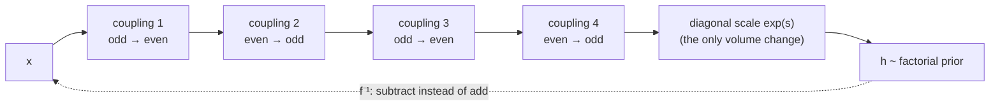

## Abstract

NICE asks for a generative model whose log-likelihood is exact, whose sampling is exact, and whose training needs no Monte Carlo anywhere. It gets all three by restricting the model to invertible maps with a cheap Jacobian determinant. The building block is the *additive coupling layer*: partition $x$ into $(x_{I_1},x_{I_2})$, copy $x_{I_1}$ through unchanged, and add to $x_{I_2}$ an arbitrary function $m(x_{I_1})$ — a ReLU MLP in the experiments. The Jacobian of that map is lower-triangular with ones on the diagonal, so its determinant is $1$ for any $m$ whatsoever, and the inverse is one subtraction. Stacking four such layers with the roles of the two halves swapped, and capping the stack with a single diagonal rescaling that is the only thing in the model that changes volume, gives a density $p_X(x)=p_H(f(x))\lvert\det\partial f/\partial x\rvert$ that can be maximised directly by gradient descent. On MNIST, the Toronto Face Dataset, SVHN and CIFAR-10 the resulting test log-likelihoods are 1980.50, 5514.71, 11496.55 and 5371.78 nats; on the two datasets where a comparison exists, this beats the previously reported deep mixture of factor analysers. The paper is four pages of architecture and a page of numbers, and it is the paper every later flow is a variation on.

**Keywords:** normalizing flow, change of variables, additive coupling layer, triangular Jacobian, exact likelihood, ancestral sampling

## 1 Introduction

The framing is a representation-learning one, not a sampling one: *a good representation is one in which the distribution of the data is easy to model*. Push that to its limit and you ask for a transformation $h=f(x)$ under which the components of $h$ are independent,

$$
p_H(h)=\prod_d p_{H_d}(h_d),
$$

which is non-linear independent components estimation — the name is the programme. If $f$ is a bijection between spaces of equal dimension, the change-of-variables formula gives the density of $x$ exactly:

$$
p_X(x)=p_H(f(x))\left\lvert\det\frac{\partial f(x)}{\partial x}\right\rvert. \tag{1}
$$

Every term on the right is something you can choose. $p_H$ is a fixed factorial prior. $f$ is a neural network. The only obstruction is the determinant, which for a general $D\times D$ Jacobian costs $O(D^3)$ per data point and is not something you want inside a training loop at $D=3072$.

Two things follow immediately once (1) is tractable, and they are the reason this line of work exists at all. First, the training criterion is the exact log-likelihood — not a bound, not an adversarial proxy, not an MCMC estimate. Second, sampling is *ancestral*: draw $h\sim p_H$, return $x=f^{-1}(h)$, with no chain and no rejection. The contribution of the paper is a family of $f$ for which both the determinant and the inverse are trivial while $f$ is still as expressive as a deep network.

That combination is what makes this line of models interesting to me beyond image generation. If you want to compare two models of the same data — which is what a posterior model probability is — you need $p(x\mid\text{model})$, not a lower bound on it and not a sample from something adversarially trained to look like it. A GAN generator induces a distribution on $\mathbb{R}^D$ that has no density at all with respect to Lebesgue measure when the latent dimension is smaller than $D$, so a "posterior model probability" computed from a GAN prior is not merely hard to compute, it is not well defined. A flow does have a density, everywhere, by construction. NICE is where that construction starts.

## 2 Prior work

The paper situates itself against four families, and the comparison is sharper than usual because all four are attacking the same object — $\log p(x)$ — with different compromises.

**Undirected models.** Deep Boltzmann machines have an intractable partition function. Training and sampling both need MCMC, the chains mix badly when the target has sharp modes, and the best available likelihood estimator, annealed importance sampling, was shown by Grosse et al. (2013) to be able to give an *optimistically* biased number. So the reported likelihoods are not trustworthy in the direction that matters.

**Variational autoencoders.** A VAE has a stochastic encoder $q(h\mid x)$ and an imperfect decoder $p(x\mid h)$, so the criterion is the evidence lower bound rather than the likelihood. Two consequences are named. The bound may be loose in a way that leaves a suboptimal solution looking fine, and the stochastic decoder injects low-level noise at the last stage of generation because the visibles are conditionally independent given $h$. NICE's decoder is deterministic — $f^{-1}$ — precisely to remove that noise.

The relation is made exact rather than rhetorical. Section 4 observes that the NICE criterion *is* the variational criterion with the reconstruction term identically zero: because $f$ and $f^{-1}$ are a perfect autoencoder pair, only the KL term survives, $\log p_H(f(x))$ acting as the prior term and $\log\lvert\det\partial f/\partial x\rvert$ as the entropy term, which measures local volume expansion around the data. Appendix C goes further and shows that stochastic gradient variational Bayes with the reparameterisation trick is maximising the joint log-likelihood of the pair $(x,\epsilon)$ under *a NICE model with two affine coupling layers and a Gaussian prior*, where $\epsilon$ is the auxiliary noise variable. The derivation is six lines of substituting $\xi=(x-f_\theta(z))/\sigma$ and cancelling. It is the cleanest statement I know of that a VAE is a flow with a deliberately crippled encoder.

**Autoregressive networks.** NADE and its relatives also achieve tractable likelihood through triangular structure — the adjacency matrix of the directed model is strictly triangular. The cost is that ancestral sampling is element-by-element and therefore sequential and unparallelisable in $D$. The paper's own framing is that *a NICE model with one coupling layer is a block version of NADE with two blocks*: same triangular trick, coarser partition, parallel sampling. That sentence is the whole coupling-versus-autoregressive trade-off in one line, and [MAF](/blog/maf/) and [IAF](/blog/iaf/) are what happens when you take the fine-grained end of it seriously.

**GANs.** Also transform a simple distribution into the data distribution, also sample by one forward pass, but have no encoder and no likelihood; the training signal comes from a discriminator instead.

**Earlier change-of-variables work.** Independent component analysis in its maximum-likelihood form learns an *orthogonal* transformation and needs a re-orthogonalisation between updates. Bengio (1991) proposed learning a richer class but neural networks in general lack the structure to make inference practical. Chen and Gopinath's Gaussianization (2000) learns a layered transformation greedily and has no tractable sampling procedure. Rippel and Adams (2013) revive the idea but, lacking a bijectivity constraint, fall back to a regularised autoencoder as a proxy. The gap NICE fills is a *jointly trained, exactly invertible, cheaply differentiable* family.

## 3 Method

> **Key idea.** Make half the coordinates pass through untouched. Then whatever you do to the other half — however non-linear, however deep — contributes nothing to the Jacobian determinant, because the Jacobian is block-triangular with an identity block and the other diagonal block is the identity too.

### 3.1 The criterion

With $p_H$ factorial, (1) in logs is

$$
\log p_X(x)=\sum_{d=1}^{D}\log p_{H_d}(f_d(x))+\log\left\lvert\det\frac{\partial f(x)}{\partial x}\right\rvert. \tag{2}
$$

There is a degeneracy lurking here that the paper flags and then disposes of in one sentence: an invertible preprocessing can raise the likelihood arbitrarily just by contracting the data, since shrinking everything concentrates the density. The determinant term is exactly what cancels that. It *penalises contraction and rewards expansion in regions of high density*, so the model cannot buy likelihood by shrinking; it has to buy it by putting volume where the data is. This is the same bookkeeping that makes bits-per-dimension comparable across models, and it is worth internalising early because it is the source of most likelihood-comparison mistakes in this literature.

### 3.2 Triangular structure

If $f=f_L\circ\cdots\circ f_1$ then the forward map, the inverse and the determinant all compose: the determinant of the whole is the product of the determinants of the layers. So it suffices to find layers with tractable determinants. Triangular matrices qualify — determinant is the product of the diagonal — and many square matrices factor as $M=LU$. One could build a network with triangular weight matrices and bijective activations, but that pins down the architecture to a choice of depth and non-linearity and nothing else. The alternative the paper takes is to keep the *function* general and constrain only the *Jacobian* to be triangular with an easily computed diagonal.

### 3.3 The coupling layer

Partition $\llbracket 1,D\rrbracket$ into $I_1$ and $I_2$ with $\lvert I_1\rvert=d$. Let $m:\mathbb{R}^d\to\mathbb{R}^{D-d}$ be arbitrary and let $g$ be a *coupling law*, invertible in its first argument given the second. Then

$$
y_{I_1}=x_{I_1},\qquad y_{I_2}=g\bigl(x_{I_2};m(x_{I_1})\bigr), \tag{3}
$$

with Jacobian

$$
\frac{\partial y}{\partial x}=
\begin{bmatrix}
I_d & 0\\[2pt]
\dfrac{\partial y_{I_2}}{\partial x_{I_1}} & \dfrac{\partial y_{I_2}}{\partial x_{I_2}}
\end{bmatrix},
\qquad
\det\frac{\partial y}{\partial x}=\det\frac{\partial y_{I_2}}{\partial x_{I_2}}.
$$

The off-diagonal block — which is where all the work of $m$ shows up, including every derivative of every weight in it — never enters the determinant. Inversion is

$$
x_{I_1}=y_{I_1},\qquad x_{I_2}=g^{-1}\bigl(y_{I_2};m(y_{I_1})\bigr),
$$

and note what it does *not* require: $m$ is never inverted. It is evaluated forwards in both directions. This is why $m$ may be an arbitrarily deep, arbitrarily non-invertible ReLU network, and it is the single structural idea the whole family rests on.

**The additive law.** NICE takes $g(a;b)=a+b$:

$$
y_{I_2}=x_{I_2}+m(x_{I_1}),\qquad x_{I_2}=y_{I_2}-m(y_{I_1}). \tag{4}
$$

Now $\partial y_{I_2}/\partial x_{I_2}=I$, so the determinant is exactly $1$: the layer is *volume preserving*. The inverse costs the same as the forward. The paper notes the alternatives it did not take — multiplicative $g(a;b)=a\odot b$ and affine $g(a;b)=a\odot b_1+b_2$ — and gives the reason: the additive law was chosen *for numerical stability*, since with a rectified $m$ the transformation becomes piecewise linear. That parenthetical is worth marking, because the affine coupling law it declines is exactly what [RealNVP](/blog/realnvp/) adopts two years later, and the stability concern turns out to be manageable with an $\exp$ parameterisation of the scale.

**Stacking.** A coupling layer leaves half its input alone, so the partition must alternate. The paper states the counting argument: *at least three* coupling layers are needed before every dimension can influence every other, and they generally use four. The reasoning is that after one layer $I_1$ is untouched, after two $I_1$ has been updated using $I_2$ but $I_2$'s update did not see its own influence, and only the third closes the loop. Four is used with the odd/even split

$$
\begin{aligned}
h^{(1)}_{I_1}&=x_{I_1}, & h^{(1)}_{I_2}&=x_{I_2}+m^{(1)}(x_{I_1}),\\
h^{(2)}_{I_2}&=h^{(1)}_{I_2}, & h^{(2)}_{I_1}&=h^{(1)}_{I_1}+m^{(2)}(h^{(1)}_{I_2}),\\
h^{(3)}_{I_1}&=h^{(2)}_{I_1}, & h^{(3)}_{I_2}&=h^{(2)}_{I_2}+m^{(3)}(h^{(2)}_{I_1}),\\
h^{(4)}_{I_2}&=h^{(3)}_{I_2}, & h^{(4)}_{I_1}&=h^{(3)}_{I_1}+m^{(4)}(h^{(3)}_{I_2}).
\end{aligned}
$$

(The paper writes the arguments of $m^{(2)}$ and $m^{(4)}$ as $x_{I_2}$ and $x_{I_1}$ rather than the current $h$; read in context with the alternating-partition rule, these are the outputs of the preceding layer.)

### 3.4 The rescaling layer, and why the model needs one

A composition of volume-preserving maps is volume preserving. A model that cannot change volume anywhere cannot express that the data occupies a thin region of $\mathbb{R}^D$ — which images emphatically do. So the top of the stack is a diagonal scaling $h=\exp(s)\odot h^{(4)}$, and the criterion becomes

$$
\log p_X(x)=\sum_{i=1}^{D}\Bigl[\log p_{H_i}(f_i(x))+s_i\Bigr], \tag{5}
$$

the second term being $\log\lvert S_{ii}\rvert$ with $S_{ii}=e^{s_i}$. Every bit of volume change in the entire model lives in $D$ scalars.

The paper reads these scalars as a non-linear eigenspectrum. Setting $\sigma_d=S_{dd}^{-1}$, the $\sigma_d$ are the scales of the independent components; sorting and plotting them ([Fig. 8](https://arxiv.org/pdf/1410.8516#page=13)) gives the flow analogue of a PCA spectrum, and its decay says how many directions the model is actually using. In the limit $S_{ii}\to\infty$ the effective dimensionality drops by one — the model has learned a manifold — and this stays legal as long as $f$ remains invertible at the data. The two terms pull against each other in a way worth stating: the prior term wants $S_{ii}$ small (latents pulled towards the mode), while $\log S_{ii}$ in (5) diverges to $-\infty$ as $S_{ii}\to0$, so nothing collapses.

### 3.5 Prior

Factorial, and chosen from a standard family. Gaussian, $\log p_{H_d}=-\tfrac12(h_d^2+\log 2\pi)$, or logistic,

$$
\log p_{H_d}(h_d)=-\log\bigl(1+e^{h_d}\bigr)-\log\bigl(1+e^{-h_d}\bigr),
$$

with the note that they *tend to use the logistic distribution as it tends to provide a better behaved gradient*. The reason is visible in the derivative: the logistic score is $-\tanh(h_d/2)$, bounded in $[-1,1]$, whereas the Gaussian score $-h_d$ is unbounded. A far-out latent produces a bounded gradient under the logistic prior and an arbitrarily large one under the Gaussian. The footnote that the prior *does not need to be constant and could also be learned* is the seed of every conditional and learned-base-distribution flow that follows.

### 3.6 Algorithm

```text
TRAIN
  repeat until converged:
    x ~ data
    x = (x + u/256) rescaled to [0,1]        # dequantise; CIFAR-10 uses u/128 -> [-1,1]
    h = x
    for l in 1..4:                           # alternate which half is the identity
      A, B = partition(h, l)                 # A passes through, B is shifted
      B = B + m_l(A)
      h = join(A, B)
    h = exp(s) * h
    loss = -( sum_i log p_H(h_i) + sum_i s_i )
    theta, s = adam_step(theta, s, grad(loss))

SAMPLE
  h ~ p_H                                    # logistic or Gaussian, factorial
  h = h / exp(s)
  for l in 4..1:                             # exact inverse, same cost as forward
    A, B = partition(h, l)
    B = B - m_l(A)
    h = join(A, B)
  return h
```



## 4 Implementation notes

| | MNIST | TFD | SVHN | CIFAR-10 |
|---|---|---|---|---|
| Dimensions | 784 | 2304 | 3072 | 3072 |
| Preprocessing | none | approx. whitening | ZCA | ZCA |
| Hidden layers per $m$ | 5 | 4 | 4 | 4 |
| Hidden units per layer | 1000 | 5000 | 2000 | 2000 |
| Prior | logistic | Gaussian | logistic | logistic |
| Test log-likelihood (nats) | 1980.50 | 5514.71 | 11496.55 | 5371.78 |

Details that matter when reproducing:

- **Dequantisation.** Uniform noise of $1/256$ added and the data rescaled to $[0,1]^D$, following Uria et al. (2013) — except CIFAR-10, which gets $1/128$ and $[-1,1]^D$. The two conventions are not interchangeable and the reported numbers are not comparable across them without redoing the change of variables.
- **Coupling functions.** All four $m^{(l)}$ are deep rectified networks with linear output units, and all four share the same architecture within a dataset. There is no weight sharing between them.
- **Optimiser.** Adam, learning rate $10^{-3}$, momentum $0.9$, $\beta_2=0.01$, $\lambda=1$, $\epsilon=10^{-4}$, 1500 epochs, model selected by validation log-likelihood. The $\beta_2=0.01$ is worth a flag: in the standard Adam parameterisation $\beta_2$ is a decay near $1$, so this is either the complement $1-\beta_2$ or an early-draft convention. Taken literally it is a second-moment memory of about a hundred steps, which is not absurd, but it is not the usual $0.999$.
- **The whitening is part of the model for TFD and not for SVHN/CIFAR-10.** Appendix B says the approximate whitening is itself learned *within the NICE framework*, as $z=Lx+b$ with $L$ lower triangular and a standard Gaussian prior — i.e. it is one more flow layer, and its log-determinant is accounted for. ZCA, used for the other two datasets, is a fixed linear map, and **the paper does not state whether its log-determinant is added back into the reported log-likelihood.** Marked: not stated. For SVHN and CIFAR-10 this is a constant offset shared by all models trained on the same ZCA, so within-paper comparisons survive, but the absolute numbers should not be carried across papers.
- **Log-likelihoods are in nats on data scaled differently per dataset**, not bits per dimension. Dividing by $D\log2$ and correcting for the rescaling is left to the reader, which is part of why this era's numbers are hard to line up against later work.

## 5 Experiments

**Density estimation.** Four image datasets, one architecture family, the numbers in the table above. The only external comparison is [Fig. 4](https://arxiv.org/pdf/1410.8516#page=7):

| Model | TFD | CIFAR-10 |
|---|---|---|
| NICE | **5514.71** | **5371.78** |
| Deep MFA | 5250 | 3622 |
| GRBM | 2413 | 2365 |

with the paper's own caveat attached: the deep mixture of factor analysers numbers are *variational lower bounds*, so the comparison is between an exact likelihood and a lower bound on a different model's likelihood. A bound being smaller than an exact value proves nothing about the ordering of the two likelihoods. The honest reading of the CIFAR-10 row is that NICE's exact 5371.78 exceeds a lower bound of 3622 — informative in a weak sense, not a clean win. For continuous MNIST the paper declines to compare at all, because the literature evaluated it with Parzen-window estimates and *no fair comparison can be made*. That refusal is more credible than most comparisons of the period.

**Samples.** [Fig. 5](https://arxiv.org/pdf/1410.8516#page=8) shows unbiased ancestral samples for all four datasets — unbiased in the strict sense that they are exact draws from the model, since the sampler is $f^{-1}$ applied to a prior draw and has no approximation anywhere. Quality is 2015-tier: MNIST digits are legible, natural images are not.

**Manifold structure.** [Fig. 7](https://arxiv.org/pdf/1410.8516#page=12) maps a randomly rotated 3-sphere in latent space through $f^{-1}$; [Fig. 8](https://arxiv.org/pdf/1410.8516#page=13) plots the sorted $\sigma_d$ per dataset. Both are qualitative and neither is tied to a number.

**Inpainting.** Not trained for; done post hoc by clamping observed pixels $x_O$ and running projected gradient ascent on $\log p_X((x_O,x_H))$ over the hidden pixels, with Gaussian noise added and step size $\alpha_i=10/(100+i)$. Ten masks on MNIST, from "top rows" to "90% random" ([Fig. 6](https://arxiv.org/pdf/1410.8516#page=9)). The paper's own verdict: *reasonable qualitative performance, but note the occasional presence of spurious modes*. This is a genuinely instructive demonstration — it works only because the model gives you $\log p$ of a partially specified input and its gradient, which a GAN cannot provide — and it is also the weakest experiment, with no metric of any kind.

**What the experiments do and do not establish.** They establish that the architecture trains, that exact likelihood is achievable at $D=3072$, and that the resulting number beats the contemporary alternatives on the two datasets where a number existed. They do not establish anything about sample quality (no metric existed and none is reported), about the value of four layers over three or six (no depth ablation), about additive versus affine coupling (the affine law is declined on stated grounds, never tested), or about the odd/even partition versus any other (no ablation). This is a workshop paper and reads like one.

## 6 Limitations

**Stated by the authors.** Very little, directly: the conclusion is three sentences and claims "competitive results". The honest admissions are scattered — the Deep MFA comparison is flagged as a bound, the MNIST comparison is declined, the inpainting has spurious modes.

**My reading.**

- **The dimension of the latent equals the dimension of the data, always.** There is no compression, and the model must spend capacity representing every direction including pure sensor noise. The rescaling layer can push a direction towards irrelevance but never removes it, and every sample has full-dimensional support. For image data this is the well-known reason flows need far more parameters than a VAE of comparable quality; for tabular data with genuinely redundant columns it is worse, because an exactly collinear pair makes the true density singular and the likelihood unbounded.
- **Volume preservation is a severe restriction and the fix is a $D$-parameter afterthought.** All the non-linearity in the model changes shape but not local volume; the only scaling is global per-coordinate and sits at the top. RealNVP's affine coupling makes the scale input-dependent, and the gap in reported likelihood between the two papers is large.
- **The partition is fixed and hand-chosen.** Odd/even indices for an image is a checkerboard on a flattened raster, which is a reasonable prior for images and an arbitrary one for anything else. Nothing here learns the partition; Glow's invertible $1\times1$ convolution is the eventual answer.
- **No held-out evaluation protocol is described** beyond "best model in terms of validation log-likelihood after 1500 epochs" — no seeds, no repeats, no error bars, one number per cell.
- **Likelihood is reported in nats on inconsistently preprocessed data**, with the ZCA log-determinant question unresolved. This makes the table a within-paper artefact.
- **The theory is entirely about tractability, not about expressiveness.** Nothing in the paper says what densities a stack of additive coupling layers can and cannot represent. The universality question for coupling flows was not settled for years afterwards.

## 7 Extensions

**What was built on this.** Directly: [RealNVP](/blog/realnvp/) replaces the additive law with an affine one, adds checkerboard and channel-wise masks and a multi-scale architecture; Glow replaces the fixed alternation with a learned invertible $1\times1$ convolution and adds activation normalisation; [Neural Spline Flows](/blog/neural-spline-flows/) replace the affine law with a monotone rational-quadratic spline, which is where coupling layers stop being the expressiveness bottleneck. In the other direction, the autoregressive limit of the same triangular trick gives [MAF](/blog/maf/) and [IAF](/blog/iaf/). Letting the number of layers go to infinity gives continuous normalizing flows and [FFJORD](/blog/ffjord/); dropping invertibility of the map in favour of learning the velocity field directly gives [Flow Matching](/blog/flow-matching/) and Rectified Flow. The [Papamakarios et al. survey](/blog/normalizing-flows-survey/) is the map of all of it.

**Open problems the paper leaves.** What is the expressive class of a depth-$L$ additive coupling flow? How should the partition be chosen for non-image data, where there is no spatial prior to appeal to? How much does the volume-preserving restriction cost, measured rather than argued? And the question the rescaling-layer spectrum raises and does not answer: if the model concentrates on a low-dimensional manifold, can that be read off reliably enough to use as a dimension estimate?

**Research directions.** *These are ideas, not results — none has been run.*

1. **Measure the cost of volume preservation directly.** Hypothesis: on data with strongly heteroscedastic coordinates — daily returns of assets with very different volatilities, say — the gap between additive and affine coupling at matched parameter count is large and grows with the spread of marginal scales, because a global $\exp(s)$ cannot adapt volume locally. Data: a synthetic family of Gaussian mixtures with controlled per-coordinate scale spread, plus a panel of standardised daily equity returns. Baseline: the same stack with the affine law of RealNVP and the same parameter budget. Metric: held-out log-likelihood gap against the scale-spread parameter. Likely failure mode: standardising the data removes most of the spread, so the effect only appears in the synthetic arm and the financial arm shows nothing.
2. **A coupling flow as the prior in Bayesian factor selection.** Hypothesis: replacing a GAN-based generator of candidate factor-return distributions with a coupling flow makes posterior model probabilities computable at all, and the ranking of candidate factor subsets is stable under retraining in a way the GAN's is not (because the GAN has no density, the "probability" it would supply is a proxy chosen by the modeller). Data: a monthly factor-return panel with a fixed set of candidate factors and a held-out period. Baseline: the same selection procedure driven by a GAN-based proxy score and by a Gaussian likelihood. Metric: rank correlation of the selected subsets across five retrainings, plus out-of-sample predictive log-likelihood of the selected model. Likely failure mode: a flow in a few dozen dimensions trained on a few hundred monthly observations is badly under-determined, and the run-to-run variance swamps the comparison — in which case the honest result is a sample-size requirement, not a ranking.
3. **Read the rescaling spectrum as an intrinsic-dimension estimator.** Hypothesis: the knee in the sorted $\sigma_d$ curve of a NICE model tracks the true intrinsic dimension on synthetic manifolds embedded in $\mathbb{R}^D$, and does so more stably than a local PCA estimator as the noise level rises. Data: $k$-dimensional manifolds embedded in $D=100$ with Gaussian noise of varying magnitude. Baseline: local-PCA and two-nearest-neighbour intrinsic-dimension estimators. Metric: estimated versus true $k$ across noise levels. Likely failure mode: the spectrum depends on the coupling architecture and the partition rather than on the data, so the knee moves when you change depth — which would itself be worth reporting, as it would mean the "non-linear eigenspectrum" reading is decorative.

## 8 Takeaways

- Exact likelihood plus exact sampling is buyable, and the price is one structural constraint: the map must be invertible with a cheap-determinant Jacobian. Everything else in the flow literature is negotiation over how to pay less for that constraint.
- The coupling layer is the trick. Because half the input passes through unchanged, the network $m$ never appears in the determinant and is never inverted, so it can be arbitrarily deep and arbitrarily non-invertible.
- Additive coupling is volume preserving, which is why the model needs a diagonal scaling on top; that layer is the only place in the whole architecture where volume changes, and its coefficients read as a non-linear PCA spectrum.
- Three coupling layers is the minimum for full mixing under a two-block partition; NICE uses four, and does not ablate it.
- The VAE connection is exact, not analogical: SGVB maximises the likelihood of $(x,\epsilon)$ in a NICE model with two affine coupling layers. A VAE is a flow with a stochastic encoder that costs you the gap between the bound and the truth.
- The evidence is thin by modern standards — one number per dataset, one external baseline that is a lower bound on a different model, no ablations, no seeds — and the paper is largely honest about it.
- For model comparison, which is where I care about this, the relevant property is not sample quality but that $p(x\mid\text{model})$ exists and is computable. A GAN prior does not have one; a flow prior does, at the cost of a latent space as large as the data space.

## References

1. Dinh, L., Krueger, D., Bengio, Y. *NICE: Non-linear Independent Components Estimation.* arXiv:1410.8516 (ICLR 2015 workshop).
2. Dinh, L., Sohl-Dickstein, J., Bengio, S. *Density Estimation using Real NVP.* arXiv:1605.08803.
3. Kingma, D. P., Welling, M. *Auto-Encoding Variational Bayes.* ICLR 2014.
4. Larochelle, H., Murray, I. *The Neural Autoregressive Distribution Estimator.* AISTATS 2011.
5. Tang, Y., Salakhutdinov, R., Hinton, G. *Deep Mixtures of Factor Analysers.* arXiv:1206.4635.
6. Uria, B., Murray, I., Larochelle, H. *RNADE: The Real-Valued Neural Autoregressive Density-Estimator.* NIPS 2013.
7. Grosse, R., Maddison, C., Salakhutdinov, R. *Annealing Between Distributions by Averaging Moments.* NIPS 2013.
