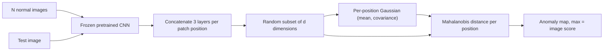

## Abstract

PaDiM is a defect detector that never trains a neural network. It passes defect-free images through an ImageNet-pretrained CNN, stacks activations from three layers into one vector per patch position, and summarizes what "normal" looks like at each position with a mean and a full covariance matrix. A test patch is scored by its Mahalanobis distance to the Gaussian at the same position; the grid of scores is the anomaly map and its maximum is the image score. Since only Gaussian parameters are stored, test-time cost does not grow with the training set, unlike nearest-neighbour methods such as SPADE. On MVTec AD the Wide-ResNet variant reaches 97.5% pixel AUROC and 92.1% PRO, and a rotated-and-cropped version of the benchmark is added to test robustness to misalignment.

**Keywords:** anomaly localization, one-class learning, pretrained CNN features, multivariate Gaussian, Mahalanobis distance, MVTec AD

## 1 Introduction

Industrial inspection has plenty of images of good parts, almost none of bad ones, and defects that can look like anything. The task is therefore posed as one-class learning: the model sees only normal images and must flag whatever deviates at test time, ideally pixel by pixel.

The paper sorts earlier work into two families. Reconstruction methods (autoencoders, VAEs, GANs) learn to redraw normal images and treat reconstruction error as the anomaly signal. They need a training run per product, and an autoencoder can generalize well enough to reconstruct defects too, which erases the signal. Embedding-similarity methods compare deep features of a test image with features of normal images. The best localizer at the time, SPADE, keeps every training embedding and runs k-nearest-neighbour search at test time. <mark>That makes SPADE's inference time and memory grow linearly with the training set</mark>.

PaDiM keeps the pretrained-feature idea and replaces the stored set of embeddings with a parametric summary.

## 2 Background

Two ingredients are borrowed. From SPADE comes the patch embedding: activations from several depths of a pretrained CNN are aligned spatially and concatenated, so each location carries both fine and semantic cues. From Rippel et al. (MahalanobisAD) and Lee et al. comes the scoring rule: fit a Gaussian to pretrained features of normal data and use Mahalanobis distance as the anomaly score. Those works did this per image; PaDiM does it per patch position, with one covariance matrix spanning all layers.

Localization is measured by pixel AUROC, which favours large defects, and by the PRO score, which averages overlap per connected defect region for false positive rates up to 0.3 so that small defects count equally.

## 3 Method

> **Key idea.** Treat every patch position $(i,j)$ as its own small density-estimation problem. The multi-layer embeddings seen there across the $N$ normal images are assumed Gaussian; estimate mean and full covariance once, then measure how many "standard deviations" away a test embedding lies.

The paper's own overview is [Fig. 2 in the paper](https://arxiv.org/pdf/2011.08785#page=2).

### 3.1 Patch embeddings

The image is divided into a $W \times H$ grid, where $W \times H$ is the resolution of the largest feature map used. Deeper, coarser maps are aligned to that grid and concatenated, giving one vector $x_{ij}$ per position. For ResNet-type backbones the first three layer groups are used; for EfficientNet-B5, layers 7, 20 and 26. With ResNet18 the concatenated vector has 448 dimensions.

These vectors are redundant, so the authors shrink them, with an odd finding: <mark>keeping a random subset of dimensions beats PCA at the same size</mark>. With 100 dimensions, random selection gives (96.7, 90.5) in (AUROC, PRO) across all classes against (93.5, 85.7) for PCA (the paper's Table II; its Table III reports PRO 90.1 for the same model), and only 0.4 points of AUROC below the full 448 dimensions. Their explanation is that PCA keeps the highest-variance directions of normal data, which need not be where defects show up.

### 3.2 Learning normality

For position $(i,j)$, collect $X_{ij} = \{x_{ij}^k,\ k = 1,\dots,N\}$ from the $N$ training images. The mean $\mu_{ij}$ is the sample mean, and the covariance is

$$
\Sigma_{ij} = \frac{1}{N-1}\sum_{k=1}^{N} (x_{ij}^k - \mu_{ij})(x_{ij}^k - \mu_{ij})^{\top} + \epsilon I \tag{1}
$$

The $\epsilon I$ term ($\epsilon = 0.01$) keeps the matrix invertible, which matters because a class has only a few hundred training images while the embedding can have more dimensions than that. Since $x_{ij}$ contains features from three depths, <mark>the off-diagonal blocks of $\Sigma_{ij}$ encode correlations between semantic levels</mark>.

### 3.3 Scoring

A test embedding is scored by

$$
M(x_{ij}) = \sqrt{(x_{ij} - \mu_{ij})^{\top}\, \Sigma_{ij}^{-1}\, (x_{ij} - \mu_{ij})} \tag{2}
$$

The matrix of $M(x_{ij})$ values is upsampled to image size and smoothed with a Gaussian filter ($\sigma = 4$) to form the anomaly map. The image-level score is its maximum. No search and no sorting are involved.

## 4 Experiments

**Setup.** MVTec AD has 15 classes (10 objects, 5 textures) of roughly 240 images each; images are resized to 256 and centre-cropped to 224. Backbones are ResNet18 (reduced to 100 dimensions), Wide ResNet-50-2 (reduced to 550) and EfficientNet-B5, all ImageNet-pretrained. SPADE is re-implemented with the same Wide ResNet; a ResNet18-encoder VAE is the reconstruction baseline. Rd-MVTec AD applies random rotations in $(-10^\circ, +10^\circ)$ and random crops to train and test images; ShanghaiTech Campus (STC) is a surveillance-video benchmark.

**Localization on MVTec AD** (pixel AUROC %, PRO %):

| Method | Textures | Objects | All classes |
|---|---|---|---|
| AE-SSIM | (78, 56.7) | (91, 75.8) | (87, 69.4) |
| VAE | (61.2, 49.9) | (81.0, 71.4) | (74.4, 64.2) |
| Patch-SVDD | (93.7, –) | (96.7, –) | (95.7, –) |
| SPADE | (92.9, 88.4) | (97.6, 93.4) | (96.5, 91.7) |
| PaDiM-R18-Rd100 | (95.6, 91.3) | (97.3, 89.4) | (96.7, 90.1) |
| **PaDiM-WR50-Rd550** | **(96.9, 93.2)** | (97.8, 91.6) | **(97.5, 92.1)** |

The gain is concentrated in textures, where PaDiM-WR50 leads SPADE by 4.0 AUROC points and 4.8 PRO points. On objects, AUROC is marginally higher, but <mark>SPADE still has the better PRO score on object classes (93.4 vs 91.6)</mark>.

**Ablation on layers.** With ResNet18, single layers reach 94.8 to 95.7 AUROC. Summing the three single-layer anomaly maps gives (96.0, 89.0); one joint Gaussian over all three gives (97.1, 90.8). The 1.1 / 1.8 point gap comes from cross-layer covariance alone.

**Image-level detection.** PaDiM-WR50 scores 95.3 AUROC, slightly below MahalanobisAD with EfficientNet-B4 (95.8); with EfficientNet-B5, PaDiM reaches 97.9.

**Misalignment and STC.** On Rd-MVTec AD, PaDiM-WR50 drops to (92.2, 73.1), a 5.3-point AUROC loss, compared with 8.8 for SPADE and 12.2 for the VAE. On STC the small ResNet18 model gets 91.2 AUROC versus 89.9 for SPADE.

**Cost.** On a laptop-class CPU, <mark>inference takes 0.23 s (R18) or 0.95 s (WR50) per image against 7.10 s for SPADE</mark>. Memory is a different story: the WR50 model needs 3.8 GB on MVTec AD versus 1.4 GB for SPADE, since a full covariance is stored per position. The advantage appears only on large training sets: on STC, SPADE needs 37.0 GB and PaDiM 5.2 GB.

## 5 Discussion

**Strengths.** No gradient step, two closed-form estimators, one distance. Inference cost is fixed by image resolution and embedding size, not by how much data was collected. The cross-layer covariance ablation cleanly isolates the actual contribution.

**Weaknesses.** The model is tied to pixel coordinates. A Gaussian at $(i,j)$ only makes sense if the same part of the object lands there in every image, and the Rd-MVTec experiment shows the price: the PRO score falls from 92.1 to 73.1 under small rotations and crops. A single Gaussian also cannot represent multi-modal normality at a position. The covariance is estimated from a few hundred samples at most in up to 550 dimensions, so it leans on the $\epsilon I$ regularizer, whose sensitivity is not studied. Memory scales quadratically in the embedding size.

**Not shown.** No experiment with fewer training images, no check that the embeddings are actually Gaussian, and only a plausible argument for the random-beats-PCA result. The strongest image-level number relies on switching to EfficientNet-B5, a backbone choice made on the benchmark itself.

## 6 Takeaways

- A frozen ImageNet backbone plus per-position Gaussian statistics is a serious baseline for defect localization; fitting the largest model takes about 150 s per MVTec class on a CPU.
- Modeling covariance *across* feature depths, not just within a layer, is what separates PaDiM from a simple ensemble of per-layer detectors.
- Random feature selection beating PCA is a reminder that high-variance directions of normal data are not necessarily where anomalies live.
- The positional Gaussian is both the source of constant-time inference and the main limitation; PatchCore (next in this series) drops the positional tie and returns to a memory bank.
- For financial time series the link is only by analogy: PaDiM is anomaly detection as explicit density estimation, the same logic as a Mahalanobis distance on a vector of returns or factor exposures. The caveats transfer too: few observations per dimension and a Gaussian assumption on heavy-tailed data are where such scores become unreliable.

## References

1. T. Defard, A. Setkov, A. Loesch, R. Audigier. *PaDiM: a Patch Distribution Modeling Framework for Anomaly Detection and Localization.* arXiv:2011.08785, 2020.
2. N. Cohen, Y. Hoshen. *Sub-Image Anomaly Detection with Deep Pyramid Correspondences (SPADE).* arXiv:2005.02357, 2020.
3. O. Rippel, P. Mertens, D. Merhof. *Modeling the Distribution of Normal Data in Pre-Trained Deep Features for Anomaly Detection.* arXiv:2005.14140, 2020.
4. P. Bergmann, M. Fauser, D. Sattlegger, C. Steger. *MVTec AD — A Comprehensive Real-World Dataset for Unsupervised Anomaly Detection.* CVPR 2019.
5. K. Roth et al. *Towards Total Recall in Industrial Anomaly Detection (PatchCore).* arXiv:2106.08265, 2021.
