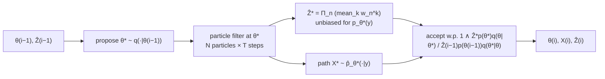

## Abstract

MCMC and SMC are the two general-purpose samplers, and each fails where the other is strong. MCMC over a state-space model's latent path must update $x_{1:T}$ in blocks, because designing a proposal for the whole path is hopeless; that caps the block size and cripples mixing when the path is strongly dependent. SMC builds exactly such a high-dimensional proposal, sequentially, but cannot handle static parameters. Particle MCMC composes them the *un*obvious way round: run a particle filter to propose the entire path, then accept or reject with Metropolis–Hastings. The obstacle is that the marginal density of a particle produced by a filter is not available — it is an expectation over every random number the filter drew — so the acceptance ratio cannot be formed. The resolution is to target an extended distribution on the space that includes *all* the filter's random variables, at which point the ratio collapses to a ratio of the filter's own marginal-likelihood estimates $\hat p_\theta(y_{1:T})$. Three algorithms follow: particle IMH, particle marginal MH (which targets $p(\theta\mid y_{1:T})$ directly), and particle Gibbs (which needs a *conditional* SMC update that forces a reference path to survive every resampling). All are **exact approximations**: for any $N\ge1$, not merely as $N\to\infty$, the transition kernels leave the exact posterior invariant.

**Keywords:** particle MCMC, pseudo-marginal, exact approximation, conditional SMC, particle Gibbs, state-space models, Lévy-driven stochastic volatility

## 1 Introduction

The composition is stated with unusual precision about its direction: *several algorithms combining MCMC and SMC approaches have already been proposed. In particular, MCMC kernels have been used to build proposal distributions for SMC algorithms (Gilks and Berzuini, 2001). Our approach is entirely different as we use SMC algorithms to design efficient high dimensional proposal distributions for MCMC algorithms.*

That inversion matters. [SMC samplers](/blog/smc-samplers/) put MCMC kernels inside a particle method to move particles between targets. Here the particle filter is the *proposal* and MCMC is the outer loop, which is what makes static parameters tractable — they live in the outer chain, where they can move freely, instead of being frozen into a particle cloud that can only be pruned, which is how the [auxiliary particle filter](/blog/auxiliary-particle-filter/) had to attempt it.

The diagnosis of why MCMC struggles on state-space models is precise. Sampling exactly from $p_\theta(x_{1:T}\mid y_{1:T})$ *is possible for two scenarios only: linear Gaussian models and finite state space hidden Markov models*. Otherwise you divide $x_{1:T}$ into blocks of length $K$ and update each in turn, targeting

$$
p_\theta\bigl(x_{n:n+K-1}\mid y_{1:T},x_{1:n-1},x_{n+K:T}\bigr)\propto\prod_{k=n}^{n+K}f_\theta(x_k\mid x_{k-1})\prod_{k=n}^{n+K-1}g_\theta(y_k\mid x_k), \tag{1}
$$

and *as $K$ increases building 'good' approximations of* (1) *is typically impossible. This limits the size $K$ of the blocks … and can be a serious drawback in practice as this will slow down the exploration of the support of $p_\theta(x_{1:T}\mid y_{1:T})$ when its dependence structure is strong.*

Worse: *these difficulties are exacerbated in models where $f_\theta(x_k\mid x_{k-1})$ does not admit an analytical expression but can be sampled from. In such scenarios updating all the components of $x_{1:T}$ simultaneously by using the joint prior distribution as a proposal is the only known strategy. However, the performance of this approach tends to deteriorate rapidly as $T$ increases since the information that is provided by the observations is completely ignored by the proposal.*

That last class — simulate-but-cannot-evaluate transition densities — is exactly where Lévy-driven stochastic volatility models live, and it is §3.2 of this paper. For anyone doing Bayesian inference on a continuous-time financial model with an intractable transition density, this paper is the one that made it possible.

## 2 Background: the obstacle

Call an MCMC algorithm that samples exactly from $p_\theta(x_{1:T}\mid y_{1:T})$ *idealized*. *Such algorithms are mostly purely conceptual since they typically cannot be implemented but in many situations are algorithms that we would like to approximate.* The natural idea is to use a particle filter's output as the proposal for an independent Metropolis–Hastings update. The acceptance ratio needs the proposal's density, and:

> A direct implementation of this idea is impossible as the marginal density of a particle that is generated by an SMC algorithm is not available analytically but would be required for the calculation of the MH acceptance ratio.

Formally the proposal is

$$
q_\theta(dx_{1:T}\mid y_{1:T})=\mathbb{E}\bigl\{\hat p_\theta(dx_{1:T}\mid y_{1:T})\bigr\},
$$

the expectation taken over *every* random variable the filter generated — all $N\times T$ propagations and all $T$ resampling draws. There is no closed form. This is the same wall as in [SMC samplers](/blog/smc-samplers/) — an intractable marginal proposal — and the resolution has the same shape: stop trying to compute it, and change the target instead.

## 3 Method

> **Key idea.** The filter's estimate $\hat p_\theta(y_{1:T})$ of the marginal likelihood is *unbiased*. Any unbiased positive estimate of an unnormalised target can stand in for the target itself inside a Metropolis–Hastings ratio, because the auxiliary randomness used to produce the estimate can be absorbed into an extended target that has the right marginal. So put the filter's own likelihood estimate in the acceptance ratio and the chain is exact.

### 3.1 Particle independent Metropolis–Hastings

The algorithm is three lines:

1. Run an SMC algorithm targeting $p_\theta(x_{1:T}\mid y_{1:T})$; sample $X_{1:T}^\ast\sim\hat p_\theta(\cdot\mid y_{1:T})$ and record $\hat p_\theta(y_{1:T})^\ast$.
2. Accept with probability
   $$
   1\wedge\frac{\hat p_\theta(y_{1:T})^\ast}{\hat p_\theta(y_{1:T})(i-1)}. \tag{2}
   $$
3. Otherwise keep the current path *and its recorded likelihood estimate*.

Point 3 is the detail people get wrong. The stored $\hat p_\theta(y_{1:T})(i-1)$ is not recomputed; it is carried forward with the state. The chain's state is the pair (path, likelihood estimate), and that is what makes the extended target argument work.

Theorem 2 gives invariance, Theorem 3 ergodicity under weak assumptions, and *as expected, the acceptance probability in* (2) *converges to 1 when $N\to\infty$*, since both estimates converge to $p_\theta(y_{1:T})$.

The authors' own assessment is candid: *we do not believe that the resulting PIMH sampler … is on its own a serious competitor to standard SMC approximations to $p_\theta(x_{1:T}\mid y_{1:T})$.* It is a building block and a pedagogical device, not a recommendation.

### 3.2 Particle marginal Metropolis–Hastings

Now $\theta$ is unknown. If one could sample $p_\theta(x_{1:T}\mid y_{1:T})$ exactly, the natural proposal is $q\{(\theta^\ast,x_{1:T}^\ast)\mid(\theta,x_{1:T})\}=q(\theta^\ast\mid\theta)\,p_{\theta^\ast}(x_{1:T}^\ast\mid y_{1:T})$ — the path *perfectly adapted* to the proposed parameter — whose acceptance ratio simplifies dramatically:

$$
\frac{p_{\theta^\ast}(y_{1:T})\,p(\theta^\ast)\,q(\theta\mid\theta^\ast)}{p_\theta(y_{1:T})\,p(\theta)\,q(\theta^\ast\mid\theta)}. \tag{3}
$$

The path has cancelled entirely. *The expression for this ratio suggests that the algorithm effectively targets the marginal density $p(\theta\mid y_{1:T})\propto p_\theta(y_{1:T})p(\theta)$* — a much smaller space than the joint.

PMMH substitutes the filter's quantities wherever the idealised algorithm needs an exact one:

$$
1\wedge\frac{\hat p_{\theta^\ast}(y_{1:T})\,p(\theta^\ast)\,q\{\theta(i-1)\mid\theta^\ast\}}{\hat p_{\theta(i-1)}(y_{1:T})\,p\{\theta(i-1)\}\,q\{\theta^\ast\mid\theta(i-1)\}}. \tag{4}
$$

Theorem 4 gives invariance of the *joint* $p(\theta,x_{1:T}\mid y_{1:T})$ and ergodicity. This is the algorithm people mean when they say "particle MCMC", and it is the one with a practical payoff: you get a posterior over parameters *and* over paths, you need only a proposal for $\theta$ — typically a random walk on a handful of coordinates — and the filter supplies everything else.

### 3.3 Particle Gibbs and the conditional SMC update

The Gibbs alternative alternates $p(\theta\mid y_{1:T},x_{1:T})$, which is often conjugate and needs no proposal design, with $p_\theta(x_{1:T}\mid y_{1:T})$, which is intractable. And here the obvious substitution fails:

> Clearly the naive particle approximation to the Gibbs sampler where sampling from $p_\theta(x_{1:T}\mid y_{1:T})$ is replaced by sampling from an SMC approximation $\hat p_\theta(x_{1:T}\mid y_{1:T})$ does not admit $p(\theta,x_{1:T}\mid y_{1:T})$ as invariant density.

A statement of what does *not* work, in the paper that supplies what does. The fix is the **conditional SMC update**: run a filter in which *a prespecified path $X_{1:T}$ with ancestral lineage $B_{1:T}$ is ensured to survive all the resampling steps, whereas the remaining $N-1$ particles are generated as usual*. Concretely, at each step you skip index $B_n$ — do not resample it, do not propagate it — and generate the other $N-1$ particles normally. The reference path is immortal; everything else competes.

Then particle Gibbs is: sample $\theta(i)\sim p(\cdot\mid y_{1:T},X_{1:T}(i-1))$; run a conditional SMC algorithm conditional on the previous path and lineage; sample a new path from the resulting approximation. Theorem 5 gives invariance and ergodicity.

The conditional SMC update is the more surprising of the two constructions. Forcing a specific trajectory to survive resampling looks like it must bias everything, and the extended-target argument shows it does not — the reference path plays the role of the "current state" in an ordinary Gibbs step and the other $N-1$ particles are the auxiliary randomness.

### 3.4 Why it works, in two lines

§5.1 gives the compressed argument, and it is the clearest statement of the pseudo-marginal principle I know.

$\hat\gamma^N(\theta)$, the filter's estimate of the unnormalised target, is unbiased (Del Moral 2004, Proposition 7.4.1). Andrieu, Berthelsen, Doucet and Roberts had established that *it is only necessary to have access to an unbiased positive estimate of an unnormalized version of a target density to design an MCMC algorithm admitting this target density as invariant density*. Let $U$ collect all the auxiliary variables — every particle and every ancestor index — with density $\psi_\theta(u)$, and write the estimate as $\hat\gamma^N(\theta,U)$. Define

$$
\tilde\pi^N(\theta,u)\propto\hat\gamma^N(\theta,u)\,\psi_\theta(u), \tag{5}
$$

which *admits by construction $\pi(\theta)$ as a marginal density in $\theta$* — precisely because $\int\hat\gamma^N(\theta,u)\psi_\theta(u)\,du=\gamma(\theta)$ by unbiasedness. Run an ordinary Metropolis–Hastings on (5) with proposal $q(\theta^\ast\mid\theta)\psi_{\theta^\ast}(u^\ast)$, and

$$
1\wedge\frac{\tilde\pi^N(\theta^\ast,u^\ast)\,q(\theta\mid\theta^\ast)\psi_\theta(u)}{\tilde\pi^N(\theta,u)\,q(\theta^\ast\mid\theta)\psi_{\theta^\ast}(u^\ast)}
=1\wedge\frac{\hat\gamma^N(\theta^\ast,u^\ast)\,q(\theta\mid\theta^\ast)}{\hat\gamma^N(\theta,u)\,q(\theta^\ast\mid\theta)}. \tag{6}
$$

The $\psi$ terms cancel. That is (4). Unbiasedness is the *only* property of the estimator used — not consistency, not low variance — which is why the result holds for every $N\ge1$ and why the variance of the estimator affects only mixing, never correctness.

> **My comment.** This is the contrast with what broke the GAN route in my factor-selection project. There the marginal likelihood was also estimated by sampling the prior, an unbiased estimate, but it went straight into posterior model probabilities with no outer chain to absorb its noise, and with an effective sample size near one the ratio carried almost no information. I wonder whether a pseudo-marginal chain over factor subsets would have recovered the right posterior, just slowly.

The paper then notes that PMCMC does more than the generic pseudo-marginal argument: introducing the index $K$ of the selected particle and identifying the extended target $\tilde\pi^N(k,\theta,u)\propto\hat\gamma^N(\theta,u)\psi_\theta(u)W_T^k$ shows *we obtain samples not only from the marginal density $\pi(\theta)$ but also from the joint* — so the paths are valid draws too, not a by-product.

### 3.5 Algorithm

```text
PMMH
  theta(0) arbitrary
  run particle filter at theta(0):  record  Xpath(0),  Zhat(0) = phat_{theta(0)}(y_{1:T})
  for i = 1, 2, ...:
      theta*  ~ q( . | theta(i-1) )
      run particle filter at theta*:          # N particles, T steps -- the expensive part
          Xpath* ~ phat_{theta*}( . | y_{1:T} )     # one path drawn from the final weights
          Zhat*  = prod_n ( mean_k w_n^k )         # the filter's own likelihood estimate
      alpha = min(1,  Zhat* * p(theta*) * q(theta(i-1)|theta*)
                    / ( Zhat(i-1) * p(theta(i-1)) * q(theta*|theta(i-1)) ) )
      with prob alpha:  theta(i), Xpath(i), Zhat(i) = theta*, Xpath*, Zhat*
      else:             carry forward theta(i-1), Xpath(i-1), Zhat(i-1)   # DO NOT recompute Zhat

PARTICLE GIBBS
  for i = 1, 2, ...:
      theta(i) ~ p( . | y_{1:T}, Xpath(i-1) )                  # often conjugate
      conditional SMC at theta(i), conditioned on Xpath(i-1) and its lineage B(i-1):
          for each n: index B_n is NOT resampled and NOT propagated; the other N-1 are
      Xpath(i) ~ phat_{theta(i)}( . | y_{1:T} )
```



## 4 Implementation notes

- **Cost.** Each MCMC iteration runs a full particle filter: $O(NT)$. A 50,000-iteration PMMH run with $N=5000$ and $T=500$ is $1.25\times10^{11}$ particle-steps. This is the price of exactness and it is why the choice of $N$ matters so much.
- **Choosing $N$ is left open.** *Determining a sensible trade-off between the average acceptance rate of the PIMH update and the number of particles seems to be difficult. Indeed, whereas a high expected acceptance probability is theoretically desirable … this does not take into account the computational complexity.* The worked case: at $T=100$ with $\sigma_V^2=\sigma_W^2=10$, the average acceptance rate is **0.80 at $N=2000$ and 0.27 at $N=200$**, *resulting in a Markov chain which still mixes well. Given that the SMC proposal for $N=2000$ is approximately 10 times more computationally expensive than for $N=200$, it might seem appropriate to use $N=200$ and to run more MCMC iterations.* A rule of thumb by example, not a theorem. *(The later quantitative answer — tune $N$ so that the standard deviation of $\log\hat p_\theta(y_{1:T})$ is between about 1 and 1.7, with 1.2 a robust default — came from Doucet, Pitt, Deligiannidis and Kohn (Biometrika, 2015); it is not in this paper.)*
- **Deliberately unsophisticated filters.** The PIMH study uses *the most basic resampling scheme, i.e. the multinomial resampling*, and *the simplest possible proposal for SMC sampling*, the bootstrap proposal $q_\theta(x_n\mid y_n,x_{n-1})=f_\theta(x_n\mid x_{n-1})$. The authors note that a locally linearised proposal and *a more sophisticated resampling scheme* would do better, but *our aim here is to show that even this off-the-shelf choice can provide satisfactory results in difficult scenarios.* Under-tuning your own method to demonstrate robustness is the right instinct.
- **§2.5 lists the upgrades** that can be dropped in without changing the theory: any of the advanced particle-filtering techniques of the previous fifteen years.
- The parameter experiments use **stratified resampling** and $N=5000$, so the good resampling scheme is used where it counts.

## 5 Experiments

### 5.1 The nonlinear state-space model

The Kitagawa/Gordon benchmark again:

$$
X_n=\frac{X_{n-1}}{2}+\frac{25X_{n-1}}{1+X_{n-1}^2}+8\cos(1.2n)+V_n,
\qquad
Y_n=\frac{X_n^2}{20}+W_n, \tag{7}
$$

with $X_1\sim\mathcal{N}(0,5)$, $V_n\sim\mathcal{N}(0,\sigma_V^2)$, $W_n\sim\mathcal{N}(0,\sigma_W^2)$, and $\theta=(\sigma_V,\sigma_W)$. *The posterior density $p_\theta(x_{1:T}\mid y_{1:T})$ for this non-linear model is highly multimodal as there is uncertainty about the sign of the state $X_n$ which is only observed through its square* — the same sign ambiguity the [bootstrap filter](/blog/bootstrap-filter/) paper exploited, now with the parameters unknown too.

**PIMH acceptance rates** ([Fig. 3](https://www.stats.ox.ac.uk/~doucet/andrieu_doucet_holenstein_PMCMC.pdf#page=12)), over 50,000 iterations, $T\in\{10,25,50,100\}$ and $N$ up to 2000, on two datasets with $(\sigma_V^2,\sigma_W^2)=(10,10)$ and $(10,1)$. Acceptance is higher in the first case, and the explanation is exactly the [APF](/blog/auxiliary-particle-filter/) story: *in this latter scenario the observations are more informative and our SMC algorithm only samples particles from a rather diffuse prior.* A sharper likelihood degrades the bootstrap proposal, which degrades $\hat p_\theta(y_{1:T})$, which degrades the acceptance rate. The chain of causation from proposal quality to outer-chain mixing is visible in one figure.

**Parameter inference.** $T=500$ observations simulated with $\sigma_V^2=10$, $\sigma_W^2=1$; priors $\sigma_V^2,\sigma_W^2\sim\mathrm{IG}(0.01,0.01)$; PMMH and PG with the prior as SMC proposal, stratified resampling, $N=5000$; PMMH's random-walk proposal has standard deviations 0.15 for $\sigma_V$ and 0.08 for $\sigma_W$. The baseline is a standard one-at-a-time MH updating each $x_n$ from $p_\theta(x_n\mid y_n,x_{n-1},x_{n+1})$ with proposal $f_\theta(x_n\mid x_{n-1})$, repeated $N$ times per iteration *so that all the algorithms have approximately the same computational complexity*. All initialised at $\sigma_V^{(0)}=\sigma_W^{(0)}=10$; 50,000 iterations with 10,000 burn-in.

**The result, and it is the one to remember:**

> For this data set the MH one at a time update appears to mix well as the auto-correlation functions for the parameters $(\sigma_V,\sigma_W)$ … decrease to zero reasonably fast. **However, this algorithm tends to become trapped in a local mode of the multimodal posterior distribution.** This occurred on most runs when using initializations from the prior for $x_{1:T}$ and results in an overestimation of the true value of $\sigma_V$. Using the same initial values, the PMMH and the PG samplers never became trapped in this local mode.

A fast-decaying autocorrelation function means the chain is moving quickly *within* where it is. It says nothing about whether it has found the rest of the posterior. The standard sampler passes its own diagnostic and gets the wrong answer; the particle samplers, at matched compute, do not. This is the most valuable empirical fact in the paper and it generalises well beyond state-space models.

> **My comment.** It reminds me of my input-uncertainty result: the constrained selection procedure's guarantee measured 1.000 in its own fitted world and 0.03–0.80 in the true one. A diagnostic computed from inside the thing being checked tends to pass; it takes an outside reference, multiple starts here and the true world there, to make it fail.

The ACF comparison between PG and PMMH at $N\in\{1000,2000,5000\}$ is in [Fig. 5](https://www.stats.ox.ac.uk/~doucet/andrieu_doucet_holenstein_PMCMC.pdf#page=14); autocorrelation falls as $N$ grows for both, as the theory predicts, since larger $N$ means a lower-variance $\hat p_\theta$ and an acceptance ratio closer to the idealised one.

**What is not reported.** The "trapped on most runs" claim has no count attached, no number of replicate chains, and no formal multimodality diagnostic. The comparison is one dataset, one initialisation scheme, one seed budget that is not stated. For a claim this important the evidence is thinner than it could be — though the mechanism is clear enough that I believe it.

### 5.2 A Lévy-driven stochastic volatility model

The finance application, and it is chosen precisely because it is in the class §1 identified as hopeless for standard MCMC. Log-price $y^\ast(t)$ follows

$$
dy^\ast(t)=\bigl(\mu+\beta\sigma^2(t)\bigr)dt+\sigma(t)\,dB(t),
\qquad
d\sigma^2(t)=-\lambda\sigma^2(t)\,dt+dz(\lambda t), \tag{8}
$$

the Barndorff-Nielsen–Shephard non-Gaussian Ornstein–Uhlenbeck volatility driven by a Lévy subordinator $z$. Aggregating returns over intervals of length $\Delta$ gives $y_n\mid\sigma_n^2\sim\mathcal{N}(\mu\Delta+\beta\sigma_n^2,\sigma_n^2)$ with $\sigma_n^2$ the integrated-variance increment, and the state recursion involves

$$
\eta_n\overset{d}{=}\left(e^{-\lambda\Delta}\int_0^\Delta e^{\lambda u}\,dz(\lambda u),\ \int_0^\Delta dz(\lambda u)\right), \tag{9}
$$

a pair of stochastic integrals against the subordinator.

The methodological point is made by a choice of marginal. *Many publications have restricted themselves to the case where $\sigma^2(t)$ follows marginally a gamma distribution, in which case the stochastic integrals appearing in* (9) *are finite sums. Even in this case, sophisticated MCMC schemes need to be developed.* The authors quote Gander and Stephens on why that restriction exists: *"the use of the gamma marginal model appears to be motivated by computational tractability, rather than by any theoretical or empirical reasoning"*. They then use a **tempered stable** marginal $\mathcal{TS}(\kappa,\delta,\gamma)$ instead, which includes the inverse Gaussian at $\kappa=\tfrac12$ and for which the integrals are not finite sums.

This is the argument in miniature. The transition can be *simulated* but its density cannot be *evaluated*; MCMC therefore needs either a tractable special case or a prior proposal that ignores the data; PMCMC needs neither, because a particle filter only ever samples the transition. The model class is chosen for statistical reasons and the computation follows, rather than the other way round. That reversal is what the method buys, and it is worth more than any efficiency factor.

> **My comment.** Rough volatility is the class I would most like to try this on, and also where I doubt it is practical. Rough Bergomi is easy to simulate, which is what roughvol-lab does with the hybrid scheme, but it is non-Markovian, so each particle has to carry its whole volatility history and the cost per filter step grows with $T$ unless the kernel is replaced by a Markovian approximation.

## 6 Limitations

**Stated by the authors.**

- PIMH is not competitive on its own.
- The naive particle Gibbs does not work; the conditional SMC update is required.
- Choosing $N$ against acceptance rate *seems to be difficult*, with no rule offered.
- The filters used are deliberately basic and better ones would help.
- Conditions for the theory require *some form of exchangeability of the particles* (§4.1).

**My reading.**

- **The cost is the headline limitation and is never tabulated.** $O(NT)$ per MCMC iteration, $N=5000$, $T=500$, 50,000 iterations. No wall-clock number appears for either application. The one-at-a-time baseline is complexity-matched, which is the right control, but the reader cannot tell what any of this costs in hours.
- **Particle Gibbs has a path-degeneracy problem this paper does not discuss.** Because the conditional SMC update forces a reference path to survive, and because resampling coalesces lineages, the early components of the new path tend to equal the early components of the reference path — so PG mixes very slowly in $x_{1:k}$ for small $k$ when $T$ is large. *(The standard fixes, backward simulation and ancestor sampling in the conditional SMC step, came later; Lindsten, Jordan and Schön (JMLR, 2014) cover both.)*
- **The multimodality result is under-evidenced** relative to its importance (§5.1).
- **No guidance on proposal design for $\theta$** beyond "random walk with these standard deviations", and the standard deviations are given without saying how they were chosen.
- **The unbiasedness requirement is a real constraint** that is easy to forget: it holds for the SMC likelihood estimator with *unconditional* resampling of the kind analysed here. Adaptive resampling, adaptive tempering, or any scheme whose randomness depends on the realised weights needs the unbiasedness re-established, and the paper does not flag this.
- **The variance of $\hat p_\theta(y_{1:T})$ grows with $T$** for a fixed $N$, roughly linearly under standard conditions, so $N$ must grow with $T$ to keep the acceptance rate up — which means the cost is worse than $O(NT)$ in $T$. The paper's Figure 3 shows the acceptance-rate decay with $T$ and does not draw the scaling conclusion.
- **No comparison against the specialised samplers** that exist for the models where they exist — e.g. the gamma-marginal Lévy SV model has purpose-built MCMC, and a head-to-head would have shown the price of generality.

## 7 Extensions

**What was built on this.** PMMH became the default for Bayesian inference in nonlinear state-space models and is what packages like `LibBi`, `pomp`, `Biips` and the particle-MCMC back-ends of probabilistic programming languages implement. The pseudo-marginal principle it instantiates — an unbiased likelihood estimate suffices — spread far beyond SMC, into doubly intractable models, random-effects models and approximate Bayesian computation. Particle Gibbs acquired backward and ancestor sampling to fix the degeneracy above, making it competitive with PMMH at much smaller $N$. $\mathrm{SMC}^2$ is the sequential counterpart, nesting a particle filter inside an [SMC sampler](/blog/smc-samplers/) over parameters rather than inside an MCMC chain. And the theory of how to tune $N$ — scale it so the variance of the log-likelihood estimate is of order one — turned the paper's honest "seems to be difficult" into an implementable rule.

**Open problems the paper leaves.** How $N$ should scale with $T$ and with the dimension of the state. How to build good $\theta$-proposals when the likelihood is only available as a noisy estimate, so that standard adaptive-MCMC machinery does not directly apply. And whether the exactness is worth its cost relative to a well-tuned approximate method, which nothing here measures.

**Research directions.** *These are ideas, not results — none has been run.*

1. **Measure the mode-trapping result properly.** Hypothesis: on the model of (7), the frequency with which one-at-a-time MH is trapped in the spurious high-$\sigma_V$ mode is close to one over random prior initialisations, is essentially independent of chain length, and is undetectable from the parameter ACF — so no standard within-chain diagnostic catches it while a simple multi-start check does. Data: the paper's $T=500$ simulated dataset plus 20 further replicates. Baseline: one-at-a-time MH, PMMH and PG at matched compute, 50 chains each from prior initialisations. Metric: proportion of chains in each mode, Gelman–Rubin $\hat R$ across chains, and parameter ACF within chains — the point being to show $\hat R$ fires and the ACF does not. Likely failure mode: the mode structure depends on the realised data, so on some replicates there is only one mode and the trapping rate is not comparable across datasets.
2. **PMMH for a jump-diffusion calibrated to index returns.** Hypothesis: for a model whose transition density is unavailable but simulable — a Lévy-driven or jump-diffusion volatility model of the §3.2 class — PMMH yields posterior uncertainty on the jump-intensity parameter that is materially wider than the standard errors reported by the usual method-of-moments or characteristic-function estimators, because those condition on a point estimate of the latent volatility path. Data: simulated paths from a known-parameter tempered-stable OU volatility model, then a daily index series. Baseline: a characteristic-function GMM estimator and a filtered-likelihood maximiser. Metric: coverage of credible/confidence intervals on simulated data where truth is known. Likely failure mode: PMMH at the $N$ required for a reasonable acceptance rate is too slow to run the replicate study that a coverage claim needs, forcing a smaller $T$ than is realistic for a return series.
3. **Test the unbiasedness boundary.** Hypothesis: replacing the unconditional resampling assumed here with ESS-triggered adaptive resampling breaks the unbiasedness of $\hat p_\theta(y_{1:T})$ by an amount that is negligible in practice but measurable, and the resulting PMMH stationary distribution is detectably wrong only when the adaptation is aggressive. Data: a linear-Gaussian state-space model where $p_\theta(y_{1:T})$ and the exact posterior are available from the Kalman filter. Baseline: PMMH with unconditional multinomial, unconditional stratified, and ESS-triggered resampling at several thresholds. Metric: bias of $\mathbb{E}[\hat p_\theta(y_{1:T})]$ against the exact value, and Kolmogorov–Smirnov distance between the PMMH parameter posterior and the exact one. Likely failure mode: the estimator may remain unbiased under adaptive resampling, in which case the experiment only confirms correctness — which is worth knowing, since practitioners use adaptive resampling inside PMMH routinely and mostly without checking.

## 8 Takeaways

- The composition is the unexpected way round: SMC supplies the high-dimensional proposal, MCMC supplies the outer correction. Parameters live in the outer chain, where they can move, instead of in a particle cloud, where they can only be pruned.
- The obstacle is that a particle filter's marginal proposal density is an expectation over every random number it drew. The resolution is to target an extended distribution containing all of them, after which the acceptance ratio is a ratio of the filter's own likelihood estimates.
- "Exact approximation" is meant literally. For **any** $N\ge1$ — even $N=1$ — the kernel leaves the exact posterior invariant. $N$ controls mixing, never correctness.
- The only property of the estimator used is unbiasedness. Not consistency, not low variance. That is the whole pseudo-marginal principle and it takes two lines to prove.
- Particle Gibbs needs a conditional SMC update in which a designated reference path survives every resampling step. The naive substitution is stated, and shown, not to work.
- A rapidly decaying autocorrelation function is not evidence that a sampler has explored the posterior. The standard block sampler passes that test and lands in the wrong mode; PMMH and PG, at matched compute, do not.
- The real payoff is the model class. When the transition density can be simulated but not evaluated — Lévy-driven volatility, jump diffusions, most continuous-time financial models — PMCMC is the method that lets the model be chosen for statistical reasons rather than computational ones.
- The cost is a full particle filter per MCMC iteration, and the paper offers no rule for choosing $N$ beyond one worked comparison. That gap was filled later; the exactness was not, because it was already exact.

## References

1. Andrieu, C., Doucet, A., Holenstein, R. *Particle Markov chain Monte Carlo methods.* JRSS-B 72(3):269-342, 2010.
2. Andrieu, C., Roberts, G. O. *The Pseudo-Marginal Approach for Efficient Monte Carlo Computations.* Annals of Statistics 37(2), 2009.
3. Beaumont, M. A. *Estimation of Population Growth or Decline in Genetically Monitored Populations.* Genetics 164(3), 2003.
4. Del Moral, P. *Feynman-Kac Formulae.* Springer, 2004.
5. Gordon, N. J., Salmond, D. J., Smith, A. F. M. *Novel Approach to Nonlinear/Non-Gaussian Bayesian State Estimation.* IEE Proceedings-F 140(2), 1993.
6. Kitagawa, G. *Monte Carlo Filter and Smoother for Non-Gaussian Nonlinear State Space Models.* JCGS 5(1), 1996.
7. Barndorff-Nielsen, O. E., Shephard, N. *Non-Gaussian Ornstein-Uhlenbeck-based Models and Some of Their Uses in Financial Economics.* JRSS-B 63(2), 2001.
8. Gilks, W. R., Berzuini, C. *Following a Moving Target.* JRSS-B 63(1), 2001.
9. Møller, J., Pettitt, A. N., Reeves, R., Berthelsen, K. K. *An Efficient Markov Chain Monte Carlo Method for Distributions with Intractable Normalising Constants.* Biometrika 93(2), 2006.
10. Doucet, A., Pitt, M. K., Deligiannidis, G., Kohn, R. *Efficient Implementation of Markov Chain Monte Carlo when Using an Unbiased Likelihood Estimator.* Biometrika 102(2):295-313, 2015.
11. Lindsten, F., Jordan, M. I., Schön, T. B. *Particle Gibbs with Ancestor Sampling.* JMLR 15:2145-2184, 2014.
