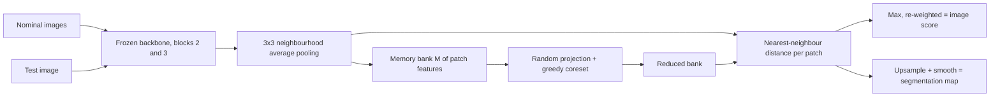

## Abstract

PatchCore scores every patch of a test image by one quantity: the distance from its feature to the closest feature ever seen on a defect-free part. Features come from the middle blocks of a frozen ImageNet network, average-pooled over a small neighbourhood for context. All of them go into one memory bank shared across positions, so nothing depends on image alignment. A greedy minimax (k-center) coreset shrinks the bank while preserving coverage of the feature space rather than its density. The largest patch distance is the image score; the patch distances form the segmentation map. On MVTec AD this gives 99.1% image-level AUROC with a quarter of the bank, 99.0% with 1% of it, and up to 99.6% with a higher-resolution ensemble.

**Keywords:** cold-start anomaly detection, memory bank, coreset subsampling, k-center, nearest neighbour, mid-level features, MVTec AD

## 1 Introduction

The setting is cold-start (one-class) anomaly detection: only defect-free images are available for fitting, and at test time the system must flag defective images and outline the defect, from a hairline scratch to a missing component.

Older methods learned the nominal distribution with autoencoders or GANs. A newer line learns nothing and compares frozen ImageNet features of test and nominal images; two of its members are the direct ancestors here. SPADE runs k-nearest-neighbour search over a feature pyramid, but its pixel-level stage is so expensive that it first pre-selects training images with a globally averaged last-layer feature, the coarsest and most ImageNet-specific representation available. [PaDiM](/blog/padim/) fits one Gaussian per patch position; it is fast, but <mark>each test patch is compared only with the statistics of its own grid position</mark>, which ties the method to aligned images of one fixed size.

The authors name two shared failures: deep features are tuned to natural-image classification, and there are few of them per image, so the nominal context is thin. PatchCore's goals follow: maximal nominal information at test time, less ImageNet bias, fast inference.

## 2 Background

**Decision rule.** An image is anomalous as soon as one patch is, so image-level detection can be built from patch scores alone.

**Feature hierarchy.** For a [ResNet](/blog/resnet/)-like backbone, level $j \in \{1,2,3,4\}$ is the output of the $j$-th resolution block; each level halves the grid and widens the receptive field. [PaDiM](/blog/padim/) concatenates the first three, PatchCore two adjacent middle ones.

**Coresets.** A coreset is a small subset on which a computation gives nearly the same answer as on the full set. For nearest-neighbour distance the fitting notion is minimax facility location (k-center). The greedy solver comes from Sener and Savarese's active-learning work, the random-projection speed-up from work on mini-batch selection for GANs.

## 3 Method

> **Key idea.** Keep every distinct kind of normal patch, and nothing else. A position-free memory bank of mid-level patch features gives the widest possible nominal context; a coverage-preserving coreset removes the redundancy that makes such a bank slow, with a bounded effect on every nearest-neighbour distance.



Compare [Fig. 2 in the paper](https://arxiv.org/pdf/2106.08265#page=4).

### 3.1 Locally aware patch features

Start from the feature map $\phi_{i,j} = \phi_j(x_i) \in \mathbb{R}^{c^* \times h^* \times w^*}$ of image $x_i$ at level $j$, and write $\phi_{i,j}(h,w) \in \mathbb{R}^{c^*}$ for the channel vector at one grid cell. Each cell already describes an image patch; going deeper would give it more context, but with a coarser grid and more ImageNet-specific features. PatchCore widens the patch sideways instead. For an odd neighbourhood size $p$, define

$$
\mathcal{N}_p^{(h,w)} = \big\{(a,b) \;\big|\; a \in [h - \lfloor p/2 \rfloor,\, h + \lfloor p/2 \rfloor],\;
b \in [w - \lfloor p/2 \rfloor,\, w + \lfloor p/2 \rfloor]\big\}
\tag{1}
$$

the $p \times p$ block of cells centred on $(h,w)$. The locally aware feature aggregates that block:

$$
\phi_{i,j}\big(\mathcal{N}_p^{(h,w)}\big) = f_{\text{agg}}\Big(\big\{\phi_{i,j}(a,b) \;\big|\; (a,b) \in \mathcal{N}_p^{(h,w)}\big\}\Big)
\tag{2}
$$

Here $f_{\text{agg}}$ is adaptive average pooling, which averages the block and maps it to a preset dimensionality $d$. It acts like a local blur per channel: the receptive field grows and small shifts are absorbed, while the grid size is unchanged because pooling is applied at every cell. The per-image collection of such features, with an optional stride $s$, is

$$
\mathcal{P}_{s,p}(\phi_{i,j}) = \big\{\phi_{i,j}\big(\mathcal{N}_p^{(h,w)}\big) \;\big|\; h, w \bmod s = 0,\; h < h^*,\; w < w^*\big\}
\tag{3}
$$

where $s = 1$ everywhere except in one ablation, so every grid cell contributes a feature. Two adjacent levels $j$ and $j+1$ are used: the level-$(j+1)$ collection is bilinearly rescaled to the level-$j$ grid and merged cell by cell with the level-$j$ feature. The bank is the union over the nominal set $\mathcal{X}_N$:

$$
\mathcal{M} = \bigcup_{x_i \in \mathcal{X}_N} \mathcal{P}_{s,p}\big(\phi_j(x_i)\big)
\tag{4}
$$

The union discards image index and grid position, which is what separates PatchCore from PaDiM: <mark>any test patch may be matched against any nominal patch from any location</mark>, so alignment and a fixed input shape are no longer required. Nothing so far is an approximation.

### 3.2 Coreset reduction

$\mathcal{M}$ grows linearly with the number and resolution of training images, and so do storage and search time. A reduction has to preserve what will be queried, the distance from an arbitrary point to its nearest bank entry, so the paper picks the subset that leaves the smallest worst-case gap:

$$
\mathcal{M}_C^{*} = \arg\min_{\mathcal{M}_C \subset \mathcal{M}} \;\max_{m \in \mathcal{M}} \;\min_{n \in \mathcal{M}_C} \lVert m - n \rVert_2
\tag{5}
$$

The inner $\min$ is the distance from an original feature to its closest survivor, the $\max$ picks the worst-served original, and the outer $\arg\min$ over subsets of size $l$ makes that worst case small. Solving (5) exactly is NP-hard. The first approximation is the greedy farthest-point rule:

$$
m_i = \arg\max_{m \in \mathcal{M} \setminus \mathcal{M}_C} \;\min_{n \in \mathcal{M}_C} \lVert \psi(m) - \psi(n) \rVert_2,
\qquad \mathcal{M}_C \leftarrow \mathcal{M}_C \cup \{m_i\}
\tag{6}
$$

Each step adds the feature that is currently worst covered. The second approximation is $\psi : \mathbb{R}^d \to \mathbb{R}^{d^*}$ with $d^* < d$, a random linear projection used only during selection; by the Johnson–Lindenstrauss lemma it roughly preserves pairwise distances. The classical factor-two guarantee for farthest-point selection is general knowledge; the paper does not state it.

Why (5)? The paper argues with [Fig. 3](https://arxiv.org/pdf/2106.08265#page=4), a 2-D toy in which random subsampling loses clusters that the coreset keeps. A short argument of my own makes it precise. Let $r = \max_{m \in \mathcal{M}} \min_{n \in \mathcal{M}_C} \lVert m - n\rVert_2$ be the radius achieved in (5), and $D(q, \mathcal{S}) = \min_{n \in \mathcal{S}} \lVert q - n \rVert_2$. For any query $q$, let $m^*$ be its nearest neighbour in the full bank and $n$ the survivor closest to $m^*$. Since $\mathcal{M}_C \subset \mathcal{M}$ the reduced distance cannot be smaller, and by the triangle inequality $\lVert q - n \rVert \le \lVert q - m^* \rVert + \lVert m^* - n \rVert$ it cannot be much larger:

$$
D(q, \mathcal{M}) \;\le\; D(q, \mathcal{M}_C) \;\le\; D(q, \mathcal{M}) + r
\tag{7}
$$

The left inequality says reduction never hides an anomaly; the right one says <mark>every patch score, nominal or anomalous, is inflated by at most the coverage radius $r$</mark>. Random subsampling preserves density instead, and its $r$ is set by whichever rare mode it dropped. Equation (7) is exact for any subset; the approximations are that greedy selection does not reach the optimal $r$ and measures distances after $\psi$.

### 3.3 Scoring

With patch collection $\mathcal{P}(x^{\text{test}}) = \mathcal{P}_{s,p}(\phi_j(x^{\text{test}}))$, find the test patch whose nearest bank entry is farthest away:

$$
m^{\text{test},*},\, m^{*} = \arg\max_{m^{\text{test}} \in \mathcal{P}(x^{\text{test}})} \;\arg\min_{m \in \mathcal{M}} \lVert m^{\text{test}} - m \rVert_2,
\qquad s^{*} = \lVert m^{\text{test},*} - m^{*} \rVert_2
\tag{8}
$$

The inner $\arg\min$ is a nearest-neighbour lookup per patch, the outer $\arg\max$ selects the most suspicious patch, and $s^*$ is its distance. The final score rescales $s^*$ using the $b$ bank entries nearest to $m^*$, written $\mathcal{N}_b(m^*)$:

$$
s = \left(1 - \frac{\exp \lVert m^{\text{test},*} - m^{*} \rVert_2}{\sum_{m \in \mathcal{N}_b(m^{*})} \exp \lVert m^{\text{test},*} - m \rVert_2}\right) \cdot s^{*}
\tag{9}
$$

The fraction is a softmax weight of the matched distance among the distances from the test patch to the neighbours of its match. If $m^*$ sits in a sparse part of the bank, those neighbours are far away, the denominator is large and the score stays high; in a crowded part the factor drops. The intent is to favour matches that are themselves rare nominal patterns. A bound the paper does not spell out follows: $m^*$ is the nearest bank entry to the test patch, so each of the $b$ terms in the denominator is at least as large as the numerator, giving

$$
1 - \tfrac{1}{b} \;\le\; \frac{s}{s^*} \;<\; 1
\tag{10}
$$

So the re-weighting can reorder two images only when their raw scores differ by less than a factor $1 - 1/b$: a tie-breaker, not a second detector. The authors call it more robust than the plain maximum but show no number.

The segmentation map is free: the per-patch distances from (8) are put back on the grid, bilinearly upsampled and smoothed with a Gaussian of width $\sigma = 4$, which the authors did not tune.

### 3.4 Intuition: a 1-D bank with one rare mode

Take scalar features: 1000 background patches in $[-0.1, 0.1]$, 10 patches of a legitimate but rare structure (a printed label, say) in $[4.9, 5.1]$, and a budget of 10 entries, about 1%.

*Random subsampling.* The chance that all ten draws miss the rare cluster is about $(1 - 10/1010)^{10} \approx 0.905$. Nine times in ten the reduced bank has no entry near 5, so $r \approx 5$ and every good part carrying the label scores about 4.9: a systematic false positive.

*Greedy selection.* The first pick is arbitrary, most likely background. The second is by (6) the farthest remaining point, necessarily in the label cluster. After two picks $r \le 0.2$. By (7) no nominal score moves by more than 0.2, while a true defect at, say, 2.5 still scores at least 2.3.

*A per-position Gaussian*, the PaDiM limit, handles the label only if it always falls on the same grid cell. The example also exposes the cost of coverage: one mislabelled defective patch at 2.5 in the training set would be picked third.

### 3.5 Algorithm

```text
# Fit (no gradient steps anywhere)
M <- empty list
for x in nominal_images:
    F2, F3 <- backbone(x) at blocks 2, 3               # frozen ImageNet weights
    F2, F3 <- avgpool_pxp(F2), avgpool_pxp(F3)         # p = 3, stride 1, grid size kept
    F3     <- bilinear_resize(F3, grid_of(F2))
    M.extend(merge(F2, F3) reshaped to (cells, d))     # position and image index dropped

Z <- M @ R                                             # R: random d x d* matrix, selection only
C <- {random index}
dist <- ||Z - Z[C]||                                   # running min-distance to the coreset
repeat until |C| = l:
    k <- argmax(dist);  C.add(k)
    dist <- minimum(dist, ||Z - Z[k]||)                # O(N d*) per step, O(N l d*) overall
bank <- M[C]                                           # unprojected features are stored

# Inference
P  <- patch_features(x_test)                           # same pipeline as above
dn <- for each q in P: distance to nearest entry of bank        # faiss
q*, m* <- patch with largest dn, and its match
w  <- 1 - exp(||q* - m*||) / sum_{m in kNN_b(m*, bank)} exp(||q* - m||)
image_score <- w * max(dn)
seg_map     <- gaussian_blur(bilinear_upsample(dn on grid), sigma = 4)
```

## 4 Implementation notes

| Item | Reported value |
|---|---|
| Backbone | WideResNet50, ImageNet-pretrained, frozen (torchvision / PyTorch Image Models) |
| Feature levels | final outputs of blocks 2 and 3; blocks 3 and 4 for mSTC |
| Input | resize 256, centre crop 224 (MVTec AD); resize 256 (mSTC); no augmentation |
| Neighbourhood $p$, stride $s$ | 3, 1 |
| $f_{\text{agg}}$ | adaptive average pooling |
| Feature dimension $d$ | not stated |
| Projection dimension $d^*$ | not stated |
| Neighbours $b$ in re-weighting | not stated |
| Coreset sizes | 25%, 10%, 1% of $\mathcal{M}$ |
| Nearest-neighbour search | faiss (index type not stated); IVFPQ tested as an alternative |
| Map smoothing | Gaussian, $\sigma = 4$, untuned |
| Software / hardware | Python 3.7, PyTorch; GPU printed as "Nvidia Tesla V4" |
| Coreset construction time, bank memory | not stated |
| Number of repeated runs | not stated (low-shot table gives ± values without a run count) |

Easy to get wrong:

- **Pool first, then merge.** The $p \times p$ averaging runs per level at stride 1; only then is the deeper level resized to the shallower grid.
- **Project for selection only.** The bank searched at test time holds the original features.
- **Bank size.** About 240 training images per class (3629 over 15 classes) times a 28 × 28 block-2 grid (standard ResNet layout) is roughly 190k vectors, under 2k at 1%. My arithmetic, not a reported figure.
- **The centre crop is part of the evaluated method.** One missed defect is attributed to it, and the [EfficientAD](/blog/efficientad/) note records that its authors switch it off when re-running PatchCore.

## 5 Experiments

**Setup.** MVTec AD: 15 sub-datasets, 5354 images, 1725 in the test sets. Magnetic Tile Defects (MTD): 925 defect-free and 392 defective images of varying size, 20% of the defect-free ones held out. mSTC: every fifth frame of ShanghaiTech Campus. Metrics are class-averaged image AUROC, pixel AUROC and PRO, which scores overlap per connected defect region.

**Main results, MVTec AD class averages (%).**

| Method | Image AUROC | Pixel AUROC | PRO |
|---|---|---|---|
| SPADE | 85.5 | 96.0 | 91.7 |
| PatchSVDD | 92.1 | 95.7 | – |
| DifferNet | 94.9 | – | – |
| PaDiM | 95.3 | 97.5 | 92.1 |
| Mahalanobis AD | 95.8 | – | – |
| PaDiM (task-selected backbone) | 97.9 | – | – |
| **PatchCore-25%** | **99.1** | **98.1** | 93.4 |
| PatchCore-10% | 99.0 | **98.1** | **93.5** |
| PatchCore-1% | 99.0 | 98.0 | 93.1 |

Misclassified test images at the F1-optimal threshold: 42, 47 and 49 for the 25%, 10% and 1% banks; the 42 are 19 false positives and 23 false negatives.

**Spending the saved compute (PatchCore-1%).**

| Configuration | Image AUROC | Pixel AUROC | PRO |
|---|---|---|---|
| WRN-101, levels 2+3, 280 px | 99.4 | 98.2 | 94.4 |
| WRN-101, levels 1+2+3, 280 px | 99.2 | **98.4** | **95.0** |
| DenseNet-201 + ResNeXt-101 + WRN-101, levels 2+3, 320 px | **99.6** | 98.2 | 94.9 |

**Inference time per image (GPU, backbone included; baselines re-implemented with WideResNet50).**

| Method | Scores (img, px, PRO) | Time (s) |
|---|---|---|
| PatchCore-100% | (99.1, 98.0, 93.3) | 0.6 |
| PatchCore-10% | (99.0, 98.1, 93.5) | 0.22 |
| **PatchCore-1%** | (99.0, 98.0, 93.1) | **0.17** |
| PatchCore-100% + IVFPQ | (98.0, 97.9, 93.0) | 0.2 |
| SPADE | (85.3, 96.6, 91.5) | 0.66 |
| PaDiM | (95.4, 97.3, 91.8) | 0.19 |

**Ablation: backbone (supplementary Table S6).**

| Backbone | % of $\mathcal{M}$ | Image AUROC | Pixel AUROC | PRO |
|---|---|---|---|---|
| ResNet50 | 10 / 1 | 99.0 / 98.7 | 98.1 / 97.8 | 93.3 / 93.3 |
| WideResNet50 | 10 / 1 | 98.9 / 99.0 | 98.1 / 98.0 | 93.5 / 93.1 |
| ResNet101 | 10 / 1 | 98.6 / 98.7 | 97.9 / 97.8 | 92.5 / 92.2 |
| WideResNet101 | 10 / 1 | 99.1 / 99.0 | 98.2 / 98.1 | 93.4 / 93.0 |
| ResNeXt101 | 10 / 1 | 98.9 / 98.7 | 98.0 / 97.8 | 92.8 / 92.6 |

**Ablation: low-shot (supplementary Table S5, mean ± spread).**

| Shots (share of training data) | 1 (0.4%) | 5 (2.1%) | 16 (6.6%) | 50 (21%) |
|---|---|---|---|---|
| Image AUROC, SPADE | 71.6 ± 0.7 | 75.2 ± 1.5 | 78.9 ± 0.9 | 81.1 ± 0.4 |
| Image AUROC, PaDiM | 76.1 ± 0.4 | 81.0 ± 0.2 | 85.5 ± 0.6 | 90.1 ± 0.3 |
| Image AUROC, **PatchCore-25** | **84.1 ± 0.7** | **91.0 ± 0.9** | **95.5 ± 0.6** | **97.7 ± 0.4** |
| Pixel AUROC, SPADE | 91.9 ± 0.3 | 94.5 ± 0.1 | 95.7 ± 0.2 | 96.2 ± 0.0 |
| Pixel AUROC, PaDiM | 88.2 ± 0.3 | 92.5 ± 0.1 | 94.8 ± 0.1 | 96.3 ± 0.0 |
| Pixel AUROC, **PatchCore-25** | **92.4 ± 0.3** | **94.8 ± 0.1** | **96.8 ± 0.3** | **97.7 ± 0.0** |
| PRO, SPADE | 83.5 ± 0.4 | 88.3 ± 0.2 | 90.1 ± 0.2 | 90.8 ± 0.1 |
| PRO, PaDiM | 72.4 ± 1.2 | 82.7 ± 0.2 | 87.5 ± 0.2 | 90.4 ± 0.1 |
| PRO, **PatchCore-25** | **83.7 ± 0.5** | **88.8 ± 0.2** | **91.7 ± 0.1** | **92.8 ± 0.0** |

**Other benchmarks (PatchCore-10).** mSTC pixel AUROC: 91.8 against 91.2 for PaDiM, 89.9 for SPADE, 85 for CAVGA-Ru. MTD image AUROC: 97.9 against 97.7 for DifferNet, 80.0 for 1-NN, 76.6 for GANomaly. Both margins are small, and mSTC needed a change of feature levels, so the transfer claim is only weakly supported.

The neighbourhood, hierarchy, subsampler and resolution ablations exist only as plots ([Fig. 4](https://arxiv.org/pdf/2106.08265#page=6), [Fig. 5](https://arxiv.org/pdf/2106.08265#page=7), and Figs. S4–S6 on [pages 17–18](https://arxiv.org/pdf/2106.08265#page=17)). Values quoted from them below are read off the axes and approximate.

### Claim-by-claim reading

1. **Image-level error more than halved.** Table 1: 2.1% error for the best PaDiM variant against 0.9%, a 57% relative cut. The 97.9 baseline is a number the authors could not reproduce; against the reproducible 95.3 the claim only gets stronger. The lowest classes are pill (96.6), capsule and screw (98.1).
2. **State-of-the-art localization.** True on average by a small margin (+0.6 pixel AUROC, +1.4 PRO over PaDiM), not per class. In Table S3, PatchCore-25 is below SPADE on hazelnut (93.8 vs 95.4), toothbrush (91.5 vs 93.5) and transistor (83.7 vs 87.4), and below PaDiM on wood (89.4 vs 91.1).
3. <mark>A bank two orders of magnitude smaller performs like the full one.</mark> Strongly supported: (99.1, 98.0, 93.3) at 100% against (99.0, 98.0, 93.1) at 1%; in Fig. S6 the coreset curve bends only below 1% (about 95.5 at a tenth of a percent).
4. **Coreset beats other reducers.** At 1%, random subsampling is near 93 image AUROC and learned proxy vectors near 91, against 99; striding gives 97.6 ($s=2$) and 96.8 ($s=3$). Fewer than 30% of full-bank entries are ever retrieved at test time, nearly 95% after reduction to 1%.
5. **Local context peaks at $p=3$.** Fig. S5: about 95.4 at $p=1$, 99.1 at $p=3$, about 94.3 at $p=7$; segmentation metrics have the same shape.
6. **Mid-level features are the right ones.** Supported, with a twist. Level 2 alone reaches about 99, level 1 about 93, level 3 about 97.6. <mark>Adding level 3 to level 2 leaves image AUROC essentially unchanged and mainly helps pixel AUROC</mark> (about 97.5 to 98.1); adding level 1 lowers detection but gives the best PRO. The "ImageNet bias" explanation stays untested: no level-4 result on MVTec AD, and Table S6 (98.6–99.1) covers only supervised ResNet-family backbones.
7. **Faster than PaDiM at higher accuracy.** True at test time (0.17 s vs 0.19 s); fitting cost is absent. Higher resolution, per Fig. S4, mostly helps PRO while detection saturates.
8. **Sample efficiency.** <mark>With 16 nominal images PatchCore reaches 95.5 image AUROC, above full-data PaDiM at 95.3</mark> and far above DifferNet's 16-shot 87.3. At 50 shots it has 97.7, only approximately the 97.9 baseline. The remark that full-data SPADE is matched with "5/1" shots is loose: by my reading detection is matched at 2 shots (87.2 vs 85.5), pixel AUROC at 10, PRO at 16.
Small inconsistencies: "a third" of the classes solved perfectly in the main text but six of fifteen in Table S1; WideResNet50 at 10% is 99.0 in Table 1 and 98.9 in Table S6; Table 4 prints the same PRO error (5.6) for 94.9 and 94.4.

## 6 Limitations

**Stated by the authors**

- Everything depends on how well the pretrained features transfer; adaptation is left to future work.
- False positives come mainly from label ambiguity and from classes with very high nominal variance.
- Many false negatives are localized correctly but too weakly to cross the threshold; others need higher resolution; one defect was cropped away.
- Approximate search (IVFPQ) costs about a point of image AUROC.

**My reading**

- <mark>Minimax selection is maximally exposed to contaminated training data.</mark> A few unlabelled defective parts would enter the coreset first and silence the defects they resemble. Only clean training sets are tested.
- Fitting cost is unreported; the greedy loop is $O(N l d^*)$, and "no training" is not "no fitting time".
- $d$, $d^*$ and $b$ appear neither in the paper nor in the supplementary.
- The F1-optimal threshold behind the "42 errors" is chosen on the test set; full-recall errors appear only as plots.
- The benchmark is saturated: variants differ by a handful of images, with no confidence intervals.
- A patch-wise score cannot see logical anomalies where every patch is normal but the arrangement is wrong; the weak transistor localization is consistent with that.

## 7 Extensions

**What was built on this**

- [EfficientAD](/blog/efficientad/) uses PatchCore as its accuracy reference and distils the same kind of WideResNet-101 features into a small network.
- [WinCLIP](/blog/winclip/) and [AnomalyGPT](/blog/anomalygpt/) use it as the full-data and few-shot baseline while moving to vision-language models.
- [DRAEM](/blog/draem/) is a contemporaneous alternative trained on synthetic defects, not a descendant.
- Noise-robust banks (SoftPatch), learned adaptors on frozen features (SimpleNet, CFA), the anomalib implementation, and benchmarks aimed at patch matching's blind spots (MVTec LOCO, VisA) — from general knowledge, unverified.

**Open problems**

- Choosing the bank size from the data; (7) suggests the coverage radius as the control variable.
- Robustness to contaminated nominal data without giving up rare legitimate modes, and backbones beyond supervised ImageNet ResNets (e.g. [DINOv2](/blog/dinov2/)).
- A calibrated operating point at full recall, which is what the title asks for.

**Research directions**

*These are ideas, not results — none has been run.*

1. **Contamination stress test.** Hypothesis: with defective images hidden in the training set, coreset PatchCore degrades faster than random subsampling because anomalous patches are selected first; a density filter before selection recovers most of the loss. Data: MVTec AD with 0–10% of each class's test anomalies moved into training. Baseline: published PatchCore-1%/10%, random subsampling at equal size. Metric: image AUROC and PRO versus contamination rate; share of coreset entries from defective regions. Likely failure mode: the filter cannot tell a contaminant from a rare legitimate mode and brings back the false positives of Section 3.4.
2. **A coverage bank as a recall metric for financial scenario generators.** Hypothesis: a k-center coreset of embedded historical return windows keeps crisis windows instead of letting calm periods crowd them out, so the share of coreset entries with a generated window within radius $r$ exposes missing regimes in generators such as [Quant GANs](/blog/quant-gans/), [Tail-GAN](/blog/tail-gan/) or [SigCWGAN](/blog/conditional-sig-wgan/). Data: daily multi-asset returns spanning a crisis, embedded by truncated signatures or summary statistics. Baseline: the marginal, dependence and tail-risk scores those papers use. Metric: whether the score drops when a known regime is withheld from training; rank agreement with out-of-sample VaR/ES backtest errors. Likely failure mode: no pretrained encoder plays ImageNet's role for returns, so Euclidean distance in the embedding may mean little, and non-stationary history is itself "contaminated".

## 8 Takeaways

- One shared, position-free bank is what beats per-position Gaussians on detection and removes PaDiM's alignment and fixed-size constraints.
- Add context by local pooling rather than depth; block 2 alone gives about 99 image AUROC, and block 3 mostly improves localization.
- Subsample for coverage, not density: the k-center radius bounds how far any nearest-neighbour score can move, which is why a 1% bank matches the full one.
- The same property makes the method fragile to dirty training data, since outliers are selected first.
- For financial time series the honest carry-over is the coverage idea, a library of market states pruned so that rare regimes survive; the contamination caveat is stronger there because nobody labels market history as nominal.

## References

1. K. Roth, L. Pemula, J. Zepeda, B. Schölkopf, T. Brox, P. Gehler. *Towards Total Recall in Industrial Anomaly Detection.* CVPR 2022. arXiv:2106.08265.
2. T. Defard, A. Setkov, A. Loesch, R. Audigier. *PaDiM: a Patch Distribution Modeling Framework for Anomaly Detection and Localization.* arXiv:2011.08785, 2020.
3. N. Cohen, Y. Hoshen. *Sub-Image Anomaly Detection with Deep Pyramid Correspondences (SPADE).* arXiv:2005.02357, 2020.
4. P. Bergmann, M. Fauser, D. Sattlegger, C. Steger. *MVTec AD — A Comprehensive Real-World Dataset for Unsupervised Anomaly Detection.* CVPR 2019.
5. O. Sener, S. Savarese. *Active Learning for Convolutional Neural Networks: A Core-Set Approach.* ICLR 2018.
