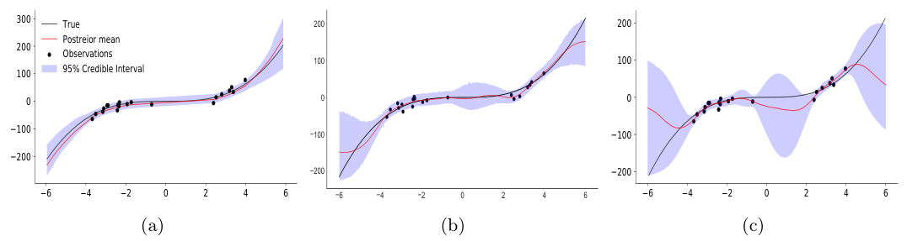
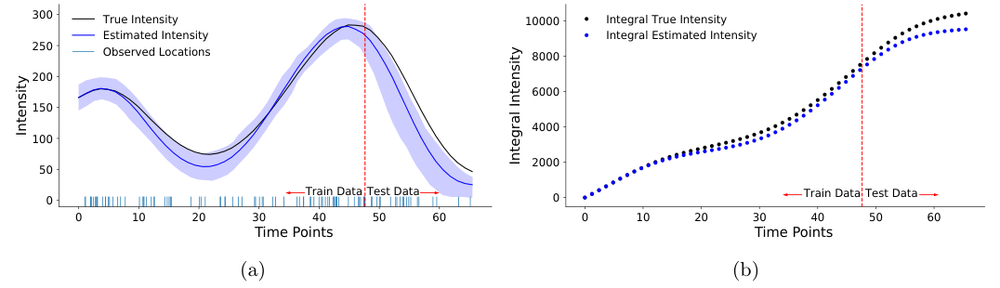
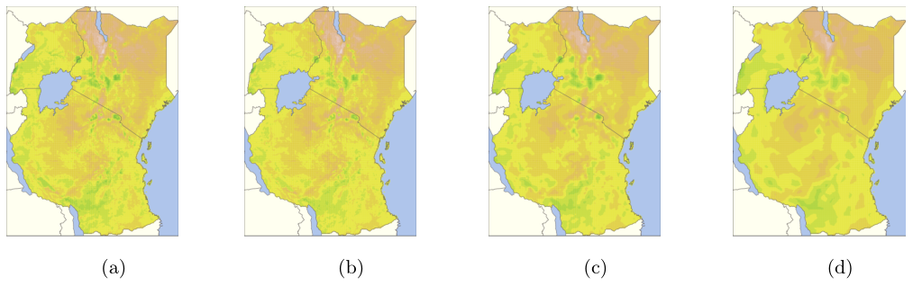

## Abstract

Gaussian processes and Cox processes are good priors over functions and expensive to compute with, and MCMC over them mixes badly. πVAE moves the cost offline: a VAE is trained on many functions sampled from the desired prior, and the frozen decoder applied to a standard-normal latent becomes a new prior that Stan can sample with HMC. What it adds over PriorVAE is a learned feature map $\Phi(s)$ shared by all functions, so each function is a decoded weight vector dotted with $\Phi(s)$ and can be evaluated at locations never seen in training. Experiments cover a cubic toy, a 1-D Cox process with its integral, spatial interpolation, Kin40K and MNIST in-painting.

**Keywords:** learned priors, stochastic process, variational autoencoder, Hamiltonian Monte Carlo, Stan, Karhunen–Loève expansion, Gaussian process emulation

## 1 Introduction

A stochastic process lets a modeller state what kinds of function are plausible, and makes them pay for it in computation. Exact GP inference needs a solve with an $n\times n$ covariance matrix; a Cox-process likelihood contains $\int\lambda(t)\,dt$, rarely available in closed form; and in an MCMC sampler the latent function values are so correlated that chains must run a long time to reach a usable effective sample size.

The usual escapes approximate either the posterior (variational inference, Laplace, expectation propagation, ensembles, stochastic-gradient MCMC) or the prior (inducing points, low-rank GMRFs). The authors' complaint is with the first group, which they argue rarely yields accurate posterior expectations. A Bayesian neural network is the extreme case: millions of correlated weights conditioned on hyperparameters, a geometry in which the authors call efficient MCMC nearly impossible.

The immediate predecessor is PriorVAE (Semenova et al., 2022), from overlapping authors: train a VAE on draws of a random vector from a prior, then replace the prior by "decode a standard normal". The latent is low-dimensional and uncorrelated a priori, which HMC handles easily; the paper recalls that PriorVAE's sampler reached effective sample sizes above the number of draws. <mark>The limitation πVAE fixes is that a VAE over vectors knows only the grid it was trained on: it cannot predict at a new location, so it is a prior over finitely many function values, not a stochastic process.</mark> Neural processes reach arbitrary location sets another way, by averaging over a context set, which the paper notes (citing attentive NPs) can underfit.

## 2 Background

**VAE as a prior.** An encoder $e(x,\gamma)$ outputs $[z_\mu, z_{sd}]$, the latent is $Z\sim\mathcal N(z_\mu, z_{sd}^2 I)$, and a decoder returns $\hat x = d(Z,\psi)$. The paper treats the ELBO in practice as reconstruction MSE plus $\mathrm{KL}(Z\,\|\,\mathcal N(0,I))$. After training, $d(Z)$ with $Z\sim\mathcal N(0,I)$ is a random variable, which is all a prior needs to be. The nearest VAE-style function model in this collection is the [Latent ODE](/blog/latent-ode/), which also decodes a small latent into a trajectory but amortises inference with an encoder; πVAE discards the encoder and runs MCMC.

**Two-stage inference.** Given a likelihood $p(y\mid\theta)$ and an expensive prior $p(\theta)$, PriorVAE sets $\theta := d(Z)$ and samples

$$
p(Z\mid y, d) \;\propto\; p\big(y\mid d(Z)\big)\,\mathcal N(Z;0,I).
\tag{1}
$$

The only random quantity is $Z$, typically under 50 coordinates and uncorrelated a priori; the structure lives in a deterministic, differentiable decoder. <mark>Once the prior has been swapped for the decoder's pushforward, MCMC on (1) is exact for the substituted model; every approximation sits in how well that pushforward matches the original prior.</mark>

## 3 Method

> **Key idea.** Write a random function as a random weight vector times a deterministic feature map, $f(s)=\beta^\top\Phi(s)$, as the Karhunen–Loève expansion does. Learn $\Phi$ with a network shared across all training functions, compress the per-function weights with a VAE, and at inference time sample only the VAE latent.

### 3.1 From a basis expansion to a learnable process

The starting point is the Karhunen–Loève expansion of a centred process,

$$
f(s) \;=\; \sum_{j=1}^{\infty} \beta_j\,\varphi_j(s),
\tag{2}
$$

with deterministic orthonormal functions $\varphi_j$ and pairwise uncorrelated random coefficients $\beta_j$: randomness in the coefficients, spatial structure in the basis. πVAE keeps that split but drops orthonormality and infinite length. $\Phi(s)\in\mathbb R^p$ is a network over locations with global weights $w$, and

$$
f(s) \;=\; \beta^\top\Phi(s), \qquad \beta = d(Z,\psi), \qquad Z\sim\mathcal N(0, I_m).
\tag{3}
$$

$\Phi$ supplies correlation over the input space, $\beta$ the randomness, and $d$ lets $\beta$ range over a curved $m$-dimensional set instead of being Gaussian. Two approximations enter here: truncation to $p$ features, and a learned rather than true coefficient law. In the experiments $\Phi$ is an RBF or Matérn layer, $\Phi(s)=\sum_{i=1}^{C}\alpha_i\,\rho(\|s-c_i\|)$ with trainable centres $c_i$ and weights $\alpha_i$, followed by a small MLP.

### 3.2 Training on prior draws

Draw $N$ functions from the target prior and observe each at $K$ locations $s_i^k$ (locations differ across functions). Each function gets its own free coefficient vector $\beta_i$, which is both fitted and fed to the encoder: $\beta_i\mapsto[z_\mu,z_{sd}]\mapsto Z\mapsto\hat\beta_i = d(Z,\psi)$. The loss is specified directly, not derived as a bound:

$$
\begin{aligned}
\mathcal L(w,\gamma,\psi,\beta_{1:N}) \;=\;& \frac{1}{NK}\sum_{i,k}\big(y_i^k-\beta_i^\top\Phi(s_i^k)\big)^2 \\
&+\frac{1}{NK}\sum_{i,k}\big(y_i^k-\hat\beta_i^\top\Phi(s_i^k)\big)^2 \\
&+\mathrm{KL}\big(\mathcal N(z_\mu,z_{sd}^2 I)\,\|\,\mathcal N(0,I)\big).
\end{aligned}
\tag{4}
$$

The first term fits each function with its own coefficients and so trains $\Phi$ as a shared basis. The second requires the *decoded* coefficients to fit equally well, training encoder and decoder to compress $\beta_i$ without losing what predicts $y$. The KL term pulls codes toward $\mathcal N(0,I)$, so that the standard normal is a sensible prior later and the latent coordinates are roughly uncorrelated. A direct penalty $\|\beta_i-\hat\beta_i\|^2$ is omitted because it did not help, which is plausible since only $\beta$'s projection through $\Phi$ is identified. All terms carry weight one.

### 3.3 Inference and prediction

After training, the encoder and the $\beta_i$ table are discarded and $\Phi$, $d$ are frozen. For new data $\{(s_j,y_j)\}_{j=1}^J$,

$$
p(Z\mid y_{1:J}, s_{1:J}) \;\propto\; \prod_{j=1}^{J} p\big(y_j \mid d(Z)^\top\Phi(s_j),\,\sigma\big)\;\mathcal N(Z;0,I),
\tag{5}
$$

with any observation model (in the regressions an observation-noise parameter $\sigma$ is inferred alongside $Z$; the noise family is not spelled out). Prediction at a new $s_*$ reuses the draws:

$$
p(y_*\mid s_*, y_{1:J}) \;=\; \int p\big(y_*\mid d(Z)^\top\Phi(s_*),\sigma\big)\,p(Z\mid y_{1:J},s_{1:J})\,dZ .
\tag{6}
$$

In (5) the likelihood is the only non-trivial factor: one decoder pass plus $J$ feature evaluations, with HMC gradients from autodiff. <mark>No covariance matrix is ever inverted; the paper says decoder cost grows linearly in the width of its largest hidden layer.</mark> Minimising squared error over $Z$ is offered as a point-estimate alternative.

### 3.4 Why it is a stochastic process

$Z$ lives on a probability space, $d$ and $\Phi$ are deterministic measurable maps, so $f(s)=d(Z)^\top\Phi(s)$ is a random variable on that space for every $s$, and the finite-dimensional marginals are automatically consistent. <mark>The proof is correct and nearly trivial; the substantive point is that $\Phi$ is defined on the whole input space, so prediction off the training grid is possible.</mark> The authors state that πVAE trained on GP draws is a GP only with a linear $d$ and a matching $\Phi$; otherwise it is a different process imitating one, with no theory for when that helps.


*Source: Mishra, Flaxman, Berah, Zhu, Pakkanen, Bhatt, arXiv:2002.06873, Fig. 2, CC BY 4.0.*

### 3.5 Intuition: the linear decoder

Take $d(Z)=AZ$ with $A\in\mathbb R^{p\times m}$ and $\Phi$ fixed. Then $f(s)=Z^\top A^\top\Phi(s)$ is a Gaussian process with kernel

$$
k(s,s') \;=\; \Phi(s)^\top A A^\top \Phi(s'),
\tag{7}
$$

of rank at most $m$: Bayesian linear regression on features $A^\top\Phi(s)$. With noise $\sigma^2$ and design matrix $H$ whose rows are $A^\top\Phi(s_j)$, the posterior on $Z$ is Gaussian with covariance $(I+H^\top H/\sigma^2)^{-1}$. Three consequences, my derivation rather than the paper's:

- Cost is set by $m$, not $J$: an $m\times m$ solve after forming $H^\top H$ in $O(Jm^2)$, against $O(J^3)$ for an exact GP.
- Far from the data the predictive variance returns to the prior's $\|A^\top\Phi(s_*)\|^2$, the "concentration where there is data" the paper observes in its cubic example.
- A linear decoder gives only a rank-$m$ Gaussian family. A non-linear $d$ moves the same $m$ coordinates along a curved set of coefficient vectors, which is how one πVAE can span GP draws over a lengthscale range ($10^{-5}$ to 2 in the spatial experiment). The prior is still confined to an $m$-dimensional set; an exact GP has no such ceiling.

The paper also obtains an exact GP with standard-normal $\beta$, a linear decoder and $\Phi(s)=L^\top s$, $L$ a Cholesky factor of a Gram matrix. That is only defined on the locations of the Gram matrix, so I read it as reproducing finite-dimensional marginals, not a process on the whole space.

### 3.6 Algorithm

```text
Stage 1 — encode the prior (once, offline)
  input: sampler for prior Π, N, K, latent dim m, feature net Φ_w, encoder e_γ, decoder d_ψ
  draw f_1..f_N ~ Π; for each i pick K locations s_i^1..s_i^K and record y_i^k = f_i(s_i^k)
  initialise one free coefficient vector β_i per function
  repeat for E epochs:
    for each minibatch of functions i:
      u_i^k      = Φ_w(s_i^k)                         # shared features
      L1         = mean_k (y_i^k - β_i·u_i^k)^2
      (μ, sd)    = e_γ(β_i);  Z = μ + sd ⊙ ε,  ε ~ N(0, I)
      β̂_i        = d_ψ(Z)
      L2         = mean_k (y_i^k - β̂_i·u_i^k)^2
      KLterm     = KL(N(μ, sd²) || N(0, I))
      gradient step on (w, γ, ψ, β_i) for L1 + L2 + KLterm
  keep Φ_w and d_ψ; discard e_γ and β_1..β_N

Stage 2 — inference on new data (per problem)
  input: data {(s_j, y_j)}, frozen Φ_w, d_ψ, observation model p(y | f, σ)
  model:  Z ~ N(0, I_m);  σ ~ prior;  f_j = d_ψ(Z)·Φ_w(s_j);  y_j ~ p(y | f_j, σ)
  run HMC/NUTS (e.g. Stan) on (Z, σ); check R-hat and ESS
  predict at s_*: for each posterior draw Z^(t): f_*^(t) = d_ψ(Z^(t))·Φ_w(s_*)

Sampling the prior: Z ~ N(0, I);  f(s) = d_ψ(Z)·Φ_w(s) for any s
```

## 4 Implementation notes

| item | as reported |
|---|---|
| framework | PyTorch for training, Stan for inference |
| hardware | workstation with two NVIDIA GeForce RTX 2080 Ti |
| default training grid | each input dimension on $[-1,1]$ when not stated otherwise |
| feature map $\Phi$ | RBF or Matérn layer with $C$ trainable centres, then a 2-layer MLP |
| latent dimension | 10 (VAE GP demo), 20 (land temperature), 40 (MNIST); "typically 5–50" |
| $K$ per function | "typically < 200"; 200 for Kin40K |
| cubic toy | $10^4$ prior draws; RBF layer + 2 layers of 20 units; 20,000 HMC samples for the comparison |
| LGCP toy | 10,000 intensity draws, RBF kernel $e^{-\sigma x^2}$ with $\sigma\in\{8,16,32,64\}$, rate constant 5, 80 events per draw |
| land temperature | $10^7$ draws of a 2-D GP, lengthscales $10^{-5}$ to 2; Matérn layer with 1,000 centres + 2 layers of 100 units |
| Kin40K | $10^7$ draws of an 8-D GP at 200 locations in $(-2,2)^8$, lengthscales $10^{-3}$ to 10 |
| MNIST | $10^6$ draws of a 2-D GP; encoder 256→128, decoder 128→256 |
| optimiser, learning rate, epochs, batch size | not stated |
| HMC chains, warm-up, iterations (beyond the cubic toy) | not stated |
| prior on observation noise | not stated |
| width $p$ of $\Phi$'s output | not stated |
| wall-clock for training or inference | not stated |

Easy to get wrong when reproducing:

- **The coefficient table.** Equation (4) has one free $\beta_i$ per training function; at $N=10^7$ that is $10^7$ stored vectors. Whether functions are redrawn between epochs is not stated; redrawing would orphan the $\beta_i$, so a fixed pool is the literal reading.
- **Training domain = prior domain.** $\Phi$ is fitted only on the training box (by default $[-1,1]$ per dimension). Inputs must be rescaled into it; outside, the RBF/Matérn features decay and the prior silently changes.
- **Frozen hyperparameters.** Lengthscales are not inferred in stage 2; the range covered in stage 1 is the hyperprior.
- **LGCP output.** The appendix trains on intensity and its numerical integral together and calls β a 2-D vector, one part per output; I read this as a two-output head, shapes not given.
- **Optimiser.** The ELBO sentence cites Kingma & Ba (Adam), suggesting Adam, but the paper never says so.

## 5 Experiments

**Setup.** Two toys (Section 2.4) and three real tasks (Section 3), all with HMC in Stan on the latent. There are no ablations: nothing varies $m$, $\Phi$, the loss terms or $N$.


*Source: Mishra, Flaxman, Berah, Zhu, Pakkanen, Bhatt, arXiv:2002.06873, Fig. 3, CC BY 4.0.*

Table 1 — cubic regression, 20 training inputs uniform on $(-4,4)$, $y\sim\mathcal N(x^3,9)$:

| method | test MAE |
|---|---|
| **πVAE, prior = cubic functions** | **10.47** |
| πVAE, prior = RBF Gaussian process | 33.15 |
| Gaussian process, RBF kernel | 67.37 |


*Source: Mishra, Flaxman, Berah, Zhu, Pakkanen, Bhatt, arXiv:2002.06873, Fig. 4, CC BY 4.0.*

Table 2 — land-surface-temperature deviation in East Africa, ~89,000 locations, 6,000 uniformly sampled for training; train MSEs from the text:

| method | test MSE | train MSE |
|---|---|---|
| full-rank GP (Matérn 3/2) | 2.47 | 0.002 |
| **πVAE (latent 20)** | **0.38** | 0.07 |
| low-rank GMRF / SPDE (1,046 basis functions) | 4.36 | not stated |


*Source: Mishra, Flaxman, Berah, Zhu, Pakkanen, Bhatt, arXiv:2002.06873, Fig. 5, CC BY 4.0.*

Table 3 — Kin40K (40,000 points, random 2/3 train, 1/3 test); baselines taken from Wang et al. (2019), not re-run:

| method | RMSE | NLL |
|---|---|---|
| **full-rank GP** | **0.099** | **−0.258** |
| πVAE | 0.112 | 0.006 |
| SGPR ($m=512$) | 0.273 | 0.087 |
| SVGP ($m=1024$) | 0.268 | 0.236 |

MNIST in-painting from 10, 20 and 30% of pixels is shown only as samples, with no number.

**Claim by claim.**

1. *Learns expressive classes such as GPs.* Only pictures (the paper's Fig. 1 for a plain VAE, and panel (b) of Figure 2 above); no quantitative match between πVAE prior draws and the GP. **Weak.**
2. *Domain knowledge can be encoded in the prior.* Table 1: the cubic prior cuts the RBF-prior error to about a third and beats the GP by a factor of about 6.4. Convincing in direction, but the cubic prior contains the answer's family, and this is 20 points with no repeats. **Moderate, as an illustration.**
3. *Learns properties such as integrals.* One test draw in Figure 3 above, no metric; the estimated integral drifts below the truth, most visibly past the train/test boundary. **Weak.**
4. *State-of-the-art spatial interpolation in accuracy and efficiency.* <mark>Table 2 is the paper's strongest number: test MSE 0.38 against 2.47 for a full-rank GP and 4.36 for a GMRF.</mark> But it is one split, no timing is reported anywhere, and the caption of the paper's Fig. 5 (Figure 4 above) claims a win over neural processes with no NP row behind it. **Strong for accuracy against these baselines; unsupported for efficiency and NPs.**
5. *Competitive with exact GPs on Kin40K.* Table 3 supports the ordering, but πVAE's NLL (0.006) is clearly worse than the exact GP's (−0.258), baselines are copied, and the split may not match. **Moderate.**
6. *Latent MCMC is efficient and calibrated.* <mark>Appendix A reports $\hat R\le 1.01$ throughout, with effective sample size per draw above 1 for the GP demo and above 0.5 for Kin40K,</mark> plus LOO-PIT calibration for Kin40K. The GP demo is the plain VAE of the paper's Fig. 1, so only the Kin40K run speaks for πVAE itself. Still the cleanest evidence for the main selling point. **Moderate**: one πVAE experiment, without wall-clock.
7. *Inference takes seconds or minutes.* Asserted, never measured. **Unsupported.**

On why πVAE beats the GP, the authors conjecture that $\Phi$'s extra layers capture non-stationarity, or that full Bayesian inference resists overfitting, and point to the GP's tighter training fit (0.002 against 0.07; the text says 37 times, the printed numbers give 35) alongside 6.5 times worse test error. <mark>That gap shows the GP baseline overfits; it does not show why πVAE does not, and neither conjecture is tested.</mark>

## 6 Limitations

**Stated by the authors**

- Large up-front training cost, "days or weeks" for complex priors, with the usual deep-learning tuning.
- No theory for when πVAE beats or trails existing processes; it only approximates a GP when trained on one.
- Inputs above 10 dimensions untested; other processes such as Dirichlet processes not considered.
- On MNIST, neural processes trained on digits look better than πVAE trained on generic 2-D GP draws.

**My reading**

- <mark>The prior lives on an $m$-dimensional set of functions.</mark> If the truth lies off it, the posterior can be confidently wrong, and MCMC diagnostics will not say so, because the sampler is correctly exploring the substituted model.
- Lengthscale ranges are fixed before any data are seen; changing them means retraining.
- Behaviour outside the training box is unstated, so "a process on all of $S$" is only evidenced inside it.
- Thin design for the headline: one split per dataset, no seeds or error bars, copied or under-specified baselines, no ablations.
- Cost is argued, not measured. With 6,000 or about 26,700 observations every HMC gradient touches all data; linear, but not obviously "seconds".

## 7 Extensions

**What was built on this**

- PriorVAE (Semenova et al., 2022) is the predecessor, cited in the paper, with overlapping authors.
- PriorCVAE (Semenova et al., arXiv:2304.04307, 2023) conditions the VAE on the process hyperparameters so that they can be inferred in stage 2.
- aggVAE (Semenova et al., arXiv:2305.19779, 2023) encodes aggregates over administrative units, for small-area estimation when boundaries change.
- The journal version appeared in *Statistics and Computing* 32, 96 (2022), doi:10.1007/s11222-022-10151-w.

**Open problems**

- A bound on the distance between the law of $d(Z)^\top\Phi(s)$ and the target process in terms of $m$, $p$, $N$, $K$.
- Inferring hyperparameters without retraining.
- Choosing $m$: too small truncates the prior; too large brings back correlated latents.
- Marginal likelihoods of a πVAE prior, needed for Bayes factors between priors, are not discussed.

**Research directions.** *These are ideas, not results — none has been run.*

1. **A latent-space prior inside exact Bayesian factor selection.** My [model-uncertainty project](/research/model-uncertainty-priors/) scores learned priors for SDF factor selection against an exactly computable mixture-of-g-priors posterior. There a normalizing flow, having a tractable density, reproduces the exact posterior, while a GAN, having only a sampler, must average the likelihood over prior draws, an estimator whose effective sample size the page shows decaying like $T^{-d/2}$. A πVAE-style prior sits between: no density over the loadings, but an exact $\mathcal N(0,I)$ density over a small latent that HMC samples cheaply. Hypothesis: marginal likelihoods estimated in latent coordinates from posterior draws (e.g. bridge sampling) recover the exact model probabilities about as well as the flow's density route, while prior sampling through the same decoder does not. Data: the page's simulated panels with known truth. Baseline: its exact posterior, flow density route and GAN sampling route. Metric: total variation from the exact model posterior and error in posterior entropy, as on the page. Likely failure mode: with fewer latent dimensions than loadings the prior is degenerate, so marginal likelihoods across factor subsets of different sizes stop being comparable, and one decoder per model size restores the training burden.
2. **πVAE as a Bayesian-optimisation surrogate.** Hypothesis: a πVAE trained on GP draws across a lengthscale range, with HMC over $Z$ at each iteration, matches a GP surrogate with marginalised hyperparameters on low-dimensional problems at a roughly constant per-iteration cost, and wins when the prior encodes known shape, as the cubic prior does in Table 1. Data: standard 2–6-dimensional synthetic benchmarks rescaled to the training box. Baseline: GP expected improvement with MCMC hyperparameters. Metric: simple regret against evaluations; wall-clock per iteration. Likely failure mode: near the optimum the $m$-dimensional prior cannot interpolate many close observations, so the posterior mean stalls and the acquisition keeps revisiting sampled regions.
3. **Intensity priors for exchange arrivals.** My [exchange-queueing project](/projects/exchange-queueing/) fits a grid posterior over rate and dispersion of a gamma-mixed Cox model of BTC/USDT arrivals, finds the 95% predictive interval honest only once the burst-size law is heavy-tailed, and names a Hawkes or batch-arrival likelihood as next. The paper's LGCP example shows a πVAE emitting an intensity path and its integral, the compensator such likelihoods need. Hypothesis: a πVAE intensity prior inside the page's chance-constrained sizing improves coverage over the single-scale gamma-Cox variant. Data: the page's one-minute blocks. Baseline: its gamma-Cox and nested log-normal variants. Metric: its interval coverage, SLA held, and excess over the after-the-fact oracle. Likely failure mode: the page concludes that rate uncertainty is "beside the point" and that the burst tail sets capacity, which a smoother intensity prior does not touch; and a Hawkes intensity depends on the events themselves, so it cannot be pre-drawn as a fixed function of time the way an LGCP intensity can.

## 8 Takeaways

- πVAE replaces an expensive function prior with a standard normal in 5–50 dimensions pushed through two frozen networks; all approximation is in stage 1, and stage-2 MCMC is exact for the substituted model.
- The shared feature map $\Phi(s)$ is what separates it from PriorVAE, by allowing prediction at new locations; the formal process proof is trivial by comparison.
- The best evidence is the temperature result (test MSE 0.38 against 2.47 for an exact GP) and clean HMC diagnostics; the integral, MNIST and efficiency claims rest on pictures or assertion.
- The low-dimensional latent is paid for in expressiveness: an $m$-dimensional prior with frozen hyperparameters and a fixed input box.
- For finance, the honest fit is priors over intensities or curves where a GP or Cox likelihood is the bottleneck; nothing in the paper concerns heavy-tailed return scenarios.

## References

- Mishra, S., Flaxman, S., Berah, T., Zhu, H., Pakkanen, M., Bhatt, S. *πVAE: a stochastic process prior for Bayesian deep learning with MCMC.* Statistics and Computing 32(6):96, 2022. doi:10.1007/s11222-022-10151-w. arXiv:2002.06873.
- Semenova, E., Xu, Y., Howes, A., Rashid, T., Bhatt, S., Mishra, S., Flaxman, S. *PriorVAE: encoding spatial priors with variational autoencoders for small-area estimation.* Journal of the Royal Society Interface 19(191), 2022.
- Garnelo, M. et al. *Conditional neural processes.* ICML 2018.
- Kim, H. et al. *Attentive neural processes.* 2019.
- Wang, K., Pleiss, G., Gardner, J., Tyree, S., Weinberger, K. Q., Wilson, A. G. *Exact Gaussian processes on a million data points.* NeurIPS 2019.
