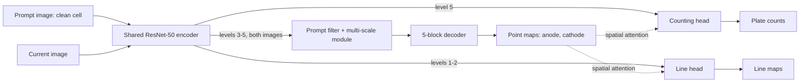

## Abstract

Electric-vehicle cells are X-rayed before they ship: an inspector counts the anode and cathode plates and judges whether each anode extends far enough past the neighbouring cathodes. This paper turns that manual job into a vision task, power battery detection (PBD), which asks for the pixel coordinates of every plate endpoint. It contributes 1,500 X-ray images from five manufacturers, annotated by six factory technicians and tagged with eight appearance attributes, plus eight metrics built around the two criteria factories use. The baseline, MDCNet, segments small blobs around the endpoints and adds a line-segmentation head, a plate-counting head, a prompt image of a clean cell, and blob sizes that adapt to plate spacing. It wins on every metric against eleven retrained alternatives. On the hardest part of the test set, though, it gets the full plate count right on only about half the images, and the authors say plainly that the task is unsolved.

**Keywords:** power battery detection, X-ray inspection, endpoint localization, point segmentation, multi-task learning, prompt filter, adaptive label generation

## 1 Introduction

Two quantities decide whether a cell passes. *Number* is the count of anode and cathode plates. *Overhang* is, for each anode, the average vertical gap between its tip and the tips of the two cathodes beside it. Both follow from the coordinates of all plate endpoints, so the vision problem is: find every endpoint and label its polarity.

Each target is essentially one pixel in an image of millions, its local texture resembles the plate body, separator and tray around it, and dense plates tilt or visually merge. The tolerance is also unusual: <mark>in production, missing a single plate makes the automatic verdict useless, so the meaningful unit of accuracy is the whole image, not the individual point</mark>. Factories currently rely on human inspectors, which is slow and prone to fatigue.

## 2 Background

The paper considers four ways to model PBD and retrains representatives of each:

- **Corner detection** (Harris, Shi-Tomasi, sub-pixel): cheap, but fires on every intersection.
- **General and tiny object detection** (RetinaNet, Faster R-CNN, YOLOv5, C3Det, CFINet): gives locations, but boxes on dense near-pointlike targets get missed or duplicated.
- **Crowd counting** (Bayesian loss, CUT, IOCFormer): a density map whose integral is the count, with no per-plate coordinates.
- **Segmentation** with a U-shaped encoder-decoder: the authors' route, predicting a small mask around each endpoint.

## 3 Method

> **Key idea.** Predict endpoints as two blob-segmentation maps (anode, cathode), and make that weak signal learnable with three kinds of help: a counting head that tells high-level features how many plates exist, a line head that tells low-level features how endpoints connect, and blob labels scaled to the local plate pitch so that targets neither merge nor vanish.

### 3.1 Dataset and metrics

All images come from one digital-radiography device, in close, medium and long shots. From more than 4,000 collected images, technicians removed duplicates, blanks and invalid shots to reach about 2,000; each of six technicians then annotated all of them, and <mark>only the 1,500 images on which the six annotation sets agreed were kept</mark>. Eight attributes tag each image: pure, tilted, aberrant (occluded or out-of-order plates), and interference from other plates, bifurcation, tray, tab or separator ([Fig. 2 in the paper](https://arxiv.org/pdf/2312.02528#page=2)). The split is 900 train and 600 test, with the test set divided into regular, difficult and tough subsets by interference level.

Two of the eight metrics carry most of the weight. Pair-number accuracy is the share of test images where both counts are exactly right:

$$
\text{PN-ACC} = \frac{1}{N}\sum_{i=1}^{N} \mathbb{1}\!\left(n_i^{\text{pair}} = \hat n_i^{\text{pair}}\right) \tag{1}
$$

with $N$ the number of test images and $n_i$, $\hat n_i$ the predicted and annotated counts. AN-ACC and CN-ACC are the single-polarity versions; AN-MAE and CN-MAE are mean absolute count errors. Overhang error compares, for each cathode $j$ and its flanking anodes $j$ and $j{+}1$, the summed tip gaps in prediction and annotation:

$$
\text{OH-MAE} = \frac{1}{N}\sum_{i}\frac{1}{n_i^{c}}\sum_{j=1}^{n_i^{c}} \Big|\, \big(|p^{c}_{ij}-p^{a}_{ij}| + |p^{c}_{ij}-p^{a}_{i,j+1}|\big) - \big(|\hat p^{c}_{ij}-\hat p^{a}_{ij}| + |\hat p^{c}_{ij}-\hat p^{a}_{i,j+1}|\big) \Big| \tag{2}
$$

where $p^{a}, p^{c}$ are sorted anode and cathode endpoint positions and $n_i^c$ is the cathode count. AL-MAE and CL-MAE are plain position errors. One rule matters later: <mark>position metrics are computed only on images whose count is already exactly right</mark>, since otherwise points cannot be matched.

### 3.2 Architecture

The point branch is an FPN-style decoder on ResNet-50 ([Fig. 4 in the paper](https://arxiv.org/pdf/2312.02528#page=5)). A multi-scale module of parallel dilated convolutions on the high-level features handles the three shot distances.

**Prompt filter module (PFM).** A randomly chosen interference-free image is encoded with the same weights. At levels 3 to 5 its features are globally pooled, passed through a 1×1 convolution and a softmax to give channel-wise soft attention, which modulates a bank of trainable 3×3 kernels; those kernels then filter the current image's features. As I read the diagram,

$$
F_{\text{filtered}} = \big(\text{softmax}(\text{Conv}_{1\times1}(\text{GAP}(F_{\text{prompt}}))) \odot W\big) * F_{\text{current}} \tag{3}
$$

with $W$ the learnable kernels, $\odot$ channel-wise scaling and $*$ convolution.

**Counting head.** The predicted point map $M_p$ of each polarity gates the downsampled top-level feature $F^{e5}$, and a pooled one-channel convolution regresses the count:

$$
N^{\text{anode}} = \text{ReLU}\big(\text{Conv}(\text{GAP}(\text{DS}(F^{e5}) \otimes M_p^{\text{anode}}))\big) \tag{4}
$$

and likewise for cathodes; $\text{DS}$ is downsampling, $\text{GAP}$ global average pooling, $\otimes$ the element-wise product.

**Line head.** The two lowest feature levels are merged into $F^{e1,2}$ by upsampling, addition and a convolution, then gated by the point map in residual form:

$$
L^{\text{anode}} = \sigma\big(\text{Conv}(M_p^{\text{anode}} \otimes F^{e1,2}) + F^{e1,2}\big) \tag{5}
$$

with $\sigma$ the sigmoid. The target is the polyline joining consecutive same-polarity endpoints. Point and line heads use weighted IoU plus binary cross-entropy; the counting head uses L1.

### 3.3 Distance-adaptive labels

With a fixed-radius disk per endpoint, disks fuse on dense cells and shrink to specks on sparse close-ups. The paper instead sets each blob's diameter to a fraction of the distance to the adjacent plate and tests fractions 0.1, 0.3 and 0.5 against constant radii of 1, 3 and 5 pixels ([Fig. 6 in the paper](https://arxiv.org/pdf/2312.02528#page=6)). Count labels come from connected components of the point mask, which is why fused blobs are so damaging.

## 4 Experiments

Training uses one V100 for 50 epochs with batch size 12, Adam at 1e-4, inputs resized to 352×352, and only random flips so that plate layout is preserved. All eleven competitors were retrained from public code. Below are the two headline metrics, retyped from Table 2 (counting methods give no coordinates and hence no OH-MAE; the three corner detectors score zero PN-ACC everywhere and are omitted).

| Method | Family | PN-ACC↑ Reg. | Diff. | Tough | OH-MAE↓ Reg. | Diff. | Tough |
|---|---|---|---|---|---|---|---|
| BL | counting | 0.5872 | 0.6278 | 0.3161 | – | – | – |
| CUT | counting | 0.1193 | 0.2965 | 0.2586 | – | – | – |
| IOCFormer | counting | 0.2294 | 0.2461 | 0.3218 | – | – | – |
| RetinaNet | detection | 0.4587 | 0.2587 | 0.1954 | 3.2207 | 3.4025 | 3.8719 |
| Faster R-CNN | detection | 0.3761 | 0.3091 | 0.3678 | 6.4742 | 6.9621 | 1.9481 |
| YOLOv5 | detection | 0.4954 | 0.2177 | 0.0690 | 5.1286 | 3.1810 | 4.9554 |
| C3Det | tiny-object | 0.6330 | 0.5016 | 0.3046 | 4.7642 | 3.7909 | 3.6690 |
| CFINet | tiny-object | 0.6881 | 0.5426 | 0.3276 | 3.9496 | 3.9769 | 3.6988 |
| **MDCNet** | segmentation | **0.9541** | **0.7603** | **0.5115** | **2.0422** | **2.1092** | **1.6291** |

<mark>MDCNet gets both counts right on 95.4% of regular images against 68.8% for the best competitor, and stays 13 to 15 points ahead on the harder subsets.</mark> The text names CFINet as runner-up throughout, although on the difficult subset the table puts the Bayesian-loss counter ahead of it.

The ablation on the regular subset (Table 3) adds components cumulatively:

| Variant | AN-ACC↑ | CN-ACC↑ | PN-ACC↑ | OH-MAE↓ |
|---|---|---|---|---|
| Point branch only | 0.6697 | 0.7064 | 0.6239 | 3.1929 |
| + prompt filter | 0.8257 | 0.8440 | 0.7706 | 3.0231 |
| + counting head | 0.9174 | 0.9266 | 0.8716 | 2.9371 |
| **+ line head** | **0.9633** | **0.9908** | **0.9541** | **2.0422** |

The prompt filter and counting head mainly fix counts; the line head is what moves the position errors. For labels, <mark>adaptive blobs at 0.3 of the plate pitch reach 0.9541 PN-ACC against 0.7523 for the best fixed radius</mark>, while a fraction of 0.1 drops to 0.6055, so the scheme is sensitive to its one hyperparameter. Five different prompt images give results identical to four decimals (Table 5).

## 5 Discussion

**Strengths.** The task is tied to real accept/reject criteria, and the all-or-nothing PN-ACC reflects how the output would be used. The authors also do not oversell: <mark>on the tough subset the full count is right on only 51% of images</mark>, and they call that performance bad.

**Weaknesses and open questions.**

- *Agreement filtering.* Dropping the roughly 500 images on which technicians disagreed gives clean labels but tilts the benchmark towards images humans find unambiguous.
- *Conditional position metrics.* Position errors are averaged only over images with correct counts, so each method is scored on its own self-selected subset. Table 4 shows the effect: the 1-pixel constant label has the lowest position errors of any setting while getting fewer than half the counts right. The claim that the 0.3 setting is best on localisation does not hold on the printed numbers.
- *Subset sizes.* The text gives 239, 187 and 174 images for the three test subsets. By my arithmetic the reported regular and difficult accuracies are exact multiples of 1/109 and 1/317 instead (tough fits 174, and 109 + 317 + 174 is also 600). I could not resolve this from the paper.
- *What the prompt does.* Identical results over five prompts are presented as robustness. They could also mean the prompt pathway yields a near-constant channel weighting, so that the PFM gain comes from the added kernel capacity. No blank-prompt ablation is given.
- *Not reported.* No repeated seeds, no inference speed, no test on unseen manufacturers or a second X-ray device, no conversion of pixel errors to physical units, and no end-to-end OK/NG decision accuracy.

The authors' proposed next steps include semi-supervised and few-shot learning, joint image restoration, and a 3D extension using CT, which links this work to the CT dataset in the previous note.

## 6 Takeaways

- PBD is dense keypoint localisation with a whole-image correctness requirement, so PN-ACC is the number to watch.
- The most transferable trick is label design: scale the supervision blob with local target spacing so instances stay separable at every density.
- The benchmark is far from saturated, at about 76% and 51% whole-image accuracy on the difficult and tough subsets, and its evaluation details need care when comparing future methods.

## References

1. X. Zhao, Y. Pang, Z. Chen, Q. Yu, L. Zhang, H. Liu, J. Zuo, H. Lu. *Towards Automatic Power Battery Detection: New Challenge, Benchmark Dataset and Baseline.* arXiv:2312.02528, 2023.
2. X. Yuan, G. Cheng, K. Yan, Q. Zeng, J. Han. *Small Object Detection via Coarse-to-Fine Proposal Generation and Imitation Learning (CFINet).* ICCV 2023.
3. Z. Ma, X. Wei, X. Hong, Y. Gong. *Bayesian Loss for Crowd Count Estimation with Point Supervision.* ICCV 2019.
4. T.-Y. Lin et al. *Feature Pyramid Networks for Object Detection.* CVPR 2017.
5. A. Condon et al. *A dataset of over one thousand computed tomography scans of battery cells.* arXiv:2403.02527, 2024.
