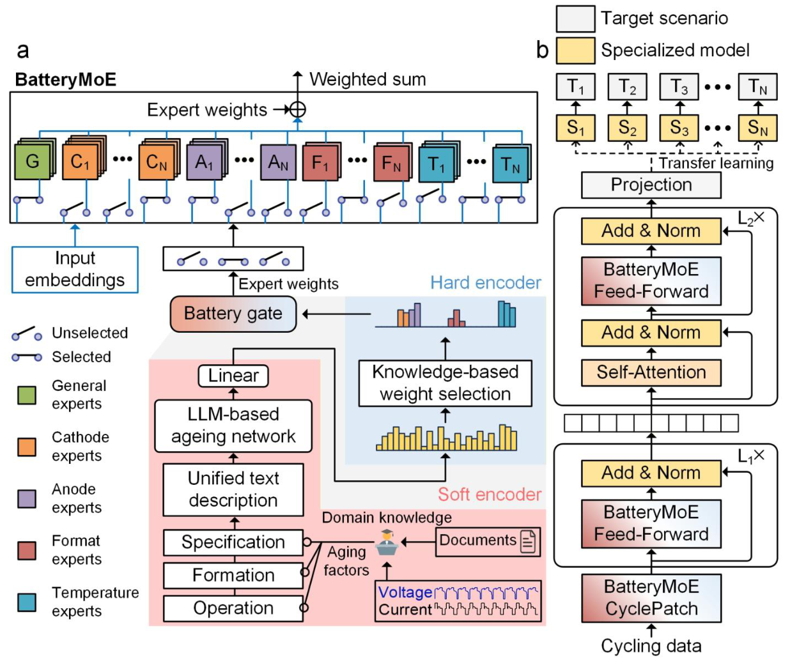
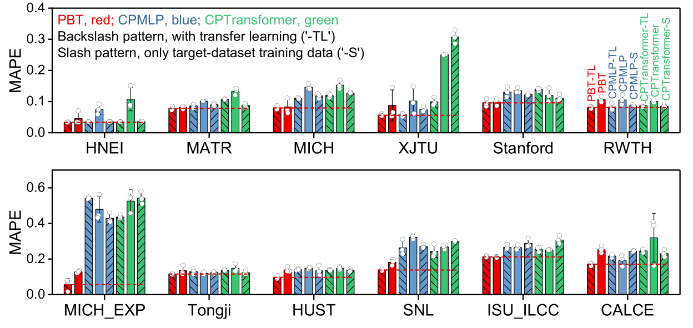
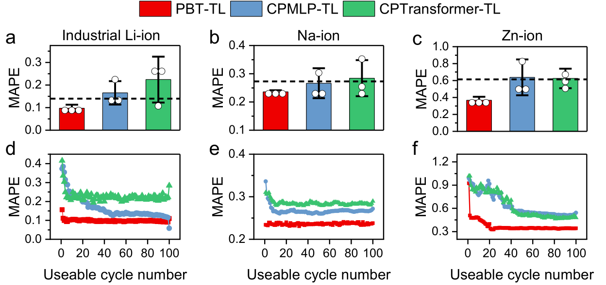

## Abstract

PBT is a pretrained model for early prediction of battery cycle life: from at most the first 100 cycles of voltage, current and capacity it predicts the number of cycles until capacity drops to 80% of nominal. Public lifetime data are tiny and heterogeneous, so models pretrained on a pooled corpus have transferred poorly. The authors' answer is architectural. Every feed-forward block is replaced by BatteryMoE, a mixture-of-experts layer whose routing is not learned from the signal but derived from what is known about the cell: a frozen LLM embeds a text description of the aging condition to produce expert scores, and a rule-based mask keeps only the experts that match the cell's cathode, anode, format and temperature. After pretraining on 13 lithium-ion datasets, the model is specialized per scenario by fine-tuning or adapter tuning. It is the best model on all 15 target datasets, by about 22% relative MAPE on average, including sodium-ion, zinc-ion and large industrial cells that pretraining never saw.

**Keywords:** battery cycle life, early prediction, foundation model, mixture-of-experts, knowledge-guided routing, transfer learning, domain shift

## 1 Introduction

Measuring a cell's lifetime means cycling it for months to years, so predicting it from the first few cycles is valuable for design, screening and protocol optimization. The field has moved from hand-built early-cycle features (Severson et al.) toward networks that read raw voltage–current curves; among those, the CyclePatch family from the BatteryLife benchmark (one token per cycle) was the strongest of 18 architectures tested.

Two problems remain. Data are scarce: even large single-lab studies hold tens of cells. And data are heterogeneous: chemistry, format, formation recipe, cycling protocol and temperature all reshape the curves, so train and test distributions rarely match. Transfer learning is the obvious remedy, by fine-tuning a source model or by domain adaptation (adversarial alignment, or BatLiNet's learning from differences between pairs of cells). The paper's complaint is that <mark>none of these approaches has a general pretrained model that can absorb many unlike datasets at once and hand something useful to a new target</mark>.

## 2 Background

**Task and metric.** The input is the first $N \le 100$ cycles, each resampled to 300 points of voltage, current and capacity; the label is cycle life. Because lifetimes range from 102 to 4999 cycles, all results use the mean absolute percentage error, $\text{MAPE} = |y-\hat y|/y$ averaged over cells.

**Data.** The authors assemble 16 public datasets: 977 cells under 528 distinct aging conditions. 418 of those conditions are represented by a single cell, so almost every condition is a one-shot domain. Thirteen lithium-ion datasets (820 cells, 418 conditions, 15 chemical systems, 5 formats, 8 temperatures) are used for pretraining, each split 6:2:2.

**Mixture of experts.** A standard MoE layer learns a gate that routes each token to a few expert sub-networks; with this little data, a gate learned from voltage curves alone is unlikely to find sensible groupings.

## 3 Method

> **Key idea.** Do not ask the network to discover which batteries are alike. Tell it: compute the routing weights from a description of the cell and its test conditions, and forbid experts that belong to a different chemistry, format or temperature band.

*Source: Tan et al., arXiv:2512.16334, Fig. 2, CC BY-NC-SA 4.0.*

### 3.1 Soft encoder: routing scores from a text description

Ten aging factors covering specification (cathode, anode, electrolyte, capacity, format, manufacturer), formation and operation (charge and discharge protocol, temperature) are written into a fixed text template and passed through a frozen Llama-3.1-8B-Instruct, so any new combination of factors maps into the same space. The hidden state of the last valid token, which under causal attention has seen the whole prompt, is the condition embedding $\mathbf e$. A small projection is shared by all layers, and each BatteryMoE layer has its own linear read-out giving raw scores for its $K_s$ specialized experts:

$$
\hat{\mathbf e} = \text{LeakyReLU}(W\mathbf e + \mathbf b), \qquad \mathbf g = W_2\hat{\mathbf e} + \mathbf b_2 \in \mathbb R^{K_s}. \tag{1}
$$

### 3.2 Hard encoder: knowledge-based expert selection

Four factors have uncontroversial categories: cathode, anode, physical format and operating temperature. Experts are created per category (LFP, graphite, 18650, each discrete temperature). A selection operator $\sigma$ zeroes the score of every expert whose category does not match the cell, with temperature experts kept if they lie within ±5 °C of the test temperature, and the survivors are renormalized:

$$
\bar{\mathbf g} = \frac{\sigma(\mathbf g)}{\sum \sigma(\mathbf g)}. \tag{2}
$$

The output adds $K_g$ always-on general experts to the weighted specialized ones ($M^{l-1}$ is the layer input, $F$ an expert network):

$$
M^{l} = \sum_{i=1}^{K_g} F_i(M^{l-1}) + \sum_{j=1}^{K_s} \bar g_j\, F_{j+K_g}(M^{l-1}). \tag{3}
$$

A category gets one expert per roughly 100 training cells, so well-populated categories split further by learned weights; this is how factors without hard categories (formation, protocols) still get specialization.

### 3.3 The PBT stack

Each cycle $X_i \in \mathbb R^{300\times3}$ is flattened, projected and passed through a BatteryMoE layer to form a cycle token. $L_1$ residual BatteryMoE feed-forward layers refine each token independently,

$$
H_i^{l} = \text{LN}\big(\text{BatteryMoE}(\text{FFN}(H_i^{l-1})) + H_i^{l-1}\big), \tag{4}
$$

tokens are zero-padded to length 100, given sinusoidal positions, and fed to an $L_2$-layer transformer encoder whose feed-forward sublayer is again BatteryMoE. The last unmasked token goes to a small mixture-of-linear-layers head; training minimizes squared error with AdamW. Specialization uses either full fine-tuning or adapters on a frozen backbone, chosen by validation error; baselines get the same choice.

## 4 Experiments

**Pretraining quality.** Baselines are CPMLP and CPTransformer, pretrained on the same 13 datasets, plus BatLiNet; every run uses three seeds. On the pooled pretraining test sets the general PBT reaches an overall MAPE of 0.143, 19.8% better than CPMLP; the margin is 20.8% on the 61 aging conditions seen in training and 18.7% on the 56 unseen ones. <mark>With a single input cycle, PBT is already more accurate than the runner-up given all 100 cycles.</mark> It is best on 9 of 12 individual datasets; CALCE is the clear exception, attributed to aging factors missing from the public metadata.

**Specialization within covered specifications.** After transfer learning, <mark>PBT-TL has the lowest MAPE on all 12 lithium-ion target datasets, by more than 10% on 8 of them and by 22.02% on average</mark>. The extreme case is MICH_EXP (seven training cells, each under its own condition), where the gain is 86.95%.

*Source: Tan et al., arXiv:2512.16334, Fig. 4, CC BY-NC-SA 4.0.*

The baselines are the more interesting story. Transfer learning helps CPTransformer on 10 datasets and CPMLP on 8, yet on 6 of 12 datasets the second-best model is either a frozen pretrained baseline or one trained from scratch on the target alone. <mark>Pooling heterogeneous data does not by itself buy transferable representations.</mark> Retraining BatLiNet on the larger corpus does not help on most datasets either.

**Beyond covered specifications.** On large-format industrial Li-ion (target redefined as 90% capacity), Na-ion and Zn-ion cells, PBT-TL beats the second-best model by 30.2%, 11.5% and 40.1%. Here the transfer-learned baselines are *worse* than the same networks trained from scratch (negative transfer), while PBT still benefits. Zero-shot use fails for all models (PBT MAPE 1.559, 4.146 and 2.516), so adaptation is not optional.

*Source: Tan et al., arXiv:2512.16334, Fig. 5, CC BY-NC-SA 4.0.*

The main results are bar charts; the one full numeric table compares PBT-TL with BatLiNet, both given only the first 20 cycles (MAPE, mean ± s.d.):

| Dataset | Train cells | PBT-TL | BatLiNet | Rel. gain |
|---|---|---|---|---|
| HNEI | 9 | **0.033 ± 0.002** | 1.419 ± 0.136 | 97.65% |
| MATR | 102 | **0.077 ± 0.006** | 0.161 ± 0.031 | 51.85% |
| MICH | 24 | **0.084 ± 0.007** | 0.353 ± 0.050 | 76.01% |
| XJTU | 15 | **0.055 ± 0.010** | 1.408 ± 0.107 | 96.04% |
| Stanford | 25 | **0.094 ± 0.012** | 0.104 ± 0.008 | 9.26% |
| RWTH | 30 | **0.082 ± 0.003** | 0.175 ± 0.135 | 53.14% |
| MICH_EXP | 7 | **0.061 ± 0.035** | 1.16 ± 0.175 | 94.71% |
| Tongji | 66 | **0.134 ± 0.002** | 0.195 ± 0.018 | 31.39% |
| HUST | 47 | **0.098 ± 0.014** | 0.121 ± 0.003 | 18.95% |
| SNL | 30 | **0.143 ± 0.006** | 1.836 ± 0.428 | 92.17% |
| ISU_ILCC | 144 | **0.210 ± 0.007** | 0.857 ± 0.054 | 75.41% |
| CALCE | 9 | **0.191 ± 0.056** | 1.22 ± 0.712 | 84.39% |
| Industrial Li-ion | 17 | **0.097 ± 0.029** | 3.667 ± 2.863 | 97.35% |
| Na-ion | 20 | **0.237 ± 0.004** | 1.85 ± 0.243 | 87.16% |
| Zn-ion | 60 | **0.396 ± 0.056** | 1.617 ± 0.192 | 75.51% |

**Ablations.** Removing either encoder raises pretraining MAPE, with the soft encoder costing slightly more than the hard one in the supplementary bar chart. A generic language-style MoE (DeepSeekMoE) does no better than the variant with no MoE at all: the routing signal, not expert capacity, is what helps. In a data-scaling study, BatteryMoE is worth about as much as 33–50% more training data for the baseline, and error is still falling at full corpus size.

## 5 Discussion

**Strengths.** The comparison is clean: identical pretraining data and adaptation recipes, with frozen and from-scratch controls, so the gain can be pinned on the routing design rather than data volume. The baselines' negative transfer is as informative as the headline number. A frozen LLM as a schema-free encoder of test conditions is a practical way to fuse datasets whose descriptors differ. Code and weights are released.

**Weaknesses.** <mark>The model needs metadata at inference</mark> — chemistry, format, temperature, protocols — and the CALCE result suggests it degrades when important factors are undisclosed. "Foundation model" is a generous label for a supervised regressor pretrained on a corpus of 820 cells that cannot be used zero-shot outside its distribution. The hard-routed factors and the ±5 °C window are hand-chosen, and the paper does not dissect where the out-of-distribution gains come from when a target category had no expert during pretraining. The ablation covers pretraining data only, not downstream transfer. Gains are quoted as relative MAPE, which flatters small absolute differences on easy datasets such as HNEI. Outputs are point estimates with no uncertainty, and all data are laboratory cycling rather than field usage; the authors acknowledge the latter.

## 6 Takeaways

- When domains are many and nearly all one-shot, a learned gate has little to learn from; computing MoE routing from side information, then masking by known categories, is a cheap structural prior.
- More varied pretraining data gave plain architectures no reliable positive transfer and sometimes negative transfer. How heterogeneity is organized mattered more than corpus size at this scale.
- The pretrained model is a starting point: zero-shot MAPE on new chemistries exceeds 100%, and every reported win comes after per-target adaptation.

## References

1. R. Tan, W. Hong, J. Li, J. Huang, T.-Y. Zhang. *Pretrained battery transformer (PBT): A foundation model for battery life prediction.* arXiv:2512.16334, 2025.
2. R. Tan et al. *BatteryLife: A Comprehensive Dataset and Benchmark for Battery Life Prediction.* KDD 2025. arXiv:2502.18807. (CyclePatch, CPMLP, CPTransformer.)
3. H. Zhang et al. *Battery lifetime prediction across diverse ageing conditions with inter-cell deep learning.* Nature Machine Intelligence, 2025. (BatLiNet.)
4. K. A. Severson et al. *Data-driven prediction of battery cycle life before capacity degradation.* Nature Energy 4, 383–391, 2019.
5. G. Ma et al. *Real-time personalized health status prediction of lithium-ion batteries using deep transfer learning.* Energy & Environmental Science 15, 4083–4094, 2022.
