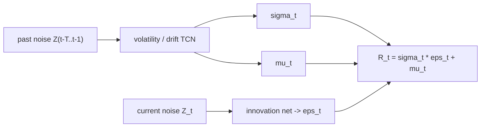

## Abstract

Quant GANs is an early, carefully formalised attempt to learn a simulator of asset returns from a single historical price series. Generator and discriminator are temporal convolutional networks (TCNs), chosen because stacked dilated causal convolutions reach far back in time without the gradient problems of recurrent nets, which is what volatility clustering demands. The generator can be given the structure of a stochastic volatility model — a volatility and drift network driven by past noise, multiplied by an innovation driven by current noise — and that structure yields an explicit risk-neutral version of the simulated price. The paper also proves an uncomfortable fact: such a generator has finite moments of every order, so heavy tails have to come from somewhere else, here an inverse Lambert W transform applied to the data before training. On daily S&P 500 returns from 2009 to 2018 both neural variants beat a GARCH(1,1) on every distributional and dependence score reported.

**Keywords:** GAN, temporal convolutional network, WaveNet, stochastic volatility, Lambert W transform, stylized facts, risk-neutral measure

## 1 Introduction

A realistic path simulator is useful for enlarging scarce historical data and for stress-testing or tuning trading strategies. The two standard routes sit at opposite ends: historical simulation uses only the data, while Monte Carlo under Black–Scholes, Heston or a Lévy model uses mostly assumptions. The authors note how slow the model-driven route is — they cite roughly two decades between Black–Scholes and Heston — and position a GAN as something in between.

They also point out what earlier financial GAN papers lacked: architectural detail, clarity about whether a conditional or unconditional law is learned, and released code, which together make benchmarking difficult. Recurrent generators bring their own extrapolation and optimisation issues. The proposal is a convolutional generator that is parallelisable, stationary by construction, and mathematically specified to the point where statements about moments and martingale measures can be proved.

## 2 Background

The targets are the usual **stylized facts** of returns: tails heavier than Gaussian, a sharper peak, volatility clustering, the leverage effect (negative correlation between returns and subsequent volatility), and returns that are serially uncorrelated yet dependent.

A GAN trains a generator $g_\theta$ and a discriminator $d_\eta$ through the game $\min_\theta\max_\eta\;\mathbb{E}[\log d_\eta(X)]+\mathbb{E}[\log(1-d_\eta(g_\theta(Z)))]$. The paper restates this for processes: the discriminator sees windows of real or generated returns whose length equals its receptive field.

## 3 Method

> **Key idea.** Write the generator as "volatility times innovation plus drift", where volatility and drift are a causal convolutional network of *past* noise and the innovation depends only on *current* noise. Long memory comes from exponentially dilated convolutions, independence of the two factors comes for free, and a martingale correction becomes available in closed form.

### 3.1 Temporal convolutional networks

The building block is the dilated causal convolution. For an input sequence $X\in\mathbb{R}^{N_I\times T}$, weights $W\in\mathbb{R}^{K\times N_I\times N_O}$, kernel size $K$ and dilation $D$,

$$
(W *_D X)_{m,t}=\sum_{i=1}^{K}\sum_{j=1}^{N_I} W_{i,j,m}\,X_{j,\,t-D(K-i)}, \tag{1}
$$

so output at time $t$ depends only on inputs at or before $t$, spaced $D$ steps apart. Stacking $L$ such layers with the dilation multiplied by $D$ at each layer gives a receptive field size (RFS)

$$
\mathcal{T}=1+(K-1)\,\frac{D^{L}-1}{D-1}, \tag{2}
$$

which grows exponentially in depth: with $K=2$ and four hidden layers the paper's illustration goes from 5 inputs at $D=1$ to 16 at $D=2$ ([Figs. 5–6 in the paper](https://arxiv.org/pdf/1907.06673#page=6)). The authors present this as the first rigorous mathematical definition of TCNs, including block modules and WaveNet-style skip connections, and define a *neural process* as $\tilde X_t=g_\theta(Z_{t-\mathcal{T}+1:t})$ for i.i.d. Gaussian noise $Z$. Such a process is stationary, and values further apart than the RFS are independent — a modelling assumption the paper states openly.

### 3.2 Stochastic volatility neural network

The log return neural process is

$$
R_{t}=\sigma_{t}\odot\epsilon_{t}+\mu_{t},\qquad (\sigma_t,\mu_t)\ \text{from}\ g^{\mathrm{TCN}}_\alpha(Z_{t-\mathcal{T}:t-1}),\quad \sigma_t=|\cdot|,\qquad \epsilon_t=g^{\epsilon}_\beta(Z_t), \tag{3}
$$

with $\odot$ the element-wise product. Volatility $\sigma_t$ and drift $\mu_t$ are measurable with respect to noise up to $t-1$, while the innovation $\epsilon_t$ uses only $Z_t$, so the two are independent. The schematic is [Fig. 8 in the paper](https://arxiv.org/pdf/1907.06673#page=11).

### 3.3 Why tails need help

Networks here are Lipschitz, so $\|g_\theta(z)\|\le L\|z\|+\|g_\theta(0)\|$. It follows that <mark>if the latent noise has finite $p$-th moment then so does the generator output, and with Gaussian noise the generated returns have finite moments of all orders</mark> — at odds with the empirical view that some moment between the second and fifth diverges. A companion result shows back-propagated gradients are also in $L^p$ under Gaussian noise, which the authors use to argue against simply switching to heavy-tailed noise: it might fix the tails at the cost of unstable optimisation.

Their workaround is preprocessing. The Lambert W transform of a variable $X$ with mean $\mu$ and standard deviation $\sigma$ is

$$
Y=U\exp\!\Big(\frac{\delta}{2}U^{2}\Big)\sigma+\mu,\qquad U=\frac{X-\mu}{\sigma}, \tag{4}
$$

which for $\delta>0$ fattens the tails and is invertible for $\delta\ge0$. The pipeline is: log returns, normalise, apply the *inverse* transform (parameters by maximum likelihood) so the data look nearly Gaussian, normalise again, cut rolling windows. The GAN learns the light-tailed series and <mark>heavy tails are restored afterwards by applying the forward Lambert W map to the samples</mark>.

### 3.4 Risk-neutral dynamics

With $S_t=S_{t-1}e^{R_t}$ and constant rate $r$, independence gives $\mathbb{E}[e^{R_t}\mid\mathcal{F}_{t-1}]=h(\sigma_t,\mu_t)$ with $h(\sigma,\mu)=\mathbb{E}[e^{\sigma\epsilon_t+\mu}]$, and the corrected return

$$
R^{M}_{t}=R_{t}-\log h(\sigma_{t},\mu_{t})+r \tag{5}
$$

makes the discounted price a martingale. If the innovation is constrained to be standard normal ($\epsilon_t=Z_{t,1}$), then $h=\exp(\mu_t+\sigma_t^2/2)$ and $R^M_t=\sigma_t\epsilon_t-\sigma_t^2/2+r$: Black–Scholes with a learned, path-dependent volatility. Calibration to option prices is left as future work.

## 4 Experiments

**Setup.** Daily S&P 500 closes, May 2009 to December 2018, 2413 observations; an augmented Dickey–Fuller statistic of −10.87 supports the stationarity assumption. Three models: a pure TCN generator with RFS 127 and three-dimensional noise, the constrained SVNN (C-SVNN) with Gaussian innovation, and a GARCH(1,1) with constant drift and normal innovations. Both networks use skip connections and are trained with the GAN stabilisation method of Mescheder et al. on a single RTX 2070. Metrics: earth mover distance (EMD) and the Drăgulescu–Yakovenko (DY) metric on 1-, 5-, 20- and 100-day returns; squared differences of autocorrelation functions of $r$, $|r|$, $r^2$ up to lag 250 (ACF scores); and the analogous leverage-effect score, each using 500 generated paths of length 4000. Lower is better throughout.

Table 2 of the paper (best per row in bold):

| Metric | TCN | C-SVNN with drift | GARCH(1,1) |
|---|---|---|---|
| EMD(1) | **0.0039** | 0.0040 | 0.0199 |
| EMD(5) | **0.0039** | 0.0040 | 0.0145 |
| EMD(20) | **0.0040** | 0.0069 | 0.0276 |
| EMD(100) | **0.0154** | 0.0464 | 0.0935 |
| DY(1) | **19.1199** | 19.8523 | 32.7090 |
| DY(5) | **21.1167** | 21.2445 | 27.4760 |
| DY(20) | 26.3294 | **25.0464** | 39.3796 |
| DY(100) | 28.1315 | **25.8081** | 46.4779 |
| ACF(id) | **0.0212** | 0.0220 | 0.0223 |
| ACF(abs) | **0.0248** | 0.0287 | 0.0291 |
| ACF(sq) | **0.0214** | 0.0245 | 0.0253 |
| Leverage effect | **0.3291** | 0.3351 | 0.4636 |

<mark>The unconstrained TCN wins ten of twelve rows and the C-SVNN the remaining two, with GARCH last everywhere</mark>. The margin is large on distributional metrics (EMD roughly five times smaller at one day) and small on ACF scores, which is unsurprising since GARCH was designed for exactly that dependence. GARCH with symmetric Gaussian innovations cannot produce a leverage effect at all, whereas both networks reproduce the negative short-lag correlation ([histogram and ACF comparison, Fig. 2 in the paper](https://arxiv.org/pdf/1907.06673#page=2)). The C-SVNN gives up a little accuracy in exchange for an interpretable volatility process and a known martingale measure.

## 5 Discussion

**Strengths.** The paper is unusually explicit: architectures are defined as mathematical objects, modelling assumptions (stationarity, independence beyond the RFS) are written down, and the moment result is an honest negative finding about the authors' own model class. The SVNN decomposition is a good example of putting financial structure into a network so that a pricing-relevant property falls out analytically. The metric suite — marginals at several horizons plus three dependence scores — became a template for later work.

**Weaknesses.** The authors report that <mark>training was very irregular and did not converge; several checkpoints were saved and the best was selected using the same metrics that are then reported</mark>, with no held-out period. That is model selection on the evaluation set, and the table should be read accordingly. There is one asset, one decade (post-crisis, largely bullish), one baseline with Gaussian innovations — a Student-$t$ or asymmetric GARCH would have been a fairer opponent — and no seeds or error bars. The Lambert W step means tails are imposed by a one-parameter preprocessing map rather than learned, and it acts on the marginal only.

**Not shown.** Multivariate generation (the definitions allow $N_X>1$ but experiments do not), any downstream use such as strategy backtests or hedging, recurrent baselines (deferred explicitly), and the option-price calibration that the risk-neutral construction is meant to enable.

## 6 Takeaways

- Dilated causal convolutions give a generator with long, exactly known memory and built-in stationarity; the cost is hard independence beyond the receptive field.
- A Lipschitz map of Gaussian noise has all moments. Heavy tails must enter through the noise, the data transform, or the architecture — the paper picks the data transform.
- Splitting the generator into predictable volatility and independent innovation buys a closed-form martingale correction, recovering Black–Scholes-like dynamics with learned volatility.
- Treat the headline table as in-sample and checkpoint-selected; the conclusion the authors themselves draw is that a single unified metric and principled tail modelling are still missing.
- For diffusion and score-based models of returns the tail concern plausibly carries over: a sampler that is a Lipschitz map of Gaussian noise is covered by the same moment bound (the paper itself only treats GAN generators), so Gaussianising transforms such as inverse Lambert W (or a heavy-tailed prior) remain relevant, and the paper's metric suite is a ready-made evaluation protocol.

## References

1. M. Wiese, R. Knobloch, R. Korn, P. Kretschmer. *Quant GANs: Deep Generation of Financial Time Series.* arXiv:1907.06673; Quantitative Finance, 2020.
2. A. van den Oord et al. *WaveNet: A Generative Model for Raw Audio.* arXiv:1609.03499, 2016.
3. S. Bai, J. Z. Kolter, V. Koltun. *An Empirical Evaluation of Generic Convolutional and Recurrent Networks for Sequence Modeling.* arXiv:1803.01271, 2018.
4. G. M. Goerg. *The Lambert Way to Gaussianize Heavy-Tailed Data with the Inverse of Tukey's h Transformation as a Special Case.* The Scientific World Journal, 2015.
5. R. Cont. *Empirical properties of asset returns: stylized facts and statistical issues.* Quantitative Finance, 2001.
