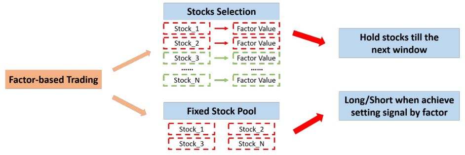
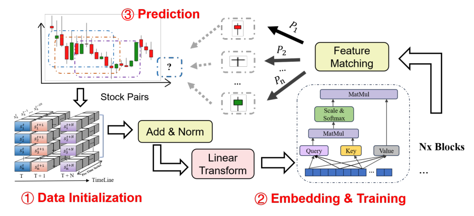

## Abstract

Quantformer adapts the transformer to cross-sectional stock selection. Each stock is described by a short sequence of two numbers per step — cumulative return and cumulative turnover — and the network predicts which return quantile the stock will land in next period. To make a language architecture accept numbers, the authors swap the word embedding for a linear layer, drop positional encoding, and remove the autoregressive decoder and masking so that the output is a single probability vector. The predicted probability of the top class is then treated as an investment factor: rank, buy the best group, equal-weight, rebalance. Trained on 2010–2019 data for 4,601 Shanghai and Shenzhen stocks and backtested from January 2020, the best monthly variant reports a 17.35% annual return and a Sharpe ratio of 0.915, ahead of all 100 price-volume factors run through the same trading rule.

**Keywords:** transformer, stock selection, factor investing, market sentiment, turnover, backtesting, Chinese equities

## 1 Introduction

Factor-based trading comes in two shapes, and the paper's first figure lays them out: compute a factor value for every stock, rank, and hold the selected pool until the next window; or keep a fixed pool and use the factor as a long/short timing signal. Quantformer belongs to the first kind.

*Source: Zhang et al., arXiv:2404.00424, Fig. 1, CC BY 4.0.*

The authors name two obstacles to using transformers for this job. First, sentiment-style NLP models start from word embeddings, but financial inputs are mostly continuous numbers, for which a lookup table makes no sense. Second, the vanilla transformer is a sequence-to-sequence machine whose decoder emits tokens one by one under a mask, whereas a stock selector needs one judgement about the coming period. <mark>The contribution is therefore architectural subtraction rather than a new attention mechanism</mark>: keep the encoder's self-attention, remove what is specific to text.

## 2 Background

The related-work section reviews SVMs, LSTMs and GRUs in trading, then catalogues some thirty transformer variants for time series (Informer, Autoformer, PatchTST, iTransformer, and others), grouped by whether they change attention, the encoder/decoder, the positional module, or mix in other models. Two threads matter for what follows. One is the argument, shared with iTransformer and HFformer, that ordered numeric series already carry their position, so explicit positional encoding may be dispensable. The other is the finance literature linking turnover to investor sentiment, which is the justification for using turnover as the second input feature — and the sense in which the paper speaks of "market sentiment": no text is involved.

## 3 Method

> **Key idea.** Treat each stock's last 20 periods of (return, turnover) as a tiny "sentence", encode it with a transformer whose embedding is just a linear map, and ask a classification question — top, middle or bottom of next period's cross-section? — instead of regressing the return.

*Source: Zhang et al., arXiv:2404.00424, Fig. 3, CC BY 4.0.*

### 3.1 Inputs and normalisation

For stock $n$ at rebalancing time $t$, the input is a $20\times2$ matrix

$$
X_n^t=\bigl[x_n^{t-19},\dots,x_n^{t}\bigr]^{\top},\qquad x_n^{t-m}=\bigl[r_n^{t-m},\,v_n^{t-m}\bigr] \tag{1}
$$

where $r$ is the return over one step (a month, week or day, from adjusted close prices) and $v$ is the turnover rate summed over the days in that step. Each row is standardised across the cross-section at the same date,

$$
\tilde x_n^{t}=\frac{x_n^{t}-\mathbb E[x^{t}]}{\operatorname{std}[x^{t}]} \tag{2}
$$

so the model sees relative, not absolute, returns and turnover. Outliers are deliberately kept.

### 3.2 Quantile labels

Next-period returns are ranked by their empirical cross-sectional CDF

$$
\Psi\bigl(r_n^{t+1}\bigr)=\frac1N\sum_{i=1}^{N}\mathbf 1\{r_i^{t+1}\le r_n^{t+1}\} \tag{3}
$$

and turned into a one-hot vector with $\varrho$ classes, each covering a fraction $\varphi$ of stocks. With $\varrho=3,\varphi=0.2$ the three classes are the ranges $[0,0.2)$, $[0.4,0.6)$ and $[0.8,1]$ of $\Psi$; stocks in between receive an all-zero "null" label, which can be either dropped or kept in training. With $\varrho=5$ the five quintiles tile the universe and there is no null label.

### 3.3 Encoder and loss

The embedding is $X_i' = X_iW_E+\theta_E$ with $W_E\in\mathbb R^{2\times d}$. Standard multi-head scaled dot-product attention follows,

$$
\operatorname{Attention}(Q,K,V)=\operatorname{softmax}\!\Bigl(\tfrac{QK^{\top}}{\sqrt d}\Bigr)V \tag{4}
$$

with $Q,K,V$ linear projections of $X_i'$ for each head, concatenated and projected back. There is no positional encoding and no mask. A final linear layer plus softmax gives $\hat y_n^t\in\mathbb R^{\varrho}$, and training minimises the mean squared error between this probability vector and the one-hot label:

$$
\mathcal L=\frac1N\sum_{i=1}^{N}\bigl\lVert y_i^t-\hat y_i^t\bigr\rVert_2^2 \tag{5}
$$

Hyper-parameters are small: $d=16$, 16 heads, 6 layers, Adam with learning rate 0.001, batch size 64, 50 epochs.

### 3.4 Trading rule

Stocks are re-ranked by the predicted probability of the first class, the chosen quantile group(s) are bought with equal weights, and the portfolio value evolves as

$$
P^{t}=P^{t-1}\sum_{n=1}^{N}w_n^{t-1}\bigl(1+r_n^{t-1}\bigr) \tag{6}
$$

with weights $w$ summing to one. The strategy is long-only, and a flat 0.3% transaction fee — the regulatory cap on brokerage commission, far above the exchange fee — is charged to keep results conservative.

## 4 Experiments

**Setup.** 4,601 SHSE/SZSE stocks from AKShare and Tushare, January 2010 to May 2023. Training ends December 2019; the backtest runs from January 2020. Nine variants cross three frequencies with three label schemes (1: $\varrho=3$ without null labels, 2: $\varrho=3$ with null labels, 3: $\varrho=5$); training sets range from 85,490 monthly samples to 5,140,279 daily ones. Metrics are annual return (AR), annual excess return over CSI 300 (AER), portfolio turnover (TR), win rate (WR), Sharpe ratio (SR), alpha, and 99% VaR.

Main results (paper's Table 3):

| Strategy | AR | AER | TR | WR | SR | Alpha | VaR |
|---|---|---|---|---|---|---|---|
| **Month 1** | **17.35%** | **19.43%** | 26.09% | **57.8%** | **0.915** | **0.162** | 2.81 |
| Month 2 | 9.91% | 13.86% | 51.69% | 49.3% | 0.289 | 0.102 | 3.61 |
| Month 3 | 7.37% | 9.91% | 32.33% | 51.6% | 0.246 | 0.064 | 2.3 |
| Week 1 | -0.83% | 1.31% | 7.13% | 46.4% | -0.236 | -0.030 | 3.05 |
| Week 2 | 7.49% | 10.81% | 1.18% | 49.2% | 0.160 | 0.085 | 3.73 |
| Week 3 | 12.3% | 12.73% | 1.39% | 54.4% | 0.372 | 0.116 | 3.77 |
| Day 1 | 7.89% | 11.4% | 6.71% | 43.1% | 0.181 | 0.090 | 3.92 |
| Day 2 | 10.23% | 10.94% | 6.51% | 44.4% | 0.279 | 0.097 | 3.91 |
| Day 3 | 9.81% | 10.03% | 5.57% | 44.6% | 0.281 | 0.092 | 4.02 |
| CSI 300 | 1.77% | – | – | – | -0.015 | – | 3.19% |

<mark>The monthly model trained only on the extreme and middle quintiles (Month 1) is clearly the best; no other variant reaches a Sharpe ratio of 0.4</mark>, and Week 1 loses money. The pattern across label schemes is not consistent — dropping null labels helps monthly but hurts weekly.

**Against classical factors.** One hundred JoinQuant price-volume factors are pushed through the same trading rule. <mark>On average they return -3.78% a year with a Sharpe ratio of -0.36 and a 44.88% maximum drawdown</mark>; the best Sharpe among them is 0.243, against 0.915 for Quantformer, which ranks first of 101 on return, excess return, Sharpe and Sortino, and within the best 10% on VaR.

*Source: Zhang et al., arXiv:2404.00424, Fig. 4, CC BY 4.0.*

**Selection scale.** Retraining Month 1 with tail sizes of 10%, 5% and 1% instead of 20% gives annual returns of 13.12%, 12.59% and 24.71%. The 1% model has the highest Sharpe (0.967) but also the highest volatility (0.214 versus 0.162); the 5% model has the lowest VaR (2.015%).

## 5 Discussion

**Strengths.** The model is tiny, the inputs are two public series, code is released, the fee assumption is harsh, and the long-only constraint matches the market. Comparing against a hundred factors under one identical trading rule is a fairer benchmark than the usual handful. Casting the task as cross-sectional quantile classification with a deliberately ignored middle is a sensible way to fight label noise.

**Weaknesses.** <mark>There is no neural baseline</mark>: no LSTM, no vanilla transformer with positional encoding, no MLP on the flattened window. The paper therefore cannot say whether removing positional encoding or using attention at all is what helps — a striking gap given that attention without position is permutation-invariant over the 20 steps. There is one train/test split, no retraining during the 3.4-year test, no seed variance, and the headline rests on one of nine configurations chosen after seeing test results. Figure 3 shows that the winning strategy spent 2020–2021 below the index; the outperformance is concentrated in 2022–2023, when the CSI 300 fell. Treatment of delisted stocks is not discussed. The risk-free rate is LIBOR rather than a Chinese rate.

**Loose ends.** The abstract speaks of "transfer learning from sentiment analysis", but no pretrained weights are used; the transfer is of task framing only. MSE on softmax outputs is an unusual choice over cross-entropy and is not justified. The text and Table 3 disagree on Month 1's win rate (57.3% vs 57.8%), and the text gives the benchmark return as -1.77% while the tables say 1.77%.

## 6 Takeaways

- A six-layer, 16-dimensional encoder on (return, turnover) windows can serve as a single cross-sectional factor; the best variant reports 17.35% annual return and Sharpe 0.915 after a 0.3% fee.
- Performance is fragile across configurations: monthly beats weekly and daily, and only one label scheme stands out.
- The evidence supports "beats 100 hand-made price-volume factors", not "beats other deep models" — the ablations that would justify the architectural choices are missing.
- Useful design pattern: cross-sectional z-scoring of inputs plus quantile labels with a discarded middle band.
- For generative or stochastic modelling of financial series the link is indirect. The model outputs a coarse categorical distribution over return quantiles, not a density or path; the transferable pieces are the cross-sectional normalisation and the factor-style backtest as a downstream test of whether a learned conditional distribution carries tradable information.

## References

1. Z. Zhang, B. Chen, S. Zhu, N. Langrené. *Quantformer: from attention to profit with a quantitative transformer trading strategy.* Expert Systems with Applications 313, 131567, 2026. arXiv:2404.00424.
2. A. Vaswani et al. *Attention is all you need.* NeurIPS, 2017.
3. Y. Liu et al. *iTransformer: inverted transformers are effective for time series forecasting.* ICLR, 2024.
4. F. Barez, P. Bilokon, A. Gervais, N. Lisitsyn. *Exploring the advantages of transformers for high-frequency trading.* arXiv:2302.13850, 2023.
5. E. F. Fama, K. R. French. *Common risk factors in the returns on stocks and bonds.* Journal of Financial Economics, 1993.
