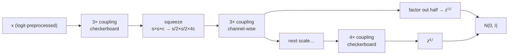

## Abstract

Real NVP is [NICE](/blog/nice/) with three changes, each of which turns out to matter. The coupling law becomes affine — the untouched half predicts an elementwise *scale* $\exp(s)$ as well as a shift $t$ — so the Jacobian determinant is $\exp\bigl(\sum_j s_j\bigr)$ rather than $1$ and the flow is *real-valued non-volume preserving*. The partition becomes a binary mask, instantiated as a spatial checkerboard and a channel-wise split so that convolutional $s$ and $t$ can exploit image structure. And the architecture becomes multi-scale: squeeze $s\times s\times c$ into $\tfrac{s}{2}\times\tfrac{s}{2}\times 4c$, factor half the dimensions out to the Gaussian at each scale, and recurse. Inside the coupling networks are residual blocks with batch normalisation, including a running-average variant built for small minibatches, and the normalisation's own log-determinant is folded into the objective. The result gives exact log-likelihood, exact latent inference, and sampling that is parallel over dimensions: 3.49 bits/dim on CIFAR-10, 4.28 and 3.98 on downsampled ImageNet, 2.72 on LSUN bedrooms, 3.02 on CelebA. It does not beat PixelRNN on likelihood and says so.

**Keywords:** affine coupling layer, non-volume-preserving flow, checkerboard mask, squeeze operation, multi-scale factor-out, bits per dimension

## 1 Introduction

The pitch is stated as a list of four things a generative model should do, and the observation that no family of the day did all four: tractable *learning*, *sampling*, *inference* and *evaluation*. Undirected models (RBMs, DBMs) need MCMC for training and sampling and have an intractable marginal. Directed latent-variable models get around inference with a variational bound, which is an approximation exactly where you want an equality. Autoregressive models have exact likelihood but sequential, non-parallelisable sampling and no latent representation at all. GANs sample fast and sharply but abandon likelihood, cannot be evaluated for diversity, and are unstable enough to need careful tuning.

The change-of-variables formula gives all four at once *if* you can afford it:

$$
p_X(x)=p_Z\bigl(f(x)\bigr)\left\lvert\det\frac{\partial f(x)}{\partial x^{\mathsf T}}\right\rvert,
\qquad
\log p_X(x)=\log p_Z\bigl(f(x)\bigr)+\log\left\lvert\det\frac{\partial f(x)}{\partial x^{\mathsf T}}\right\rvert. \tag{1}
$$

The paper's honest statement of the state of the art is that *naive application of the change of variable formula produces models which are computationally expensive and poorly conditioned, and so large scale models of this type have not entered general use*. NICE had shown the way out; Real NVP is the paper that makes it work at natural-image scale, and it is the architecture that everything from [Glow](/blog/glow/) to the coupling blocks inside modern flow-based anomaly detectors inherits.

What draws me to this family is the same property that makes it useful for out-of-distribution detection: $\log p_X(x)$ is a number you can compute for any $x$, exactly, in one forward pass. For Bayesian model comparison over candidate factor sets, that is not a convenience but a precondition — a marginal likelihood is an integral of a density, and a GAN generator has no density with respect to Lebesgue measure when its latent dimension is below $D$. Real NVP is the first flow where that computable density is also a *good* density on real data.

## 2 Prior work

The related-work section is unusually useful because it is organised by which of the four desiderata each family gives up.

- **Undirected graphical models.** Exploit bipartite conditional independence for inference; pay with an intractable marginal, so training, evaluation and sampling all need Mean Field or MCMC whose *convergence time for such complex models remains undetermined, often resulting in generation of highly correlated samples*.
- **Directed models and the VAE.** Ancestral sampling is easy, posterior inference is not; stochastic and amortised variational inference give a lower bound. The paper's diagnosis is that *the approximation in the inference process limits its ability to learn high dimensional deep representations*, and it lists seven papers trying to fix it — including [IAF](/blog/iaf/).
- **Autoregressive models.** Chain rule under a fixed ordering. Flexible and exactly evaluable, but sampling is sequential and non-parallelisable, the ordering is arbitrary yet can be critical, and there is no natural latent representation.
- **GANs.** Sharp samples, no likelihood, intractable diversity metrics, unstable training.
- **Change-of-variables ancestors.** Maximum-likelihood ICA, Gaussianization, and the deep density models of Bengio (1991), Rippel & Adams, Ballé et al. The paper also makes the pleasing observation, via the nonlinear-ICA existence result of Hyvärinen & Pajunen, that *autoregressive models can be seen as a tractable instance of maximum likelihood nonlinear ICA, where the residual corresponds to the independent components*.

Against NICE specifically, Real NVP keeps the coupling idea and the triangular-Jacobian argument and changes what is done inside.

## 3 Method

> **Key idea.** Let the half that passes through unchanged predict a per-coordinate multiplier as well as an offset. The Jacobian stays triangular, so the determinant is still just the product of the diagonal — but now the diagonal is $\exp(s(x_{1:d}))$, which varies with the input, so the model can stretch and compress volume locally instead of only globally.

### 3.1 The affine coupling layer

Split $x\in\mathbb{R}^D$ at $d<D$:

$$
y_{1:d}=x_{1:d},\qquad
y_{d+1:D}=x_{d+1:D}\odot\exp\bigl(s(x_{1:d})\bigr)+t(x_{1:d}), \tag{2}
$$

with $s,t:\mathbb{R}^d\to\mathbb{R}^{D-d}$ and $\odot$ the Hadamard product. The Jacobian is

$$
\frac{\partial y}{\partial x^{\mathsf T}}=
\begin{bmatrix}
I_d & 0\\[4pt]
\dfrac{\partial y_{d+1:D}}{\partial x_{1:d}^{\mathsf T}} & \operatorname{diag}\bigl(\exp[s(x_{1:d})]\bigr)
\end{bmatrix},
\qquad
\det=\exp\Bigl(\textstyle\sum_j s(x_{1:d})_j\Bigr). \tag{3}
$$

Two facts do all the work, and both are inherited from NICE. The determinant does not involve the Jacobian of $s$ or $t$, so those can be arbitrarily complex — here, deep convolutional residual networks. And the inverse

$$
x_{1:d}=y_{1:d},\qquad
x_{d+1:D}=\bigl(y_{d+1:D}-t(y_{1:d})\bigr)\odot\exp\bigl(-s(y_{1:d})\bigr) \tag{4}
$$

does not require inverting $s$ or $t$ either; it evaluates them forwards on $y_{1:d}=x_{1:d}$. So *sampling is as efficient as inference*, exactly — the forward and inverse passes have identical cost, which is the property autoregressive models cannot have.

The whole difference from NICE is the $\exp(s)$ factor. NICE declined it for numerical stability, since a rectified $m$ makes an additive coupling piecewise linear; the $\exp$ parameterisation plus the tricks in §3.5 is what makes the multiplicative version trainable.

### 3.2 Masked convolution

Rather than reindexing, the partition is written as a binary mask $b$:

$$
y=b\odot x+(1-b)\odot\Bigl(x\odot\exp\bigl(s(b\odot x)\bigr)+t(b\odot x)\Bigr). \tag{5}
$$

This keeps the tensor in image layout so $s$ and $t$ can be convolutional. Two masks are used, chosen to match the correlation structure of images:

- **Spatial checkerboard**: $b=1$ where the sum of spatial coordinates is odd. Neighbouring pixels are the most correlated pair in an image, so conditioning each on the other is the strongest local signal available.
- **Channel-wise**: $b=1$ for the first half of the channels. Meaningful only after the squeeze, when channels carry spatial information.

Both $s$ and $t$ are rectified convolutional networks, and the paper notes that their hidden layers can be wider than their input and output — the bottleneck is the coupling structure, not the network.

### 3.3 Composition

Coupling layers compose cleanly because

$$
\frac{\partial(f_b\circ f_a)}{\partial x_a^{\mathsf T}}(x_a)=\frac{\partial f_a}{\partial x_a^{\mathsf T}}(x_a)\cdot\frac{\partial f_b}{\partial x_b^{\mathsf T}}\bigl(x_b=f_a(x_a)\bigr),
\qquad \det(AB)=\det A\det B,
$$

and $(f_b\circ f_a)^{-1}=f_a^{-1}\circ f_b^{-1}$. So log-determinants add and inverses reverse, and the masks alternate so that what was left alone gets updated next.

### 3.4 Squeeze and multi-scale

**Squeeze.** For each channel, partition the image into $2\times2$ blocks and reshape each into a $1\times1\times4$ stack: $s\times s\times c\mapsto\tfrac{s}{2}\times\tfrac{s}{2}\times4c$. Spatial extent is traded for channels, which is what makes channel-wise masking informative — after squeezing, the four channels of a position are four spatially adjacent pixels.

**Per-scale block.** Three coupling layers with alternating checkerboard masks; squeeze; three coupling layers with alternating channel-wise masks, chosen so the partition is *not redundant with the previous checkerboard masking*. At the final scale, four coupling layers with alternating checkerboard masks and no squeeze.

**Factor-out.** Propagating all $D$ dimensions through every layer is wasteful in compute, memory and parameters, so half the dimensions are factored out at each scale and sent straight to the Gaussian prior:

$$
h^{(0)}=x,\qquad
\bigl(z^{(i+1)},h^{(i+1)}\bigr)=f^{(i+1)}\bigl(h^{(i)}\bigr),\qquad
z^{(L)}=f^{(L)}\bigl(h^{(L-1)}\bigr),
$$

and $z=(z^{(1)},\dots,z^{(L)})$. Recursion continues until the input of the last stage is $4\times4\times c$. At each level the number of hidden features in $s$ and $t$ is doubled as spatial resolution halves.

The consequence the paper draws out is worth keeping: *the model must Gaussianize units which are factored out at a finer scale before those which are factored out at a coarser scale*, so the levels correspond to progressively more global features. There is also a plainly practical benefit — the loss is distributed throughout the network, which the paper likens to deeply supervised nets, and the memory saved buys a larger model.

### 3.5 Batch normalisation, and its log-determinant

Inside $s$ and $t$: residual networks with batch normalisation and weight normalisation. Appendix E introduces a *running-average* batch-norm variant, using a moving average over recent minibatches rather than the current one, which the paper says is more robust with very small minibatches — relevant because a flow's memory cost forces small batches.

Batch norm is also applied to the whole coupling-layer output, and here it is not a trick but part of the flow, because a rescaling changes the density. With batch statistics $\tilde\mu,\tilde\sigma^2$, the map $x\mapsto(x-\tilde\mu)/\sqrt{\tilde\sigma^2+\epsilon}$ has Jacobian determinant

$$
\prod_i\bigl(\tilde\sigma_i^2+\epsilon\bigr)^{-1/2}, \tag{6}
$$

which is added to the objective. The authors report that this *not only allowed training with a deeper stack of coupling layers, but also alleviated the instability problem that practitioners often encounter when training conditional distributions with a scale parameter through a gradient-based approach* — i.e. it is the fix for exactly the numerical worry that kept NICE additive.

### 3.6 Algorithm

```text
PREPROCESS
  x = logit( alpha + (1 - alpha) * x / 256 ),  alpha = 0.05
  # this is itself a bijection; its log-determinant enters the bits/dim

TRAIN
  z, logdet = 0, 0
  h = x
  for scale in 1..L-1:
      h, ld = 3 x coupling(checkerboard, alternating); logdet += ld
      h     = squeeze(h)                       # s x s x c -> s/2 x s/2 x 4c
      h, ld = 3 x coupling(channelwise, alternating); logdet += ld
      z_i, h = split(h)                        # factor out half to the prior
      z.append(z_i)
  h, ld = 4 x coupling(checkerboard, alternating); logdet += ld
  z.append(h)
  loss = -( sum_i log N(z_i; 0, I) + logdet )

SAMPLE                                          # identical cost to training forward pass
  z ~ N(0, I) at every scale
  run every coupling layer backwards (eq. 4), unsqueeze, reassemble
```



## 4 Implementation notes

- **Preprocessing is part of the model.** Pixels in $[0,256]^D$ after jittering are mapped through $\operatorname{logit}\bigl(\alpha+(1-\alpha)\tfrac{x}{256}\bigr)$ with $\alpha=0.05$, to reduce boundary effects from modelling a bounded variable with an unbounded density. The paper states explicitly that this transformation is *taken into account when computing log-likelihood and bits per dimension*, which is the discipline NICE did not spell out and which makes these numbers comparable to other papers'.
- **Augmentation.** Horizontal flips on CIFAR-10, CelebA and LSUN during training. Note this is augmentation of a *density model*: the model is fit to the flip-symmetrised distribution, not to the data distribution, which is a modelling choice with likelihood consequences the paper does not discuss.
- **Dataset preparation.** LSUN: downsample so the smallest side is 96 px, then random $64\times64$ crops (following DCGAN). CelebA: approximately central $148\times148$ crop resized to $64\times64$. ImageNet: the $32\times32$ and $64\times64$ downsampled versions from the PixelRNN paper.
- **Output parameterisations.** $s$ is a hyperbolic tangent times a learned scale — bounding $s$ before exponentiating is what keeps $\exp(s)$ from blowing up — while $t$ has an affine output. The tanh is the detail most reimplementations drop and then wonder why training diverges.
- **Sizes.** $32\times32$ images: 4 residual blocks, 32 hidden feature maps in the first checkerboard coupling layers. $64\times64$: 2 residual blocks. CIFAR-10 is the exception: 8 residual blocks, 64 feature maps, and *downscale only once*. Batch size 64 throughout.
- **Optimisation.** Adam with default hyperparameters; $L_2$ regularisation on the weight-scale parameters with coefficient $5\times10^{-5}$. No learning-rate schedule, no training length, and no parameter counts are reported. Marked: not stated — which is awkward given that the results section attributes headroom to model size.
- **Prior.** Isotropic unit-norm Gaussian, with the remark that any distribution could be used, *including distributions that are also learned during training, such as from an auto-regressive model, or (with slight modifications to the training objective) a variational autoencoder*. Both of those became papers.

## 5 Experiments

**Setup.** Four natural-image datasets, bits per dimension, test set for CIFAR-10 and validation sets elsewhere, with training numbers in parentheses.

| Dataset | PixelRNN | **Real NVP** | Conv DRAW | IAF-VAE |
|---|---|---|---|---|
| CIFAR-10 | **3.00** | 3.49 | $<3.59$ | $<3.28$ |
| ImageNet $32\times32$ | **3.86** (3.83) | 4.28 (4.26) | $<4.40$ (4.35) | |
| ImageNet $64\times64$ | **3.63** (3.57) | 3.98 (3.75) | $<4.10$ (4.04) | |
| LSUN (bedroom) | | 2.72 (2.70) | | |
| LSUN (tower) | | 2.81 (2.78) | | |
| LSUN (church outdoor) | | 3.08 (2.94) | | |
| CelebA | | 3.02 (2.97) | | |

**Claim by claim.**

1. *Competitive but not best on likelihood.* The paper's own summary — *the number of bits per dimension, while not improving over the Pixel RNN baseline, is competitive with other generative methods*. Correct and refreshingly unspun. Note that Conv DRAW and IAF-VAE entries are upper bounds (they are negative ELBOs), so Real NVP at 3.49 beating $<3.59$ is a real comparison in one direction only: it says nothing about whether Conv DRAW's true likelihood is above or below 3.49. Against IAF-VAE's $<3.28$, Real NVP simply loses — a bound below your exact value is decisive.
2. *Little overfitting.* Supported by the train/validation gaps: 4.26 vs 4.28 on ImageNet-32, 2.70 vs 2.72 on LSUN bedroom. The exceptions are ImageNet-64 (3.75 train vs 3.98 validation) and LSUN church outdoor (2.94 vs 3.08), where the gap is an order of magnitude larger and the claim does not hold. The paper asserts the low-overfitting reading for *CelebA and LSUN* on the grounds that validation bits/dim were still falling at the end of training, and does not comment on the church-outdoor gap.
3. *Performance increases with the number of parameters, so larger models would help.* Asserted, not shown. No scaling curve, no parameter counts, no ablation over residual-block count. This is the weakest sentence in the results section.
4. *Samples are sharp as well as globally coherent* ([Fig. 5](https://arxiv.org/pdf/1605.08803#page=8)). Qualitative only — no FID or IS, which did not yet exist in standard use. The stated mechanism is that Real NVP, unlike a VAE, has no fixed-form reconstruction cost such as an $L_2$ norm, which *tends to reward capturing low frequency components more heavily than high frequency components*. The paper labels this a hypothesis and does not test it.
5. *Maximum likelihood values diversity over sample quality at limited capacity, so some samples are highly improbable, especially on CelebA.* An honest self-criticism and the correct one: the mass-covering behaviour of the forward KL is the mechanism, and it is the same property that makes likelihood models useful for OOD detection and mediocre at beauty contests.
6. *The latent space is semantically organised.* Demonstrated by a two-parameter manifold through four validation latents ([Fig. 6](https://arxiv.org/pdf/1605.08803#page=9)) and by a class-conditional CelebA model in Appendix F. Qualitative. The manifold (Eq. 19), $z=\cos\varphi\,\bigl(\cos\varphi'\,z^{(1)}+\sin\varphi'\,z^{(2)}\bigr)+\sin\varphi\,\bigl(\cos\varphi'\,z^{(3)}+\sin\varphi'\,z^{(4)}\bigr)$, is a product of two rotations that passes through all four latents.
7. *Background/foreground and lighting structure is captured on ImageNet and LSUN.* Eyeballing a figure. Suggestive, not evidence.

**What is missing.** There is no ablation anywhere in the paper. Affine versus additive coupling, checkerboard versus channel masks, multi-scale versus flat, batch norm on versus off, the running-average variant versus standard batch norm, the tanh on $s$ — every one of these is a design decision defended in prose and never isolated in a table. Given that the multi-scale factor-out and the batch-norm log-determinant are the two changes most likely to explain the gap from NICE, their absence from the evidence is the paper's main scientific weakness.

## 6 Limitations

**Stated by the authors.** Does not beat PixelRNN. Produces improbable samples under limited capacity. That is roughly the whole list; the discussion section is forward-looking rather than self-critical.

**My reading.**

- **Zero ablations**, as above. The paper is an architecture paper whose architecture is never decomposed.
- **The latent is still as large as the data** — the paper presents this as a *feature* ("a semantically meaningful latent space which is as high dimensional as the input space", useful for semi-supervised learning), and it is also the reason flows need far more parameters than a VAE for comparable samples.
- **Expressiveness is unaddressed.** An affine coupling layer is affine in the transformed half given the other half. Whether a finite stack of such layers can represent an arbitrary density is not asked. [Neural Spline Flows](/blog/neural-spline-flows/) is the eventual answer to why this matters: replacing the affine law with a monotone spline gives a large gain at fixed depth, which means the affine law was binding.
- **Batch normalisation inside a density model is a statistical hazard.** With batch statistics in the Jacobian, the "likelihood" of a data point depends on the other points in its minibatch, so the training objective is not $\sum_n\log p(x_n)$ for any fixed $p$. The paper handles it pragmatically with the running-average variant but never states the issue. At evaluation time one presumably uses the running averages, making the evaluated model a different one from the trained model — how different is not measured.
- **Masks are hand-designed for images.** Checkerboard and channel-wise both assume a spatial grid. For tabular data — a factor panel, say — there is no analogue, and the ordering problem Real NVP claims to escape from autoregressive models comes back in the form of a partition problem. This is precisely what Glow's learned $1\times1$ convolution addresses.
- **Flip augmentation changes the target density** and is not accounted for in the reported bits/dim discussion.
- **No compute or wall-clock numbers** anywhere, and no parameter counts, so "larger models are likely to further improve performance" cannot be located on any axis.

## 7 Extensions

**What was built on this.** [Glow](/blog/glow/) keeps the affine coupling and the multi-scale structure, replaces the fixed alternation of masks with a learned invertible $1\times1$ convolution, and replaces batch norm with activation normalisation initialised from data — removing exactly the minibatch dependence flagged above. [Neural Spline Flows](/blog/neural-spline-flows/) replaces the affine law with a monotone rational-quadratic spline in the same coupling skeleton. [MAF](/blog/maf/) takes the opposite branch, going fully autoregressive for density estimation, and explicitly analyses Real NVP as the interpolation point between itself and [IAF](/blog/iaf/). The multi-scale factor-out survives into essentially every image flow since, and coupling blocks of this exact shape are still the backbone of flow-based industrial anomaly detection. The [Papamakarios et al. survey](/blog/normalizing-flows-survey/) gives the unified account.

**Open problems the paper leaves.** How expressive is a depth-$L$ affine coupling flow, and does the multi-scale factor-out cost anything in expressiveness for what it saves in compute? How should the mask be chosen when the data has no spatial structure? And the question the discussion raises without pursuing: how much of the 3.49-versus-3.00 gap to PixelRNN is the coupling restriction and how much is capacity?

**Research directions.** *These are ideas, not results — none has been run.*

1. **Ablate the architecture the paper never ablated.** Hypothesis: on CIFAR-10 at fixed parameter count, the ordered contribution to bits/dim is multi-scale factor-out > affine-vs-additive coupling > batch-norm-in-the-Jacobian > mask choice, and the affine-vs-additive gap shrinks once a spline coupling is used because both become non-binding. Data: CIFAR-10 at $32\times32$, one seed budget of three per cell. Baseline: the paper's configuration. Metric: test bits/dim per ablated component, with the parameter count held fixed by adjusting residual width. Likely failure mode: the components interact — removing the multi-scale factor-out changes the memory budget and hence the feasible width — so "fixed parameter count" is not the right control and the effects do not decompose.
2. **Replace the image masks with a learned partition for tabular financial data.** Hypothesis: on a monthly factor-return panel, where no spatial prior exists, a coupling flow whose partition is learned (a soft mask, or Glow's $1\times1$ convolution) beats any fixed partition by a margin that grows with the correlation structure's departure from block form. Data: a standardised panel of factor returns with a held-out period, plus synthetic panels with controlled block-correlation. Baseline: fixed odd/even partition, fixed random partition, and a Gaussian copula. Metric: held-out log-likelihood and calibration of the 1% and 5% tail quantiles. Likely failure mode: with a few hundred monthly observations in a few dozen dimensions, everything overfits and the fixed-partition model wins by being smaller — in which case the useful output is a sample-size threshold rather than a ranking.
3. **Quantify the minibatch dependence that batch norm introduces into the density.** Hypothesis: the evaluated log-likelihood of a fixed test point varies measurably with the running-average state, and the spread is large enough relative to the reported inter-model gaps (3.49 vs 3.28) that some published orderings are inside it. Data: CIFAR-10, one trained Real NVP. Baseline: the same architecture with activation normalisation in place of batch norm. Metric: distribution over random batch compositions of the per-point $\log p$, summarised as bits/dim spread; and train-time versus eval-time bits/dim under the two normalisers. Likely failure mode: the running-average variant has already made the spread negligible, which would be a clean negative result and worth having written down.

## 8 Takeaways

- One symbol separates Real NVP from NICE: the $\exp(s(x_{1:d}))$ multiplier. It makes the Jacobian determinant input-dependent, which is what lets the model put volume where the data is instead of scaling each coordinate globally.
- Forward and inverse cost the same, because neither direction inverts $s$ or $t$. That is the structural advantage over autoregressive models and it does not degrade with dimension.
- The multi-scale architecture — squeeze, couple, factor out, recurse — is as important as the coupling law and is the part later work kept unchanged. It saves compute and memory, distributes the loss, and builds a coarse-to-fine latent hierarchy for free.
- Anything that rescales the data inside the flow, batch normalisation included, contributes a log-determinant. Real NVP accounts for it; the resulting minibatch dependence of the density is a real subtlety that the paper does not name.
- Preprocessing must be inside the change of variables. The logit transform with $\alpha=0.05$ is folded into the bits/dim, which is why these numbers can be compared across papers and NICE's cannot.
- The evidence is a single table and some figures, with no ablations at all. Read the architecture as a well-motivated package, not as a set of individually validated choices.
- For density-based decision making — model comparison, OOD detection, tail estimation — this is the first flow whose densities are good enough on real data to be worth trusting, and the masks are the part you would have to redesign for non-image data.

## References

1. Dinh, L., Sohl-Dickstein, J., Bengio, S. *Density Estimation using Real NVP.* arXiv:1605.08803 (ICLR 2017).
2. Dinh, L., Krueger, D., Bengio, Y. *NICE: Non-linear Independent Components Estimation.* arXiv:1410.8516.
3. van den Oord, A., Kalchbrenner, N., Kavukcuoglu, K. *Pixel Recurrent Neural Networks.* arXiv:1601.06759.
4. Kingma, D. P., Salimans, T., Welling, M. *Improving Variational Inference with Inverse Autoregressive Flow.* arXiv:1606.04934.
5. Gregor, K., Besse, F., Rezende, D. J., Danihelka, I., Wierstra, D. *Towards Conceptual Compression.* arXiv:1604.08772.
6. Ioffe, S., Szegedy, C. *Batch Normalization.* arXiv:1502.03167.
7. Hyvärinen, A., Pajunen, P. *Nonlinear Independent Component Analysis: Existence and Uniqueness Results.* Neural Networks 12(3), 1999.
