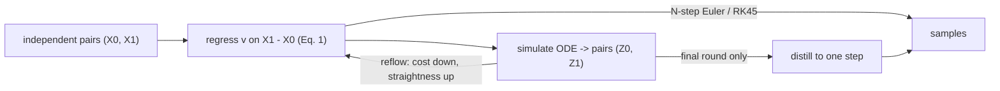

## Abstract

Rectified flow learns an ODE that carries one empirical distribution to another by imitating, as far as a causal flow can, the straight segments joining sampled pairs. Training is a plain least-squares regression of a velocity network onto the difference of two endpoints, evaluated at a random point of their segment. Three results hold: the induced flow reproduces the marginals of the interpolation at every time; its endpoint coupling costs no more than the input coupling under *every* convex transport cost at once; and repeating the procedure on the flow's own input–output pairs — *reflow* — drives a straightness measure to zero at an $O(1/K)$ rate. On CIFAR-10 the first flow reaches FID 2.58 with an adaptive solver; a reflowed and distilled flow reaches 4.85 with a single network call, against 378 for the un-reflowed flow at one step. The framework also recovers VP, sub-VP and VE probability-flow ODEs as curved, unevenly paced special cases of the same regression.

**Keywords:** rectified flow, reflow, straight couplings, neural ODE, convex transport cost, few-step sampling, distillation, probability flow ODE

## 1 Introduction

The paper opens by collapsing several unsupervised problems into one. Given samples of $\pi_0$ and $\pi_1$ on $\mathbb R^d$, find a transport map $T$ with $T(Z_0)\sim\pi_1$ when $Z_0\sim\pi_0$. Generation is the case $\pi_0=\mathcal N(0,I)$; unpaired translation and domain adaptation are the cases where both sides are data. The existing answers each fail specifically: GANs need minimax training with its instability and mode collapse; likelihood models buy tractability with architectural constraints or variational approximations; optimal-transport solvers scale badly in high dimension, and — the sharper objection — the transport cost is not the learning objective anyway.

Continuous-time models ([Neural ODE](/blog/neural-ode/), [Score-SDE](/blog/score-sde/), [DDPM](/blog/ddpm/)) escape minimax training but one sample costs many evaluations of a large network. The authors add two complaints about the diffusion route: its design space is large, poorly understood, and inherited from an SDE derivation rather than chosen for the ODE actually simulated; and if the goal is an ODE, the SDE machinery is a detour, because <mark>an ODE can be fitted directly by least squares, and the right paths to fit are straight ones, since a constant-speed straight path is integrated exactly by one Euler step</mark>.

## 2 Background

A flow is $dZ_t=v(Z_t,t)\,dt$ on $t\in[0,1]$. When the solution is unique, two trajectories cannot occupy the same point at the same time moving in different directions — the non-crossing property, which is the entire mechanism of this paper.

A coupling of $\pi_0,\pi_1$ is any joint law with those marginals; the independent one is the default, since real problems supply no pairing. Its transport cost under $c$ is $\mathbb E[c(Z_1-Z_0)]$, and it is $c$-optimal if it minimises that among couplings with the same marginals. The deterministic formulation matters: unlike [DDPM](/blog/ddpm/)'s stochastic reverse process, an ODE gives an invertible pairing, so the latent space is usable for interpolation and editing — [DDIM](/blog/ddim/) is the diffusion-side version of that observation.

## 3 Method

> **Key idea.** Straight lines between paired samples cross each other, so they are not a flow. Fit the velocity field that *averages* the line directions at each point; the resulting ODE traces the same density of "roads" but re-routes particles at crossings. Re-routing preserves the marginals, cannot lengthen the trip under any convex cost, and — because the new pairing has fewer crossings — leaves less to average over next time.

### 3.1 The regression objective

Draw $(X_0,X_1)$ from any coupling and set $X_t=tX_1+(1-t)X_0$. The interpolation obeys $dX_t=(X_1-X_0)\,dt$, which is *non-causal*: the update needs the destination. Causalising it means replacing the destination-dependent direction by something computable from the present state — exactly a least-squares projection:

$$
\min_v \int_0^1 \mathbb E\Big[\big\lVert (X_1-X_0)-v(X_t,t)\big\rVert^2\Big]\,dt .
\tag{1}
$$

In practice $t\sim\mathrm{Uniform}[0,1]$, $v$ is a network, and any stochastic optimiser will do — no adversary, no schedule, no likelihood. The exact minimiser is the conditional expectation

$$
v^X(x,t)=\mathbb E\big[X_1-X_0 \,\big|\, X_t=x\big],
\tag{2}
$$

the mean direction of all segments through $x$ at time $t$. If $X_0\mid X_1$ has a density this has a closed form, $v^X(z,t)=\mathbb E\big[\tfrac{X_1-z}{1-t}\,\eta_t(X_1,z)\big]$ with $\eta_t$ a normalised density ratio — conditioning on $X_t=z$ pins $X_0=\tfrac{z-tX_1}{1-t}$, hence $X_1-X_0=\tfrac{X_1-z}{1-t}$. Without that density $v^X$ can be undefined or discontinuous and the ODE ill-posed; the fix is to smooth $X_0$ with an independent Gaussian, making the map randomised. Note too that fitting $v^X$ *exactly* would overfit — with $\pi_1$ empirical the flow returns training points — so smoothness of the approximator is a feature, not a compromise.

### 3.2 Marginal preservation

Let $Z$ solve $dZ_t=v^X(Z_t,t)\,dt$ from $Z_0=X_0$. The proof of $\mathrm{Law}(Z_t)=\mathrm{Law}(X_t)$ is two lines of calculus. For a test function $h$,

$$
\frac{d}{dt}\mathbb E[h(X_t)] = \mathbb E[\nabla h(X_t)^\top \dot X_t] = \mathbb E[\nabla h(X_t)^\top v^X(X_t,t)],
\tag{3}
$$

using the tower property in the second equality. So $\pi_t=\mathrm{Law}(X_t)$ solves the continuity equation $\dot\pi_t+\nabla\cdot(v^X_t\pi_t)=0$ distributionally — but $\mathrm{Law}(Z_t)$ solves the *same* equation with the *same* initial condition, so the two agree whenever that solution is unique, which uniqueness of the ODE solution supplies. Hence <mark>$(Z_0,Z_1)$ is a valid, now deterministic, coupling of $\pi_0$ and $\pi_1$</mark>. The step is *exact* and uses nothing about straightness: it holds for any differentiable interpolation, which is what makes Section 3.7 possible. Everything else about the process does change — $X_t$ is non-causal, non-Markov with a stochastic pairing, and $Z_t$ causalises, Markovianises and derandomises it while holding every marginal fixed.

### 3.3 Convex costs cannot increase

The proof is two applications of Jensen's inequality and is worth spelling out, because it shows where each hypothesis enters:

$$
\begin{aligned}
\mathbb E[c(Z_1-Z_0)]
&= \mathbb E\Big[c\Big(\textstyle\int_0^1 v^X(Z_t,t)\,dt\Big)\Big]
&&\text{the ODE for } Z\\
&\le \mathbb E\Big[\textstyle\int_0^1 c\big(v^X(Z_t,t)\big)\,dt\Big]
&&\text{Jensen, over time}\\
&= \mathbb E\Big[\textstyle\int_0^1 c\big(v^X(X_t,t)\big)\,dt\Big]
&&\text{same marginals (Sec. 3.2)}\\
&= \mathbb E\Big[\textstyle\int_0^1 c\big(\mathbb E[X_1-X_0\mid X_t]\big)\,dt\Big]
&&\text{definition of } v^X\\
&\le \mathbb E\big[c(X_1-X_0)\big]
&&\text{Jensen, over the conditional.}
\end{aligned}
\tag{4}
$$

The first Jensen step uses that $Z_1-Z_0$ is a time-average of velocities; the second, that $v^X$ is itself a conditional average of segment directions. Both need only convexity, so <mark>the inequality holds for every convex $c$ at once rather than for one chosen cost</mark> — a Pareto descent over the whole family. The flip side: the fixed point optimises no particular $c$. Straightness is necessary for $c$-optimality (Theorem 3.8) but not sufficient, except in one dimension, where the unique straight coupling is the monotone one and is simultaneously optimal for all convex costs; a companion work notes that restricting $v$ to a gradient field $v=\nabla f$ kills the rotational component and does recover the quadratic-optimal coupling as a fixed point. Straight paths are load-bearing throughout, since the argument uses the Euclidean geodesic: for a straight but non-constant-speed interpolation the decrease survives only for $c$ that are additionally $m$-homogeneous with $m\in(0,1]$.

### 3.4 Straightness and the reflow bound

Straightness of a process is measured by

$$
S(Z)=\int_0^1\mathbb E\Big[\big\lVert (Z_1-Z_0)-\dot Z_t\big\rVert^2\Big]dt ,
\tag{5}
$$

zero exactly when every path is a constant-speed line. A second quantity measures how much the input coupling's segments disagree where they cross:

$$
V\big((X_0,X_1)\big)=\int_0^1\mathbb E\Big[\big\lVert (X_1-X_0)-\mathbb E[X_1-X_0\mid X_t]\big\rVert^2\Big]dt ,
\tag{6}
$$

zero exactly when the interpolation paths never intersect. Taking $c(x)=\lVert x\rVert^2$ in Eq. (4) and tracking the slack in the two Jensen steps turns the inequality into an identity:

$$
\mathbb E\lVert X_1-X_0\rVert^2-\mathbb E\lVert Z_1-Z_0\rVert^2 = S(Z)+V\big((X_0,X_1)\big).
\tag{7}
$$

This is the engine of the method: <mark>the transport cost given up in one rectification is *exactly* the straightness plus the crossing bought</mark>. Reflow sets $Z^{k+1}=\mathrm{RectFlow}\big((Z^k_0,Z^k_1)\big)$ with $(Z^0_0,Z^0_1)=(X_0,X_1)$ — simulate, collect endpoint pairs, retrain Eq. (1) on them. Applying Eq. (7) at each round and telescoping gives

$$
\sum_{k=0}^{K}\Big[S(Z^{k+1})+V\big((Z^k_0,Z^k_1)\big)\Big]\le \mathbb E\lVert X_1-X_0\rVert^2 ,
\qquad\text{hence}\qquad
\min_{k\le K} S(Z^k)\le \frac{\mathbb E\lVert X_1-X_0\rVert^2}{K}.
\tag{8}
$$

A finite budget is spent one round at a time, so straightness must fall at $O(1/K)$. Two caveats the bound hides: it constrains the *minimum* over rounds, not the last round, and it assumes each rectification solves Eq. (1) exactly. The authors advise against many rounds precisely because estimation error in $v$ compounds — and the CIFAR-10 table shows it does.

### 3.5 Reflow is not distillation

**Distillation** fits $\hat T(z_0)=z_0+v(z_0,0)$ to reproduce the *current* coupling $(Z^k_0,Z^k_1)$, which is the $t=0$ term of Eq. (1). The distinction the paper insists on: reflow changes the coupling to an easier one, distillation only compresses the coupling it is given — so reflow first, distillation last. The implementation is less pure than the theory: for a $k$-step generator the authors fine-tune with $t$ drawn from the grid $\{0,1/k,\dots,(k-1)/k\}$ rather than from $[0,1]$, and <mark>for the headline one-step model they replace $\ell_2$ with LPIPS</mark> — an image-specific perceptual metric, not ablated, and where FID 4.85 comes from.

### 3.6 Intuition: two shifted Gaussians, worked end to end

Take $d=1$, $\pi_0=\mathcal N(0,1)$, $\pi_1=\mathcal N(m,1)$, independent coupling. Everything is jointly Gaussian, so Eq. (2) is available in closed form. With $D=X_1-X_0$ we have $\mathbb E D=m$, $\operatorname{Var}D=2$, $\operatorname{Var}X_t=t^2+(1-t)^2$ and $\operatorname{Cov}(D,X_t)=2t-1$, so

$$
v^X(x,t)=m+\frac{2t-1}{t^2+(1-t)^2}\,(x-tm).
$$

Substituting $W_t=Z_t-tm$ gives $\dot W_t=\tfrac12\tfrac{d}{dt}\log\!\big(t^2+(1-t)^2\big)\,W_t$, so $W_t=W_0\sqrt{t^2+(1-t)^2}$ and

$$
Z_t = tm + Z_0\sqrt{t^2+(1-t)^2},
\qquad Z_1=Z_0+m .
\tag{9}
$$

Read off four things. (i) *Marginals are preserved*: $\operatorname{Var}Z_t=t^2+(1-t)^2=\operatorname{Var}X_t$, $\mathbb E Z_t=tm$. (ii) *Cost strictly drops*, $m^2+2$ to $m^2$: one rectification has turned the independent coupling into the monotone shift map, which here *is* the $c$-optimal coupling. (iii) *The path is still curved*: $\sqrt{t^2+(1-t)^2}$ dips to $1/\sqrt2$ at $t=\tfrac12$, so the trajectory bows toward the origin and back; Eq. (5) gives $S(Z^1)=\int_0^1\frac{(2t-1)^2}{t^2+(1-t)^2}dt=2-\tfrac{\pi}{2}\approx0.43$ and $V=\tfrac{\pi}{2}\approx1.57$, so $S+V=2=(m^2+2)-m^2$ — exactly Eq. (7). (iv) *One reflow finishes the job*: $(Z_0,Z_0+m)$ is deterministic and monotone, hence straight, hence a fixed point, so the 2-rectified flow is the linear interpolation itself, $S(Z^2)=0$, and one Euler step is exact.

That last pair is the part the toy figures do not show: the first flow's *coupling* can already be perfect while its *path* is not, which is exactly why one-step sampling from a 1-rectified flow fails even when the fully solved flow is excellent.

### 3.7 Relation to probability-flow ODEs

Replace the line by any differentiable curve and regress onto $\dot X_t$: marginal preservation survives, the cost and straightening guarantees do not. Proposition 3.11 shows VP, sub-VP and VE ODEs are exactly this construction with $X_t=\alpha_tX_1+\beta_t\xi$, $\xi\sim\mathcal N(0,I)$:

| | $\alpha_t$ | $\beta_t$ | paths | speed |
|---|---|---|---|---|
| Rectified flow | $t$ | $1-t$ | straight | uniform |
| VP ODE (= DDIM limit) | $\exp\!\big(-\tfrac14 a(1-t)^2-\tfrac12 b(1-t)\big)$, $a=19.9$, $b=0.1$ | $\sqrt{1-\alpha_t^2}$ | curved | slow then fast |
| sub-VP ODE | same $\alpha_t$ | $1-\alpha_t^2$ | curved | slow then fast |
| VE ODE | $1$ | $\sigma_{\text{min}}\sqrt{r^{2(1-t)}-1}$, $\sigma_{\text{min}}=0.01$ | straight | non-uniform |

The proof is a one-line verification that $\tilde Y_t$, the target in the diffusion loss after the SDE-to-ODE conversion, equals $\dot\alpha_tX_1+\dot\beta_t\xi=\dot X_t$ once $\eta_t=-\dot\alpha_t/\alpha_t$ and $\sigma_t^2=2\beta_t^2(\dot\alpha_t/\alpha_t-\dot\beta_t/\beta_t)$ are substituted. Two consequences. <mark>VP and sub-VP paths are curved and reflow cannot straighten them, because the guarantees need $\beta_t=1-\alpha_t$</mark>; and the exponential $\alpha_t$, a leftover of the Ornstein–Uhlenbeck derivation, packs most of the motion into $t\gtrsim0.5$, penalising large steps — switching to $\alpha_t=t$ fixes the pacing without changing the continuous-time trajectories. VE paths are straight (the direction $\dot\beta_t\xi$ never turns) but share the pacing problem and force $\pi_0=\mathcal N(0,\sigma_{\text{max}}^2I)$ with $\sigma_{\text{max}}$ set to the largest pairwise distance in the data. The verdict: $\pi_0$ and the interpolation curve are independent choices that the SDE derivation entangled for no reason.

### 3.8 Algorithm

```text
# Train one rectified flow from a coupling
def rect_flow(pairs):                     # pairs: draws of (x0, x1)
    init v
    repeat:
        (x0, x1) ~ pairs;  t ~ Uniform[0, 1]
        L <- || v(t*x1 + (1-t)*x0, t) - (x1 - x0) ||^2
        update v by grad(L)
    return v

# Reflow: replace the coupling by the flow's own endpoints
v <- rect_flow(independent draws of (X0, X1))
for k in 1 .. K-1:
    pairs <- { (z0, ODE_solve(v, z0, 0 -> 1)) : z0 ~ pi_0 }   # 4M pairs on CIFAR-10
    v     <- rect_flow(pairs)                                  # warm-started from previous v

# Distill the final round into one step (do this last, once)
T_hat <- fit  z0 -> z0 + v(z0, 0)  on the same pairs      # LPIPS loss when k = 1

# Sample: N Euler steps, or one call to T_hat
z <- z0;  for i in 0 .. N-1:  z <- z + v(z, i/N)/N
```



## 4 Implementation notes

| Setting | CIFAR-10 generation | Unpaired translation (512²) | Domain adaptation |
|---|---|---|---|
| Architecture | DDPM++ U-Net (from Score-SDE) | DDPM++ U-Net | DDPM++ on pretrained features |
| Optimiser | Adam, lr 2e-4 | AdamW, $\beta=(0.9,0.999)$, wd 0.1 | AdamW, lr 1e-4, wd 0.1, OneCycle |
| Dropout | 0.15 | 0.1 | not stated |
| EMA on weights | 0.999999 | 0.9999 | not stated |
| Batch size | not stated | 4 | 16 |
| Training length | not stated (base flow) | 1000 epochs | 50k iterations |
| Reflow | 4M simulated pairs; 300k fine-tuning steps per round | – | – |
| Inference | Euler with $N$ steps, or SciPy RK45 with Score-SDE's tolerances | Euler, $N\in\{1,100\}$ | Euler, $N=100$ uniform |

Easy to get wrong. Reflow rounds are *fine-tunes*, not fresh trainings, and each needs 4 million simulated pairs — the dominant cost of the method, never priced in the main text. The one-step distillation loss is LPIPS, not $\ell_2$. The CIFAR-10 EMA ratio is 0.999999. And in the toy figures the velocity is not a network but a $k$-nearest-neighbour kernel estimator ($h=1$, $m=100$, $N=100$ Euler steps), so those clean straightening pictures say nothing about neural estimation error; the separate neural-network toy fits visibly worse and improves when the $L^2$ penalty is raised, i.e. smoothness of the estimator straightens the flow alongside rectification.

The translation experiment is where "same algorithm everywhere" needs an asterisk: it minimises not Eq. (1) but a saliency-reweighted variant

$$
\min_v \int_0^1 \mathbb E\Big[\big\lVert \nabla h(X_t)^\top\big(X_1-X_0-v(X_t,t)\big)\big\rVert_2^2\Big]dt ,
\tag{10}
$$

where $h$ is the latent representation of a classifier trained to separate the two domains, fine-tuned from an ImageNet model. The goal there is a recognisable hybrid rather than a faithful draw from $\pi_1$, so the reweighting is deliberate — but it is an extra trained component and an extra objective, and the learning rate was picked by grid search on *training* loss.

## 5 Experiments

**Setup.** CIFAR-10 unconditional generation with $\pi_0=\mathcal N(0,I)$, the DDPM++ U-Net and the Score-SDE code base, so the (sub-)VP baselines share the architecture exactly. Samplers: Euler with $N$ uniform steps, or adaptive RK45. One-step rows give the raw flow at $N=1$ with the distilled model in parentheses.

**Table 1(a): same DDPM++ architecture throughout.**

| Method | NFE | IS ↑ | FID ↓ | Recall ↑ |
|---|---|---|---|---|
| 1-Rectified Flow, $N=1$ (+distill) | 1 | 1.13 (9.08) | 378 (6.18) | 0.0 (0.45) |
| **2-Rectified Flow, $N=1$ (+distill)** | 1 | 8.08 (9.01) | 12.21 (**4.85**) | 0.34 (0.50) |
| 3-Rectified Flow, $N=1$ (+distill) | 1 | 8.47 (8.79) | 8.15 (5.21) | 0.41 (**0.51**) |
| VP ODE, $N=1$ (+distill) | 1 | 1.20 (8.73) | 451 (16.23) | 0.0 (0.29) |
| sub-VP ODE, $N=1$ (+distill) | 1 | 1.21 (8.80) | 451 (14.32) | 0.0 (0.35) |
| **1-Rectified Flow, RK45** | 127 | 9.60 | **2.58** | 0.57 |
| 2-Rectified Flow, RK45 | 110 | 9.24 | 3.36 | 0.54 |
| 3-Rectified Flow, RK45 | 104 | 9.01 | 3.96 | 0.53 |
| VP ODE, RK45 | 140 | 9.37 | 3.93 | 0.51 |
| sub-VP ODE, RK45 | 146 | 9.46 | 3.16 | 0.55 |
| VP SDE, Euler | 2000 | 9.58 | 2.55 | 0.58 |
| sub-VP SDE, Euler | 2000 | 9.56 | 2.61 | 0.58 |

**Table 1(b): other architectures, for reference.**

| Method | NFE | IS ↑ | FID ↓ | Recall ↑ |
|---|---|---|---|---|
| StyleGAN2 + ADA | 1 | 9.40 | 2.92 | 0.49 |
| StyleGAN-XL | 1 | – | 1.85 | 0.47 |
| TDPM ($T{=}1$), GAN with U-Net | 1 | 8.65 | 8.91 | 0.46 |
| Denoising Diffusion GAN ($T{=}1$) | 1 | 8.93 | 14.6 | 0.19 |
| DDIM Distillation | 1 | 8.36 | 9.36 | 0.51 |
| NCSN++ (VE ODE) (+distill) | 1 | 1.18 (2.57) | 461 (254) | 0.0 (0.0) |
| NCSN++ (VE ODE), RK45 | 176 | 9.35 | 5.38 | 0.56 |
| DDPM, Euler | 1000 | 9.46 | 3.21 | 0.57 |

**Domain adaptation (Table 2), accuracy of transferred test data.**

| Dataset | ERM | Mixup | MLDG | Deep CORAL | Rectified flow |
|---|---|---|---|---|---|
| OfficeHome | 66.5 ± 0.3 | 68.1 ± 0.3 | 66.8 ± 0.6 | 68.7 ± 0.3 | **69.2 ± 0.5** |
| DomainNet | 40.9 ± 0.1 | 39.2 ± 0.1 | 41.2 ± 0.1 | **41.5 ± 0.2** | 41.4 ± 0.1 |

**Claim by claim.**

1. *Rectified flow is the best ODE at full solve.* Supported and well controlled: at matched architecture, FID 2.58 and recall 0.57 beat every (sub-)VP and VE row, with fewer RK45 evaluations (127 vs 140/146/176), and it is level with the 2000-step VP SDE (2.55/0.58) at 1/16 the calls. The recall gap over VP ODE is the more interesting half and gets one sentence.
2. *Reflow is what makes one step possible.* Strongly supported, by the most dramatic numbers in the paper: 378 → 12.21 FID at $N=1$ after a single reflow, recall 0.0 → 0.34. The VP/sub-VP rows (451, still 14–16 after distillation) show distillation alone cannot rescue a curved flow.
3. *Distilled 2-rectified flow is state of the art for one-step U-Net models.* Supported relative to the chosen comparison: 4.85 against TDPM's 8.91, and recall 0.50/0.51 above StyleGAN2+ADA's 0.49. FID is not competitive with StyleGAN2+ADA (2.92) or StyleGAN-XL (1.85), which the text concedes while noting those used heavy augmentation tuning. The LPIPS distillation loss is not ablated, so the split of 12.21 → 4.85 between reflow-enabled compression and the perceptual loss is unknown.
4. *Each reflow costs fully-solved quality.* Supported and reported honestly: 2.58 → 3.36 → 3.96 FID, 0.57 → 0.54 → 0.53 recall under RK45, with the crossover near $N\approx80$.
5. *Reflow straightens on real data.* Two measurements: the straightness statistic falls across rounds (Fig. 9), and the extrapolation $\hat z^t_1=z_t+(1-t)v(z_t,t)$ is nearly independent of $t$ for the 2-rectified flow on AFHQ Cat, as it must be for a straight path. The second is the better diagnostic because it tests the *path*, not the endpoint.
6. *High-resolution generation and unpaired translation work.* Images only — 256² generation and 512² translation, no FID, no user study, no baseline. And translation uses Eq. (10), so it is not a test of Eq. (1).
7. *Domain adaptation is state of the art.* Overstated: the flow wins OfficeHome by 0.5 points with error bars of ±0.5 and ±0.3, and *loses* DomainNet by 0.1. "On par with Deep CORAL" is what the numbers say, and the text does concede "better or on par".

## 6 Limitations

**Stated by the authors.**
- Too many reflow rounds accumulate estimation error in $v$; one or two is the recommendation.
- The theory assumes Eq. (1) is solved exactly and the ODE is well posed; without a conditional density for $X_0\mid X_1$, $v^X$ may be undefined and smoothing is needed.
- Straight couplings are not $c$-optimal for $d\ge2$; optimality needs a modified procedure, deferred to a separate work.
- The relative-transport-cost diagnostic is misleading in high dimensions — near zero even for a random network, which the authors identify as the source of an earlier false conjecture that DDIM yields $L^2$-optimal transport.
- Nonlinear interpolations lose both the cost guarantee and the straightening effect.

**My reading.**
- The reflow cost is never quantified: 4M simulated pairs and 300k fine-tuning steps per round on top of base training, against an efficiency claim that is entirely about *inference*. A training-compute comparison with progressive distillation or [Consistency Models](/blog/consistency-models/) would be the fairest framing and is absent.
- Quantitative evidence is CIFAR-10 only; every 256² and 512² result is a picture.
- The distillation recipe drifts from the clean story — grid-restricted $t$, LPIPS at $k=1$ — and the headline number depends on both, neither ablated.
- The independent coupling is the only input coupling ever tried, although the framework accepts any coupling and Eq. (8) says a better one shrinks the budget directly.
- Theorem 3.7 bounds $\min_k S(Z^k)$, not $S(Z^K)$, and says nothing about the flow's *quality* at that $k$ — the monotone degradation of fully-solved FID with $k$ is outside the theory.
- No likelihoods, no conditional generation, and no comparison of the learned coupling against a computed optimal transport plan in any non-toy setting.

## 7 Extensions

**What was built on this.** Inside the collection: [Flow Matching](/blog/flow-matching/) and [Stochastic Interpolants](/blog/stochastic-interpolants/) reach the same regression from conditional-vector-field and interpolant-process arguments, and with this paper form the standard account of the objective; [SiT](/blog/sit/) isolates the design choices on a transformer backbone; [SD3](/blog/sd3-rectified-flow-transformers/) scales the linear interpolant to text-to-image with a modified timestep sampler; the [Flow Matching Guide](/blog/flow-matching-guide/) is the textbook treatment. [Consistency Models](/blog/consistency-models/) is the contemporaneous alternative route to one step — learn the solution map rather than straighten the ODE — and [MeanFlow](/blog/mean-flows/) parameterises the average velocity, arguably the fixed point reflow iterates toward. Not cited here: InstaFlow applied reflow-plus-distill to Stable Diffusion, and minibatch-OT pairing before regression became a standard cheap substitute for a reflow round — *(from general knowledge, unverified)*.

**Open problems.**
- How much of the reflow gain a better *input* coupling could buy instead, since Eq. (8)'s budget is $\mathbb E\lVert X_1-X_0\rVert^2$ and a smarter pairing reduces it directly.
- Quantifying the error compounding: nothing analyses how estimation error in $v^k$ propagates into $Z^{k+1}$, which is exactly what caps the useful number of rounds.
- What straightness costs in expressiveness — fully-solved FID degrades every round with no explanation offered.
- Whether the guarantees survive non-Euclidean geometry, where the geodesic is not a line; raised explicitly and left open.

**Research directions.** *These are ideas, not results — none has been run.*

1. **A rectified flow between two market regimes.** *Hypothesis:* because $\pi_0$ need not be noise, a single flow can map calm-regime return paths to stressed-regime paths, giving a controllable stress-testing operator a noise-to-data generator cannot express. *Data:* windowed multivariate equity returns split by a realised-volatility or HMM regime label, pairing left independent within regimes. *Baseline:* a regime-conditional generator — a [Quant GAN](/blog/quant-gans/) or a [TimeGrad](/blog/timegrad/)-style conditional diffusion. *Metric:* stylised-fact distances on the transported paths, plus whether an out-of-sample regime classifier agrees with the flow's own time coordinate. *Likely failure mode:* regimes are defined by a statistic of the path, so the two empirical distributions overlap heavily, $v^X$ averages nearly opposite directions, and the flow transports almost nothing.
2. **Reflow as variance reduction for scenario Monte Carlo.** *Hypothesis:* for risk measurement the quantity that matters is the standard error of a tail estimate at fixed compute, and a 2-rectified flow at $N=1$ beats a 1-rectified flow at $N=20$ on that budget despite worse distributional fidelity. *Data:* paths from a calibrated rough-volatility simulator (see [Deep Learning Volatility](/blog/deep-learning-volatility/)), so the true tail is known. *Baseline:* the 1-rectified flow with an adaptive solver at matched network calls. *Metric:* bias and standard error of 1% VaR and expected shortfall against NFE. *Likely failure mode:* Eq. (4) says nothing about tails, and the recall drop across rounds (0.57 → 0.53) suggests reflow trims the support — the wrong direction, in which case the honest result is a negative one.
3. **Starting from a model instead of from noise.** *Hypothesis:* setting $\pi_0$ to a parametric simulator's output (GARCH, Heston) and $\pi_1$ to historical paths makes the flow a learned correction to a model people already trust, requiring less transport and therefore fewer steps by Eq. (8). *Data:* simulator output paired independently with a historical panel. *Baseline:* the same architecture trained from Gaussian noise, and the raw simulator. *Metric:* realised transport cost, straightness after one round, calibration against held-out history. *Likely failure mode:* if the simulator's support misses regions of the historical support, the flow must stretch mass a long way and the promised small transport cost does not materialise.

## 8 Takeaways

- Regressing a velocity onto $X_1-X_0$ along linear interpolants yields an ODE with the right marginals. That step is exact, needs no Gaussian, no diffusion and no schedule, and holds for any differentiable interpolation — which is why VP, sub-VP and VE ODEs fall out as special cases.
- The cost guarantee is a *Pareto* statement: every convex cost drops at once, stronger than most OT algorithms promise and simultaneously weaker, since no particular cost is optimised.
- Eq. (7) — cost reduction $=$ straightness $+$ crossing — is the single identity the method rests on, and it supplies both the $O(1/K)$ rate and the reason the gains saturate.
- Reflow changes the coupling; distillation compresses it. Reflow once or twice, distil last, pick the round by the inference budget; the crossover in the paper's sweep is near $N\approx80$.
- The cost ledger runs opposite to the benefit ledger: inference falls from ~127 network calls to 1, while training gains 4M simulated pairs and 300k fine-tuning steps per round that the paper never prices.
- For financial series the two-sided formulation is the interesting part: a flow between two empirical return distributions (regimes, or simulator output and history) is directly expressible, and one-step sampling suits Monte Carlo scenario generation. The paper tests none of this, and the fidelity and recall lost under reflow is a specific caution where tails are the point.

## References

1. X. Liu, C. Gong, Q. Liu. *Flow Straight and Fast: Learning to Generate and Transfer Data with Rectified Flow.* arXiv:2209.03003, 2022.
2. Y. Song et al. *Score-Based Generative Modeling through Stochastic Differential Equations.* ICLR 2021. arXiv:2011.13456.
3. J. Song, C. Meng, S. Ermon. *Denoising Diffusion Implicit Models.* ICLR 2021. arXiv:2010.02502.
4. J. Ho, A. Jain, P. Abbeel. *Denoising Diffusion Probabilistic Models.* NeurIPS 2020. arXiv:2006.11239.
5. F. Santambrogio. *Optimal Transport for Applied Mathematicians.* Birkhäuser, 2015.
6. Y. Song, P. Dhariwal, M. Chen, I. Sutskever. *Consistency Models.* ICML 2023. arXiv:2303.01469.
