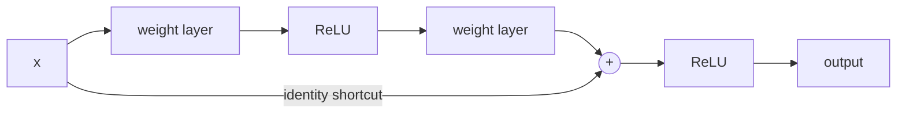

## Abstract

The paper starts from an awkward observation: once normalization has made deep networks converge at all, adding more layers to a plain convolutional stack makes the *training* error go up, not just the test error. The authors reparameterize each small group of layers to learn a correction added to its own input, which is carried forward by a parameter-free identity shortcut. With this change, a 34-layer network beats its 18-layer sibling instead of losing to it, and depth can be pushed to 152 layers on ImageNet and beyond 1000 layers on CIFAR-10 without optimization trouble. An ensemble of these networks reaches 3.57% top-5 error on the ImageNet test set, and swapping VGG-16 for ResNet-101 inside Faster R-CNN lifts COCO detection substantially.

**Keywords:** residual learning, identity shortcut, degradation problem, bottleneck block, very deep CNNs, ImageNet, CIFAR-10

## 1 Introduction

By 2015 the leading ImageNet models had between sixteen and thirty layers, and the natural question was whether one could keep going simply by stacking more. The classical obstacle, vanishing or exploding gradients, had been largely handled by careful initialization and batch normalization (BN), so networks with tens of layers do start converging under SGD.

What shows up next is a different failure, which the authors call the **degradation problem**. As depth grows, accuracy saturates and then falls, and <mark>the drop is visible in training error, so it cannot be blamed on overfitting</mark>. On CIFAR-10 a 56-layer plain network trains to a worse error than a 20-layer one ([Fig. 1 in the paper](https://arxiv.org/pdf/1512.03385#page=1)).

This is strange because of a construction argument. Copy a shallow network and append identity layers: the result is exactly as good, so the best deep solution can be no worse. That SGD fails to find anything that good says the problem is optimization, not capacity.

## 2 Background

Residual representations were already known to help elsewhere: VLAD and Fisher vectors encode residuals with respect to a dictionary, and multigrid methods for PDEs solve for residuals between scales and converge faster for it. The lesson drawn is that a good reformulation can act as a preconditioner.

Shortcut connections were not new either. The concurrent Highway Networks (Srivastava et al.) add gated shortcuts, but those gates are learned, data-dependent and can close, in which case the layer stops being residual. In ResNet the shortcut is a fixed identity that never closes and carries no parameters.

## 3 Method

> **Key idea.** Do not ask a block of layers to produce the desired output $\mathcal{H}(\mathbf{x})$. Ask it to produce only the difference $\mathcal{H}(\mathbf{x})-\mathbf{x}$, and add the input back through a free identity path. If the ideal block is close to "do nothing", the solver only has to push weights toward zero.

### 3.1 Residual reformulation

Let $\mathcal{H}(\mathbf{x})$ be the mapping a few stacked layers should ideally realize, where $\mathbf{x}$ is the input to the first of them. Define the residual function

$$
\mathcal{F}(\mathbf{x}) := \mathcal{H}(\mathbf{x}) - \mathbf{x}, \tag{1}
$$

so the block outputs $\mathcal{F}(\mathbf{x}) + \mathbf{x}$. Both forms can represent the same functions; the hypothesis is only that they are not equally easy to optimize. The identity is unlikely to be literally optimal; the weaker claim is that <mark>the optimal mapping is usually closer to the identity than to zero, so learning a perturbation around identity is a better-conditioned problem</mark>. A later measurement supports it: layer responses in ResNets have smaller standard deviation than in plain nets and shrink as depth increases ([Fig. 7 in the paper](https://arxiv.org/pdf/1512.03385#page=8)).

> **My comment.** I used the same idea one level up in TailFlow. Targets are whitened so that an untrained network already generates a Gaussian copula with $t$ margins and EWMA volatility, and the output is wired so the trivial part of the noise prediction is not learned; the network only learns departures from that reference, and plain ε-prediction without the rewiring failed.

### 3.2 The building block

A block is defined as

$$
\mathbf{y} = \mathcal{F}(\mathbf{x}, \{W_i\}) + \mathbf{x}, \tag{2}
$$

where $\mathbf{x}$ and $\mathbf{y}$ are the block input and output and $\{W_i\}$ are the weights of the layers inside $\mathcal{F}$. For the two-layer case, $\mathcal{F} = W_2\,\sigma(W_1\mathbf{x})$ with $\sigma$ the ReLU (biases omitted); a second ReLU is applied after the addition. A one-layer $\mathcal{F}$ collapses to something like a linear layer and gave no benefit.

When input and output dimensions differ, the shortcut gets a linear projection $W_s$:

$$
\mathbf{y} = \mathcal{F}(\mathbf{x}, \{W_i\}) + W_s\mathbf{x}. \tag{3}
$$

Because Eq. (2) adds no parameters and negligible computation, plain and residual networks can be compared at identical depth, width, parameter count and FLOPs.

### 3.3 Architectures

The plain baseline follows VGG's style: mostly $3\times3$ convolutions, with the filter count doubled whenever resolution is halved by a stride-2 convolution, ending in global average pooling and a 1000-way classifier. The 34-layer version costs 3.6 billion FLOPs, which the paper notes is 18% of VGG-19's 19.6 billion. The residual version inserts a shortcut around every pair of $3\times3$ layers ([Fig. 3 in the paper](https://arxiv.org/pdf/1512.03385#page=4)).

For dimension changes three options are tested: (A) identity with zero-padded channels, no new parameters; (B) projections only where dimensions change; (C) projections everywhere.

For the deeper models the block becomes a three-layer **bottleneck**: $1\times1$ to reduce channels, $3\times3$ on the reduced width, $1\times1$ to restore ([Fig. 5 in the paper](https://arxiv.org/pdf/1512.03385#page=6)). Here the identity shortcut matters for cost, not only optimization: it connects the two high-dimensional ends, so replacing it with a projection would roughly double time complexity and model size. Swapping bottlenecks into the 34-layer layout gives ResNet-50 (3.8 billion FLOPs); more blocks give ResNet-101 and ResNet-152. <mark>At 11.3 billion FLOPs, the 152-layer model is still cheaper than VGG-16 (15.3 billion) or VGG-19 (19.6 billion).</mark>

Training is conventional: BN after every convolution, SGD with batch size 256, learning rate 0.1 divided by 10 at plateaus, no dropout.

## 4 Experiments

### 4.1 ImageNet

Models are trained on the 1.28M ImageNet-2012 training images and evaluated on the 50k validation images. The central comparison uses option A, so the residual nets have exactly the parameters of their plain counterparts (top-1 error, 10-crop):

| | plain | ResNet |
|---|---|---|
| 18 layers | 27.94 | 27.88 |
| 34 layers | 28.54 | **25.03** |

The plain 34-layer net is worse than the plain 18-layer net, with higher training error throughout ([Fig. 4 in the paper](https://arxiv.org/pdf/1512.03385#page=5)). With shortcuts the ordering flips and <mark>the 34-layer ResNet improves top-1 error by about 3.5 points over its plain twin at identical cost</mark>. At 18 layers the two are equally accurate, but the ResNet converges faster. The authors argue vanishing gradients are not the cause, since BN keeps forward and backward signals healthy, and tripling the iterations did not remove the gap. They conjecture very low convergence rates for deep plain nets.

Going deeper (validation error, 10-crop; ResNet-50/101/152 use option B):

| model | top-1 err. | top-5 err. |
|---|---|---|
| VGG-16 | 28.07 | 9.33 |
| GoogLeNet | – | 9.15 |
| PReLU-net | 24.27 | 7.38 |
| plain-34 | 28.54 | 10.02 |
| ResNet-34 A | 25.03 | 7.76 |
| ResNet-34 B | 24.52 | 7.46 |
| ResNet-34 C | 24.19 | 7.40 |
| ResNet-50 | 22.85 | 6.71 |
| ResNet-101 | 21.75 | 6.05 |
| **ResNet-152** | **21.43** | **5.71** |

A, B and C differ only slightly, so projection shortcuts are not what fixes degradation; C is dropped for cost. With multi-scale fully-convolutional testing, a single ResNet-152 reaches 4.49% top-5 validation error, better than every earlier *ensemble* the paper lists. Six models combined give <mark>3.57% top-5 error on the test set, the winning ILSVRC 2015 classification entry</mark>.

### 4.2 CIFAR-10

Thin networks with $6n+2$ layers (filters 16/32/64, identity shortcuts only) are used to study depth in isolation. Plain nets again get worse with depth; ResNets get better: 8.75% error at 20 layers, 6.97% at 56, and 6.43% (mean 6.61 ± 0.16 over five runs) at 110 layers with 1.7M parameters. A 1202-layer network trains without difficulty to below 0.1% training error but tests at 7.93%, worse than the 110-layer one, which the authors attribute to overfitting with 19.4M parameters on a small dataset.

### 4.3 Detection

With Faster R-CNN held fixed, replacing VGG-16 by ResNet-101 raises COCO mAP@[.5,.95] from 21.2 to 27.2, a 28% relative gain, and PASCAL VOC 2007 mAP from 73.2 to 76.4.

## 5 Discussion

**Strengths.** The experimental design is the real argument. Because the shortcut is free, the plain-vs-residual comparison changes one thing only, and the sign flip between 18 and 34 layers is hard to explain any other way. The effect appears on two datasets, transfers to detection, and requires no solver changes.

> **My comment.** This is the experimental design I try to copy: change one thing that costs nothing, so a sign flip has nowhere else to come from. In FinPhasor the comparable move is reading phase and magnitude off the same predicted surface, so when only the phase orders returns, the network, data and protocol are shared and cannot explain the difference.

**Weaknesses.** The paper does not explain *why* deep plain networks degrade. A convergence-rate conjecture is offered and the matter is deferred. The preconditioning story is supported by one indirect statistic (response magnitudes), not by any analysis of the loss surface. The 1202-layer result shows that easy optimization does not guarantee better generalization, and no regularization experiments are run to test the overfitting explanation.

**Not shown.** There is no study of where to place BN and ReLU relative to the addition and no comparison with Highway Networks at matched depth on ImageNet. Headline numbers rely on ensembles and multi-scale testing, so the single-model 10-crop table is the fairer place to read off the architectural effect.

## 6 Takeaways

- The obstacle to depth in 2015 was optimization, visible as rising training error, not overfitting and not (according to the authors' checks) vanishing gradients.
- Parameterizing a block as "input plus learned correction" costs nothing and turns extra depth from a liability into a gain: 28.54 → 25.03 top-1 error at 34 layers with identical parameters.
- Identity shortcuts are sufficient; projections help marginally and are needed only when shapes change. In bottleneck blocks, keeping the shortcut an identity is also what keeps the model cheap.
- Trainability and generalization are separate questions: 1202 layers fit the training set but test worse than 110.
- For diffusion and stochastic time-series models the relevance is indirect: denoising networks are built from residual blocks, and "learn a small correction around a good reference point" is a sensible heuristic when the target is a small increment on a persistent state. This is my reading; the paper makes no claims about sequential or financial data.

## References

1. K. He, X. Zhang, S. Ren, J. Sun. *Deep Residual Learning for Image Recognition.* arXiv:1512.03385, 2015.
2. R. K. Srivastava, K. Greff, J. Schmidhuber. *Highway Networks.* arXiv:1505.00387, 2015.
3. K. Simonyan, A. Zisserman. *Very Deep Convolutional Networks for Large-Scale Image Recognition (VGG).* ICLR 2015.
4. S. Ioffe, C. Szegedy. *Batch Normalization: Accelerating Deep Network Training by Reducing Internal Covariate Shift.* ICML 2015.
5. S. Ren, K. He, R. Girshick, J. Sun. *Faster R-CNN: Towards Real-Time Object Detection with Region Proposal Networks.* NIPS 2015.
