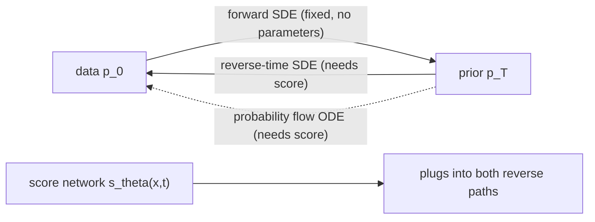

## Abstract

This paper takes the two leading "add noise, then learn to remove it" models — score matching with Langevin dynamics (SMLD) and DDPM — and shows they are finite discretisations of two continuous-time diffusions. In the continuous picture a fixed, parameter-free SDE carries data to a tractable prior, and a classical time-reversal result says the way back is another SDE whose only unknown is the score $\nabla_x\log p_t(x)$ of the noised data. One time-conditioned network estimates that score, after which sampling is numerical SDE solving — improved here by a predictor–corrector scheme that alternates a solver step with score-based MCMC. The same score defines a deterministic ODE with identical marginals, which buys exact likelihoods, invertible latents and adaptive-step sampling, and the score decomposition makes conditional sampling a sampling-time edit. On CIFAR-10 the framework reports FID 2.20 and 2.99 bits/dim.

**Keywords:** score-based models, stochastic differential equations, reverse-time SDE, probability flow ODE, predictor–corrector sampling, exact likelihood

## 1 Introduction

[NCSN](/blog/ncsn/) estimates the score at a ladder of noise scales and samples by running Langevin dynamics down that ladder. [DDPM](/blog/ddpm/) trains a reverse Markov chain against a variational bound whose simplified form turns out to estimate scores too. The two came from different motivations, with different samplers and incompatible noise conventions, so ideas did not transfer between them — and there was no account of what a *better* sampler would look like, since sampler design was constrained by whatever the training derivation happened to produce.

The move is to let the number of noise scales go to infinity. Noising becomes a diffusion process and the toolbox of stochastic calculus opens up: time reversal, the Fokker–Planck equation, off-the-shelf solvers, the instantaneous change-of-variables formula. <mark>Nearly every contribution falls out of that lens rather than being invented to fit it</mark> — a new SDE (sub-VP), a new family of samplers, exact likelihoods and conditional generation all follow from the same two equations.

## 2 Background

Both predecessors minimise a weighted sum of denoising score-matching losses. SMLD uses the kernel $p_\sigma(\tilde x\mid x)=\mathcal N(\tilde x;x,\sigma^2I)$ over scales $\sigma_1<\dots<\sigma_N$ with weights $\sigma_i^2$, sampling with $M$ Langevin steps per scale; DDPM uses $\mathcal N(x_i;\sqrt{\alpha_i}x_0,(1-\alpha_i)I)$ with $\alpha_i=\prod_{j\le i}(1-\beta_j)$, weights $(1-\alpha_i)$, and one Gaussian reverse step per level. The paper's first observation is that both weights are inversely proportional to $\mathbb E\|\nabla\log p(\tilde x\mid x)\|_2^2$ for their own kernel: same form, same target, two notations. (See NCSNv2 for how the SMLD schedule was hand-tuned before this unification.)

## 3 Method

> **Key idea.** Replace the discrete noise ladder by a forward SDE. Its time reversal is an SDE whose data dependence enters only through the score $\nabla_x\log p_t(x)$, so one time-dependent score network is enough to generate — and the same network also defines a deterministic ODE with identical marginals.



### 3.1 Forward process, and the one theorem that does the work

Data $x(0)\sim p_0$ are diffused over $t\in[0,T]$ by an Itô SDE

$$
dx=f(x,t)\,dt+g(t)\,dw,
\tag{1}
$$

with drift $f$, scalar diffusion coefficient $g$, and Wiener process $w$. Nothing here is learned; the process is designed so that $p_T$ is a tractable prior. Anderson's 1982 theorem gives the reverse process:

$$
dx=\big[f(x,t)-g(t)^2\,\nabla_x\log p_t(x)\big]dt+g(t)\,d\bar w,
\tag{2}
$$

with $\bar w$ a Wiener process in reversed time and $dt$ a negative increment. The drift gains one term, $-g^2\nabla_x\log p_t$, pushing mass back up the density gradient at a rate set by how much noise is being injected. <mark>Everything data-dependent in the generative process is concentrated in the score of the marginals</mark> — that single fact makes the rest possible. Appendix A gives the same statement for a matrix-valued, state-dependent $G(x,t)$, where the drift picks up an extra $\nabla\!\cdot[GG^\top]$.

### 3.2 Training

The score network $s_\theta(x,t)$ is fit by continuous-time denoising score matching:

$$
\theta^*=\arg\min_\theta\;\mathbb E_{t}\Big\{\lambda(t)\,
\mathbb E_{x(0)}\mathbb E_{x(t)\mid x(0)}
\big[\|s_\theta(x(t),t)-\nabla_{x(t)}\log p_{0t}(x(t)\mid x(0))\|_2^2\big]\Big\},
\tag{3}
$$

with $t\sim\mathcal U[0,T]$, $\lambda(t)>0$ a weighting, and $p_{0t}$ the transition kernel. The target is the score of the *kernel*, available in closed form, not of the intractable marginal — the standard denoising-score-matching substitution, exact in expectation. The recommended $\lambda\propto 1/\mathbb E\|\nabla\log p_{0t}\|_2^2$ reproduces both predecessors' weights. When $f$ is affine, $p_{0t}$ is Gaussian in closed form and a training step costs what it costs in the discrete case; when it is not, one can simulate the SDE and swap in sliced score matching (Appendix A), which never needs the kernel score.

### 3.3 VE, VP and sub-VP

Take $N\to\infty$ in each predecessor's chain. SMLD's update $x_i=x_{i-1}+\sqrt{\sigma_i^2-\sigma_{i-1}^2}\,z_{i-1}$ becomes, with $\Delta t=1/N$, an increment of variance $\tfrac{d[\sigma^2]}{dt}\Delta t$; DDPM's $x_i=\sqrt{1-\beta_i}x_{i-1}+\sqrt{\beta_i}z_{i-1}$ becomes $x-\tfrac12\beta\Delta t\,x+\sqrt{\beta\Delta t}\,z$ after a first-order expansion of the square root, with $\beta(t)$ the limit of the rescaled $N\beta_i$. So

$$
\text{VE: } dx=\sqrt{\tfrac{d[\sigma^2(t)]}{dt}}\,dw,
\qquad
\text{VP: } dx=-\tfrac12\beta(t)\,x\,dt+\sqrt{\beta(t)}\,dw.
\tag{4}
$$

VE has no drift and unbounded variance; VP is an Ornstein–Uhlenbeck process with time-varying rate, and solving $d\Sigma/dt=\beta(I-\Sigma)$ gives $\Sigma_{\text{VP}}(t)=I+e^{-\int_0^t\beta}(\Sigma_{\text{VP}}(0)-I)$, constant at $I$ if it starts there. A third SDE keeps the VP drift and shrinks the diffusion coefficient to $\sqrt{\beta(t)(1-e^{-2\int_0^t\beta})}$; its variance $I+e^{-2\int\beta}I+e^{-\int\beta}(\Sigma(0)-2I)$ is bounded above by VP's at every $t$ while sharing the same limit, so it still reaches the standard Gaussian. <mark>Sub-VP is the only genuinely new modelling object here, and it exists because the continuous view made "same drift, less noise" a well-posed thing to write down.</mark>

Affine drift means Gaussian kernels for all three: $\mathcal N(x(0),[\sigma^2(t)-\sigma^2(0)]I)$ for VE, $\mathcal N(x(0)e^{-\frac12\int\beta},\,I-Ie^{-\int\beta})$ for VP, and the same mean with variance $[1-e^{-\int\beta}]^2I$ for sub-VP — that squared factor is the entire difference.

### 3.4 Predictor–corrector sampling

Any SDE solver integrates Eq. (2), and DDPM's ancestral sampler turns out to be one particular discretisation of the reverse VP SDE — Appendix E expands $1/\sqrt{1-\beta}=1+\tfrac12\beta+o(\beta)$ to show it agrees with a cleaner scheme up to $o(\beta)$. Since deriving an ancestral rule for a *new* SDE is fiddly, the authors propose **reverse diffusion** samplers: discretise the reverse SDE with the same functional form used for the forward one, which makes the rule mechanical.

The genuinely new idea is that a score model gives more than a vector field — it allows MCMC targeting $p_t$ directly. So alternate a **predictor** (a solver step, advancing time) with a **corrector** (Langevin steps at fixed $t$, pulling the sample's law toward $p_t$). SMLD is "identity predictor + Langevin corrector"; DDPM is "ancestral predictor + identity corrector". The Langevin step size is set adaptively from a signal-to-noise ratio $r$: $\epsilon=2\alpha_i(r\|z\|_2/\|s_\theta\|_2)^2$, with $\alpha_i=1$ for VE. One detail is easy to miss and matters a lot: <mark>every experiment ends with a single denoising step via Tweedie's formula</mark>, and the paper attributes part of NCSN's historically worse FID to the absence of exactly this step.

### 3.5 Probability flow ODE

For every diffusion there is a deterministic process with the same marginals $\{p_t\}$:

$$
dx=\Big[f(x,t)-\tfrac12\,g(t)^2\,\nabla_x\log p_t(x)\Big]dt.
\tag{5}
$$

The derivation (Appendix D.1) rewrites the Fokker–Planck equation: the second-order term $\tfrac12\partial^2_{ij}[GG^\top p_t]$ becomes first-order by factoring out $p_t$ and using $\partial_j p_t=p_t\,\partial_j\log p_t$, leaving a continuity equation with zero diffusion. Same $\partial_t p_t$, no noise — identical marginals, different trajectories. Halving the score coefficient relative to Eq. (2) is precisely the price of dropping $g\,d\bar w$.

With $s_\theta$ in place of the score this is a [neural ODE](/blog/neural-ode/), with three consequences. <mark>Exact log-likelihoods</mark> via $\log p_0(x(0))=\log p_T(x(T))+\int_0^T\nabla\!\cdot\tilde f_\theta\,dt$, the divergence estimated by the Skilling–Hutchinson trace estimator (one vector-Jacobian product per evaluation, unbiased, so averaging drives the error down). An invertible encoding $x(0)\leftrightarrow x(T)$ supporting interpolation and temperature scaling. And black-box adaptive solvers that trade accuracy for evaluations explicitly. Since the forward SDE has no learnable parts, a perfect score makes the encoding a function of the data distribution alone — *uniquely identifiable*, unlike a normalizing flow whose latent space depends on its architecture.

### 3.6 Controllable generation

To sample from $p_0(x(0)\mid y)$, add the gradient of a time-dependent likelihood to the score:

$$
dx=\big\{f(x,t)-g(t)^2\big[\nabla_x\log p_t(x)+\nabla_x\log p_t(y\mid x)\big]\big\}dt+g(t)\,d\bar w.
\tag{6}
$$

This is Eq. (2) applied to the conditional density, with $p_t(x\mid y)\propto p_t(x)p(y\mid x)$ splitting the score in two. For class labels the second term is a classifier trained on noised inputs. For inpainting (Appendix I.2) the reverse SDE runs only on the unknown coordinates while the known ones are resampled at each step from their own forward kernel; the approximation is $p_t(z(t)\mid\Omega(x(0))=y)\approx p_t(z(t)\mid\hat\Omega(x(t)))$ — conditioning on a noised observation instead of a clean one. Colourisation is imputation after an orthogonal change of colour basis, orthogonality mattering because it keeps a Wiener process a Wiener process. <mark>The unconditional score network is reused unchanged in all three cases.</mark>

### 3.7 Intuition: the case you can solve by hand

Take 1-D data $p_0=\mathcal N(0,s^2)$ under a VP SDE with constant $\beta$. Then $p_t=\mathcal N(0,\Sigma(t))$ with $\Sigma(t)=1+e^{-\beta t}(s^2-1)$, and the score is linear: $\nabla_x\log p_t(x)=-x/\Sigma(t)$. Three things become visible.

*The ODE is a rescaling.* Eq. (5) becomes $dx=-\tfrac12\beta x(1-1/\Sigma)dt$, whose solution maps $x(T)$ to $x(0)=x(T)\,s/\sqrt{\Sigma(T)}$. The "uniquely identifiable encoding" is here literally a scalar multiple fixed by $s$, with no architecture in it anywhere — §3.5's claim in miniature.

*The reverse SDE reaches the same law by a different path.* Its drift is $-\tfrac12\beta x+\beta x/\Sigma$ and it keeps injecting noise; marginals agree with the ODE's at every $t$, trajectories do not, which is why the two samplers behave differently under error even though the theory calls them equivalent.

*The corrector is not free.* A Langevin step at fixed $t$ is $x\leftarrow(1-\epsilon/\Sigma)x+\sqrt{2\epsilon}\,z$, with stationary variance $\Sigma/(1-\epsilon/2\Sigma)\approx\Sigma(1+\epsilon/2\Sigma)$: it removes the predictor's bias and adds $O(\epsilon)$ over-dispersion of its own. That tension is what $r$ arbitrates, and why $r$ is tuned per sampler and per SDE — the reported optima span $0.16$–$0.22$ for VE and $0.01$–$0.27$ for VP.

### 3.8 Algorithm

```
# Training
repeat:
    x0 ~ data;  t ~ Uniform[eps, T];  z ~ N(0, I)
    mean, std = kernel_p0t(x0, t)          # closed form for VE / VP / sub-VP
    xt = mean + std * z
    # target score of the kernel is -z/std
    loss = lambda(t) * || s_theta(xt, t) + z / std ||^2
    take a gradient step on loss

# PC sampling: N predictor steps, M corrector steps each
x = sample from prior p_T
for i = N-1 down to 0:
    x = predictor(x, t[i+1] -> t[i])       # reverse diffusion, ancestral, or Euler-Maruyama
    repeat M times:                        # corrector: Langevin at fixed t[i]
        g = s_theta(x, t[i]);  z ~ N(0, I)
        step = 2 * alpha[i] * (r * norm(z) / norm(g))^2
        x = x + step * g + sqrt(2 * step) * z
x = denoise_once(x)                        # Tweedie; omitting this badly hurts FID
return x

# Likelihood (probability flow ODE)
solve dx/dt = f(x,t) - 0.5 * g(t)^2 * s_theta(x,t) from 0 to T with RK45,
carrying along  d(logp)/dt = -div(drift),  div estimated as  eps^T (J drift) eps.
log p0(x) = log pT(x(T)) + integral term
```

## 4 Implementation notes

| Item | As reported |
|---|---|
| VE instantiation | $\sigma(t)=\sigma_{\min}(\sigma_{\max}/\sigma_{\min})^t$, $\sigma_{\min}=0.01$, $\sigma_{\max}$ per NCSNv2's Technique 1 |
| VP / sub-VP instantiation | $\beta(t)=\bar\beta_{\min}+t(\bar\beta_{\max}-\bar\beta_{\min})$ with $\bar\beta_{\min}=0.1$, $\bar\beta_{\max}=20$ |
| Time truncation $\epsilon$ | $t\in[\epsilon,1]$ throughout; $10^{-5}$ for VE, $10^{-3}$ for VP sampling, $10^{-5}$ for training and likelihoods |
| Discrete-model training | 1000 noise scales, original SMLD/DDPM objectives, DDPM architecture |
| Architecture search | 1.3M iterations, checkpoint every 50k, batch 128 (CIFAR-10) / 64 (LSUN); VE compared by mean FID after 0.5M iterations, VP between 0.25M and 0.5M |
| NCSN++ (VE) | FIR up/downsampling, skip connections rescaled by $1/\sqrt2$, BigGAN residual blocks, 4 blocks per resolution, "residual" progressive input, no progressive output |
| DDPM++ (VP) | same minus FIR and minus progressive growing; NCSN++ itself ranked 4th of 144 VP configurations |
| Continuous training | random Fourier feature time embedding (scale 16) replaces positional embedding; 0.95M iterations to limit overfitting; "deep" variants double the blocks per resolution |
| EMA rate | 0.999 for VE, 0.9999 for VP |
| Predictor for continuous models | Euler–Maruyama, because the DDPM discretisation mismatches the continuous variance as $t\to0$ |
| Corrector $r$ | grid-searched in steps of 0.01 on CIFAR-10 (Table 5); fixed at 0.075 on LSUN, 0.15 on CelebA-HQ |
| Likelihood protocol | RK45, `atol = rtol = 1e-5`, uniformly dequantised data, averaged over five runs, last checkpoint |
| FID protocol | 50k samples, `tensorflow_gan`; Table 3 uses the best-FID checkpoint, Table 2 the last one |
| Optimiser, LR, warm-up, clipping | **not stated** — "we follow Ho et al." |
| CelebA-HQ $1024^2$ | batch 8, EMA 0.9999, ~2.4M iterations, PC with 2000 steps, $r=0.15$; exact architecture deferred to the code release |

Easy to get wrong. (i) SMLD's $\sigma(t)$ is discontinuous at $t=0$ by construction ($\sigma(0)=0$ but $\sigma(0^+)=\sigma_{\min}$), which is *why* the $\epsilon$ truncation exists — not a numerical afterthought. (ii) The final Tweedie step is not optional when FID is being compared. (iii) Running P2000 from a model trained on 1000 scales requires interpolating the time conditioning, and the two ad-hoc schemes tried give materially different numbers (below). (iv) Tables 2 and 3 use different checkpoints and samplers, so their FIDs are not comparable row-to-row.

## 5 Experiments

**Samplers (Table 1, CIFAR-10, FID, mean ± sd over five sampling runs).** Shaded cells in the paper mark equal compute: P2000 and PC1000 both cost 2000 score evaluations.

| Predictor | VE P1000 | VE P2000 | VE PC1000 | VP P1000 | VP P2000 | VP PC1000 |
|---|---|---|---|---|---|---|
| ancestral | 4.98 ± .06 | 4.88 ± .06 | 3.62 ± .03 | 3.24 ± .02 | 3.24 ± .02 | 3.21 ± .02 |
| reverse diffusion | 4.79 ± .07 | 4.74 ± .08 | 3.60 ± .02 | 3.21 ± .02 | 3.19 ± .02 | 3.18 ± .01 |
| probability flow | 15.41 ± .15 | 10.54 ± .08 | **3.51 ± .04** | 3.59 ± .04 | 3.23 ± .03 | **3.06 ± .03** |

The corrector-only column (C2000) is shared by all three rows, since it uses no predictor: 20.43 ± .07 on VE and 19.06 ± .06 on VP.

**Ablation on the interpolation scheme (Table 4).** Identical except that P2000 uses rounding rather than linear interpolation between noise scales:

| Predictor | VE P2000 | VP P2000 | (VP PC1000 for comparison) |
|---|---|---|---|
| ancestral | 4.92 ± .02 | **3.11 ± .03** | 3.21 ± .02 |
| reverse diffusion | 4.72 ± .07 | **3.10 ± .03** | 3.18 ± .01 |
| probability flow | 12.87 ± .09 | 3.25 ± .04 | 3.06 ± .03 |

**Main CIFAR-10 results**, merging Table 2 (NLL and ODE-sampled FID, last checkpoint) with Table 3 (FID/IS, best checkpoint, PC sampling):

| Model | NLL (bits/dim) ↓ | FID (ODE) ↓ | FID (PC) ↓ | IS ↑ |
|---|---|---|---|---|
| DDPM ($L_\text{simple}$, Ho et al.) | ≤ 3.75 | — | 3.17 | 9.46 |
| DDPM, exact likelihood via ODE | 3.28 | 3.37 | — | — |
| DDPM cont. (VP) | 3.21 | 3.69 | — | — |
| DDPM cont. (sub-VP) | 3.05 | 3.56 | — | — |
| DDPM++ cont. (VP) | 3.16 | 3.93 | 2.55 | 9.58 |
| DDPM++ cont. (sub-VP) | 3.02 | 3.16 | 2.61 | 9.56 |
| DDPM++ cont. (deep, VP) | 3.13 | 3.08 | 2.41 | 9.68 |
| **DDPM++ cont. (deep, sub-VP)** | **2.99** | 2.92 | 2.41 | 9.57 |
| NCSN++ cont. (VE) | — | — | 2.38 | 9.83 |
| **NCSN++ cont. (deep, VE)** | — | — | **2.20** | **9.89** |

### Claim by claim

*"The two model families are the same method."* Supported analytically by the $N\to\infty$ derivations and checked numerically in [Fig. 5](https://arxiv.org/pdf/2011.13456#page=16), where the discrete perturbation kernels at $N=1000$ overlay the continuous ones. The paper's strongest and best-evidenced claim.

*"Correctors beat more predictor steps at equal compute."* <mark>Decisively true for VE (3.60 vs 4.74, reverse diffusion) but not for VP: under Table 4's rounding interpolation, P2000 reaches 3.10–3.11 and beats PC1000's 3.18–3.21</mark>, reversing Table 1. Since P2000 needs an ad-hoc interpolation this architecture happens to permit, the honest reading is that PC wins robustly where the predictor is weak and is a wash where it is already good. The corrector-only column (≈20 FID) does establish that a corrector cannot replace a predictor.

*"Sub-VP improves likelihood."* Consistent across all three matched pairs (3.21→3.05, 3.16→3.02, 3.13→2.99), a real ablation rather than one number, with ODE-sampled FID moving the same way. But see the $\epsilon$ caveat below.

*"VE gives the best samples, sub-VP the best likelihood."* <mark>Supported, and neither dominates — 2.20 FID for VE with no reported likelihood, 2.99 bits/dim for sub-VP at 2.41 FID.</mark>

*"Record-breaking CIFAR-10."* The 2.20/9.89 headline beats unconditional StyleGAN2-ADA (2.92) and the class-conditional version (2.42) as tabulated, but bundles architecture search, doubled depth, continuous training and best-checkpoint selection. The cleanest decomposition available is 2.45 (NCSN++, discrete) → 2.38 (continuous) → 2.20 (deep): <mark>the continuous objective is worth about 0.07 FID and the depth doubling about 0.18.</mark>

*"90% fewer evaluations at no visible cost."* [Fig. 3](https://arxiv.org/pdf/2011.13456#page=8) reports NFE of 548, 86 and 14 at tolerances $10^{-5}$, $10^{-3}$, $10^{-1}$. "No visible loss" is a visual judgement — no FID per tolerance — and Appendix D.4 concedes ODE samples are worse than SDE samples without a corrector, badly so for VE at high resolution.

*"The encoding is uniquely identifiable."* Two VE models differing only in depth (4 vs 8 blocks per resolution), 16 CIFAR-10 images, dimension-wise correlation $r=0.96$ ([Fig. 8](https://arxiv.org/pdf/2011.13456#page=21)). Suggestive, but thin for a claim about identifiability in general.

*"Conditioning without retraining."* Qualitative only ([Fig. 4](https://arxiv.org/pdf/2011.13456#page=9)): class conditioning on CIFAR-10, inpainting and colourisation on LSUN. No metric, no comparison against a purpose-trained conditional model, and the imputation approximation's error is never measured.

## 6 Limitations

**Stated by the authors.**
- Sampling is still slower than GANs; closing that gap is named as an open direction.
- The breadth of samplers introduces many hyperparameters; the paper asks for automatic selection and a fuller study of samplers' merits and limits.
- ODE samplers give worse FID than SDE samplers without a corrector, much worse for VE at high resolution (Appendix D.4).
- CelebA-HQ $1024^2$ samples have visible flaws, notably in facial symmetry.
- Unique identifiability holds only given sufficient data, capacity and optimisation.

**My reading.**
- <mark>The record likelihood is reported at a truncation $\epsilon=10^{-5}$, and the paper states that smaller $\epsilon$ generally gives better likelihoods for all SDEs</mark> — so 2.99 bits/dim is attached to a hyperparameter the baselines do not have, with no sensitivity curve given.
- Tables 2 and 3 use different checkpoints (last vs best FID) and different samplers. The first two rows of Table 2 sit under a "FID (ODE)" heading but carry Ho et al.'s ancestral numbers — 3.17 reappears in Table 3 as exactly that.
- No analysis of how score-estimation error propagates through the reverse SDE versus the ODE, which is precisely the question the SDE/ODE choice raises.
- Everything is images, although nothing in the framework is image-specific.
- The matrix-valued, state-dependent diffusion coefficient of Appendix A is never exercised, nor is any corrector other than Langevin.
- $\lambda(t)$ is inherited by heuristic from the discrete methods. It is the only remaining design freedom in the objective, and it goes unexamined.

## 7 Extensions

**What was built on this.** The probability flow ODE is the hinge on which most of the rest of this series turns. DDIM, concurrent, derives the same deterministic sampler variationally and shows its ODE matches the VE probability flow. EDM treats the framework as a design space, re-deriving schedule, preconditioning and solver jointly and retiring much of the VE/VP/sub-VP taxonomy. ADM's classifier guidance is Eq. (6) with a tuned scale, which Classifier-Free Guidance later replaces with a training-time trick. [Consistency Models](/blog/consistency-models/) learn this ODE's solution map directly; [Flow Matching](/blog/flow-matching/), Rectified Flow and Stochastic Interpolants keep the ODE and drop the diffusion derivation; DSB replaces the fixed forward SDE with an optimal one. [CSDI](/blog/csdi/) descends directly from §3.6's imputation argument.

**Open problems.**
- What makes one SDE better than another for a given data distribution? The paper shows the choice matters and offers no criterion.
- Reverse SDE or probability flow ODE under an imperfect score? The marginals coincide only at the optimum, and the gap is untouched here.
- How should $\lambda(t)$ and the corrector SNR be set without a grid search?
- Appendix I's imputation and inverse-problem approximations rest on a limiting argument ("for small $t$, $y(t)\approx y$") with no error bound.

**Research directions.**

*These are ideas, not results — none has been run.*

1. **An SDE whose drift is the market's own.** *Hypothesis:* for financial paths, replacing VP's constant-shrinkage drift with a calibrated mean-reverting one gives better likelihood at equal capacity, since the forward process then destroys structure the network would otherwise have to learn to restore; the drift need only stay affine to keep $p_{0t}$ Gaussian. *Data:* daily returns and realised variance for a liquid index. *Baseline:* VP and sub-VP with the paper's $\beta$ schedule. *Metric:* exact NLL on held-out windows via §3.5, plus moment and autocorrelation errors of generated paths. *Failure mode:* a calibrated drift makes $p_T$ data-dependent, breaking the fixed-prior assumption and the identifiability argument with it; annealing to the generic drift near $T$ may cancel the benefit.

2. **Conditional reverse SDE as a scenario engine, measured on tails.** *Hypothesis:* Eq. (6) conditioned on observed history generates plausible continuations, but §3.6's imputation approximation biases the conditional *variance*, most visibly in the tails. *Data:* multivariate equity returns with an artificially masked window, so the truth is known. *Baseline:* a model trained explicitly on the conditional task, and a conditional-score approach in the style of [CSDI](/blog/csdi/). *Metric:* coverage of conditional prediction intervals at 1% and 5%, plus CRPS for calibration in the body. *Failure mode:* score-estimation error at small $t$ dwarfs the approximation error, so the study measures the model rather than the method.

3. **Does the corrector still help once the score is poor?** *Hypothesis:* the corrector's value scales with predictor discretisation error and inversely with score error — §3.7 shows it injects $O(\epsilon)$ over-dispersion of its own, and a biased score points the MCMC at the wrong stationary law — so there should be a dataset size past which correctors hurt. *Data:* CIFAR-10 subsampled to 1%, 10%, 100%, architecture fixed. *Baseline:* the same checkpoints with $M=0$. *Metric:* FID and exact NLL against training-set size, $r$ re-tuned at each size. *Failure mode:* FID on small training sets is dominated by memorisation, hiding the crossover without a separate novelty measure.

## 8 Takeaways

- SMLD and DDPM are the VE and VP SDEs discretised. The score of the noised marginals is the single learned object; schedule, sampler and conditioning all become choices made after training.
- The reverse-time SDE and the probability flow ODE share marginals but not trajectories: the first gives the best samples (with correctors), the second likelihoods, identifiable latents and adaptive solvers.
- Predictor–corrector sampling is a clear win where the predictor is weak (VE) and a wash where it is already strong (VP) — Table 4 reverses the headline ordering, and the corrector's own $O(\epsilon)$ bias is why $r$ needs tuning.
- Conditioning attaches at sampling time through $\nabla_x\log p_t(y\mid x)$, with no retraining: one equation, ancestor of both classifier guidance and diffusion-based imputation.
- The record numbers are real but confounded — architecture search, depth, continuous training and checkpoint selection are bundled — and the likelihood record rides on a truncation $\epsilon$ whose effect is acknowledged but never plotted.
- For financial time series this is the series' most natural entry point: the forward processes are objects continuous-time finance already uses (VP is OU-type mean reversion, VE a driftless diffusion), the conditional reverse SDE is exactly what imputing missing observations or continuing an observed history needs, and exact likelihoods would give a density-based plausibility score for generated scenarios. None of it is tested here — the paper is image-only.

## References

1. Song, Y., Sohl-Dickstein, J., Kingma, D. P., Kumar, A., Ermon, S., Poole, B. *Score-Based Generative Modeling through Stochastic Differential Equations.* ICLR 2021. arXiv:2011.13456.
2. Song, Y., Ermon, S. *Generative Modeling by Estimating Gradients of the Data Distribution.* NeurIPS 2019. arXiv:1907.05600.
3. Ho, J., Jain, A., Abbeel, P. *Denoising Diffusion Probabilistic Models.* NeurIPS 2020. arXiv:2006.11239.
4. Anderson, B. D. O. *Reverse-time diffusion equation models.* Stochastic Processes and their Applications 12(3), 1982.
5. Chen, R. T. Q., Rubanova, Y., Bettencourt, J., Duvenaud, D. *Neural Ordinary Differential Equations.* NeurIPS 2018. arXiv:1806.07366.
6. Song, J., Meng, C., Ermon, S. *Denoising Diffusion Implicit Models.* ICLR 2021. arXiv:2010.02502.
7. Efron, B. *Tweedie's formula and selection bias.* JASA 106(496), 2011. (The final denoising step.)
