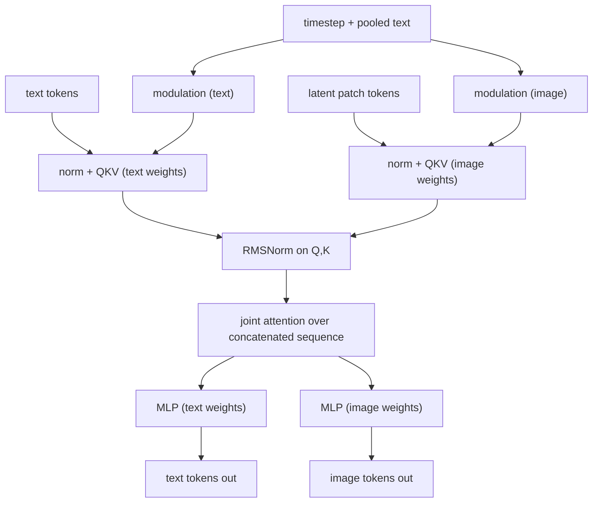

## Abstract

This is the paper behind Stable Diffusion 3, and it makes three moves. First, a controlled comparison of 61 diffusion and flow training formulations, which finds that the straight-line rectified-flow path wins only once the distribution over training timesteps is changed to emphasise the middle — and that this change is formally a reweighting of the same loss over log-SNR. Second, MM-DiT, a transformer in which text and image tokens keep separate weights but share one attention operation. Third, scaling that combination to 8B parameters, where validation loss falls smoothly and tracks benchmark and human-preference scores. The engineering that arrives along the way — 16-channel autoencoder, synthetic captions, QK-normalization, resolution-dependent timestep shift — carries as much of the final quality as the headline ideas.

**Keywords:** rectified flow, conditional flow matching, logit-normal timestep sampling, log-SNR weighting, MM-DiT, QK-normalization, timestep shifting, scaling

## 1 Introduction

Every diffusion-style model commits to a forward path from data to noise, and that commitment leaks into sampling. A path that fails to destroy the signal at its end creates a train–test mismatch — the "gray samples" failure mode. A curved path needs many solver steps. [Rectified flow](/blog/rectified-flow/) picks the simplest option, a straight line between a data point and a Gaussian sample, in principle cheap to integrate and less prone to accumulated error.

The authors' starting observation is that rectified flow had nonetheless not displaced $\epsilon$-prediction in practice. The evidence for it came from class-conditional experiments at small or medium scale — [SiT](/blog/sit/) is cited as the prime example — and nobody had shown it survives large text-to-image training. <mark>In their own study, rectified flow with uniform timestep sampling ranks *below* the LDM $\epsilon$/linear baseline</mark>; only the reweighted variants beat it. The paper's real claim is therefore not "straight paths are better" but "straight paths plus the right weighting over noise levels are better" — a claim about loss weighting, not geometry. On the architecture side they argue that feeding a frozen text embedding into an image network through cross-attention is a one-way street: the text representation never adapts to what the image branch is doing.

## 2 Background

All formulations go into one template. A forward process

$$
z_t = a_t x_0 + b_t \epsilon, \qquad \epsilon\sim\mathcal N(0,I),
\tag{1}
$$

with $a_0=1,b_0=0,a_1=0,b_1=1$ defines a probability path, and a network $v_\Theta$ is trained by conditional flow matching. The two facts this rests on — that the marginal field $u_t(z)=\mathbb E_\epsilon[u_t(z|\epsilon)p_t(z|\epsilon)/p_t(z)]$ generates $p_t$, and that regressing the *conditional* field has the same minimiser as regressing the marginal one — are the standard [flow-matching](/blog/flow-matching/) results, reproved in the appendix. Everything specific to this paper begins one step later, at what weight to put on each $t$. The rest is inherited: [latent diffusion](/blog/latent-diffusion/) for the autoencoder, [DiT](/blog/dit/) for the backbone, [CFG](/blog/classifier-free-guidance/) for conditioning strength, [EDM](/blog/edm/) and the cosine schedule of [Improved DDPM](/blog/improved-ddpm/) as the formulations to beat.

## 3 Method

> **Key idea.** Keep the straight path, but stop training on timesteps uniformly. The two endpoints are degenerate — at each one, half of the regression target is already known — so the learnable content sits in the middle. Sampling $t$ from a logit-normal is exactly a reweighting of the loss over log-SNR, which puts rectified flow and every diffusion objective on one axis.

### 3.1 Every objective is a weight over log-SNR

Inverting (1) as $\psi_t^{-1}(z|\epsilon)=(z-b_t\epsilon)/a_t$ and differentiating gives the conditional velocity in closed form,

$$
u_t(z\mid\epsilon) \;=\; \frac{a'_t}{a_t}\,z \;-\; b_t\Big(\frac{a'_t}{a_t}-\frac{b'_t}{b_t}\Big)\epsilon
\;=\; \frac{a'_t}{a_t}\,z \;-\; \frac{b_t}{2}\,\lambda'_t\,\epsilon,
\tag{2}
$$

where $\lambda_t = \log(a_t^2/b_t^2)$ is the log signal-to-noise ratio and $\lambda'_t = 2(a'_t/a_t - b'_t/b_t)$ its time derivative. Both steps are exact. Now define $\epsilon_\Theta := -\tfrac{2}{\lambda'_t b_t}\big(v_\Theta - \tfrac{a'_t}{a_t}z\big)$ — an affine relabelling of the network output, not an approximation — and the flow-matching loss collapses to a noise-prediction loss:

$$
\mathcal L_{\mathrm{CFM}} = \mathbb E\,\Big\|\tfrac{b_t}{2}\lambda'_t\Big\|^2\big\|\epsilon_\Theta(z_t,t)-\epsilon\big\|_2^2 .
\tag{3}
$$

Since a time-dependent weight cannot move the optimum, every method in the paper is one instance of

$$
\mathcal L_w(x_0) = -\tfrac12\, \mathbb E_{t\sim\mathcal U(0,1),\,\epsilon}\Big[\, w_t\, \lambda'_t\, \big\|\epsilon_\Theta(z_t,t)-\epsilon\big\|^2 \Big],
\tag{4}
$$

with $\mathcal L_{\mathrm{CFM}}$ recovered at $w_t = -\tfrac12\lambda'_t b_t^2$. The minus sign is not a typo and the paper does not explain it: $\lambda'_t<0$ because SNR falls as $t\to1$, so $-\tfrac12 w_t\lambda'_t>0$ for positive $w_t$. For rectified flow, $a_t=1-t$, $b_t=t$, so $\lambda_t = 2\log\frac{1-t}{t}$, $\lambda'_t = -\frac{2}{t(1-t)}$, and

$$
w^{\mathrm{RF}}_t = -\tfrac12 \lambda'_t b_t^2 = \frac{t}{1-t}.
\tag{5}
$$

<mark>So "rectified flow versus $\epsilon$/linear versus EDM versus cosine" is one question — which weight over log-SNR — and not four different algorithms.</mark> EDM's weight is $\mathcal N(\lambda_t\mid -2P_m,(2P_s)^2)(e^{-\lambda_t}+0.5^2)$; the cosine schedule with $\epsilon$-loss gives $\operatorname{sech}(\lambda_t/2)$, and with $v$-loss $e^{-\lambda_t/2}$.

### 3.2 Timestep density *is* the weight

The last lever is the sampling density of $t$ itself. Because $\mathbb E_{t\sim\pi}[f(t)] = \mathbb E_{t\sim\mathcal U}[\pi(t)f(t)]$, training rectified flow with $t\sim\pi$ is *identical* to training it uniformly under the weight

$$
w^{\pi}_t = \frac{t}{1-t}\,\pi(t).
\tag{6}
$$

This is an exact identity, which is why the contribution is cheap: it is one line of sampling code, not a new objective. Three families are tested.

**Logit-normal.** Draw $u\sim\mathcal N(m,s^2)$, set $t=\operatorname{sigmoid}(u)$; the Jacobian $du/dt = 1/(t(1-t))$ gives

$$
\pi_{\ln}(t;m,s) = \frac{1}{s\sqrt{2\pi}}\cdot\frac{1}{t(1-t)}\exp\!\Big(-\frac{(\operatorname{logit}(t)-m)^2}{2s^2}\Big).
\tag{7}
$$

The location $m$ biases towards data ($m<0$) or noise ($m>0$); the scale $s$ sets the width; the density vanishes at both endpoints. On the straight path $\lambda_t = -2\operatorname{logit}(t)$, so this is nothing but a normal law *over log-SNR*: <mark>$t\sim\pi_{\ln}(m,s)$ is exactly $\lambda\sim\mathcal N(-2m,(2s)^2)$, which is the same family the paper writes down for EDM, $\lambda\sim\mathcal N(-2P_m,(2P_s)^2)$</mark>. The two differ only in the weight multiplying it. The winning setting $(m{=}0,s{=}1)$ centres the training mass at $\lambda=0$ — unit SNR — with log-SNR standard deviation 2; EDM's default $(-1.2,1.2)$ centres at $\lambda=2.4$ with standard deviation 2.4.

**Mode sampling with heavy tails.** A monotone map $f_{\text{mode}}(u;s)=1-u-s(\cos^2(\tfrac{\pi}{2}u)-1+u)$ of a uniform variable, monotone for $-1\le s\le \tfrac{2}{\pi-2}$, gives a density that stays strictly positive on $[0,1]$ — included to test whether vanishing endpoint density hurts. $s>0$ favours the midpoint, $s<0$ the ends, $s=0$ is uniform.

**CosMap.** $t = 1 - 1/(\tan(\tfrac{\pi}{2}u)+1)$, chosen so the log-SNR distribution of the straight path matches the cosine schedule's.

### 3.3 Intuition: the middle really is harder

The paper motivates (6) in one loose sentence: at $t=0$ the optimal prediction is the mean of $p_1$, at $t=1$ the mean of $p_0$. It is worth doing properly. Take 1-D data $x_0\sim\mathcal N(0,s^2)$, noise $\epsilon\sim\mathcal N(0,1)$, and the rectified-flow target $d = \epsilon - x_0$ (the conditional velocity for $a_t=1-t$, $b_t=t$). The irreducible loss at time $t$ is $\operatorname{Var}(d\mid z_t)$, and everything is jointly Gaussian:

$$
\operatorname{Var}(d\mid z_t) = (1+s^2) - \frac{\big(t-(1-t)s^2\big)^2}{(1-t)^2s^2+t^2}.
\tag{8}
$$

At $t=0$ this is $1$ (you see $x_0$ exactly; only $\epsilon$ is unknown) and at $t=1$ it is $s^2$. For $s=1$ the curve is symmetric, $1.6$ at $t=\tfrac14$ and $2$ at $t=\tfrac12$. <mark>The irreducible difficulty at the midpoint is exactly twice that at either endpoint, and it peaks precisely where $z_t$ carries no information about the target at all</mark> ($\operatorname{Cov}(d,z_{1/2})=0$ when $s=1$). Uniform $t$ spends half its budget on a region where at most half the target is unknown. Logit-normal$(0,1)$ puts its mass on the bump. The argument is exact only for Gaussian data, but the degeneracy at the endpoints is structural and does not depend on the data law.

### 3.4 MM-DiT

The backbone extends DiT. Pooled text embeddings and the timestep drive the adaptive layer-norm modulation, as in DiT. Token-level text features are projected to the model width and concatenated with the patchified latent tokens. The new element is that <mark>each modality has its own layer norms, modulation, QKV projections and MLPs, and the two streams meet only inside a joint attention over the concatenated sequence</mark> — formally two independent transformers whose sequences are joined for the attention operation, so information flows both ways at every block. Model size is controlled by a single depth $d$: hidden width $64d$, MLP width $4\cdot64d$, $d$ heads. The paper's own diagram is [Fig. 2](https://arxiv.org/pdf/2403.03206#page=5); one block, my rendering:



### 3.5 Making it work at high resolution

**QK-normalization.** Fine-tuning at high resolution in mixed precision diverged: attention logits grew without bound and attention entropy collapsed — the instability reported for discriminative ViTs, but here confined to the *last* blocks. A learnable RMSNorm on queries and keys in both streams fixes it and avoids the ~2× slowdown of full precision; it pairs with AdamW $\epsilon=10^{-15}$ at bf16-mixed, and can be bolted onto a model pretrained without it.

**Resolution-dependent timestep shift.** More pixels carry more redundant signal, so the same $t$ is effectively less noisy at higher resolution. Take a constant image, every pixel equal to $c$, so $z_t$ gives $n$ i.i.d. observations of $Y=(1-t)c+t\eta$. Then $\hat c = \frac{1}{1-t}\cdot\frac1n\sum_i z_{t,i}$ has standard error

$$
\sigma(t,n) = \frac{t}{1-t}\sqrt{\frac1n},
\tag{9}
$$

so doubling width and height halves the uncertainty at every $t$. (The paper's equation omits the $1/n$ in $\hat c$; the derivation plainly intends the sample mean.) Matching $\sigma(t_n,n)=\sigma(t_m,m)$ means matching $\frac{t}{1-t}$ up to $\alpha=\sqrt{m/n}$, so

$$
t_m = \frac{\alpha\, t_n}{1 + (\alpha-1)\,t_n},
\qquad
\lambda_{t_m} = \lambda_{t_n} - \log\frac{m}{n}.
\tag{10}
$$

The shift is a *constant downward* displacement of log-SNR — the second half of (10) is why this belongs in §3.1's framework rather than being an unrelated trick. $\alpha$ is then chosen empirically: a preference study favours anything above 1.5, with little to separate larger values, and $\alpha=3.0$ is used at $1024^2$. Note that the theory says $\alpha=\sqrt{1024^2/256^2}=4$ for that move; shipping 3.0 is a quiet admission that the constant-image model is a heuristic.

**Data and representation.** The autoencoder is widened from 4 to 16 latent channels at fixed $f=8$; captions are a 50/50 mix of original and CogVLM-generated text; the dataset is filtered for NSFW content and aesthetics and deduplicated by SSCD clustering; the final model is aligned with DPO.

### 3.6 Algorithm

```text
# --- Training (one step) -------------------------------------------
x0 <- Encode(image)                          # 16-channel latent
c_vec, c_ctxt <- CLIP-L, CLIP-bigG, T5-XXL   # precomputed, frozen
drop each of the three encoders independently w.p. 0.464
eps <- N(0,I)
u   <- N(m, s^2);      t <- sigmoid(u)       # logit-normal, m=0,s=1
t   <- alpha*t / (1 + (alpha-1)*t)           # resolution shift
z   <- (1-t)*x0 + t*eps
loss<- || v_theta(z, t, c_vec, c_ctxt) - (eps - x0) ||^2

# --- Sampling: Euler, t: 1 -> 0 ------------------------------------
z <- N(0,I);  grid 1 = t_0 > ... > t_N = 0, each shifted by alpha
for i in 0..N-1:
    h  <- t_{i+1} - t_i                      # negative
    vc <- v(z, t_i, c);  vu <- v(z, t_i, null)
    z  <- z + h*(vu + g*(vc - vu))           # classifier-free guidance
image <- Decode(z)
```

Two details the pseudo-code makes visible and the prose can hide. The target is $\epsilon - x_0$, constant in $t$ given the pair — nothing about the loss depends on the path except through where $z_t$ lands, which is exactly why the timestep density carries all the weight. And the shift is applied *both* at training and at sampling; applying it only at inference is a different (and unmeasured) intervention.

## 4 Implementation notes

| item | value |
|---|---|
| formulation study | 61 variants, ImageNet + CC12M, batch 1024, AdamW LR $10^{-4}$, 1000 linear warmup steps, mixed precision |
| EMA (study) | decay 0.99, updated every 100 batches; both EMA and raw weights evaluated |
| conditioning dropout | each of the three text encoders zeroed independently with $p\approx0.464$, so $\approx$10% of steps are fully unconditional ($0.464^3\approx0.0999$) |
| study evaluation | COCO-2014 val; CLIP-L/14 score; FID on CLIP features; validation loss stratified over 8 equally spaced $t$ |
| sampler settings | Euler; 50 steps at CFG 1.0 / 2.5 / 5.0, and 5 / 10 / 25 steps at CFG 5.0 (6 settings × 2 EMA × 2 datasets = 24 conditions) |
| scaling runs | depth 15–38 ($d{=}38\approx$ 8B), 500k steps at $256^2$, batch 4096, $2\times2$ patches, val loss on COCO every 50k |
| scaling instability | $d=38$ needed a learning-rate adjustment at $3\times10^5$ steps to avoid divergence |
| video runs | initialised from image weights, 2× temporal patching, 140k steps, batch 512, 16 frames at $256^2$, Kinetics val |
| text encoders | CLIP-L/14 (768) + OpenCLIP bigG/14 (1280) pooled → $c_{\text{vec}}\in\mathbb R^{2048}$; penultimate states → $\mathbb R^{77\times2048}$, zero-padded to 4096 and concatenated on the sequence axis with T5-v1.1-XXL's $\mathbb R^{77\times4096}$ → $c_{\text{ctxt}}\in\mathbb R^{154\times4096}$ |
| aspect ratios | bucketed sampling with $H\cdot W\approx S^2$; extended-and-interpolated 2-D position grid, centre-cropped before frequency embedding |
| high-res | $\alpha=3.0$ at $1024^2$, train and sample; QK RMSNorm both streams; bf16-mixed, AdamW $\epsilon=10^{-15}$ |
| DPO | LoRA rank 128 on all linear layers; 4k steps (2B) / 2k steps (8B); judged on 128 PartiPrompts captions, ~3 voters per comparison |
| preencoding | T5 costs 19.05 GB to load, 17.46 ms/sample forward, 630.7 kB/sample stored (fp16); leaving it in the loop would add 98.3% to a 2B step (568 ms/it) |
| compute | $5\times10^{22}$ training FLOPs for the largest model |

Not stated: the training dataset's identity or size; the learning rate and schedule for the scaling runs (only the formulation study's is given); the timestep sampler used for the 8B runs (presumably logit-normal$(0,1)$, never re-confirmed); GPU count or wall-clock; the exact parameter counts for depths other than 38. Note also the drop-out rate is quoted as 46.3% in the body and 46.4% in Appendix B.3.

## 5 Experiments

**Formulation study.** Each of 61 variants is trained on both datasets; the step with minimal EMA validation loss is selected, CLIP and FID collected under the 24 conditions above, and variants ranked by repeated Pareto-optimal peeling, averaged. Lower is better (Table 1):

| Variant | All | 5 steps | 50 steps |
|---|---|---|---|
| **rf/lognorm(0.00, 1.00)** | **1.54** | **1.25** | 1.50 |
| rf/lognorm(1.00, 0.60) | 2.08 | 3.50 | 2.00 |
| rf/lognorm(0.50, 0.60) | 2.71 | 8.50 | **1.00** |
| rf/mode(1.29) | 2.75 | 3.25 | 3.00 |
| rf/lognorm(0.50, 1.00) | 2.83 | 1.50 | 2.50 |
| eps/linear (LDM baseline) | 2.88 | 4.25 | 2.75 |
| rf/mode(1.75) | 3.33 | 2.75 | 2.75 |
| rf/cosmap | 4.13 | 3.75 | 4.00 |
| edm(0.00, 0.60) | 5.63 | 13.25 | 3.25 |
| rf (uniform $t$) | 5.67 | 6.50 | 5.75 |
| v/linear | 6.83 | 5.75 | 7.75 |
| edm(0.60, 1.20) | 9.00 | 13.00 | 9.00 |
| v/cos | 9.17 | 12.25 | 8.75 |
| edm/cos | 11.04 | 14.25 | 11.25 |
| edm/rf | 13.04 | 15.25 | 13.25 |
| edm(-1.20, 1.20) | 15.58 | 20.25 | 15.00 |

Raw metrics at 25 steps (Table 2) put the ordinal ranking in perspective:

| Variant | ImageNet CLIP ↑ | ImageNet FID ↓ | CC12M CLIP ↑ | CC12M FID ↓ |
|---|---|---|---|---|
| rf (uniform) | 0.247 | 49.70 | 0.217 | 94.90 |
| eps/linear | 0.245 | 48.42 | 0.222 | 90.34 |
| v/linear | 0.246 | 51.68 | 0.217 | 100.76 |
| edm(-1.20, 1.20) | 0.236 | 63.12 | 0.200 | 116.60 |
| rf/lognorm(0.50, 0.60) | **0.256** | 80.41 | 0.233 | 120.84 |
| rf/lognorm(1.00, 0.60) | 0.254 | 114.26 | **0.234** | 147.69 |
| rf/mode(1.75) | 0.253 | **44.39** | 0.218 | 94.06 |
| rf/lognorm(-0.50, 1.00) | 0.248 | 45.64 | 0.219 | **89.70** |
| rf/lognorm(0.00, 1.00) | 0.250 | 45.78 | 0.224 | 89.91 |

**Components.** Widening the autoencoder from 4 to 16 channels improves reconstruction FID 2.41 → 1.06 (8 channels: 1.56), PSNR 25.12 → 28.62, SSIM 0.75 → 0.86. The 50/50 caption mix lifts GenEval overall from 43.27% to 49.78% for a $d=15$ model at 250k steps, with the largest gains on colour attribution (11.75 → 24.75) and position (6.50 → 18.00) — the compositional categories synthetic captions actually describe. A three-stream MM-DiT, splitting CLIP from T5 tokens, helps only marginally and costs parameters.

**Scaling.** GenEval (Table 5):

| Model | Overall | Two obj. | Counting | Position | Colour attr. |
|---|---|---|---|---|---|
| SDXL | 0.55 | 0.74 | 0.39 | 0.15 | 0.23 |
| DALL-E 3 | 0.67 | 0.87 | 0.47 | **0.43** | 0.45 |
| Ours, depth 18, $512^2$ | 0.58 | 0.72 | 0.52 | 0.16 | 0.34 |
| Ours, depth 24, $512^2$ | 0.62 | 0.74 | 0.63 | 0.34 | 0.36 |
| Ours, depth 30, $512^2$ | 0.64 | 0.80 | 0.65 | 0.33 | 0.37 |
| Ours, depth 38, $512^2$ | 0.68 | 0.84 | 0.66 | 0.40 | 0.43 |
| Ours, depth 38, $512^2$ + DPO | 0.71 | 0.89 | **0.73** | 0.34 | 0.47 |
| **Ours, depth 38, $1024^2$ + DPO** | **0.74** | **0.94** | 0.72 | 0.33 | **0.60** |

And sampling efficiency (Table 6), the relative CLIP-score drop against 50-step sampling at fixed seed:

| | 5/50 steps | 10/50 steps | 20/50 steps | path length |
|---|---|---|---|---|
| depth 15 | 4.30% | 0.86% | 0.21% | 191.13 |
| depth 30 | 3.59% | 0.70% | 0.24% | 187.96 |
| **depth 38** | **2.71%** | **0.14%** | **0.08%** | **185.96** |

**Claim by claim.**

1. *"Only rectified-flow variants with a modified timestep density outrank the LDM baseline."* The load-bearing claim, and strong within scope — 24 conditions, two datasets, controlled optimizer and architecture. But purely ordinal: in Table 2 the winner beats `eps/linear` by 0.005 CLIP and 2.6 FID on ImageNet, and by 0.002 CLIP and 0.4 FID on CC12M. The companion claim, *"lognorm(0,1) is the robust default,"* is argued honestly — it is never best on any single metric in Table 2, third-best twice and second once. Its case is consistency, which an average rank measures and a single benchmark number hides.
2. *"Rectified flows are sample-efficient."* Supported by the 5-step column and [Fig. 3](https://arxiv.org/pdf/2403.03206#page=7). But it holds for the *family*, not every member — `rf/lognorm(0.50,0.60)` is rank 1.00 at 50 steps and 8.50 at 5. A peaked timestep density buys quality at high NFE and loses it at low NFE; the paper reports the trade-off without naming it.
3. *"MM-DiT beats DiT, CrossDiT and UViT."* [Fig. 4](https://arxiv.org/pdf/2403.03206#page=9), one dataset, one scale, no parameter-matched control — MM-DiT carries two weight sets, so at equal depth it is the larger model. The CrossDiT comparison is the informative one and favours MM-DiT; the one against plain DiT partly measures capacity.
4. *"16 channels are better."* Table 3 gives reconstruction, an upper bound, not sample quality. [Fig. 10](https://arxiv.org/pdf/2403.03206#page=21) is the honest version: the 16-channel model is *worse* in sample FID at small depth and only catches the 8-channel one around $d=22$. A bet on scale, and the paper says so.
5. *"Validation loss predicts sample quality and human preference."* [Fig. 8](https://arxiv.org/pdf/2403.03206#page=12) shows tight correlation with GenEval, T2I-CompBench and preference — but traced across a model-size sweep, so size drives both axes. Nothing shows validation loss discriminating *between* formulations at fixed size, which is the use one would actually want.
6. *"Bigger models need fewer steps."* Table 6, three depths. <mark>The offered explanation — shorter paths from better fitting the straight-path objective — is weak: path length moves 2.7% (191.13 → 185.96) while the 5-step CLIP drop moves 37% (4.30 → 2.71).</mark> Something other than straightness is doing the work.
7. *"Beats DALL-E 3 on GenEval (0.74 vs 0.67)."* True as printed, but the 0.74 row stacks depth 38 + $1024^2$ + DPO; the like-for-like base is 0.68, and DPO costs 0.06 on *position* while gaining elsewhere. The preference study ([Fig. 7](https://arxiv.org/pdf/2403.03206#page=10)) is stronger evidence. Dropping T5 at inference, separately, gives a 50% win rate on aesthetics, 46% on prompt adherence and 38% on typography — a well-quantified trade for 19 GB of VRAM.

## 6 Limitations

**Stated by the authors.** The constant-image assumption behind the shift is "not realistic," and $\alpha$ is set by preference study rather than derived. QK-normalization is "not a universal recipe." Precomputing embeddings rules out per-epoch augmentation, so images are centre- or bucket-cropped once. The three-stream MM-DiT gain is small. Scaling shows no saturation — presented as optimism, but also an admission that the trend was not run to its end.

**My reading.** (i) The timestep sampler was selected at study scale and never re-validated at 8B — the one ablation that would most justify the paper's title is missing. (ii) The ranking hides effect sizes by construction, Table 2 suggests they are modest, and no seeds or intervals appear anywhere. (iii) Every improvement after §5.1 is evaluated in composition, so the timestep density's contribution to the final model is unmeasured. (iv) The shift and the timestep density both reshape where training mass sits in log-SNR, and the two are never varied jointly. (v) Straightness is claimed but barely measured: one path-length column with a 2.7% spread, no reflow, no distillation, no single-step result — which is what a straight path is ultimately for. (vi) The data pipeline is the least reproducible part and plausibly a large share of the quality.

## 7 Extensions

**What was built on this.** The paper is itself the extension of [SiT](/blog/sit/): SiT worked the interpolant and sampler axes at class-conditional scale, and SD3 supplies the loss-weighting axis at text-to-image scale — the same axis SiT's velocity/weighted-score identity identifies. [MeanFlow](/blog/mean-flows/) goes after the few-step regime that SD3's straight path promises but never delivers. The [Flow Matching Guide](/blog/flow-matching-guide/) adopts the same $(a_t,b_t,w_t)$ template as its organising frame.

**Open problems.** Whether $\pi(t)$ should be fixed at all: the best weight presumably depends on data, resolution and training progress, and nothing here adapts it. Why larger models tolerate fewer steps is unexplained. The shift is derived for pixel count, with no generalisation to token count, aspect ratio or temporal extent. And noise and data stay independently coupled — minibatch optimal-transport couplings, which would actually straighten the path, are cited but untried.

**Research directions.** *These are ideas, not results — none has been run.*

1. **Schedule the schedule.** Hypothesis: annealing the logit-normal scale $s$ from wide to narrow over training beats a fixed $(0,1)$ at equal compute — early training needs coverage of all noise levels, late training needs resolution near the hard middle. Data: CC12M, $d\in\{15,24\}$, the paper's own protocol. Baseline: fixed lognorm$(0,1)$. Metric: the same 24-condition Pareto rank, plus validation loss stratified over the 8 $t$-levels so the effect can be localised. Failure mode: the gain is a reparameterization of the learning-rate schedule and vanishes once that is tuned.
2. **Does the density survive scale?** Hypothesis: the optimal $(m,s)$ drifts towards larger $s$ as size grows, since a bigger network can afford to fit the easy endpoints too. Data: depths 15, 24, 30 at fixed steps. Baseline: lognorm$(0,1)$ at every depth. Metric: GenEval and validation loss, with the $(m,s)$ grid re-run at each depth. Failure mode: differences at large depth fall inside run-to-run noise — itself the useful answer.
3. **Log-SNR weighting for return-path generation.** The transferable claim is (6): where in the noise schedule you spend training samples is free and consequential. Hypothesis: for a flow-matching model on multivariate daily returns, a logit-normal $t$ sampler improves the tails relative to uniform $t$, because the heavy-tailed structure is destroyed at moderate SNR while the endpoints only teach the marginal mean and the Gaussian. Data: a liquid equity-index panel over rolling windows, with [Quant GANs](/blog/quant-gans/), [SigCWGAN](/blog/conditional-sig-wgan/) and [Diffusion-TS](/blog/diffusion-ts/) as baselines. Baseline: the identical network trained with uniform $t$. Metric: ACF of absolute returns, leverage correlation, and VaR/ES backtests at 1% and 5% in the spirit of [Tail-GAN](/blog/tail-gan/), at matched sampling budget, sweeping $(m,s)$ over a small grid. Failure mode: for low-dimensional series the loss may already be dominated by the middle under uniform $t$, leaving nothing to fix — §3.5 predicts exactly this, since its effect scales as $\sqrt{1/n}$ and $n$ is small here.

## 8 Takeaways

- The straight path is not enough: <mark>rectified flow becomes competitive only after the timestep distribution is biased towards intermediate noise levels</mark>, with logit-normal $(m{=}0,s{=}1)$ as the robust — never best, never bad — default.
- Timestep density, loss weight and prediction target are one degree of freedom, Eqs. (4) and (6). Choosing a "formulation" is choosing a weight over log-SNR, and the resolution shift is a translation along the same axis.
- The endpoints of a rectified-flow path are degenerate by a measurable factor: for unit-variance Gaussian data the irreducible loss is twice as large at $t=\tfrac12$ as at either end.
- Separate weights per modality with joint attention beat cross-attention at the scale tested; the win over plain concatenated DiT is partly a capacity difference.
- Validation loss scales smoothly to 8B and tracks human preference *across sizes*. Whether it ranks two formulations at one size — the thing you would want it for — is not shown.
- For financial time series the timestep-density result transfers more readily than the architecture: any flow-matching model on return paths meets the same easy-ends/hard-middle structure, and a logit-normal $t$ sampler is one line to try. The resolution-shift analogy is suggestive but untested, and its $\sqrt{1/n}$ scaling argues the effect is small at realistic panel sizes.

## References

1. P. Esser, S. Kulal, A. Blattmann, R. Entezari, et al. *Scaling Rectified Flow Transformers for High-Resolution Image Synthesis.* ICML 2024. arXiv:2403.03206.
2. X. Liu, C. Gong, Q. Liu. *Flow Straight and Fast: Learning to Generate and Transfer Data with Rectified Flow.* arXiv:2209.03003.
3. Y. Lipman, R. T. Q. Chen, H. Ben-Hamu, M. Nickel, M. Le. *Flow Matching for Generative Modeling.* ICLR 2023. arXiv:2210.02747.
4. D. P. Kingma, R. Gao. *Understanding Diffusion Objectives as the ELBO with Simple Data Augmentation.* NeurIPS 2023. arXiv:2303.00848.
5. M. Dehghani et al. *Scaling Vision Transformers to 22 Billion Parameters.* ICML 2023. arXiv:2302.05442.
