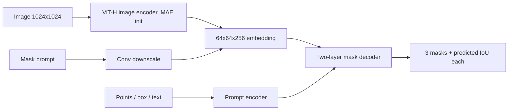

## Abstract

Segment Anything tries to do for segmentation what large language models did for text: define one pre-training task that is general enough for downstream problems to be solved by prompting. The task is promptable segmentation, where the model must return a sensible mask for any prompt, even an ambiguous one. The model, SAM, splits the work into a heavy image encoder that runs once per image and a light prompt encoder and mask decoder that answer each prompt in about 50 ms. Because mask annotations do not exist at web scale, the authors grow the dataset with the model in the loop, in three stages that end with fully automatic labelling. The result is SA-1B, with 1.1B masks on 11M licensed images. Without any task-specific training, SAM beats a strong interactive segmenter from a single click on 16 of 23 datasets and comes close to a supervised detector's masks on COCO and LVIS.

**Keywords:** promptable segmentation, zero-shot transfer, data engine, SA-1B, ambiguity-aware prediction, interactive segmentation

## 1 Introduction

The paper starts from three linked questions: which task allows zero-shot generalization, which architecture supports it, and which data can train it. A general task needs a flexible model, a flexible model needs far more masks than any existing dataset holds, and the only realistic way to obtain those masks is to use the model as an annotation tool.

Earlier segmentation work falls short in two ways. Interactive segmenters are built for a human who keeps clicking until the mask is right, so they are not required to give a good answer to the first, ambiguous click. Multi-task systems handle semantic, instance and panoptic segmentation together, but the test tasks are the same as the training tasks. The authors want something different: <mark>a model that can carry out a task it was never trained on, by being used as a component inside a larger system</mark>, for example by taking boxes from an object detector as prompts.

## 2 Background

A prompt here is any information that says what to segment: foreground or background points, a box, a coarse mask, or text. A mask is *valid* if it is a reasonable segmentation of at least one object the prompt could refer to. A click on a shirt may mean the shirt or the person; either answer counts.

The backbone is a Vision Transformer pre-trained with MAE. The mask decoder follows query-based Transformer segmentation (DETR, MaskFormer), where an output token becomes a classifier applied at every spatial location. Quality is measured by IoU, the intersection of predicted and true mask divided by their union.

## 3 Method

> **Key idea.** Pay the large cost once per image and make every prompt cheap. With a fast decoder, the same model can serve as an interactive annotation tool, and the annotations it helps to produce become its next training set. Ambiguity is handled by predicting several masks and training only the best one.

### 3.1 Architecture

A 1024×1024 input gives a 64×64 embedding with 256 channels. Points and box corners become a positional encoding plus a learned type embedding; text goes through CLIP's text encoder; a mask prompt is downscaled by convolutions and added to the image embedding.

Each of the two decoder layers performs token self-attention, token-to-image cross-attention, a token MLP, and then image-to-token cross-attention, so the image embedding is also updated by the prompt. After that the embedding is upsampled 4× and the mask logit at pixel $(x,y)$ is a dot product,

$$
\hat m_k(x,y) = \big\langle F(x,y),\, g(t_k) \big\rangle \tag{1}
$$

where $F$ is the upsampled image embedding, $t_k$ the $k$-th output token, and $g$ a 3-layer MLP. The paper's decoder diagram is [Fig. 14](https://arxiv.org/pdf/2304.02643#page=16), and the overall layout is [Fig. 4](https://arxiv.org/pdf/2304.02643#page=5).

### 3.2 Ambiguity-aware training

A model with one output, given an ambiguous click, learns to average the valid masks. SAM instead predicts $K=3$ masks, which is enough for the usual whole / part / subpart nesting, and only the best one receives gradient:

$$
\mathcal{L}_{\text{mask}} = \min_{k \in \{1,2,3\}} \Big[\, 20\,\mathcal{L}_{\text{focal}}(\hat m_k, m) + \mathcal{L}_{\text{dice}}(\hat m_k, m) \Big] \tag{2}
$$

with $m$ the ground-truth mask; the 20:1 weighting is the paper's. A small head also predicts the IoU of each mask, trained by

$$
\mathcal{L}_{\text{IoU}} = \big(\widehat{\text{IoU}}_k - \text{IoU}(\hat m_k, m)\big)^2 \tag{3}
$$

added with weight 1.0. At inference this score ranks the three masks. Training simulates an interactive session: the first prompt is a random foreground point or the box, and later points are sampled from the error region of the previous prediction, for 11 rounds per mask.

### 3.3 Data engine

| Stage | Who labels | Images | Masks | Masks / image |
|---|---|---|---|---|
| Assisted-manual | annotators click, SAM proposes | 120k | 4.3M | 20 → 44 |
| Semi-automatic | SAM pre-fills confident masks, annotators add the rest | 180k | 5.9M | 44 → 72 |
| Fully automatic | 32×32 point grid, no human | 11M | 1.1B | ~100 |

In the first stage the model was retrained 6 times and mean annotation time per mask fell from 34 to 14 seconds. In the automatic stage a mask is kept only if its predicted IoU is high and it is *stable*, meaning that thresholding the probability map at $0.5-\delta$ and at $0.5+\delta$ gives nearly the same mask. <mark>99.1% of the masks in SA-1B were produced with no human input</mark>, and the released dataset contains only those.

## 4 Experiments

**Setup.** Every evaluation is zero-shot: SAM is trained on SA-1B only and tested on datasets and tasks it has not seen. The core test is one foreground click on 23 datasets, scored by mIoU and by human raters on a 1–10 scale, against the interactive segmenter RITM.

**Single point.** SAM is ahead on 16 of 23 datasets, by up to about 47 IoU. If the best of its three masks is chosen by an oracle, it is ahead on all 23. Human raters place SAM's masks between 7 and 9 on average and above RITM on every dataset studied, <mark>including datasets where SAM scores lower on mIoU</mark>. With more clicks the gap narrows.

**Instance segmentation** (SAM prompted with ViTDet-H boxes; mask AP, Table 5 of the paper):

| Method | COCO AP | APS | APM | APL | LVIS v1 AP | APS | APM | APL |
|---|---|---|---|---|---|---|---|---|
| **ViTDet-H (supervised)** | **51.0** | **32.0** | **54.3** | **68.9** | **46.6** | **35.0** | **58.0** | **66.3** |
| SAM (zero-shot) | 46.5 | 30.8 | 51.0 | 61.7 | 44.7 | 32.5 | 57.6 | 65.5 |

SAM is behind on AP, by less on LVIS where the ground truth is cleaner. In a human study on LVIS boxes, however, SAM's masks were rated 8.1 ± 0.07 against 7.9 ± 0.08 for ViTDet-H, and COCO's own ground truth was rated only 7.6. The authors' reading is that <mark>the supervised model gains AP partly by reproducing annotation conventions of the dataset</mark>, which a zero-shot model cannot do.

**Other tasks.** For edge detection on BSDS500, Sobel filtering of SAM's mask probability maps gives ODS .768, below HED (.788) but far above zero-shot baselines such as Canny (.600). For object proposals on LVIS, mask AR@1000 is 59.3 against 63.0 for ViTDet-H, but SAM is ahead on medium objects (81.6 vs 80.8) and rare categories (65.8 vs 58.3). Text-to-mask is shown qualitatively only.

**Ablations.** Each data-engine stage raises mIoU, and training on automatic masks alone costs only about 0.5 mIoU compared with using everything. <mark>Training on 1M images, about 10% of SA-1B, gives results comparable to the full 11M</mark>, while 0.1M is clearly worse. ViT-H improves a lot over ViT-B but only slightly over ViT-L. The curves are in [Fig. 13](https://arxiv.org/pdf/2304.02643#page=12).

**Mask quality audit.** Annotators corrected the automatic masks on 500 images (about 50k masks). 94% of automatic/corrected pairs have IoU above 90%, which compares well with the 85–91% inter-annotator agreement reported in earlier work.

## 5 Discussion

**Strengths.** The task definition is the main contribution: requiring a valid mask for any prompt gives a training objective and a clean interface for composition at once. The min-over-outputs loss fits a multi-modal target without a generative model. The evaluation accepts that IoU against a single ground truth is unreliable under ambiguity and adds human ratings, which change the conclusion in several places.

**Weaknesses.** SAM's output has no semantics, and the authors say it is unclear how to prompt it for semantic or panoptic segmentation. Fine structures can be missed, small disconnected blobs can appear, and the ViT-H encoder is not real-time even though the decoder is. The text prompt is a proof of concept with no quantitative result.

**Not shown.** The data engine is a self-training loop, and the paper does not examine how errors or biases of early models carry into SA-1B; the audit measures boundary quality on masks the model chose to output, not the objects it never proposed. There is also no baseline that separates the effect of data volume from the effect of the task design.

## 6 Takeaways

- Promptable segmentation turns a family of tasks into one conditional prediction problem; downstream use is composition (detector → boxes → SAM), not finetuning.
- Separating an expensive, cacheable encoder from a roughly 50 ms decoder is what makes both interactive use and the data engine practical.
- Predict $K$ hypotheses, train only the best, and learn a score to rank them. This is a cheap way to handle an ambiguous target.
- Model-in-the-loop labelling scaled masks by about 400× over the previous largest dataset, yet a tenth of the data already gives most of the performance.
- For financial time series the link is loose. What transfers is the multi-hypothesis loss in Eq. (2): when one conditioning input admits several valid futures, a min-over-heads objective with a learned confidence is a deterministic alternative to sampling. It returns a few modes, not a distribution, so it cannot stand in for a generative model of paths.

## References

1. Kirillov, A., Mintun, E., Ravi, N., et al. *Segment Anything.* arXiv:2304.02643, 2023.
2. He, K., et al. *Masked Autoencoders Are Scalable Vision Learners* (MAE). 2022.
3. Radford, A., et al. *Learning Transferable Visual Models From Natural Language Supervision* (CLIP). 2021.
4. Li, Y., et al. *Exploring Plain Vision Transformer Backbones for Object Detection* (ViTDet). 2022.
5. Sofiiuk, K., et al. *Reviving Iterative Training with Mask Guidance for Interactive Segmentation* (RITM). 2022.
