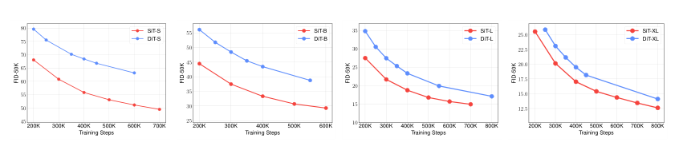
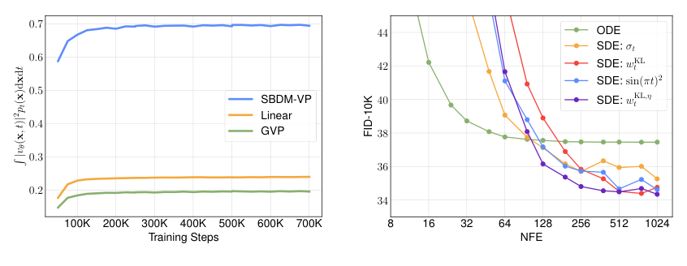

## Abstract

SiT asks a narrow but useful question: with the network, parameter count and GFLOPs frozen at exactly the Diffusion Transformer (DiT) configuration, how much is gained purely by changing the *probabilistic* recipe? The stochastic-interpolant framework splits that recipe into four knobs — discrete versus continuous time, what the network predicts, which path connects data and noise, deterministic versus stochastic sampling — and the authors move one knob at a time from DDPM towards a flow-matching-like model, recording FID after each move. The cumulative effect beats DiT at every size, reaching FID-50K 2.06 on ImageNet 256×256 and 2.62 at 512×512 with guidance. The structurally interesting result is not the FID but the fourth knob: the diffusion coefficient of the sampling SDE is a free function, choosable *after* training, and the paper derives which choice tightens a KL bound.

**Keywords:** stochastic interpolants, velocity prediction, probability flow ODE, reverse-time SDE, diffusion coefficient, KL upper bound, DiT, ImageNet

## 1 Introduction

By early 2024 two lines of progress on image generation had run in parallel. One improved architectures — [DiT](/blog/dit/) replaced the U-Net with a plain transformer over latent patches. The other rethought the noising process, the loss weighting and the sampler: [Score-SDE](/blog/score-sde/), EDM, rectified flow, [flow matching](/blog/flow-matching/). The second line's results were hard to compare, because each paper changed backbone, schedule and solver at once. "Flow matching beats diffusion" was a claim with no controlled experiment behind it.

The paper's complaint about score-based diffusion is more specific than "it is slow." A variance-preserving forward SDE defines the noise–data path *indirectly*, through a process whose stationary law is Gaussian, and reaches $\mathcal N(0,I)$ only as $t\to\infty$ — so a finite horizon leaves a genuine mismatch between the terminal law of $x_T$ and the $\mathcal N(0,I)$ used to start sampling. It also welds the sampler's noise level to the forward process, $w_t=\beta_t$, which the authors argue is a convention rather than a requirement. <mark>Stochastic interpolants remove both constraints: the path is written down directly on $[0,1]$ with exact endpoints, and the sampling diffusion coefficient becomes a free, post-training choice.</mark>

SiT is therefore an ablation paper whose deliverable is an attribution, not an architecture. The question in its Table 1 — "what is the source of the performance gain?" — is the whole point.

## 2 Background

All models here share a one-line description of the corrupted sample,

$$
\begin{aligned}
x_t &= \alpha_t\, x_* + \sigma_t\, \varepsilon, \\
x_* &\sim p_{\text{data}},\qquad \varepsilon \sim \mathcal N(0,I),
\end{aligned}
\tag{1}
$$

with $\alpha_t$ decreasing and $\sigma_t$ increasing. The stochastic-interpolant family imposes $\alpha_0=\sigma_1=1$, $\alpha_1=\sigma_0=0$ on $t\in[0,1]$, plus differentiability and $\alpha_t^2+\sigma_t^2>0$; then $x_0$ is exactly data and $x_1$ exactly noise. The variance-preserving (VP) diffusion of [DDPM](/blog/ddpm/) and Score-SDE instead *derives* $\alpha_t,\sigma_t$ from a rate $\beta_t$ and never reaches the endpoint. Mind the convention: $t=0$ is data here, the reverse of DDPM.

Two dynamics reproduce the marginals $p_t$ of (1) — a deterministic flow $\dot X_t = v(X_t,t)$ with

$$
v(x,t) = \dot\alpha_t\, \mathbb E[x_* \mid x_t = x] \;+\; \dot\sigma_t\, \mathbb E[\varepsilon \mid x_t = x],
\tag{2}
$$

and a one-parameter family of reverse-time SDEs adding a score correction and noise, where $s(x,t) = \nabla\log p_t(x) = -\sigma_t^{-1}\,\mathbb E[\varepsilon\mid x_t=x]$. Appendix A proves both by taking the characteristic function of $x_t$, differentiating in $t$, and reading off a transport equation (ODE) or a Fokker–Planck equation (SDE).

## 3 Method

> **Key idea.** Hold the transformer fixed and treat the generative model as four orthogonal choices — time discretization, prediction target, interpolant, sampler — then change them one at a time, so every FID point has a named cause. The fourth choice turns out to be free at inference time.

### 3.1 One family of samplers indexed by a free coefficient

The reverse-time SDE sharing marginals with (1) is

$$
dX_t = v(X_t,t)\,dt \;-\; \tfrac12 w_t\, s(X_t,t)\,dt \;+\; \sqrt{w_t}\, d\bar W_t,
\tag{3}
$$

with $\bar W_t$ a reverse-time Wiener process and $w_t\ge 0$ arbitrary. Setting $w_t=0$ recovers the probability-flow ODE. The proof is two lines of Fokker–Planck algebra: substituting $s = p_t^{-1}\nabla p_t$ into the forward Kolmogorov equation for (3) makes the extra terms cancel as $\tfrac12 w_t \nabla\!\cdot\!\nabla p_t - \tfrac12 w_t \Delta p_t = 0$, which holds identically for *any* $w_t\ge0$. This step is exact, not an approximation, and it is where the paper's freedom comes from. Since $w_t$ appears in neither $v$ nor $s$, <mark>the amount of noise injected during sampling is a post-training hyperparameter: the weights never see it</mark>.

> **My comment.** This is the axis I find most tempting for CASE, because the sampler's noise level never enters the weights and a frozen checkpoint can be re-sampled without retraining. I wonder whether more injected noise would put back some of the volatility clustering and excess kurtosis CASE's generated paths under-build, or whether that defect sits in the learned field where no sampler can reach it.

### 3.2 Velocity and score are the same object

Velocity is learned by plain regression onto the time derivative of the path:

$$
\mathcal L_v(\theta) = \int_0^T \mathbb E\,\big\| v_\theta(x_t,t) - \dot\alpha_t x_* - \dot\sigma_t \varepsilon \big\|^2\, dt .
\tag{4}
$$

No weighting, no reparameterization — each term is the exact derivative of (1). Because the tower property gives $x = \alpha_t\mathbb E[x_*|x_t=x] + \sigma_t\mathbb E[\varepsilon|x_t=x]$, the two conditional expectations in (2) are not independent, and eliminating one yields

$$
v(x,t) = \frac{\dot\alpha_t}{\alpha_t}\,x \;-\; \lambda_t \sigma_t\, s(x,t),
\qquad
\lambda_t \;\equiv\; \dot\sigma_t - \frac{\dot\alpha_t \sigma_t}{\alpha_t}.
\tag{5}
$$

Inverting (5) gives the score from a velocity network, so one trained model serves both the ODE and the SDE. Substituting (5) into (4) and expanding $x_t$ collapses the objective exactly:

$$
\mathcal L_v(\theta) = \int_0^T \lambda_t^2\,\mathbb E\big\|\sigma_t s_\theta(x_t,t) + \varepsilon\big\|^2 dt \;\equiv\; \mathcal L_{s_\lambda}(\theta).
\tag{6}
$$

<mark>The velocity loss *is* the score loss with weight $\lambda_t^2$</mark> — so "which target to predict" and "how to weight the loss" are one question, the point [Kingma and Gao](https://arxiv.org/abs/2303.00848) make in general and the axis on which SD3 later organises everything. For SBDM-VP, $\dot\alpha_t = -\tfrac12\beta_t\alpha_t$ and $\dot\sigma_t = \beta_t(1-\sigma_t^2)/(2\sigma_t)$ give $\lambda_t = \beta_t/(2\sigma_t)$, diverging like $t^{-1/2}$ at the data end. In $\mathcal L_{s_\lambda}$ that divergence sits *outside* the squared norm, where it compensates the score objective's vanishing gradient near data; in $\mathcal L_v$ the same singularity sits *inside* the norm as $\dot\sigma_t\varepsilon$, where it becomes gradient explosion. That asymmetry predicts the ordering in Table 3 below. For the exact interpolants the singularity moves to $t\to1$ and enters through $\alpha_t^{-1}$, which cancels inside the norm but survives in $\lambda_t$ — the preference flips, and velocity becomes the stable choice.

### 3.3 Interpolants, and the coefficient that tightens a KL bound

Three paths are compared: SBDM-VP, and two exact interpolants,

$$
\text{Linear: } \alpha_t = 1-t,\ \sigma_t = t;
\qquad
\text{GVP: } \alpha_t = \cos\!\big(\tfrac{\pi}{2}t\big),\ \sigma_t = \sin\!\big(\tfrac{\pi}{2}t\big).
\tag{7}
$$

Linear is the rectified-flow path. GVP keeps $\alpha_t^2+\sigma_t^2=1$ like VP but, unlike VP, terminates exactly at noise.

For the coefficient, the paper starts from a bound in Albergo et al.: $D_{\mathrm{KL}}(p\,\|\,p_\theta) \le \tfrac12\int_0^1 w_t^{-1}\int|b-b_\theta|^2 p_t$, with $b = v - \tfrac12 w_t s$ the reverse drift. Rewriting $b$ through (5) pulls $w_t$ out as a scalar, and bounding the velocity error by the time-$t$ training loss $\mathcal L_t$ gives

$$
D_{\mathrm{KL}}(p\,\|\,p_\theta) \;\le\; \frac12\int_0^1 w_t^{-1}\Big(1+\frac{w_t}{2\lambda_t\sigma_t}\Big)^{2}\mathcal L_t\, dt .
\tag{8}
$$

The integrand is convex in $w_t$ with a unique interior minimum, and setting the derivative to zero gives the paper's headline choice:

$$
w_t^{\mathrm{KL}} \;=\; 2\lambda_t \sigma_t \;=\; 2\Big(\dot\sigma_t\sigma_t - \frac{\dot\alpha_t\sigma_t^2}{\alpha_t}\Big).
\tag{9}
$$

The derivation is exact given the bound; the *bound* is where the approximations live — it replaces the true velocity error by the training loss, and ignores integration cost entirely. Evaluating (9) on the three paths is instructive, and the paper does not do it explicitly:

| interpolant | $\lambda_t$ | $w_t^{\mathrm{KL}}$ | behaviour |
|---|---|---|---|
| SBDM-VP | $\beta_t/(2\sigma_t)$ | $\beta_t$ | finite and positive on $[0,1]$ |
| Linear | $1/(1-t)$ | $2t/(1-t)$ | $0$ at data, $\to\infty$ at noise |
| GVP | $(\pi/2)\sec(\tfrac{\pi}{2}t)$ | $\pi\tan(\tfrac{\pi}{2}t)$ | $0$ at data, $\to\infty$ at noise |

Row one is the paper's consistency check: for VP the optimal coefficient collapses to $\beta_t$, recovering the standard diffusion sampler — reassuring, but it also means the theory awards diffusion no penalty here. Row two is worth flagging: $t/(1-t)$ is exactly the rectified-flow loss weight that SD3 reweights. They are different objects — a loss weight versus a diffusion coefficient — so I read the coincidence as the shared log-SNR geometry of the straight path, not an identity.

Because $w_t^{\mathrm{KL}}$ blows up at $t\to1$ for both exact interpolants, the SDE is stiffest exactly where it starts. Adding a cost term $\eta\int_0^1 w_t\,dt$ to (8), on the assumption that the step size needed for fixed precision scales like $w_t^{-1}$, and re-minimizing gives a damped variant

$$
w_t^{\mathrm{KL},\eta} \;=\; w_t^{\mathrm{KL}}\sqrt{\frac{\mathcal L_t}{\mathcal L_t + c\,\eta\,(w_t^{\mathrm{KL}})^2}},
\qquad \eta \ge 0,
\tag{10}
$$

which tends to $w_t^{\mathrm{KL}}$ as $\eta\to0$ and to a finite limit as $t\to1$. The constant is written as $c$ deliberately: <mark>the paper's main-text equation, its appendix derivation and its stated $t\to1$ limit disagree by factors of two</mark> (main text $c=2$; the appendix optimization gives $c=1$; redoing the minimization with the $\tfrac12$ prefactor of (8) gives $c=4$). Since $\eta$ is a free constant this only reparameterizes it, but it does mean no numerical $\eta$ read off the paper will mean the same thing in a codebase — and the paper never states the $\eta$ it used.

### 3.4 Intuition: a 1-D Gaussian

Two things become concrete if the data are $\mathcal N(0,s^2)$ in one dimension. First, the endpoint bias. The paper's own VP example has $\alpha_t = e^{-t}$, $\sigma_t=\sqrt{1-e^{-2t}}$ ($\beta_t=2$ in the convention of §3.2). At $T=1$ that leaves $\alpha_1 = e^{-1} \approx 0.368$: the "pure noise" you start sampling from still carries 37% of the data signal. Driving $\alpha_T$ below $0.01$ needs $\int_0^T\beta \approx 9.2$, so VP must run long or ramp $\beta$ steeply. The exact interpolants pay nothing for this — $\alpha_1=0$ by construction.

> **My comment.** In TailFlow I squashed the cosine schedule so that $\bar\alpha_T = 10^{-4}$, i.e. $\alpha_T = 0.01$, which is the "ramp $\beta$ steeply" fix. An exact interpolant would make that knob unnecessary, though in TailFlow the endpoint was not the bias that mattered; the missing volatility feedback inside the generated window was.

Second, transport cost. Here $p_t = \mathcal N(0,\rho_t^2)$ with $\rho_t^2 = \alpha_t^2 s^2 + \sigma_t^2$, and both fields are linear: $s(x,t) = -x/\rho_t^2$ and, since $\rho_t\dot\rho_t = \dot\alpha_t\alpha_t s^2 + \dot\sigma_t\sigma_t$,

$$
v(x,t) = \frac{\dot\rho_t}{\rho_t}\,x
\qquad\Longrightarrow\qquad
C(v)=\int_0^1\mathbb E\,|v(x_t,t)|^2\,dt = \int_0^1 \dot\rho_t^{\,2}\, dt .
\tag{11}
$$

So the kinetic energy the paper plots in Fig. 4 is, for Gaussian data, the squared speed of the standard deviation. By Cauchy–Schwarz it is at least $(\rho_1-\rho_0)^2$, attained only when $\rho_t$ moves at constant speed. Take $s=0.5$: the floor is $0.25$, GVP costs $0.308$, Linear costs $0.465$. Linear is worse for a reason visible in the schedule — $\rho_t$ first *dips* to $0.447$, below its starting value $0.5$, before climbing to $1$. A straight line in $(x_*,\varepsilon)$ space is not a straight line in distribution space, and that detour is wasted motion. So this limiting case predicts GVP over Linear, matching the SiT-B ranking (34.6 vs 34.8 on the ODE, 32.9 vs 33.6 on the SDE). It also explains why the gap is small: $0.308$ versus $0.465$ is the same order of magnitude, whereas VP's $\alpha_1\ne0$ is a qualitative defect.

### 3.5 Algorithm

```text
# --- Training (one step) -------------------------------------------
sample x0 ~ data, class y;  eps ~ N(0,I);  t ~ U(0,1)
x  <- a(t)*x0 + b(t)*eps                 # a = alpha, b = sigma
u  <- a'(t)*x0 + b'(t)*eps               # exact path derivative
y  <- null with prob p_drop              # for classifier-free guidance
loss <- || v_theta(x, t, y) - u ||^2     # no weighting

# --- Deterministic sampling: Heun, t: 1 -> 0, NFE = 2N -------------
x <- eps ~ N(0,I);  grid 1 = t_0 > t_1 > ... > t_N = 0
for i in 0..N-1:
    h   <- t_{i+1} - t_i                 # negative
    d1  <- v(x, t_i, y)
    xp  <- x + h*d1                      # Euler predictor
    d2  <- v(xp, t_{i+1}, y)
    x   <- x + (h/2)*(d1 + d2)           # trapezoidal corrector

# --- Stochastic sampling: Euler-Maruyama, t: 1 -> 0.04 -> 0 --------
x <- eps ~ N(0,I);  grid 1 = t_0 > ... > t_N = 0.04
for i in 0..N-1:
    h     <- t_i - t_{i+1}               # positive
    sc    <- score_from_velocity(v(x, t_i, y), x, t_i)     # eq (5)
    drift <- v(x, t_i, y) - 0.5*w(t_i)*sc
    x     <- x - h*drift + sqrt(w(t_i)*h) * z,  z ~ N(0,I)
x <- x - t_N * (v(x, t_N, y) - 0.5*w(t_N)*score(...))      # noiseless
```

The last three lines carry the detail easiest to get wrong: the stochastic sampler stops at $t_N=0.04$ and covers the remaining interval in one deterministic step, because converting velocity to score through (5) divides by $\sigma_t$, which vanishes at $t=0$. The paper reports that this clipping "greatly" helps. Guidance replaces $v$ by $v^\zeta = \zeta\,v(\cdot;y) + (1-\zeta)\,v(\cdot;\varnothing)$; Appendix C shows the corresponding score mixture equals $\nabla\log[p_t(x)p_t(y|x)^\zeta]$, so velocity guidance samples the same tempered density as score guidance — at double the NFE.

## 4 Implementation notes

Nothing is new here on purpose — the configurations are lifted from [DiT](/blog/dit/) untouched, which is what makes the comparison clean.

| item | value |
|---|---|
| backbone | DiT S/B/L/XL: 12/12/24/28 layers, width 384/768/1024/1152, heads 6/12/16/16 |
| parameters | 33M / 130M / 458M / 675M |
| patch size | 2 (all models) |
| latents | Stable Diffusion VAE, $32\times32\times4$ for $256^2$ images |
| conditioning | AdaLN-Zero for time and class label; ViT sinusoidal positional embeddings |
| optimizer | AdamW, constant LR $1\times10^{-4}$, batch 256, no warmup/decay tuning, no gradient clipping |
| augmentation | random horizontal flip, $p=0.5$ |
| EMA | decay 0.9999; all reported samples come from EMA weights |
| ODE solver | Heun (2nd order) via `diffrax`, NFE capped at 250 |
| SDE solver | Euler–Maruyama, 250 steps, last step from $t=0.04$ taken deterministically |
| solver endpoints | Heun $t_0=1$ (VP/Linear/GVP-velocity) or $1-10^{-5}$ (score models), $t_N=10^{-5}$ (VP) or $0$ |
| compute | SiT-XL at ~6.8 iters/sec on a TPU v4-64 pod (DiT-XL: 6.4) |
| metric | FID-50K against all ImageNet training images, ADM TensorFlow suite on GPU |

Things the paper leaves unspecified: the $\beta_t$ schedule used for SBDM-VP ("for some $\beta_t>0$"), the value of $\eta$ in (10), the guidance dropout probability, the number of seeds behind any FID (apparently one), and the wall-clock cost of the full sweep. The implementation is JAX, ported from the PyTorch DiT codebase; the authors note small FID differences between TPU- and GPU-based evaluation and standardise on GPU for comparability with DiT — a reproducibility trap worth repeating.

## 5 Experiments

The transition study uses SiT-B on ImageNet $256^2$, fixed at 400K steps, FID-50K, 250 NFE for both solvers. The walk from DiT to SiT, assembled from Tables 2–6:

| Step | Time | Interpolant | Prediction / loss | Sampler | FID ↓ |
|---|---|---|---|---|---|
| DDPM (DiT recipe) | discrete | VP | noise | DDPM | 44.2 |
| continuous time | continuous | SBDM-VP | score, $\mathcal L_s$ | ODE | 43.6 |
| reweighted score | continuous | SBDM-VP | score, $\mathcal L_{s_\lambda}$ | ODE | 39.1 |
| velocity | continuous | SBDM-VP | velocity, $\mathcal L_v$ | ODE | 39.8 |
| Linear path | continuous | Linear | velocity | ODE | 34.8 |
| GVP path | continuous | GVP | velocity | ODE | 34.6 |
| + SDE, $w^{\mathrm{KL}}_t$ | continuous | Linear | velocity | SDE | 33.6 |
| **+ SDE, $w^{\mathrm{KL}}_t$** | continuous | **GVP** | velocity | SDE | **32.9** |
| + SDE, $w^{\mathrm{KL},\eta}_t$ | continuous | Linear | velocity | SDE | 33.0 |

GVP with $w_t^{\mathrm{KL}}$ is the best B-scale number; the last row — Linear with the damped coefficient — is what the authors report as best at XL scale. <mark>The two large jumps come from the loss parameterization (43.6 → ~39) and from replacing VP with an exact interpolant (39.8 → ~34.7)</mark>; continuous time alone buys 0.6, the sampler another 1.2–1.7. Note that $\mathcal L_{s_\lambda}$ (39.1) beats $\mathcal L_v$ (39.8) *on the VP path* — the asymmetry predicted in §3.2 — so "predict velocity" is right for the paths SiT ends up using, not universally.

The full coefficient sweep (Table 6, SiT-B, 400K, SDE, FID-50K; VP is evaluated with $\mathcal L_{s_\lambda}$ "to make it competitive"):

| Interpolant | Objective | $w^{\mathrm{KL}}_t$ | $w_t=\sigma_t$ | $w_t=\sin^2(\pi t)$ | $w^{\mathrm{KL},\eta}_t$ |
|---|---|---|---|---|---|
| SBDM-VP | velocity $\mathcal L_v$ | **37.8** | 38.7 | 39.2 | 41.1 |
| SBDM-VP | score $\mathcal L_{s_\lambda}$ | **35.7** | 37.1 | 37.7 | 38.9 |
| GVP | velocity $\mathcal L_v$ | **32.9** | 33.4 | 33.6 | 33.2 |
| GVP | score $\mathcal L_s$ | 37.8 | 33.5 | **33.2** | 33.3 |
| Linear | velocity $\mathcal L_v$ | 33.6 | 33.5 | 33.3 | **33.0** |
| Linear | score $\mathcal L_s$ | 41.0 | 35.3 | **34.4** | 34.9 |


*Source: Ma et al., arXiv:2401.08740, Fig. 2, CC BY 4.0.*


*Source: Ma et al., arXiv:2401.08740, Figs. 4–5, CC BY 4.0.*

The right panel carries the practical message. <mark>The ODE converges with few function evaluations but plateaus; the SDE needs a larger budget and then reaches a lower FID.</mark> Across all four sizes at 400K steps (Table 8, no guidance) the SDE wins every time — 58.97→57.64 (S), 34.84→33.02 (B), 20.01→18.79 (L), 18.04→17.19 (XL) — and 9.35→8.26 for XL at 7M steps.

**System-level comparison (ImageNet 256×256, cfg = 1.5, 7M steps):**

| Model | FID ↓ | sFID ↓ | IS ↑ | Precision ↑ | Recall ↑ |
|---|---|---|---|---|---|
| ADM-G, ADM-U | 3.94 | 6.14 | 215.84 | 0.83 | 0.53 |
| StyleGAN-XL | 2.30 | **4.02** | 265.12 | 0.78 | 0.53 |
| VDM++ | 2.12 | – | 267.7 | – | – |
| DiT-XL | 2.27 | 4.60 | **278.24** | 0.83 | 0.57 |
| SiT-XL (ODE) | 2.15 | 4.60 | 258.09 | 0.81 | **0.60** |
| **SiT-XL (SDE)** | **2.06** | 4.49 | 277.50 | 0.83 | 0.59 |

At $512^2$ after 3M steps, SiT-XL (SDE) reports FID 2.62 / sFID 4.18 / IS 252.21 against DiT-XL's 3.04 / 5.02 / 240.82; VDM++ is listed at 2.65.

**Claim by claim.**

1. *"SiT surpasses DiT uniformly across model sizes."* Best supported: Table 1, Fig. 2 (SDE vs. DDPM) and Fig. 6 (ODE vs. DDIM), four sizes at matched NFE, with the authors' own caveat that SiT's Heun is second-order while DDIM is first-order. The companion claim — *"the gain comes from the recipe, not the architecture"* — is supported by construction rather than measurement, and is airtight.
2. *"The interpolant helps because it shortens the transport."* Fig. 4 shows lower kinetic energy for Linear and GVP than for VP, and low curvature is known to reduce discretization error — but this is a correlation over trained models, isolated by no experiment. §3.4 gives a limiting case where it is exactly true.
3. *"$w_t^{\mathrm{KL}}$ is the principled choice."* Proved against bound (8). It wins for SBDM-VP and GVP but loses to the damped version for Linear, which is what the theory predicts once integration cost is admitted — a successful prediction, not a contradiction.
4. *"Score models are worse than velocity models under SDE sampling."* Overstated. Dramatic under $w^{\mathrm{KL}}_t$ (GVP 32.9 vs 37.8; Linear 33.6 vs 41.0), but under $\sin^2(\pi t)$ the GVP score model (33.2) edges the velocity model (33.6). Table 6 supports only the weaker claim that the optimal $w_t$ is prediction- and interpolant-dependent.
5. *"Continuous time helps"* rests on one number, 44.2 → 43.6, no seeds; the defensible version is the authors' own — continuous time *enables* the post-hoc sampler choice. And *"the best $w_t$ shifts with model size"* is asserted from SiT-XL's preference for $w^{\mathrm{KL},\eta}_t$, with no XL-scale sweep printed.

## 6 Limitations

**Stated by the authors.** The Heun-versus-DDIM comparison is not apples-to-apples. $w_t^{\mathrm{KL}}$ is hard to integrate near $t=1$ for the exact interpolants, and the KL bound is trivially infinite at $t=0$ unless $\mathcal L_t\to0$. The velocity/score choice is interpolant-dependent because of singularities in $\dot\sigma_t$, $\alpha_t^{-1}$ and $\lambda_t$. Higher-order samplers and downstream tasks are left to future work; couplings other than independent noise–data pairs are noted as compatible but untried.

**My reading.** (i) The entire ablation is one scale, one dataset, one budget — B at 400K — and the best four configurations (32.9, 33.0, 33.2, 33.3) differ by less than half a point with no seeds and no confidence intervals. Trust the ranking against 39.8 and 44.2; not the ranking among themselves. (ii) Table 6 strengthens the SBDM-VP baseline to $\mathcal L_{s_\lambda}$ while the exact interpolants use their own best objective — fair, but it mixes two comparisons in one table. (iii) The path-length explanation is correlational. (iv) The margin shrinks steeply with scale and training: ~10.5 FID at B/400K, 2.3 at XL/400K, ~1.4 at XL/7M (DiT-XL/2's 9.62 against 8.26), 0.21 at XL/7M with guidance — the regime anyone actually ships. Nothing suggests the shrinkage stops. (v) The constants in (10) are internally inconsistent and $\eta$ is never reported, so that column of Table 6 is not reproducible from the paper alone. (vi) No few-step results for the final models, no likelihoods, no non-ImageNet data, no text conditioning.

## 7 Extensions

**What was built on this.** SD3 cites SiT as the strongest prior evidence for rectified flow, then argues that the evidence stopped at class-conditional, medium-scale settings; its own contribution — biasing the training timestep density — is precisely the loss-weighting axis that §3.2 shows is equivalent to choosing a prediction target, moved to text-to-image scale. [MeanFlow](/blog/mean-flows/) attacks the other open end, the few-step regime SiT never reports. The [Flow Matching Guide](/blog/flow-matching-guide/) adopts the same $(\alpha_t,\sigma_t,w_t)$ template as its organising frame. REPA (Yu et al., ICLR 2025) later used SiT-XL/2 as the base model for its representation-alignment loss during diffusion training.

**Open problems.** Why path length predicts FID is unexplained; both may be downstream of a third quantity such as the smoothness of the learned field. Whether $w_t$ can be *learned*, or adapted per sample at inference, is untouched — the paper optimizes a bound offline using a per-time loss it must estimate anyway. The prior stays Gaussian although the framework does not require it, and the interaction between $w_t$ and guidance scale is unexplored though both distort the sampled density.

**Research directions.** *These are ideas, not results — none has been run.*

1. **Is $w_t$ worth tuning, or is it noise?** Hypothesis: on a fixed SiT-B checkpoint the FID spread across the four $w_t$ choices is comparable to seed-to-seed spread and the Table 6 ranking does not replicate. Data: ImageNet $256^2$, released SiT-B. Baseline: $w_t=\sigma_t$. Metric: FID-50K over five sampling seeds per coefficient with confidence intervals, plus precision/recall. Failure mode: the ranking replicates but the effect stays irrelevant next to one extra point of guidance.
2. **Learn the coefficient instead of bounding it.** Hypothesis: minimizing (8) numerically against the *measured* $\mathcal L_t$ curve, rather than assuming the $\eta$-damped closed form, beats both $w^{\mathrm{KL}}_t$ and $w^{\mathrm{KL},\eta}_t$ at fixed NFE. Data: SiT-B, Linear. Baseline: the four coefficients of Table 6. Metric: FID-10K across NFE $\in\{16,\dots,512\}$, the axis of Fig. 5. Failure mode: $\mathcal L_t$ is noisiest near both endpoints, exactly where the coefficient matters.
3. **Path and sampler as separate dials for scenario generation.** Hypothesis: for one velocity model trained on multivariate daily return paths, the ODE sampler reproduces conditional means and autocorrelation better at low NFE while the SDE with tuned $w_t$ reproduces tail statistics better at high NFE — so the sampler is a per-use choice, not a one-time one. Data: a liquid equity-index panel, rolling windows, with [Quant GANs](/blog/quant-gans/) and [Diffusion-TS](/blog/diffusion-ts/) as generative baselines. Baseline: the same network sampled as a pure ODE. Metric: ACF of absolute returns and cross-asset correlation error on one side, VaR/ES backtests at 1% and 5% (the loss used by [Tail-GAN](/blog/tail-gan/)) on the other, at matched NFE. Failure mode: return panels are low-dimensional next to $32\times32\times4$ latents, so discretization error may not be the binding constraint — misspecification would dominate and both samplers would fail the tail test together.

## 8 Takeaways

- With the architecture frozen, <mark>moving from DDPM to a velocity-trained exact interpolant with SDE sampling improves FID at every DiT size</mark>, and the improvement decomposes: mostly loss parameterization and path, a little from the sampler, ~0.6 FID from continuous time alone.
- "Predict velocity" and "reweight the score loss by $\lambda_t^2$" are the *same* objective, Eq. (6). Which is numerically better depends on where the interpolant puts its singularity — velocity for Linear and GVP, weighted score for VP.
- The sampling diffusion coefficient is genuinely free, and (9) gives a principled default that reduces to $\beta_t$ for VP. It needs damping wherever $\alpha_t\to0$, and the damping constant is the one thing the paper fails to pin down.
- ODE under a tight step budget, SDE under a generous one — both from one trained network. That is the inference-time dial the architecture line never had.
- For financial time-series generation the separation of path from sampler is the directly useful idea: train once with a velocity loss, sample as an ODE for fast reproducible scenario paths or as an SDE when tail fidelity matters, and tune $w_t$ against a held-out distributional metric without retraining.
- Read the ablation as evidence about *which axis* matters. The 10-point gaps are real; the half-point gaps have no error bars.

## References

1. N. Ma, M. Goldstein, M. S. Albergo, N. M. Boffi, E. Vanden-Eijnden, S. Xie. *SiT: Exploring Flow and Diffusion-based Generative Models with Scalable Interpolant Transformers.* ECCV 2024. arXiv:2401.08740.
2. M. S. Albergo, N. M. Boffi, E. Vanden-Eijnden. *Stochastic Interpolants: A Unifying Framework for Flows and Diffusions.* arXiv:2303.08797.
3. W. Peebles, S. Xie. *Scalable Diffusion Models with Transformers (DiT).* ICCV 2023. arXiv:2212.09748.
4. D. P. Kingma, R. Gao. *Understanding Diffusion Objectives as the ELBO with Simple Data Augmentation.* NeurIPS 2023. arXiv:2303.00848.
5. P. Esser et al. *Scaling Rectified Flow Transformers for High-Resolution Image Synthesis.* ICML 2024. arXiv:2403.03206.
6. S. Yu, S. Kwak, H. Jang, J. Jeong, J. Huang, J. Shin, S. Xie. *Representation Alignment for Generation: Training Diffusion Transformers Is Easier Than You Think.* ICLR 2025. arXiv:2410.06940.
