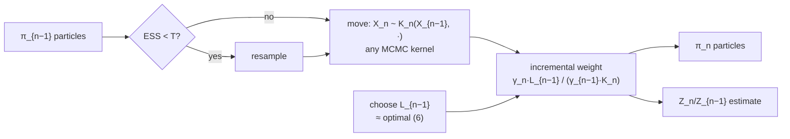

## Abstract

A particle filter works because its target lives on a space whose dimension grows with time: the importance weight telescopes and each step's contribution is computable. Take the same machinery to a sequence $\{\pi_n\}$ on a *fixed* space — posteriors as data accumulate, a tempering path from tractable to intractable, an annealing schedule for optimisation — and it breaks, because after moving particles with a Markov kernel $K_n$ the marginal proposal $\eta_n=\eta_1K_{2:n}$ is an $(n-1)$-fold integral you cannot evaluate. The trick is to stop trying. Introduce *artificial backward kernels* $L_{n-1}(x_n,x_{n-1})$ and define the auxiliary target $\tilde\pi_n(x_{1:n})\propto\gamma_n(x_n)\prod_{k<n}L_k(x_{k+1},x_k)$, which has $\pi_n$ as its time-$n$ marginal by construction. Importance sampling on the path space is now exactly the standard SMC problem, the incremental weight is a ratio of four evaluable densities, and $K_n$ may be *any* MCMC kernel — Metropolis–Hastings included, rejection probability and all. The optimal $L$ is characterised (Proposition 1, one line of the variance decomposition), the practical approximations are enumerated, and annealed importance sampling and resample–move fall out as the special case $L_{n-1}(x_n,x_{n-1})=\pi_n(x_{n-1})K_n(x_{n-1},x_n)/\pi_n(x_n)$ — whose weights, the paper points out, *do not depend on the new particle at all*.

**Keywords:** SMC samplers, artificial backward kernel, annealed importance sampling, resample–move, normalizing constants, tempering, transdimensional inference

## 1 Introduction

The setting: probability measures $\{\pi_n\}_{n\in\{1,\dots,p\}}$ on a *common* measurable space, each known up to a normalising constant, to be sampled in order. *We shall refer to $n$ as the time index; this variable is simply a counter and need not have any relationship with 'real' time.* Four instances are given and they cover most of computational Bayesian statistics:

- **Sequential Bayesian inference**, $\pi_n(x)=p(x\mid y_1,\dots,y_n)$. Even with a fixed batch this is attractive, for two reasons: MCMC *requires a complete 'browsing' of the observations* while a sequential strategy may be cheaper, and *by including the observations one at a time, the posterior distributions exhibit a beneficial tempering effect*.
- **Tempering**, $\pi_n(x)\propto\pi(x)^{\phi_n}\mu_1(x)^{1-\phi_n}$ with $0\le\phi_1<\cdots<\phi_p=1$: move smoothly from something easy to something hard.
- **Global optimisation**, $\pi_n(x)\propto\pi(x)^{\phi_n}$ with $\phi_p\to\infty$: simulated annealing with a population.
- **Rare events**, $\pi_n(x)\propto\pi(x)\mathbb{I}_{E_n}(x)$ with nested $E_1\supset\cdots\supset E_p=A$, where $\Pr(A)$ is recovered as the final normalising constant.

Against MCMC the complaint is specific: *it is difficult to assess when the Markov chain has reached its stationary regime and it can easily become trapped in local modes. Moreover, MCMC methods cannot be used in a sequential Bayesian estimation context.*

And the reason standard SMC does not transfer: *these algorithms deal with the case where the target distribution of interest, at time $n$, is defined on $S_n$ with $\dim(S_{n-1})<\dim(S_n)$. Conversely, we are interested in the case where the distributions $\{\pi_n\}$ are all defined on a common space $E$.*

Why this paper matters beyond the [particle-filtering](/blog/bootstrap-filter/) line: it is the generalisation that makes SMC a general-purpose Bayesian computation tool rather than a filtering tool. Marginal likelihoods for model comparison, rare-event probabilities, tempered sampling from multimodal posteriors, and inference on transdimensional model spaces all become one algorithm with three design choices. For the model-comparison problem that motivates my interest in exact likelihoods, §3.2.1's unbiased estimate of $Z_n/Z_{n-1}$ is the direct route to a marginal likelihood — the quantity a GAN cannot supply and a flow can.

## 2 Background: why sequential importance sampling fails here

Plain importance sampling: $\pi_n=\gamma_n/Z_n$ with $\gamma_n$ known pointwise, $\eta_n$ the proposal, $w_n(x)=\gamma_n(x)/\eta_n(x)$, and

$$
\mathbb{E}_{\pi_n}(\varphi)=Z_n^{-1}\!\int\varphi\,w_n\,\eta_n\,dx,
\qquad
Z_n=\int w_n\,\eta_n\,dx. \tag{1}
$$

The variance is approximately proportional to $1+\operatorname{var}_{\eta_n}\{w_n(X_n)\}$, so you want $\eta_n$ close to $\pi_n$, which is *very difficult when $\pi_n$ is a non-standard high dimensional distribution. As a result, despite its relative simplicity, IS is almost never used when MCMC methods can be applied.*

The sequential fix is to build $\eta_n$ out of the previous particles by moving them with a Markov kernel, giving

$$
\eta_n(x')=\int\eta_{n-1}(x)\,K_n(x,x')\,dx. \tag{2}
$$

*If $\eta_n$ can be computed pointwise, then it is possible to use the standard IS estimates.* It cannot. §2.4 is blunt: $\eta_n(x_n)=\eta_1K_{2:n}(x_n)$, an $(n-1)$-fold integral, and *whenever local moves are used, $\eta_n$ does not admit a closed form expression in most cases*. The obvious repair — approximate it by $\frac1N\sum_iK_n(X_{n-1}^{(i)},x_n)$ — fails twice: *the computational complexity of the resulting algorithm would be in $O(N^2)$, which is prohibitive*, and *it is impossible to compute $K_n(x_{n-1},x_n)$ pointwise in important scenarios. For example, consider the case where $E=\mathbb{R}$, $K_n$ is an MH kernel and $dx$ is Lebesgue measure: we cannot, typically, compute the rejection probability of the MH kernel analytically.*

That last sentence is the obstacle the paper removes. An MH kernel's density has an atom at $x$ whose mass is the rejection probability, which involves an integral over the acceptance region. You can run the kernel; you cannot evaluate it. Any method needing $K_n(x,x')$ pointwise therefore cannot use the thirty years of MCMC kernel design that statisticians actually have.

## 3 Method

> **Key idea.** Do not compute the marginal proposal. Change the target instead. Append artificial *backward* kernels to $\pi_n$ so that the auxiliary target lives on the path space $E^n$ and has $\pi_n$ as its $n$-th marginal. Then the weight is a path ratio that telescopes, every term is evaluable, and $K_n$ can be anything you can simulate.

### 3.1 The construction

Define

$$
\tilde\pi_n(x_{1:n})=\frac{\tilde\gamma_n(x_{1:n})}{Z_n},
\qquad
\tilde\gamma_n(x_{1:n})=\gamma_n(x_n)\prod_{k=1}^{n-1}L_k(x_{k+1},x_k). \tag{3}
$$

Because each $L_k(x_{k+1},\cdot)$ is a probability density in its second argument, integrating $x_{1:n-1}$ out of (3) returns $\gamma_n(x_n)$ exactly. *As $\tilde\pi_n(x_{1:n})$ admits $\pi_n(x_n)$ as a marginal by construction, IS provides an estimate of this distribution and its normalizing constant.* And the normalising constant of $\tilde\pi_n$ is the same $Z_n$ — nothing is lost.

Now $\tilde\pi_n$ lives on a space of growing dimension, so *we are then back to the 'standard' SMC framework*. The weight factorises:

$$
w_n(x_{1:n})=\frac{\tilde\gamma_n(x_{1:n})}{\eta_n(x_{1:n})}=w_{n-1}(x_{1:n-1})\,\tilde w_n(x_{n-1},x_n),
\qquad
\boxed{\ \tilde w_n(x_{n-1},x_n)=\frac{\gamma_n(x_n)\,L_{n-1}(x_n,x_{n-1})}{\gamma_{n-1}(x_{n-1})\,K_n(x_{n-1},x_n)}\ } \tag{4}
$$

Four densities, all evaluable by construction — $\gamma_n$ and $\gamma_{n-1}$ are the unnormalised targets, $L_{n-1}$ is something *you chose*, and $K_n$ appears in the denominator where, as §3.3.2 shows, it will usually cancel.

Degeneracy is handled the standard way: monitor $\mathrm{ESS}=\{\sum_i(W_n^{(i)})^2\}^{-1}$, resample when it falls below a threshold such as $N/2$. *Stratified resampling and residual resampling can also be used and all of these reduce the variance of $N_n^{(i)}$ relatively to that of the multinomial scheme* — a nod to [the comparison paper](/blog/resampling-schemes/) of the previous year. Complexity is $O(N)$ and parallelises.

### 3.2 Normalising constants

The particle set after the sampling step estimates the ratio directly:

$$
\widehat{\frac{Z_n}{Z_{n-1}}}=\sum_{i=1}^{N}W_{n-1}^{(i)}\,\tilde w_n\bigl(X_{n-1:n}^{(i)}\bigr),
\qquad
\widehat{\log\frac{Z_n}{Z_1}}=\sum_{k=2}^{n}\log\widehat{\frac{Z_k}{Z_{k-1}}}. \tag{5}
$$

This is the property that makes SMC samplers a *model-comparison* tool and not just a sampler: run the tempering path from prior to posterior and $Z_p/Z_1$ is the marginal likelihood. The paper also connects this to path sampling, noting the identity $\log(Z_1/Z_0)=\int_0^1\int\frac{d\theta}{dt}\frac{d\log\gamma_{\theta(t)}(x)}{dt}\pi_{\theta(t)}(dx)\,dt$, approximable by trapezoidal integration over the particle approximations.

### 3.3 Choosing the backward kernel

**The optimal choice.** Proposition 1: the $\{L_k\}$ minimising the variance of $w_n(x_{1:n})$ are

$$
L_{k-1}^{\mathrm{opt}}(x_k,x_{k-1})=\frac{\eta_{k-1}(x_{k-1})\,K_k(x_{k-1},x_k)}{\eta_k(x_k)},
\qquad\text{giving}\qquad
w_n(x_{1:n})=\frac{\gamma_n(x_n)}{\eta_n(x_n)}. \tag{6}
$$

The proof is Appendix A and is three lines: by the variance decomposition $\operatorname{var}\{w_n(X_{1:n})\}=\mathbb{E}[\operatorname{var}\{w_n\mid X_n\}]+\operatorname{var}[\mathbb{E}\{w_n\mid X_n\}]$, the second term is $\operatorname{var}\{\gamma_n(X_n)/\eta_n(X_n)\}$ and *independent of the backward Markov kernels*, while the first vanishes under (6). *This proposition is intuitive and simply states that the optimal backward Markov kernels take us back to the case where we perform IS on $E$ instead of on $E^n$* — the auxiliary construction costs you exactly the conditional variance of the path given its endpoint, and the optimal $L$ sets that to zero. The identity behind it is the forward–backward formula $\eta_1(x_1)\prod_kK_k=\eta_n(x_n)\prod_kL^{\mathrm{opt}}_{k-1}$.

Of course (6) contains the $\eta_k$ you could not compute in the first place. But *even if $\{L_k\}$ is different from* the optimum, *the algorithm will still provide asymptotically consistent estimates* — the choice affects variance, never validity. So the design problem is to approximate (6).

**Approximation A: substitute $\pi_{n-1}$ for $\eta_{n-1}$.**

$$
L_{n-1}(x_n,x_{n-1})=\frac{\pi_{n-1}(x_{n-1})K_n(x_{n-1},x_n)}{\pi_{n-1}K_n(x_n)}
\quad\Longrightarrow\quad
\tilde w_n(x_{n-1},x_n)\propto\frac{\gamma_n(x_n)}{\pi_{n-1}K_n(x_n)}. \tag{7}
$$

**Approximation B: the reversal of an MCMC kernel.** If $K_n$ is $\pi_n$-invariant, take

$$
L_{n-1}(x_n,x_{n-1})=\frac{\pi_n(x_{n-1})K_n(x_{n-1},x_n)}{\pi_n(x_n)}
\quad\Longrightarrow\quad
\tilde w_n(x_{n-1},x_n)=\frac{\gamma_n(x_{n-1})}{\gamma_{n-1}(x_{n-1})}. \tag{8}
$$

This is the reversed kernel associated with $K_n$, *a good approximation to* (7) *if $\pi_{n-1}\approx\pi_n$*. Note what has happened in (8): **$K_n$ has cancelled entirely**. The weight is a ratio of two unnormalised targets evaluated at the *old* particle. You never evaluate the kernel. That is the whole solution to the MH-rejection-probability problem, and it is why an SMC sampler can wrap any MCMC kernel you already have code for.

**The cost of (8), stated clearly.** §3.5: the weights (8) *are independent of $\{X_n^{(i)}\}$*, so *the variance of* (8) *will typically be high if the discrepancy between $\pi_{n-1}$ and $\pi_n$ is large even if the kernel $K_n$ mixes very well. This result is counter-intuitive.* The limiting illustration is exact and devastating: if $K_n(x_{n-1},x_n)=\pi_n(x_n)$ — a perfect independent sampler — you end up with i.i.d. draws from $\pi_n$ carrying high-variance weights. *This is clearly suboptimal.* Under (7), by contrast, the weight $\gamma_n(x_n)/\pi_{n-1}K_n(x_n)$ *depends on $K_n$ and thus reflects the mixing properties of the kernel. In particular, the variance decreases as the mixing properties of the kernel increases.*

**Gibbs-type updates.** When $K_n$ updates only component $x_k$ by a Gibbs step, (7) gives

$$
\tilde w_n\propto\frac{\pi_n(x_{n-1,-k})}{\pi_{n-1}(x_{n-1,-k})}, \tag{9}
$$

a ratio of *marginals* rather than full densities, and *by a simple Rao–Blackwell argument, the variance of* (9) *is always smaller than the variance of* (8). The gap is largest *where the marginals $\pi_{n-1}(x_{-k})$ and $\pi_n(x_{-k})$ are close to each other but the full conditional distributions differ significantly* — which is exactly sequential Bayesian inference, where a new observation moves only a few coordinates.

**A warning.** *It could be tempting to select $\{L_n\}$ in a different way. For example, if we select $L_{n-1}=K_n$ then the incremental importance weight looks like an MH ratio. However, this 'aesthetic' choice will be inefficient in most cases, resulting in importance weights with a very large or infinite variance.*

### 3.4 Where the known algorithms sit

The framework subsumes rather than competes:

| Algorithm | Is the special case with… |
|---|---|
| Annealed importance sampling (Neal) | $L$ from (8), geometric path, **no resampling** |
| Resample–move (Chopin; Gilks & Berzuini) | $L$ from (8), **with** ESS-triggered resampling |
| Population Monte Carlo (Cappé et al.) | $\pi_n=\pi$ for all $n$, $L_n(x,x')=\pi(x')$, independent $K_n$ adapted to the population |
| Particle filter | growing-dimension targets; the classical case |

*Resample–move corresponds to the SMC algorithm that is described in Section 3 using the backward kernel* (8). And AIS differs from resample–move only by not resampling. That two well-known algorithms are the same algorithm with one boolean flipped is the kind of clarification a good framework paper produces.

### 3.5 Mixtures of kernels

For high-dimensional problems one wants a mixture $K_n(x_{n-1},x_n)=\sum_m\alpha_{n,m}(x_{n-1})K_{n,m}(x_{n-1},x_n)$, matched by a backward mixture $L_{n-1}=\sum_m\beta_{n-1,m}(x_n)L_{n-1,m}$, with the discrete index made an explicit latent variable so that IS runs on $E\times E\times\mathcal{M}$:

$$
\tilde w_n(x_{n-1},x_n,m_n)=\frac{\gamma_n(x_n)\,\beta_{n-1,m_n}(x_n)\,L_{n-1,m_n}(x_n,x_{n-1})}{\gamma_{n-1}(x_{n-1})\,\alpha_{n,m_n}(x_{n-1})\,K_{n,m_n}(x_{n-1},x_n)}. \tag{10}
$$

With the honest accounting attached: *the variance of* (10) *will always be superior or equal to the variance of* (4). Tracking the index is cheaper than summing over $M$ components and it costs variance. The paper also offers the right analogy for the whole construction: *it is to SMC sampling what the MH algorithm is to MCMC sampling* — a primitive to be composed, not a finished algorithm.

### 3.6 Algorithm

```text
SMC SAMPLER
  n = 1
  draw X1(i) ~ eta_1 for i = 1..N
  w1(i) = gamma_1(X1(i)) / eta_1(X1(i));  normalise -> W1(i)

  repeat:
      # ---- resample only when needed
      if ESS = 1 / sum_i W(i)^2  <  T:
          resample; set W(i) = 1/N

      # ---- move with ANY kernel you can simulate
      n = n + 1;  if n = p+1: stop
      Xn(i) ~ K_n( X_{n-1}(i), . )                  # e.g. a Metropolis-Hastings kernel

      # ---- weight, using the ARTIFICIAL backward kernel
      wtilde(i) = gamma_n(Xn(i)) * L_{n-1}(Xn(i), X_{n-1}(i))
                / ( gamma_{n-1}(X_{n-1}(i)) * K_n(X_{n-1}(i), Xn(i)) )
      # with the MCMC-reversal choice (8) this collapses to:
      #     wtilde(i) = gamma_n(X_{n-1}(i)) / gamma_{n-1}(X_{n-1}(i))
      #   -- K_n never evaluated, only simulated
      Wn(i) proportional to W_{n-1}(i) * wtilde(i)

      # ---- free by-product
      logZ += log( sum_i W_{n-1}(i) * wtilde(i) )
```



## 4 Implementation notes

- **Two special-case reductions to remember.** With (8) the kernel cancels and the weight is $\gamma_n(x_{n-1})/\gamma_{n-1}(x_{n-1})$ — computed *before* the move, which is why Remark 1 says the particles should then be sampled *after* the weights are computed and any resampling has been done. With (7) the weight is $\gamma_n(x_n)/\pi_{n-1}K_n(x_n)$ and requires the one-step-ahead marginal.
- **(8) does not always apply.** When the supports are nested and growing, $E_{n-1}\subset E_n$ — the transdimensional case of §5 — the denominator of the reversal is an integral over $E_{n-1}$, not $E_n$, so it is not $\pi_n(x_n)$ and the simplification fails. AIS and resample–move therefore *cannot be applied in such scenarios*; the general framework can.
- **Optimal forward kernel.** *The optimal proposal, in the sense of minimizing the variance of the importance weights, is $K_n(x,x')=\pi_n(x')$* — impossible, hence the menu: independent proposals, random-walk kernels (whose *choice of the kernel bandwidth is difficult* and which use no information about $\pi_n$), MCMC kernels invariant for $\pi_n$, and approximate Gibbs moves.
- **Experimental settings** for the mixture study: $N=1000$ particles, resampling threshold 500, **systematic resampling** (*the results with residual resampling are very similar*), piecewise-linear cooling schedule — uniformly $0\to0.15$ over the first 200 of 1000 steps, $0.15\to0.40$ over the next 400, $0.40\to1$ over the last 400, *to allow an initially slow evolution of the densities and then to allow more complex densities to appear at a faster rate*. MH proposal variances *dynamically falling to produce an average acceptance rate in $(0.15,0.6)$*. Initial importance distribution is the prior. Ten runs per configuration.
- **The AIS comparison is CPU-matched, not step-matched.** *The absence of a resampling step allows AIS to run for a few more iterations than SMC sampling*, and the table's footnote says the AIS step counts are slightly higher than stated. Comparing at equal compute rather than equal iterations is the right call.
- C++ code and data released.

## 5 Experiments

### 5.1 Bayesian analysis of a finite mixture

100 simulated points from an equally weighted mixture of four normals with means $(-3,0,3,6)$ and standard deviations $0.55$; the sampler targets $\pi_n(\theta)\propto l(y;\theta)^{\phi_n}f(\theta)$ along the tempering path. SMC samplers versus AIS at 50, 100, 200, 500 and 1000 time steps, with 1 or 10 MCMC iterations per step.

Averages over 10 runs (unnormalised log-posterior of the particles at the final time; log-normalising-constant estimate; and, for SMC, how often resampling fired):

| Steps | | SMC log-post. | AIS log-post. | SMC $\log Z$ | AIS $\log Z$ | SMC resamples |
|---|---|---|---|---|---|---|
| 50 | 1 iter | $-155.22$ | $-191.07$ | $-245.86$ | $-249.04$ | 7.70 |
| 50 | 10 iters | $-152.03$ | $-166.73$ | $-240.90$ | $-242.07$ | 10.90 |
| 100 | 1 iter | $-153.08$ | $-180.76$ | $-245.43$ | $-250.22$ | 8.20 |
| 100 | 10 iters | $-152.97$ | $-162.37$ | $-244.18$ | $-244.17$ | 5.10 |
| 200 | 1 iter | $-152.62$ | $-174.40$ | $-246.22$ | $-247.45$ | 8.30 |
| 200 | 10 iters | $-152.99$ | $-160.00$ | $-245.84$ | $-245.92$ | 4.20 |
| 500 | 1 iter | $-152.31$ | $-167.67$ | $-247.08$ | $-247.30$ | 7.00 |
| 500 | 10 iters | $-151.90$ | $-157.06$ | $-247.01$ | $-247.94$ | 3.00 |
| 1000 | 1 iter | $-152.12$ | $-163.14$ | $-247.40$ | $-247.50$ | 5.70 |
| 1000 | 10 iters | $-151.94$ | $-155.31$ | $-247.40$ | $-247.36$ | 2.00 |

And the posterior means of the four component locations, which by non-identifiability *should be all equal and approximately 1.5*:

| Configuration | $\mu_1$ | $\mu_2$ | $\mu_3$ | $\mu_4$ |
|---|---|---|---|---|
| SMC, 50 steps, 1 iter | 0.38 | 0.83 | 1.76 | 2.69 |
| AIS, 50 steps, 1 iter | 0.03 | 0.75 | 1.68 | 2.28 |
| SMC, 100 steps, 10 iters | **1.34** | **1.44** | **1.44** | **1.54** |
| AIS, 100 steps, 10 iters | 0.88 | 1.06 | 1.59 | 2.25 |
| SMC, 200 steps, 10 iters | **1.34** | **1.37** | **1.53** | **1.53** |
| AIS, 200 steps, 10 iters | 1.26 | 1.34 | 1.45 | 1.74 |
| SMC, 500 steps, 10 iters | **1.40** | **1.44** | **1.42** | **1.50** |
| AIS, 500 steps, 10 iters | 1.36 | 1.38 | 1.48 | 1.57 |

**What the numbers say, including where SMC does not win.**

1. **Resampling helps the particles a lot.** The SMC log-posteriors are far higher than AIS's at every setting, and the gap is enormous at short schedules ($-155.22$ against $-191.07$). *The standard deviation of these values (which is not given here) is also significantly smaller than for AIS* — a claim made without the numbers behind it.
2. **Resampling does not help the normalising constant.** *The estimates of the normalizing constant that were obtained via SMC sampling are not improved compared with AIS.* Look at the $\log Z$ columns: at 1000 steps with 10 iterations they agree to two decimal places ($-247.40$ vs $-247.36$), and at short schedules *the estimates for both algorithms are particularly poor and improve similarly as $p$ increases*. This is a clean negative result about the paper's own method, reported without hedging.
3. **A practical recommendation drawn from a negative result.** *If we are interested in estimating normalizing constants, it appears that it is preferable to use only one iterate of the kernel and more time steps.* More, shorter steps beat fewer, better-mixed ones when the target is $Z$.
4. **Non-identifiability recovery is the clearest win.** The four estimated means should coincide at ~1.5; SMC at 100 steps with 10 iterations gives $(1.34,1.44,1.44,1.54)$ against AIS's $(0.88,1.06,1.59,2.25)$. *This underlines that the resampling step can improve the sampler substantially, with little extra coding effort.* Notably the advantage is *largest at moderate $p$* and shrinks by 500 steps, where AIS nearly catches up — the honest shape of the result.
5. **Resampling frequency behaves as theory predicts.** It falls with $p$ (consecutive densities closer, less weight degeneracy) and falls with more MCMC iterations per step, *which we attribute to the fact that the kernels mix faster, allowing us a better coverage of the space*. The 50-step/10-iteration cell is the exception at 10.90, the only configuration where more mixing *raised* the resampling count.

### 5.2 A sequential transdimensional problem

The coal-mining disaster data (UK, 1851–1962), modelled as an inhomogeneous Poisson process with an unknown number $k$ of changepoints, intensities following $\lambda_j\mid\lambda_{j-1}\sim\mathrm{Ga}(\lambda_{j-1}^2/\chi,\lambda_{j-1}/\chi)$ and $k\sim\mathrm{Poisson}(\nu t_n)$ — with inference *annually*, giving 112 densities on the nested transdimensional spaces $E_n=\bigcup_k[\{k\}\times(\mathbb{R}^+)^{k+1}\times\Theta_{n,k}]$ with $E_{n-1}\subset E_n$. This is the case where AIS and resample–move *cannot be applied*, and it is the strongest argument for the general framework.

Two moves: an **extend** move that redraws the last changepoint from its full conditional (which can be sampled exactly by composition and whose normalising constant is available in closed form, as (7) requires), and a **birth** move adding a changepoint uniformly with its intensity drawn from its full conditional. *For this example, the extend move performed better than the birth move*, so the extend move is used with probability one whenever $k\ge1$.

Results with $N=10{,}000$ particles, resampling threshold 3000, systematic resampling, prior as initial distribution: after initial difficulty *the ESS never drops below 25% of its previous value*, and the sampler *resamples, on average, every 8.33 time steps*. The authors make the comparison that gives the number meaning: *we found, for less efficient forward and backward kernels, that the ESS would drop to 1 or 2 if consecutive densities had regions of high probability mass in different areas of the support.* And the correctness check: *the final rate was exactly the same as Green's (1995) transdimensional MCMC sampler for our target density*.

A genuinely on-line variant restricts the MCMC moves to the last five knot points; resampling frequency is similar, and *the estimate of the intensity function suffers (slightly), with a more elongated structure at later times, reflecting the fact that we cannot update the values of early knots in light of new data.* That is path degeneracy, named and quantified qualitatively in the only place where it can be seen.

## 6 Limitations

**Stated by the authors.**

- *The performances of these methods are highly dependent on the sequence of targets $\{\pi_n\}$, forward kernels $\{K_n\}$ and backward kernels $\{L_n\}$.* Three free choices, no automatic procedure for any of them.
- Finding the variance-optimal *path* from $\pi_1$ to $\pi_p$ is *a very difficult problem*; the practical substitute is adapting the schedule by monitoring ESS.
- The optimal $L$ is not computable; the practical ones are approximations, and choosing $L=K$ because the weight then looks like an MH ratio gives *very large or infinite variance*.
- Tracking a mixture index costs variance relative to summing the mixture.
- The paper *focuses on the algorithmic aspects*; convergence results are cited to Del Moral's Feynman–Kac theory and to Del Moral and Doucet rather than developed.

**My reading.**

- **The normalising-constant result is the most important thing in the experiments and the least emphasised.** SMC's main selling point over MCMC for model comparison is (5), and the mixture study shows it does *no better than AIS* at exactly that. The reason is visible in the theory — resampling reduces the variance of the particle *locations* but injects variance into the weight product — and the paper does not draw the connection explicitly.
- **Only one real data example, and it is a 112-observation univariate point process.** The mixture study is simulated and four-dimensional in the means. Nothing here is high-dimensional, and the sensitivity of the method to dimension is untested.
- **The tempering schedule is hand-designed and its sensitivity is dismissed in a sentence** (*other cooling schedules may be implemented (such as logarithmic or quadratic) but we did not find significant improvement*) with no supporting numbers.
- **Standard deviations are mentioned and not reported** for the log-posterior comparison, which is the paper's headline claim.
- **Path degeneracy is essentially absent.** The auxiliary target lives on $E^n$; resampling coalesces ancestral lines; the only place this surfaces is the on-line variant's *more elongated structure at later times*. For a framework whose whole trick is to work on path space, that deserves more than a clause.
- **No wall-clock or per-iteration cost is given**, beyond the statement that AIS gets a few extra iterations for the same CPU time.
- **The three design choices interact and are explored one at a time.** Kernel mixing changes the optimal schedule, which changes the resampling frequency, which changes the effective particle diversity. The experiments vary $p$ and the iteration count on a grid but never the backward kernel, even though §3.5 argues at length that (7) should beat (8).

## 7 Extensions

**What was built on this.** SMC samplers became the standard tool for marginal likelihoods and for multimodal posteriors where a single MCMC chain gets stuck; the adaptive-tempering variant, which chooses $\phi_{n+1}$ online by bisection to hit a target ESS, removed the schedule-design problem the conclusion flags. $\mathrm{SMC}^2$ nests a particle filter inside an SMC sampler over parameters, which is the sequential analogue of [particle MCMC](/blog/particle-mcmc/) and the eventual right answer to the parameter-learning problem the [auxiliary particle filter](/blog/auxiliary-particle-filter/) attacked with stratification. The framework underpins sequential Bayesian model comparison, rare-event estimation in reliability and finance, approximate Bayesian computation with tempered tolerances, and the Feynman–Kac formulations that unify the whole field. Within this site's other series, it is also the general form of which annealed importance sampling — and hence the thermodynamic-integration estimates used to evaluate deep generative models — is a special case.

**Open problems.** The optimal path between two distributions. Automatic choice of $\{L_n\}$ beyond the two named approximations. Whether the resampling-versus-normalising-constant tension of §5.1 is fundamental or an artefact of the schedule. And dimension: nothing here says how $N$ must grow with $\dim(E)$.

**Research directions.** *These are ideas, not results — none has been run.*

1. **Test the backward-kernel prediction the experiments never test.** Hypothesis: on a sequential Bayesian problem where each new observation moves only a few coordinates, the Gibbs-type weight (9) resamples far less often than the MCMC-reversal weight (8) at matched compute, and the gap in $\log Z$ accuracy is larger than the gap between SMC and AIS in Table 1. Data: the mixture model of §5.1 with observations added one at a time rather than tempered, plus a conjugate linear-Gaussian model where $Z$ is known exactly. Baseline: (8) with the same kernels and schedule. Metric: resampling count, ESS trajectory, and bias and variance of $\widehat{\log Z}$ against the exact value. Likely failure mode: (7) and (9) require a one-step-ahead marginal or a tractable full conditional that most interesting models do not have, so the comparison is only possible where it matters least.
2. **Marginal likelihoods for factor-model comparison via tempering.** Hypothesis: an SMC sampler along a prior-to-posterior tempering path gives marginal likelihoods for competing factor specifications with lower variance, at matched compute, than the bridge-sampling or harmonic-mean estimates commonly used, and the advantage grows with the number of candidate factors because the posterior becomes more multimodal. Data: a monthly factor-return panel with a fixed candidate set and a held-out period; plus a synthetic panel where the true model is known. Baseline: bridge sampling from a long MCMC run, and the (notoriously unstable) harmonic-mean estimator. Metric: variance of $\widehat{\log Z}$ across repeated runs, and how often the ranking of specifications is stable. Likely failure mode: the posterior is unimodal and well behaved for these models, in which case a long MCMC run plus bridge sampling wins on simplicity and the SMC machinery buys nothing.
3. **Quantify the resampling/normalising-constant tension.** Hypothesis: the variance of $\widehat{\log Z}$ has a non-monotone dependence on the resampling threshold, with an interior optimum well below the $N/2$ default, because resampling trades particle-location variance for weight-product variance and only the second enters (5). Data: a conjugate model where $Z$ is exact, at several dimensions, plus the §5.1 mixture. Baseline: thresholds from 0 (never resample, i.e. AIS) to $N$ (always). Metric: variance of $\widehat{\log Z}$ and of posterior-mean estimates, plotted jointly against the threshold. Likely failure mode: the optimum is so flat that any threshold in a wide range is fine, which would still be worth publishing as a reason to stop tuning it.

## 8 Takeaways

- The obstruction to using MCMC moves inside a particle method is that you cannot evaluate the marginal proposal density — and for a Metropolis–Hastings kernel you cannot even evaluate the kernel, because the rejection probability is an intractable integral.
- The fix is not to compute it but to change the target: append artificial backward kernels so the auxiliary target lives on path space and has $\pi_n$ as a marginal by construction. Nothing is approximated; the construction is exact for any choice of $L$.
- The incremental weight is $\frac{\gamma_n(x_n)L_{n-1}(x_n,x_{n-1})}{\gamma_{n-1}(x_{n-1})K_n(x_{n-1},x_n)}$, and with the natural MCMC-reversal choice the kernel cancels outright, leaving a ratio of unnormalised targets at the *old* particle.
- $L$ affects variance, never validity. The optimal one is characterised in three lines of the variance decomposition and is exactly the object that would have let you do importance sampling on $E$ in the first place.
- The reversal choice has a counter-intuitive defect the paper is careful to state: its weights do not depend on the new particle, so a perfectly mixing kernel does not reduce their variance at all.
- Annealed importance sampling and resample–move are the same special case with and without resampling. Seeing that is what a framework is for.
- Resampling substantially improves where the particles are, and — in this paper's own experiment — does *not* improve the estimate of the normalising constant. If $Z$ is what you want, more time steps with one kernel iterate beat fewer with ten.
- The framework handles the nested transdimensional case that AIS and resample–move structurally cannot, and that is the strongest evidence that the generality is real and not decorative.

## References

1. Del Moral, P., Doucet, A., Jasra, A. *Sequential Monte Carlo samplers.* JRSS-B 68(3):411-436, 2006.
2. Neal, R. M. *Annealed Importance Sampling.* Statistics and Computing 11, 2001.
3. Chopin, N. *A Sequential Particle Filter Method for Static Models.* Biometrika 89(3), 2002.
4. Gilks, W. R., Berzuini, C. *Following a Moving Target — Monte Carlo Inference for Dynamic Bayesian Models.* JRSS-B 63(1), 2001.
5. Cappé, O., Guillin, A., Marin, J.-M., Robert, C. P. *Population Monte Carlo.* JCGS 13(4), 2004.
6. Green, P. J. *Reversible Jump Markov Chain Monte Carlo Computation and Bayesian Model Determination.* Biometrika 82(4), 1995.
7. Del Moral, P. *Feynman–Kac Formulae: Genealogical and Interacting Particle Systems with Applications.* Springer, 2004.
8. Gelman, A., Meng, X.-L. *Simulating Normalizing Constants: From Importance Sampling to Bridge Sampling to Path Sampling.* Statistical Science 13(2), 1998.
9. Liu, J. S., Chen, R. *Sequential Monte Carlo Methods for Dynamic Systems.* JASA 93, 1998.
