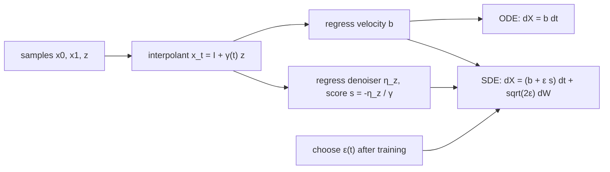

## Abstract

This paper treats flows and diffusions as two ways of sampling the same object. The object is a stochastic interpolant: a process mixing a sample from a base density, a sample from a target density and a Gaussian latent, equal to the first at time zero and the second at time one. Its marginal density obeys a transport equation and, equally, a family of forward and backward Fokker-Planck equations whose diffusion coefficient is free. The drifts in those equations are conditional expectations, hence unique minimisers of quadratic losses that need only samples. The authors prove that these losses bound the KL divergence of the SDE-based model but not of the ODE-based one, give the noise level minimising the bound, and show that score-based diffusion, denoisers, rectification and Schrödinger bridges all sit inside the construction. Experiments are small and illustrative: a 2D checkerboard, a 128-dimensional Gaussian mixture, and Oxford flowers at 128 pixels.

**Keywords:** stochastic interpolants, transport equation, Fokker-Planck equation, denoiser, likelihood bound, one-sided interpolant, mirror interpolant, Schrödinger bridge

## 1 Introduction

[Score-SDE](/blog/score-sde/) maps data to a Gaussian with an Ornstein-Uhlenbeck process and reverses it with a learned score. Several of its features are accidents of that construction rather than requirements of generative modelling. One endpoint must be Gaussian. The forward process reaches it only at infinite time, so practice truncates and accepts a bias: the backward SDE starts from $\mathcal{N}(0,I)$ although the forward law at the truncation time is not Gaussian. And the path through density space is welded to the process that traverses it, so schedule, time parameterisation and sampler cannot be tuned independently.

The earlier interpolant paper by two of the same authors, and the concurrent [Rectified Flow](/blog/rectified-flow/) and [Flow Matching](/blog/flow-matching/) papers, all learn a velocity by regression along an interpolation between endpoint samples, and all three are deterministic. This paper asks what noise adds, separating the two places it can enter — the *definition of the bridge* and the *sampler* — and answers with a theorem the open question of whether ODE and SDE samplers differ once the learned fields are imperfect. The organising principle is that <mark>the design of the time-dependent density is decoupled from the choice of process used to sample it</mark>.

## 2 Background

Two facts carry the paper. A density $\rho(t,x)$ carried by a velocity $b$ satisfies the transport equation $\partial_t\rho+\nabla\cdot(b\rho)=0$, and samples then follow $\dot X_t=b(t,X_t)$. And because $\Delta\rho=\nabla\cdot(\rho\,\nabla\log\rho)$, adding and subtracting $\epsilon\Delta\rho$ turns that same equation into a Fokker-Planck equation with a modified drift. [Score-SDE](/blog/score-sde/) uses this identity to trade an SDE for an ODE; here it runs the other way, and for a whole family of $\epsilon$ at once. Everything else is assumed: the denoising objective of [DDPM](/blog/ddpm/), the conditional-path construction of [Flow Matching](/blog/flow-matching/), and the bridge view of [DSB](/blog/diffusion-schrodinger-bridge/).

## 3 Method

> **Key idea.** Write the bridge down explicitly as $x_t=I(t,x_0,x_1)+\gamma(t)z$. Everything a sampler needs — the velocity and the score of the law of $x_t$ — is a conditional expectation of quantities you can simulate, so both are learnable by regression. How much noise to use at sampling time is then a separate decision, made after training, changing nothing about the density being sampled.

### 3.1 The interpolant

$$
x_t = I(t,x_0,x_1)+\gamma(t)\,z,\qquad t\in[0,1], \tag{1}
$$

where $(x_0,x_1)\sim\nu$ with marginals $\rho_0,\rho_1$; $z\sim\mathcal{N}(0,\mathrm{Id})$ independent of them; $I$ is $C^2$ with $I(0,\cdot)=x_0$, $I(1,\cdot)=x_1$ and $|\partial_tI|\le C_1|x_0-x_1|$; and $\gamma(0)=\gamma(1)=0$, $\gamma>0$ on $(0,1)$, $\gamma^2\in C^2$. The running example is $x_t=(1-t)x_0+t\,x_1+\sqrt{2t(1-t)}\,z$. Neither endpoint needs to be Gaussian, the product coupling is the default, and $\gamma\equiv0$ recovers the authors' earlier deterministic interpolant.

Regularity requires $\rho_0,\rho_1$ strictly positive $C^2$ densities with finite Fisher information plus moment bounds on $\partial_tI,\partial_t^2I$ — for the linear interpolant, finite fourth moments suffice. Remark 4 shows that replacing $\gamma(t)z$ by any zero-mean Gaussian *process* pinned at both ends changes nothing, since only the single-time covariance $\gamma^2(t)\mathrm{Id}$ enters: $\gamma=\sqrt{t(1-t)}$ is a Brownian bridge in disguise. The static form (1) avoids Itô calculus and can be sampled directly.

### 3.2 Velocity, score, denoiser, and their losses

Theorem 6: the law of $x_t$ is absolutely continuous, its density $\rho(t)$ is smooth and strictly positive on $[0,1]\times\mathbb{R}^d$, satisfies $\rho(0)=\rho_0$ and $\rho(1)=\rho_1$ *exactly*, and solves the transport equation with velocity

$$
b(t,x)=\mathbb{E}\bigl[\dot x_t\mid x_t=x\bigr]=\mathbb{E}\bigl[\partial_t I(t,x_0,x_1)+\dot\gamma(t)\,z \,\big|\, x_t=x\bigr]. \tag{2}
$$

The proof works with the characteristic function rather than the density, which is exactly what lets the latent do its job: convolving with a Gaussian of width $\gamma(t)$ is multiplication by $e^{-\gamma^2|k|^2/2}$ in Fourier space, and that factor delivers smoothness in $x$ at every order. Theorem 8 then gives the score through the latent, $s=\nabla\log\rho=-\gamma^{-1}\eta_z$, with the *denoiser* $\eta_z(t,x)=\mathbb{E}[z\mid x_t=x]$. Both are unique minimisers of quadratic objectives:

$$
\begin{aligned}
\mathcal{L}_b[\hat b]&=\int_0^1\mathbb{E}\Bigl[\tfrac12\lvert\hat b(t,x_t)\rvert^2-\bigl(\partial_t I+\dot\gamma z\bigr)\cdot\hat b(t,x_t)\Bigr]dt,\\
\mathcal{L}_{\eta_z}[\hat\eta_z]&=\int_0^1\mathbb{E}\Bigl[\tfrac12\lvert\hat\eta_z(t,x_t)\rvert^2-z\cdot\hat\eta_z(t,x_t)\Bigr]dt.
\end{aligned} \tag{3}
$$

These have the $\tfrac12\lVert\hat f\rVert^2-\langle Y,\hat f\rangle$ form whose minimiser is $\mathbb{E}[Y\mid x_t]$ up to a parameter-free constant; the score version replaces $-z\cdot\hat\eta_z$ by $+\gamma^{-1}z\cdot\hat s$, and the denoiser is preferred precisely because it avoids that $\gamma^{-1}$. A third split exists, $b=v-\gamma\dot\gamma\,s$ with $v=\mathbb{E}[\partial_tI\mid x_t]$, so one may learn any two of $\{b,v,s,\eta_z\}$ and reconstruct the rest.

The latent is not decoration: <mark>with $\gamma>0$ the density at time $t$ is the $\gamma=0$ density convolved with $\mathcal{N}(0,\gamma^2\mathrm{Id})$, which guarantees spatial regularity of $b$ and $s$</mark> and gives access to a score at all. It also suppresses spurious intermediate modes, which the $\gamma=0$ interpolant creates whenever $\rho_0$ and $\rho_1$ have distinct sharp features ([Fig. 4](https://arxiv.org/pdf/2303.08797#page=33)).

### 3.3 One density, many samplers

For any $\epsilon\ge0$ the *same* $\rho(t)$ solves a forward Fokker-Planck equation with drift $b_F=b+\epsilon s$ and a backward one with $b-\epsilon s$. Corollary 18 turns each into a sampler whose time-$t$ law is exactly $\rho(t)$:

$$
\dot X_t=b(t,X_t)\qquad\text{or}\qquad dX^F_t=\bigl[b(t,X^F_t)+\epsilon(t)\,s(t,X^F_t)\bigr]dt+\sqrt{2\epsilon(t)}\,dW_t, \tag{4}
$$

both from $\rho_0$, plus the time-reversed version from $\rho_1$. These are genuinely different processes with identical marginals, which matters for integration error and for how statistical error propagates. So <mark>$\gamma$ shapes the density path and affects even the ODE, while $\epsilon$ leaves the density untouched and only changes how trajectories traverse it</mark> ([Fig. 1](https://arxiv.org/pdf/2303.08797#page=5), [Fig. 5](https://arxiv.org/pdf/2303.08797#page=34)).

One consequence gets less attention than it deserves. The ODE maps each $x_0$ to exactly one $x_1$; the SDE maps it to an *ensemble* whose spread grows with $\epsilon$, converging to $\rho_1$ only as $\epsilon\to\infty$. Theorem 31 pushes this to the limit with a *diffusive interpolant*: if $I=x_0$ on an initial interval, the drift $u_d=\mathbb{E}[\partial_tI-\sqrt{2a}\,t\,z/\sqrt{1-t}\mid x_t=x]$ stays non-singular even when $\rho_0$ collapses to a point mass, so $dX_t=u_d\,dt+\sqrt{2a}\,dW_t$ started deterministically at $x_0$ still has $X_1\sim\rho_1$. <mark>No probability-flow ODE can do this</mark>: its solutions are unique, so it maps one point to one point.

### 3.4 Likelihood control

Lemma 21 writes the KL divergence between two densities transported by different velocities from the same start as

$$
\mathrm{KL}\bigl(\rho(1)\,\|\,\hat\rho(1)\bigr)=\int_0^1\!\!\int_{\mathbb{R}^d}\bigl(\nabla\log\hat\rho-\nabla\log\rho\bigr)\cdot\bigl(\hat b-b\bigr)\,\rho\,dx\,dt. \tag{5}
$$

The integrand contains the difference of *scores*, so a small velocity error does not control it — you would need the Fisher divergence too, which regressing $b$ does not give. Lemma 22 redoes the calculation for two Fokker-Planck equations at the same $\epsilon>0$ and picks up an extra $-\epsilon\int\!\int|\nabla\log\rho-\nabla\log\hat\rho|^2\rho$; that negative term absorbs the problematic factor by Cauchy-Schwarz, leaving $\mathrm{KL}\le\frac{1}{4\epsilon}\int\!\int|\hat b_F-b_F|^2\rho$. Substituting $\hat b_F=\hat b+\epsilon\hat s$ gives Theorem 23, for constant $\epsilon>0$:

$$
\mathrm{KL}\bigl(\rho_1\,\|\,\hat\rho(1)\bigr)\le\frac{1}{2\epsilon}\Bigl(\mathcal{L}_b[\hat b]-\min\mathcal{L}_b\Bigr)+\frac{\epsilon}{2}\Bigl(\mathcal{L}_s[\hat s]-\min\mathcal{L}_s\Bigr),\qquad
\epsilon^\ast=\Bigl(\tfrac{\mathcal{L}_b[\hat b]-\min\mathcal{L}_b}{\mathcal{L}_s[\hat s]-\min\mathcal{L}_s}\Bigr)^{1/2}. \tag{6}
$$

Hence <mark>minimising the regression losses maximises the likelihood of the SDE model, whereas for the ODE model it is not sufficient in general</mark>. Balancing the two terms gives $\epsilon^\ast$: greater than one when the score is the better-learned field, less when the velocity is. The degenerate readings are instructive — a perfect $\hat b$ with imperfect $\hat s$ says use the ODE, the reverse says $\epsilon\to\infty$, unreachable because integration cost grows with $\epsilon$. Separately, §2.5 evaluates SDE likelihoods by a Feynman-Kac expectation over an auxiliary backward SDE, with the honest caveat (Remark 29) that its exact correction term involves $|\nabla\log\hat\rho_F|^2$, which they do not know how to estimate.

### 3.5 Intuition: both endpoints Gaussian

Appendix A solves the Gaussian-mixture case in closed form. Take $d=1$, $\rho_0=\mathcal{N}(0,1)$, $\rho_1=\mathcal{N}(\mu,\sigma^2)$, linear $\alpha=1-t$, $\beta=t$, $\gamma=\sqrt{a\,t(1-t)}$. Then $\rho(t)=\mathcal{N}(m,C)$ with

$$
m(t)=t\mu,\qquad C(t)=(1-t)^2+t^2\sigma^2+a\,t(1-t), \tag{7}
$$

and both learned objects are exact: $b=\dot m+\tfrac12\dot CC^{-1}(x-m)$, $s=-C^{-1}(x-m)$.

Three things fall out. The latent's smoothing is visible in $C$: at $t=\tfrac12$ the variance rises from $(1+\sigma^2)/4$ to $(1+\sigma^2)/4+a/4$. Remark 42's endpoint argument becomes arithmetic: $\gamma\dot\gamma=\tfrac{a}{2}(1-2t)\to\pm a/2$ at the ends — *non-zero* — whereas $\gamma=t(1-t)$ gives $\gamma\dot\gamma\to0$. Concretely $\dot C(0)=a-2$, so at $a=0$ the initial velocity is $b(0,x)=\mu-x$ while at $a=2$ it is $b(0,x)=\mu$: the score contribution exactly cancels the $-x$. That is the mechanism behind the claim that $\sqrt{a\,t(1-t)}$ is the only listed $\gamma$ whose velocity still carries score information at the endpoints, and Table 2 confirms it is the only one not $C^1$ there. Finally, the forward SDE here is the same linear ODE plus $-\epsilon C^{-1}(X-m)\,dt+\sqrt{2\epsilon}\,dW$ — an Ornstein-Uhlenbeck pull toward the same moving mean, identical in $m(t)$ and $C(t)$ at every $t$ and different only in path roughness. That restoring force is what makes the SDE forgiving of a drift that has wandered off.

### 3.6 Special cases and connections

With $I$ spatially linear, $x_t=\alpha x_0+\beta x_1+\gamma z$, the velocity factorises into three conditional means,

$$
b=\dot\alpha\,\eta_0+\dot\beta\,\eta_1+\dot\gamma\,\eta_z,\qquad \alpha\eta_0+\beta\eta_1+\gamma\eta_z=x, \tag{8}
$$

where $\eta_0=\mathbb{E}[x_0\mid x_t]$ and so on. The constraint on the right is just $\mathbb{E}[x_t\mid x_t]=x$, so only two of the three need ever be learned. The paper's Table 1 (for the one-sided and SBDM rows, $\alpha$ multiplies the latent $z$, which has absorbed $x_0$):

| Interpolant | $\alpha(t)$ | $\beta(t)$ | $\gamma(t)$ |
|---|---|---|---|
| Two-sided, linear | $1-t$ | $t$ | $\sqrt{a\,t(1-t)}$ |
| Two-sided, trigonometric | $\cos\frac{\pi}{2}t$ | $\sin\frac{\pi}{2}t$ | $\sqrt{a\,t(1-t)}$ |
| Encoding-decoding | $\cos^2(\pi t)\,\mathbf{1}_{[0,1/2)}$ | $\cos^2(\pi t)\,\mathbf{1}_{(1/2,1]}$ | $\sin^2(\pi t)$ |
| One-sided (Gaussian base), linear | $1-t$ | $t$ | 0 |
| One-sided, trigonometric | $\cos\frac{\pi}{2}t$ | $\sin\frac{\pi}{2}t$ | 0 |
| Score-based diffusion (VP) | $\sqrt{1-t^2}$ | $t$ | 0 |
| Mirror ($\rho_0=\rho_1$) | 0 | 1 | $\sqrt{a\,t(1-t)}$ |

The design constraint behind these is $\alpha^2+\beta^2+\gamma^2=1$, which holds the covariance at identity when both endpoints are standardised. The encoding-decoding row drives $\rho_0$ entirely into $\mathcal{N}(0,\gamma^2(\tfrac12))$ by the midpoint and decodes it into $\rho_1$ afterwards, yet the probability flow remains one bijection from $X_0$ to $X_1$ — a clean route to image-to-image translation. It also *requires* $\gamma>0$, since at $\gamma=0$ the density collapses to a Dirac at $t=\tfrac12$.

**Score-based diffusion.** The Ornstein-Uhlenbeck law $\mathcal{N}(x_1e^{-\tau},(1-e^{-2\tau})\mathrm{Id})$ is also the law of $y_\tau=x_1e^{-\tau}+\sqrt{1-e^{-2\tau}}z$; substituting $t=e^{-\tau}$ gives $\alpha=\sqrt{1-t^2}$, $\beta=t$ on $[0,1]$ and the velocity $b=ts+\eta_1^{\mathrm{os}}$, well behaved even where $\dot\alpha$ blows up. Done at the level of the interpolant this <mark>gives a bias-free model on $[0,1]$ with a non-singular drift</mark>; done at the level of the SDE, the same change of time produces $t^{-1}$ coefficients that cannot be integrated from zero, forcing a truncation bias. Remark 43 resolves the apparent paradox: the constraint (8) makes $t^{-1}x+t^{-1}s$ collapse to the non-singular $ts+\eta_1^{\mathrm{os}}$.

**Denoisers and rectification.** Solving the one-sided interpolant for $x_1$ gives $\mathbb{E}[x_1\mid x_t]=\beta^{-1}(x_t-\alpha\eta_z)$, Stein's unbiased risk estimator; Theorem 45 shows that iterating its generalisation $\mathbb{E}[x_s\mid x_t]$ in small steps is a consistent integrator for the probability flow ODE, so "denoise, re-noise, repeat" is an ODE solver in disguise. Rectifying a perfectly learned flow yields (Theorem 47) $X^{\mathrm{rec}}_t(x)=\alpha(t)x+\beta(t)X_1(x)$: a straight line for $\alpha=1-t,\beta=t$, but with the same endpoint map $X^{\mathrm{rec}}_1=X_1$. Remark 48 concludes that straight-line solutions are necessary but not sufficient for optimal transport; Remark 49 supplies the fix — the map survives because $b^{\mathrm{rec}}$ was never constrained to be a gradient field, and imposing $b^{\mathrm{rec}}=\nabla\phi$ makes iteration converge to Brenier's polar decomposition. Remark 50 notes that $b^{\mathrm{rec}}(0,x)=\dot\alpha(0)x+\dot\beta(0)X_1(x)$ expresses the whole map in one evaluation, an alternative route to [consistency models](/blog/consistency-models/). Finally, Theorem 41 recovers the Schrödinger bridge by a max-min over the interpolant itself, left untested numerically.

### 3.7 Algorithm

```text
TRAIN  (two-sided; antithetic pairing as in Sec. 6.1)
  repeat:
    (x0, x1) ~ nu ;  z ~ N(0, Id) ;  t ~ Uniform[0, 1]
    xp = I(t,x0,x1) + gamma(t)*z          # antithetic partner uses -z
    xm = I(t,x0,x1) - gamma(t)*z
    Lb   = mean over (xp,+z),(xm,-z) of  0.5*|b_hat(t,x)|^2
                                        - (dI_dt(t,x0,x1) + gdot(t)*zs) . b_hat(t,x)
    Leta = mean over (xp,+z),(xm,-z) of  0.5*|eta_hat(t,x)|^2 - zs . eta_hat(t,x)
    step on Lb  (ODE only)  or on Lb + Leta  (ODE and SDE)

SAMPLE
  s_hat(t,x)  = -eta_hat(t,x) / gamma(t)
  bF_hat(t,x) =  b_hat(t,x) + eps(t) * s_hat(t,x)     # eps == 0 gives the ODE
  X ~ rho0 ;  t = t0
  while t < tf:
    X = TakeStep(t, X, bF_hat, eps, dt)               # dopri5 if eps=0, else Heun
    t = t + dt
  if learned via a denoiser and tf < 1:
    X = one denoising step using E[x_s | x_t]          # Lemma 44 / Thm 45
```

Antithetic pairing is not optional. Expanding $\gamma^{-1}z\cdot s(t,x_t)$ about $I(t,x_0,x_1)$ leaves a leading term whose conditional mean is finite but whose *variance* diverges as $t\to0,1$; the symmetric difference $\tfrac{1}{2\gamma}(z\cdot s(t,x_t^+)-z\cdot s(t,x_t^-))$ cancels it exactly, converging to $z\cdot\nabla s\,z$ with finite mean and variance. The authors report it was necessary for stable training of any objective containing $\gamma^{-1}$.



## 4 Implementation notes

**2D (Appendix C).** Feed-forward networks of depth 4, width 512, ReLU, one per field. 7,000 iterations on batches of 25 base draws × 400 target draws × 100 time slices, antithetic $\pm z$ throughout, Adam at learning rate $0.002$ halved every 1,500 iterations, Heun integrator for sampling.

**Images (Table 3).** The U-Net of [DDPM](/blog/ddpm/), identical whether learning $b$, $v$, $s$ or $\eta$.

| | ImageNet 32×32 | Flowers 128 | Flowers 128 (mirror) |
|---|---|---|---|
| Training points | 1,281,167 | 315,123 | 315,123 |
| Batch size | 512 | 64 | 64 |
| Training steps | $8\times10^5$ | $3.5\times10^5$ | $8\times10^5$ |
| Hidden dim | 256 | 128 | 128 |
| Attention resolution | 64 | 64 | 64 |
| U-Net dim mult | 1,2,2,2 | 1,1,2,3,4 | 1,1,2,3,4 |
| Learning rate | 2e-4 | 2e-4 | 2e-4 |
| LR decay / 1k epochs | 0.995 | 0.995 | 0.985 |
| $t$ range, training | $[0,1]$ (learning $\eta$) | $[0.0002,0.9998]$ (learning $s$) | $[0.0002,0.9998]$ (learning $s$) |
| $t$ range, ODE sampling | $[0,1]$ | $[10^{-4},1-10^{-4}]$ | $[10^{-4},1-10^{-4}]$ |
| $t$ range, SDE sampling | $[0,0.97]$ + denoising | $[10^{-4},1-10^{-4}]$ | $[10^{-4},1-10^{-4}]$ |
| $\gamma(t)$ | $\sqrt{t(1-t)}$ | $\sqrt{t(1-t)}$ | $\sqrt{10\,t(1-t)}$ |
| EMA decay / start | 0.9999 / 10k | 0.9999 / 10k | 0.9999 / 10k |
| GPUs | 2 | 4 | 2 |

Easy to get wrong:

- **The $\gamma^{-1}$ singularity is handled by time-capping, not by the loss.** The denoiser loss is fine on all of $[0,1]$; the *drift* built from it is not, since $s=-\eta_z/\gamma$. The 128D runs cap at $t_0=10^{-4}$, $t_f=1-10^{-4}$ whenever a denoiser is used. Alternatives: an $\epsilon(t)$ vanishing near the ends, or one denoising step past $t_f$.
- **One-sided interpolants are singular at $t=0$ for a different reason** — $\beta(0)=0$ in $b=\dot\beta\beta^{-1}x+(\dot\alpha-\alpha\dot\beta\beta^{-1})\eta_z^{\mathrm{os}}$ — but the limit $b(0,x)=\dot\alpha(0)x+\dot\beta(0)\mathbb{E}[x_1]$ is estimable from data, so the model is exact on $[0,1]$.
- **The SDE costs more steps:** 1,000 Heun steps for every $\epsilon\neq0$ in 128D against adaptive `dopri5` at $\epsilon=0$; 2,000 / 2,500 / 4,000 steps for $\epsilon=1,2,4$ on flowers.
- **Not stated:** no wall-clock or GPU-hour figures, no FID by the authors' choice, and an ImageNet 32×32 column fully specified in Table 3 although no ImageNet result appears in the paper.

## 5 Experiments

**Setup.** (i) A 2D checkerboard from a Gaussian base, several $\gamma$, 300,000 samples via ODE or SDE at $\epsilon\in\{0.5,1.0,2.5\}$, scored against the exact density. (ii) A five-mode Gaussian mixture in $d=128$, means $m_i\sim\mathcal{N}(0,\sigma^2\mathrm{Id})$ with $\sigma=7.5$ and covariances $C_i=\tfrac1dW_i^\mathsf{T}W_i+\mathrm{Id}$, linear interpolant with $\gamma=\sqrt{t(1-t)}$, all four pairings of $b$ or $v$ with $s$ or $\eta$. The metric is a KL divergence between Gaussian KDEs of the first two coordinates from 50,000 samples, estimated on a fresh 50,000 points with the control variate $\hat\rho_1/\rho_1-1$, which also keeps the estimate non-negative. (iii) Oxford flowers at 128×128, one-sided and mirror interpolants. **Results are reported as figures, not tables**, so the reading below is qualitative.

| Question | Finding | Where |
|---|---|---|
| ODE or SDE on the checkerboard? | SDE ($\epsilon>0$) wins for every $\gamma$; the gap is smallest for $\gamma=\sqrt{t(1-t)}$ | [Figs. 7–8](https://arxiv.org/pdf/2303.08797#page=46) |
| Does the latent help the ODE? | Yes: with $\gamma=\sqrt{t(1-t)}$ the probability flow beats the original $\gamma=0$ interpolant | same |
| Best $\epsilon$ in 128D? | Every variant has an interior optimum $\epsilon\neq0$; too little noise over-concentrates the modes and thins the tails, too much does the reverse | [Figs. 10–12](https://arxiv.org/pdf/2303.08797#page=49) |
| **Which fields to learn?** | **$b$ with the denoiser $\eta_z$ is best**; $b$ beats $v$, $\eta_z$ beats $s$ except at large $\epsilon$ | [Fig. 12](https://arxiv.org/pdf/2303.08797#page=50) |
| Images | One noise draw gives one flower under the ODE, increasingly different flowers as $\epsilon$ grows; nearest training neighbours in $\ell_1$ are visibly distinct; the mirror interpolant at $\epsilon=10$ resamples a data image into a nearby unseen one | [Figs. 13–15](https://arxiv.org/pdf/2303.08797#page=52) |

**Claim by claim.**

1. *SDE sampling is more robust to imperfect fields.* Theory (6) bounds KL only with $\epsilon>0$; both sweeps show an interior optimum. The paper's central claim and its best-supported one — but supported on a checkerboard and a Gaussian mixture with the same small architecture. The image experiments cannot test it: they have no quality metric at all.
2. *The latent helps even the deterministic model.* Supported twice — $\gamma=\sqrt{t(1-t)}$ beats $\gamma=0$ at $\epsilon=0$, and Remark 42 supplies a mechanism. The link between them is argued, not measured: no experiment varies $a$ with everything else fixed.
3. *Learn $b$ and $\eta_z$.* [Fig. 12](https://arxiv.org/pdf/2303.08797#page=50) puts all four pairings on one axis — a clean ablation, but one target, one dimension, one random draw of the mixture parameters.
4. *Three claims with no supporting measurement.* $\epsilon^\ast$ is never tested against the swept optimum, because the formula needs the unknown loss minima. Image scaling is shown only weakly — it trains, produces plausible flowers, does not memorise — with no benchmark, by the authors' own choice. And the bias-free reformulation of score-based diffusion is a derivation; nothing measures the bias it removes.

## 6 Limitations

**Stated by the authors.** The empirical section is a demonstration, not a benchmark — no FID, no ImageNet, no tuned-diffusion comparison, all deferred. The Schrödinger-bridge max-min is left to future work. Larger $\epsilon$ costs more integration steps, so $\epsilon\to\infty$ is unreachable even where (6) points there. Dividing by $\gamma$ is singular at the endpoints and needs capping or a tapered $\epsilon(t)$. The exact SDE cross-entropy contains a $\nabla\log\hat\rho_F$ term they "do not know how to estimate", and using $\hat s$ as a proxy is uncontrolled. Assumption 39 (a reversible map to a standard Gaussian) becomes more stringent as $\epsilon\to0$.

**My reading.**

- **The regularity assumptions fail on the data they run on.** Strictly positive $C^2$ densities with finite Fisher information on all of $\mathbb{R}^d$ is false for images on a manifold — and (6) is the headline theoretical result.
- **Three internal inconsistencies.** Equation (4.9) writes the linear interpolant as $\alpha=t$, $\beta=1-t$, contradicting both Table 1 and its own boundary condition $\alpha(0)=\beta(1)=1$. Table 1's trigonometric row drops the $\sqrt{1-\gamma^2(t)}$ prefactor that (4.10) carries precisely so $\alpha^2+\beta^2+\gamma^2=1$, so as tabulated the sum exceeds one at intermediate times. And the mirror $\gamma$ is $\sqrt{t(1-t)}$ in [Fig. 15](https://arxiv.org/pdf/2303.08797#page=53)'s caption but $\sqrt{10\,t(1-t)}$ in Table 3.
- **No error bars anywhere**, and the SDE advantage is never measured at equal compute. Every KL curve in [Fig. 12](https://arxiv.org/pdf/2303.08797#page=50) is a single run on a single random mixture, the four pairings separate by less than the sweep in $\epsilon$, and adaptive `dopri5` against 1,000 fixed Heun steps is not a matched comparison.
- **The most distinctive capability is the least tested.** Two-sided generation between two non-Gaussian *datasets* appears only in analytic illustrations; both image experiments use a Gaussian base or identical endpoints. And the Karras et al. finding that a well-learned score makes ODEs competitive — cited in the introduction as motivation — is never revisited at a scale where it would bite.

## 7 Extensions

**What was built on this.** [SiT](/blog/sit/) is the direct empirical follow-up, taking the interpolant-versus-sampler decomposition to a transformer backbone at ImageNet scale and reporting the FID numbers this paper declined to. [SD3](/blog/sd3-rectified-flow-transformers/) adopts linear interpolants for text-to-image at production scale, and [FM Guide](/blog/flow-matching-guide/) unifies the notation across this paper, [Flow Matching](/blog/flow-matching/) and [Rectified Flow](/blog/rectified-flow/). The bridge thread connects to [DSB](/blog/diffusion-schrodinger-bridge/), which attacks the same problem by iterative proportional fitting rather than a max-min over interpolants. Within the paper's own citations, data-dependent couplings $\nu(dx_0,dx_1)$ (Albergo et al., 2023) and minibatch-OT flow matching (Tong et al., 2023) are the next moves on the coupling axis; Remark 50 positions [consistency models](/blog/consistency-models/) as rectification at $t=0$.

**Open problems.** Does the SDE advantage survive when the score is learned accurately on a hard dataset — theory says it shrinks and $\epsilon^\ast\to0$, but nothing tests that regime. Can $\epsilon^\ast$ be estimated without knowing $\min\mathcal{L}$, turning a theorem into a tuning rule? What is the right $\gamma$, given that the paper argues for $\sqrt{a\,t(1-t)}$ from endpoint behaviour and never sweeps $a$? And is the Schrödinger-bridge max-min trainable at all, given how unstable adversarial max-min over function classes usually is?

**Research directions.** *These are ideas, not results — none has been run.*

1. **Turn $\epsilon^\ast$ into a usable rule.** Hypothesis: replacing the unknown minima in (6) with held-out proxies — a fitted loss-curve asymptote, or a larger model's converged loss — predicts the swept-optimal $\epsilon$ within a factor of two. Data: the paper's 128D mixture, where $b$ and $s$ are analytic so the true minima are computable. Baseline: the brute-force sweep. Metric: predicted/optimal ratio and the KL penalty from using the prediction. Likely failure mode: the excess losses concentrate near the endpoints where the network is worst, so a single scalar throws away the time structure that sets the best $\epsilon(t)$.
2. **A two-sided bridge between market regimes.** Hypothesis: since neither endpoint must be Gaussian, an interpolant can bridge a calm-regime return law directly to a stressed one, with $\epsilon$ dialling a family of stress scenarios a Gaussian-base model cannot produce. Data: daily multivariate returns for a fixed equity basket, split into calm and stressed windows by realised volatility, standardised within each. Baseline: a one-sided interpolant trained on the stressed window alone, plus a block bootstrap. Metric: tail-dependence coefficients and expected-shortfall coverage on a held-out stressed period, and whether $\epsilon$ traces a monotone diversity-fidelity curve. Likely failure mode: the regimes overlap enough that the bridge is near-identity and the scenarios are indistinguishable from resampling — and stressed-window sample sizes are far below what the regression needs in high dimension.
3. **Equal-compute ODE versus SDE.** Hypothesis: the SDE advantage in [Fig. 12](https://arxiv.org/pdf/2303.08797#page=50) shrinks, perhaps to nothing, once the ODE gets the budget that 1,000 Heun steps consume. Data: the 128D mixture unchanged. Baseline: their own $\epsilon=0$ `dopri5` result. Metric: KL against evaluation budget, sweeping solver tolerance and $\epsilon$ on one axis. Likely failure mode: the ODE saturates because error is dominated by the learned drift rather than the integrator, confirming the paper instead of qualifying it — still worth knowing.

## 8 Takeaways

- A bridge between any two densities can be written down rather than derived from a forward SDE. The velocity and the score are then conditional expectations, learned by regression on triples $(x_0,x_1,z)$, with no dynamics simulated during training.
- Noise enters in two independent places. The latent $\gamma(t)z$ shapes and smooths the density path and is what makes $b$ and $s$ spatially regular at all; the diffusion coefficient $\epsilon(t)$ changes only the sampler and is chosen after training.
- The regression losses bound KL for the SDE and not for the ODE, because the Fokker-Planck calculation supplies a negative Fisher-divergence term the transport calculation lacks. The tests agree: an intermediate $\epsilon>0$ wins, and $b$ plus the denoiser is the recommended pairing.
- Score-based diffusion is the one-sided interpolant $\alpha=\sqrt{1-t^2}$, $\beta=t$, with no truncation bias and no singular drift. Denoising loops are ODE integrators. Rectification straightens paths without changing the map unless the velocity is forced to be a gradient.
- The evidence is thin where it matters most: no FID, no benchmark, no error bars, and the most distinctive capability — bridging two non-Gaussian datasets — is shown only analytically.
- For financial time series the appeal is that the base need not be Gaussian, so one can bridge from an empirical or parametric reference law to the target, and that $\epsilon$ dials between a deterministic scenario map and a diverse ensemble from the same start. None of the experiments involve sequential data.

## References

1. Albergo, M. S., Boffi, N. M., Vanden-Eijnden, E. *Stochastic Interpolants: A Unifying Framework for Flows and Diffusions.* JMLR 26 (2025); arXiv:2303.08797.
2. Albergo, M. S., Vanden-Eijnden, E. *Building Normalizing Flows with Stochastic Interpolants.* ICLR 2023; arXiv:2209.15571.
3. Lipman, Y. et al. *Flow Matching for Generative Modeling.* arXiv:2210.02747.
4. Liu, X., Gong, C., Liu, Q. *Flow Straight and Fast: Learning to Generate and Transfer Data with Rectified Flow.* arXiv:2209.03003.
5. Song, Y. et al. *Score-Based Generative Modeling through Stochastic Differential Equations.* arXiv:2011.13456.
6. Karras, T., Aittala, M., Aila, T., Laine, S. *Elucidating the Design Space of Diffusion-Based Generative Models.* arXiv:2206.00364.
