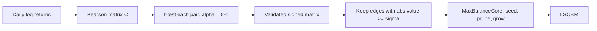

## Abstract

Most stock-network papers binarize a correlation matrix with a hand-picked cutoff, discarding both magnitude and sign. This paper keeps a correlation only if a t-test rejects zero, giving a sparse, weighted, signed network. On it the authors define the *largest strong-correlation balanced module* (LSCBM): the biggest set of stocks in which every pair is strongly correlated and every triangle has a positive sign product. In a random signed graph model its size grows like $\log N$ in general and linearly in $N$ when almost all edges are positive. A seed-and-grow heuristic, MaxBalanceCore, finds it in $O(N^2)$ time. On Chinese A-shares from 2013 to 2024 the module swells in the 2015 crash, shrinks to seven stocks in 2021, turns over almost completely each year, and never contains a negative edge.

**Keywords:** statistically validated networks, signed graphs, structural balance, clique-like modules, random graph asymptotics, market co-movement

## 1 Introduction

The standard recipe for a stock network is to compute Pearson correlations of daily returns, connect two stocks if $|C_{ij}|$ exceeds a threshold $\rho$, and run graph tools on the result. The authors see three problems. The cutoff is arbitrary, and small changes reshape the graph and any communities found in it. A binary edge treats correlations of 0.85 and 0.55 alike. And absolute values erase negative dependence, exactly what a hedger wants.

The paper's answer has two parts: let a hypothesis test decide which correlations survive, and, instead of generic communities, look for one well-defined substructure motivated by Heider's structural balance theory.

## 2 Background

**Structural balance.** A triangle in a signed graph is balanced when the product of its edge signs is positive: all three positive, or exactly two negative. Cartwright and Harary showed that a complete balanced graph splits into two camps, positive inside and negative across. In market terms: two blocks that co-move internally and move against each other.

**Cliques in random graphs.** An Erdős–Rényi graph with edge probability $p$ has a largest clique of about $2\log N/|\log p|$ nodes; the paper's general-regime rate reduces to this when positive edges dominate.

## 3 Method

> **Key idea.** Filter correlations by statistical significance rather than by a threshold, keep their signs, and then search for the largest clique-like group whose signs are consistent with a two-camp split. <mark>The target is a single, sharply defined object rather than a partition of the whole market</mark>, which is what makes both theory and a fast heuristic possible.

### 3.1 Statistically validated correlation network

With $T$ daily log returns per stock, each Pearson coefficient $C_{ij}$ is tested against the null of zero correlation using

$$
t_{ij} = C_{ij}\sqrt{\frac{T-2}{1-C_{ij}^2}}, \tag{1}
$$

which follows a Student-$t$ distribution with $\nu = T-2$ degrees of freedom under the null. The validated matrix keeps the raw coefficient when the null is rejected at $\alpha = 5\%$ and is zero otherwise:

$$
\tilde C_{ij} = \begin{cases} C_{ij} & \text{if } |t_{ij}| > t_\nu(\alpha/2) \\ 0 & \text{otherwise.} \end{cases} \tag{2}
$$

Sign and magnitude both survive; only noise-level links are removed.

### 3.2 The LSCBM

A set of stocks $S$ is a strong-correlation balanced module (SCBM) if two conditions hold. Every pair is strongly linked,

$$
|\tilde C_{ij}| \ge \sigma \quad \text{for all } i \ne j \in S, \tag{3}
$$

and every triple is balanced,

$$
\tilde C_{ij}\,\tilde C_{ik}\,\tilde C_{jk} > 0 \quad \text{for all distinct } i,j,k \in S. \tag{4}
$$

The LSCBM $S^*$ is the SCBM with the most nodes, with $\sigma = 0.7$ throughout. The authors argue $\sigma$ is not the old threshold in disguise, but it remains a free parameter that the results depend on.

Equivalently, an SCBM is a clique in the $\sigma$-filtered graph that splits into camps $A$ and $B$, positive within and negative across. A negative edge inside a module would be a built-in hedge.

### 3.3 Asymptotics in a random signed graph

For theory, the data-dependent matrix is replaced by a model $G(N,\alpha,\beta)$: each pair independently gets a $+1$ edge with probability $\alpha$, a $-1$ edge with probability $\beta$, and no edge otherwise. Three regimes are analyzed.

*General regime* (fixed $\alpha,\beta>0$). An LSCBM exists with probability tending to one, and

$$
\mathbb{E}|S^*| \sim \frac{\log N}{\lambda(\alpha,\beta)}, \qquad
\lambda(\alpha,\beta) = \begin{cases} \tfrac12|\log\alpha| & \alpha \ge \beta \\[2pt] \tfrac14\big(|\log\alpha| + |\log\beta|\big) & \alpha < \beta. \end{cases} \tag{5}
$$

*Dense regime* ($\alpha = 1 - b/N$, $\beta = b/N$, $b>1$). <mark>The module grows linearly, $\mathbb{E}|S^*| = \Theta(N\log b / b)$, and is all-positive with high probability.</mark>

*Negative-dominated regime* ($\beta \to 1$, $\alpha \to 0$). Size is capped at $O(\log N / |\log\alpha|)$.

In all three regimes the maximum-size module is non-unique with high probability (the third needs $|\log\alpha| = o(\sqrt{\log N})$), so the "core" an algorithm returns is one of several.

### 3.4 MaxBalanceCore

Exact search is NP-hard, so the algorithm is a heuristic. It builds the sign matrix of the $\sigma$-filtered graph, ranks nodes by degree, and for each of the top 100 seeds:

1. split the seed's neighbours into $A$ (positive) and $B$ (negative);
2. prune nodes lacking a positive link to everyone in their own camp or a negative link to everyone in the other;
3. greedily add outside nodes that are strongly linked to the whole module and sign-consistent with one camp.

The largest module over all seeds is returned, in $O(N^2)$ time and memory, with no optimality guarantee.

## 4 Experiments

**Synthetic recovery.** A known module is planted among nodes whose links are all weaker than $\sigma$. For $N$ from 1,000 to 10,000, and for strongly asymmetric camps at $N=3000$, the planted module is recovered exactly in all 100 replicates per setting, and $N=10{,}000$ finishes within 20 seconds ([Figs. 5–6 in the paper](https://arxiv.org/pdf/2508.04970#page=23)). No competing method exists because the object is new.

**Scaling check.** For graphs sampled from each regime, detected size divided by the theoretical rate flattens out as $N$ grows ([Fig. 7 in the paper](https://arxiv.org/pdf/2508.04970#page=25)).

**Chinese A-shares, 2013–2024.** Daily closes for Shanghai and Shenzhen stocks come from RESSET, stocks with missing data are dropped, and one network is built per year. $\xi_\pm$ are the fractions of validated positive and negative entries, $\mu_+$ the mean positive weight, and $\varsigma = |S^*|/N$.

| Year | $N$ | $\xi_+$ | $\xi_-$ | $\mu_+$ | $|S^*|$ | $\varsigma$ |
|---|---|---|---|---|---|---|
| 2013 | 1462 | 0.9295 | 0.000078 | 0.3241 | 13 | 0.0089 |
| 2014 | 1101 | 0.8920 | 0.00032 | 0.2919 | 15 | 0.0136 |
| **2015** | **609** | **0.9939** | **0.0000054** | **0.5574** | **55** | **0.0903** |
| 2016 | 1364 | 0.9761 | 0.000017 | 0.4762 | 87 | 0.0638 |
| 2017 | 1841 | 0.7783 | 0.0075 | 0.2926 | 14 | 0.0076 |
| 2018 | 2566 | 0.9694 | 0.000020 | 0.3830 | 35 | 0.0135 |
| 2019 | 3155 | 0.9625 | 0.000019 | 0.3428 | 27 | 0.0086 |
| 2020 | 3248 | 0.9183 | 0.00011 | 0.3037 | 24 | 0.0074 |
| 2021 | 3537 | 0.4902 | 0.0035 | 0.2102 | 7 | 0.0020 |
| 2022 | 3943 | 0.8886 | 0.00032 | 0.2986 | 22 | 0.0056 |
| 2023 | 4316 | 0.5848 | 0.0027 | 0.2354 | 31 | 0.0072 |
| 2024 | 4515 | 0.9702 | 0.00059 | 0.4174 | 113 | 0.0250 |

Bold marks the largest module share $\varsigma$; by count the largest modules are 2024 (113) and 2016 (87).

<mark>In the crash year 2015 about 9% of all retained stocks sit in one balanced module, against roughly 0.2% in fragmented 2021.</mark> <mark>Across all twelve years every edge inside every detected LSCBM is positive</mark>, consistent with the dense-regime theorem: validated negative correlations never exceed 0.75% of pairs and average around $-0.15$, far below $\sigma$. <mark>Membership barely persists: the 2024 and 2023 modules share no stock, and likewise 2023/2022 and 2022/2021</mark>, while the dominant sector rotates among coal, machinery, software, brokerages, and steel ([Table 3 and Fig. 8](https://arxiv.org/pdf/2508.04970#page=29)).

Sweeping $\sigma$ from 0.4 to 0.9, $\varsigma$ falls monotonically every year, with a sharp drop beyond about 0.75 ([Fig. 9 in the paper](https://arxiv.org/pdf/2508.04970#page=31)).

## 5 Discussion

**Strengths.** The object is cleanly defined and comes with theorems, rare in empirical stock-network work, and the dense-regime result genuinely explains the all-positive modules. The heuristic is simple and scales to the full A-share universe.

**Weaknesses.** The hedging motivation is never realized: no module contains a negative edge, so the balance condition is inactive and the LSCBM collapses to a large clique in a thresholded positive-correlation graph. $\sigma = 0.7$ does the real work, which narrows the distance to the criticized threshold approach.

With $T \approx 240$ and $\alpha = 5\%$, my own back-of-envelope inversion of Eq. (1) puts the pass mark near $|C_{ij}| \approx 0.13$, so validation is irrelevant once $\sigma = 0.7$ applies; there is also no multiple-comparison correction, and the t-test assumes i.i.d. Gaussian returns. Raw correlations are dominated by the market factor: <mark>a 99% positive-edge share in 2015 mostly says that a single common factor explained everything that year</mark>, and no factor-residual analysis is offered.

Independent edges are a poor model of correlation matrices, which are positive semidefinite and transitive. The algorithm is tested only on easy planted instances, never against an exact solver. The narrative also slips: 2016 is described as a decline although $|S^*|$ rises from 55 to 87 (only the share falls, as $N$ goes from 609 to 1364), and 2024 is called second-largest although it is the largest by count.

**Not shown.** No portfolio or risk experiment backs the "risk allocation units" claim, there are no simple baselines (largest clique, top eigenvector, sector labels), and the empirical section never asks how many equally large modules exist, which bears directly on the turnover finding.

## 6 Takeaways

- Significance filtering with sign retention is a sensible default, but at these sample sizes it removes only very weak links; a multiple-testing correction or factor-residual step would matter more.
- The LSCBM is a clique with a two-camp sign constraint: logarithmic in $N$ for fixed edge probabilities, linear when positive edges saturate, hence a crude synchronization gauge.
- At $\sigma=0.7$ the balanced-negative-triangle motif is absent in Chinese equities; diversification must come from outside the module.
- Near-zero yearly overlap plus proven non-uniqueness means a detected module is a sample from a set of cores, not *the* core.
- For generative modeling of multi-asset returns, the yearly statistics (shares of significant positive and negative correlations, mean strength, size of the largest co-moving block, and their jumps in crisis years) are cross-sectional stylized facts a simulator could be checked against. The paper itself has no stochastic-process or diffusion content.

## References

1. H. Qing and X. Xu. *Finding Core Balanced Modules in Statistically Validated Stock Networks.* arXiv:2508.04970, 2025.
2. F. Heider. *Attitudes and cognitive organization.* Journal of Psychology, 1946.
3. D. Cartwright and F. Harary. *Structural balance: a generalization of Heider's theory.* Psychological Review, 1956.
4. R. N. Mantegna. *Hierarchical structure in financial markets.* European Physical Journal B, 1999.
5. C. K. Tse, J. Liu, and F. C. M. Lau. *A network perspective of the stock market.* Journal of Empirical Finance, 2010. (Cited in the paper as "Chi et al., 2010".)
