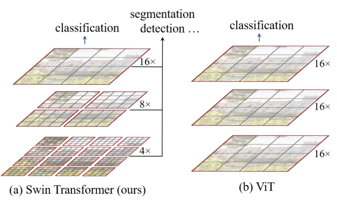
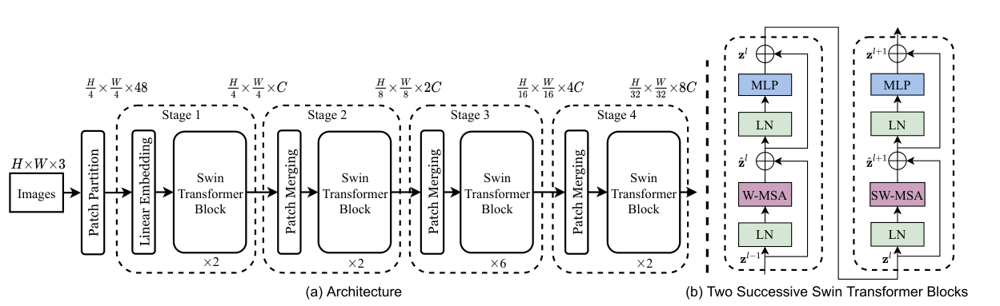
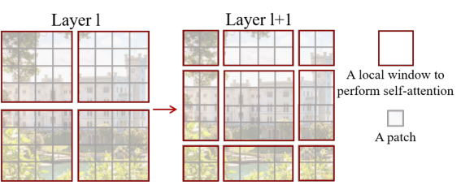
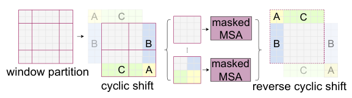

## Abstract

ViT showed that a Transformer can classify images, but its single-resolution token grid and globally quadratic attention make it a poor drop-in backbone for tasks that need dense, multi-scale features. In Swin Transformer, attention is computed only inside fixed-size local windows, so cost grows linearly with the number of patches, and the window grid is displaced by half a window in every second block so that information still flows between neighbouring windows. Between stages, adjacent patches are merged, producing the same 4×, 8×, 16×, 32× feature pyramid that CNN backbones expose. The resulting family of models beats DeiT and ResNe(X)t backbones at matched cost on ImageNet-1K, COCO and ADE20K, with the largest model reaching 58.7 box AP on COCO test-dev and 53.5 mIoU on ADE20K val.

**Keywords:** Swin Transformer, shifted windows, window attention, hierarchical feature maps, relative position bias, general-purpose backbone, dense prediction

## 1 Introduction

CNN backbones are central to vision because one architecture serves many tasks: classifiers, feature-pyramid detectors and U-Net-style segmenters all plug into the same multi-resolution feature maps. The authors want a Transformer that can play this role, and identify two properties of images that language Transformers never face.

The first is **scale**: visual entities vary enormously in size, yet ViT-style models keep every token at one fixed scale. The second is **resolution**: pixel-level tasks need many tokens, and global self-attention grows quadratically with token count.

Earlier local-attention designs slid a window around each query pixel. Every query then has a different key set, which means poor memory access and high real latency. <mark>The design goal here is therefore not just fewer FLOPs but a local attention scheme in which all queries in a window share one key set</mark>.

*Source: Liu et al., arXiv:2103.14030, Fig. 1, CC BY 4.0.*

## 2 Background

**ViT and DeiT.** ViT needs very large pre-training sets such as JFT-300M; DeiT supplies a training recipe that makes the same architecture work with ImageNet-1K only. Both output a single low-resolution feature map with attention cost quadratic in image size, and using them for dense tasks had required upsampling or deconvolution with comparatively low performance.

**Complexity of attention.** For a feature map of $h\times w$ patches with channel dimension $C$, a global multi-head self-attention (MSA) module costs

$$
\Omega(\text{MSA}) = 4hwC^2 + 2(hw)^2C. \tag{1}
$$

The second term, from the attention matrix, is quadratic in $hw$.

**Concurrent work.** Pyramid Vision Transformer (Wang et al.) also builds multi-resolution feature maps on a Transformer, but its complexity remains quadratic in image size.

## 3 Method

> **Key idea.** Compute attention inside small fixed-size windows so the cost is linear in image size, and alternate between two window grids offset by half a window so that every pair of consecutive blocks connects neighbouring windows. Merge patches between stages to obtain a CNN-like feature pyramid.

### 3.1 Overall architecture

The image is split into $4\times4$ patches, each a 48-dimensional vector of raw RGB values, and linearly embedded to dimension $C$. Stage 1 runs Swin blocks on the $\frac{H}{4}\times\frac{W}{4}$ token grid. Each later stage begins with **patch merging**: the features of every $2\times2$ group of neighbouring tokens are concatenated ($4C$ dimensions) and linearly projected to $2C$, which quarters the token count and doubles the width. Stages 2–4 therefore run at $\frac{H}{8}$, $\frac{H}{16}$ and $\frac{H}{32}$ resolution, the strides of VGG or ResNet, so existing dense-prediction heads can be reused unchanged.

*Source: Liu et al., arXiv:2103.14030, Fig. 3, CC BY 4.0.*

### 3.2 Window attention

Partition the $h\times w$ grid into non-overlapping windows of $M\times M$ patches and run MSA inside each window independently. The cost becomes

$$
\Omega(\text{W-MSA}) = 4hwC^2 + 2M^2hwC, \tag{2}
$$

where $M$ is the window side length in patches. <mark>With $M$ fixed (7 by default), Eq. (2) is linear in $hw$, whereas Eq. (1) is quadratic.</mark>

### 3.3 Shifted windows

Fixed windows would never exchange information. Swin alternates two partitions: the regular one starting at the top-left corner, and one displaced by $(\lfloor M/2\rfloor, \lfloor M/2\rfloor)$ patches. Windows in the shifted layer straddle the borders of the previous layer's windows.

*Source: Liu et al., arXiv:2103.14030, Fig. 2, CC BY 4.0.*

Two consecutive blocks compute

$$
\begin{aligned}
\hat{\mathbf z}^{l} &= \text{W-MSA}(\text{LN}(\mathbf z^{l-1})) + \mathbf z^{l-1}, &
\mathbf z^{l} &= \text{MLP}(\text{LN}(\hat{\mathbf z}^{l})) + \hat{\mathbf z}^{l},\\
\hat{\mathbf z}^{l+1} &= \text{SW-MSA}(\text{LN}(\mathbf z^{l})) + \mathbf z^{l}, &
\mathbf z^{l+1} &= \text{MLP}(\text{LN}(\hat{\mathbf z}^{l+1})) + \hat{\mathbf z}^{l+1},
\end{aligned}
\tag{3}
$$

where $\mathbf z^{l}$ and $\hat{\mathbf z}^{l}$ are the outputs of the MLP and the attention module of block $l$, LN is LayerNorm, the MLP has two layers with GELU, and W-MSA / SW-MSA are window attention on the regular and shifted grids.

**Cyclic shift.** Shifting creates more, and smaller, windows at the borders: $\lceil h/M\rceil\times\lceil w/M\rceil$ becomes $(\lceil h/M\rceil+1)\times(\lceil w/M\rceil+1)$. Padding them is wasteful (going from $2\times2$ to $3\times3$ windows is 2.25 times the computation), so instead the feature map is rolled toward the top-left, the fragments tile back into the original number of full-size windows, and a mask stops tokens that are not true neighbours from attending to one another. The roll is undone afterwards.

*Source: Liu et al., arXiv:2103.14030, Fig. 4, CC BY 4.0.*

### 3.4 Relative position bias

Inside each window, attention for every head is

$$
\text{Attention}(Q,K,V) = \text{SoftMax}\!\left(QK^{\top}/\sqrt d + B\right)V, \tag{4}
$$

with $Q,K,V\in\mathbb R^{M^2\times d}$ the query, key and value matrices, $d$ the query/key dimension, $M^2$ the number of patches per window, and $B\in\mathbb R^{M^2\times M^2}$ a learned bias. Because relative offsets along each axis lie in $[-M+1, M-1]$, $B$ is indexed from a smaller table $\hat B\in\mathbb R^{(2M-1)\times(2M-1)}$.

### 3.5 Variants

All models use $M=7$, head dimension $d=32$ and MLP expansion 4. Swin-T: $C=96$, depths {2,2,6,2}. Swin-S: $C=96$, {2,2,18,2}. Swin-B: $C=128$, {2,2,18,2}. Swin-L: $C=192$, {2,2,18,2}. Swin-B is sized to match ViT-B/DeiT-B; Swin-T and Swin-S correspond to ResNet-50 and ResNet-101.

## 4 Experiments

**ImageNet-1K.** Regular training follows DeiT closely (AdamW, 300 epochs, cosine schedule). Larger models are additionally pre-trained on ImageNet-22K (14.2M images) for 90 epochs and fine-tuned for 30. Throughput is measured on a V100.

| method | image size | #param. | FLOPs | throughput (img/s) | top-1 |
|---|---|---|---|---|---|
| *ImageNet-1K training* | | | | | |
| RegNetY-16G | 224² | 84M | 16.0G | 334.7 | 82.9 |
| EffNet-B7 | 600² | 66M | 37.0G | 55.1 | 84.3 |
| ViT-B/16 | 384² | 86M | 55.4G | 85.9 | 77.9 |
| DeiT-S | 224² | 22M | 4.6G | 940.4 | 79.8 |
| DeiT-B | 224² | 86M | 17.5G | 292.3 | 81.8 |
| DeiT-B | 384² | 86M | 55.4G | 85.9 | 83.1 |
| Swin-T | 224² | 29M | 4.5G | 755.2 | 81.3 |
| Swin-S | 224² | 50M | 8.7G | 436.9 | 83.0 |
| Swin-B | 224² | 88M | 15.4G | 278.1 | 83.5 |
| Swin-B | 384² | 88M | 47.0G | 84.7 | 84.5 |
| *ImageNet-22K pre-training* | | | | | |
| R-152x4 | 480² | 937M | 840.5G | – | 85.4 |
| ViT-B/16 | 384² | 86M | 55.4G | 85.9 | 84.0 |
| ViT-L/16 | 384² | 307M | 190.7G | 27.3 | 85.2 |
| Swin-B | 384² | 88M | 47.0G | 84.7 | 86.4 |
| **Swin-L** | 384² | 197M | 103.9G | 42.1 | **87.3** |

Swin-T is 1.5 points above DeiT-S at similar FLOPs. With 22K pre-training, <mark>Swin-B at 384² reaches 86.4%, 2.4 points above ViT-B/16 at nearly the same throughput and lower FLOPs</mark>.

**COCO detection.** Swapping ResNet-50 for Swin-T in four frameworks (Cascade Mask R-CNN, ATSS, RepPoints v2, Sparse R-CNN), everything else fixed, <mark>gains a consistent +3.4 to +4.2 box AP</mark> at slightly higher parameters and FLOPs and somewhat lower FPS (e.g. 50.5 vs 46.3 AP at 15.3 vs 18.0 FPS with Cascade Mask R-CNN). Swin-T is +2.5 box AP over DeiT-S and faster (15.3 vs 10.4 FPS). In the system-level comparison, Swin-L with HTC++ and multi-scale testing obtains 58.7 box AP and 51.1 mask AP on test-dev, +2.7 and +2.6 over the previous best entries.

**ADE20K segmentation.** With UperNet, Swin-S scores 49.3 mIoU versus 44.0 for DeiT-S at similar cost, and Swin-L (22K pre-trained) reaches 53.5 mIoU on val, +3.2 over SETR.

**Ablations (Swin-T).**

| | ImageNet top-1 | COCO AP-box | COCO AP-mask | ADE20K mIoU |
|---|---|---|---|---|
| without shifting | 80.2 | 47.7 | 41.5 | 43.3 |
| **shifted windows** | **81.3** | **50.5** | **43.7** | **46.1** |
| no position term | 80.1 | 49.2 | 42.6 | 43.8 |
| absolute position embedding | 80.5 | 49.0 | 42.4 | 43.2 |
| **relative position bias** | **81.3** | **50.5** | **43.7** | **46.1** |

<mark>Shifting is worth +1.1 top-1, +2.8 box AP and +2.8 mIoU; its benefit is clearly larger on the dense tasks than on classification.</mark> Absolute position embeddings help classification slightly (+0.4) but hurt detection and segmentation, which the authors read as evidence that a translation-invariance bias still matters. On speed, cyclic shift is 13–18% faster than naive padding, and whole Swin models are 4.1/4.0/3.6 times faster than naive sliding-window versions (1.5 times faster than a dedicated-kernel one) at essentially equal accuracy (81.3 vs 81.4 top-1 for Swin-T).

## 5 Discussion

**Strengths.** The backbone is evaluated the way backbones are used: same detector, same schedule, only the feature extractor changed, across four detection frameworks and one segmentation framework. Measured throughput and FPS are reported, not just FLOPs, and the ablations isolate each ingredient on all three tasks.

**Weaknesses.** Swin reintroduces much of what ViT had removed: locality, a fixed downsampling hierarchy, and a translation-friendly position term. That is a reasonable engineering position, but it means the results say little about whether pure attention needs these priors at larger data scales; the biggest pre-training set here is ImageNet-22K. The gain over searched ConvNets (RegNet, EfficientNet) on classification is, in the authors' words, slight. Detection FPS is lower than ResNet-50 in the same framework, attributed to unoptimized PyTorch kernels without a supporting measurement. One minor inconsistency: the running text quotes 83.3% for Swin-B at 224², while Table 1 lists 83.5%.

**Not shown.** The receptive field grows only through shifting and merging, and there is no analysis of how quickly information propagates across a large image. Window size is fixed at 7 with no sensitivity study in the main text.

## 6 Takeaways

- Window attention turns the quadratic term of self-attention into $2M^2hwC$, linear in image size; the shifted grid restores cross-window communication for almost no latency cost.
- Patch merging gives Transformers the 4×–32× feature pyramid that detection and segmentation heads expect, which is what makes Swin a drop-in replacement for ResNet backbones.
- Locality and relative position priors still pay off at ImageNet-1K/22K scale, especially for dense prediction; this complements ViT's finding that such priors can be dropped only with far more data.
- Shared key sets per window are the reason the method is fast in practice, not only in FLOPs; hardware-friendliness was a first-class design constraint.
- For long financial series with attention-based denoisers, the 1D analogue (local windows, alternating offsets, merging adjacent steps into coarser tokens) is a plausible route to linear cost and a multi-horizon representation. This is my extrapolation; the paper reports vision experiments only.

## References

1. Z. Liu, Y. Lin, Y. Cao, H. Hu, Y. Wei, Z. Zhang, S. Lin, B. Guo. *Swin Transformer: Hierarchical Vision Transformer using Shifted Windows.* ICCV 2021. arXiv:2103.14030.
2. A. Dosovitskiy et al. *An Image is Worth 16x16 Words: Transformers for Image Recognition at Scale.* ICLR 2021.
3. H. Touvron et al. *Training data-efficient image transformers & distillation through attention (DeiT).* arXiv:2012.12877, 2020.
4. W. Wang et al. *Pyramid Vision Transformer: A Versatile Backbone for Dense Prediction without Convolutions.* arXiv:2102.12122, 2021.
5. K. He, X. Zhang, S. Ren, J. Sun. *Deep Residual Learning for Image Recognition.* CVPR 2016.
