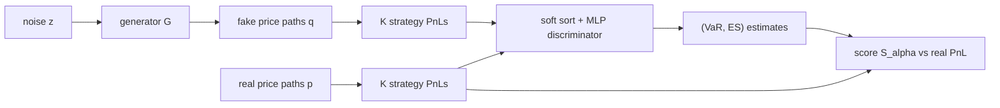

## Abstract

Market scenario generators are normally fitted with a global divergence and then checked against stylized facts. Tail-GAN builds the loss from what a risk desk needs instead: Value-at-Risk (VaR) and Expected Shortfall (ES) of the strategies it runs. The path law is projected onto the one-dimensional PnL laws of $K$ user-chosen static and dynamic strategies, and the generator is trained until the tails of those PnLs match. The signal is a score function that only the true (VaR, ES) pair minimises, evaluated through a discriminator that learns to estimate the pair from a sorted batch of PnLs. The paper adds an existence-type approximation theorem, an equivalence between a bi-level problem and the trained max–min game, and experiments on synthetic and Nasdaq intraday data. Out of sample, Tail-GAN comes close to the sampling floor on synthetic data and ties with historical simulation on real data.

**Keywords:** scenario generation, GAN, Value-at-Risk, Expected Shortfall, joint elicitability, scoring functions, dynamic trading strategies, eigenportfolios

## 1 Introduction

Banks estimate loss distributions by simulating joint price paths, and the Basel FRTB rules put ES under stress at the centre of that exercise. Parametric models are hard to specify for heterogeneous portfolios or intraday horizons, so practice drifts to Gaussian factor models. GAN simulators such as [Quant GANs](/blog/quant-gans/) and [SigCWGAN](/blog/conditional-sig-wgan/) are the data-driven alternative. The authors locate three failures in that line of work.

The first is the objective. Cross-entropy and Wasserstein losses are estimated from a sample, and <mark>a sample-based global divergence is dominated by typical observations, so events with 1–5% probability contribute almost nothing to the gradient</mark>. The second is validation: a scenario set cannot be eyeballed like an image, so it needs a quantitative acceptance test tied to the use case. The third is scope: most financial GANs the paper cites generate a single series, while risk numbers depend on cross-asset dependence.

## 2 Background

**VaR and ES.** For a PnL variable $X$ with law $\mu$ and level $\alpha\in(0,1)$, in the paper's sign convention (losses are negative PnL, so both quantities are negative for small $\alpha$):

$$
\mathrm{VaR}_\alpha(\mu)=\inf\{x:\mu((-\infty,x])\ge\alpha\},\qquad
\mathrm{ES}_\alpha(\mu)=\frac{1}{\alpha}\int_0^\alpha \mathrm{VaR}_\beta(\mu)\,d\beta .
\tag{1}
$$

VaR is where the tail starts; ES averages the quantiles below it and so measures how deep the tail is.

**Elicitability.** A statistic $T(\mu)$ is elicitable if $T(\mu)=\arg\min_x\int S(x,y)\,\mu(dy)$ for some score $S$; squared error elicits the mean and absolute error the median. Such statistics can be learned by empirical risk minimisation. ES alone is not elicitable, but Fissler and Ziegel showed that the pair (VaR, ES) is *jointly* elicitable, with a family of strictly consistent scores indexed by two functions $H_1,H_2$.

**Adversarial training.** The generator/critic setup and the WGAN baseline are covered in the [Quant GANs](/blog/quant-gans/) note; [SDE-GAN](/blog/neural-sde-gan/) covers path-space critics.

## 3 Method

> **Key idea.** Do not ask the discriminator whether a path "looks real". Make it an estimator of the VaR and ES of strategy PnLs, score its estimates against *real* PnL with a loss that only the true (VaR, ES) minimises, and train the generator until estimates computed from fake paths score as well as estimates computed from real ones.

### 3.1 Strategies as projections of the path measure

A scenario is a price array $p\in\mathbb{R}_+^{M\times T}$. A self-financing strategy $\varphi_k$ with non-anticipative holdings $\varphi_k(t_i,p)\in\mathbb{R}^M$ maps it to a terminal PnL:

$$
\Pi_k(p)=\sum_{i}\varphi_k(t_i,p)\cdot\big(p_{t_{i+1}}-p_{t_i}\big).
\tag{2}
$$

Holdings multiply price increments and are summed, so each strategy collapses the $M\times T$-dimensional law to a scalar one.

The paper states, without proof, that if two path measures give the same PnL law for *every* continuous bounded self-financing strategy then they are the same measure, and that <mark>static buy-and-hold portfolios alone cannot identify the path law, because they only see the terminal distribution</mark>. Since a scalar law is fixed by its quantiles, strategy loss quantiles are a complete feature set. That is exact for the full strategy class; keeping $K$ strategies and one or two quantile levels is the first approximation. Static portfolios probe cross-asset correlation; mean-reversion and trend-following strategies probe temporal dependence.

### 3.2 From the Fissler–Ziegel family to one usable score

The general strictly consistent score for a candidate pair $(v,e)$ against a realisation $x$ is

$$
S_\alpha(v,e,x)=\big(\mathbb{1}_{\{x\le v\}}-\alpha\big)\big(H_1(v)-H_1(x)\big)
+\frac{1}{\alpha}H_2'(e)\,\mathbb{1}_{\{x\le v\}}(v-x)+H_2'(e)(e-v)-H_2(e),
\tag{3}
$$

with $H_2$ strictly convex and $v\mapsto \tfrac{1}{\alpha}vH_2'(e)+H_1(v)$ strictly increasing. The first bracket is a generalised pinball loss that pins $v$ to the quantile; the remaining terms tie $e$ to the mean of the exceedances below $v$.

The authors take the quadratic choice of Acerbi and Szekely, $H_1(v)=-\tfrac{W_\alpha}{2}v^2$ and $H_2(e)=\tfrac{\alpha}{2}e^2$, which gives

$$
S_\alpha(v,e,x)=\frac{W_\alpha}{2}\big(\mathbb{1}_{\{x\le v\}}-\alpha\big)(x^2-v^2)
+\mathbb{1}_{\{x\le v\}}\,e\,(v-x)+\alpha e\Big(\frac{e}{2}-v\Big).
\tag{4}
$$

The first term handles the quantile, the second charges exceedances in proportion to $e$, the third is a quadratic regulariser in $e$; $W_\alpha$ is a fixed constant. Substituting into the monotonicity condition gives $e-W_\alpha v>0$, so (4) is a valid score only on the wedge $W_\alpha v\le e\le v\le 0$.

To see why the minimiser is the right pair, take the expectation $s_\alpha(v,e)=\int S_\alpha\,d\mu$ and differentiate. With $F$ the CDF of $\mu$, the appendix obtains

$$
\frac{\partial s_\alpha}{\partial v}=\big(F(v)-\alpha\big)\big(e-W_\alpha v\big),\qquad
\frac{\partial s_\alpha}{\partial e}=F(v)\,v-\int_{-\infty}^{v}x\,\mu(dx)+\alpha(e-v).
\tag{5}
$$

Inside the wedge the second factor of the $v$-derivative is positive, so it vanishes only when $F(v)=\alpha$, i.e. at VaR; plugging that into the $e$-derivative cancels the $\alpha v$ terms and leaves $e=\tfrac{1}{\alpha}\int_{-\infty}^{v}x\,\mu(dx)$, which is ES. Both steps are exact. The second derivatives are

$$
\frac{\partial^2 s_\alpha}{\partial v^2}=f(v)\big(e-W_\alpha v\big)-W_\alpha\big(F(v)-\alpha\big),\qquad
\frac{\partial^2 s_\alpha}{\partial e^2}=\alpha,\qquad
\frac{\partial^2 s_\alpha}{\partial v\,\partial e}=F(v)-\alpha,
\tag{6}
$$

where $f$ is the density. The paper proves the Hessian positive semi-definite for $v\le\mathrm{VaR}_\alpha$ inside the wedge and — if the density is bounded below just above VaR and $W_\alpha>1/\sqrt{\alpha}$ — on an open ball around the optimum, whereas $H_2=\exp$ is non-convex already for a uniform law. <mark>The score is picked for its optimisation landscape, not for statistical efficiency</mark>.

### 3.3 Discriminator, bi-level problem, and the game that is trained

In the population version the discriminator is a map from a PnL *law* to two numbers, and the ideal one minimises the expected score on real data:

$$
D^*\in\arg\min_{D}\ \frac{1}{K}\sum_{k=1}^{K}\mathbb{E}_{p\sim P_r}\Big[S_\alpha\big(D(\Pi_k\#P_r),\,\Pi_k(p)\big)\Big],
\tag{7}
$$

where $\Pi_k\#P_r$ is the law of strategy $k$'s PnL under the real measure $P_r$. By strict consistency $D^*$ is the (VaR, ES) functional itself. The generator then solves the upper-level problem

$$
G^*\in\arg\min_{G}\ \frac{1}{K}\sum_{k=1}^{K}\mathbb{E}_{p\sim P_r}\Big[S_\alpha\big(D^*(\Pi_k\#P_G),\,\Pi_k(p)\big)\Big],
\tag{8}
$$

i.e. tail statistics of *generated* PnL are scored against *real* PnL. Bi-level problems are awkward to train, so the lower level is moved into the objective with a multiplier $\lambda>0$, and laws are replaced by batches of $n$ samples:

$$
\max_{D}\min_{G}\ \frac{1}{Kn}\sum_{k=1}^{K}\sum_{j=1}^{n}
\Big[S_\alpha\big(D(\Pi_k(q_{1:n})),\Pi_k(p_j)\big)-\lambda\,S_\alpha\big(D(\Pi_k(p_{1:n})),\Pi_k(p_j)\big)\Big],
\tag{9}
$$

with $q_i=G(z_i)$. The second term rewards $D$ for estimating well from real batches; the first rewards it for scoring generated batches badly, which the generator counteracts.

Exact: the appendix proves the population game equivalent to (7)–(8) for any $\lambda>0$, *provided* $D$ is restricted to maps that can hit the true (VaR, ES) for at least one path measure and the noise has a density with finite first moment. Approximate: everything after — finite batches, a finite network for $D$, a relaxed sort, alternating gradient steps with no convergence result.

Because an empirical quantile is an order statistic, $D$ first sorts its input. The hard permutation is replaced by the NeuralSort relaxation of Grover et al.,

$$
\widehat{\Gamma}^{\tau}_{i,\cdot}(x)=\mathrm{softmax}\Big(\big[(n+1-2i)\,x-B(x)\mathbf{1}\big]/\tau\Big),\qquad B_{ij}(x)=|x_i-x_j|,
\tag{10}
$$

where row $i$ concentrates on the $i$-th largest entry of $x$ and $\tau>0$ is a temperature; the soft-sorted vector $\widehat{\Gamma}^{\tau}(x)\,x$ feeds an MLP. (The paper prints the row score without the factor $x$; I follow the NeuralSort form.)



The paper's own diagrams are [Fig. 2](https://arxiv.org/pdf/2203.01664#page=12) (full pipeline) and [Fig. 15](https://arxiv.org/pdf/2203.01664#page=37) (discriminator).

### 3.4 Intuition: a uniform PnL

Take $X\sim\mathrm{U}[-1,1]$ and $\alpha=0.05$, the case plotted in [Fig. 1 of the paper](https://arxiv.org/pdf/2203.01664#page=6). Then $F(v)=(v+1)/2$, so the first condition in (5) gives $v^*=-0.9$, and the second gives $e^*=\tfrac{1}{0.05}\int_{-1}^{-0.9}\tfrac{x}{2}dx=-0.95$, the midpoint of the tail as it should be. The $v$-gradient acts like a pinball loss: if more than 5% of real PnLs fall below $v$, $F(v)-\alpha>0$ and $v$ is pushed down.

Now evaluate (6) at the optimum with $W_\alpha=10$, the value implied by the paper's configuration table. The cross term vanishes, the $v$-curvature is $f(v^*)(e^*-W_\alpha v^*)=0.5\times8.05\approx4.0$, and the $e$-curvature is $\alpha=0.05$. The ratio of about 80 is my arithmetic, not the paper's, and it shows something the paper does not discuss: <mark>the ES direction is flat in proportion to $\alpha$</mark>, so the generator receives a much weaker signal about tail *depth* than about tail *location*, and the imbalance worsens as $\alpha$ shrinks.

### 3.5 Algorithm

```text
inputs: real paths p_1..p_N; strategies Pi_1..Pi_K; level alpha; lambda;
        batch size n; step sizes l_D, l_G
repeat for each epoch, for each minibatch B of n real paths:
    # discriminator step (ascent)
    z_1..z_n ~ P_z ;  q_i = G(z_i)
    for each k:
        (v_f, e_f) = D(softsort(Pi_k(q_1..q_n)))     # from fake batch
        (v_r, e_r) = D(softsort(Pi_k(p_i, i in B)))  # from real batch
        L_D += mean_{j in B}[ S(v_f, e_f, Pi_k(p_j)) - lambda * S(v_r, e_r, Pi_k(p_j)) ]
    D <- D + l_D * grad_D (L_D / K)
    # generator step (descent), fresh noise
    z'_1..z'_n ~ P_z ;  q'_i = G(z'_i)
    L_G = (1/K) sum_k mean_{j in B} S( D(softsort(Pi_k(q'_1..q'_n))), Pi_k(p_j) )
    G <- G - l_G * grad_G L_G

sampling: draw z ~ P_z, output the M x T array G(z); no discriminator needed.
```

One $D$ is shared across strategies. The generator's gradient flows through $D$, the soft sort *and* the PnL map, so every $\Pi_k$ must be differentiable in the path.

### 3.6 Theory and scaling

Assuming Lipschitz PnL maps, noise with a density on $\mathbb{R}^{M\times T}$ and a target with a finite moment of order $\beta>1$, the authors show that for any $\varepsilon$ there is a ReLU network $G$ of depth $O(\log\varepsilon^{-2})$ whose *gradient* $\nabla G$ pushes the noise to a law with VaR within $\varepsilon$ of the target; for ES the exponent becomes $\beta/(\beta-1)$, so heavier tails need larger networks. The argument: some empirical measure with $n=O(\varepsilon^{-2})$ atoms is close enough; semi-discrete optimal transport maps the noise onto it; and the transport potential is a maximum of $n$ affine functions, which a ReLU network of depth $\lceil\log n\rceil$ represents. It is an existence result, extended to Hölder-continuous risk functionals; multi-level training rests on joint elicitability of finite-support spectral risk measures.

For many assets the static benchmarks are eigenportfolios, the $L_1$-normalised principal components of the return correlation matrix $\hat\rho=Q\Lambda Q^{-1}$:

$$
w_i=\frac{h^{-1}q_i}{\lVert h^{-1}q_i\rVert_1},\qquad h=\mathrm{diag}(\sigma_1,\dots,\sigma_M),
\tag{11}
$$

where $q_i$ is the $i$-th eigenvector and $\sigma_m$ the empirical volatility of asset $m$. Dividing by volatility maps correlation-space weights to price space, the norm equalises capital, and the feature count grows linearly in $M$.

## 4 Implementation notes

| Item | Reported value |
|---|---|
| Generator | MLP, widths (1000, 128, 256, 512, 1024, 5×100), Leaky ReLU, batch norm, lr $10^{-6}$ |
| Discriminator | soft sort → MLP (1000, 256, 128, 2), Leaky ReLU, no batch norm, lr $10^{-7}$ |
| Noise | dimension 1000, Student-$t(5)$ |
| Batch / PnL samples per $D$ call | 1,000 |
| Score | $H_1(v)=-5v^2$ (so $W_\alpha=10$), $H_2(e)=\tfrac{\alpha}{2}e^2$, $\alpha=0.05$ |
| $\lambda$ | 1 (2 and 10 behave similarly; 100 degrades towards the no-discriminator variant) |
| Training strategies | 5 single-asset + 50 multi-asset static, 5 mean-reversion, 5 trend-following ($K=65$) |
| Epochs | curves run to 3,000 (synthetic) and 30,000 (intraday); convergence reported within 2,000 and 20,000 |
| Optimiser, sort temperature $\tau$, weight init | not stated |
| Rules and look-backs of the dynamic strategies | not stated in the paper (code is linked: `github.com/chaozhang-ox/Tail-GAN`) |
| Input scaling of prices, output constraint on $(v,e)$ | not stated |
| Hardware, wall-clock | not stated |

Easy to get wrong:

- **Sign and domain.** PnL is signed with losses negative, $\alpha$ is the *lower* tail, and (4) is a proper score only for $W_\alpha v\le e\le v\le0$. Nothing in the paper says how the unconstrained MLP output is kept in that wedge.
- **The constant $W_\alpha$.** The text prints $\mathrm{ES}/\mathrm{VaR}\ge W_\alpha\ge1$, but the monotonicity condition, the Gaussian example ($W_\alpha=5$) and the configuration ($W_\alpha=10$) all need $W_\alpha\ge\mathrm{ES}/\mathrm{VaR}$. I read the printed inequality as a slip and would implement the latter.
- **Discriminator ascent.** $D$ *maximises* (9), and the real minibatch is both its input and its scoring target.
- **Cost of the sort.** An $n\times n$ matrix per strategy per step: $10^6$ entries for each of 65 strategies.
- **Theory vs. code.** The theorem concerns $\nabla G$ with noise dimension $M\times T=500$; the code uses $G$ itself with 1000-dimensional noise, so the theorem motivates the MLP without covering it.
- **A parameter mismatch.** The negative AR(1) coefficient is $-0.15$ in the data appendix and $-0.12$ in the tables and legends.

## 5 Experiments

**Setup.** Synthetic: five correlated increments (i.i.d. Gaussian, AR(1) with $\phi=0.5$, AR(1) with negative $\phi$, GARCH(1,1) with $t(5)$ and with $t(10)$ noise), $T=100$, 50,000 training and 10,000 test scenarios. Real: LOBSTER mid-prices of AAPL, AMZN, GOOG, JPM, QQQ, 10:00–15:30, sampled every 9 seconds into 100-step (15-minute) paths taken every minute; November 2019 for training ($N=6300$), first week of December for testing. Baselines: Tail-GAN-Raw (single-asset buy-and-hold only), Tail-GAN-Static (static portfolios only), a WGAN on returns, historical simulation (HSM). RE(1000) is the mean relative error of VaR and ES over test strategies using 1000 generated paths; SE(1000), or "Oracle", is the same error for 1000 draws from the truth, i.e. the floor.

Main result, out-of-sample relative error in %, mean (std) over five seeds (Tables 1 and 8):

| Model | Synthetic | Intraday Nasdaq |
|---|---|---|
| Sampling floor (SE / Oracle) | 3.0 (2.2) | 2.4 (1.6) |
| HSM | 3.4 (2.6) | 10.4 (3.6) |
| Tail-GAN-Raw | 83.3 (3.0) | 112.8 (7.8) |
| Tail-GAN-Static | 86.7 (2.5) | 75.8 (8.0) |
| WGAN | 21.3 (2.2) | 26.9 (1.7) |
| **Tail-GAN** | **4.6 (1.6)** | **10.1 (1.1)** |

Ablations and variants (Tables 2–6 and 9; synthetic unless noted):

| Experiment | Setting | Result |
|---|---|---|
| Risk level, OOS error at $\alpha=$ 1 / 5 / 10% | SE(1000) | 4.3 / 3.0 / 2.9 |
| | Tail-GAN(5%) | 6.4 / 4.6 / 3.7 |
| | Tail-GAN(10%) | 7.0 / 4.8 / 3.5 |
| | **Tail-GAN(1%&5%)** | **5.9 / 4.2 / 3.5** |
| No discriminator (plug-in VaR/ES) | OOS error | 7.2 (0.2) vs **4.6 (1.6)** |
| | generalisation gap $d_q$ | 0.581 (0.420) vs **0.214 (0.178)** |
| | generalisation gap $d_s$ | 0.032 (0.026) vs **0.017 (0.014)** |
| Rejection rate, Kupiec coverage test | HSM / Raw / Static / Tail-GAN / WGAN | 17.9 / 53.6 / 22.9 / **17.1** / 44.9 |
| Rejection rate, score-based test | same order | **0.00** / 21.3 / 15.4 / **0.00** / 11.4 |
| 20 synthetic assets, 90 test strategies | HSM / 50 random / 20 eigen | 3.5 (2.3) / 10.4 (1.8) / **6.9 (1.5)** |
| 20 S&P 500 stocks | Oracle / HSM / random / eigen | 2.2 (1.7) / 25.9 (5.1) / 31.0 (1.0) / **25.6 (1.0)** |

**Claim-by-claim.**

- *Dynamic strategies are needed.* Strongly supported. All variants reach in-sample error below 10% (synthetic) and 5% (intraday), but <mark>only the version trained with dynamic strategies generalises to unseen strategies: 4.6% against 83–87%</mark>. The rank-frequency plots ([Fig. 4](https://arxiv.org/pdf/2203.01664#page=18), [Fig. 11](https://arxiv.org/pdf/2203.01664#page=25)) show the ablations understating mean-reversion risk and overstating trend-following risk at 5%.
- *A tail-aware loss beats a Wasserstein critic.* Supported on both data sets (21.3 → 4.6, 26.9 → 10.1), with a qualification from the paper's own footnote: on synthetic data the WGAN's failure is concentrated on the GARCH component with $t(5)$ noise.
- *Tail-GAN best reproduces correlations and autocorrelations.* Half supported. Cross-correlation distance is clearly lowest (1.00 vs 6.11 for WGAN synthetic; 1.13 vs 7.54 intraday), but for autocorrelation the figures' own numbers favour WGAN (2.41 vs 2.73; 1.86 vs 2.33), and intraday Tail-GAN-Static (2.13) also beats the full model.
- *The discriminator improves generalisation.* Moderately supported: error drops from 7.2% to 4.6%, but the generalisation-gap standard deviations are as large as the means, and the plug-in variant is far more stable across seeds (0.2 vs 1.6).
- *Accuracy comparable to the floor.* True on synthetic data (4.6 vs 3.0). On real data <mark>Tail-GAN (10.1%) is statistically indistinguishable from plain historical simulation (10.4%)</mark> and four times the floor.
- *Eigenportfolios make it scalable.* Supported relative to random portfolios, but in absolute terms <mark>on 20 synthetic assets HSM (3.5%) beats the best Tail-GAN (6.9%), and on 20 real stocks every method sits near 25% against a 2.2% floor</mark>.
- *No evidence:* robustness to $\lambda$ and to overlapping windows is asserted without numbers, and no experiment links the approximation theorem to the trained network.

## 6 Limitations

**Stated by the authors**

- Only price histories are used; order-book data is named as the next input.
- Architectures are deliberately plain MLPs, and hypothesis tests run only on synthetic data because they need the true law.
- Large $\lambda$ hurts and behaves like the no-discriminator variant.

**My reading**

- The gap between 10% and the 2.4% floor on real data is unexplained. HSM suffers it equally, which points at drift between November and the December test week — something an unconditional, fixed-horizon generator cannot address.
- Out-of-sample strategies are not listed for the five-asset experiments, so how far "unseen" is from "seen" cannot be judged.
- Training windows overlap by 14 of 15 minutes, so the effective sample is far smaller than 6,300 and batches are not i.i.d., which the consistency argument assumes.
- The flat ES direction (Section 3.4) and the $\lfloor\alpha n\rfloor$ tail points per batch make levels below 1% doubtful; none is tested.
- No convergence analysis of the max–min dynamics; learning rates of $10^{-6}$–$10^{-7}$ over up to 20,000 epochs hint at fragile training.
- Five seeds, and no financial generator other than a vanilla WGAN as competitor — one that also lacks the strategy features.

## 7 Extensions

**What was built on this.** In this collection the relatives are predecessors or parallels, not descendants: [Quant GANs](/blog/quant-gans/) (the single-asset line Tail-GAN-Raw imitates), [SigCWGAN](/blog/conditional-sig-wgan/) (a bespoke conditional path-space loss, cited as not tail-focused) and [Deep Hedging](/blog/deep-hedging/), which also judges models through strategy PnL. The paper cites same-group GANs with task-specific losses (Fin-GAN for forecasting, VolGAN for implied-volatility surfaces) and a limit-order-book simulator as the intended next step.

**Open problems.**

- How many benchmark strategies, and which, suffice for a given downstream book?
- Conditional, non-stationary targets (conditional VaR/ES) and extreme levels, where score curvature and batch order statistics both degenerate.
- Whether the trained $D$ is actually close to the (VaR, ES) functional; the paper never reports it.

**Research directions.** *These are ideas, not results — none has been run.*

1. **Tail-score fine-tuning of a diffusion generator.** *Hypothesis:* adding score (4) on strategy PnLs as an auxiliary loss to a time-series diffusion model ([Diffusion-TS](/blog/diffusion-ts/), [CSDI](/blog/csdi/)-style) lowers RE at 1–5% without damaging autocorrelation. *Data:* the paper's synthetic process (known truth), then intraday mid-prices. *Baseline:* the same model without the term, Tail-GAN, HSM. *Metric:* RE(1000) against SE(1000), score-test rejection rate, autocorrelation distance. *Likely failure:* VaR and ES are batch statistics, so gradients must pass through a whole batch of sampling chains — too costly without a few-step sampler ([Consistency Models](/blog/consistency-models/)).
2. **Is the real-data gap non-stationarity?** *Hypothesis:* conditioning the generator on trailing realised volatility removes a large part of the 10% vs 2.4% gap. *Data:* the same intraday set over more months. *Baseline:* unconditional Tail-GAN, volatility-rescaled historical simulation. *Metric:* RE by volatility regime, conditional coverage tests. *Likely failure:* few tail observations per regime, and $D$'s batch stops being a sample from one law.
3. **Levels below 1%.** *Hypothesis:* the $\alpha$-proportional curvature in $e$ stalls ES learning, and rescaling $H_2$ or splicing an EVT tail extrapolation into $D$ fixes it. *Data:* synthetic GARCH-$t$ paths with brute-force truth. *Baseline:* Tail-GAN(1%&5%). *Metric:* RE at 0.1 / 0.5 / 1% relative to SE. *Likely failure:* with $n=1000$ there is a single tail point at 0.1%, so batches must grow while the soft sort scales as $n^2$.

## 8 Takeaways

- A generative loss can be built from a statistic instead of a distribution if the statistic is elicitable; (VaR, ES) is jointly so, and the quadratic Acerbi–Szekely score has a convex neighbourhood around the optimum.
- <mark>Trading strategies act as financially meaningful test functions on path space</mark>; dynamic ones are required to pin down temporal dependence, and the Raw/Static ablations show how badly things fail without them.
- Report the sampling floor and a historical-simulation baseline: on real data the GAN only matches HSM, and both are far from the floor.
- For diffusion-based market simulators the transferable pieces are the protocol — strategy-PnL tail error against SE(N) — and the consistent score as a candidate auxiliary loss. The paper tests neither there.

## References

1. R. Cont, M. Cucuringu, R. Xu, C. Zhang. *Tail-GAN: Learning to Simulate Tail Risk Scenarios.* Management Science 72(4):2917–2936, 2026. doi:10.1287/mnsc.2023.00936. arXiv:2203.01664.
2. T. Fissler, J. F. Ziegel. *Higher order elicitability and Osband's principle.* Annals of Statistics, 2016.
3. C. Acerbi, B. Szekely. *Back-testing expected shortfall.* Risk, 2014.
4. A. Grover, E. Wang, A. Zweig, S. Ermon. *Stochastic optimization of sorting networks via continuous relaxations.* ICLR 2019.
5. M. Wiese, R. Knobloch, R. Korn, P. Kretschmer. *Quant GANs: Deep Generation of Financial Time Series.* arXiv:1907.06673.
