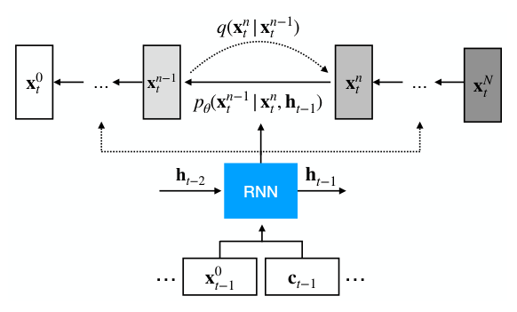
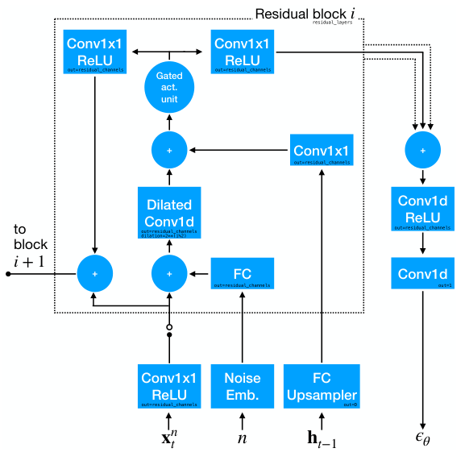
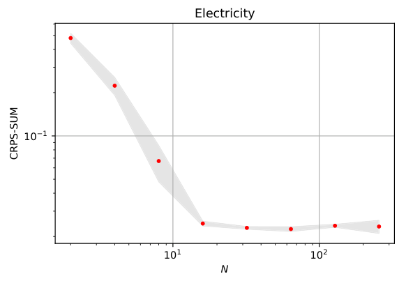
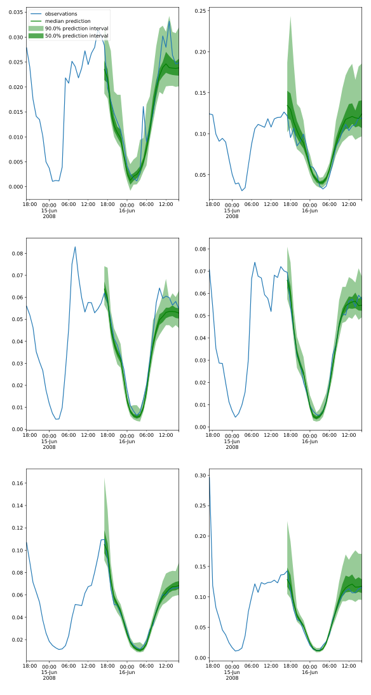

## Abstract

TimeGrad is a forecaster for high-dimensional multivariate time series that replaces the usual parametric output head — a Gaussian, a low-rank Gaussian copula, a normalizing flow — with a conditional denoising diffusion model. A recurrent network reads the history and covariates and compresses them into a hidden state; a DDPM noise-prediction network conditioned on that state then generates the vector of all series at the next time step by running a reverse chain from white noise. Sampling is autoregressive in time: each generated vector is fed back into the RNN. Training needs only the noise-matching loss of Ho et al. at one random noise level per time step, so the denoiser is never unrolled during training. On six public benchmarks with up to 2,000 correlated dimensions the model reports the best CRPS-sum on five, losing only on the 8-dimensional exchange-rate set. The paper is short and mostly an engineering combination, but it is the first clean statement of "diffusion as the emission distribution of a sequence model."

**Keywords:** probabilistic forecasting, multivariate time series, denoising diffusion, autoregressive RNN, energy-based models, CRPS-sum

## 1 Introduction

A probabilistic forecaster for $D$ dependent series must output a *joint* distribution over $\mathbb{R}^D$ at every future step. The authors walk through why the standard choices are uncomfortable, and the argument is worth keeping because it still frames the design space:

- A factorized output (independent Gaussians per series) shares parameters across series through the temporal component but ignores dependence in the emissions.
- A full-covariance Gaussian adds $O(D^2)$ parameters and costs $O(D^3)$ in the loss, and even then captures only second-order dependence. Low-rank-plus-diagonal approximations — the Vec-LSTM and GP-copula family of Salinas et al. — make this practical while keeping the Gaussian shape.
- Normalizing flows are flexible, but they constrain the network (a tractable Jacobian determinant) and, being continuous maps of a connected base density, assign spurious mass between disconnected modes.

Their claim is that <mark>energy-based and score-based models put almost no structural restriction on the function approximator</mark>, and that the DDPM recipe finally makes them trainable. TimeGrad is then the obvious construction: keep the autoregressive RNN that extrapolates well (DeepAR), swap the emission head for a conditional diffusion model. The framing is looser than it sounds — what is trained is a noise predictor, and no energy is ever evaluated — but the modularity is real.

## 2 Background

The paper uses the discrete-time DDPM of Ho et al. with $N$ noise levels; the [DDPM note](/blog/ddpm/) has the full derivation. A fixed forward chain adds Gaussian noise with schedule $\beta_1,\dots,\beta_N$; with $\alpha_n=1-\beta_n$ and $\bar\alpha_n=\prod_{i\le n}\alpha_i$, any level is reachable in closed form from the clean vector:

$$
q(\mathbf{x}^n\mid\mathbf{x}^0)=\mathcal{N}\!\left(\mathbf{x}^n;\ \sqrt{\bar\alpha_n}\,\mathbf{x}^0,\ (1-\bar\alpha_n)\mathbf{I}\right).\tag{1}
$$

Note the notation before going further: here the *superscript* $n$ is the noise index and the *subscript* $t$ is time. Most diffusion papers use $t$ for noise, so every equation below reads backwards from habit.

## 3 Method

> **Key idea.** Factorize the forecast distribution autoregressively over time, and let every factor $p_\theta(\mathbf{x}^0_t\mid\mathbf{h}_{t-1})$ be a conditional DDPM whose only link to the past is an RNN hidden state $\mathbf{h}_{t-1}$.

### 3.1 Autoregressive factorization with an RNN state

Given a context window $[1,t_0)$ and a prediction window $[t_0,T]$, with covariates $\mathbf{c}_t$ known for all times, the target factorizes exactly by the chain rule:

$$
q\!\left(\mathbf{x}^0_{t_0:T}\mid\mathbf{x}^0_{1:t_0-1},\mathbf{c}_{1:T}\right)=\prod_{t=t_0}^{T}q\!\left(\mathbf{x}^0_t\mid\mathbf{x}^0_{1:t-1},\mathbf{c}_{1:T}\right).\tag{2}
$$

The first approximation enters here: the unbounded history $\mathbf{x}^0_{1:t-1}$ is replaced by a fixed-width recurrent summary,

$$
\mathbf{h}_t=\mathrm{RNN}_\theta\!\left(\mathrm{concat}(\mathbf{x}^0_t,\mathbf{c}_t),\ \mathbf{h}_{t-1}\right),\qquad\mathbf{h}_0=\mathbf{0},\tag{3}
$$

so that (2) becomes $\prod_{t=t_0}^{T}p_\theta(\mathbf{x}^0_t\mid\mathbf{h}_{t-1})$ with $\theta$ covering both the RNN and the denoiser. Everything downstream is a statement about a single factor.


*Source: Rasul et al., arXiv:2101.12072, Fig. 1, CC BY 4.0.*

### 3.2 From the variational bound to the training loss

Per factor, the negative log-likelihood is bounded by the usual diffusion ELBO, which the Markov property rewrites as a sum of Gaussian KL terms. With the reverse variance fixed to the forward posterior value $\tilde\beta_n=\frac{1-\bar\alpha_{n-1}}{1-\bar\alpha_n}\beta_n$ and the mean reparameterized through a noise predictor, each KL term becomes a weighted regression of $\epsilon_\theta$ onto the injected noise:

$$
\mathbb{E}_{\mathbf{x}^0,\boldsymbol\epsilon}\left[\frac{\beta_n^2}{2\Sigma_\theta\,\alpha_n(1-\bar\alpha_n)}\left\|\boldsymbol\epsilon-\epsilon_\theta\!\left(\sqrt{\bar\alpha_n}\mathbf{x}^0+\sqrt{1-\bar\alpha_n}\boldsymbol\epsilon,\ n\right)\right\|^2\right].\tag{4}
$$

Steps to here are exact given the Gaussian parameterization. The step that follows is not. TimeGrad trains the *unweighted* conditional version,

$$
\mathcal{L}_t=\mathbb{E}_{\mathbf{x}^0_t,\boldsymbol\epsilon,n}\left[\left\|\boldsymbol\epsilon-\epsilon_\theta\!\left(\sqrt{\bar\alpha_n}\,\mathbf{x}^0_t+\sqrt{1-\bar\alpha_n}\,\boldsymbol\epsilon,\ \mathbf{h}_{t-1},\ n\right)\right\|^2\right],\tag{5}
$$

with $n\sim\mathrm{Uniform}\{1,\dots,N\}$ and $\boldsymbol\epsilon\sim\mathcal{N}(\mathbf{0},\mathbf{I})$. The paper presents (5) as what (4) reduces to "when we choose the variance to be $\Sigma_\theta=\tilde\beta_n$." <mark>That is not quite right: setting $\Sigma_\theta=\tilde\beta_n$ leaves the weight $\beta_n^2/(2\tilde\beta_n\alpha_n(1-\bar\alpha_n))$, which is not 1.</mark> Dropping it is Ho et al.'s deliberate reweighting — it down-weights the high-noise levels and empirically improves sample quality — not an algebraic identity. The distinction matters for anyone who wants to report a likelihood: TimeGrad optimizes a reweighted bound, so its training loss is not an ELBO.

Because the RNN is teacher-forced on real data and only one noise level is drawn per step, <mark>training costs one denoiser call per time step — the diffusion chain is never unrolled</mark>, which the authors contrast with stacked-bijection flows.

### 3.3 Inference

The RNN is run over the last context window to produce a warm-up state $\mathbf{h}_T$. Then, for each future step, the reverse chain runs $n=N,\dots,1$:

$$
\mathbf{x}^{n-1}_t=\frac{1}{\sqrt{\alpha_n}}\left(\mathbf{x}^n_t-\frac{\beta_n}{\sqrt{1-\bar\alpha_n}}\,\epsilon_\theta(\mathbf{x}^n_t,\mathbf{h}_{t-1},n)\right)+\sqrt{\Sigma_\theta}\,\mathbf{z},\tag{6}
$$

with $\mathbf{z}\sim\mathcal{N}(\mathbf{0},\mathbf{I})$ for $n>1$, $\mathbf{z}=\mathbf{0}$ at the last step, and $\Sigma_\theta=\tilde\beta_n$. The resulting $\mathbf{x}^0_t$ is pushed through (3) with the next covariates to obtain $\mathbf{h}_t$, and the loop repeats to the horizon. Repeating the whole rollout ($S=100$ trajectories) gives empirical quantiles, so the cost is <mark>horizon × $N$ sequential network evaluations per sample path</mark>, or 2,400–3,000 per path at the published settings.

### 3.4 Intuition: what the diffusion head buys at $D=1$

Strip the model to one series, no covariates, and suppose the true next-step law given the past is a two-component mixture — a calm regime and a jump regime. A Gaussian head must pick one mean and one variance, so it fattens the variance and puts most of its mass between the two modes, where the data almost never lands; CRPS punishes that. A normalizing-flow head does better but must connect the modes with a continuous map of a connected base density, so it leaves a ridge of spurious density in the gap. The diffusion head learns only $\epsilon_\theta(x^n,h,n)$, a rescaled score of the noise-perturbed mixture. At large $n$ that score points toward the blurred single blob; as $n$ falls, the perturbed density separates into two basins and the score field develops a watershed between them, so each sample path commits to one mode. <mark>Nothing in the parameterization needs to know the density is bimodal — the multimodality is carried by the sampling trajectory, not by the functional form.</mark> That is the entire argument for putting a diffusion model where a Gaussian used to be, and it is also why the payoff should be largest where the one-step conditional is genuinely non-Gaussian.

### 3.5 Algorithm

```text
train(series X, covariates C, context t0, horizon T, steps N, schedule ab[1..N]):
  repeat
    pick a random window; h <- 0
    for t = 1 .. t0-1:                       # warm-up on the context
      h <- RNN(concat(x[t], c[t]), h)
    for t = t0 .. T:                         # teacher forcing on real data
      n <- Uniform{1..N};  e <- N(0, I)
      xn <- sqrt(ab[n])*x[t] + sqrt(1-ab[n])*e
      accumulate || e - eps_th(xn, h, n) ||^2
      h  <- RNN(concat(x[t], c[t]), h)       # real x[t], not a sample
    step on the accumulated gradient
  until early stopping on validation

sample(h_T, covariates C, horizon H, paths S):
  for s = 1 .. S:
    h <- h_T
    for t = T+1 .. T+H:
      z <- N(0, I)
      for n = N down to 1:
        z <- (z - b[n]/sqrt(1-ab[n]) * eps_th(z, h, n)) / sqrt(a[n])
        if n > 1: z <- z + sqrt(bt[n]) * N(0, I)      # bt = posterior variance
      x[t] <- z
      h    <- RNN(concat(x[t], c[t]), h)              # generated x[t] fed back
  return empirical quantiles over the S paths
```

The asymmetry between the two loops is the whole cost story, and also the whole exposure-bias story: the RNN only ever sees real inputs during training and only ever sees its own samples at test time.

### 3.6 Scaling, covariates, and the denoiser

Each series is divided by its context-window mean (or by 1 if that mean is zero) before entering the model, and samples are multiplied back afterwards — the DeepAR trick, which the authors note is not replaceable by an input-to-output shortcut of the LSTNet kind. Traffic, whose values already live in $(0,1)$, needs no scaling. Covariates are time features (hour of day, day of week), lag features chosen by the data frequency, and learned embeddings for categorical or time-independent features; all are known over the forecast window by construction.

The denoiser treats the $D$ series as the "spatial" axis of a 1-D signal: eight WaveNet/DiffWave-style residual blocks with gated activations $\sigma(\cdot)\odot\tanh(\cdot)$, bidirectional dilated convolutions of filter size 3 with dilation $2^{\,i\bmod 2}$, circular padding so the spatial size stays $D$, 8 residual channels, a Transformer-style Fourier embedding of $n$ into $\mathbb{R}^{32}$ with $N_{\max}=500$, and an upsampled projection of $\mathbf{h}_{t-1}$ added inside every block. The eight skip outputs are summed and projected down to a $D$-vector.


*Source: Rasul et al., arXiv:2101.12072, Fig. 2, CC BY 4.0.*

## 4 Implementation notes

| Item | As reported |
|---|---|
| Diffusion steps $N$ | 100 |
| Noise schedule | linear, $\beta_1=10^{-4}$ to $\beta_N=0.1$ |
| RNN | 2-layer LSTM, $\mathbf{h}_t\in\mathbb{R}^{40}$ |
| Denoiser | 8 residual blocks, 8 residual channels, dilation $2^{i\bmod 2}$, circular padding |
| Noise-level embedding | Fourier positional, $\mathbb{R}^{32}$, $N_{\max}=500$ |
| Optimizer / batch | Adam, lr $10^{-3}$, batch 64 (random, possibly overlapping windows) |
| Context length | equal to the prediction length |
| Sample paths $S$ | 100, rolling-window evaluation |
| Epochs | early stopping on a validation split the size of the test set |
| Compute | one Nvidia V100, 16 GB |
| Per-dataset tuning | none reported beyond epoch count |

The same hyperparameters are used on all six datasets, which is the paper's strongest methodological move and also the reason its numbers should be read as a floor rather than a ceiling. Three details are easy to lose when reimplementing. First, the context length equals the prediction length, so for Exchange and Wikipedia the model conditions on only 30 steps. Second, the residual channel count is 8 — an unusually thin network, with a 40-unit hidden state feeding it. Third, `Traffic` is exempt from mean-scaling; applying the scaler to data already in $(0,1)$ changes the results. The number of training epochs per dataset is not stated, only the early-stopping rule.

## 5 Experiments

**Setup.** Six public datasets preprocessed exactly as in Salinas et al. (2019): Exchange ($D{=}8$, daily, 6,071 training steps, 30-step horizon), Solar (137, hourly, 7,009, 24), Electricity (370, hourly, 5,833, 24), Traffic (963, hourly, 4,001, 24), Taxi (1,214, half-hourly, 1,488, 24), Wikipedia (2,000, daily, 792, 30). The metric is CRPS-sum: CRPS of the distribution of $\sum_i x^0_{i,t}$, averaged over the horizon and normalized, computed from the empirical CDF of the 100 sample paths. It is a proper scoring rule and needs no analytic likelihood, which is why it is usable across this baseline set — but it scores an aggregate, a point I return to below.

**Main result** (test CRPS-sum, lower is better; TimeGrad over 10 retrainings):

| Method | Exchange | Solar | Electricity | Traffic | Taxi | Wikipedia |
|---|---|---|---|---|---|---|
| VES | 0.005±0.000 | 0.9±0.003 | 0.88±0.0035 | 0.35±0.0023 | – | – |
| VAR | 0.005±0.000 | 0.83±0.006 | 0.039±0.0005 | 0.29±0.005 | – | – |
| VAR-Lasso | 0.012±0.0002 | 0.51±0.006 | 0.025±0.0002 | 0.15±0.002 | – | 3.1±0.004 |
| GARCH | 0.023±0.000 | 0.88±0.002 | 0.19±0.001 | 0.37±0.0016 | – | – |
| KVAE | 0.014±0.002 | 0.34±0.025 | 0.051±0.019 | 0.1±0.005 | – | 0.095±0.012 |
| Vec-LSTM ind-scaling | 0.008±0.001 | 0.391±0.017 | 0.025±0.001 | 0.087±0.041 | 0.506±0.005 | 0.133±0.002 |
| Vec-LSTM lowrank-Copula | 0.007±0.000 | 0.319±0.011 | 0.064±0.008 | 0.103±0.006 | 0.326±0.007 | 0.241±0.033 |
| GP scaling | 0.009±0.000 | 0.368±0.012 | 0.022±0.000 | 0.079±0.000 | 0.183±0.395 | 1.483±1.034 |
| GP Copula | 0.007±0.000 | 0.337±0.024 | 0.0245±0.002 | 0.078±0.002 | 0.208±0.183 | 0.086±0.004 |
| Transformer-MAF | 0.005±0.003 | 0.301±0.014 | 0.0207±0.000 | 0.056±0.001 | 0.179±0.002 | 0.063±0.003 |
| **TimeGrad** | 0.006±0.001 | **0.287±0.02** | **0.0206±0.001** | **0.044±0.006** | **0.114±0.02** | **0.0485±0.002** |

Claim by claim.

*"New state of the art on all but the smallest dataset."* Supported in rank, uneven in margin. <mark>Taxi (0.179 → 0.114) and Wikipedia (0.063 → 0.0485) are decisive; Traffic (0.056 → 0.044) is clear; Electricity (0.0207 vs 0.0206) is a tie inside the reported spread, and Solar's ±0.02 overlaps Transformer-MAF's 0.301.</mark> Counting datasets, the score is five wins; counting statistically separated wins, three. On Exchange, VES and VAR both report 0.005 against TimeGrad's 0.006 — a linear model beats the diffusion model on the only financial series in the set.

*"Flows struggle with disconnected modes, EBMs do not."* This is asserted with citations, not tested. No experiment isolates multimodality; the §3.4 argument is mine, not the paper's, and the Transformer-MAF comparison confounds the emission head with the sequence encoder (Transformer vs LSTM), so the table cannot attribute the gap to either.

*"$N$ can be reduced to ≈10 without significant loss; optimal near 100."* Supported by the one ablation in the paper: Electricity, $N=2,4,8,\dots,256$, five runs each, everything else fixed. The curve drops steeply to roughly $N\approx16$ and then flattens, with no benefit beyond 100. The authors report similar behaviour on other datasets without showing it. <mark>This is the most practically useful number in the paper: it turns the sampler budget into a tunable knob rather than a fixed 100× price.</mark>


*Source: Rasul et al., arXiv:2101.12072, Fig. 3, CC BY 4.0.*


*Source: Rasul et al., arXiv:2101.12072, Fig. 4, CC BY 4.0.*

Figure 4 is also quiet evidence against one of the architectural choices: neighbouring dimensions of the Traffic panel differ by an order of magnitude in scale, which is exactly the situation in which a shared dilated convolution along the series axis is a questionable prior — a point the related-work section concedes when it distinguishes multivariate panels from waveform data.

## 6 Limitations

**Stated by the authors.**

- Sampling loops $N$ times over $\epsilon_\theta$ per step, unlike training; they point at WaveGrad's L1-loss-plus-schedule trick and at [DDIM](/blog/ddim/)'s non-Markovian chains as remedies, without running either.
- Neighbouring entities in a multivariate panel are ordered arbitrarily and can differ wildly in scale, unlike the waveform data the denoiser was designed for.
- For long sequences the RNN should probably be a Transformer; where the dependency structure is known, a graph network would encode it better.

**My reading.**

- Exposure bias is unexamined. The RNN is teacher-forced in training and consumes its own samples at inference; horizons here are only 24–30 steps, so nothing tests whether the error compounds.
- A 40-dimensional hidden state is the sole channel between the past and a 2,000-dimensional emission. No ablation on its width, on the RNN itself, on the scaling trick, or on the convolutional denoiser — only on $N$.
- <mark>CRPS-sum scores the distribution of the *aggregate*, so a model can win it while getting the cross-series dependence wrong.</mark> Per-dimension CRPS is defined in §4.1 but never tabulated. For a 2,000-dimensional problem this is the metric gap that matters most.
- The table caption says "standard error", the body text says "empirical standard deviations". Ten runs makes the two differ by a factor of about three, so several of the ties above may be closer or farther than they look.
- No wall-clock or throughput number anywhere, despite the paper's own emphasis on the training/sampling cost asymmetry.
- The energy-based framing is decorative: what is trained is a noise predictor with a reweighted bound (§3.2), and no energy, likelihood or partition function is computed.

## 7 Extensions

**What was built on this.** The paper's own future-work list has largely been executed by others. [CSDI](/blog/csdi/), published later the same year, attacks the structural weakness directly: it drops the RNN for masked two-axis attention, which makes the model non-autoregressive over the horizon and lets the same network do imputation and interpolation. Its Table 5 puts CSDI ahead of TimeGrad on electricity and traffic and behind on taxi. [TSDiff](/blog/tsdiff/) goes further and trains a single unconditional model, obtaining forecasts by self-guidance at sampling time; [Diffusion-TS](/blog/diffusion-ts/) adds an interpretable decomposition. The Transformer-encoder substitution the authors suggest became standard (ScoreGrad and TimeDiff are the usual references; from general knowledge, unverified). Faster sampling arrived through [DDIM](/blog/ddim/) and the schedule work in [Improved DDPM](/blog/improved-ddpm/).

**Open problems.** Evaluating multivariate forecasts on dependence rather than on an aggregate. Whether autoregressive rollout with a generative emission degrades over long horizons, and by how much. A principled ordering of the series axis, or an architecture that does not need one. Discrete-valued panels — Taxi and Wikipedia are counts, modelled here as continuous.

**Research directions.** *These are ideas, not results — none has been run.*

1. **Where does the flexible head actually pay?** *Hypothesis*: TimeGrad's gain over a Gaussian or copula head is monotone in the non-Gaussianity of the one-step conditional, so it should be predictable in advance from the residuals of a fitted VAR. *Data*: the six benchmarks plus synthetic panels with a tunable mixture weight on a jump component. *Baseline*: the same LSTM with a low-rank Gaussian head. *Metric*: CRPS-sum gap against excess kurtosis and a bimodality statistic of the VAR residuals. *Likely failure*: on real data the head and the encoder cannot be disentangled, and the synthetic panels will be too easy for both models.
2. **Return-distribution forecasting with a diffusion emission.** *Hypothesis*: the Exchange result is a scale problem, not a distribution problem — on equity returns, where the conditional mean is near zero but conditional variance and tails are strongly predictable, a diffusion head should beat a Gaussian-GARCH head on tail-sensitive scores even while tying on CRPS. *Data*: daily returns for a few hundred liquid names, split by regime. *Baseline*: multivariate GARCH with a $t$ copula; the [SigCWGAN](/blog/conditional-sig-wgan/) family as a generative comparator. *Metric*: per-name quantile loss at 1% and 5%, plus an energy score on the joint return vector; CRPS-sum reported only as a sanity check. *Likely failure*: 100 paths is far too few for a 1% tail, and the DeepAR mean-scaler is meaningless for zero-mean returns, so the scaling step would have to be redesigned around realized volatility.
3. **Few-step autoregressive diffusion.** *Hypothesis*: since Figure 3 shows the accuracy plateau starting near $N\approx16$, a DDIM sampler or a distilled two-step student should cut the horizon × $N$ × $S$ cost by an order of magnitude at unchanged CRPS-sum. *Data*: Electricity and Traffic. *Baseline*: the published $N=100$ ancestral sampler. *Metric*: CRPS-sum versus total function evaluations. *Likely failure*: deterministic samplers reduce the spread of the generated paths, and in an autoregressive rollout that under-dispersion compounds step by step — the failure would show up at the end of the horizon, not the start.

## 8 Takeaways

- TimeGrad is DeepAR's autoregressive RNN with a conditional DDPM as the per-step emission; the whole conditioning channel is a 40-dimensional hidden state.
- Training uses the unweighted noise-matching loss at one random noise level per step. That reweighting is Ho et al.'s empirical choice, not a consequence of fixing $\Sigma_\theta=\tilde\beta_n$ as the paper's wording suggests, so the training objective is not an ELBO.
- All the cost sits at inference: horizon × $N$ sequential denoiser calls per path, times 100 paths, with no timings reported.
- Around 10–16 diffusion steps already recover most of the accuracy on Electricity, so the sampler budget is a knob and not a fixed price.
- Gains are largest on high-dimensional, strongly seasonal data (Taxi, Traffic, Wikipedia) and vanish on the low-dimensional Exchange set.
- For financial series the Exchange row is the relevant caution: <mark>a flexible one-step emission does not help when the conditional mean is essentially unpredictable and the score is dominated by scale</mark>. The pattern — sequence encoder → conditional diffusion head — remains a reasonable template for return-distribution or scenario generation, but it needs evaluation on dependence and tails, which CRPS-sum does not provide.

## References

1. Rasul, K., Seward, C., Schuster, I., Vollgraf, R. *Autoregressive Denoising Diffusion Models for Multivariate Probabilistic Time Series Forecasting.* ICML 2021. [arXiv:2101.12072](https://arxiv.org/abs/2101.12072)
2. Ho, J., Jain, A., Abbeel, P. *Denoising Diffusion Probabilistic Models.* NeurIPS 2020. [arXiv:2006.11239](https://arxiv.org/abs/2006.11239)
3. Salinas, D., Bohlke-Schneider, M., Callot, L., Medico, R., Gasthaus, J. *High-Dimensional Multivariate Forecasting with Low-Rank Gaussian Copula Processes.* NeurIPS 2019.
4. Kong, Z., Ping, W., Huang, J., Zhao, K., Catanzaro, B. *DiffWave: A Versatile Diffusion Model for Audio Synthesis.* ICLR 2021.
5. Salinas, D., Flunkert, V., Gasthaus, J., Januschowski, T. *DeepAR: Probabilistic Forecasting with Autoregressive Recurrent Networks.* International Journal of Forecasting, 2019.
6. Tashiro, Y., Song, J., Song, Y., Ermon, S. *CSDI: Conditional Score-based Diffusion Models for Probabilistic Time Series Imputation.* NeurIPS 2021. [arXiv:2107.03502](https://arxiv.org/abs/2107.03502)
