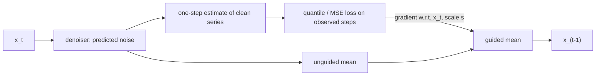

## Abstract

TSDiff asks whether a time-series diffusion model that never sees a conditioning signal during training can still do conditional work such as forecasting. The proposed answer is a guidance scheme in which the denoiser's own one-step estimate of the clean series plays the role an external classifier plays in image guidance, so observed time steps pull the reverse chain toward themselves without any extra network. A second scheme treats the learned density as an energy-based prior and improves forecasts from any other model with a short Langevin or gradient-descent run in data space. A third use is plain sampling, scored by training forecasters on the synthetic series and testing them on real data, for which the authors introduce a ridge-regression metric, the Linear Predictive Score. On eight univariate benchmarks the guided unconditional model lands close to, and sometimes ahead of, diffusion models trained specifically for forecasting.

**Keywords:** unconditional diffusion, observation self-guidance, asymmetric Laplace, quantile loss, energy-based refinement, Langevin Monte Carlo, Linear Predictive Score, S4

## 1 Introduction

Most diffusion models for time series — TimeGrad, CSDI, SSSD — are conditional by construction: the network receives the history or the observed entries as input and is trained for one forecasting or imputation layout. Change the layout, say to a context window with a blackout at the end, and the model must be retrained. They also give up what diffusion is best known for, unconditional sampling.

The paper reverses the design. <mark>A single model $p_\theta(\mathbf{y})$ is trained on complete windows with the ordinary DDPM loss, and every conditional task is pushed to inference time.</mark> The scope is stated carefully: this is not a foundation model, since one network is still trained per dataset; only the task posed afterwards varies. [Fig. 1 in the paper](https://arxiv.org/pdf/2307.11494#page=2) is a schematic of the three uses — predict, refine, synthesize — around one trained model.

## 2 Background

The forward process is the standard DDPM one, so a noisy version of a clean series $\mathbf{y}$ is available in closed form,

$$
\mathbf{x}_t=\sqrt{\bar\alpha_t}\,\mathbf{y}+\sqrt{1-\bar\alpha_t}\,\boldsymbol\epsilon,\qquad \boldsymbol\epsilon\sim\mathcal{N}(\mathbf{0},\mathbf{I}), \tag{1}
$$

with $\bar\alpha_t=\prod_{i\le t}(1-\beta_i)$ and $\beta_i$ the noise schedule. A network $\epsilon_\theta(\mathbf{x}_t,t)$ regresses $\boldsymbol\epsilon$; the reverse transition is Gaussian with mean $\mu_\theta(\mathbf{x}_t,t)$ and variance $\sigma_t^2$. Classifier guidance (Dhariwal and Nichol) conditions such a model after training: Bayes' rule splits the conditional score into the unconditional score plus the gradient of $\log p(c\mid\mathbf{x}_t)$, normally supplied by a separately trained classifier, and the reverse mean is shifted by $s\,\sigma_t^2$ times that gradient.

## 3 Method

> **Key idea.** The diffusion model can be its own guidance network. One denoising step turns $\mathbf{x}_t$ into a rough estimate of the clean series; how well that estimate matches the observed time steps is a differentiable likelihood, and its gradient steers sampling toward series consistent with the observations.

### 3.1 Setup and architecture

A window $\mathbf{y}\in\mathbb{R}^L$ is split into observed indices (obs) and target indices (ta), not necessarily contiguous; forecasting, forecasting with gaps, and imputation are all instances of sampling $p_\theta(\mathbf{y}_{\text{ta}}\mid\mathbf{y}_{\text{obs}})$. The denoiser follows SSSD: DiffWave-style gated residual blocks with S4 state-space layers mixing along time and 1×1 convolutions mixing channels. The series is univariate, but lagged copies are stacked as channels so the model sees history beyond $L$ ([Fig. 2](https://arxiv.org/pdf/2307.11494#page=4)).

### 3.2 Observation self-guidance

Using $\mathbf{y}_{\text{obs}}$ in place of a class label gives

$$
p_\theta(\mathbf{x}_{t-1}\mid\mathbf{x}_t,\mathbf{y}_{\text{obs}})=\mathcal{N}\!\big(\mathbf{x}_{t-1};\ \mu_\theta(\mathbf{x}_t,t)+s\,\sigma_t^2\,\nabla_{\mathbf{x}_t}\log p_\theta(\mathbf{y}_{\text{obs}}\mid\mathbf{x}_t),\ \sigma_t^2\mathbf{I}\big). \tag{2}
$$

The likelihood is built around the clean-series estimate obtained by inverting (1) with the predicted noise,

$$
\hat{\mathbf{y}}=f_\theta(\mathbf{x}_t,t)=\frac{\mathbf{x}_t-\sqrt{1-\bar\alpha_t}\,\epsilon_\theta(\mathbf{x}_t,t)}{\sqrt{\bar\alpha_t}}. \tag{3}
$$

A unit-variance Gaussian around $\hat{\mathbf{y}}$ makes the log-likelihood an MSE on the observed steps (**TSDiff-MS**). An asymmetric Laplace distribution makes it the pinball loss at quantile level $\kappa\in(0,1)$,

$$
\log p_\theta(\mathbf{y}_{\text{obs}}\mid\mathbf{x}_t)\;\propto\;-\max\!\big\{\kappa\,(\mathbf{y}_{\text{obs}}-\hat{\mathbf{y}}_{\text{obs}}),\ (\kappa-1)\,(\mathbf{y}_{\text{obs}}-\hat{\mathbf{y}}_{\text{obs}})\big\}, \tag{4}
$$

giving **TSDiff-Q**. Each sample path is guided with a different $\kappa$, evenly spaced over $(0,1)$, so the ensemble spreads across quantiles instead of crowding the mean. The gradient in (2) is obtained by backpropagating through the denoiser.

The constraint is soft: generated values at observed positions are pulled toward the data, not set equal to it.

### 3.3 Refinement with the learned density

The second scheme starts from a forecast by any base model. Let $\tilde{\mathbf{y}}$ be the observed context concatenated with that forecast. Refinement samples from, or minimises, the energy

$$
E_\theta(\mathbf{y};\tilde{\mathbf{y}})=-\log p_\theta(\mathbf{y})+\lambda\,R(\mathbf{y},\tilde{\mathbf{y}}), \tag{5}
$$

where $R$ is an MSE or quantile regulariser keeping the result near its starting point and $\lambda=1$. Sampling uses overdamped Langevin dynamics,

$$
\mathbf{y}^{(i+1)}=\mathbf{y}^{(i)}-\eta\,\nabla E_\theta(\mathbf{y}^{(i)};\tilde{\mathbf{y}})+\sqrt{2\eta\gamma}\,\boldsymbol\xi_i,\qquad \boldsymbol\xi_i\sim\mathcal{N}(\mathbf{0},\mathbf{I}), \tag{6}
$$

with step size $\eta$ and noise scale $\gamma$; $\gamma=0$ gives gradient descent toward the most likely series (the "ML" variant). The log-density is replaced by the negative denoising loss, evaluated at a single **representative step** $\tau$ — the diffusion step whose loss is closest to the average over all steps, found once per dataset. <mark>Because the iteration runs directly in data space, refinement is cheaper than a full reverse chain whenever it uses fewer iterations than there are diffusion steps.</mark>

## 4 Experiments

Eight univariate GluonTS datasets are used: Solar, Electricity, Traffic, Exchange, M4, UberTLC, KDDCup and Wikipedia. The metric is CRPS, approximated from 100 sample paths and averaged over three runs. Baselines span classical models, DeepAR, MQ-CNN, DeepState, Transformer, TFT, and two conditional diffusion models: CSDI and **TSDiff-Cond**, the same backbone trained conditionally. The authors state that the aim is parity with task-specific models, not a new state of the art.

Forecasting CRPS (means; lower is better; a subset of the paper's Table 1, bold = column minimum over all methods there):

| Method | Solar | Electricity | Traffic | Exchange | M4 | UberTLC | KDDCup | Wikipedia |
|---|---|---|---|---|---|---|---|---|
| Seasonal Naive | 0.512 | 0.069 | 0.221 | 0.011 | 0.048 | 0.299 | 0.561 | 0.410 |
| DeepAR | 0.389 | 0.054 | 0.099 | 0.011 | 0.052 | **0.161** | 0.414 | 0.231 |
| Transformer | 0.419 | 0.076 | 0.102 | 0.010 | 0.040 | 0.192 | 0.411 | **0.214** |
| TFT | 0.417 | 0.086 | 0.134 | **0.007** | 0.039 | 0.193 | 0.581 | 0.229 |
| CSDI | 0.352 | 0.054 | 0.159 | 0.033 | 0.040 | 0.206 | 0.318 | 0.289 |
| TSDiff-Cond | **0.338** | 0.050 | **0.094** | 0.013 | 0.039 | 0.172 | 0.754 | 0.218 |
| TSDiff-MS | 0.391 | 0.062 | 0.116 | 0.018 | 0.045 | 0.183 | 0.325 | 0.257 |
| **TSDiff-Q** | 0.358 | **0.049** | 0.098 | 0.011 | **0.036** | 0.172 | **0.311** | 0.221 |

<mark>TSDiff-Q has the lowest or second-lowest CRPS on five of the eight datasets without ever being trained to forecast.</mark> <mark>Quantile guidance beats mean-square guidance on every dataset</mark>, which the authors attribute to the match between the pinball loss and the quantile-based metric.

**Missing values.** Half of the context window is masked at inference in three patterns (random, blackout at the start, blackout at the end). TSDiff-Q is the same checkpoint with the same guidance scale; TSDiff-Cond is retrained per pattern. The two are close on most datasets, with TSDiff-Cond slightly ahead on Solar and Traffic, while on KDDCup the conditional model is far worse in every pattern (0.757 against 0.397 under random missingness).

**Refinement.** Twenty iterations are applied to forecasts from Seasonal Naive, Linear, DeepAR and Transformer. <mark>On every dataset at least one refinement variant lowers the base model's CRPS.</mark> Gains are large for point forecasters — Seasonal Naive on Traffic drops from 0.221 to 0.126 — and small for probabilistic ones, e.g. DeepAR on Electricity from 0.054 to 0.052. Langevin noise helps point forecasters most, plausibly by giving them a spread they lack.

**Synthesis.** The Linear Predictive Score (LPS) is the test CRPS of a ridge regression fitted on synthetic windows; the fit is closed-form, so there is no training variance. <mark>On LPS, TSDiff beats TimeVAE and TimeGAN on seven of eight datasets</mark> (TimeGAN edges it on Exchange, 0.011 against 0.012), and on five datasets the linear model trained on TSDiff samples scores better than the one trained on real data. With DeepAR and Transformer downstream, TSDiff still leads on most datasets, Exchange again being the exception.

## 5 Discussion

**Strengths.** Separating training from task is clean and useful: one checkpoint covers forecasting, gap-ridden forecasting and imputation-like queries. The TSDiff-Cond baseline isolates the effect of conditioning from that of architecture. Refinement needs only forecasts from the base system, which suits production pipelines that cannot be retrained, and LPS is a cheap, reproducible replacement for ad hoc downstream-network scores.

**Weaknesses.** Guided sampling needs a gradient through the network at every reverse step; the authors name inference cost as the main limitation. The guidance scale is set per dataset, and the quantile likelihood mirrors the evaluation metric, so part of TSDiff-Q's edge may be metric alignment. Approximating $\log p_\theta$ by the loss at one diffusion step is a heuristic checked only indirectly through CRPS.

**Not shown.** Everything is univariate; the multivariate extension gets a sentence and no test. There is no calibration analysis beyond CRPS. Exchange — the only financial dataset — is where the approach is least convincing: TFT and classical forecasts are at least as good, and downstream models trained on TSDiff samples do worse than on real data.

## 6 Takeaways

- An unconditional diffusion model plus a likelihood on its own one-step denoised estimate yields forecasts competitive with conditionally trained diffusion models.
- The guidance likelihood is a real design choice; pinball-loss guidance with a different quantile level per sample path gives better-spread ensembles than Gaussian guidance.
- The learned density works as a plug-in prior: a short Langevin run in data space improves black-box forecasts at a fraction of the cost of reverse diffusion.
- LPS (ridge regression, train on synthetic, test on real) is a low-variance score for time-series generators.
- For financial series, inference-time conditioning is attractive — one generative model of return windows could answer scenario queries with arbitrary observed subsets — but the paper's own exchange-rate evidence is weak, and heavy tails and volatility clustering are not examined.

## References

1. Kollovieh, M., Ansari, A. F., Bohlke-Schneider, M., Zschiegner, J., Wang, H., Wang, Y. *Predict, Refine, Synthesize: Self-Guiding Diffusion Models for Probabilistic Time Series Forecasting.* NeurIPS 2023. [arXiv:2307.11494](https://arxiv.org/abs/2307.11494)
2. Dhariwal, P., Nichol, A. *Diffusion Models Beat GANs on Image Synthesis.* NeurIPS 2021. [arXiv:2105.05233](https://arxiv.org/abs/2105.05233)
3. Tashiro, Y., Song, J., Song, Y., Ermon, S. *CSDI: Conditional Score-based Diffusion Models for Probabilistic Time Series Imputation.* NeurIPS 2021. [arXiv:2107.03502](https://arxiv.org/abs/2107.03502)
4. Alcaraz, J. M. L., Strodthoff, N. *Diffusion-based Time Series Imputation and Forecasting with Structured State Space Models (SSSD).* [arXiv:2208.09399](https://arxiv.org/abs/2208.09399)
5. Rasul, K., Seward, C., Schuster, I., Vollgraf, R. *Autoregressive Denoising Diffusion Models for Multivariate Probabilistic Time Series Forecasting.* ICML 2021. [arXiv:2101.12072](https://arxiv.org/abs/2101.12072)
