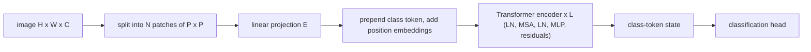

## Abstract

This paper asks how little an NLP Transformer needs to be changed to classify images, and the answer is: almost not at all. An image is cut into fixed-size square patches, each patch is flattened and linearly projected, and the resulting token sequence goes through a standard pre-norm Transformer encoder with a learnable classification token. Trained only on ImageNet, this model is a few points worse than a comparable ResNet, because it lacks the locality and translation-equivariance priors that convolutions provide for free. Pre-trained on ImageNet-21k or the 300M-image JFT dataset, however, the ranking reverses, and the largest model reaches 88.55% top-1 on ImageNet while using a fraction of the pre-training compute of the strongest CNN baselines.

**Keywords:** Vision Transformer, patch embedding, self-attention, inductive bias, large-scale pre-training, transfer learning, JFT-300M

## 1 Introduction

In NLP, pre-training a large Transformer on a huge corpus and fine-tuning on a small task had become standard by 2020. Vision had not followed. Attention had been bolted onto CNNs or used to replace individual convolutions, and the attention-only designs relied on specialized patterns that were theoretically efficient but awkward to run fast on accelerators. In large-scale recognition, ResNet-style networks were still the state of the art.

The authors take the opposite approach to those designs: use the standard Transformer with the fewest possible modifications, so that existing efficient implementations and scaling know-how carry over directly. The initial result is discouraging. On a mid-sized dataset such as ImageNet, without strong regularization, the model lands a few percentage points under ResNets of similar size. The paper's thesis is that this is a data-regime effect, summarized in its own phrase that "large scale training trumps inductive bias".

## 2 Background

**Self-attention cost.** Letting every pixel attend to every other pixel is quadratic in the number of pixels and does not scale to realistic resolutions. Earlier work therefore used local, sparse or axial approximations. ViT sidesteps the issue by making tokens coarse: with $16\times16$ patches the sequence is short enough for ordinary global attention.

**Closest prior work.** Cordonnier et al. (2020) also applied full self-attention to patches, but with $2\times2$ patches, which restricts the model to small images, and without the large-scale pre-training that is the point here.

**Baselines.** The CNN comparison point is Big Transfer (BiT): ResNets with group normalization and standardized convolutions, pre-trained with supervision on the same large datasets. So ViT is compared against CNNs that also got the big data.

## 3 Method

> **Key idea.** Treat an image as a sentence. Chop it into $P\times P$ patches, linearly embed each one as a token, add learned position embeddings, and run an unmodified Transformer encoder. Whatever spatial structure the model needs, it must learn from data.

### 3.1 From image to token sequence

An image $\mathbf{x}\in\mathbb{R}^{H\times W\times C}$ (height, width, channels) is reshaped into $N = HW/P^2$ flattened patches $\mathbf{x}_p^i\in\mathbb{R}^{P^2 C}$, where $P$ is the patch side length. $N$ is the Transformer's sequence length. Each patch is mapped to the model width $D$ by a trainable matrix $\mathbf{E}$, a learnable class token $\mathbf{x}_\text{class}$ is prepended, and learned 1D position embeddings $\mathbf{E}_{pos}$ are added:

$$
\mathbf{z}_0 = [\mathbf{x}_\text{class};\ \mathbf{x}_p^1\mathbf{E};\ \dots;\ \mathbf{x}_p^N\mathbf{E}] + \mathbf{E}_{pos},\qquad \mathbf{E}\in\mathbb{R}^{(P^2C)\times D},\ \mathbf{E}_{pos}\in\mathbb{R}^{(N+1)\times D}. \tag{1}
$$

### 3.2 Encoder

Each of the $L$ layers applies multi-head self-attention (MSA) and then a two-layer MLP with GELU, each preceded by LayerNorm (LN) and wrapped in a residual connection:

$$
\mathbf{z}'_\ell = \mathrm{MSA}(\mathrm{LN}(\mathbf{z}_{\ell-1})) + \mathbf{z}_{\ell-1}, \tag{2}
$$

$$
\mathbf{z}_\ell = \mathrm{MLP}(\mathrm{LN}(\mathbf{z}'_\ell)) + \mathbf{z}'_\ell,\qquad \ell = 1,\dots,L. \tag{3}
$$

The image representation is the final state of the class token,

$$
\mathbf{y} = \mathrm{LN}(\mathbf{z}_L^0), \tag{4}
$$

to which a classification head is attached (an MLP with one hidden layer during pre-training, a single linear layer for fine-tuning). The residual wiring of Eqs. (2)–(3) is ResNet's, now around attention and MLP blocks. The paper's overview diagram is [Fig. 1 in the paper](https://arxiv.org/pdf/2010.11929#page=3); a minimal sketch:

### 3.3 What inductive bias remains

In a CNN, locality, 2D neighbourhood structure and translation equivariance are built into every layer. In ViT only the MLPs are local and translation-equivariant; attention is global from layer one. <mark>The 2D structure of the image enters in exactly two places: cutting patches, and interpolating position embeddings when resolution changes.</mark> Position embeddings carry no 2D information at initialization.

A **hybrid** variant replaces raw patches with a CNN feature map, applying $\mathbf{E}$ to (possibly $1\times1$) patches of that map.

### 3.4 Fine-tuning at higher resolution

For transfer, the pre-training head is replaced by a zero-initialized $D\times K$ linear layer, $K$ being the number of target classes. Fine-tuning is often done at higher resolution with the patch size unchanged, which lengthens the sequence; the pre-trained position embeddings are then 2D-interpolated to the new grid.

### 3.5 Model variants

| Model | Layers | Hidden size $D$ | MLP size | Heads | Params |
|---|---|---|---|---|---|
| ViT-Base | 12 | 768 | 3072 | 12 | 86M |
| ViT-Large | 24 | 1024 | 4096 | 16 | 307M |
| ViT-Huge | 32 | 1280 | 5120 | 16 | 632M |

"ViT-L/16" denotes the Large model with $16\times16$ patches. Since sequence length scales inversely with $P^2$, smaller patches are more expensive.

## 4 Experiments

**Setup.** Pre-training datasets are ImageNet (1.3M images, 1k classes), ImageNet-21k (14M images, 21k classes) and JFT (303M images, 18k classes), de-duplicated against downstream test sets. All models, ResNets included, are pre-trained with Adam, batch size 4096 and weight decay 0.1; fine-tuning uses SGD with momentum. The ImageNet numbers below use fine-tuning resolution 512 (ViT-L/16) or 518 (ViT-H/14). VTAB is a 19-task suite with 1,000 training examples per task.

**Main comparison** (accuracy %, mean ± std over three fine-tuning runs; compute in TPUv3-core-days):

| | **ViT-H/14 (JFT)** | ViT-L/16 (JFT) | ViT-L/16 (I21k) | BiT-L (ResNet152x4) | Noisy Student (EfficientNet-L2) |
|---|---|---|---|---|---|
| ImageNet | **88.55 ± 0.04** | 87.76 ± 0.03 | 85.30 ± 0.02 | 87.54 ± 0.02 | 88.4 / 88.5* |
| ImageNet ReaL | **90.72 ± 0.05** | 90.54 ± 0.03 | 88.62 ± 0.05 | 90.54 | 90.55 |
| CIFAR-10 | **99.50 ± 0.06** | 99.42 ± 0.03 | 99.15 ± 0.03 | 99.37 ± 0.06 | – |
| CIFAR-100 | **94.55 ± 0.04** | 93.90 ± 0.05 | 93.25 ± 0.05 | 93.51 ± 0.08 | – |
| Oxford-IIIT Pets | **97.56 ± 0.03** | 97.32 ± 0.11 | 94.67 ± 0.15 | 96.62 ± 0.23 | – |
| Oxford Flowers-102 | 99.68 ± 0.02 | **99.74 ± 0.00** | 99.61 ± 0.02 | 99.63 ± 0.03 | – |
| VTAB (19 tasks) | **77.63 ± 0.23** | 76.28 ± 0.46 | 72.72 ± 0.21 | 76.29 ± 1.70 | – |
| TPUv3-core-days | 2.5k | 0.68k | 0.23k | 9.9k | 12.3k |

\*The 88.5 figure is a slightly improved result the paper cites from Touvron et al. (2020).

<mark>ViT-L/16 pre-trained on JFT beats BiT-L, pre-trained on the same data, on every listed task while using 0.68k instead of 9.9k TPUv3-core-days.</mark> ViT-H/14 improves further, mostly on the harder datasets. The ImageNet-21k model is weaker but trainable on a single 8-core cloud TPUv3 in roughly 30 days. The authors caution that this comparison mixes architecture with training choices and point to their controlled study.

**How much data is needed.** Two experiments address this. In the first ([Fig. 3 in the paper](https://arxiv.org/pdf/2010.11929#page=7)), models are pre-trained on the three datasets with tuned weight decay, dropout and label smoothing. On ImageNet alone, ViT-Large is *worse* than ViT-Base; on ImageNet-21k they are similar; only on JFT does the larger model pull ahead, and only there does ViT clearly pass the BiT range. In the second ([Fig. 4](https://arxiv.org/pdf/2010.11929#page=7)), models are trained on random JFT subsets of 9M, 30M, 90M and the full 300M with identical hyper-parameters, and evaluated by few-shot linear probes. <mark>ViT-B/32 is much worse than a comparably priced ResNet50 on the 9M subset and better from 90M upward</mark>; the same crossover holds for ViT-L/16 against ResNet152x2.

**Controlled scaling study.** Seven ResNets, six ViTs and five hybrids are pre-trained on JFT for 7 or 14 epochs and plotted against pre-training compute ([Fig. 5](https://arxiv.org/pdf/2010.11929#page=7)). <mark>ViT reaches the same average transfer accuracy with approximately 2–4× less compute than ResNets.</mark> Hybrids have a small edge at low budgets that disappears for larger models, and ViT shows no saturation within the tested range.

**Inspection.** Position-embedding similarity recovers row/column structure and distance, which explains why hand-built 2D embeddings did not help. Mean attention distance shows that some heads attend globally already in the lowest layers while others stay local, and attention distance grows with depth ([Fig. 7](https://arxiv.org/pdf/2010.11929#page=9)).

**Self-supervision.** A preliminary masked-patch-prediction experiment brings ViT-B/16 to 79.9% on ImageNet, 2% above training from scratch and 4% below supervised pre-training.

## 5 Discussion

**Strengths.** The design is deliberately boring, which makes the conclusion sharper: nothing clever in the architecture explains the results, so data scale must. The CNN baselines receive the same pre-training data and optimizer, the compute accounting is explicit, and the subset experiment without extra regularization separates an intrinsic property of the model from tuning effort.

**Weaknesses.** The headline results depend on JFT-300M, which is not public, so the most important regime cannot be reproduced outside the authors' organization. On the public ImageNet-21k the model is good but does not beat BiT-L on ImageNet (85.30 vs 87.54). The message for practitioners with ImageNet-scale data is essentially negative, and the paper offers no remedy beyond basic regularization. Only classification is evaluated; detection and segmentation are named as future work, and a single-resolution $16\times$-downsampled token grid is not an obvious fit for dense prediction.

**Not shown.** There is no analysis of why the crossover happens where it does, and the self-supervised result is a single preliminary number. Global attention still scales quadratically with token count, which becomes relevant at the higher fine-tuning resolutions.

## 6 Takeaways

- A standard Transformer encoder on $16\times16$ patch tokens is sufficient for state-of-the-art image classification, given enough pre-training data.
- Inductive bias and data are substitutes: in the JFT-subset experiment convolutional priors win at 9M pre-training images and lose from 90M upward.
- In the controlled study, ViT needs roughly 2–4× less pre-training compute than ResNets for equal transfer accuracy, and does not saturate in the tested range.
- Bigger is not automatically better: on ImageNet-only pre-training, ViT-Large underperforms ViT-Base.
- For generative models of financial time series the lesson is a caution: such datasets are small next to the regime where ViT wins, and by this paper's own evidence that is where architectures with strong priors should be preferred over a generic Transformer. Patch tokens map naturally onto sequence segments, but the paper gives no evidence on non-image data.

## References

1. A. Dosovitskiy et al. *An Image is Worth 16x16 Words: Transformers for Image Recognition at Scale.* ICLR 2021. arXiv:2010.11929.
2. A. Vaswani et al. *Attention Is All You Need.* NIPS 2017.
3. A. Kolesnikov et al. *Big Transfer (BiT): General Visual Representation Learning.* ECCV 2020.
4. J.-B. Cordonnier, A. Loukas, M. Jaggi. *On the Relationship between Self-Attention and Convolutional Layers.* ICLR 2020.
5. K. He, X. Zhang, S. Ren, J. Sun. *Deep Residual Learning for Image Recognition.* CVPR 2016.
